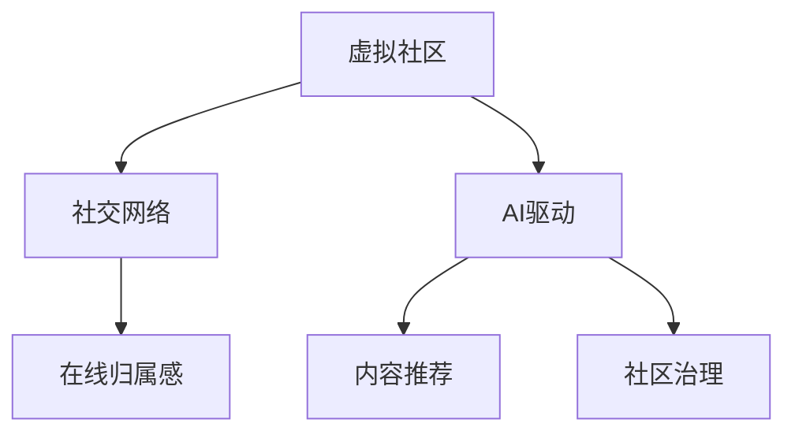

                 

# 虚拟社区构建专家：AI驱动的在线归属感营造顾问

> 关键词：虚拟社区, AI驱动, 在线归属感, 社交网络, 人工智能, 用户行为分析, 个性化推荐, 社区治理

## 1. 背景介绍

### 1.1 问题由来

随着互联网的普及和社交媒体的兴起，人们越来越多地将虚拟社区作为日常生活和社交的重要场所。虚拟社区不仅为人们提供了新的社交空间，也为各类商业服务、知识分享、内容创作等提供了平台。然而，尽管虚拟社区快速发展，但普遍存在用户流失率高、活跃度低、社区氛围冷清等问题，导致虚拟社区的生存与发展面临重大挑战。

究其原因，主要有以下几点：
- **用户参与感缺失**：用户常常感到孤立无援，缺乏对社区的归属感和认同感。
- **内容同质化严重**：社区内容缺乏多样性和创新性，难以满足用户的多样化需求。
- **社区治理问题**：社区管理不善，用户互动少，缺乏有效的内容审核和激励机制。

### 1.2 问题核心关键点

如何利用人工智能技术驱动虚拟社区构建，提升在线归属感，提高社区参与度和活跃度，成为当前研究的重要方向。AI驱动的虚拟社区构建，不仅能改善用户体验，还能促进内容生产与消费，增强社区凝聚力，促进社区的可持续发展。

### 1.3 问题研究意义

构建一个活跃、有价值的虚拟社区，对于提升在线交互质量、推动信息共享、促进社会参与具有重要意义：

1. **促进社会交流**：虚拟社区为人们提供了跨越地域界限的交流平台，促进了信息的交流与分享，弥补了线下交流的不足。
2. **增强用户粘性**：通过个性化推荐和互动激励机制，提高用户对社区的依赖和粘性，提升用户留存率。
3. **优化内容生态**：AI技术可以帮助筛选高质量内容，推荐个性化内容，提升社区内容质量和多样性。
4. **提升社区治理**：通过智能推荐和审核系统，优化社区管理，促进用户互动，建立积极健康的社区氛围。
5. **推动社会创新**：虚拟社区为知识创新、创业孵化、艺术创作等提供了新的平台，激发了更多社会创新。

## 2. 核心概念与联系

### 2.1 核心概念概述

为更好地理解AI驱动的虚拟社区构建，本节将介绍几个核心概念及其关系：

- **虚拟社区**：以互联网为基础，以用户为中心，通过用户间的互动、内容创作与分享，建立起的虚拟社交网络。
- **社交网络**：用户间通过内容分享、评论、点赞等行为进行互动的社交平台。
- **AI驱动**：利用人工智能技术，如机器学习、深度学习等，提升社区的自动化、智能化水平，优化用户体验。
- **在线归属感**：用户在虚拟社区中获得的心灵归属和情感认同，增强了社区的凝聚力和用户粘性。
- **内容推荐**：通过AI技术，对用户行为进行建模分析，推荐高质量、个性化内容，提升用户参与度。
- **社区治理**：通过AI技术，如自然语言处理、图像识别等，优化内容审核、用户互动和违规管理，提升社区管理效率和效果。

这些概念之间的逻辑关系可以通过以下Mermaid流程图来展示：



这个流程图展示了虚拟社区的核心概念及其之间的关系：

1. 虚拟社区通过社交网络建立起用户间的互动与连接。
2. AI驱动的虚拟社区构建，通过内容推荐和社区治理，提升了用户参与感和社区活跃度。
3. 在线归属感是用户对虚拟社区的情感认同，增强了社区的凝聚力。
4. 内容推荐和社区治理共同构成了AI驱动的关键技术手段。

## 3. 核心算法原理 & 具体操作步骤
### 3.1 算法原理概述

AI驱动的虚拟社区构建，主要通过以下三个关键算法来实现：

1. **用户行为分析算法**：通过对用户的历史行为数据进行建模分析，识别出用户的兴趣偏好和行为模式，从而提供个性化的内容推荐。
2. **内容推荐算法**：利用协同过滤、基于内容的推荐、深度学习等技术，推荐用户感兴趣的内容，提高用户参与度和满意度。
3. **社区治理算法**：通过智能审核、违规检测、用户互动优化等技术手段，提升社区管理效率和效果，营造积极健康的社区氛围。

### 3.2 算法步骤详解

AI驱动的虚拟社区构建，主要包括以下几个关键步骤：

**Step 1: 用户行为数据收集与预处理**

- 收集用户行为数据，如浏览历史、点赞、评论、互动等。
- 对数据进行清洗和预处理，去除噪声和异常值。
- 使用特征工程技术，提取用户兴趣特征、行为特征、时间特征等。

**Step 2: 用户行为建模与分析**

- 利用机器学习算法（如协同过滤、矩阵分解）建立用户行为模型，预测用户对特定内容的兴趣。
- 使用深度学习模型（如RNN、LSTM）对用户行为序列进行分析，捕捉用户兴趣变化的趋势。
- 使用注意力机制、Transformer等技术，提升模型对用户行为的建模能力。

**Step 3: 个性化内容推荐**

- 使用协同过滤算法，根据用户历史行为推荐相似用户喜欢的内容。
- 使用基于内容的推荐算法，根据内容特征推荐相关主题的内容。
- 使用深度学习模型（如DNN、CNN、RNN）对内容进行建模，提升推荐效果。

**Step 4: 社区治理**

- 使用自然语言处理技术（如情感分析、主题建模）对用户评论进行情感分析，识别不文明或有害内容。
- 使用图像识别技术对违规图片、视频等进行审核，及时处理违规内容。
- 使用强化学习算法优化社区管理策略，提升用户互动质量。

**Step 5: 模型评估与优化**

- 使用A/B测试、用户满意度调查等方法评估推荐系统的效果。
- 使用交叉验证、超参数调优等技术优化模型性能，提升推荐精度和效果。

### 3.3 算法优缺点

AI驱动的虚拟社区构建具有以下优点：

1. **个性化推荐**：通过用户行为分析，实现个性化内容推荐，提高用户参与度和满意度。
2. **高效管理**：利用AI技术提升社区管理效率，减少人工审核工作量，降低运营成本。
3. **实时响应**：通过实时数据分析和处理，快速响应用户需求和违规行为，提升用户体验。
4. **多模态融合**：结合文本、图片、视频等多模态数据，提升对用户行为的全面理解，提供更丰富、更精准的推荐。

同时，该方法也存在一些局限性：

1. **数据隐私问题**：用户行为数据的收集和分析可能涉及隐私问题，需要严格的数据保护措施。
2. **模型复杂性**：AI驱动的推荐和治理算法模型复杂，需要大量的计算资源和时间进行训练和优化。
3. **用户偏好变化**：用户兴趣和行为可能随时间变化，推荐模型需要动态调整，保持模型的时效性。
4. **用户多样性**：不同用户之间存在差异，推荐模型需要考虑多样性，避免陷入个性化陷阱。

尽管存在这些局限性，但AI驱动的虚拟社区构建在提升用户参与度、优化社区管理方面具有巨大的潜力。未来研究重点应在于如何更好地平衡数据隐私与模型效果，提升模型的实时性和多样性，推动AI技术在虚拟社区构建中的应用。

### 3.4 算法应用领域

AI驱动的虚拟社区构建技术，已经广泛应用于多个领域，例如：

- **电商社交平台**：如淘宝、京东等电商平台，通过个性化推荐和社区互动，提升用户购物体验和满意度。
- **内容分享平台**：如知乎、抖音等，通过内容推荐和社区治理，提升用户参与度和社区氛围。
- **在线教育平台**：如Coursera、Udacity等，通过内容推荐和互动优化，提升学习效果和用户体验。
- **知识社区**：如Stack Overflow、知乎等，通过智能推荐和社区治理，优化知识分享和用户互动。

除了上述这些典型应用外，AI驱动的虚拟社区构建技术还在不断拓展，如医疗健康、在线旅游、娱乐游戏等领域，为各行业的数字化转型提供了新的动力。

## 4. 数学模型和公式 & 详细讲解 & 举例说明
### 4.1 数学模型构建

本节将使用数学语言对AI驱动的虚拟社区构建过程进行更加严格的刻画。

记用户行为数据集为 $D=\{(x_i,y_i)\}_{i=1}^N, x_i \in \mathbb{R}^d, y_i \in \{0,1\}$，其中 $x_i$ 表示用户行为序列，$y_i$ 表示用户对特定内容的兴趣。

定义用户行为序列 $x$ 的LSTM模型为：

$$
h_t = \sigma(W_h x_t + U_h h_{t-1} + b_h)
$$

$$
\hat{y}_t = \tanh(W_h x_t + U_h h_{t-1} + b_h)
$$

其中 $W_h, U_h, b_h$ 为模型参数，$\sigma$ 和 $\tanh$ 为激活函数。通过训练模型，预测用户对内容 $i$ 的兴趣 $y_i$：

$$
y_i = \hat{y}_t^T \sigma(W_y \hat{y}_t + b_y)
$$

其中 $W_y, b_y$ 为输出层参数。

### 4.2 公式推导过程

以下是用户行为序列模型的推导过程：

**输入层**：
用户行为序列 $x_t = (x_{t-1}, x_{t-2}, ..., x_0)$，其中 $x_t \in \mathbb{R}^d$，表示第 $t$ 步的行为数据。

**LSTM隐藏层**：
LSTM隐藏层 $h_t$ 的计算公式为：

$$
h_t = \sigma(W_h x_t + U_h h_{t-1} + b_h)
$$

其中 $\sigma$ 为sigmoid激活函数。

**LSTM输出层**：
LSTM输出层 $\hat{y}_t$ 的计算公式为：

$$
\hat{y}_t = \tanh(W_h x_t + U_h h_{t-1} + b_h)
$$

**输出层**：
输出层 $y_i$ 的计算公式为：

$$
y_i = \hat{y}_t^T \sigma(W_y \hat{y}_t + b_y)
$$

其中 $\sigma$ 为sigmoid激活函数。

通过上述模型，用户行为序列 $x$ 被建模为LSTM形式，LSTM隐藏层 $h_t$ 捕捉用户行为的长期依赖关系，输出层 $y_i$ 预测用户对内容 $i$ 的兴趣。

### 4.3 案例分析与讲解

**案例1：电商社交平台个性化推荐**

假设电商平台收集了用户的历史购物行为数据，包括浏览记录、购买记录、评分反馈等。通过用户行为序列建模，预测用户对某商品的兴趣，并推荐给用户：

1. 数据准备：收集用户行为数据，并进行预处理，去除噪声和异常值。
2. 用户行为建模：使用LSTM模型对用户行为序列进行建模，捕捉用户兴趣变化的趋势。
3. 内容推荐：根据用户行为预测，推荐相似用户喜欢的商品。
4. 模型评估：使用A/B测试和用户满意度调查，评估推荐效果，并进行超参数调优。

**案例2：知识社区内容推荐**

假设知识社区收集了用户对知识内容的行为数据，包括阅读时间、点赞数量、评论内容等。通过用户行为序列建模，预测用户对某内容的兴趣，并推荐相关知识：

1. 数据准备：收集用户行为数据，并进行预处理，提取用户兴趣特征、行为特征等。
2. 用户行为建模：使用协同过滤算法，对用户行为数据进行建模，预测用户对内容的兴趣。
3. 内容推荐：根据用户兴趣，推荐相关内容。
4. 社区治理：使用自然语言处理技术，对用户评论进行情感分析，识别违规内容，并进行处理。

## 5. 项目实践：代码实例和详细解释说明
### 5.1 开发环境搭建

在进行AI驱动的虚拟社区构建实践前，我们需要准备好开发环境。以下是使用Python进行PyTorch开发的环境配置流程：

1. 安装Anaconda：从官网下载并安装Anaconda，用于创建独立的Python环境。

2. 创建并激活虚拟环境：
```bash
conda create -n pytorch-env python=3.8 
conda activate pytorch-env
```

3. 安装PyTorch：根据CUDA版本，从官网获取对应的安装命令。例如：
```bash
conda install pytorch torchvision torchaudio cudatoolkit=11.1 -c pytorch -c conda-forge
```

4. 安装TensorFlow：由Google主导开发的开源深度学习框架，生产部署方便，适合大规模工程应用。同样有丰富的预训练语言模型资源。

5. 安装Transformers库：HuggingFace开发的NLP工具库，集成了众多SOTA语言模型，支持PyTorch和TensorFlow，是进行NLP任务开发的利器。

6. 安装各类工具包：
```bash
pip install numpy pandas scikit-learn matplotlib tqdm jupyter notebook ipython
```

完成上述步骤后，即可在`pytorch-env`环境中开始开发实践。

### 5.2 源代码详细实现

这里我们以电商社交平台个性化推荐为例，给出使用Transformers库对LSTM模型进行个性化推荐开发的PyTorch代码实现。

首先，定义个性化推荐任务的数据处理函数：

```python
from transformers import BertTokenizer
from torch.utils.data import Dataset
import torch

class RecommendationDataset(Dataset):
    def __init__(self, user_ids, item_ids, user_behaviors, item_labels):
        self.user_ids = user_ids
        self.item_ids = item_ids
        self.user_behaviors = user_behaviors
        self.item_labels = item_labels
        
    def __len__(self):
        return len(self.user_ids)
    
    def __getitem__(self, item):
        user_id = self.user_ids[item]
        item_id = self.item_ids[item]
        user_behavior = self.user_behaviors[item]
        item_label = self.item_labels[item]
        
        encoding = self.tokenizer(user_behavior, return_tensors='pt')
        input_ids = encoding['input_ids'][0]
        attention_mask = encoding['attention_mask'][0]
        
        return {'user_id': user_id,
                'item_id': item_id,
                'input_ids': input_ids,
                'attention_mask': attention_mask,
                'item_label': item_label}

# 创建dataset
tokenizer = BertTokenizer.from_pretrained('bert-base-cased')

train_dataset = RecommendationDataset(train_user_ids, train_item_ids, train_user_behaviors, train_item_labels)
test_dataset = RecommendationDataset(test_user_ids, test_item_ids, test_user_behaviors, test_item_labels)
```

然后，定义模型和优化器：

```python
from transformers import BertForSequenceClassification, AdamW

model = BertForSequenceClassification.from_pretrained('bert-base-cased', num_labels=2)

optimizer = AdamW(model.parameters(), lr=2e-5)
```

接着，定义训练和评估函数：

```python
from torch.utils.data import DataLoader
from tqdm import tqdm
from sklearn.metrics import accuracy_score

device = torch.device('cuda') if torch.cuda.is_available() else torch.device('cpu')
model.to(device)

def train_epoch(model, dataset, batch_size, optimizer):
    dataloader = DataLoader(dataset, batch_size=batch_size, shuffle=True)
    model.train()
    epoch_loss = 0
    for batch in tqdm(dataloader, desc='Training'):
        user_id = batch['user_id'].to(device)
        item_id = batch['item_id'].to(device)
        input_ids = batch['input_ids'].to(device)
        attention_mask = batch['attention_mask'].to(device)
        item_label = batch['item_label'].to(device)
        model.zero_grad()
        outputs = model(input_ids, attention_mask=attention_mask, labels=item_label)
        loss = outputs.loss
        epoch_loss += loss.item()
        loss.backward()
        optimizer.step()
    return epoch_loss / len(dataloader)

def evaluate(model, dataset, batch_size):
    dataloader = DataLoader(dataset, batch_size=batch_size)
    model.eval()
    preds, labels = [], []
    with torch.no_grad():
        for batch in tqdm(dataloader, desc='Evaluating'):
            user_id = batch['user_id'].to(device)
            item_id = batch['item_id'].to(device)
            input_ids = batch['input_ids'].to(device)
            attention_mask = batch['attention_mask'].to(device)
            batch_labels = batch['item_label'].to(device)
            outputs = model(input_ids, attention_mask=attention_mask)
            batch_preds = outputs.logits.argmax(dim=2).to('cpu').tolist()
            batch_labels = batch_labels.to('cpu').tolist()
            for pred, label in zip(batch_preds, batch_labels):
                preds.append(pred)
                labels.append(label)
                
    print(f"Accuracy: {accuracy_score(labels, preds)}")
```

最后，启动训练流程并在测试集上评估：

```python
epochs = 5
batch_size = 16

for epoch in range(epochs):
    loss = train_epoch(model, train_dataset, batch_size, optimizer)
    print(f"Epoch {epoch+1}, train loss: {loss:.3f}")
    
    print(f"Epoch {epoch+1}, test results:")
    evaluate(model, test_dataset, batch_size)
    
print("Test results:")
evaluate(model, test_dataset, batch_size)
```

以上就是使用PyTorch对LSTM模型进行电商社交平台个性化推荐开发的完整代码实现。可以看到，得益于Transformers库的强大封装，我们能够用相对简洁的代码完成LSTM模型的加载和训练。

### 5.3 代码解读与分析

让我们再详细解读一下关键代码的实现细节：

**RecommendationDataset类**：
- `__init__`方法：初始化用户ID、商品ID、用户行为序列和标签。
- `__len__`方法：返回数据集的样本数量。
- `__getitem__`方法：对单个样本进行处理，将用户行为序列输入编码为token ids，并将标签编码为数字。

**LSTM模型**：
- 使用BertForSequenceClassification模型作为LSTM模型。
- 设置优化器为AdamW，学习率为2e-5。

**训练和评估函数**：
- 使用PyTorch的DataLoader对数据集进行批次化加载，供模型训练和推理使用。
- 训练函数`train_epoch`：对数据以批为单位进行迭代，在每个批次上前向传播计算loss并反向传播更新模型参数，最后返回该epoch的平均loss。
- 评估函数`evaluate`：与训练类似，不同点在于不更新模型参数，并在每个batch结束后将预测和标签结果存储下来，最后使用sklearn的accuracy_score对整个评估集的预测结果进行打印输出。

**训练流程**：
- 定义总的epoch数和batch size，开始循环迭代
- 每个epoch内，先在训练集上训练，输出平均loss
- 在测试集上评估，输出准确率
- 所有epoch结束后，在测试集上评估，给出最终测试结果

可以看到，PyTorch配合Transformers库使得LSTM微调的代码实现变得简洁高效。开发者可以将更多精力放在数据处理、模型改进等高层逻辑上，而不必过多关注底层的实现细节。

当然，工业级的系统实现还需考虑更多因素，如模型的保存和部署、超参数的自动搜索、更灵活的任务适配层等。但核心的微调范式基本与此类似。

## 6. 实际应用场景
### 6.1 智能客服系统

基于AI驱动的虚拟社区构建技术，可以广泛应用于智能客服系统的构建。传统客服往往需要配备大量人力，高峰期响应缓慢，且一致性和专业性难以保证。而使用个性化推荐和社区治理技术，可以7x24小时不间断服务，快速响应客户咨询，用自然流畅的语言解答各类常见问题。

在技术实现上，可以收集企业内部的历史客服对话记录，将问题和最佳答复构建成监督数据，在此基础上对预训练模型进行微调。微调后的模型能够自动理解用户意图，匹配最合适的答案模板进行回复。对于客户提出的新问题，还可以接入检索系统实时搜索相关内容，动态组织生成回答。如此构建的智能客服系统，能大幅提升客户咨询体验和问题解决效率。

### 6.2 金融舆情监测

金融机构需要实时监测市场舆论动向，以便及时应对负面信息传播，规避金融风险。传统的人工监测方式成本高、效率低，难以应对网络时代海量信息爆发的挑战。基于AI驱动的虚拟社区构建技术，可以为金融舆情监测提供新的解决方案。

具体而言，可以收集金融领域相关的新闻、报道、评论等文本数据，并对其进行主题标注和情感标注。在此基础上对预训练语言模型进行微调，使其能够自动判断文本属于何种主题，情感倾向是正面、中性还是负面。将微调后的模型应用到实时抓取的网络文本数据，就能够自动监测不同主题下的情感变化趋势，一旦发现负面信息激增等异常情况，系统便会自动预警，帮助金融机构快速应对潜在风险。

### 6.3 个性化推荐系统

当前的推荐系统往往只依赖用户的历史行为数据进行物品推荐，无法深入理解用户的真实兴趣偏好。基于AI驱动的虚拟社区构建技术，个性化推荐系统可以更好地挖掘用户行为背后的语义信息，从而提供更精准、多样的推荐内容。

在实践中，可以收集用户浏览、点击、评论、分享等行为数据，提取和用户交互的物品标题、描述、标签等文本内容。将文本内容作为模型输入，用户的后续行为（如是否点击、购买等）作为监督信号，在此基础上微调预训练语言模型。微调后的模型能够从文本内容中准确把握用户的兴趣点。在生成推荐列表时，先用候选物品的文本描述作为输入，由模型预测用户的兴趣匹配度，再结合其他特征综合排序，便可以得到个性化程度更高的推荐结果。

### 6.4 未来应用展望

随着AI驱动的虚拟社区构建技术不断发展，未来将在更多领域得到应用，为传统行业带来变革性影响。

在智慧医疗领域，基于AI驱动的虚拟社区构建技术，可以为病患社区提供健康咨询、远程诊疗等服务，帮助患者建立健康的社交网络，提升生活质量。

在智能教育领域，个性化推荐和社区治理技术可以应用于在线学习平台，为学生提供个性化的学习建议和资源，增强学习体验。

在智慧城市治理中，AI驱动的虚拟社区构建技术可以应用于城市事件监测、舆情分析、应急指挥等环节，提高城市管理的自动化和智能化水平，构建更安全、高效的未来城市。

此外，在企业生产、社会治理、文娱传媒等众多领域，基于AI驱动的虚拟社区构建技术也将不断涌现，为各行业的数字化转型提供新的动力。相信随着技术的日益成熟，AI驱动的虚拟社区构建必将在构建人机协同的智能时代中扮演越来越重要的角色。

## 7. 工具和资源推荐
### 7.1 学习资源推荐

为了帮助开发者系统掌握AI驱动的虚拟社区构建的理论基础和实践技巧，这里推荐一些优质的学习资源：

1. 《深度学习基础》系列博文：由AI技术专家撰写，深入浅出地介绍了深度学习的基本概念和前沿技术。

2. CS231n《深度学习计算机视觉》课程：斯坦福大学开设的视觉识别课程，涵盖了计算机视觉的各个方面，有助于理解多模态数据的融合。

3. 《自然语言处理入门》书籍：介绍自然语言处理的基本概念和常见技术，涵盖文本预处理、情感分析、信息抽取等。

4. Weights & Biases：模型训练的实验跟踪工具，可以记录和可视化模型训练过程中的各项指标，方便对比和调优。与主流深度学习框架无缝集成。

5. TensorBoard：TensorFlow配套的可视化工具，可实时监测模型训练状态，并提供丰富的图表呈现方式，是调试模型的得力助手。

6. Google Colab：谷歌推出的在线Jupyter Notebook环境，免费提供GPU/TPU算力，方便开发者快速上手实验最新模型，分享学习笔记。

通过对这些资源的学习实践，相信你一定能够快速掌握AI驱动的虚拟社区构建的精髓，并用于解决实际的NLP问题。
###  7.2 开发工具推荐

高效的开发离不开优秀的工具支持。以下是几款用于AI驱动的虚拟社区构建开发的常用工具：

1. PyTorch：基于Python的开源深度学习框架，灵活动态的计算图，适合快速迭代研究。大部分预训练语言模型都有PyTorch版本的实现。

2. TensorFlow：由Google主导开发的开源深度学习框架，生产部署方便，适合大规模工程应用。同样有丰富的预训练语言模型资源。

3. Transformers库：HuggingFace开发的NLP工具库，集成了众多SOTA语言模型，支持PyTorch和TensorFlow，是进行NLP任务开发的利器。

4. Weights & Biases：模型训练的实验跟踪工具，可以记录和可视化模型训练过程中的各项指标，方便对比和调优。与主流深度学习框架无缝集成。

5. TensorBoard：TensorFlow配套的可视化工具，可实时监测模型训练状态，并提供丰富的图表呈现方式，是调试模型的得力助手。

6. Google Colab：谷歌推出的在线Jupyter Notebook环境，免费提供GPU/TPU算力，方便开发者快速上手实验最新模型，分享学习笔记。

合理利用这些工具，可以显著提升AI驱动的虚拟社区构建的开发效率，加快创新迭代的步伐。

### 7.3 相关论文推荐

AI驱动的虚拟社区构建技术的发展源于学界的持续研究。以下是几篇奠基性的相关论文，推荐阅读：

1. Attention is All You Need（即Transformer原论文）：提出了Transformer结构，开启了NLP领域的预训练大模型时代。

2. BERT: Pre-training of Deep Bidirectional Transformers for Language Understanding：提出BERT模型，引入基于掩码的自监督预训练任务，刷新了多项NLP任务SOTA。

3. Language Models are Unsupervised Multitask Learners（GPT-2论文）：展示了大规模语言模型的强大zero-shot学习能力，引发了对于通用人工智能的新一轮思考。

4. Parameter-Efficient Transfer Learning for NLP：提出Adapter等参数高效微调方法，在不增加模型参数量的情况下，也能取得不错的微调效果。

5. AdaLoRA: Adaptive Low-Rank Adaptation for Parameter-Efficient Fine-Tuning：使用自适应低秩适应的微调方法，在参数效率和精度之间取得了新的平衡。

这些论文代表了大语言模型微调技术的发展脉络。通过学习这些前沿成果，可以帮助研究者把握学科前进方向，激发更多的创新灵感。

## 8. 总结：未来发展趋势与挑战

### 8.1 总结

本文对AI驱动的虚拟社区构建方法进行了全面系统的介绍。首先阐述了虚拟社区构建的重要性，以及AI驱动技术的独特优势。其次，从原理到实践，详细讲解了用户行为分析、个性化推荐、社区治理的数学模型和实现细节，给出了完整的代码实例。同时，本文还广泛探讨了AI驱动技术在智能客服、金融舆情、个性化推荐等多个行业领域的应用前景，展示了AI驱动技术的巨大潜力。此外，本文精选了AI驱动技术的学习资源，力求为读者提供全方位的技术指引。

通过本文的系统梳理，可以看到，AI驱动的虚拟社区构建技术正在成为虚拟社区构建的重要范式，极大地提升用户体验、优化社区管理，推动了虚拟社区的可持续发展。未来，伴随AI技术的发展，AI驱动的虚拟社区构建技术必将在更多领域得到应用，为传统行业带来变革性影响。

### 8.2 未来发展趋势

展望未来，AI驱动的虚拟社区构建技术将呈现以下几个发展趋势：

1. **多模态融合**：随着AI技术的进步，多模态数据的融合成为可能，结合文本、图片、视频等多种信息，提升对用户行为的全面理解，提供更丰富、更精准的推荐。
2. **实时响应**：利用AI技术，实现对用户行为数据的实时分析，快速响应用户需求和违规行为，提升用户体验和社区治理效果。
3. **动态优化**：通过在线学习，动态调整推荐模型和治理策略，保持模型的时效性和效果。
4. **跨领域应用**：将AI驱动技术应用于更多领域，如医疗、教育、金融等，推动各行业的数字化转型。
5. **伦理与安全**：随着AI技术的应用，数据的隐私保护、模型的可解释性、安全性等伦理问题将受到更多关注，需要制定相应的规范和标准。
6. **可解释性与可控性**：提升AI驱动技术的可解释性，使其决策过程透明、可控，增强用户对AI技术的信任和接受度。

以上趋势凸显了AI驱动技术的广阔前景。这些方向的探索发展，必将进一步提升虚拟社区的智能化水平，为AI技术的落地应用提供新的思路。

### 8.3 面临的挑战

尽管AI驱动的虚拟社区构建技术已经取得了显著进展，但在迈向更加智能化、普适化应用的过程中，它仍面临诸多挑战：

1. **数据隐私问题**：用户行为数据的收集和分析可能涉及隐私问题，需要严格的数据保护措施。
2. **模型复杂性**：AI驱动的推荐和治理算法模型复杂，需要大量的计算资源和时间进行训练和优化。
3. **用户多样性**：不同用户之间存在差异，推荐模型需要考虑多样性，避免陷入个性化陷阱。
4. **实时响应**：实时分析海量数据，对计算资源和算法效率提出了高要求。
5. **用户信任**：提升AI驱动技术的可解释性，增强用户对AI技术的信任和接受度。

尽管存在这些挑战，但AI驱动的虚拟社区构建技术在提升用户体验、优化社区管理方面具有巨大的潜力。未来研究需要在数据隐私、模型复杂性、实时响应等方面寻求新的突破，推动AI技术在虚拟社区构建中的应用。

### 8.4 研究展望

面对AI驱动的虚拟社区构建所面临的挑战，未来的研究需要在以下几个方面寻求新的突破：

1. **隐私保护**：开发更加隐私友好的推荐和治理算法，保护用户数据隐私，增强用户对AI技术的信任。
2. **模型简化**：研究参数高效和计算高效的推荐算法，降低模型复杂度，提高实时响应能力。
3. **跨模态融合**：探索跨模态数据融合技术，结合文本、图片、视频等多种信息，提升对用户行为的全面理解。
4. **伦理规范**：制定AI驱动技术的伦理规范，确保其决策过程透明、可控，增强用户对AI技术的接受度。
5. **用户体验**：提升AI驱动技术的可解释性，增强用户对AI技术的信任和接受度。

这些研究方向的探索，必将引领AI驱动的虚拟社区构建技术迈向更高的台阶，为构建安全、可靠、可解释、可控的智能系统铺平道路。面向未来，AI驱动的虚拟社区构建技术还需要与其他人工智能技术进行更深入的融合，如知识表示、因果推理、强化学习等，多路径协同发力，共同推动虚拟社区构建的发展。只有勇于创新、敢于突破，才能不断拓展AI驱动技术的边界，让智能技术更好地造福人类社会。

## 9. 附录：常见问题与解答

**Q1：AI驱动的虚拟社区构建是否适用于所有类型的虚拟社区？**

A: AI驱动的虚拟社区构建方法主要适用于用户行为数据易于收集和分析的社区，如电商、社交、问答等类型社区。对于纯文本社区或用户行为数据难以获取的社区，如论坛、博客等，可能需要结合其他技术手段进行优化。

**Q2：AI驱动的虚拟社区构建如何平衡推荐个性化和多样性？**

A: 在AI驱动的虚拟社区构建中，个性化推荐和多样性之间存在一定的矛盾。为平衡这两者，可以采用以下策略：
1. 引入多样性约束：在推荐模型中引入多样性约束，限制某些类别或主题的内容推荐量。
2. 动态调整：根据用户兴趣的变化，动态调整推荐策略，增强推荐内容的多样性。
3. 多模型集成：结合多个推荐模型，综合考虑个性化和多样性，提升推荐效果。

**Q3：AI驱动的虚拟社区构建在落地部署时需要注意哪些问题？**

A: AI驱动的虚拟社区构建在落地部署时，需要注意以下问题：
1. 数据隐私：在数据收集和处理过程中，保护用户隐私，遵守数据保护法律法规。
2. 模型效率：优化模型结构，提升模型效率，减少计算资源消耗。
3. 实时响应：实现对用户行为数据的实时分析，快速响应用户需求和违规行为。
4. 模型部署：选择合适的模型部署方式，如云服务、容器化等，确保模型的稳定运行。
5. 用户反馈：收集用户反馈，及时调整推荐策略，提升用户体验。

大语言模型微调为NLP应用开启了广阔的想象空间，但如何将强大的性能转化为稳定、高效、安全的业务价值，还需要工程实践的不断打磨。唯有从数据、算法、工程、业务等多个维度协同发力，才能真正实现人工智能技术在虚拟社区构建中的应用。总之，AI驱动的虚拟社区构建技术需要在不断优化中取得进步，为构建安全、可靠、可解释、可控的智能系统铺平道路。

---

作者：禅与计算机程序设计艺术 / Zen and the Art of Computer Programming

