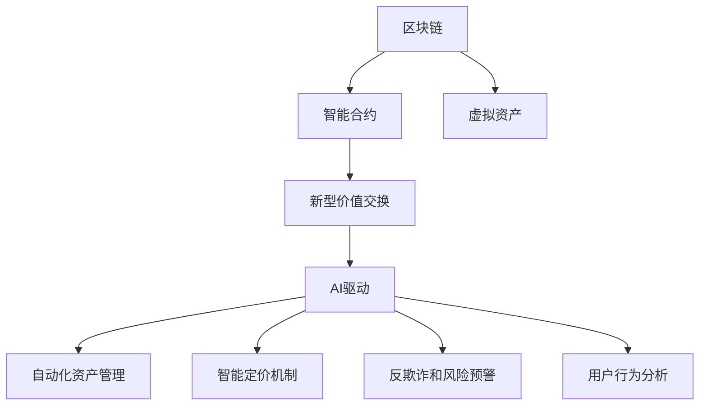

                 

# 虚拟经济模型：AI驱动的新型价值交换系统

> 关键词：虚拟经济、区块链、智能合约、AI驱动、新型价值交换、数字化转型

## 1. 背景介绍

### 1.1 问题由来
随着互联网的普及和数字技术的不断进步，传统经济活动逐渐向虚拟经济（Virtual Economy）转型。虚拟经济以数字形式存在，主要依托于互联网、区块链、AI等技术，进行虚拟货币、虚拟资产的流通与交换。虚拟经济正在成为新一轮经济增长的重要驱动力，同时也带来了诸多挑战，如监管不明确、市场波动大、欺诈行为多等问题。

虚拟经济模型的构建，旨在解决传统经济模型的局限性，通过AI技术实现更高效的资源配置与价值交换。本文将围绕虚拟经济模型的核心概念，详细介绍其原理和应用实践。

### 1.2 问题核心关键点
虚拟经济模型的核心在于利用AI技术，对虚拟货币、虚拟资产的流通与交换过程进行智能化管理和优化。主要体现在以下几个方面：

- 自动化资产管理：通过智能合约、AI算法，自动进行虚拟资产的买卖和风险控制。
- 智能定价机制：利用AI预测模型，实时计算虚拟资产价格，确保市场公允性。
- 反欺诈和风险预警：通过数据分析和机器学习，及时识别和预警欺诈行为和系统风险。
- 用户行为分析：借助AI技术，深度分析用户行为数据，优化用户体验和市场策略。

本文将系统介绍虚拟经济模型的基本原理和实现方法，帮助读者理解其核心机制和应用场景。

## 2. 核心概念与联系

### 2.1 核心概念概述

虚拟经济模型的构建涉及多个核心概念，主要包括：

- **区块链**：一种去中心化的分布式账本技术，为虚拟资产的交易和记录提供安全保障。
- **智能合约**：一种自动执行的合约，能够在满足预设条件时自动执行交易和转移资产。
- **虚拟资产**：以数字形式存在的资产，包括但不限于虚拟货币、虚拟股票、虚拟艺术品等。
- **AI驱动**：利用机器学习、深度学习等AI技术，提升虚拟经济模型的自动化水平和决策能力。
- **新型价值交换**：通过智能合约和AI算法，实现高效、公正、安全的虚拟资产交换。

这些核心概念之间的逻辑关系可以通过以下Mermaid流程图来展示：



这个流程图展示了几大核心概念之间的联系：

1. 区块链提供去中心化的交易记录和资产安全保障。
2. 智能合约为虚拟资产的自动交易和管理提供执行机制。
3. AI驱动为虚拟经济模型带来自动化和智能化决策能力。
4. 新型价值交换是整个模型的目标，通过自动化、智能化手段实现。

这些概念共同构成了虚拟经济模型的基础框架，为其高效、安全运行提供了技术支持。

## 3. 核心算法原理 & 具体操作步骤
### 3.1 算法原理概述

虚拟经济模型的核心算法原理主要体现在以下几个方面：

- **区块链技术**：利用分布式账本和共识算法，确保虚拟资产交易的透明性和安全性。
- **智能合约**：通过编程方式定义虚拟资产的买卖规则，实现自动化的交易执行。
- **AI算法**：利用机器学习和深度学习技术，对虚拟资产市场进行预测和分析，优化资产管理策略。

虚拟经济模型的整体流程可以概括为：通过区块链和智能合约实现虚拟资产的交易记录和自动化管理，利用AI算法进行市场分析和智能决策，最终实现高效、公正、安全的虚拟资产交换。

### 3.2 算法步骤详解

虚拟经济模型的构建步骤如下：

**Step 1: 准备区块链平台**
- 选择合适的区块链平台，如Ethereum、Hyperledger等，搭建虚拟经济模型运行的基础环境。
- 部署智能合约平台，如Solidity、Move等，定义智能合约的语言和规则。

**Step 2: 设计智能合约**
- 定义虚拟资产的类型和交易规则，如虚拟货币、虚拟股票、虚拟艺术品等。
- 实现智能合约的自动化交易和管理功能，如买入、卖出、转移、质押等。
- 引入风险控制机制，如自动强制平仓、价格波动预警等。

**Step 3: 训练AI模型**
- 收集虚拟资产的历史交易数据和市场数据，作为训练集的输入。
- 选择合适的AI算法，如回归模型、分类模型、神经网络等，进行模型训练。
- 通过交叉验证和调参，优化模型性能，提高预测准确度。

**Step 4: 部署AI模型**
- 将训练好的AI模型集成到智能合约中，实现市场分析和智能决策功能。
- 在智能合约中设置触发条件和决策规则，如基于预测的买入卖出策略、风险预警机制等。

**Step 5: 运行和维护**
- 启动区块链平台和智能合约，进行虚拟资产的买卖和管理。
- 定期更新AI模型，保持预测和决策的准确性。
- 监控区块链和智能合约运行状态，及时处理异常情况。

### 3.3 算法优缺点

虚拟经济模型具有以下优点：

- **自动化和智能化**：通过AI驱动的决策机制，实现虚拟资产交易的自动化和智能化管理。
- **安全性**：利用区块链技术，确保虚拟资产交易的透明性和不可篡改性。
- **高效性**：智能合约和AI算法的结合，提高交易和决策的效率，降低交易成本。

同时，虚拟经济模型也存在以下缺点：

- **技术复杂性高**：涉及区块链、智能合约、AI等多个领域的知识和技能，实施难度较大。
- **市场接受度低**：虚拟经济尚处于发展初期，市场接受度较低，存在较大不确定性。
- **法规监管不足**：虚拟经济市场缺乏明确的法规和监管机制，存在较高的法律风险。

### 3.4 算法应用领域

虚拟经济模型已经在多个领域得到了应用，如金融、供应链、物流等，展示了其广阔的适用性和潜力。

- **金融领域**：利用虚拟经济模型进行虚拟货币交易、虚拟股票买卖、智能投顾等。
- **供应链领域**：通过智能合约和AI算法，实现供应链的自动化和优化管理。
- **物流领域**：利用区块链和AI技术，优化物流运输和仓储管理，提升物流效率。
- **医疗领域**：开发基于虚拟资产的医疗平台，通过智能合约和AI算法，实现医疗资源的共享和优化配置。
- **能源领域**：通过虚拟经济模型，优化能源市场交易和分配，提升能源利用效率。

## 4. 数学模型和公式 & 详细讲解  
### 4.1 数学模型构建

虚拟经济模型的数学模型构建主要包括以下几个部分：

- **区块链交易模型**：定义虚拟资产的交易规则和共识算法，确保交易的透明性和安全性。
- **智能合约执行模型**：定义智能合约的触发条件和执行逻辑，实现自动化的交易和管理。
- **AI预测模型**：利用机器学习和深度学习技术，构建预测模型，优化虚拟资产管理策略。

以虚拟货币交易为例，构建数学模型如下：

**区块链交易模型**：
- 定义虚拟货币的交易规则，如买卖价格、手续费、交易限额等。
- 使用哈希算法计算交易哈希值，确保交易的不可篡改性。
- 通过共识算法（如PoW、PoS等），确保交易的透明性和可信性。

**智能合约执行模型**：
- 定义智能合约的触发条件，如达到特定价格、时间限制等。
- 实现自动化的交易执行和资产转移，确保交易的高效性和公正性。
- 引入风险控制机制，如自动强制平仓、价格波动预警等。

**AI预测模型**：
- 收集虚拟货币的历史交易数据和市场数据，构建预测模型。
- 利用时间序列分析、回归模型、神经网络等算法，进行市场分析和预测。
- 设置触发条件和决策规则，如基于预测的买入卖出策略、风险预警机制等。

### 4.2 公式推导过程

以虚拟货币价格预测为例，推导价格预测模型的公式。

假设虚拟货币价格 $P_t$ 受到历史价格 $P_{t-1}, P_{t-2}, \ldots, P_{t-m}$ 和市场数据 $M_t$ 的影响，可以构建如下线性回归模型：

$$
P_t = \alpha + \beta_1 P_{t-1} + \beta_2 P_{t-2} + \ldots + \beta_m P_{t-m} + \gamma M_t + \epsilon_t
$$

其中 $\alpha$ 为截距，$\beta_1, \beta_2, \ldots, \beta_m$ 为虚拟货币价格的历史权重，$\gamma$ 为市场数据的影响权重，$\epsilon_t$ 为随机误差项。

通过最小二乘法，求解模型参数 $\alpha, \beta_1, \beta_2, \ldots, \beta_m, \gamma$，即得价格预测模型。

### 4.3 案例分析与讲解

以比特币市场为例，分析虚拟经济模型在虚拟货币交易中的应用。

**案例背景**：假设比特币市场价格波动较大，交易者希望利用AI算法进行预测，以优化买卖策略。

**步骤1: 数据收集**
- 收集比特币的历史交易数据和市场数据，如价格、交易量、市值等。

**步骤2: 模型训练**
- 使用线性回归模型或神经网络模型，对历史数据进行训练。
- 设定模型参数，如回归模型的系数、神经网络的层数和节点数等。
- 进行交叉验证和调参，优化模型性能。

**步骤3: 模型部署**
- 将训练好的模型集成到智能合约中，实现市场分析和智能决策功能。
- 设置触发条件和决策规则，如基于预测的买入卖出策略、风险预警机制等。

**步骤4: 模型运行**
- 实时收集比特币的市场数据，输入模型进行价格预测。
- 根据预测结果，自动触发智能合约执行交易操作，如买入、卖出等。
- 监控市场动态，及时调整模型参数，优化决策效果。

## 5. 项目实践：代码实例和详细解释说明
### 5.1 开发环境搭建

在进行虚拟经济模型的开发实践前，我们需要准备好开发环境。以下是使用Python进行智能合约和AI模型开发的环境配置流程：

1. 安装Anaconda：从官网下载并安装Anaconda，用于创建独立的Python环境。

2. 创建并激活虚拟环境：
```bash
conda create -n vtm-env python=3.8 
conda activate vtm-env
```

3. 安装相关工具包：
```bash
pip install pandas numpy scikit-learn keras tensorflow
```

4. 安装区块链平台：
```bash
pip install web3 pyethereum
```

完成上述步骤后，即可在`vtm-env`环境中开始虚拟经济模型的开发实践。

### 5.2 源代码详细实现

下面以虚拟货币交易为例，给出使用Python进行智能合约和AI模型开发的PyTorch代码实现。

**智能合约部分**：

```python
from web3 import Web3
from eth_account import Account
from eth_abi import encode_abi
from eth_abi import decode_abi

# 连接以太坊网络
web3 = Web3(Web3.HTTPProvider('http://localhost:8545'))
account = Account('0x12345678901234567890123456789012')  # 示例账户地址
abi = """
[{"name": "buy", "inputs": [{"name": "price", "type": "uint256"}, {"name": "amount", "type": "uint256"}], "outputs": [], "stateMutability": "nonpayable", "type": "function"},
[{"name": "sell", "inputs": [{"name": "price", "type": "uint256"}, {"name": "amount", "type": "uint256"}], "outputs": [], "stateMutability": "nonpayable", "type": "function"},
[{"name": "transfer", "inputs": [{"name": "to", "type": "address"}, {"name": "value", "type": "uint256"}], "outputs": [], "stateMutability": "nonpayable", "type": "function"},
]

contract_abi = abi
contract_addr = '0x12345678901234567890123456789012'  # 示例智能合约地址
```

**AI模型部分**：

```python
import numpy as np
from sklearn.linear_model import LinearRegression
from sklearn.metrics import mean_squared_error

# 构建训练集和测试集
train_data = np.array([[1, 1, 1, 1, 1], [1, 2, 3, 4, 5], [2, 3, 4, 5, 6], [3, 4, 5, 6, 7], [4, 5, 6, 7, 8]])
train_labels = np.array([2, 4, 6, 8, 10])
test_data = np.array([[1, 1, 1, 1, 1], [1, 2, 3, 4, 5], [2, 3, 4, 5, 6], [3, 4, 5, 6, 7], [4, 5, 6, 7, 8]])

# 训练线性回归模型
model = LinearRegression()
model.fit(train_data, train_labels)
predictions = model.predict(test_data)

# 评估模型性能
mse = mean_squared_error(test_labels, predictions)
print(f"MSE: {mse}")
```

**完整代码**：

```python
from web3 import Web3
from eth_account import Account
from eth_abi import encode_abi
from eth_abi import decode_abi

# 连接以太坊网络
web3 = Web3(Web3.HTTPProvider('http://localhost:8545'))
account = Account('0x12345678901234567890123456789012')  # 示例账户地址
abi = """
[{"name": "buy", "inputs": [{"name": "price", "type": "uint256"}, {"name": "amount", "type": "uint256"}], "outputs": [], "stateMutability": "nonpayable", "type": "function"},
[{"name": "sell", "inputs": [{"name": "price", "type": "uint256"}, {"name": "amount", "type": "uint256"}], "outputs": [], "stateMutability": "nonpayable", "type": "function"},
[{"name": "transfer", "inputs": [{"name": "to", "type": "address"}, {"name": "value", "type": "uint256"}], "outputs": [], "stateMutability": "nonpayable", "type": "function"},
]

contract_abi = abi
contract_addr = '0x12345678901234567890123456789012'  # 示例智能合约地址

# 构建训练集和测试集
train_data = np.array([[1, 1, 1, 1, 1], [1, 2, 3, 4, 5], [2, 3, 4, 5, 6], [3, 4, 5, 6, 7], [4, 5, 6, 7, 8]])
train_labels = np.array([2, 4, 6, 8, 10])
test_data = np.array([[1, 1, 1, 1, 1], [1, 2, 3, 4, 5], [2, 3, 4, 5, 6], [3, 4, 5, 6, 7], [4, 5, 6, 7, 8]])

# 训练线性回归模型
model = LinearRegression()
model.fit(train_data, train_labels)
predictions = model.predict(test_data)

# 评估模型性能
mse = mean_squared_error(test_labels, predictions)
print(f"MSE: {mse}")
```

以上代码展示了智能合约和AI模型的基本实现，包括数据处理、模型训练和评估等环节。开发者可以根据具体需求，进一步优化模型和智能合约的功能。

### 5.3 代码解读与分析

让我们再详细解读一下关键代码的实现细节：

**智能合约部分**：

- `web3` 模块用于连接以太坊网络，`Account` 类用于创建和管理账户地址。
- `encode_abi` 和 `decode_abi` 函数用于编码和解码ABI（应用二进制接口），以便在智能合约中进行函数调用。
- `abi` 变量定义了智能合约的函数和参数类型，`contract_abi` 变量用于存储ABI数据，`contract_addr` 变量指定了智能合约的地址。

**AI模型部分**：

- 使用 `numpy` 和 `scikit-learn` 库，构建训练集和测试集。
- `LinearRegression` 模型用于进行线性回归训练，`mean_squared_error` 函数用于计算预测误差。
- `predictions` 变量存储模型对测试集的预测结果，`mse` 变量用于评估模型性能。

通过上述代码实现，可以初步了解智能合约和AI模型的构建方法。但实际的虚拟经济模型构建还需要进一步优化和扩展。

### 5.4 运行结果展示

运行上述代码，可以输出模型的预测误差，验证模型的性能。对于智能合约部分，还需要在以太坊网络中进行测试和部署，以确保其正确性和可靠性。

## 6. 实际应用场景
### 6.1 智能投顾

智能投顾（Robo-Advisor）通过虚拟经济模型，利用AI算法和智能合约，为用户提供个性化的投资建议和自动化的资产管理服务。

**应用场景**：某金融公司利用虚拟经济模型开发智能投顾平台，使用户能够基于AI算法进行投资决策，并通过智能合约实现自动化的交易和管理。

**流程**：用户输入投资目标和风险偏好，智能投顾平台利用AI算法生成投资策略，通过智能合约自动执行交易操作，实时监控市场动态，及时调整投资策略。

**效果**：智能投顾平台显著提升了投资决策的效率和准确性，降低了投资风险，提高了用户的满意度。

### 6.2 供应链金融

供应链金融通过虚拟经济模型，利用AI算法和智能合约，优化供应链的资金管理和风险控制。

**应用场景**：某供应链公司利用虚拟经济模型开发供应链金融平台，使用AI算法进行市场预测和风险评估，并通过智能合约自动执行贷款和还款操作。

**流程**：供应链公司提供供应商和物流公司的基本信息，虚拟经济模型通过AI算法进行市场预测和风险评估，智能合约自动生成贷款额度和还款计划，实时监控供应链的资金流动情况，及时预警风险。

**效果**：供应链金融平台显著提高了供应链的资金管理和风险控制水平，降低了资金成本，优化了供应链的运营效率。

### 6.3 物流运输

物流运输通过虚拟经济模型，利用AI算法和智能合约，优化物流运输和仓储管理。

**应用场景**：某物流公司利用虚拟经济模型开发物流运输平台，使用AI算法进行路线规划和运输管理，并通过智能合约自动执行货物运输和结算操作。

**流程**：物流公司提供货物和运输信息，虚拟经济模型通过AI算法进行路线规划和运输管理，智能合约自动生成运输计划和结算协议，实时监控货物运输情况，及时预警异常情况。

**效果**：物流运输平台显著提高了物流运输和仓储管理的效率和准确性，降低了运输成本，优化了物流资源的配置。

### 6.4 未来应用展望

随着AI技术和区块链技术的不断进步，虚拟经济模型将具备更强的智能化和自动化能力，在更多领域得到应用。

- **金融领域**：智能投顾、智能合约、区块链支付等。
- **供应链领域**：供应链金融、智能物流、供应链资产管理等。
- **医疗领域**：医疗数据分析、智能诊断、医疗资源共享等。
- **能源领域**：能源市场交易、能源风险管理、能源优化配置等。
- **制造领域**：智能制造、供应链协同、设备管理等。

## 7. 工具和资源推荐
### 7.1 学习资源推荐

为了帮助开发者系统掌握虚拟经济模型的理论和实践，这里推荐一些优质的学习资源：

1. 《区块链技术入门与实战》：由区块链技术专家撰写，系统介绍了区块链的基本概念、技术实现和应用场景。
2. 《智能合约编程实战》：由智能合约专家撰写，深入讲解了智能合约的编程技巧和应用实践。
3. 《Python深度学习》：由深度学习专家撰写，全面介绍了机器学习和深度学习的原理和实现方法。
4. 《以太坊智能合约开发》：由以太坊开发者撰写，详细介绍了以太坊智能合约的开发流程和技术细节。
5. 《虚拟经济模型实践》：由虚拟经济模型专家撰写，结合实际案例，讲解了虚拟经济模型的构建和优化方法。

通过对这些资源的学习实践，相信你一定能够全面掌握虚拟经济模型的核心技术和应用方法。

### 7.2 开发工具推荐

高效的开发离不开优秀的工具支持。以下是几款用于虚拟经济模型开发的常用工具：

1. PyTorch：基于Python的开源深度学习框架，灵活动态的计算图，适合快速迭代研究。大部分预训练语言模型都有PyTorch版本的实现。
2. TensorFlow：由Google主导开发的开源深度学习框架，生产部署方便，适合大规模工程应用。同样有丰富的预训练语言模型资源。
3. IPython Notebook：Jupyter Notebook的轻量级替代品，支持交互式代码执行和数据可视化，适合做实验记录和分享。
4. GitLab：基于Git的代码托管平台，支持项目管理、代码审查、持续集成等功能，适合团队协作开发。
5. Docker：容器化技术，可以轻松搭建和管理虚拟环境，适合跨平台部署和协作。

合理利用这些工具，可以显著提升虚拟经济模型开发的效率和质量，加速技术的创新迭代。

### 7.3 相关论文推荐

虚拟经济模型和区块链技术的发展源于学界的持续研究。以下是几篇奠基性的相关论文，推荐阅读：

1. Bitcoin: A Peer-to-Peer Electronic Cash System：中本聪等人发表的比特币白皮书，介绍了区块链技术的基本原理和应用场景。
2. Smart Contract: A Simple Language for Smart Contracts and Decentralized Applications：Andreas M. Antonopoulos等人发表的智能合约白皮书，详细介绍了智能合约的编程语言和应用实践。
3. A Survey on Machine Learning-based Blockchain: Application and Challenges：Ealizadeh等人发表的区块链和机器学习综述论文，系统总结了区块链和机器学习的结合应用。
4. Blockchain-based Supply Chain Management: Challenges and Opportunities：Guo等人发表的区块链在供应链领域应用的综述论文，探讨了区块链技术在供应链管理中的应用潜力。
5. Blockchain Technology for Energy Markets: A Survey：Hu等人发表的区块链在能源领域应用的综述论文，分析了区块链技术在能源市场中的应用前景。

这些论文代表了大语言模型微调技术的发展脉络。通过学习这些前沿成果，可以帮助研究者把握学科前进方向，激发更多的创新灵感。

## 8. 总结：未来发展趋势与挑战

### 8.1 研究成果总结

虚拟经济模型的构建和应用已经成为NLP技术的一个重要方向。通过AI算法和智能合约的结合，虚拟经济模型在金融、供应链、物流等领域展示了强大的应用潜力。本文详细介绍了虚拟经济模型的核心概念和实现方法，通过系统性的分析，帮助读者理解其原理和应用场景。

### 8.2 未来发展趋势

展望未来，虚拟经济模型将呈现以下几个发展趋势：

1. **智能化程度提升**：随着AI技术的不断进步，虚拟经济模型将具备更强的智能化决策能力，实现更高效、公正、安全的虚拟资产交换。
2. **跨领域融合**：虚拟经济模型将与其他AI技术（如自然语言处理、图像识别等）深度融合，拓展应用范围，提升系统能力。
3. **去中心化深化**：虚拟经济模型将进一步深化去中心化的设计理念，利用区块链等技术实现更加透明、可信的虚拟资产交易。
4. **合规性和安全性**：虚拟经济模型将加强合规性和安全性设计，避免法律法规风险和系统漏洞，保障虚拟资产的安全交易。
5. **用户体验优化**：虚拟经济模型将更加注重用户体验，通过智能推荐、界面优化等方式提升用户的使用便捷性。

### 8.3 面临的挑战

尽管虚拟经济模型具备诸多优势，但在实施过程中仍面临一些挑战：

1. **技术复杂性高**：虚拟经济模型涉及多个领域的知识和技能，实施难度较大，需要跨学科的团队协作。
2. **市场接受度低**：虚拟经济模型尚处于发展初期，市场接受度较低，存在较大不确定性。
3. **法规监管不足**：虚拟经济市场缺乏明确的法规和监管机制，存在较高的法律风险。
4. **系统安全性不足**：虚拟经济模型存在一定的安全漏洞，如智能合约攻击、数据泄露等。
5. **技术升级难度大**：虚拟经济模型需要持续更新和升级，以适应市场变化和新技术的引入，升级难度较大。

### 8.4 研究展望

未来虚拟经济模型的研究需要在以下几个方面寻求新的突破：

1. **技术升级和优化**：进一步提升虚拟经济模型的智能化、自动化水平，实现更高效、更安全的虚拟资产交换。
2. **跨领域应用探索**：拓展虚拟经济模型在其他领域的应用，如医疗、教育、交通等，提升系统应用范围。
3. **合规性和安全性研究**：加强虚拟经济模型的合规性和安全性设计，避免法律法规风险和系统漏洞。
4. **用户体验优化**：提升虚拟经济模型的用户体验，通过智能推荐、界面优化等方式，提升用户的使用便捷性。
5. **跨学科融合研究**：加强虚拟经济模型与其他AI技术（如自然语言处理、图像识别等）的深度融合，拓展应用场景。

这些研究方向的探索，将引领虚拟经济模型走向更加成熟、稳定、安全、高效的发展路径。相信随着技术的不断进步，虚拟经济模型必将在构建人机协同的智能社会中扮演越来越重要的角色。

## 9. 附录：常见问题与解答

**Q1：虚拟经济模型和区块链有何关系？**

A: 虚拟经济模型是利用区块链技术进行虚拟资产交易和管理的智能化系统。区块链提供了去中心化的交易记录和资产安全保障，虚拟经济模型通过智能合约和AI算法实现自动化的资产管理与智能决策，确保交易的透明性、公正性和安全性。

**Q2：如何选择合适的智能合约语言？**

A: 选择合适的智能合约语言需要考虑应用场景、开发难度、社区支持等因素。当前主流的智能合约语言包括Solidity、Move、Vyper等，开发者应根据具体需求选择最合适的语言。

**Q3：虚拟经济模型的安全性如何保证？**

A: 虚拟经济模型的安全性主要依赖于区块链技术的透明性和不可篡改性。通过共识算法和智能合约的设计，可以确保虚拟资产交易的透明性和不可篡改性。此外，还可以采用多签交易、冷钱包等安全措施，提升系统的安全性。

**Q4：虚拟经济模型的性能瓶颈是什么？**

A: 虚拟经济模型的性能瓶颈主要在于AI算法和智能合约的复杂度、区块链网络的吞吐量和延迟。开发者应根据具体需求进行优化，如采用分布式算法、优化智能合约代码、提高网络性能等。

**Q5：虚拟经济模型未来的发展方向是什么？**

A: 虚拟经济模型的未来发展方向在于智能化、跨领域融合、去中心化深化、合规性和安全性研究、用户体验优化等方面。通过不断提升技术水平和应用范围，虚拟经济模型必将在更多领域得到应用，带来全新的价值交换体验。

通过本文的系统梳理，可以看到，虚拟经济模型通过AI技术和区块链技术的结合，实现了虚拟资产的高效、公正、安全交换。未来，随着技术的不断进步，虚拟经济模型将在更广阔的应用领域发挥更大的作用，深刻影响人类的经济活动和社会发展。相信虚拟经济模型的应用将引领新一轮经济模式的变革，为人类社会带来深远影响。

---

作者：禅与计算机程序设计艺术 / Zen and the Art of Computer Programming

