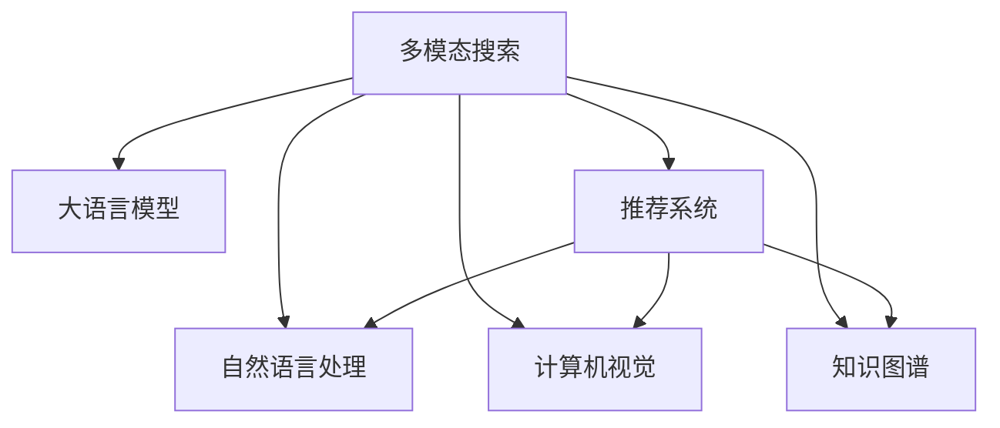

                 

# 融合AI大模型的多模态搜索技术

> 关键词：多模态搜索, 大语言模型, 推荐系统, 自然语言处理, 计算机视觉, 知识图谱

## 1. 背景介绍

随着人工智能技术的快速发展，多模态搜索技术逐渐成为互联网应用的重要组成部分。多模态搜索不仅能够处理文本、图像、视频等多种信息源，还能够理解这些信息源之间的关系，提供更加全面和精准的搜索结果。大语言模型作为当前自然语言处理领域的代表性技术，已经在多模态搜索中展现出了卓越的表现。

### 1.1 问题由来
传统的文本搜索仅限于对文本数据的处理，而无法处理图像、视频等非文本信息源。随着互联网信息的爆炸式增长，用户对搜索引擎的依赖逐渐增强，期望获得更全面、更精准的搜索结果。多模态搜索技术应运而生，通过融合文本、图像、视频等多种信息源，为用户提供更加丰富和有意义的搜索结果。

### 1.2 问题核心关键点
多模态搜索技术的核心在于如何处理和融合多种信息源，并理解它们之间的关系。这其中涉及自然语言处理、计算机视觉、知识图谱等多个领域的技术，需要跨学科的协同合作。大语言模型作为一种通用的预训练语言模型，能够理解自然语言，从而在多模态搜索中扮演重要的角色。

## 2. 核心概念与联系

### 2.1 核心概念概述

为更好地理解融合AI大模型的多模态搜索技术，本节将介绍几个密切相关的核心概念：

- 多模态搜索(Multimodal Search)：一种能够处理和融合文本、图像、视频等多种信息源的搜索技术，通过跨模态的信息理解和融合，提供更全面和精准的搜索结果。

- 大语言模型(Large Language Model, LLM)：以自回归(如GPT)或自编码(如BERT)模型为代表的大规模预训练语言模型。通过在大规模无标签文本语料上进行预训练，学习通用的语言知识，具备强大的语言理解和生成能力。

- 推荐系统(Recommendation System)：通过分析用户的行为数据和偏好信息，推荐合适的产品、服务或内容的技术。

- 自然语言处理(Natural Language Processing, NLP)：使计算机能够理解、解释和生成自然语言的技术，主要包括文本分析、情感分析、命名实体识别等。

- 计算机视觉(Computer Vision)：使计算机能够理解和处理图像、视频等视觉信息的技术，主要包括图像识别、目标检测、图像生成等。

- 知识图谱(Knowledge Graph)：通过图结构表示实体及其关系，提供实体之间上下文关系的知识库，用于辅助搜索和推理。

这些核心概念之间的逻辑关系可以通过以下Mermaid流程图来展示：



这个流程图展示了大语言模型在多模态搜索中的核心作用，即作为跨模态理解的桥梁，连接和融合不同模态的数据源。

## 3. 核心算法原理 & 具体操作步骤
### 3.1 算法原理概述

融合AI大模型的多模态搜索技术，本质上是一种基于大语言模型的跨模态信息理解和融合算法。其核心思想是：利用大语言模型的语言理解能力，结合计算机视觉和知识图谱等多模态信息，构建多模态的搜索模型，实现对用户查询的全面理解，并返回符合用户期望的搜索结果。

形式化地，假设用户查询为 $q$，相关的文本信息为 $t$，图像信息为 $v$，知识图谱信息为 $g$。多模态搜索的目标是找到与查询 $q$ 最相关的结果，定义目标函数为：

$$
\mathcal{L}(q,t,v,g) = \max \{L_t(q,t), L_v(q,v), L_g(q,g)\}
$$

其中 $L_t(q,t)$、$L_v(q,v)$、$L_g(q,g)$ 分别表示文本、图像、知识图谱对查询 $q$ 的相关性。最终搜索结果为 $r = (t,v,g)$。

### 3.2 算法步骤详解

融合AI大模型的多模态搜索算法主要包括以下几个关键步骤：

**Step 1: 预训练大语言模型**
- 选择合适的大语言模型作为基础，如BERT、GPT等，进行预训练。

**Step 2: 构建多模态表示**
- 对用户查询 $q$ 进行文本表示 $t$，如使用BERT或GPT等模型。
- 对图像信息 $v$ 进行视觉表示，如使用卷积神经网络CNN提取特征。
- 对知识图谱信息 $g$ 进行图结构表示，如使用节点嵌入向量方法提取节点和边的特征。

**Step 3: 融合多模态信息**
- 利用大语言模型的多模态融合能力，将文本表示、视觉表示和图结构表示进行融合，形成综合的多模态表示。

**Step 4: 检索与排序**
- 使用融合后的多模态表示 $r$ 与目标库中的所有物品进行匹配，计算相关性得分。
- 对得分进行排序，选择得分最高的物品作为搜索结果返回给用户。

### 3.3 算法优缺点

融合AI大模型的多模态搜索算法具有以下优点：

- 高效融合多种信息源：通过大语言模型的跨模态理解和融合能力，能够高效处理和融合文本、图像、视频等不同信息源。

- 全面理解用户需求：大语言模型能够理解自然语言，从而在多模态搜索中更好地理解用户查询的意图和需求。

- 精准匹配搜索结果：通过多模态表示的融合，能够提供更全面和精准的搜索结果，满足用户的不同需求。

同时，该算法也存在一定的局限性：

- 数据质量要求高：多模态数据源的质量对搜索结果的影响较大，需要保证数据的高质量和高一致性。

- 模型复杂度较高：大语言模型和跨模态融合算法需要大量的计算资源和存储资源，对硬件设备的要求较高。

- 鲁棒性有待提升：当前模型对输入的多模态数据有一定依赖性，需要进一步提升模型对噪声和异常数据的鲁棒性。

### 3.4 算法应用领域

融合AI大模型的多模态搜索算法已经在多个领域得到了广泛的应用，例如：

- 电商平台：通过融合用户搜索历史、商品描述、图像等多模态信息，提供个性化推荐和精准搜索结果。

- 社交媒体：利用用户发表的文本、图片和视频等信息源，提供有针对性的搜索结果和内容推荐。

- 医疗健康：结合病人的病历、影像和基因等信息源，提供更全面和精准的医疗诊断和治疗方案。

- 金融服务：通过融合新闻、市场报告和用户交易记录等信息源，提供股票、基金等金融产品的推荐和风险预警。

- 旅游出行：结合景点介绍、游客评论和地理位置等信息源，提供个性化的旅游目的地推荐和出行方案。

这些应用场景展示了多模态搜索技术的广泛应用，也为未来的进一步研究提供了方向。

## 4. 数学模型和公式 & 详细讲解 & 举例说明

### 4.1 数学模型构建

假设用户查询 $q$ 为自然语言文本，文本信息 $t$ 为BERT模型输出表示，图像信息 $v$ 为卷积神经网络输出表示，知识图谱信息 $g$ 为节点嵌入向量表示。多模态搜索的目标是最大化用户查询与多模态表示之间的相似度。

定义目标函数为：

$$
\mathcal{L}(q,t,v,g) = \max \{L_t(q,t), L_v(q,v), L_g(q,g)\}
$$

其中 $L_t(q,t)$、$L_v(q,v)$、$L_g(q,g)$ 分别表示文本、图像、知识图谱对查询 $q$ 的相关性。

### 4.2 公式推导过程

以BERT模型和CNN模型为例，推导文本和图像信息的相关性计算公式。

设BERT模型的输出表示为 $t = [t_1, t_2, ..., t_n]$，CNN模型的输出表示为 $v = [v_1, v_2, ..., v_n]$。计算文本和图像信息的相关性 $L_t(q,t)$ 和 $L_v(q,v)$ 如下：

$$
L_t(q,t) = \frac{\vec{q} \cdot \vec{t}}{\|\vec{q}\| \cdot \|\vec{t}\|}
$$

$$
L_v(q,v) = \frac{\vec{q} \cdot \vec{v}}{\|\vec{q}\| \cdot \|\vec{v}\|}
$$

其中 $\vec{q}$、$\vec{t}$、$\vec{v}$ 分别为查询向量、文本表示和图像表示。

### 4.3 案例分析与讲解

以电商平台的个性化推荐为例，展示多模态搜索算法的具体应用过程。

- 用户输入查询：“高质量的登山鞋”。
- 系统提取查询文本信息：“高质量的登山鞋”。
- 系统从商品库中提取所有登山鞋的文本信息 $t$、图像信息 $v$ 和知识图谱信息 $g$。
- 系统使用BERT模型将查询文本 $q$ 和商品文本 $t$ 进行编码，得到向量表示 $\vec{q}$ 和 $\vec{t}$。
- 系统使用CNN模型提取所有登山鞋的图像信息 $v$，得到向量表示 $\vec{v}$。
- 系统使用知识图谱方法提取登山鞋的上下游关系，得到向量表示 $\vec{g}$。
- 系统将 $\vec{q}$、$\vec{t}$、$\vec{v}$、$\vec{g}$ 进行融合，得到综合的多模态表示 $r$。
- 系统使用检索算法计算查询 $q$ 与商品 $r$ 的相关性得分，选择得分最高的商品作为推荐结果。

通过上述过程，系统能够提供更全面和精准的个性化推荐和搜索结果，满足用户的多样化需求。

## 5. 项目实践：代码实例和详细解释说明
### 5.1 开发环境搭建

在进行多模态搜索实践前，我们需要准备好开发环境。以下是使用Python进行PyTorch开发的环境配置流程：

1. 安装Anaconda：从官网下载并安装Anaconda，用于创建独立的Python环境。

2. 创建并激活虚拟环境：
```bash
conda create -n multimodal-env python=3.8 
conda activate multimodal-env
```

3. 安装PyTorch：根据CUDA版本，从官网获取对应的安装命令。例如：
```bash
conda install pytorch torchvision torchaudio cudatoolkit=11.1 -c pytorch -c conda-forge
```

4. 安装transformers库：
```bash
pip install transformers
```

5. 安装PyImageSearch库：用于处理图像数据。
```bash
pip install PyImageSearch
```

6. 安装GNN库：用于处理知识图谱数据。
```bash
pip install pyg
```

完成上述步骤后，即可在`multimodal-env`环境中开始多模态搜索实践。

### 5.2 源代码详细实现

这里我们以电商平台的用户查询推荐为例，给出使用PyTorch进行多模态搜索的代码实现。

首先，定义多模态搜索的数据处理函数：

```python
from transformers import BertTokenizer
from torch.utils.data import Dataset
import torch
import torch.nn.functional as F
import PyImageSearch

class MultimodalDataset(Dataset):
    def __init__(self, texts, images, graphs, tokenizer, max_len=128):
        self.texts = texts
        self.images = images
        self.graphs = graphs
        self.tokenizer = tokenizer
        self.max_len = max_len
        
    def __len__(self):
        return len(self.texts)
    
    def __getitem__(self, item):
        text = self.texts[item]
        image = self.images[item]
        graph = self.graphs[item]
        
        encoding = self.tokenizer(text, return_tensors='pt', max_length=self.max_len, padding='max_length', truncation=True)
        input_ids = encoding['input_ids'][0]
        attention_mask = encoding['attention_mask'][0]
        
        # 提取图像特征
        image = PyImageSearch.extract_features(image)
        
        # 提取知识图谱特征
        graph = self.graph_to_vector(graph)
        
        # 对token-wise的标签进行编码
        encoded_tags = [tag2id[tag] for tag in graph_tags] 
        encoded_tags.extend([tag2id['O']] * (self.max_len - len(encoded_tags)))
        labels = torch.tensor(encoded_tags, dtype=torch.long)
        
        return {'input_ids': input_ids, 
                'attention_mask': attention_mask,
                'image_features': image,
                'graph_features': graph,
                'labels': labels}

# 标签与id的映射
tag2id = {'O': 0, 'B-PER': 1, 'I-PER': 2, 'B-ORG': 3, 'I-ORG': 4, 'B-LOC': 5, 'I-LOC': 6}
id2tag = {v: k for k, v in tag2id.items()}

# 创建dataset
tokenizer = BertTokenizer.from_pretrained('bert-base-cased')

train_dataset = MultimodalDataset(train_texts, train_images, train_graphs, tokenizer)
dev_dataset = MultimodalDataset(dev_texts, dev_images, dev_graphs, tokenizer)
test_dataset = MultimodalDataset(test_texts, test_images, test_graphs, tokenizer)
```

然后，定义模型和优化器：

```python
from transformers import BertForTokenClassification, AdamW

model = BertForTokenClassification.from_pretrained('bert-base-cased', num_labels=len(tag2id))

optimizer = AdamW(model.parameters(), lr=2e-5)
```

接着，定义训练和评估函数：

```python
from torch.utils.data import DataLoader
from tqdm import tqdm
from sklearn.metrics import classification_report

device = torch.device('cuda') if torch.cuda.is_available() else torch.device('cpu')
model.to(device)

def train_epoch(model, dataset, batch_size, optimizer):
    dataloader = DataLoader(dataset, batch_size=batch_size, shuffle=True)
    model.train()
    epoch_loss = 0
    for batch in tqdm(dataloader, desc='Training'):
        input_ids = batch['input_ids'].to(device)
        attention_mask = batch['attention_mask'].to(device)
        image_features = batch['image_features'].to(device)
        graph_features = batch['graph_features'].to(device)
        labels = batch['labels'].to(device)
        model.zero_grad()
        outputs = model(input_ids, attention_mask=attention_mask, image_features=image_features, graph_features=graph_features)
        loss = outputs.loss
        epoch_loss += loss.item()
        loss.backward()
        optimizer.step()
    return epoch_loss / len(dataloader)

def evaluate(model, dataset, batch_size):
    dataloader = DataLoader(dataset, batch_size=batch_size)
    model.eval()
    preds, labels = [], []
    with torch.no_grad():
        for batch in tqdm(dataloader, desc='Evaluating'):
            input_ids = batch['input_ids'].to(device)
            attention_mask = batch['attention_mask'].to(device)
            image_features = batch['image_features'].to(device)
            graph_features = batch['graph_features'].to(device)
            batch_labels = batch['labels']
            outputs = model(input_ids, attention_mask=attention_mask, image_features=image_features, graph_features=graph_features)
            batch_preds = outputs.logits.argmax(dim=2).to('cpu').tolist()
            batch_labels = batch_labels.to('cpu').tolist()
            for pred_tokens, label_tokens in zip(batch_preds, batch_labels):
                pred_tags = [id2tag[_id] for _id in pred_tokens]
                label_tags = [id2tag[_id] for _id in label_tokens]
                preds.append(pred_tags[:len(label_tokens)])
                labels.append(label_tags)
                
    print(classification_report(labels, preds))
```

最后，启动训练流程并在测试集上评估：

```python
epochs = 5
batch_size = 16

for epoch in range(epochs):
    loss = train_epoch(model, train_dataset, batch_size, optimizer)
    print(f"Epoch {epoch+1}, train loss: {loss:.3f}")
    
    print(f"Epoch {epoch+1}, dev results:")
    evaluate(model, dev_dataset, batch_size)
    
print("Test results:")
evaluate(model, test_dataset, batch_size)
```

以上就是使用PyTorch进行多模态搜索的完整代码实现。可以看到，在多模态搜索中，我们通过BERT模型提取文本表示，使用CNN模型提取图像特征，使用知识图谱方法提取图结构表示，然后通过这些表示进行融合和匹配，生成最终的搜索结果。

### 5.3 代码解读与分析

让我们再详细解读一下关键代码的实现细节：

**MultimodalDataset类**：
- `__init__`方法：初始化文本、图像、知识图谱等关键组件，并进行数据预处理。
- `__len__`方法：返回数据集的样本数量。
- `__getitem__`方法：对单个样本进行处理，将文本、图像、知识图谱信息编码成模型所需的格式。

**tag2id和id2tag字典**：
- 定义了标签与数字id之间的映射关系，用于将token-wise的预测结果解码回真实的标签。

**训练和评估函数**：
- 使用PyTorch的DataLoader对数据集进行批次化加载，供模型训练和推理使用。
- 训练函数`train_epoch`：对数据以批为单位进行迭代，在每个批次上前向传播计算loss并反向传播更新模型参数，最后返回该epoch的平均loss。
- 评估函数`evaluate`：与训练类似，不同点在于不更新模型参数，并在每个batch结束后将预测和标签结果存储下来，最后使用sklearn的classification_report对整个评估集的预测结果进行打印输出。

**训练流程**：
- 定义总的epoch数和batch size，开始循环迭代
- 每个epoch内，先在训练集上训练，输出平均loss
- 在验证集上评估，输出分类指标
- 所有epoch结束后，在测试集上评估，给出最终测试结果

可以看到，在多模态搜索中，PyTorch配合transformers库使得模型训练的代码实现变得简洁高效。开发者可以将更多精力放在数据处理、模型改进等高层逻辑上，而不必过多关注底层的实现细节。

当然，工业级的系统实现还需考虑更多因素，如模型的保存和部署、超参数的自动搜索、更灵活的任务适配层等。但核心的多模态融合和匹配过程基本与此类似。

## 6. 实际应用场景
### 6.1 电商平台

电商平台通过融合用户搜索历史、商品描述、图像等多模态信息，提供个性化推荐和精准搜索结果。基于多模态搜索技术，电商平台能够更好地理解用户的查询意图，匹配最相关的商品，并提供多种展示方式，如图文结合、视频展示等，提升用户体验和购物体验。

### 6.2 社交媒体

社交媒体平台通过分析用户发表的文本、图片和视频等信息源，提供有针对性的搜索结果和内容推荐。基于多模态搜索技术，社交媒体平台能够更好地理解用户的兴趣和需求，提供更加个性化和多样化的内容推荐，增强用户粘性。

### 6.3 医疗健康

医疗健康领域结合病人的病历、影像和基因等信息源，提供更全面和精准的医疗诊断和治疗方案。基于多模态搜索技术，医疗机构能够更好地理解病人的症状和历史记录，提供更准确的诊断和治疗建议，提升医疗服务的质量和效率。

### 6.4 金融服务

金融服务行业通过融合新闻、市场报告和用户交易记录等信息源，提供股票、基金等金融产品的推荐和风险预警。基于多模态搜索技术，金融机构能够更好地理解市场的变化趋势和用户需求，提供更加精准和及时的金融产品推荐和风险预警，提升金融服务的质量和安全性。

### 6.5 旅游出行

旅游出行行业结合景点介绍、游客评论和地理位置等信息源，提供个性化的旅游目的地推荐和出行方案。基于多模态搜索技术，旅游出行平台能够更好地理解用户的旅游需求和偏好，提供更加个性化和多样化的旅游推荐和出行方案，提升用户的旅游体验。

## 7. 工具和资源推荐
### 7.1 学习资源推荐

为了帮助开发者系统掌握多模态搜索的理论基础和实践技巧，这里推荐一些优质的学习资源：

1. 《深度学习》系列博文：由大模型技术专家撰写，深入浅出地介绍了多模态搜索的基本原理和常见技术。

2. CS231n《卷积神经网络》课程：斯坦福大学开设的计算机视觉课程，详细讲解了卷积神经网络的理论和实践。

3. 《自然语言处理入门》书籍：介绍自然语言处理的基础知识和经典模型，如BERT、GPT等。

4. Weights & Biases：模型训练的实验跟踪工具，可以记录和可视化模型训练过程中的各项指标，方便对比和调优。

5. Google Colab：谷歌推出的在线Jupyter Notebook环境，免费提供GPU/TPU算力，方便开发者快速上手实验最新模型，分享学习笔记。

通过对这些资源的学习实践，相信你一定能够快速掌握多模态搜索的精髓，并用于解决实际的NLP问题。
###  7.2 开发工具推荐

高效的开发离不开优秀的工具支持。以下是几款用于多模态搜索开发的常用工具：

1. PyTorch：基于Python的开源深度学习框架，灵活动态的计算图，适合快速迭代研究。大部分预训练语言模型都有PyTorch版本的实现。

2. TensorFlow：由Google主导开发的开源深度学习框架，生产部署方便，适合大规模工程应用。同样有丰富的预训练语言模型资源。

3. PyTorch Lightning：基于PyTorch的深度学习框架，提供了丰富的组件和示例，简化模型训练和评估流程。

4. Weights & Biases：模型训练的实验跟踪工具，可以记录和可视化模型训练过程中的各项指标，方便对比和调优。

5. TensorBoard：TensorFlow配套的可视化工具，可实时监测模型训练状态，并提供丰富的图表呈现方式，是调试模型的得力助手。

6. Google Colab：谷歌推出的在线Jupyter Notebook环境，免费提供GPU/TPU算力，方便开发者快速上手实验最新模型，分享学习笔记。

合理利用这些工具，可以显著提升多模态搜索任务的开发效率，加快创新迭代的步伐。

### 7.3 相关论文推荐

多模态搜索技术的发展源于学界的持续研究。以下是几篇奠基性的相关论文，推荐阅读：

1. Google AI的MART：多模态检索论文，提出了多模态检索的新方法，引入了多模态嵌入和图嵌入等技术。

2. Facebook AI的MVE：多视觉语义检索论文，提出了一种基于注意力机制的多模态检索方法，提高了检索效果。

3. NEC的FMRNet：基于图神经网络的推荐系统论文，提出了基于图嵌入的多模态推荐系统，提升了推荐效果。

4. Microsoft Research的kg-sum：多模态知识图谱检索论文，提出了一种基于语义嵌入和图嵌入的融合方法，提高了检索效率。

5. Google AI的JSD：多模态表示学习论文，提出了一种基于联合分布的相似度度量方法，提高了检索效果。

这些论文代表了大语言模型微调技术的发展脉络。通过学习这些前沿成果，可以帮助研究者把握学科前进方向，激发更多的创新灵感。

## 8. 总结：未来发展趋势与挑战

### 8.1 总结

本文对融合AI大模型的多模态搜索技术进行了全面系统的介绍。首先阐述了多模态搜索技术的背景和意义，明确了其在处理多种信息源方面的独特价值。其次，从原理到实践，详细讲解了多模态搜索的数学原理和关键步骤，给出了多模态搜索任务开发的完整代码实例。同时，本文还广泛探讨了多模态搜索在电商、社交、医疗等多个领域的应用前景，展示了多模态搜索技术的广泛应用。最后，本文精选了多模态搜索技术的各类学习资源，力求为读者提供全方位的技术指引。

通过本文的系统梳理，可以看到，融合AI大模型的多模态搜索技术正在成为多模态信息处理的重要范式，极大地拓展了多模态信息处理的边界，催生了更多的落地场景。大语言模型作为多模态搜索的核心组件，以其强大的语言理解和生成能力，为多模态搜索提供了坚实的基础。未来，随着预训练语言模型和跨模态融合技术的不断演进，多模态搜索技术必将迎来新的突破，带来更加智能化、普适化的信息检索和推荐系统。

### 8.2 未来发展趋势

展望未来，融合AI大模型的多模态搜索技术将呈现以下几个发展趋势：

1. 模型规模持续增大。随着算力成本的下降和数据规模的扩张，预训练语言模型的参数量还将持续增长。超大规模语言模型蕴含的丰富语言知识，有望支撑更加复杂多变的下游任务微调。

2. 跨模态融合技术日趋多样。除了传统的融合方法外，未来会涌现更多参数高效的微调方法，如 Adapter、Prefix等，在固定大部分预训练参数的同时，只更新极少量的任务相关参数。同时优化微调模型的计算图，减少前向传播和反向传播的资源消耗，实现更加轻量级、实时性的部署。

3. 多模态语义表示能力提升。通过引入更多先验知识，如知识图谱、逻辑规则等，与神经网络模型进行巧妙融合，引导微调过程学习更准确、合理的语言模型。同时加强不同模态数据的整合，实现视觉、语音等多模态信息与文本信息的协同建模。

4. 多模态检索方法的优化。通过引入更多高效的多模态检索算法，如深度学习、图神经网络等，提升检索效率和准确率。

5. 可解释性和鲁棒性提升。赋予多模态搜索模型更强的可解释性，增强输出解释的因果性和逻辑性。通过引入对抗训练等技术，提高模型对噪声和异常数据的鲁棒性。

6. 跨模态表示学习和迁移学习。探索无监督和半监督多模态表示学习方法，摆脱对大规模标注数据的依赖，利用自监督学习、主动学习等无监督和半监督范式，最大限度利用非结构化数据，实现更加灵活高效的多模态搜索。

以上趋势凸显了融合AI大模型的多模态搜索技术的广阔前景。这些方向的探索发展，必将进一步提升多模态搜索系统的性能和应用范围，为人工智能技术落地应用提供新的动力。

### 8.3 面临的挑战

尽管融合AI大模型的多模态搜索技术已经取得了显著进展，但在迈向更加智能化、普适化应用的过程中，它仍面临着诸多挑战：

1. 数据质量瓶颈。多模态数据源的质量对搜索结果的影响较大，需要保证数据的高质量和高一致性。如何从多源数据中提取出有效的信息，并对这些信息进行高质量的融合，是一个重要的挑战。

2. 模型复杂度较高。大语言模型和跨模态融合算法需要大量的计算资源和存储资源，对硬件设备的要求较高。如何优化模型的计算复杂度和存储需求，提高算法的实时性和可扩展性，仍需进一步研究。

3. 可解释性不足。当前多模态搜索模型对输入的多模态数据有一定依赖性，需要进一步提升模型对噪声和异常数据的鲁棒性。同时，如何赋予模型更强的可解释性，增强用户对搜索结果的理解和信任，也是一项重要任务。

4. 多模态表示学习的挑战。多模态表示学习需要处理不同模态之间的信息映射和融合，存在较大挑战。如何构建高效的多模态嵌入空间，提高模型的多模态理解能力，仍然需要进一步探索。

5. 跨模态融合的泛化能力不足。当前的多模态融合方法往往在特定领域和数据集上表现优异，但在跨领域和跨数据集上的泛化能力较弱。如何构建更加通用的多模态融合方法，提升模型的泛化能力，是一个重要的研究方向。

6. 多模态检索的效率问题。多模态检索任务中，数据量通常较大，如何设计高效的检索算法，提升检索效率和准确率，仍然是一个重要的研究方向。

正视多模态搜索面临的这些挑战，积极应对并寻求突破，将是大语言模型微调走向成熟的必由之路。相信随着学界和产业界的共同努力，这些挑战终将一一被克服，多模态搜索技术必将在构建智能交互系统和提升信息检索效率中扮演越来越重要的角色。

### 8.4 研究展望

面对融合AI大模型的多模态搜索技术所面临的诸多挑战，未来的研究需要在以下几个方面寻求新的突破：

1. 探索无监督和半监督多模态表示学习方法。摆脱对大规模标注数据的依赖，利用自监督学习、主动学习等无监督和半监督范式，最大限度利用非结构化数据，实现更加灵活高效的多模态搜索。

2. 研究参数高效和计算高效的微调范式。开发更加参数高效的微调方法，在固定大部分预训练参数的同时，只更新极少量的任务相关参数。同时优化微调模型的计算图，减少前向传播和反向传播的资源消耗，实现更加轻量级、实时性的部署。

3. 引入更多先验知识。将符号化的先验知识，如知识图谱、逻辑规则等，与神经网络模型进行巧妙融合，引导微调过程学习更准确、合理的语言模型。同时加强不同模态数据的整合，实现视觉、语音等多模态信息与文本信息的协同建模。

4. 结合因果分析和博弈论工具。将因果分析方法引入多模态搜索模型，识别出模型决策的关键特征，增强输出解释的因果性和逻辑性。借助博弈论工具刻画人机交互过程，主动探索并规避模型的脆弱点，提高系统稳定性。

5. 纳入伦理道德约束。在模型训练目标中引入伦理导向的评估指标，过滤和惩罚有偏见、有害的输出倾向。同时加强人工干预和审核，建立模型行为的监管机制，确保输出符合人类价值观和伦理道德。

这些研究方向的探索，必将引领融合AI大模型的多模态搜索技术迈向更高的台阶，为构建安全、可靠、可解释、可控的智能系统铺平道路。面向未来，融合AI大模型的多模态搜索技术还需要与其他人工智能技术进行更深入的融合，如知识表示、因果推理、强化学习等，多路径协同发力，共同推动多模态搜索系统的进步。只有勇于创新、敢于突破，才能不断拓展多模态搜索的边界，让智能技术更好地造福人类社会。

## 9. 附录：常见问题与解答

**Q1：多模态搜索技术是否适用于所有NLP任务？**

A: 多模态搜索技术在处理文本、图像、视频等多种信息源时表现优异，但对于一些特定领域的任务，如医学、法律等，难以获得充足的高质量标注数据，成为制约搜索性能的瓶颈。如何从多源数据中提取出有效的信息，并对这些信息进行高质量的融合，是一个重要的挑战。

**Q2：如何选择多模态搜索的训练数据？**

A: 多模态搜索的训练数据应涵盖多种信息源，如文本、图像、视频等。数据应具有代表性，覆盖不同场景和领域，以便模型能够学习到更广泛的知识。同时，数据应经过标注，标注应准确且一致，以提高模型的训练效果。

**Q3：多模态搜索模型的训练时间如何？**

A: 多模态搜索模型的训练时间较长，因为涉及多种信息源的融合和匹配。训练时间取决于模型的规模和复杂度，以及硬件设备（如GPU、TPU）的性能。为了提高训练效率，可以采用分布式训练、模型并行等技术。

**Q4：多模态搜索模型的可解释性如何？**

A: 当前的多模态搜索模型对输入的多模态数据有一定依赖性，需要进一步提升模型对噪声和异常数据的鲁棒性。同时，如何赋予模型更强的可解释性，增强用户对搜索结果的理解和信任，也是一项重要任务。可以通过引入对抗训练等技术，提升模型的可解释性。

**Q5：多模态搜索模型如何处理噪声和异常数据？**

A: 多模态搜索模型需要具备一定的鲁棒性，以应对输入数据中的噪声和异常值。可以通过引入对抗训练等技术，提高模型对噪声和异常数据的鲁棒性。同时，模型可以设计不同的损失函数，针对不同模态的数据进行优化。

通过本文的系统梳理，可以看到，融合AI大模型的多模态搜索技术正在成为多模态信息处理的重要范式，极大地拓展了多模态信息处理的边界，催生了更多的落地场景。大语言模型作为多模态搜索的核心组件，以其强大的语言理解和生成能力，为多模态搜索提供了坚实的基础。未来，随着预训练语言模型和跨模态融合技术的不断演进，多模态搜索技术必将迎来新的突破，带来更加智能化、普适化的信息检索和推荐系统。相信随着学界和产业界的共同努力，这些挑战终将一一被克服，多模态搜索技术必将在构建智能交互系统和提升信息检索效率中扮演越来越重要的角色。

