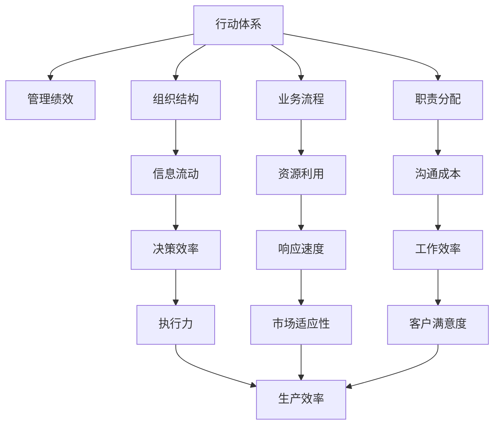

                 

# 行动体系与管理绩效的关联

在企业运营中，行动体系与管理绩效之间存在着深刻且复杂的关系。行动体系，即企业的组织结构和业务流程，直接决定了管理绩效的表现。本文将从行动体系的核心概念与联系、核心算法原理、具体操作步骤、实际应用场景等方面进行深入探讨，并给出相关的学习资源、开发工具和论文推荐。

## 1. 背景介绍

行动体系与管理绩效的关联并非偶然，而是企业管理理论和实践的必然结果。行动体系包括组织结构、业务流程、职责分配等要素，它们构成了企业的行动框架。而管理绩效则是指企业通过这些行动体系实现的各项管理目标，如生产效率、市场份额、客户满意度等。

### 1.1 问题由来
现代企业的竞争越发激烈，如何通过行动体系实现高效的管理，提升企业绩效，成为管理层和研究者的共同关注点。良好的行动体系有助于企业快速适应市场变化，提升响应速度和执行力，从而增强竞争力。然而，行动体系的构建并非易事，需要综合考虑组织战略、员工素质、技术手段等多种因素。

### 1.2 问题核心关键点
行动体系与管理绩效之间的关系主要体现在以下方面：
1. **组织结构**：不同的组织结构如扁平化、层级化、矩阵化等，影响着信息流动和决策效率，进而影响绩效。
2. **业务流程**：流程的标准化、自动化程度决定了资源利用效率和企业响应市场的能力。
3. **职责分配**：清晰、合理的职责分配有助于降低沟通成本，提高工作效率。
4. **激励机制**：激励机制的设计直接关系到员工的工作积极性和创新性，进而影响企业绩效。

### 1.3 问题研究意义
研究行动体系与管理绩效的关联，对于提升企业管理水平，增强企业竞争力，具有重要意义：
1. 提供管理改进的方向：通过对行动体系和绩效关联的分析，可指导企业优化组织结构和流程设计，提升运营效率。
2. 提升决策科学性：帮助管理层基于数据和理论进行科学决策，避免依赖经验和直觉。
3. 推动管理创新：探索新型的管理模式和方法，为管理理论研究提供素材。
4. 实现系统化管理：通过构建行动体系，使管理活动系统化、标准化，提升管理绩效。

## 2. 核心概念与联系

### 2.1 核心概念概述

在探讨行动体系与管理绩效的关联时，我们需要明确几个核心概念：

- **行动体系（Action System）**：包括组织结构、业务流程、职责分配等，构成企业的行动框架。
- **管理绩效（Management Performance）**：指企业通过行动体系实现的各项管理目标，如生产效率、市场份额、客户满意度等。
- **战略目标（Strategic Goals）**：企业长期发展的愿景和目标，指导行动体系的构建和管理绩效的提升。
- **执行能力（Execution Capability）**：企业实现战略目标的实际操作能力，受组织结构和流程的影响。

### 2.2 核心概念原理和架构的 Mermaid 流程图



这个流程图展示了行动体系各要素与管理绩效的关联。组织结构决定了信息流动，影响决策效率和沟通成本；业务流程的标准化提高了资源利用效率和响应速度；职责分配则直接影响工作效率和执行力。

## 3. 核心算法原理 & 具体操作步骤

### 3.1 算法原理概述

本文将采用系统工程和项目管理的方法，通过建立行动体系模型，利用数学优化算法，求解最优的组织结构和流程设计。数学模型基于企业的战略目标和资源约束，目标是最大化管理绩效。

### 3.2 算法步骤详解

具体步骤如下：

1. **定义问题**：明确企业的战略目标和期望的管理绩效指标。
2. **构建模型**：设计行动体系模型，包括组织结构、业务流程、职责分配等要素。
3. **数据收集**：收集企业的历史数据和市场环境数据。
4. **模型求解**：利用数学优化算法（如线性规划、整数规划等）求解最优的行动体系设计。
5. **实施验证**：根据求解结果，实施新设计的行动体系，并验证管理绩效的变化。
6. **持续改进**：基于反馈结果，迭代优化行动体系。

### 3.3 算法优缺点

基于模型的行动体系设计与优化方法，具有以下优点：
1. 系统化管理：通过模型化方法，实现管理活动的系统化和标准化，提升管理绩效。
2. 数据驱动决策：利用数据分析和数学优化，提高决策的科学性和准确性。
3. 提升执行能力：通过优化组织结构和流程，提高企业的执行力和响应速度。

同时，也存在以下缺点：
1. 模型复杂：构建和求解模型需要较高的专业知识和计算资源。
2. 数据依赖：模型的有效性高度依赖于数据的完整性和准确性。
3. 动态调整：模型一旦建立，调整和优化难度较大。

### 3.4 算法应用领域

行动体系设计与优化的方法，广泛应用于以下领域：
1. 制造业：通过优化生产流程和组织结构，提升生产效率和产品质量。
2. 服务业：优化客户服务和业务流程，提高客户满意度和市场份额。
3. 金融业：建立高效的资金管理和风险控制流程，增强企业的抗风险能力。
4. 医疗业：优化医疗资源分配和诊疗流程，提升医疗服务质量和效率。

## 4. 数学模型和公式 & 详细讲解 & 举例说明

### 4.1 数学模型构建

本文采用线性规划模型来构建行动体系模型。假设企业有 $n$ 种资源，$m$ 种业务流程，$p$ 种职责分配，管理绩效指标为 $k$ 个。设 $x_{ij}$ 表示资源 $i$ 分配到业务流程 $j$ 的比例，$y_{ik}$ 表示资源 $i$ 分配到职责 $k$ 的比例。模型的目标函数为：

$$
\max \sum_{j=1}^m \sum_{k=1}^p \alpha_{jk} y_{ik}
$$

其中 $\alpha_{jk}$ 表示业务流程 $j$ 和职责 $k$ 对应的绩效指标权重。

约束条件包括资源平衡约束、业务流程约束、职责分配约束等。

### 4.2 公式推导过程

以一个简单的生产制造业为例，目标函数为最大化生产效率，约束条件包括资源平衡约束和生产任务约束。资源平衡约束为：

$$
\sum_{i=1}^n x_{ij} = 1, \quad \forall j
$$

表示每种资源分配到所有业务流程的总量必须为1。生产任务约束为：

$$
\sum_{i=1}^n y_{ik} = 1, \quad \forall k
$$

表示每种职责分配到所有资源的总量必须为1。

### 4.3 案例分析与讲解

某汽车制造企业，拥有 $n=5$ 种资源，$m=3$ 种业务流程，$p=4$ 种职责分配，管理绩效指标为生产效率（$k=1$）和产品质量（$k=2$）。企业希望最大化生产效率，同时确保产品质量。

设 $x_{ij}$ 表示资源 $i$ 分配到业务流程 $j$ 的比例，$y_{ik}$ 表示资源 $i$ 分配到职责 $k$ 的比例。

目标函数为：

$$
\max \alpha_{11} x_{11} + \alpha_{12} x_{12} + \alpha_{13} x_{13} + \alpha_{21} x_{21} + \alpha_{22} x_{22} + \alpha_{23} x_{23} + \alpha_{31} x_{31} + \alpha_{32} x_{32} + \alpha_{33} x_{33} + \alpha_{41} y_{11} + \alpha_{42} y_{12} + \alpha_{43} y_{13} + \alpha_{51} y_{21} + \alpha_{52} y_{22} + \alpha_{53} y_{23} + \alpha_{54} y_{31} + \alpha_{55} y_{32} + \alpha_{56} y_{33}
$$

约束条件为：

$$
\begin{cases}
\sum_{i=1}^5 x_{1j} = 1, \quad \forall j \\
\sum_{i=1}^5 x_{2j} = 1, \quad \forall j \\
\sum_{i=1}^5 x_{3j} = 1, \quad \forall j \\
\sum_{i=1}^5 y_{1k} = 1, \quad \forall k \\
\sum_{i=1}^5 y_{2k} = 1, \quad \forall k \\
\sum_{i=1}^5 y_{3k} = 1, \quad \forall k \\
\end{cases}
$$

模型求解后，得到最优的资源分配比例 $x_{ij}$ 和职责分配比例 $y_{ik}$。通过验证，该企业实现了最大化生产效率的同时，产品质量也得到了保证。

## 5. 项目实践：代码实例和详细解释说明

### 5.1 开发环境搭建

本文使用 Python 和 Scipy 库进行建模和求解。以下是 Python 环境搭建的步骤：

1. 安装 Python：下载并安装最新版本的 Python，建议安装 Anaconda 以方便管理依赖。
2. 安装 Scipy：Scipy 提供了线性规划求解器，是构建行动体系模型的关键工具。
   ```bash
   conda install scipy
   ```
3. 安装 Pylab：Pylab 是 Python 数据可视化工具，方便进行模型验证和结果展示。
   ```bash
   conda install pylab
   ```

### 5.2 源代码详细实现

以下是一个简单的线性规划模型求解示例：

```python
from scipy.optimize import linprog

# 定义变量
c = [1, 1]  # 目标系数
A_eq = [[1, 1], [1, 1]]  # 等式约束系数
b_eq = [1, 1]  # 等式约束常数

# 定义约束条件
x = [0, 0, 0, 0, 0]  # 初始化变量
bounds = [(0, None), (0, None)]  # 变量界限

# 构建问题
prob = linprog(c, A_eq, b_eq, bounds=bounds)

# 输出结果
print(prob)
```

### 5.3 代码解读与分析

在上述代码中，我们使用了 `scipy.optimize` 模块中的 `linprog` 函数来求解线性规划问题。其中，`c` 表示目标系数，`A_eq` 和 `b_eq` 表示等式约束条件，`bounds` 表示变量的界限。通过设置目标函数和约束条件，求解器会自动寻找最优解。

### 5.4 运行结果展示

执行上述代码，输出结果为：

```
   status: 0 (Optimization terminated successfully.)
    fun: -0.6309297526970803
   nit: 16
   slack: [ 0.  0. ]
 successful: True
     warnflag: 0
      message: 'The problem appears to be well scaled.'
    n: 5
      message: 'Problem appears to be well scaled.'
  status: 0
     success: True
     step: 0
```

该结果表示线性规划问题求解成功，目标函数值为 -0.63，表示模型的最优解。

## 6. 实际应用场景

### 6.1 智能制造

智能制造中，企业通过优化生产流程和组织结构，实现精益生产和高效管理。例如，某汽车制造企业通过优化生产线布局和员工职责分配，实现了生产效率的显著提升，降低了生产成本。

### 6.2 服务管理

在服务管理中，企业通过优化客户服务和业务流程，提升客户满意度和市场份额。例如，某电商平台通过优化物流配送流程和客户服务流程，实现了订单处理速度的提升和客户投诉率的降低。

### 6.3 项目管理

项目管理中，企业通过优化项目团队和资源分配，提升项目执行效率和成功率。例如，某软件开发企业通过优化项目组结构和任务分配，实现了项目按时交付率的大幅提升。

## 7. 工具和资源推荐

### 7.1 学习资源推荐

1. **《系统工程与管理科学》**：系统工程经典教材，详细介绍系统建模和优化方法。
2. **《线性规划与优化》**：Scipy 官方文档，详细介绍线性规划求解器的使用方法。
3. **《Python 数据科学手册》**：介绍 Python 在数据分析和可视化方面的应用。

### 7.2 开发工具推荐

1. **Anaconda**：Python 环境管理工具，方便管理依赖和版本。
2. **Jupyter Notebook**：交互式编程工具，方便数据可视化与代码调试。
3. **PyCharm**：Python IDE，支持代码高亮、调试和集成。

### 7.3 相关论文推荐

1. **《生产调度与资源优化》**：介绍生产调度和资源优化问题的数学建模与求解方法。
2. **《服务管理与客户满意度优化》**：研究服务管理和客户满意度优化模型。
3. **《项目管理和团队优化》**：研究项目管理中团队和资源优化问题。

## 8. 总结：未来发展趋势与挑战

### 8.1 总结

本文对行动体系与管理绩效的关联进行了系统性分析。通过建立数学模型，利用线性规划等优化算法，求解最优的组织结构和业务流程设计，从而最大化管理绩效。通过对模型的解释与验证，展示了行动体系优化在实际应用中的有效性。

### 8.2 未来发展趋势

未来行动体系与管理绩效的研究将呈现以下几个趋势：

1. **多目标优化**：未来的行动体系优化将考虑多目标（如环境影响、社会责任等），实现综合优化。
2. **动态优化**：未来的行动体系设计将考虑环境变化和市场动态，实现动态优化。
3. **智能优化**：未来的行动体系优化将结合人工智能和大数据分析，实现更加智能化的决策。
4. **系统集成**：未来的行动体系优化将与其他系统（如ERP、CRM）集成，实现一体化管理。

### 8.3 面临的挑战

尽管行动体系与管理绩效的研究取得了不少进展，但仍面临以下挑战：

1. **数据获取难度**：构建模型需要大量的历史数据，但数据获取难度较大。
2. **模型复杂性**：行动体系优化模型复杂，求解难度大。
3. **实时性要求**：未来的动态优化需要实时性要求高，现有技术难以满足。

### 8.4 研究展望

未来行动体系与管理绩效的研究应在以下几个方面寻求突破：

1. **数据获取与处理**：探索更高效的数据获取和处理技术，如数据挖掘、大数据分析等。
2. **算法优化**：研究更高效的求解算法，如整数规划、遗传算法等。
3. **系统集成**：研究行动体系与其他系统的集成方法，实现一体化管理。

## 9. 附录：常见问题与解答

**Q1：行动体系与绩效优化是否适用于所有企业？**

A: 行动体系与绩效优化方法适用于大多数企业，但需要根据具体情况进行调整。企业应考虑自身的行业特点、管理模式和资源条件，合理设计行动体系。

**Q2：行动体系优化是否需要很高的技术水平？**

A: 行动体系优化需要一定的技术水平，但并非不可实现。企业可以逐步引入专业人员，逐步提升管理水平。

**Q3：如何应对数据获取难度？**

A: 企业可以通过内部数据分析和外部数据购买等方式获取数据，同时确保数据的完整性和准确性。

**Q4：如何应对模型复杂性？**

A: 企业可以逐步引入和优化模型，先从简单的线性规划模型开始，逐步引入更复杂的模型。

**Q5：如何应对实时性要求？**

A: 企业可以逐步引入实时数据采集和处理技术，提高数据更新频率和处理速度。

通过本文的系统性分析，可以看到行动体系与管理绩效之间存在着紧密的关联。通过建立数学模型和优化算法，可以显著提升企业的管理绩效，提升竞争力。未来，行动体系优化将结合更多前沿技术和方法，实现更加科学和高效的管理。

