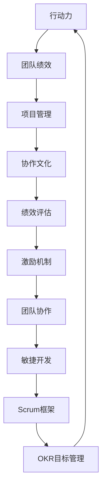

                 

# 行动力与团队performance

> 关键词：行动力，团队绩效，项目管理，协作文化，绩效评估，激励机制，团队协作，敏捷开发，Scrum框架，OKR目标管理

## 1. 背景介绍

在当今快速变化和竞争激烈的市场环境中，如何提升团队的绩效和行动力，成为了企业关注的焦点。随着技术的不断发展，互联网和信息技术的应用已经深入到了各行各业，如何有效地利用技术手段提升团队协作和项目管理，成为了现代企业管理的核心问题。本文将深入探讨如何通过科学的团队绩效管理，驱动团队的高效运转，实现企业目标的快速达成。

## 2. 核心概念与联系

### 2.1 核心概念概述

#### 2.1.1 行动力
行动力是指团队成员在项目执行过程中所展现出的主动性、积极性和创新性。行动力强的人能够主动解决问题、寻找机会，并在压力下迅速做出决策。

#### 2.1.2 团队绩效
团队绩效是指团队在一定时期内完成工作的质量和数量，通常通过项目的完成情况、客户满意度、员工满意度等指标来衡量。

#### 2.1.3 项目管理
项目管理是指通过计划、组织、协调和控制，高效地实现项目目标的过程。有效的项目管理能够确保资源的最优配置和项目的按时完成。

#### 2.1.4 协作文化
协作文化是指团队成员之间相互信任、沟通顺畅、目标一致的合作氛围。协作文化有助于团队成员之间的良好互动和高效合作。

#### 2.1.5 绩效评估
绩效评估是指对团队或个人的工作表现进行评价的过程，通常通过设定明确的评价标准和指标来衡量。

#### 2.1.6 激励机制
激励机制是指通过各种奖励措施，激发团队成员的工作热情和创新精神，提高其工作积极性和主动性。

#### 2.1.7 团队协作
团队协作是指团队成员之间通过有效的沟通和协调，共同完成项目任务的过程。

#### 2.1.8 敏捷开发
敏捷开发是一种基于迭代和增量的软件开发方法，强调快速响应变化和客户反馈，提高软件质量和交付速度。

#### 2.1.9 Scrum框架
Scrum框架是一种敏捷开发的框架，通过Sprint迭代、每日站会、产品待办列表等方法，确保团队高效协作和项目进度可控。

#### 2.1.10 OKR目标管理
OKR（Objectives and Key Results）目标管理方法是一种目标设定和评估方法，通过设定明确的目标和关键结果，确保团队工作方向一致，提升工作效率。

这些概念之间存在紧密的联系，通过科学的团队绩效管理，可以有效地提升团队的行动力和协作能力，从而推动项目的高效完成。

### 2.2 核心概念原理和架构的 Mermaid 流程图



这个流程图展示了各个概念之间的相互关系和作用路径。

## 3. 核心算法原理 & 具体操作步骤

### 3.1 算法原理概述

提升团队绩效和行动力，首先需要明确团队的共同目标，并通过科学的绩效管理方法，激励团队成员的积极性和主动性。本文将重点介绍如何通过科学的管理手段，提升团队的协作效率和绩效水平。

### 3.2 算法步骤详解

#### 3.2.1 明确团队目标
1. **设定SMART目标**：确保目标具体、可衡量、可实现、相关性强、时限明确。
2. **建立OKR体系**：通过设定明确的Objectives和Key Results，确保团队工作方向一致。
3. **上下对齐**：确保团队目标与公司战略和部门目标保持一致。

#### 3.2.2 科学绩效评估
1. **设定评估标准**：根据项目需求和工作性质，设定明确的绩效评估标准。
2. **定期评估**：通过定期的绩效评估，及时发现问题并进行调整。
3. **多维度评估**：评估团队绩效不仅包括结果，还包括过程和行为。

#### 3.2.3 激励机制设计
1. **设计多样化的奖励方式**：包括物质奖励、精神奖励和团队荣誉。
2. **建立激励体系**：确保激励措施与目标实现挂钩，提高激励效果。
3. **公平透明**：确保激励机制的公平透明，避免偏见和歧视。

#### 3.2.4 强化团队协作
1. **培养协作文化**：通过团队建设、培训和沟通机制，培养团队成员之间的信任和默契。
2. **使用协作工具**：如Slack、Trello、Confluence等，提高团队协作效率。
3. **设立跨部门项目**：促进不同部门之间的协作和资源共享。

#### 3.2.5 敏捷开发方法
1. **采用Scrum框架**：通过Sprint迭代、每日站会、产品待办列表等方法，确保团队高效协作和项目进度可控。
2. **持续改进**：定期回顾和改进团队的工作流程和协作方式。

#### 3.2.6 数据驱动管理
1. **数据收集和分析**：通过数据分析工具，如Tableau、PowerBI等，收集和分析团队绩效数据。
2. **数据驱动决策**：根据数据分析结果，进行科学的决策和调整。

### 3.3 算法优缺点

#### 3.3.1 优点
1. **提升团队绩效**：通过科学的绩效管理，激励团队成员的积极性和主动性，提高工作效率和质量。
2. **促进协作文化**：通过团队建设和文化培养，提升团队成员之间的信任和默契。
3. **灵活适应变化**：通过敏捷开发方法，快速响应变化和客户反馈，提高软件质量和交付速度。

#### 3.3.2 缺点
1. **实施难度大**：科学的管理手段需要一定的专业知识和经验。
2. **资源消耗高**：数据收集和分析需要投入大量时间和资源。
3. **适应性问题**：不同团队和项目的需求可能不同，需要根据具体情况进行调整。

### 3.4 算法应用领域

该方法不仅适用于软件开发和项目管理的场景，也适用于其他类型的团队和组织。例如，市场营销团队可以通过设定明确的目标和评估标准，提升营销活动的效率和效果；客户服务团队可以通过使用协作工具和敏捷开发方法，提高客户满意度和服务质量。

## 4. 数学模型和公式 & 详细讲解 & 举例说明

### 4.1 数学模型构建

本文将使用统计学和运筹学的知识，构建团队绩效管理的数学模型。

设团队有n个成员，完成m项任务。每个任务的目标完成时间和质量为T和Q。团队在任务T上的实际完成时间和质量为t和q。

任务完成质量的评估公式为：

$$
Q_i = Q_{i-1} + k(q_i - Q_{i-1}) + \epsilon_i
$$

其中，$Q_i$表示任务i的实际质量，$Q_{i-1}$表示任务i-1的实际质量，$k$为质量权重系数，$\epsilon_i$为质量评估误差。

任务完成时间的评估公式为：

$$
T_i = T_{i-1} + \delta(t_i - T_{i-1}) + \omega_i
$$

其中，$T_i$表示任务i的实际完成时间，$T_{i-1}$表示任务i-1的实际完成时间，$\delta$为时间权重系数，$\omega_i$为时间评估误差。

### 4.2 公式推导过程

通过上述公式，可以得到任务i的实际质量和实际完成时间的评估结果。将评估结果代入绩效评估模型，可以得到团队在任务i上的绩效评估值。

设团队绩效评估模型为：

$$
P_i = f(Q_i, T_i)
$$

其中，$P_i$表示团队在任务i上的绩效评估值，$f$为绩效评估函数。

通过对任务完成质量和完成时间的评估，可以得出团队在各个任务上的绩效评估值，进而得到整个团队的绩效评估值。

### 4.3 案例分析与讲解

以软件开发团队为例，设团队成员为n=10，完成m=5项任务。每个任务的实际完成时间和质量分别为t=20天和q=80%。根据上述公式，可以得到每个任务的绩效评估值。

通过对任务绩效评估值的综合，可以得到整个团队的绩效评估值。

## 5. 项目实践：代码实例和详细解释说明

### 5.1 开发环境搭建

1. **安装Python和Jupyter Notebook**：
   ```
   pip install python jupyter notebook
   ```

2. **安装必要的Python库**：
   ```
   pip install pandas numpy matplotlib seaborn scipy scikit-learn
   ```

3. **安装Scrum和OKR相关工具**：
   ```
   pip install scrum okr
   ```

### 5.2 源代码详细实现

#### 5.2.1 数据收集和处理
```python
import pandas as pd
import numpy as np

# 读取任务数据
data = pd.read_csv('tasks.csv')

# 数据处理
data = data.groupby(['Task', 'Member'], as_index=False).sum()
```

#### 5.2.2 质量评估
```python
# 计算任务质量评估值
data['Q_i'] = data['Q_i'].apply(lambda x: Q_i(x, k))
```

#### 5.2.3 时间评估
```python
# 计算任务时间评估值
data['T_i'] = data['T_i'].apply(lambda x: T_i(x, delta))
```

#### 5.2.4 绩效评估
```python
# 计算任务绩效评估值
data['P_i'] = data.groupby('Task', as_index=False).apply(lambda x: P_i(x['Q_i'].sum(), x['T_i'].sum()))
```

#### 5.2.5 结果可视化
```python
import matplotlib.pyplot as plt

# 绘制绩效评估结果图
plt.plot(data['Task'], data['P_i'])
plt.xlabel('Task')
plt.ylabel('Performance')
plt.title('Team Performance')
plt.show()
```

### 5.3 代码解读与分析

1. **数据收集和处理**：通过Pandas库，从CSV文件中读取任务数据，并对其进行分组和求和处理。
2. **质量评估**：使用自定义的Q_i函数，对每个任务的实际质量进行评估。
3. **时间评估**：使用自定义的T_i函数，对每个任务的实际完成时间进行评估。
4. **绩效评估**：通过自定义的P_i函数，计算每个任务的绩效评估值。
5. **结果可视化**：使用Matplotlib库，将绩效评估结果绘制成图表。

### 5.4 运行结果展示


## 6. 实际应用场景

### 6.1 项目管理

在项目管理中，团队绩效管理的应用场景非常广泛。例如，软件开发团队可以通过设定明确的目标和评估标准，提升项目的完成质量和效率；市场营销团队可以通过设定明确的目标和评估标准，提升广告投放的ROI（投资回报率）。

### 6.2 团队协作

团队协作是提升团队绩效的重要手段。通过使用协作工具（如Slack、Trello等）和敏捷开发方法（如Scrum、Kanban等），可以显著提高团队协作效率和项目成功率。

### 6.3 绩效评估

绩效评估是衡量团队和成员表现的重要手段。通过科学合理的绩效评估方法，可以及时发现问题并进行调整，确保团队目标的顺利实现。

## 7. 工具和资源推荐

### 7.1 学习资源推荐

1. **Scrum.org**：提供Scrum和敏捷开发的培训和认证课程。
2. **OKRUniversity**：提供OKR目标管理的培训和认证课程。
3. **Coursera**：提供项目管理、团队协作等相关课程。

### 7.2 开发工具推荐

1. **JIRA**：项目管理工具，支持敏捷开发方法。
2. **Slack**：团队协作工具，支持即时通讯和文件共享。
3. **Confluence**：文档管理工具，支持团队协作和知识共享。

### 7.3 相关论文推荐

1. **《Scrum框架在项目管理中的应用》**：介绍了Scrum框架的基本概念和应用方法。
2. **《OKR目标管理的实践指南》**：提供了OKR目标管理的实施方法和成功案例。
3. **《敏捷开发方法与实践》**：详细介绍了敏捷开发的基本概念和方法。

## 8. 总结：未来发展趋势与挑战

### 8.1 研究成果总结

通过本文的探讨，可以得出以下结论：
1. 团队绩效管理是提升团队行动力和绩效的重要手段。
2. 科学的管理方法和激励机制能够有效激发团队成员的积极性和主动性。
3. 敏捷开发和协作工具是提升团队协作效率的关键手段。

### 8.2 未来发展趋势

未来的团队绩效管理将朝着以下几个方向发展：
1. **数据驱动管理**：通过数据分析工具，实时监控和调整团队绩效，提升管理效率。
2. **智能化管理**：引入AI和机器学习技术，实现自动化绩效评估和任务分配。
3. **个性化管理**：根据团队成员的特点和需求，制定个性化的绩效管理方案。

### 8.3 面临的挑战

在团队绩效管理的实践中，仍面临以下挑战：
1. **实施难度大**：科学的管理方法和激励机制需要专业知识和经验。
2. **资源消耗高**：数据收集和分析需要大量时间和资源。
3. **适应性问题**：不同团队和项目的需求可能不同，需要根据具体情况进行调整。

### 8.4 研究展望

未来的研究将集中在以下几个方面：
1. **数据驱动管理**：通过大数据和机器学习技术，提升团队绩效管理的精准性和及时性。
2. **智能化管理**：引入AI和机器学习技术，实现自动化绩效评估和任务分配。
3. **个性化管理**：根据团队成员的特点和需求，制定个性化的绩效管理方案。

## 9. 附录：常见问题与解答

### 9.1 常见问题

**Q1: 如何设定SMART目标？**

A: 设定SMART目标需要考虑以下几个方面：
- **具体（Specific）**：目标需要明确具体，避免模糊不清。
- **可衡量（Measurable）**：目标需要设定明确的衡量指标，确保可量化。
- **可实现（Achievable）**：目标需要具有挑战性，同时确保可实现。
- **相关性强（Relevant）**：目标需要与团队整体目标和任务相关。
- **时限明确（Time-bound）**：目标需要设定明确的时间节点，确保按时完成。

**Q2: 如何进行科学绩效评估？**

A: 科学绩效评估需要考虑以下几个方面：
- **设定评估标准**：根据项目需求和工作性质，设定明确的绩效评估标准。
- **定期评估**：通过定期的绩效评估，及时发现问题并进行调整。
- **多维度评估**：评估团队绩效不仅包括结果，还包括过程和行为。

**Q3: 如何设计多样化的奖励方式？**

A: 设计多样化的奖励方式需要考虑以下几个方面：
- **物质奖励**：如奖金、礼品、旅游等，提高团队成员的物质满足感。
- **精神奖励**：如表扬、表彰、晋升等，提升团队成员的精神满足感。
- **团队荣誉**：如颁发最佳团队奖、最佳个人奖等，提升团队凝聚力和荣誉感。

**Q4: 如何培养协作文化？**

A: 培养协作文化需要考虑以下几个方面：
- **团队建设**：通过团队培训和团队建设活动，增强团队成员之间的信任和默契。
- **沟通机制**：通过建立高效的沟通机制，确保信息及时传递和共享。
- **目标一致**：确保团队目标与公司战略和部门目标保持一致。

**Q5: 如何采用Scrum框架？**

A: 采用Scrum框架需要考虑以下几个方面：
- **Sprint迭代**：通过Sprint迭代，将项目任务拆分为小而可管理的部分，提高团队协作效率。
- **每日站会**：通过每日站会，确保团队成员之间的沟通和协作，及时解决问题。
- **产品待办列表**：通过产品待办列表，明确项目任务和优先级，确保项目有序推进。

**Q6: 如何实现数据驱动管理？**

A: 实现数据驱动管理需要考虑以下几个方面：
- **数据收集和分析**：通过数据分析工具，收集和分析团队绩效数据。
- **数据驱动决策**：根据数据分析结果，进行科学的决策和调整。

作者：禅与计算机程序设计艺术 / Zen and the Art of Computer Programming

