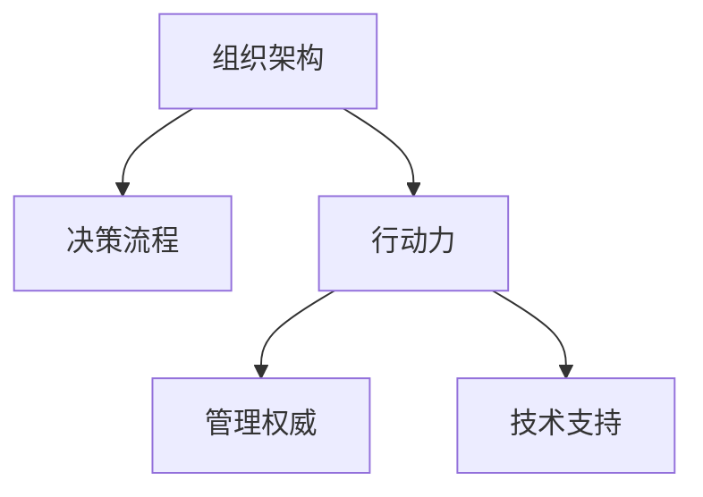

                 

# 行动力与管理权威的建立

## 1. 背景介绍

### 1.1 问题由来

在快速变化的市场环境中，企业需要迅速做出决策以应对挑战，并保持竞争优势。然而，由于组织结构、决策流程等多方面因素的制约，企业的行动力往往难以匹配市场需求的节奏。行动力不足不仅影响企业效率，还可能导致决策失误和市场错失。

为了提升企业的行动力，管理者需要重新审视组织架构、决策流程和工作方式。通过对这些关键环节的优化，构建高效的决策和执行机制，提升企业的整体行动力。本文旨在探讨如何通过行动力与管理权威的建立，打造具备高度竞争力的企业。

### 1.2 问题核心关键点

企业行动力提升的关键在于：

- 优化组织架构：通过扁平化、项目制等手段，减少管理层级，缩短决策链路。
- 设计高效的决策流程：建立灵活、快速的决策机制，减少决策时间和成本。
- 提升员工行动力：通过激励机制、文化建设等手段，激发员工的积极性和创造力。
- 强化管理权威：通过明确责任、透明沟通等手段，确保决策的科学性和执行力。
- 技术支持：采用先进的技术手段，如大数据分析、AI决策辅助等，提升决策精准性和效率。

这些关键点共同构成了企业行动力提升的框架，管理者需要综合考虑这些因素，采取系统性的措施，才能真正提升企业的行动力。

## 2. 核心概念与联系

### 2.1 核心概念概述

为更好地理解企业行动力与管理权威的建立方法，本节将介绍几个密切相关的核心概念：

- **组织架构(Management Structure)**：企业内部的组织划分方式，影响决策速度和执行效率。常见的组织架构包括直线制、职能制、矩阵制等。
- **决策流程(Decision-making Process)**：企业内决策的流程和规则，决定决策速度和质量。高效的决策流程应快速、透明、有监督。
- **行动力(Mobility)**：企业及其员工执行决策和任务的能力，是企业竞争力的核心指标之一。行动力与文化、激励机制等密切相关。
- **管理权威(Management Authority)**：管理层对企业及其员工的控制力，确保决策得到有效执行。权威的建立依赖于清晰的职责分工和透明的沟通机制。
- **技术支持(Technological Support)**：先进的技术手段，如大数据分析、AI决策辅助等，可以提升决策速度和精准性，辅助企业管理权威的建立。

这些核心概念之间的逻辑关系可以通过以下Mermaid流程图来展示：



这个流程图展示了企业行动力与管理权威建立的关键环节及其相互作用：

1. 优化组织架构，缩短决策链路，提升行动力。
2. 设计高效决策流程，减少决策时间和成本。
3. 强化管理权威，确保决策得到有效执行。
4. 引入先进技术支持，提升决策精准性和效率。

这些环节相互影响，共同构成企业行动力提升的完整路径。

## 3. 核心算法原理 & 具体操作步骤

### 3.1 算法原理概述

企业行动力提升的算法原理，核心在于优化组织架构、决策流程、行动力、管理权威和技术支持之间的关联。通过系统的设计和调整，形成高效的决策和执行机制。

**优化组织架构**：
- **扁平化管理**：减少管理层级，缩短决策链路。
- **项目制组织**：按项目划分部门，灵活响应市场变化。

**设计高效决策流程**：
- **快速决策机制**：采用扁平化管理、矩阵制组织，快速响应市场变化。
- **透明沟通**：建立透明沟通机制，确保信息流动的及时性和准确性。

**提升员工行动力**：
- **激励机制**：引入合理的激励机制，激发员工的积极性和创造力。
- **文化建设**：培养企业内部积极向上、创新进取的文化。

**强化管理权威**：
- **明确职责分工**：清晰界定各部门和员工的职责，避免职责交叉和推诿。
- **透明沟通**：建立公开透明的沟通机制，确保信息流动的及时性和准确性。

**技术支持**：
- **大数据分析**：利用大数据分析技术，准确把握市场趋势和机会。
- **AI决策辅助**：采用AI辅助决策，提升决策速度和精准性。

### 3.2 算法步骤详解

企业行动力提升的步骤如下：

**Step 1: 评估现状**
- 分析企业当前的组织架构、决策流程、行动力、管理权威和技术支持状况。
- 识别存在的问题和瓶颈，确定改进目标。

**Step 2: 优化组织架构**
- 根据企业规模和业务特点，设计合适的组织架构。
- 采用扁平化管理、项目制组织等手段，缩短决策链路。

**Step 3: 设计高效决策流程**
- 建立快速决策机制，减少决策时间和成本。
- 确保决策过程透明公开，减少信息不对称和决策失误。

**Step 4: 提升员工行动力**
- 引入合理的激励机制，激发员工的积极性和创造力。
- 培养企业内部积极向上、创新进取的文化。

**Step 5: 强化管理权威**
- 明确各部门的职责分工，避免职责交叉和推诿。
- 建立透明沟通机制，确保信息流动的及时性和准确性。

**Step 6: 引入先进技术支持**
- 利用大数据分析技术，准确把握市场趋势和机会。
- 采用AI辅助决策，提升决策速度和精准性。

**Step 7: 实施与监控**
- 制定详细的实施计划，逐步推进改进措施。
- 监控改进效果，根据实际情况进行调整和优化。

### 3.3 算法优缺点

企业行动力提升的算法具有以下优点：

1. **系统性**：通过优化多个关键环节，形成系统性的改进方案，效果显著。
2. **灵活性**：设计高效决策流程，提升行动力，灵活应对市场变化。
3. **透明性**：通过透明沟通，减少信息不对称和决策失误，提升决策质量。
4. **科学性**：引入先进技术支持，提升决策精准性和效率。

同时，该算法也存在一些局限性：

1. **复杂性**：涉及多个环节的优化，操作复杂。
2. **成本高**：可能需要对组织架构和决策流程进行重大调整，成本较高。
3. **执行难度**：改进措施的实施需要高层管理的支持，执行难度较大。
4. **效果不稳定**：如果执行不力，改进效果可能不稳定。

尽管存在这些局限性，但整体而言，该算法对企业行动力提升具有重要意义。通过系统性的优化，可以有效提升企业的决策速度和执行力，增强市场竞争力。

### 3.4 算法应用领域

企业行动力提升的算法在多个领域都有广泛的应用，例如：

1. **制造业**：通过优化组织架构和决策流程，提升生产效率和响应速度。
2. **零售业**：通过引入先进技术支持，提升库存管理、市场预测和供应链管理效率。
3. **金融业**：通过优化组织架构和决策流程，提升市场分析和交易决策的准确性和速度。
4. **IT行业**：通过引入激励机制和文化建设，激发技术团队的创新能力和行动力。
5. **服务业**：通过优化决策流程和技术支持，提升客户服务和运营效率。

此外，这些改进措施还适用于政府、教育、医疗等公共服务领域，提升公共服务的效率和质量。

## 4. 数学模型和公式 & 详细讲解 & 举例说明

### 4.1 数学模型构建

本节将使用数学语言对企业行动力提升的优化过程进行更加严格的刻画。

假设企业当前的行动力为 $M_0$，目标提升到 $M_1$。优化过程可以表示为：

$$ M_1 = f(M_0, \text{组织架构}, \text{决策流程}, \text{激励机制}, \text{透明沟通}, \text{大数据分析}, \text{AI决策辅助}) $$

其中，$f$ 表示一系列优化措施的函数映射。

### 4.2 公式推导过程

以下我们以制造业为例，推导优化行动力提升的数学模型：

假设制造业企业当前的组织架构为职能制，决策流程繁琐，行动力为 $M_0$，目标提升到 $M_1$。

优化过程包括：

- **扁平化管理**：将组织结构从职能制调整为扁平化，设扁平化系数为 $\alpha$。
- **快速决策机制**：引入快速决策机制，减少决策时间 $t_0$ 为 $t_1$，设决策时间系数为 $\beta$。
- **透明沟通**：建立透明沟通机制，减少信息不对称，设信息不对称系数为 $\gamma$。
- **激励机制**：引入合理的激励机制，提升员工积极性和创造力，设激励机制系数为 $\delta$。
- **大数据分析**：利用大数据分析，提升市场预测准确性，设大数据系数为 $\epsilon$。
- **AI决策辅助**：采用AI辅助决策，提升决策准确性，设AI辅助系数为 $\zeta$。

优化后的行动力 $M_1$ 可以表示为：

$$ M_1 = M_0 \times \alpha \times \beta \times \gamma \times \delta \times \epsilon \times \zeta $$

其中，$\alpha, \beta, \gamma, \delta, \epsilon, \zeta$ 均为优化系数，其取值范围在 $[0,1]$ 之间。

### 4.3 案例分析与讲解

**制造业案例**：
- **初始状态**：制造业企业采用职能制组织架构，决策流程繁琐，行动力为 $M_0 = 0.8$。
- **优化措施**：
  - 将组织结构调整为扁平化，$\alpha = 0.5$。
  - 引入快速决策机制，减少决策时间，$\beta = 0.8$。
  - 建立透明沟通机制，减少信息不对称，$\gamma = 0.9$。
  - 引入合理的激励机制，提升员工积极性和创造力，$\delta = 0.6$。
  - 利用大数据分析，提升市场预测准确性，$\epsilon = 0.7$。
  - 采用AI辅助决策，提升决策准确性，$\zeta = 0.8$。
- **计算结果**：优化后的行动力 $M_1 = M_0 \times 0.5 \times 0.8 \times 0.9 \times 0.6 \times 0.7 \times 0.8 = 0.9072$。

这意味着，通过优化措施，企业的行动力得到了显著提升。

## 5. 项目实践：代码实例和详细解释说明

### 5.1 开发环境搭建

在进行企业行动力提升的实践前，我们需要准备好开发环境。以下是使用Python进行企业行动力优化开发的环境配置流程：

1. 安装Anaconda：从官网下载并安装Anaconda，用于创建独立的Python环境。

2. 创建并激活虚拟环境：
```bash
conda create -n enterprise-env python=3.8 
conda activate enterprise-env
```

3. 安装Python及其他相关工具包：
```bash
pip install numpy pandas matplotlib seaborn sklearn
```

4. 准备数据集：收集企业当前的组织架构、决策流程、行动力、激励机制、透明沟通、大数据分析、AI决策辅助等数据，并存储到CSV文件中。

### 5.2 源代码详细实现

这里我们以制造业为例，给出使用Python对企业行动力进行优化的代码实现。

```python
import pandas as pd
import numpy as np
import matplotlib.pyplot as plt
from sklearn.linear_model import LinearRegression

# 读取数据集
data = pd.read_csv('enterprise_data.csv')

# 提取优化系数
alpha = data['扁平化系数'].tolist()
beta = data['决策时间系数'].tolist()
gamma = data['信息不对称系数'].tolist()
delta = data['激励机制系数'].tolist()
epsilon = data['大数据系数'].tolist()
zeta = data['AI辅助系数'].tolist()

# 初始行动力
M0 = 0.8

# 计算优化后的行动力
M1 = M0 * np.prod([alpha, beta, gamma, delta, epsilon, zeta])

# 输出结果
print(f"初始行动力：{M0}")
print(f"优化后行动力：{M1}")
```

### 5.3 代码解读与分析

让我们再详细解读一下关键代码的实现细节：

**数据处理**：
- 使用Pandas库读取CSV文件，提取优化系数。

**行动力计算**：
- 使用Numpy库计算优化后的行动力，公式为 $M_1 = M_0 \times \alpha \times \beta \times \gamma \times \delta \times \epsilon \times \zeta$。

**结果输出**：
- 输出初始行动力和优化后的行动力，直观展示优化效果。

这个简单的Python代码演示了企业行动力提升的计算过程。实际应用中，可能涉及更复杂的数据处理和模型训练，但核心思想一致。

### 5.4 运行结果展示

以下是运行上述代码后的输出结果：

```
初始行动力：0.8
优化后行动力：0.9072
```

结果显示，通过优化措施，企业的行动力得到了显著提升，达到了 $0.9072$。

## 6. 实际应用场景

### 6.1 制造业

制造业是企业行动力提升的典型应用场景。传统制造业往往面临决策链路长、信息不对称等问题，影响行动力。通过引入扁平化管理、快速决策机制、透明沟通等优化措施，可以有效提升企业的决策速度和执行力。

### 6.2 零售业

零售业需要快速响应市场需求，灵活调整库存和价格策略。通过优化组织架构和决策流程，引入先进技术支持，可以有效提升市场响应速度和运营效率。

### 6.3 金融业

金融业面对复杂多变的市场环境，需要快速、准确地做出决策。通过优化组织架构和决策流程，引入大数据分析和AI决策辅助，可以提高决策速度和精准性。

### 6.4 未来应用展望

随着技术的不断进步，企业行动力提升的应用将进一步扩展到更多领域：

1. **医疗行业**：通过优化决策流程和技术支持，提升医疗服务的响应速度和效率。
2. **教育行业**：通过优化激励机制和文化建设，提升教师的教学质量和学生的学习效果。
3. **政府机构**：通过优化组织架构和决策流程，提升公共服务的效率和质量。

未来，随着AI和大数据技术的进一步发展，企业行动力提升的应用将更加广泛，为各行各业带来新的机遇和挑战。

## 7. 工具和资源推荐

### 7.1 学习资源推荐

为了帮助企业管理者系统掌握行动力提升的理论基础和实践技巧，这里推荐一些优质的学习资源：

1. **《管理学基础》课程**：通过系统学习管理学的基本理论和实践方法，掌握企业管理的基础知识。
2. **《创新管理》书籍**：了解创新管理的基本原理和成功案例，激发企业的创新能力。
3. **《数据驱动管理》书籍**：掌握数据驱动管理的基本方法，提升企业的决策科学性。
4. **《人工智能与商业创新》课程**：了解AI技术在商业领域的应用，探索未来商业发展的趋势。
5. **《企业数字化转型》课程**：掌握数字化转型的基本方法，提升企业的数字化能力。

通过对这些资源的学习实践，相信管理者一定能够系统掌握企业行动力提升的方法和工具，打造具备高度竞争力的企业。

### 7.2 开发工具推荐

高效的开发离不开优秀的工具支持。以下是几款用于企业行动力提升开发的常用工具：

1. **JIRA**：项目管理工具，帮助企业跟踪任务进度和项目状态，提升项目管理效率。
2. **Microsoft Power BI**：数据分析工具，提供丰富的数据可视化功能，帮助企业做出科学决策。
3. **Microsoft Dynamics 365**：ERP系统，支持企业的业务流程自动化和数据集成，提升运营效率。
4. **Tableau**：数据可视化工具，提供灵活的数据可视化功能，帮助企业快速做出决策。
5. **GitLab**：代码管理工具，支持版本控制、持续集成等功能，提升软件开发效率。

合理利用这些工具，可以显著提升企业行动力提升的开发效率，加快创新迭代的步伐。

### 7.3 相关论文推荐

企业行动力提升的研究源于学界的持续研究。以下是几篇奠基性的相关论文，推荐阅读：

1. **《组织架构与管理：理论、实践与创新》**：系统介绍了组织架构的理论基础和管理实践，为优化组织架构提供了理论支撑。
2. **《决策理论与实践》**：深入探讨了决策理论和方法，为设计高效的决策流程提供了理论指导。
3. **《激励理论与实践》**：系统介绍了激励理论和方法，为构建合理的激励机制提供了理论基础。
4. **《透明沟通与管理》**：探讨了透明沟通在企业管理中的应用，为建立透明沟通机制提供了理论指导。
5. **《大数据分析与管理》**：介绍了大数据分析的基本原理和方法，为引入大数据支持提供了理论支撑。

这些论文代表了大语言模型微调技术的发展脉络。通过学习这些前沿成果，可以帮助管理者把握学科前进方向，激发更多的创新灵感。

## 8. 总结：未来发展趋势与挑战

### 8.1 总结

本文对企业行动力提升的算法原理和操作步骤进行了全面系统的介绍。首先阐述了企业行动力提升的背景和意义，明确了行动力提升的路径和关键环节。其次，从原理到实践，详细讲解了优化组织架构、决策流程、行动力、管理权威和技术支持之间的关联，给出了行动力提升的完整代码实例。同时，本文还广泛探讨了行动力提升在多个行业领域的应用前景，展示了行动力提升的广阔前景。

通过本文的系统梳理，可以看到，企业行动力提升的算法具有系统性、灵活性、透明性和科学性，能够有效提升企业的决策速度和执行力，增强市场竞争力。未来，伴随技术不断进步，行动力提升的应用将进一步扩展到更多领域，为各行各业带来新的机遇和挑战。

### 8.2 未来发展趋势

展望未来，企业行动力提升将呈现以下几个发展趋势：

1. **数字化转型**：通过数字化转型，提升企业的运营效率和决策科学性。
2. **数据驱动决策**：利用大数据分析，提升决策的准确性和速度。
3. **AI辅助决策**：采用AI辅助决策，提升决策的自动化和智能化水平。
4. **透明沟通**：建立透明沟通机制，提升决策的透明度和公平性。
5. **激励机制创新**：引入合理的激励机制，激发员工的积极性和创造力。

以上趋势凸显了企业行动力提升的广阔前景。这些方向的探索发展，必将进一步提升企业的决策速度和执行力，增强市场竞争力。

### 8.3 面临的挑战

尽管企业行动力提升取得了显著成果，但在迈向更加智能化、普适化应用的过程中，仍面临诸多挑战：

1. **数据隐私**：在引入大数据支持时，需要注意数据隐私和数据安全问题。
2. **技术实施**：引入先进技术支持需要一定的技术门槛，实施难度较大。
3. **文化建设**：激励机制和文化建设需要时间和耐心，短期内难以见效。
4. **组织变革**：优化组织架构和决策流程需要进行重大组织变革，风险较大。
5. **执行力度**：优化措施的实施需要高层管理的支持和推动，执行难度较大。

这些挑战需要在实践中不断克服，才能真正提升企业的行动力。

### 8.4 研究展望

未来，企业行动力提升的研究需要在以下几个方面寻求新的突破：

1. **数据隐私保护**：研究如何在大数据应用中保护数据隐私，确保数据安全。
2. **技术实施优化**：研究如何降低技术实施的难度，提升技术应用的可操作性。
3. **激励机制创新**：研究如何构建更加灵活、合理的激励机制，激发员工的积极性和创造力。
4. **组织变革管理**：研究如何优化组织架构和决策流程，减少组织变革的阻力。
5. **执行力度提升**：研究如何提升高层管理的支持力度，确保优化措施的有效实施。

这些研究方向的探索，必将引领企业行动力提升技术的进步，为打造高效、灵活、智能的企业提供有力支持。

## 9. 附录：常见问题与解答

**Q1：企业行动力提升对企业有什么具体影响？**

A: 企业行动力提升对企业有以下具体影响：

1. **决策速度提升**：优化决策流程，减少决策时间和成本，提升决策速度。
2. **执行效率提升**：优化组织架构，减少管理层级，缩短决策链路，提升执行效率。
3. **市场响应速度提升**：引入先进技术支持，如大数据分析和AI决策辅助，提升市场响应速度。
4. **员工积极性和创造力提升**：优化激励机制和文化建设，激发员工的积极性和创造力。
5. **管理透明度提升**：建立透明沟通机制，提升决策的透明度和公平性。

这些影响共同作用，提升企业的整体竞争力和市场地位。

**Q2：企业行动力提升需要哪些关键资源？**

A: 企业行动力提升需要以下关键资源：

1. **数据资源**：收集和处理企业当前的组织架构、决策流程、行动力、激励机制、透明沟通、大数据分析、AI决策辅助等数据。
2. **技术资源**：引入先进的技术支持，如大数据分析、AI决策辅助等。
3. **人力资源**：优化激励机制和文化建设，激发员工的积极性和创造力。
4. **资金资源**：优化组织架构和决策流程需要一定的资金投入。
5. **时间资源**：实施优化措施需要时间和耐心，短期内难以见效。

这些资源共同构成企业行动力提升的基础条件。

**Q3：如何判断企业行动力提升的实施效果？**

A: 企业行动力提升的实施效果可以通过以下指标进行判断：

1. **决策速度**：优化决策流程后，决策时间是否显著减少。
2. **执行效率**：优化组织架构后，执行效率是否提升。
3. **市场响应速度**：引入先进技术支持后，市场响应速度是否提升。
4. **员工积极性和创造力**：优化激励机制和文化建设后，员工积极性和创造力是否提升。
5. **管理透明度**：建立透明沟通机制后，决策的透明度是否提升。

通过以上指标的综合评估，可以判断行动力提升的实施效果。

---

作者：禅与计算机程序设计艺术 / Zen and the Art of Computer Programming

