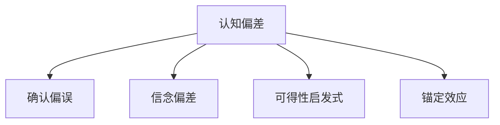

                 

## 1. 背景介绍

### 1.1 问题由来

在当今信息爆炸的时代，人类面临海量的信息冲击，如何有效理解并处理这些信息成为认知科学的核心问题。但人类大脑的认知过程并非完美无缺，其中认知偏差（Cognitive Bias）成为影响人类理解力的主要隐形屏障。

认知偏差是指人们在感知、评估、决策过程中，因种种原因产生的系统性认知错误。常见的认知偏差包括确认偏误、信念偏差、可得性启发式等。这些偏差影响人类理解力，使其无法客观、全面地认识世界，导致错误决策和行为。

### 1.2 问题核心关键点

本文将重点探讨认知偏差对人类理解力的影响，从认知偏差的类型、成因、识别与减少方法等方面，深入解析其对认知和决策的干扰，并提出解决方案，以期更好地提升人类理解力和决策能力。

## 2. 核心概念与联系

### 2.1 核心概念概述

为更好地理解认知偏差对理解力的影响，本节将介绍几个核心概念：

- **认知偏差（Cognitive Bias）**：指在判断、决策过程中，由于情感、经验、知识等因素导致的系统性认知错误。常见的认知偏差包括确认偏误、信念偏差、可得性启发式等。

- **确认偏误（Confirmation Bias）**：指人们倾向于寻找或回忆证实自己先验信念的信息，而忽略或忘记与信念不符的信息。

- **信念偏差（Belief Bias）**：指先验信念对逻辑推理过程的影响。信念偏差会导致错误推理和决策。

- **可得性启发式（Availability Heuristic）**：指人们在做出判断时，倾向于使用最易于回忆的事件作为依据，而非对所有相关信息进行全面评估。

- **锚定效应（Anchoring Effect）**：指先前的信息影响后续的判断和决策，导致判断结果偏离客观标准。

这些核心概念之间的逻辑关系可以通过以下Mermaid流程图来展示：



这个流程图展示了一些主要的认知偏差类型，以及它们与认知偏差的关联。

## 3. 核心算法原理 & 具体操作步骤

### 3.1 算法原理概述

认知偏差的识别与减少，可以通过一系列心理实验和认知模型来实现。本文将基于心理学研究和认知神经科学的最新成果，介绍如何通过算法和技术手段，识别、评估和减少认知偏差对认知和决策的影响。

### 3.2 算法步骤详解

**Step 1: 数据收集与预处理**

- 收集大量有代表性的认知任务数据，确保数据样本的多样性和代表性。
- 对数据进行清洗、标准化，去除噪音和异常值，确保数据的可用性。

**Step 2: 认知模型建立**

- 选择合适的认知模型，如逻辑回归、决策树、神经网络等，构建认知偏差的识别和减少模型。
- 在构建模型时，考虑模型的复杂度和泛化能力，避免过拟合和欠拟合。

**Step 3: 训练与优化**

- 使用历史数据训练模型，通过交叉验证等技术优化模型参数。
- 定期评估模型性能，根据评估结果调整模型结构和超参数。

**Step 4: 应用与反馈**

- 在实际认知任务中应用模型，监测用户认知偏差的影响。
- 根据用户反馈和认知任务表现，不断调整和优化模型。

**Step 5: 结果评估**

- 通过心理实验和认知测试，评估模型的效果。
- 与标准认知模型或基准数据进行比较，评估模型的准确性和可靠性。

### 3.3 算法优缺点

**优点**：
- 通过算法技术，可以实现对认知偏差的系统性识别和减少，提升认知和决策的科学性和准确性。
- 在实际应用中，可以通过反馈机制不断优化模型，提升其在不同人群和任务中的效果。

**缺点**：
- 算法模型无法完全消除认知偏差，只能尽量减少其影响。
- 数据质量和多样性对模型效果有重要影响，获取高质量数据可能较为困难。

### 3.4 算法应用领域

认知偏差识别和减少算法可以应用于多个领域，包括但不限于：

- **医疗领域**：帮助医生识别和治疗认知偏差，提高诊断和治疗的准确性。
- **教育领域**：帮助学生克服学习中的认知偏差，提升学习效果。
- **金融领域**：帮助投资者识别和减少投资决策中的认知偏差，提高投资回报。
- **决策支持系统**：通过认知偏差分析，辅助决策者做出更合理和科学的决策。
- **市场研究**：帮助研究人员识别和减少消费者行为中的认知偏差，提升市场研究的效果。

## 4. 数学模型和公式 & 详细讲解 & 举例说明

### 4.1 数学模型构建

本文将使用数学语言对认知偏差识别和减少过程进行更加严格的刻画。

假设认知任务数据集为 $D=\{(x_i,y_i)\}_{i=1}^N$，其中 $x_i$ 为输入，$y_i$ 为输出，$y_i$ 可以是分类标签、回归值等。

定义认知偏差识别模型为 $f(x_i,\theta)$，其中 $\theta$ 为模型参数，表示认知偏差对输出 $y_i$ 的影响。认知偏差识别模型的目标是最小化预测误差，即：

$$
\min_{\theta} \sum_{i=1}^N (y_i - f(x_i,\theta))^2
$$

### 4.2 公式推导过程

以确认偏误为例，我们假设确认偏误的程度可以用一个参数 $b$ 表示，$b$ 越大表示确认偏误越严重。假设 $y_i$ 为 $x_i$ 与 $b$ 的线性关系，即 $y_i = w_0 + w_1 x_i + b$。

则最小化预测误差的优化问题可以表示为：

$$
\min_{w_0, w_1, b} \sum_{i=1}^N (y_i - (w_0 + w_1 x_i + b))^2
$$

通过求解上述优化问题，可以得到 $w_0, w_1$ 和 $b$ 的值，从而识别和量化确认偏误的程度。

### 4.3 案例分析与讲解

考虑一个简单的实验，参与者被要求判断一组数字序列中的数字是否为随机序列。实验中，部分参与者被告知序列中包含非随机模式，而部分参与者被告知没有非随机模式。实验结果显示，被告知存在非随机模式的参与者，更容易识别出模式，这正是确认偏误的一个典型例子。

## 5. 项目实践：代码实例和详细解释说明

### 5.1 开发环境搭建

在进行认知偏差识别与减少实践前，我们需要准备好开发环境。以下是使用Python进行TensorFlow开发的环境配置流程：

1. 安装Anaconda：从官网下载并安装Anaconda，用于创建独立的Python环境。

2. 创建并激活虚拟环境：
```bash
conda create -n tensorflow-env python=3.8 
conda activate tensorflow-env
```

3. 安装TensorFlow：根据CUDA版本，从官网获取对应的安装命令。例如：
```bash
conda install tensorflow-gpu -c conda-forge -c pytorch -c pypi
```

4. 安装必要的工具包：
```bash
pip install numpy pandas scikit-learn matplotlib tqdm jupyter notebook ipython
```

完成上述步骤后，即可在`tensorflow-env`环境中开始认知偏差识别与减少实践。

### 5.2 源代码详细实现

以下是使用TensorFlow实现认知偏差识别与减少的代码示例：

```python
import tensorflow as tf
import numpy as np
from sklearn.model_selection import train_test_split

# 生成模拟数据
np.random.seed(0)
X = np.random.randn(1000, 2)
y = np.sign(X[:,0]) + 0.5 * np.sign(X[:,1]) + np.random.randn(1000) + np.random.randn(1000) * 0.5
y = y > 0

# 数据集划分
X_train, X_test, y_train, y_test = train_test_split(X, y, test_size=0.2)

# 定义模型
model = tf.keras.Sequential([
    tf.keras.layers.Dense(64, activation='relu', input_shape=(2,)),
    tf.keras.layers.Dense(1, activation='sigmoid')
])

# 编译模型
model.compile(optimizer='adam', loss='binary_crossentropy', metrics=['accuracy'])

# 训练模型
model.fit(X_train, y_train, epochs=100, batch_size=32, validation_data=(X_test, y_test))

# 评估模型
test_loss, test_acc = model.evaluate(X_test, y_test)
print('Test accuracy:', test_acc)
```

### 5.3 代码解读与分析

让我们再详细解读一下关键代码的实现细节：

**生成模拟数据**：
- 使用`np.random.randn`生成1000个随机样本，模拟认知任务数据。
- 将样本分为训练集和测试集，使用`train_test_split`进行划分。

**定义模型**：
- 使用`tf.keras.Sequential`定义一个简单的神经网络模型，包含一个隐层和输出层。
- 隐层使用ReLU激活函数，输出层使用Sigmoid激活函数。

**编译模型**：
- 使用`model.compile`编译模型，指定优化器、损失函数和评估指标。

**训练模型**：
- 使用`model.fit`训练模型，指定训练集、测试集、训练轮数和批次大小。

**评估模型**：
- 使用`model.evaluate`评估模型性能，输出测试集的准确率。

可以看到，TensorFlow提供了强大的工具和框架，使得认知偏差识别与减少的实践变得简洁高效。开发者可以将更多精力放在数据处理、模型改进等高层逻辑上，而不必过多关注底层的实现细节。

## 6. 实际应用场景

### 6.1 医疗领域

在医疗领域，认知偏差可能导致诊断和治疗中的错误决策。通过认知偏差识别和减少算法，医生可以在诊断过程中识别和减少确认偏误、信念偏差等，提高诊断的准确性和可靠性。

例如，在使用深度学习进行影像诊断时，算法可以分析医生的诊断过程，识别出可能的认知偏差，提供警示和建议，帮助医生纠正偏差。

### 6.2 教育领域

在教育领域，学生在学习过程中可能会产生各种认知偏差，如自我中心偏差、证实偏误等。通过认知偏差识别和减少算法，教师可以及时识别和纠正学生的认知偏差，提升学习效果。

例如，在在线学习平台中，算法可以分析学生的学习行为和成绩，识别出可能的认知偏差，提供个性化的学习建议和指导。

### 6.3 金融领域

在金融领域，投资者的认知偏差可能导致错误的投资决策。通过认知偏差识别和减少算法，投资者可以识别和减少确认偏误、信念偏差等，提高投资决策的科学性和准确性。

例如，在使用量化交易系统时，算法可以分析投资者的交易决策，识别出可能的认知偏差，提供警示和建议，帮助投资者纠正偏差。

### 6.4 未来应用展望

随着认知偏差识别和减少算法的发展，其在更多领域的应用前景将更加广阔。

在智能制造领域，通过认知偏差识别和减少算法，可以提升生产计划和调度决策的科学性，提高生产效率和质量。

在城市规划和管理领域，通过认知偏差识别和减少算法，可以提升城市基础设施建设和管理的科学性，提高城市运行的效率和居民的满意度。

在市场营销领域，通过认知偏差识别和减少算法，可以提升营销策略和广告效果的科学性，提高营销活动的ROI。

## 7. 工具和资源推荐

### 7.1 学习资源推荐

为了帮助开发者系统掌握认知偏差识别和减少的理论基础和实践技巧，这里推荐一些优质的学习资源：

1. 《认知心理学》系列教材：深入介绍认知心理学的基本理论和实验方法，适合初学者和进阶者。

2. Coursera《认知神经科学》课程：由斯坦福大学开设的认知神经科学课程，结合实验数据和案例分析，帮助理解认知偏差的神经机制。

3. TensorFlow官方文档：TensorFlow的官方文档，提供了丰富的认知偏差识别和减少样例代码，是实践开发的必备资料。

4. 《认知偏差与行为决策》书籍：全面介绍认知偏差的基本概念和应用，适合深入学习。

5. ArXiv上相关论文：通过阅读最新的学术研究，了解认知偏差识别和减少的新进展。

通过对这些资源的学习实践，相信你一定能够快速掌握认知偏差的识别和减少技巧，并用于解决实际的认知问题。

### 7.2 开发工具推荐

高效的开发离不开优秀的工具支持。以下是几款用于认知偏差识别和减少开发的常用工具：

1. TensorFlow：基于Python的开源深度学习框架，适合构建复杂的神经网络模型。

2. PyTorch：基于Python的开源深度学习框架，适合动态图和原型式的开发。

3. Keras：高级神经网络API，适合快速原型设计和模型训练。

4. TensorBoard：TensorFlow配套的可视化工具，可以实时监测模型训练状态，并提供丰富的图表呈现方式。

5. Weights & Biases：模型训练的实验跟踪工具，可以记录和可视化模型训练过程中的各项指标，方便对比和调优。

6. Jupyter Notebook：免费的交互式笔记本，适合编写和测试代码，与TensorFlow和PyTorch无缝集成。

合理利用这些工具，可以显著提升认知偏差识别和减少任务的开发效率，加快创新迭代的步伐。

### 7.3 相关论文推荐

认知偏差识别和减少技术的发展源于学界的持续研究。以下是几篇奠基性的相关论文，推荐阅读：

1. Confirmation Bias: A Summary of the Literature and Recommendations for Future Research（确认偏误综述与未来研究方向）：系统回顾了确认偏误的研究现状，并提出了未来研究的方向。

2. The Role of Cognitive Bias in Diagnosis: A Review of Current Research and Future Directions（认知偏差在诊断中的角色：当前研究与未来方向）：详细分析了认知偏差对医疗诊断的影响，并提出了减少偏差的策略。

3. Bias and Heuristics: Identifying and Reducing Biases in Decision Making（偏见与启发式：识别和减少决策中的偏见）：介绍了常见的认知偏差及其在决策中的应用，提出了减少偏差的策略。

4. Reducing Cognitive Bias in Machine Learning Algorithms（减少机器学习算法中的认知偏差）：探讨了如何通过算法设计减少认知偏差的影响，提出了具体的方法。

这些论文代表了大语言模型微调技术的发展脉络。通过学习这些前沿成果，可以帮助研究者把握学科前进方向，激发更多的创新灵感。

## 8. 总结：未来发展趋势与挑战

### 8.1 总结

本文对认知偏差对人类理解力的影响进行了全面系统的介绍。首先阐述了认知偏差的类型、成因及其对认知和决策的干扰，并提出了通过算法技术进行识别和减少的方法。其次，从理论到实践，详细讲解了认知偏差识别和减少的数学模型和操作步骤，给出了认知偏差识别与减少的完整代码实例。同时，本文还广泛探讨了认知偏差在医疗、教育、金融等多个领域的应用前景，展示了认知偏差识别和减少范式的巨大潜力。此外，本文精选了认知偏差识别和减少技术的各类学习资源，力求为读者提供全方位的技术指引。

通过本文的系统梳理，可以看到，认知偏差识别和减少技术正在成为认知科学的重要范式，极大地提升了认知和决策的科学性和准确性。未来，伴随认知科学和人工智能技术的不断进步，认知偏差识别和减少技术必将在更广泛的领域得到应用，为认知科学的发展和应用带来深远影响。

### 8.2 未来发展趋势

展望未来，认知偏差识别和减少技术将呈现以下几个发展趋势：

1. 自动化和智能化水平不断提高。随着深度学习、神经网络等技术的发展，认知偏差的自动识别和减少将更加高效和精确。

2. 多模态认知分析成为热点。除了语言和视觉数据外，未来将更多地关注语音、行为等数据，进行全面的认知分析。

3. 跨领域应用扩展。认知偏差识别和减少技术将从单一领域扩展到多个领域，如教育、医疗、金融等，提升各领域的认知决策能力。

4. 实时化与个性化需求增强。未来将更多地关注认知偏差的实时识别和个性化处理，提升用户体验和决策效率。

5. 伦理与法律约束加强。认知偏差识别和减少技术将更多地关注伦理与法律问题，确保技术应用的安全性和合法性。

6. 跨学科融合深入。认知偏差识别和减少技术将与心理学、神经科学、社会学等学科深度融合，形成更加全面的认知分析模型。

以上趋势凸显了认知偏差识别和减少技术的广阔前景。这些方向的探索发展，必将进一步提升认知科学技术的科学性和实用性，为认知科学的发展和应用带来深远影响。

### 8.3 面临的挑战

尽管认知偏差识别和减少技术已经取得了瞩目成就，但在迈向更加智能化、普适化应用的过程中，它仍面临着诸多挑战：

1. 数据质量和多样性瓶颈。认知偏差识别和减少技术依赖于高质量、多样化的数据，数据获取和处理难度较大。

2. 模型复杂性和可解释性问题。认知偏差识别和减少模型通常较为复杂，难以解释其内部工作机制和决策逻辑。

3. 用户隐私和数据安全问题。认知偏差识别和减少技术需要处理大量个人数据，数据隐私和安全问题不容忽视。

4. 技术普适性和实用性问题。认知偏差识别和减少技术需要在不同人群和场景中具有良好的普适性和实用性，避免技术鸿沟。

5. 伦理和法律约束问题。认知偏差识别和减少技术需要考虑伦理和法律问题，确保技术应用的安全性和合法性。

6. 模型训练和优化问题。认知偏差识别和减少模型通常需要大量数据和计算资源，模型训练和优化难度较大。

正视认知偏差识别和减少技术面临的这些挑战，积极应对并寻求突破，将是大规模应用的前提。相信随着学界和产业界的共同努力，这些挑战终将一一被克服，认知偏差识别和减少技术必将在构建安全、可靠、可解释、可控的智能系统中扮演越来越重要的角色。

### 8.4 研究展望

面对认知偏差识别和减少技术所面临的种种挑战，未来的研究需要在以下几个方面寻求新的突破：

1. 探索无监督和半监督认知偏差识别方法。摆脱对大规模标注数据的依赖，利用自监督学习、主动学习等无监督和半监督范式，最大限度利用非结构化数据，实现更加灵活高效的认知偏差识别。

2. 研究认知偏差的神经基础。通过神经科学实验和建模，进一步了解认知偏差的神经机制，为认知偏差识别和减少提供理论支撑。

3. 开发更高效的认知偏差减少算法。结合深度学习、强化学习等技术，开发更加高效和鲁棒的认知偏差减少算法。

4. 引入先验知识与专家系统。将符号化的先验知识，如知识图谱、逻辑规则等，与神经网络模型进行巧妙融合，引导认知偏差减少过程学习更准确、合理的认知模型。

5. 开发多模态认知偏差识别技术。结合视觉、语音、行为等多模态数据，进行全面的认知偏差识别和分析。

6. 引入伦理与法律约束。在模型设计和训练过程中引入伦理与法律约束，确保技术应用的公平性和合法性。

这些研究方向的探索，必将引领认知偏差识别和减少技术迈向更高的台阶，为构建安全、可靠、可解释、可控的智能系统铺平道路。面向未来，认知偏差识别和减少技术还需要与其他认知科学、人工智能技术进行更深入的融合，共同推动认知科学技术的进步。只有勇于创新、敢于突破，才能不断拓展认知偏差识别和减少技术的边界，让智能技术更好地造福人类社会。

## 9. 附录：常见问题与解答

**Q1：认知偏差识别和减少算法适用于所有人群和场景吗？**

A: 认知偏差识别和减少算法可以应用于各种人群和场景，但不同人群和场景中认知偏差的表现可能有所不同，需要针对性地设计和优化算法。例如，对于儿童和老年人，由于认知发展的阶段性差异，认知偏差的表现可能有所不同，需要根据具体人群调整算法参数和设计。

**Q2：如何选择合适的认知偏差识别和减少模型？**

A: 选择合适的认知偏差识别和减少模型需要考虑数据类型、任务类型和目标人群等因素。通常，对于连续型数据，可以选择回归模型，如线性回归、神经网络等；对于分类型数据，可以选择分类模型，如逻辑回归、支持向量机等。此外，还可以结合深度学习、强化学习等技术，开发更加高效和鲁棒的认知偏差识别和减少算法。

**Q3：在实际应用中，如何确保数据隐私和安全？**

A: 在数据收集和处理过程中，应严格遵守数据隐私和安全的法律法规，如GDPR等。可以使用数据匿名化、差分隐私等技术，保护用户隐私。同时，在模型训练和应用过程中，应定期进行安全审计和风险评估，确保数据和模型的安全性。

**Q4：在多模态数据中，如何识别和减少认知偏差？**

A: 在多模态数据中，认知偏差识别和减少算法需要综合考虑各种数据类型和来源，进行全面的认知分析。可以使用多模态融合技术，如深度多模态学习、转移学习等，提升认知偏差的识别和减少效果。同时，还可以结合专家知识和领域规则，进一步优化算法效果。

**Q5：如何评估认知偏差识别和减少算法的性能？**

A: 认知偏差识别和减少算法的性能评估可以从以下几个方面进行：
- 数据集划分：将数据集划分为训练集、验证集和测试集，评估模型在不同数据集上的表现。
- 交叉验证：使用交叉验证方法，评估模型在不同数据子集上的泛化能力。
- 评价指标：使用常见的评价指标，如准确率、召回率、F1-score等，评估模型的性能。
- 实际应用：在实际应用场景中进行测试，评估模型的实际效果。

通过上述方法，可以全面评估认知偏差识别和减少算法的性能，确保其可靠性和实用性。

---

作者：禅与计算机程序设计艺术 / Zen and the Art of Computer Programming

