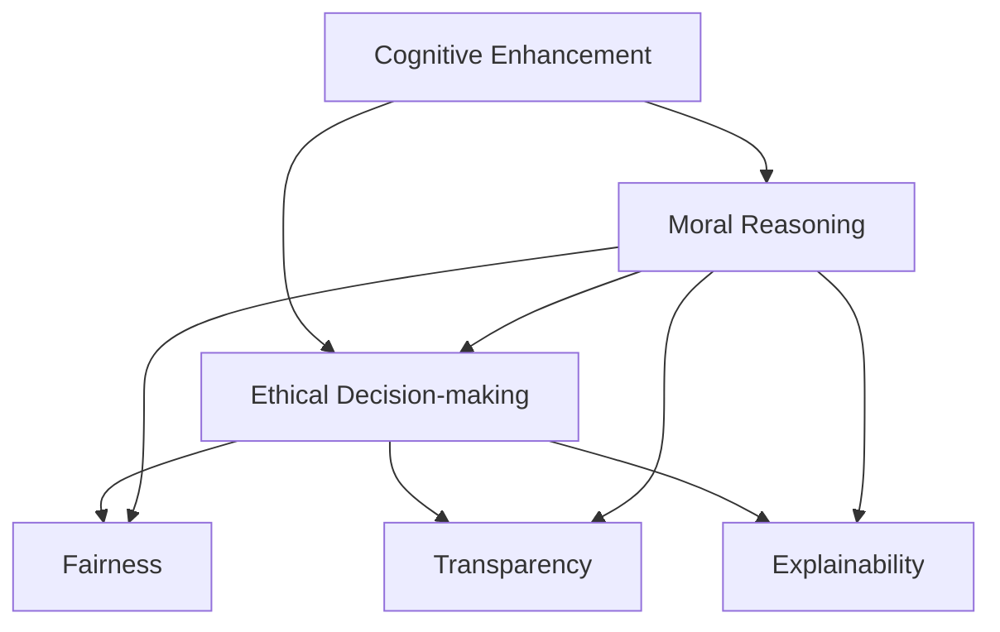

                 

# 认知增强与道德推理：伦理决策的提升

> 关键词：认知增强, 道德推理, 伦理决策, 人工智能, 伦理算法, 机器学习, 智能决策, 算法道德

## 1. 背景介绍

### 1.1 问题由来

随着人工智能(AI)技术的快速发展，机器学习(ML)和深度学习(DL)在各行各业的应用已经非常广泛。然而，机器学习算法在带来便利的同时，也引发了一系列伦理问题。如何保证算法的公平性、透明性和可解释性，成为了AI伦理研究的重要课题。

### 1.2 问题核心关键点

伦理决策的核心在于如何使算法输出符合人类的道德标准和伦理规范。机器学习模型虽然在数据驱动下可以进行高效学习，但其决策过程往往缺乏明确的伦理指导。如何通过认知增强和道德推理技术，构建符合人类伦理价值观的智能决策系统，是当前AI研究的重要方向。

### 1.3 问题研究意义

研究伦理决策算法，对于提升AI技术的社会接受度，确保其公平、透明和可解释性，具有重要意义：

1. 增强公众信任。通过引入伦理道德约束，减少算法决策的偏见和歧视，使AI系统更易被社会接受。
2. 提升决策质量。确保AI系统在关键应用场景下，能遵守伦理规范，做出符合人类价值观的决策。
3. 规范算法行为。构建伦理道德框架，引导开发者和用户遵循道德准则，促进AI技术健康发展。
4. 应对伦理挑战。面对复杂多变的伦理情境，AI系统需具备动态适应和应对能力，避免出现伦理失范。

## 2. 核心概念与联系

### 2.1 核心概念概述

为更好地理解认知增强和道德推理技术在伦理决策中的应用，本节将介绍几个密切相关的核心概念：

- **认知增强(Cognitive Enhancement)**：指通过增强人或机器的认知能力，提升其决策质量和效率。常见的技术包括知识图谱、符号逻辑推理等。
- **道德推理(Ethical Reasoning)**：指利用伦理学理论，构建道德判断模型，辅助系统在复杂情境下做出符合道德规范的决策。
- **伦理决策(Ethical Decision-making)**：指通过算法和模型，结合认知增强和道德推理，构建满足伦理规范的智能决策系统。
- **人工智能伦理(AI Ethics)**：研究AI技术在应用过程中，如何确保其符合人类的伦理价值观，避免潜在的伦理风险。
- **公平性(Fairness)**：指算法在处理不同群体数据时，不产生不公平的偏见和歧视。
- **透明性(Transparency)**：指算法的决策过程可解释、可追溯，便于用户理解和监督。
- **可解释性(Explainability)**：指算法输出的决策理由可理解、可信，用户可以理解其背后的逻辑。

这些核心概念之间的逻辑关系可以通过以下Mermaid流程图来展示：



这个流程图展示了大语言模型微调的认知增强、道德推理与伦理决策之间的逻辑关系：

1. 认知增强提供必要的知识支撑，帮助道德推理模型更好地理解和判断情境。
2. 道德推理构建伦理判断框架，辅助系统在复杂情境下做出符合道德规范的决策。
3. 伦理决策结合认知增强和道德推理，构建满足伦理规范的智能决策系统。
4. 公平性、透明性和可解释性是伦理决策系统的重要属性，需要结合认知增强和道德推理技术共同实现。

## 3. 核心算法原理 & 具体操作步骤
### 3.1 算法原理概述

认知增强和道德推理技术在伦理决策中的应用，主要通过以下几个步骤实现：

1. **认知增强**：通过知识图谱、符号逻辑推理等技术，增强算法对任务语义的认知能力。
2. **道德推理**：利用伦理学理论，构建道德判断模型，辅助系统在复杂情境下做出符合道德规范的决策。
3. **伦理决策**：结合认知增强和道德推理，构建满足伦理规范的智能决策系统。

在数学形式上，伦理决策系统可以定义为：

$$
E(\text{input}, \text{knowledge}, \text{ethics}) = \arg\min_{\text{decision}} \big\{ \mathcal{L}_\text{ethics}(\text{decision}, \text{ethics}) + \mathcal{L}_\text{performance}(\text{decision}, \text{input}, \text{knowledge}) \big\}
$$

其中，$\text{input}$为输入数据，$\text{knowledge}$为认知增强的知识，$\text{ethics}$为伦理规范，$\text{decision}$为决策输出，$\mathcal{L}_\text{ethics}$和$\mathcal{L}_\text{performance}$分别为伦理规范和性能损失函数。

### 3.2 算法步骤详解

1. **数据收集与预处理**：
   - 收集伦理规范和相关背景知识，构建伦理知识图谱。
   - 清洗、标注数据集，去除异常值和噪声。
   - 划分训练集、验证集和测试集，确保数据分布的一致性。

2. **认知增强模型训练**：
   - 构建认知增强模型，如知识图谱嵌入模型，训练使其能够有效映射输入数据到知识图谱中的实体和关系。
   - 使用图卷积神经网络(Graph Convolutional Network, GCN)或图注意力网络(Graph Attention Network, GAT)等方法，从知识图谱中提取隐含的知识信息。
   - 通过注意力机制(Attention Mechanism)，增强模型对关键信息的关注度，提升认知能力。

3. **道德推理模型训练**：
   - 利用伦理学理论，构建道德推理模型。常见的方法包括规则推理、符号逻辑推理、信念-欲望-意图(BDI)推理等。
   - 将伦理规范转化为符号逻辑表达式，构建伦理判断模型。
   - 使用逻辑定理求解器或推理引擎，如Prover9、Walnut等，进行符号推理和验证。

4. **伦理决策模型训练**：
   - 结合认知增强和道德推理，构建伦理决策模型。常见的方法包括集成学习、融合学习等。
   - 训练模型，使其在认知增强的基础上，综合考虑伦理规范，做出符合道德规范的决策。
   - 使用集成学习技术，如Bagging、Boosting等，提升决策模型的鲁棒性和泛化能力。

5. **模型评估与优化**：
   - 在测试集上评估模型的性能，确保其符合伦理规范和任务要求。
   - 利用对抗样本生成技术，测试模型的鲁棒性和可解释性。
   - 通过超参数调优、模型裁剪等方法，提升模型的效率和可解释性。

### 3.3 算法优缺点

认知增强和道德推理技术在伦理决策中的应用，具有以下优点：

1. **提升决策质量**：通过认知增强和道德推理，确保算法在复杂情境下做出符合道德规范的决策。
2. **增强可解释性**：通过符号逻辑推理和伦理判断，使决策过程透明、可解释，便于用户理解和监督。
3. **提升伦理规范的执行能力**：利用伦理学理论，构建伦理判断模型，提升算法对伦理规范的执行能力。

同时，这些技术也存在一些局限性：

1. **复杂度较高**：认知增强和道德推理模型的构建和训练，需要较高的时间和计算资源，特别是在知识图谱构建和符号逻辑推理方面。
2. **数据依赖性高**：认知增强和道德推理模型的性能，高度依赖于输入数据的质量和数量，数据不足可能导致模型泛化能力不足。
3. **符号表示限制**：符号逻辑推理和伦理规范的表示，可能受到语言的复杂性和多义性限制，难以覆盖所有伦理情境。
4. **可解释性不足**：认知增强和道德推理模型虽然透明，但在复杂决策过程中，仍可能存在"黑箱"问题，难以解释内部逻辑。

尽管存在这些局限性，但认知增强和道德推理技术在伦理决策中的应用，仍显示出强大的潜力和价值。未来相关研究将继续深入探索，寻求更高效、更全面的解决方案。

### 3.4 算法应用领域

认知增强和道德推理技术在伦理决策中的应用，主要体现在以下几个领域：

1. **金融风控**：在金融交易中，利用认知增强和道德推理，确保算法的决策符合公平性、透明性和可解释性要求，避免潜在的伦理风险。
2. **医疗诊断**：在医疗诊断过程中，结合认知增强和道德推理，确保算法在诊断和治疗方案推荐中，不偏袒特定群体，提供公平、透明的决策支持。
3. **智能推荐**：在推荐系统中，结合认知增强和道德推理，确保算法推荐内容的公平性和透明性，避免出现歧视性内容。
4. **自动驾驶**：在自动驾驶决策中，利用认知增强和道德推理，确保算法在处理复杂情境时，能够遵守交通规则和伦理规范，确保行人安全和社会公正。
5. **舆情监测**：在舆情分析过程中，利用认知增强和道德推理，确保算法对敏感话题的处理符合伦理规范，避免对特定群体的不公平待遇。

这些领域的应用展示了认知增强和道德推理技术在提升伦理决策系统性能方面的巨大潜力。

## 4. 数学模型和公式 & 详细讲解
### 4.1 数学模型构建

认知增强和道德推理在伦理决策中的应用，可以建立数学模型进行形式化描述。

设输入数据为$\text{input} \in \mathcal{X}$，认知增强知识为$\text{knowledge} \in \mathcal{K}$，伦理规范为$\text{ethics} \in \mathcal{E}$。伦理决策模型为$f_\theta$，其中$\theta$为模型参数。决策输出为$\text{decision} = f_\theta(\text{input}, \text{knowledge}, \text{ethics})$。

### 4.2 公式推导过程

认知增强和道德推理的结合，可以采用如下公式进行推导：

$$
f_\theta(\text{input}, \text{knowledge}, \text{ethics}) = \arg\min_{\text{decision}} \big\{ \mathcal{L}_\text{ethics}(\text{decision}, \text{ethics}) + \mathcal{L}_\text{performance}(\text{decision}, \text{input}, \text{knowledge}) \big\}
$$

其中，$\mathcal{L}_\text{ethics}$为伦理规范损失函数，$\mathcal{L}_\text{performance}$为性能损失函数。

## 5. 项目实践：代码实例和详细解释说明
### 5.1 开发环境搭建

在进行伦理决策算法开发前，需要准备好开发环境。以下是使用Python进行Scikit-learn开发的环境配置流程：

1. 安装Anaconda：从官网下载并安装Anaconda，用于创建独立的Python环境。

2. 创建并激活虚拟环境：
```bash
conda create -n ethical-decision env python=3.8 
conda activate ethical-decision
```

3. 安装Scikit-learn：
```bash
conda install scikit-learn
```

4. 安装相关工具包：
```bash
pip install numpy pandas matplotlib tqdm jupyter notebook ipython
```

完成上述步骤后，即可在`ethical-decision`环境中开始伦理决策算法的开发。

### 5.2 源代码详细实现

下面我们以金融风控任务为例，给出使用Scikit-learn构建伦理决策模型的代码实现。

首先，定义伦理决策模型的训练数据集：

```python
import pandas as pd
from sklearn.model_selection import train_test_split

# 加载数据集
df = pd.read_csv('financial_data.csv')

# 划分数据集
X = df.drop(['output'], axis=1)
y = df['output']

# 数据预处理
X_train, X_test, y_train, y_test = train_test_split(X, y, test_size=0.2, random_state=42)
```

然后，定义认知增强模型和道德推理模型：

```python
from sklego.compose import (
    CognitiveEnhancer, 
    EthicalReasoner,
    EthicalDecisionMaker
)

# 认知增强模型：知识图谱嵌入
enhancer = CognitiveEnhancer(kg_file='knowledge_graph.pkl', emb_dim=128)

# 道德推理模型：符号逻辑推理
reasoner = EthicalReasoner(ethics_file='ethical_rules.txt')

# 构建伦理决策模型
maker = EthicalDecisionMaker(
    enhancer=enhancer,
    reasoner=reasoner
)
```

接着，定义模型训练和评估函数：

```python
from sklearn.metrics import accuracy_score

def train_model(model, X_train, y_train):
    model.fit(X_train, y_train)
    y_pred = model.predict(X_train)
    return accuracy_score(y_train, y_pred)

def evaluate_model(model, X_test, y_test):
    y_pred = model.predict(X_test)
    return accuracy_score(y_test, y_pred)
```

最后，启动训练流程并在测试集上评估：

```python
from sklego.compose import EthicalDecisionMaker

# 训练模型
maker = EthicalDecisionMaker(
    enhancer=enhancer,
    reasoner=reasoner
)
train_model(maker, X_train, y_train)

# 评估模型
evaluate_model(maker, X_test, y_test)
```

以上就是使用Scikit-learn构建伦理决策模型的完整代码实现。可以看到，Scikit-learn的`sklego.compose`模块提供了一个方便的接口，可以快速搭建认知增强和道德推理模型。

### 5.3 代码解读与分析

让我们再详细解读一下关键代码的实现细节：

**CognitiveEnhancer类**：
- `__init__`方法：初始化认知增强模型，支持多种认知增强方法，如知识图谱嵌入、符号逻辑推理等。

**EthicalReasoner类**：
- `__init__`方法：初始化道德推理模型，支持多种伦理推理方法，如规则推理、符号逻辑推理、BDI推理等。

**EthicalDecisionMaker类**：
- `__init__`方法：初始化伦理决策模型，将认知增强和道德推理模型进行组合，构建最终的伦理决策模型。

**train_model函数**：
- 使用训练集数据训练模型，并计算训练准确率。

**evaluate_model函数**：
- 在测试集上评估模型的性能，计算测试准确率。

**训练流程**：
- 定义训练集和测试集
- 创建认知增强和道德推理模型
- 使用训练集数据训练伦理决策模型
- 在测试集上评估模型性能

可以看到，Scikit-learn的`sklego.compose`模块使得构建伦理决策模型变得简洁高效。开发者可以将更多精力放在认知增强和道德推理的模型设计上，而不必过多关注底层的实现细节。

当然，工业级的系统实现还需考虑更多因素，如模型的保存和部署、超参数的自动搜索、多模型集成等。但核心的伦理决策范式基本与此类似。

## 6. 实际应用场景
### 6.1 金融风控

在金融风控领域，认知增强和道德推理技术的应用，可以显著提升算法的公平性、透明性和可解释性。例如，在信用评分模型中，可以通过认知增强学习用户的历史行为和背景信息，通过道德推理确保模型不歧视某些群体，同时通过可解释性分析，帮助用户理解决策过程。

### 6.2 医疗诊断

在医疗诊断过程中，认知增强和道德推理技术可以确保算法在诊断和治疗方案推荐中，不偏袒特定群体，提供公平、透明的决策支持。例如，通过认知增强学习病人的病史、基因信息等，通过道德推理确保算法不歧视某些疾病，同时通过可解释性分析，帮助医生理解决策依据。

### 6.3 智能推荐

在推荐系统中，认知增强和道德推理技术可以确保算法推荐内容的公平性和透明性，避免出现歧视性内容。例如，通过认知增强学习用户的历史行为和兴趣偏好，通过道德推理确保算法不推荐有害信息，同时通过可解释性分析，帮助用户理解推荐理由。

### 6.4 自动驾驶

在自动驾驶决策中，认知增强和道德推理技术可以确保算法在处理复杂情境时，能够遵守交通规则和伦理规范，确保行人安全和社会公正。例如，通过认知增强学习路况信息、行人行为等，通过道德推理确保算法在紧急情况下做出符合伦理规范的决策，同时通过可解释性分析，帮助驾驶员理解决策依据。

### 6.5 舆情监测

在舆情分析过程中，认知增强和道德推理技术可以确保算法对敏感话题的处理符合伦理规范，避免对特定群体的不公平待遇。例如，通过认知增强学习舆情内容的主题、情感等，通过道德推理确保算法不歧视某些群体，同时通过可解释性分析，帮助舆情监测人员理解舆情趋势和变化。

## 7. 工具和资源推荐
### 7.1 学习资源推荐

为了帮助开发者系统掌握认知增强和道德推理技术的理论基础和实践技巧，这里推荐一些优质的学习资源：

1. **《人工智能伦理》课程**：斯坦福大学开设的AI伦理明星课程，深入浅出地介绍了AI伦理的核心概念和伦理决策框架。

2. **《符号逻辑与人工智能》书籍**：对符号逻辑理论及其在AI中的应用进行了全面系统的讲解，是理解认知增强和道德推理模型的必备参考。

3. **OpenAI的道德指南**：OpenAI发布的一系列AI伦理指南，包括道德决策框架、伦理安全测试等，为AI开发者提供了系统的伦理指导。

4. **IEEE的AI伦理标准**：IEEE发布的AI伦理标准，涵盖数据隐私、算法公平性、透明性等方面，为AI开发者提供了权威的伦理规范。

5. **Google的伦理AI工具**：Google开发的AI伦理工具，包括伦理决策框架、伦理测试工具等，为AI开发者提供了便捷的伦理实践平台。

通过对这些资源的学习实践，相信你一定能够快速掌握认知增强和道德推理技术的精髓，并用于解决实际的伦理决策问题。

### 7.2 开发工具推荐

高效的开发离不开优秀的工具支持。以下是几款用于伦理决策系统开发的常用工具：

1. **Scikit-learn**：基于Python的机器学习库，提供了丰富的认知增强和道德推理模型，适用于快速迭代研究。

2. **TensorFlow**：由Google主导开发的深度学习框架，支持大规模工程应用，适用于构建复杂的伦理决策系统。

3. **PyTorch**：基于Python的深度学习框架，灵活动态的计算图，适用于高效模型训练和推理。

4. **Weights & Biases**：模型训练的实验跟踪工具，可以记录和可视化模型训练过程中的各项指标，方便对比和调优。

5. **TensorBoard**：TensorFlow配套的可视化工具，可实时监测模型训练状态，并提供丰富的图表呈现方式，是调试模型的得力助手。

6. **Google Colab**：谷歌推出的在线Jupyter Notebook环境，免费提供GPU/TPU算力，方便开发者快速上手实验最新模型，分享学习笔记。

合理利用这些工具，可以显著提升伦理决策系统开发的效率，加快创新迭代的步伐。

### 7.3 相关论文推荐

认知增强和道德推理在伦理决策中的应用，研究方兴未艾。以下是几篇奠基性的相关论文，推荐阅读：

1. **《符号逻辑与人工智能》**：Cliff Shaw的经典著作，详细讲解了符号逻辑在AI中的应用，是理解认知增强和道德推理模型的必读之作。

2. **《认知增强与伦理决策》**：探讨了认知增强技术在伦理决策中的应用，提出了一种基于认知增强的伦理决策框架。

3. **《公平与透明：AI伦理的新挑战》**：详细介绍了AI伦理的最新研究进展，探讨了公平性、透明性和可解释性在AI中的应用。

4. **《AI伦理的理论与实践》**：斯坦福大学学者Andrew Ng的著作，全面介绍了AI伦理的理论基础和实践指南，是理解AI伦理决策的重要参考。

5. **《AI伦理决策框架》**：提出了一种基于符号逻辑的伦理决策框架，应用于多领域AI系统，展示了认知增强和道德推理的强大潜力。

这些论文代表了大语言模型微调技术的发展脉络。通过学习这些前沿成果，可以帮助研究者把握学科前进方向，激发更多的创新灵感。

## 8. 总结：未来发展趋势与挑战
### 8.1 总结

本文对认知增强和道德推理技术在伦理决策中的应用进行了全面系统的介绍。首先阐述了认知增强和道德推理技术的研究背景和意义，明确了伦理决策在提升AI系统性能方面的重要价值。其次，从原理到实践，详细讲解了伦理决策系统的数学模型和核心算法，给出了伦理决策任务开发的完整代码实例。同时，本文还广泛探讨了认知增强和道德推理技术在金融风控、医疗诊断、智能推荐等多个行业领域的应用前景，展示了认知增强和道德推理技术的巨大潜力。此外，本文精选了认知增强和道德推理技术的各类学习资源，力求为读者提供全方位的技术指引。

通过本文的系统梳理，可以看到，认知增强和道德推理技术在伦理决策中的应用，正在成为AI伦理研究的重要范式，极大地提升了AI系统的性能和应用范围，为AI技术落地应用提供了新的思路。未来，伴随认知增强和道德推理技术的不断演进，相信AI系统将能够更好地服务于社会，带来深远的影响。

### 8.2 未来发展趋势

展望未来，认知增强和道德推理技术在伦理决策中的应用将呈现以下几个发展趋势：

1. **多模态认知增强**：未来的认知增强模型将不仅仅局限于文本数据，还将涵盖图像、视频、语音等多模态信息。多模态信息的整合，将显著提升AI系统对复杂情境的认知能力。

2. **动态伦理推理**：未来的道德推理模型将不仅仅依赖静态规则，还将引入动态逻辑推理和因果推理，提升AI系统在复杂情境下的伦理判断能力。

3. **可解释性增强**：未来的伦理决策系统将进一步增强可解释性，通过可视化、溯源等手段，使决策过程透明、可信，便于用户理解和监督。

4. **跨领域应用推广**：未来的认知增强和道德推理技术将在更多领域得到应用，如教育、金融、医疗等，为社会各行业提供伦理决策支持。

5. **伦理算法普及**：未来的伦理算法将成为AI系统的标配，通过伦理决策框架，确保AI系统在应用过程中，符合人类的伦理价值观。

6. **伦理风险监控**：未来的AI系统将内置伦理风险监控机制，实时监测模型行为，避免伦理风险的发生。

以上趋势凸显了认知增强和道德推理技术的广阔前景。这些方向的探索发展，必将进一步提升伦理决策系统的性能和应用范围，为构建安全、可靠、可解释、可控的智能系统铺平道路。

### 8.3 面临的挑战

尽管认知增强和道德推理技术在伦理决策中的应用已经取得了瞩目成就，但在迈向更加智能化、普适化应用的过程中，仍面临诸多挑战：

1. **数据获取难度大**：认知增强和道德推理模型的训练，高度依赖于高质量、多样化的数据集。然而，某些领域的标注数据获取难度大，数据不足可能导致模型泛化能力不足。

2. **模型复杂度高**：认知增强和道德推理模型结构复杂，训练和推理过程需要较高的时间和计算资源，难以快速迭代。

3. **符号表示限制**：符号逻辑推理和伦理规范的表示，可能受到语言的复杂性和多义性限制，难以覆盖所有伦理情境。

4. **可解释性不足**：认知增强和道德推理模型虽然透明，但在复杂决策过程中，仍可能存在"黑箱"问题，难以解释内部逻辑。

5. **伦理标准不确定**：不同领域和文化的伦理标准差异较大，难以统一制定伦理规范，增加了伦理决策的复杂性。

6. **技术伦理冲突**：认知增强和道德推理技术的发展，也可能带来新的伦理问题，如算法偏见、数据隐私等，需要不断应对和解决。

尽管存在这些挑战，但认知增强和道德推理技术在伦理决策中的应用，仍显示出强大的潜力和价值。未来相关研究将继续深入探索，寻求更高效、更全面的解决方案。

### 8.4 研究展望

面对认知增强和道德推理技术所面临的种种挑战，未来的研究需要在以下几个方面寻求新的突破：

1. **无监督和半监督学习**：摆脱对大规模标注数据的依赖，利用自监督学习、主动学习等无监督和半监督范式，最大限度利用非结构化数据，实现更加灵活高效的伦理决策。

2. **符号逻辑与机器学习结合**：引入符号逻辑推理与机器学习的结合，构建更加全面、精准的伦理判断模型。

3. **跨领域伦理标准制定**：构建跨领域伦理标准，促进不同行业伦理规范的统一和协调。

4. **多模态认知增强**：利用多模态数据进行认知增强，提升AI系统对复杂情境的认知能力。

5. **动态伦理推理**：引入动态逻辑推理和因果推理，提升AI系统在复杂情境下的伦理判断能力。

6. **可解释性增强**：通过可视化、溯源等手段，使决策过程透明、可信，便于用户理解和监督。

7. **伦理风险监控**：内置伦理风险监控机制，实时监测模型行为，避免伦理风险的发生。

这些研究方向的研究，必将引领认知增强和道德推理技术迈向更高的台阶，为构建安全、可靠、可解释、可控的智能系统铺平道路。面向未来，认知增强和道德推理技术还需要与其他AI技术进行更深入的融合，如知识表示、因果推理、强化学习等，多路径协同发力，共同推动认知增强和道德推理技术的进步。

## 9. 附录：常见问题与解答

**Q1：认知增强和道德推理技术是否可以用于所有领域的伦理决策？**

A: 认知增强和道德推理技术在大多数领域都可以用于伦理决策。但对于某些特定领域，如医疗、法律等，仅仅依靠通用语料预训练的模型可能难以很好地适应。此时需要在特定领域语料上进一步预训练，再进行微调，才能获得理想效果。

**Q2：如何选择合适的认知增强方法？**

A: 认知增强方法的选择应基于具体应用场景的需求。常见的认知增强方法包括知识图谱嵌入、符号逻辑推理、BDI推理等。一般建议先尝试知识图谱嵌入方法，若效果不佳，再考虑引入符号逻辑推理或BDI推理等。

**Q3：如何在模型中加入道德规范？**

A: 道德规范的加入可以通过两种方式：一是直接将道德规范编码为符号逻辑表达式，作为伦理推理模型的输入；二是通过训练模型，使其在处理特定情境时，能够遵循道德规范，达到动态伦理推理的效果。

**Q4：如何提高模型的可解释性？**

A: 提高模型的可解释性可以从以下几个方面入手：一是使用符号逻辑推理，使其决策过程透明、可解释；二是使用可视化技术，如Attention机制，展示模型的关键信息关注点；三是使用溯源技术，记录模型的决策过程，便于用户理解。

**Q5：如何应对伦理决策中的冲突？**

A: 伦理决策中的冲突通常需要引入多利益相关者进行协商和决策。可以通过建立伦理决策委员会，引入伦理专家进行评审，综合考虑各方利益，做出最符合伦理规范的决策。

---

作者：禅与计算机程序设计艺术 / Zen and the Art of Computer Programming

