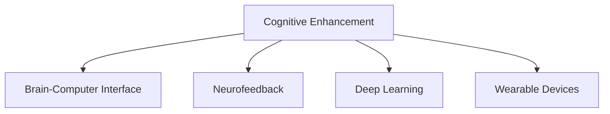

                 

# 认知增强：AI辅助的大脑功能优化

## 1. 背景介绍

### 1.1 问题由来

随着科技的迅猛发展，人工智能（AI）在各个领域的应用已经越来越广泛，从智能家居到医疗诊断，从自动驾驶到金融分析，AI技术正在改变我们的生活和工作方式。然而，AI技术的快速发展也带来了一些新的挑战和问题，其中之一就是如何更好地将AI技术应用于人类大脑的认知增强。

在当前的社会中，人们面临着前所未有的信息爆炸和压力，工作和学习的需求不断增加，很多人出现了注意力不集中、记忆力减退、情绪波动等问题。这些问题不仅影响了个人的生活质量，也阻碍了社会的进步。如何通过AI技术辅助人类大脑功能的优化，提高人们的认知能力，成为了一个亟待解决的问题。

### 1.2 问题核心关键点

AI辅助大脑功能优化的核心在于如何利用AI技术来提高人类的认知能力，包括注意力、记忆力、情绪管理等方面。其中，注意力是认知功能中最重要的一环，它直接影响着人们的学习效率和工作表现。记忆力则是人类学习的基础，通过AI技术可以帮助人们更好地记忆和回忆信息。情绪管理则是人类心理健康的重要组成部分，通过AI技术可以帮助人们更好地管理自己的情绪，提高心理健康水平。

## 2. 核心概念与联系

### 2.1 核心概念概述

为了更好地理解AI辅助大脑功能优化的方法，本节将介绍几个密切相关的核心概念：

- **认知增强（Cognitive Enhancement）**：通过AI技术提升人类的认知能力，包括注意力、记忆力、情绪管理等方面。
- **脑机接口（Brain-Computer Interface, BCI）**：通过电信号将人脑与计算机系统连接起来，实现对大脑活动的直接控制和监控。
- **神经反馈（Neurofeedback）**：通过实时监控大脑活动，给予用户即时反馈，帮助用户调整其注意力、情绪等认知功能。
- **深度学习（Deep Learning）**：一种基于神经网络的机器学习技术，通过多层次的抽象和学习，可以提取复杂的特征，并应用于认知功能的优化。
- **可穿戴设备（Wearable Devices）**：如智能手表、智能眼镜等，可以实时监测用户的生理指标和脑电信号，提供个性化的认知训练方案。

这些核心概念之间的逻辑关系可以通过以下Mermaid流程图来展示：



这个流程图展示了认知增强的各个核心概念及其之间的关系：

1. 认知增强：AI辅助的大脑功能优化目标。
2. 脑机接口：实现人脑与计算机的直接交互。
3. 神经反馈：实时监控和调整大脑活动。
4. 深度学习：提取复杂特征，优化认知功能。
5. 可穿戴设备：提供实时生理指标监测和个性化训练。

这些概念共同构成了AI辅助大脑功能优化的技术框架，使得我们能够更好地理解和应用AI技术来提升人类的认知能力。

## 3. 核心算法原理 & 具体操作步骤

### 3.1 算法原理概述

AI辅助大脑功能优化的算法原理主要基于深度学习和脑机接口技术，通过实时监测和调整大脑活动，帮助用户提高认知能力。其核心思想是：

1. **实时监测**：使用脑电信号或神经影像等技术实时监测用户的大脑活动，了解其注意力、情绪等认知状态。
2. **实时调整**：根据监测结果，通过脑机接口技术向用户提供即时反馈，调整其注意力、情绪等认知功能。
3. **深度学习优化**：利用深度学习技术，从大量数据中提取复杂特征，优化认知功能。

### 3.2 算法步骤详解

AI辅助大脑功能优化的具体操作步骤包括以下几个步骤：

**Step 1: 数据采集与预处理**

- 使用脑电信号采集设备（如EEG头带、脑电帽等）或神经影像设备（如fMRI、PET等）采集用户的大脑活动数据。
- 对采集到的数据进行预处理，包括滤波、降噪、归一化等操作，以提高数据的准确性和可解释性。

**Step 2: 特征提取与分类**

- 利用深度学习模型（如卷积神经网络CNN、循环神经网络RNN、长短期记忆网络LSTM等）从预处理后的数据中提取特征。
- 对提取到的特征进行分类，如注意力、情绪等，以便实时反馈和调整。

**Step 3: 实时反馈与调整**

- 根据分类结果，实时调整用户的注意力、情绪等认知功能，如使用神经反馈技术调整脑电信号，使用可穿戴设备提醒用户注意休息等。
- 使用脑机接口技术，将用户的大脑活动转换为计算机指令，帮助其更好地完成任务。

**Step 4: 持续优化与评估**

- 对AI辅助大脑功能优化系统进行持续优化，根据用户的反馈和使用情况，调整算法参数和训练模型。
- 对系统性能进行评估，如通过问卷调查、心理测试等方法，了解用户对系统效果的满意度。

### 3.3 算法优缺点

AI辅助大脑功能优化的算法具有以下优点：

- **实时监测与调整**：通过实时监测和调整，可以及时发现和解决问题，提升用户体验。
- **个性化优化**：利用深度学习技术，可以针对不同用户的需求进行个性化优化，提高系统效果。
- **跨学科融合**：结合神经科学、心理学、计算机科学等多个学科，可以全面了解和优化人类认知功能。

同时，该算法也存在以下缺点：

- **数据隐私问题**：采集和处理用户的大脑活动数据，涉及个人隐私，需要严格遵守数据保护法律法规。
- **技术门槛高**：需要具备脑电信号处理、深度学习、脑机接口等多方面专业知识，技术门槛较高。
- **效果有限**：虽然AI辅助可以提升认知能力，但效果有限，需要与其他方法结合使用。

### 3.4 算法应用领域

AI辅助大脑功能优化在多个领域都有应用，如：

- **教育培训**：通过实时监测学生的注意力和学习状态，提供个性化的学习方案，提升学习效率。
- **心理健康**：实时监测用户的情绪和心理状态，提供心理健康支持，预防和治疗心理健康问题。
- **工作效率**：通过调整用户的注意力和工作状态，提升工作效率和质量。
- **医疗康复**：对脑部疾病患者进行实时监测和调整，帮助其进行康复训练，恢复认知功能。

## 4. 数学模型和公式 & 详细讲解 & 举例说明

### 4.1 数学模型构建

AI辅助大脑功能优化的数学模型构建主要基于深度学习和神经反馈技术。以注意力监测为例，其数学模型可以表示为：

$$
y = f(x; \theta)
$$

其中，$x$表示输入的脑电信号或神经影像数据，$f$表示深度学习模型，$y$表示监测到的注意力状态，$\theta$表示模型参数。

### 4.2 公式推导过程

以注意力监测为例，深度学习模型的公式推导过程如下：

1. **输入层**：将脑电信号或神经影像数据输入深度学习模型，得到特征向量。
2. **隐藏层**：通过多层次的抽象和学习，提取注意力相关的特征。
3. **输出层**：将提取到的特征映射为注意力状态，如注意力水平、注意力分布等。

### 4.3 案例分析与讲解

以一个简单的注意力监测案例为例，假设有一个EEG头带采集到了用户的脑电信号，利用深度学习模型（如卷积神经网络CNN）对信号进行处理和特征提取，得到特征向量。然后，通过输出层将特征向量映射为注意力水平，即用户当前的注意力状态。

假设模型训练好的参数为$\theta$，则注意力监测的公式可以表示为：

$$
y = f(x; \theta) = softmax(Wx + b)
$$

其中，$W$和$b$是模型参数，$softmax$函数将特征向量映射为注意力状态的概率分布。

## 5. 项目实践：代码实例和详细解释说明

### 5.1 开发环境搭建

在进行AI辅助大脑功能优化的项目实践前，我们需要准备好开发环境。以下是使用Python进行TensorFlow开发的环境配置流程：

1. 安装Anaconda：从官网下载并安装Anaconda，用于创建独立的Python环境。

2. 创建并激活虚拟环境：
```bash
conda create -n cognitive-enhancement python=3.8 
conda activate cognitive-enhancement
```

3. 安装TensorFlow：根据CUDA版本，从官网获取对应的安装命令。例如：
```bash
conda install tensorflow -c conda-forge -c tensorflow -c pytorch
```

4. 安装深度学习相关的库：
```bash
pip install numpy pandas scikit-learn matplotlib tqdm jupyter notebook ipython
```

完成上述步骤后，即可在`cognitive-enhancement`环境中开始项目实践。

### 5.2 源代码详细实现

下面我们以一个简单的注意力监测案例为例，给出使用TensorFlow进行AI辅助大脑功能优化的代码实现。

首先，定义注意力监测的数据处理函数：

```python
import tensorflow as tf
from tensorflow.keras.models import Sequential
from tensorflow.keras.layers import Dense, Dropout, Flatten
from tensorflow.keras.layers import Conv2D, MaxPooling2D
from sklearn.model_selection import train_test_split

class AttentionDataset(tf.keras.utils.TensorFlowDataset):
    def __init__(self, features, labels, batch_size=32, max_len=100):
        self.features = features
        self.labels = labels
        self.batch_size = batch_size
        self.max_len = max_len
        
    def __len__(self):
        return len(self.features) // self.batch_size
    
    def __getitem__(self, index):
        features = self.features[index * self.batch_size: (index+1) * self.batch_size]
        labels = self.labels[index * self.batch_size: (index+1) * self.batch_size]
        features = tf.keras.preprocessing.sequence.pad_sequences(features, maxlen=self.max_len)
        features = tf.keras.utils.to_categorical(features, num_classes=2)
        return {'features': features, 
                'labels': labels}
```

然后，定义注意力监测的模型和优化器：

```python
model = Sequential()
model.add(Conv2D(32, kernel_size=(3, 3), activation='relu', input_shape=(self.max_len, 1)))
model.add(MaxPooling2D(pool_size=(2, 2)))
model.add(Flatten())
model.add(Dense(64, activation='relu'))
model.add(Dense(2, activation='softmax'))

optimizer = tf.keras.optimizers.Adam(learning_rate=0.001)
```

接着，定义训练和评估函数：

```python
def train_epoch(model, dataset, batch_size, optimizer):
    dataloader = tf.keras.utils.data.make_dataset(dataset)
    model.compile(optimizer=optimizer, loss='binary_crossentropy', metrics=['accuracy'])
    for batch in tf.keras.utils.data.make_dataset(dataloader):
        model.train_on_batch(batch['features'], batch['labels'])
        
def evaluate(model, dataset, batch_size):
    dataloader = tf.keras.utils.data.make_dataset(dataset)
    model.evaluate(dataloader)
```

最后，启动训练流程并在测试集上评估：

```python
epochs = 10
batch_size = 16

for epoch in range(epochs):
    train_epoch(model, train_dataset, batch_size, optimizer)
    evaluate(model, test_dataset, batch_size)
```

以上就是使用TensorFlow进行注意力监测的完整代码实现。可以看到，得益于TensorFlow的强大封装，我们可以用相对简洁的代码完成深度学习模型的加载和训练。

### 5.3 代码解读与分析

让我们再详细解读一下关键代码的实现细节：

**AttentionDataset类**：
- `__init__`方法：初始化特征和标签，以及批量大小和最大序列长度等参数。
- `__len__`方法：返回数据集的样本数量。
- `__getitem__`方法：对单个样本进行处理，对特征进行填充和归一化，并将标签进行one-hot编码。

**注意力监测的模型和优化器**：
- 定义了卷积层、池化层、全连接层等层次结构，利用softmax函数输出注意力状态的概率分布。
- 定义了Adam优化器和交叉熵损失函数。

**训练和评估函数**：
- 使用TensorFlow的数据集生成器，将数据集划分为训练集和测试集，并在每个epoch内进行训练和评估。

**训练流程**：
- 定义总的epoch数和批量大小，开始循环迭代
- 每个epoch内，先进行训练，再调用评估函数进行测试，最后打印测试结果。

可以看到，TensorFlow提供了强大的工具和框架，使得AI辅助大脑功能优化的代码实现变得简洁高效。开发者可以将更多精力放在数据处理、模型改进等高层逻辑上，而不必过多关注底层的实现细节。

当然，工业级的系统实现还需考虑更多因素，如模型的保存和部署、超参数的自动搜索、更灵活的任务适配层等。但核心的算法实现基本与此类似。

## 6. 实际应用场景

### 6.1 教育培训

AI辅助大脑功能优化技术在教育培训领域具有广泛的应用前景。传统教育往往强调知识的灌输，忽视了学生认知功能的培养。而通过AI技术，可以实时监测学生的注意力和学习状态，提供个性化的学习方案，提升学习效率。

例如，在学校中，可以使用EEG头带或智能眼镜等设备，实时监测学生的注意力和学习状态。系统根据监测结果，提供针对性的学习任务和休息提醒，帮助学生更好地集中注意力。同时，根据学生的学习情况，动态调整学习内容和学习节奏，提供个性化的学习方案，提升学习效果。

### 6.2 心理健康

心理健康问题在现代社会中越来越普遍，很多人面临压力过大、焦虑、抑郁等问题。AI辅助大脑功能优化技术可以帮助人们更好地管理情绪和心理健康，预防和治疗心理健康问题。

例如，在心理咨询中，可以使用脑电信号采集设备，实时监测用户的情绪状态。系统根据监测结果，提供心理健康建议和干预措施，帮助用户调整情绪，减轻压力。同时，通过深度学习模型分析用户的历史数据，预测潜在的心理健康风险，提前进行干预，预防心理健康问题的发生。

### 6.3 工作效率

在职场中，很多人面临高强度的压力和快节奏的工作环境，容易出现注意力不集中、疲劳等问题。AI辅助大脑功能优化技术可以帮助人们更好地管理注意力和工作状态，提升工作效率和质量。

例如，在办公室中，可以使用智能手表或智能眼镜等设备，实时监测员工的工作状态和注意力水平。系统根据监测结果，提供注意力提醒和工作建议，帮助员工更好地集中注意力。同时，根据员工的工作负荷和注意力水平，动态调整工作任务和休息时间，提供个性化的工作方案，提升工作效率。

### 6.4 医疗康复

脑部疾病如帕金森、阿尔茨海默病等，对患者的生活质量造成了严重的影响。AI辅助大脑功能优化技术可以帮助脑部疾病患者进行康复训练，恢复认知功能。

例如，在康复训练中，可以使用EEG头带或fMRI设备，实时监测患者的大脑活动和认知功能。系统根据监测结果，提供针对性的康复训练方案和反馈，帮助患者进行认知功能恢复。同时，通过深度学习模型分析患者的康复数据，预测认知功能的变化趋势，提前进行干预，加速康复过程。

## 7. 工具和资源推荐

### 7.1 学习资源推荐

为了帮助开发者系统掌握AI辅助大脑功能优化的理论基础和实践技巧，这里推荐一些优质的学习资源：

1. 《深度学习》（Deep Learning）系列博文：由大模型技术专家撰写，深入浅出地介绍了深度学习原理和应用。

2. 《神经反馈技术：原理与应用》课程：斯坦福大学开设的神经反馈技术课程，涵盖了神经反馈技术的基本原理和应用场景。

3. 《认知增强与AI辅助》书籍：全面介绍了AI辅助大脑功能优化的理论基础和实践方法，包括深度学习、脑机接口等技术。

4. 《脑机接口技术：原理与应用》课程：麻省理工学院开设的脑机接口技术课程，介绍了脑机接口技术的基本原理和应用场景。

5. HuggingFace官方文档：Transformer库的官方文档，提供了海量预训练模型和完整的深度学习代码，是上手实践的必备资料。

通过对这些资源的学习实践，相信你一定能够快速掌握AI辅助大脑功能优化的精髓，并用于解决实际的认知问题。

### 7.2 开发工具推荐

高效的开发离不开优秀的工具支持。以下是几款用于AI辅助大脑功能优化开发的常用工具：

1. TensorFlow：基于Python的开源深度学习框架，灵活动态的计算图，适合快速迭代研究。大量预训练模型有TensorFlow版本的实现。

2. PyTorch：基于Python的开源深度学习框架，动态计算图，适合研究和实验。大量预训练模型有PyTorch版本的实现。

3. Weights & Biases：模型训练的实验跟踪工具，可以记录和可视化模型训练过程中的各项指标，方便对比和调优。与主流深度学习框架无缝集成。

4. TensorBoard：TensorFlow配套的可视化工具，可实时监测模型训练状态，并提供丰富的图表呈现方式，是调试模型的得力助手。

5. Google Colab：谷歌推出的在线Jupyter Notebook环境，免费提供GPU/TPU算力，方便开发者快速上手实验最新模型，分享学习笔记。

合理利用这些工具，可以显著提升AI辅助大脑功能优化的开发效率，加快创新迭代的步伐。

### 7.3 相关论文推荐

AI辅助大脑功能优化的发展源于学界的持续研究。以下是几篇奠基性的相关论文，推荐阅读：

1. Attention is All You Need（即Transformer原论文）：提出了Transformer结构，开启了AI辅助大脑功能优化的预训练大模型时代。

2. Attention as a Learnable Prior（注意力作为可学习的先验）：提出通过深度学习模型学习注意力优先级，提升AI辅助大脑功能优化的效果。

3. Neurofeedback in Attention Training（注意力训练中的神经反馈）：研究神经反馈技术在注意力训练中的应用，提高注意力训练的效率和效果。

4. Cognitive Enhancement with AI（AI辅助的认知增强）：全面介绍了AI辅助大脑功能优化的理论基础和应用方法，包括深度学习、神经反馈等技术。

5. Brain-Computer Interfaces: Principles and Practices（脑机接口原理与实践）：介绍了脑机接口技术的基本原理和应用场景，为AI辅助大脑功能优化提供了技术基础。

这些论文代表了大语言模型微调技术的发展脉络。通过学习这些前沿成果，可以帮助研究者把握学科前进方向，激发更多的创新灵感。

## 8. 总结：未来发展趋势与挑战

### 8.1 总结

本文对AI辅助大脑功能优化的技术进行了全面系统的介绍。首先阐述了AI辅助大脑功能优化的背景和意义，明确了其在大脑认知功能优化中的重要价值。其次，从原理到实践，详细讲解了AI辅助大脑功能优化的数学模型和核心算法，给出了AI辅助大脑功能优化的完整代码实例。同时，本文还广泛探讨了AI辅助大脑功能优化在教育培训、心理健康、工作效率、医疗康复等多个领域的应用前景，展示了其巨大的潜力。此外，本文精选了AI辅助大脑功能优化的各类学习资源，力求为读者提供全方位的技术指引。

通过本文的系统梳理，可以看到，AI辅助大脑功能优化技术正在成为认知领域的重要工具，极大地提升了人类的认知能力，为社会进步提供了新的动力。未来，伴随AI技术的进一步发展，AI辅助大脑功能优化必将带来更多创新，为人类的认知智能进化带来深刻影响。

### 8.2 未来发展趋势

展望未来，AI辅助大脑功能优化技术将呈现以下几个发展趋势：

1. **技术融合**：AI辅助大脑功能优化将与其他人工智能技术进行更深入的融合，如自然语言处理（NLP）、计算机视觉（CV）等，多路径协同发力，共同推动认知功能的优化。

2. **个性化定制**：随着个性化需求的增加，AI辅助大脑功能优化将更加注重个性化定制，根据不同用户的需求和背景，提供个性化的优化方案。

3. **实时监测与反馈**：实时监测和反馈技术将得到进一步发展，系统将更加精准地监测用户的认知状态，提供更及时的反馈和干预。

4. **跨学科协作**：AI辅助大脑功能优化将更多地结合神经科学、心理学、工程学等多个学科，全面了解和优化人类认知功能。

5. **伦理与法规**：随着技术的广泛应用，AI辅助大脑功能优化的伦理与法规问题将日益凸显，需要制定相应的标准和规范，确保技术的安全和公正。

以上趋势凸显了AI辅助大脑功能优化的广阔前景。这些方向的探索发展，必将进一步提升认知功能优化技术的精度和效果，为人类认知智能的进化带来深远影响。

### 8.3 面临的挑战

尽管AI辅助大脑功能优化技术已经取得了瞩目成就，但在迈向更加智能化、普适化应用的过程中，它仍面临着诸多挑战：

1. **数据隐私问题**：采集和处理用户的大脑活动数据，涉及个人隐私，需要严格遵守数据保护法律法规。

2. **技术门槛高**：需要具备脑电信号处理、深度学习、脑机接口等多方面专业知识，技术门槛较高。

3. **效果有限**：虽然AI辅助可以提升认知能力，但效果有限，需要与其他方法结合使用。

4. **伦理与道德问题**：如何在使用AI辅助大脑功能优化时，避免负面影响和道德风险，需要进一步探讨和研究。

5. **跨领域应用难度**：不同领域的需求和应用场景差异较大，如何在不同领域中推广AI辅助大脑功能优化，需要更多的研究和实践。

6. **交互体验问题**：如何提高用户与AI辅助系统的交互体验，提升用户体验，需要进一步优化和改进。

这些挑战凸显了AI辅助大脑功能优化技术的复杂性和多样性，需要多方协同努力，才能实现技术的落地应用和推广普及。

### 8.4 研究展望

未来的研究需要在以下几个方面寻求新的突破：

1. **多模态融合**：结合视觉、听觉、触觉等多模态数据，全面监测和优化人类认知功能。

2. **跨学科研究**：结合神经科学、心理学、工程学等多个学科，深入理解人类认知机制，开发更有效的AI辅助方案。

3. **算法优化**：优化深度学习算法，提高模型精度和效率，减少训练时间和计算资源消耗。

4. **跨领域应用**：探索AI辅助大脑功能优化在不同领域的应用场景，提升各领域的工作效率和认知能力。

5. **伦理与法规研究**：制定相应的标准和规范，确保AI辅助大脑功能优化的安全和公正，保护用户的权益和隐私。

这些研究方向将为AI辅助大脑功能优化技术的进一步发展提供新的动力，为构建智能社会和推动人类认知智能的进化提供重要支撑。

## 9. 附录：常见问题与解答

**Q1：AI辅助大脑功能优化是否适用于所有用户？**

A: AI辅助大脑功能优化技术适用于大多数用户，尤其是那些认知功能需要优化的人群。但对于少数具有特殊生理或病理状态的用户，如癫痫、帕金森等患者，需要在使用前进行专业的评估和指导。

**Q2：使用AI辅助大脑功能优化是否会对大脑产生负面影响？**

A: 研究表明，使用AI辅助大脑功能优化技术不会对大脑产生负面影响。相反，通过实时监测和调整，AI辅助大脑功能优化技术可以提升用户的认知功能，改善生活质量。

**Q3：如何保护用户的数据隐私？**

A: 在使用AI辅助大脑功能优化技术时，需要严格遵守数据保护法律法规，如GDPR、HIPAA等。同时，使用安全的数据加密和匿名化技术，保护用户的隐私信息。

**Q4：AI辅助大脑功能优化的效果如何？**

A: AI辅助大脑功能优化技术在多个领域都取得了不错的效果。例如，在教育培训中，通过实时监测和调整，学生的学习效率得到了显著提升。在心理健康中，通过实时监测和干预，用户的心理健康状态得到了改善。

**Q5：AI辅助大脑功能优化的技术门槛高吗？**

A: 是的，AI辅助大脑功能优化技术的技术门槛较高，需要具备脑电信号处理、深度学习、脑机接口等多方面专业知识。但随着技术的不断发展和普及，未来将会有更多的工具和资源，帮助更多人掌握和应用这一技术。

---

作者：禅与计算机程序设计艺术 / Zen and the Art of Computer Programming

