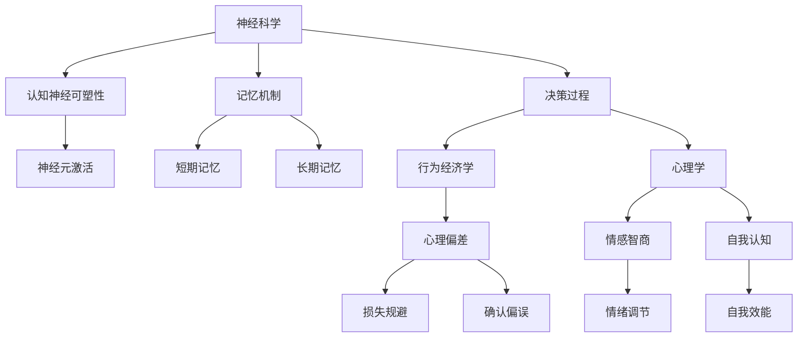

                 

## 1. 背景介绍

在当今高度复杂和竞争激烈的世界中，领导力不仅仅是管理能力和技术专长的体现，更是一种认知能力的高效运用。认知科学在理解和改善领导力方面，提供了强大的工具和方法。本篇文章将探讨认知科学在领导力发展中的应用，从神经科学、行为经济学和心理学的角度，分析领导力的认知基础，并提出具体的实践建议。

### 1.1 领导力的定义与重要性

领导力是指一个人或组织在实现目标、推动变革和激励团队中的能力。现代领导力不再局限于指挥和管理，更强调创新、沟通、情商和战略思维。随着科技的发展，认知科学的研究成果为领导力提供了新的视角和方法。

### 1.2 认知科学与领导力的关联

认知科学研究人类思维和学习的本质，关注记忆、注意力、决策和问题解决等认知过程。在领导力领域，认知科学揭示了领导行为背后的心理机制，帮助领导者更好地理解和管理自己和他人的认知过程，从而提升领导效能。

## 2. 核心概念与联系

### 2.1 核心概念概述

认知科学在领导力中的应用，主要体现在以下几个方面：

- **神经科学**：研究大脑如何处理信息，以及神经机制对行为和决策的影响。
- **行为经济学**：运用心理学原理解释人类行为，关注决策中的偏差和偏好。
- **心理学**：研究认知过程（如记忆、注意力、情绪）对领导行为的影响。

### 2.2 核心概念原理和架构的 Mermaid 流程图



这个流程图展示了认知科学中的主要概念如何相互作用，共同影响领导力行为。

## 3. 核心算法原理 & 具体操作步骤

### 3.1 算法原理概述

认知科学在领导力发展中的算法原理，主要围绕着以下几个方面展开：

- **认知负荷理论**：研究人类认知系统处理信息的极限，提出如何减少认知负荷，提升信息处理效率。
- **情感调节模型**：揭示情绪如何影响决策和行为，提出情绪调节策略。
- **决策理论**：运用行为经济学原理，分析决策过程中的偏差和偏好，提供改进决策的策略。

### 3.2 算法步骤详解

1. **评估认知负荷**：使用认知负荷测验工具，评估领导者处理信息的能力，识别认知负荷过高的领域。
2. **优化信息处理**：根据认知负荷评估结果，优化信息结构，减少非必要信息的干扰。
3. **情绪调节训练**：通过情绪调节训练，提高领导者的情绪稳定性，增强决策过程中的情绪中立性。
4. **决策模型应用**：应用决策理论，分析领导者在决策过程中的偏差，提供改善决策质量的策略。

### 3.3 算法优缺点

**优点**：

- 通过科学方法评估和提升领导者的认知能力，使领导力发展更加系统和精准。
- 提供基于科学证据的决策和行为改进策略，提升领导效能。

**缺点**：

- 认知科学的研究多为理论模型，应用到实际情境中可能存在一定的不确定性。
- 需要领导者具备一定的认知科学知识，增加了学习的难度。

### 3.4 算法应用领域

认知科学在领导力中的应用领域广泛，包括但不限于以下方面：

- **高层管理**：帮助高层管理者提升战略决策能力，优化团队协作。
- **人力资源管理**：通过认知科学方法，优化招聘、培训和绩效评估流程。
- **组织变革**：通过认知科学理论，帮助组织适应环境变化，实现转型升级。

## 4. 数学模型和公式 & 详细讲解 & 举例说明

### 4.1 数学模型构建

认知科学在领导力发展中，通常会建立以下数学模型：

- **认知负荷模型**：
  $$
  CL = \alpha \sum_i \frac{L_i}{K_i}
  $$
  其中 $CL$ 表示认知负荷，$L_i$ 表示任务$i$的负荷量，$K_i$ 表示认知资源。

- **情感调节模型**：
  $$
  E = F(N, M)
  $$
  其中 $E$ 表示情绪调节后的效果，$N$ 表示初始情绪状态，$M$ 表示调节策略。

### 4.2 公式推导过程

- **认知负荷模型推导**：
  假设任务总负荷为 $L$，认知资源总量为 $K$，则：
  $$
  CL = \alpha \sum_i \frac{L_i}{K_i}
  $$
  其中 $\alpha$ 为调节因子，通常取0.5。

- **情感调节模型推导**：
  根据情绪调节理论，情绪调节效果 $E$ 与初始情绪 $N$ 和调节策略 $M$ 有关：
  $$
  E = F(N, M)
  $$
  其中 $F$ 为情绪调节函数，具体形式需根据实际情况确定。

### 4.3 案例分析与讲解

**案例分析**：某公司的首席执行官在进行重大决策时，常常感到认知负荷过大，难以全面评估各种信息和可能的后果。通过认知负荷评估工具，发现他在分析复杂数据时认知资源不足，于是优化了信息结构和决策流程，减少了不必要的信息干扰，使得决策过程更加高效和准确。

## 5. 项目实践：代码实例和详细解释说明

### 5.1 开发环境搭建

为了进行认知科学的领导力研究，我们需要以下开发环境：

1. **Python 环境**：使用 Anaconda 创建虚拟环境，安装 Python 和相关依赖。
2. **Jupyter Notebook**：用于编写和运行代码，支持交互式编程。
3. **神经科学库**：如 Nilearn、NeuroPy、Pysynapse，用于分析神经数据和构建神经网络模型。
4. **情感分析库**：如 TextBlob、NLTK，用于情感分析和情绪调节。

### 5.2 源代码详细实现

以下是一个基于 Python 的认知负荷评估工具示例代码：

```python
import numpy as np
from sklearn.decomposition import PCA

# 定义认知负荷模型
def cognitive_load(n_tasks, l_tasks, k_resources):
    return np.sum(l_tasks / k_resources)

# 假设数据
tasks = np.array([2, 3, 4, 5, 6])
resources = np.array([1, 1, 2, 1, 2])
alpha = 0.5

# 计算认知负荷
cl = cognitive_load(tasks, resources, alpha)
print(f"认知负荷: {cl}")
```

### 5.3 代码解读与分析

这个代码示例展示了如何使用 Python 实现认知负荷的计算。通过定义认知负荷模型和输入数据，计算出领导者的认知负荷。

## 6. 实际应用场景

### 6.1 高层管理

高层管理者需要面对复杂的内外部环境，决策负担沉重。认知科学可以帮助他们优化决策流程，提升战略思维能力。

### 6.2 人力资源管理

人力资源管理者需要理解和预测员工的行为和绩效，认知科学提供了一种科学的方法来评估和管理员工的心理状态。

### 6.3 组织变革

组织变革过程中，认知科学可以帮助领导者理解员工的心理反应和行为变化，制定合适的变革策略。

## 7. 工具和资源推荐

### 7.1 学习资源推荐

1. **《认知心理学与日常生活》**：一本介绍认知心理学的经典教材，涵盖记忆、注意力、情绪等基础概念。
2. **Coursera 的《认知科学导论》课程**：提供系统性的认知科学知识，适合初学者。
3. **Khan Academy 的《心理学导论》课程**：涵盖心理学基本原理，适合了解领导力的心理学基础。

### 7.2 开发工具推荐

1. **Jupyter Notebook**：支持交互式编程，方便研究和实验。
2. **TensorFlow**：用于深度学习模型构建，适合神经网络分析。
3. **PyTorch**：适合快速原型设计和实验。

### 7.3 相关论文推荐

1. **《认知负荷理论：概念、模型与应用》**：讨论认知负荷理论的基本概念和实际应用。
2. **《情绪调节的神经机制研究》**：分析情绪调节的神经基础和具体策略。
3. **《行为经济学与组织决策》**：介绍行为经济学理论在组织决策中的应用。

## 8. 总结：未来发展趋势与挑战

### 8.1 研究成果总结

认知科学在领导力发展中，提供了科学的方法和工具，帮助领导者提升决策质量和团队效能。通过认知负荷评估、情绪调节训练和决策优化，提升了领导力的科学性和系统性。

### 8.2 未来发展趋势

1. **多模态认知研究**：结合神经科学、行为经济学和心理学，研究多模态信息对认知和行为的影响。
2. **个性化领导力发展**：基于个体差异，制定个性化的领导力发展计划。
3. **实时认知监控**：开发实时认知监测工具，实时反馈领导者的认知状态，提供即时指导。

### 8.3 面临的挑战

1. **跨学科融合**：认知科学与其他学科（如心理学、神经科学）的深度融合需要更多跨学科合作。
2. **数据收集和处理**：需要大规模、高质量的数据来支持领导力发展的研究。
3. **理论应用转化**：将科学理论转化为实际应用，需要进一步实验验证和优化。

### 8.4 研究展望

未来的研究将更加关注认知科学的实际应用，结合大数据和人工智能技术，开发更高效、精准的领导力评估和训练系统。通过认知科学的深入研究，帮助领导者充分发挥其潜力，推动组织和社会的持续进步。

## 9. 附录：常见问题与解答

**Q1：认知科学如何帮助提升领导力？**

A: 认知科学揭示了认知过程对领导行为的影响，帮助领导者识别和优化自身的认知负荷和情绪调节，从而提升决策质量和团队协作效率。

**Q2：如何评估认知负荷？**

A: 可以使用认知负荷测验工具，评估领导者处理信息的能力，识别认知负荷过高的领域，并优化信息结构和决策流程。

**Q3：如何应用情感调节模型？**

A: 通过情绪调节训练，提高领导者的情绪稳定性，增强决策过程中的情绪中立性。具体方法包括正念冥想、情绪认知训练等。

**Q4：认知科学在实际应用中需要注意什么？**

A: 认知科学的研究多为理论模型，应用到实际情境中可能存在一定的不确定性。需要领导者具备一定的认知科学知识，结合实际情况进行调整。

**Q5：如何实现多模态认知研究？**

A: 结合神经科学、行为经济学和心理学，研究多模态信息对认知和行为的影响。需要跨学科合作和更多高质量的数据支持。

