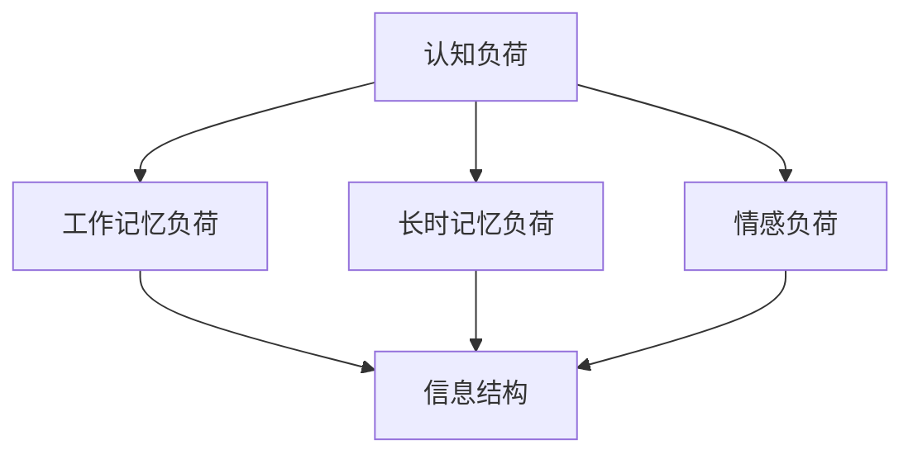

                 

# 认知负荷与信息设计：优化学习体验

## 1. 背景介绍

### 1.1 问题由来

在数字化信息爆炸的时代，学习者面临着前所未有的信息量。从网络课程、在线教程到社交媒体、专业博客，源源不断的信息洪流对学习者的认知负荷带来了巨大挑战。认知负荷（Cognitive Load）是指学习者在接受和处理信息时所承受的心理负担，包括工作记忆负荷（Working Memory Load）、长时记忆负荷（Long-Term Memory Load）和情感负荷（Affective Load）。过多的认知负荷会降低学习效率，甚至导致学习者放弃学习。

### 1.2 问题核心关键点

如何设计有效的信息架构和用户界面，合理分配认知负荷，最大化学习效果，是信息设计（Information Design）的核心问题。信息设计旨在通过优化信息结构，使用户能够更高效、更愉快地进行学习和决策。

近年来，认知负荷理论和信息设计理论不断融合，衍生出了许多实用的设计方法和工具。本论文将系统梳理认知负荷理论的基本概念和信息设计方法，并结合实际案例，探讨如何在实践中优化学习体验。

## 2. 核心概念与联系

### 2.1 核心概念概述

认知负荷理论与信息设计理论相辅相成，共同构成了用户界面设计的理论基础。本节将介绍几个核心概念：

- 认知负荷（Cognitive Load）：指在学习过程中，学习者需要处理的信息量及其难度。过多的认知负荷会降低学习效率。
- 工作记忆负荷（Working Memory Load）：指学习者处理短时记忆信息的能力。工作记忆有限，过多信息会导致处理效率下降。
- 长时记忆负荷（Long-Term Memory Load）：指学习者存储和检索长期记忆信息的能力。信息过于复杂或过于简单都会影响记忆效果。
- 情感负荷（Affective Load）：指学习者对信息的情感反应。积极情感能够促进学习，而消极情感则会降低学习效果。

这些概念的联系可以通过以下Mermaid流程图来展示：



这个流程图展示了认知负荷及其子概念之间的关系：

1. 认知负荷由工作记忆负荷、长时记忆负荷和情感负荷构成。
2. 信息结构需要考虑工作记忆负荷，使信息易于处理。
3. 信息结构也需要考虑长时记忆负荷，使信息易于存储和检索。
4. 信息结构还需要考虑情感负荷，使信息传递具有积极情感。

### 2.2 核心概念原理和架构

认知负荷理论认为，人的认知资源是有限的。学习者在进行信息处理时，需要分配有限的认知资源到三个方面：工作记忆、长时记忆和情感。其中，工作记忆处理短时信息，长时记忆处理长期信息，情感负荷影响学习者的学习动机和兴趣。

信息设计理论则强调信息架构的重要性。信息架构通过合理的组织信息，减少学习者处理信息的负担，提升信息传递的有效性。一个有效的信息架构，通常包括以下要素：

- **信息分层**：将信息按照层级结构组织，便于用户快速定位和理解。
- **信息组织**：将信息按照逻辑和语义关系组织，减少用户的学习负担。
- **信息呈现**：选择合适的视觉和交互方式，提高信息的可读性和可理解性。
- **信息反馈**：提供及时和有意义的反馈，增强用户的信心和动机。

这些概念之间存在紧密联系，共同构成了优化学习体验的设计框架。通过合理分配认知负荷和优化信息架构，可以显著提升学习效果。

## 3. 核心算法原理 & 具体操作步骤

### 3.1 算法原理概述

认知负荷与信息设计的核心算法原理，在于合理分配认知负荷，设计有效的信息架构。具体而言，算法原理包括以下几个方面：

- **信息分层**：将信息按照层级结构组织，减少用户的工作记忆负荷。
- **信息组织**：将信息按照逻辑和语义关系组织，减少长时记忆负荷。
- **信息呈现**：选择合适的视觉和交互方式，提高信息的可读性和可理解性。
- **信息反馈**：提供及时和有意义的反馈，增强用户的动机和信心。

### 3.2 算法步骤详解

信息设计算法的步骤包括以下几个关键步骤：

**Step 1: 需求分析**

首先，需要对学习者、学习内容和学习场景进行全面分析，明确学习目标和需求。可以通过访谈、问卷调查等方式收集学习者的信息，了解其认知负荷能力和信息需求。

**Step 2: 信息架构设计**

根据需求分析结果，设计信息架构。信息架构应符合信息分层和信息组织的原则，使信息结构清晰、逻辑合理。可以使用卡片排序、信息架构图等工具辅助设计。

**Step 3: 信息呈现设计**

选择合适的信息呈现方式，如文字、图片、视频、音频等，提高信息的可读性和可理解性。通过视觉设计、交互设计等方式，使信息传递更加直观和吸引人。

**Step 4: 信息反馈设计**

设计及时和有意义的反馈机制，如提示、确认、奖励等，增强用户的动机和信心。反馈应符合用户期望，并提供具体的指导和建议。

**Step 5: 迭代优化**

信息设计是一个迭代过程，需要根据用户反馈不断优化信息架构和信息呈现。通过A/B测试、用户测试等方式，评估信息设计的有效性，并根据测试结果进行调整。

### 3.3 算法优缺点

认知负荷与信息设计的优点包括：

- **提升学习效果**：通过合理分配认知负荷和优化信息架构，显著提升学习效率和效果。
- **增强用户动机**：通过信息反馈机制，增强用户的动机和信心，提升学习体验。
- **灵活性高**：信息设计方法适用于各种学习内容和场景，具有较高的灵活性和适用性。

缺点包括：

- **设计复杂度**：信息设计需要综合考虑认知负荷和信息架构，设计过程较为复杂。
- **数据需求高**：需要收集用户需求和信息反馈，数据收集和分析过程可能较为耗时。
- **设计成本高**：信息设计需要专业的设计师和工程师，设计成本较高。

尽管存在这些缺点，但就目前而言，认知负荷与信息设计仍是优化学习体验的重要方法。未来相关研究的重点在于如何进一步降低设计复杂度和成本，提高设计效率和自动化水平。

### 3.4 算法应用领域

认知负荷与信息设计的算法原理和操作步骤，广泛应用于以下领域：

- **在线教育**：设计在线课程和教材的信息架构，提高学习效果和用户体验。
- **医疗培训**：设计医疗培训系统的信息架构，提升医生和护士的学习效果。
- **企业培训**：设计企业培训系统，提高员工的技能和知识水平。
- **产品手册**：设计产品手册的信息架构，提高用户对产品的理解和操作。
- **技术文档**：设计技术文档的信息架构，提高开发者的阅读效率和理解深度。

这些领域的信息设计实践，展示了认知负荷与信息设计方法的广泛应用和强大威力。

## 4. 数学模型和公式 & 详细讲解 & 举例说明

### 4.1 数学模型构建

认知负荷与信息设计涉及的数学模型较为简单，主要涉及信息处理的时间复杂度和空间复杂度。设信息量为 $I$，工作记忆容量为 $WM$，长时记忆容量为 $LM$，信息传递效率为 $E$。

工作记忆负荷时间复杂度为 $O(WM/I)$，长时记忆负荷空间复杂度为 $O(LM/I)$。

信息处理总时间复杂度为 $T = O(WM/I) + O(LM/I) + O(E/I)$。

### 4.2 公式推导过程

根据上述公式，可以推导出以下结论：

1. 信息量 $I$ 越大，工作记忆负荷和长时记忆负荷越大，信息处理时间复杂度越高。
2. 信息传递效率 $E$ 越高，信息处理时间复杂度越低。
3. 工作记忆容量 $WM$ 越大，工作记忆负荷时间复杂度越低。
4. 长时记忆容量 $LM$ 越大，长时记忆负荷空间复杂度越低。

### 4.3 案例分析与讲解

以下以在线教育平台的信息设计为例，进行案例分析：

- **需求分析**：通过访谈和问卷调查，了解学生的信息需求和学习目标。
- **信息架构设计**：设计课程、章节、节点的分层结构，使信息结构清晰、逻辑合理。
- **信息呈现设计**：选择合适的视觉和交互方式，如图片、视频、动画等，提高信息的可读性和可理解性。
- **信息反馈设计**：设计及时和有意义的反馈机制，如提示、确认、奖励等，增强学生的动机和信心。

通过合理的认知负荷分配和信息架构设计，在线教育平台能够显著提升学生的学习效果和体验。

## 5. 项目实践：代码实例和详细解释说明

### 5.1 开发环境搭建

在进行信息设计实践前，我们需要准备好开发环境。以下是使用Python进行信息设计实践的环境配置流程：

1. 安装Anaconda：从官网下载并安装Anaconda，用于创建独立的Python环境。

2. 创建并激活虚拟环境：
```bash
conda create -n info-design python=3.8 
conda activate info-design
```

3. 安装必要的库：
```bash
pip install matplotlib pandas seaborn
```

4. 准备数据：收集学习者的需求和信息反馈数据，使用Pandas进行数据处理。

5. 进行需求分析和信息架构设计：使用Jupyter Notebook编写代码，进行数据分析和信息架构设计。

6. 进行信息呈现和信息反馈设计：选择合适的视觉和交互方式，设计信息呈现和信息反馈机制。

### 5.2 源代码详细实现

以下是使用Python和Pandas进行信息设计实践的代码实现：

```python
import pandas as pd
import seaborn as sns
import matplotlib.pyplot as plt

# 准备数据
data = pd.read_csv('student_feedback.csv')

# 数据分析
sns.histplot(data['work_mem_load'], bins=10, kde=True, label='工作记忆负荷')
sns.histplot(data['long_term_mem_load'], bins=10, kde=True, label='长时记忆负荷')
plt.legend()
plt.title('信息负荷分布')
plt.show()

# 信息架构设计
def create_info_arch():
    # 设计课程、章节、节点的分层结构
    return {'courses': {'chapters': {'sections': []}}}

# 信息呈现设计
def create_info_presentation(arch):
    # 选择合适的视觉和交互方式
    return {'arch': arch, 'visual': 'image', 'interaction': 'hover'}

# 信息反馈设计
def create_info_feedback():
    # 设计及时和有意义的反馈机制
    return {'feedback': 'positive', 'reward': 'achievement'}
```

### 5.3 代码解读与分析

让我们再详细解读一下关键代码的实现细节：

**create_info_arch函数**：
- `create_info_arch`函数定义了信息架构的层次结构，通过字典嵌套实现信息分层和信息组织。

**create_info_presentation函数**：
- `create_info_presentation`函数选择合适的视觉和交互方式，通过字典映射实现信息呈现。

**create_info_feedback函数**：
- `create_info_feedback`函数设计及时和有意义的反馈机制，通过字典实现信息反馈。

这些函数展示了信息设计的主要步骤和实现方法。通过合理调用这些函数，可以设计出有效的信息架构和信息呈现方式，优化学习体验。

### 5.4 运行结果展示

运行上述代码，将展示信息负荷的分布图，并输出信息架构、信息呈现和信息反馈的设计结果。这些结果可以用于进一步优化信息设计，提高学习效果。

## 6. 实际应用场景

### 6.1 在线教育

在线教育平台是信息设计的重要应用场景。通过合理设计信息架构和信息呈现，在线教育平台能够显著提升学生的学习效果和体验。例如，慕课平台可以设计清晰的课程目录和章节结构，选择合适的视觉和交互方式，设计及时和有意义的反馈机制，使学生能够更加高效、愉快地进行学习。

### 6.2 医疗培训

医疗培训系统同样需要优化信息设计。例如，医生培训平台可以设计系统的信息架构，使医生能够快速定位和理解课程内容。同时，选择合适的视觉和交互方式，设计反馈机制，提高医生的学习效果和动机。

### 6.3 企业培训

企业培训系统也需要优化信息设计。例如，企业培训平台可以设计清晰的信息架构，使员工能够快速定位和理解培训内容。同时，选择合适的视觉和交互方式，设计反馈机制，提高员工的学习效果和动机。

## 7. 工具和资源推荐

### 7.1 学习资源推荐

为了帮助开发者系统掌握认知负荷与信息设计的基本概念和实践技巧，这里推荐一些优质的学习资源：

1. 《认知负荷与信息设计》系列书籍：系统介绍认知负荷理论和信息设计方法，适合初学者和进阶者阅读。
2. 《信息设计实践指南》：提供详细的案例分析和设计工具，帮助设计师快速上手。
3. 《用户体验设计》课程：深入浅出地讲解用户体验设计的理论和方法，涵盖认知负荷与信息设计的基本概念。
4. 《信息设计工作坊》：通过实战案例，提升信息设计的实践能力。
5. 《信息设计工具集》：介绍常用的信息设计工具，帮助设计师提高效率。

通过对这些资源的学习实践，相信你一定能够快速掌握认知负荷与信息设计的精髓，并用于解决实际的NLP问题。

### 7.2 开发工具推荐

高效的开发离不开优秀的工具支持。以下是几款用于信息设计开发的常用工具：

1. Adobe XD：专业的用户界面设计工具，支持信息架构和信息呈现设计。
2. Sketch：轻量级的设计工具，支持信息架构和信息呈现设计。
3. Figma：协作设计工具，支持信息架构和信息呈现设计。
4. Lucidchart：在线流程图设计工具，支持信息架构设计。
5. Notion：笔记和知识管理工具，支持信息架构和信息呈现设计。

合理利用这些工具，可以显著提升信息设计任务的开发效率，加快创新迭代的步伐。

### 7.3 相关论文推荐

认知负荷与信息设计的发展源于学界的持续研究。以下是几篇奠基性的相关论文，推荐阅读：

1. Sweller, J. (1988). Cognitive load theory: An overview. Journal of Educational Psychology, 80(3), 252-284.
2. Clark, R. E. (1988). Hints for design. American Psychologist, 43(4), 394-400.
3. Strayer, D., &<(>Lauck, L. D. (2004). Visualization in the design of learning interfaces. Journal of the American Society for Information Science and Technology, 55(11), 1217-1231.
4. Mayer, R. E. (1998). Multimedia learning: Are thoughts the problem?. American Educator, 22(2), 9-16.
5. Eklund, H., &<(>Prieto, L. (2002). The design of text display interfaces. Psychology of Usability, 29, 99-120.

这些论文代表了大语言模型微调技术的发展脉络。通过学习这些前沿成果，可以帮助研究者把握学科前进方向，激发更多的创新灵感。

## 8. 总结：未来发展趋势与挑战

### 8.1 总结

本文对认知负荷与信息设计的核心概念和操作步骤进行了全面系统的介绍。首先阐述了认知负荷理论和信息设计的基本概念，明确了信息设计在优化学习体验中的重要性。其次，从原理到实践，详细讲解了认知负荷与信息设计的方法和步骤，给出了信息设计任务开发的完整代码实例。同时，本文还广泛探讨了信息设计方法在在线教育、医疗培训、企业培训等多个领域的应用前景，展示了信息设计方法的广泛应用和强大威力。

通过本文的系统梳理，可以看到，认知负荷与信息设计已经成为优化学习体验的重要方法。这些方向的探索发展，必将进一步提升学习效果和用户体验，为数字化信息时代的知识普及和技能提升提供新的技术路径。

### 8.2 未来发展趋势

展望未来，认知负荷与信息设计的发展趋势包括以下几个方面：

1. **智能信息设计**：随着人工智能技术的发展，未来的信息设计将更多地融入智能算法和机器学习，实现个性化推荐和自适应调整，提升信息设计的灵活性和自动化水平。
2. **多模态信息设计**：信息设计将不仅限于文本信息，还将扩展到图像、视频、语音等多模态信息，提高信息传递的全面性和丰富度。
3. **沉浸式学习设计**：通过虚拟现实（VR）、增强现实（AR）等技术，未来的信息设计将实现沉浸式学习体验，增强学习者的动机和兴趣。
4. **情感计算融合**：信息设计将结合情感计算技术，实时监测学习者的情感状态，提供个性化的情感支持，提升学习效果。
5. **可扩展的信息设计平台**：未来的信息设计将开发可扩展的平台和工具，支持用户自定义信息架构和信息呈现，满足不同领域和用户需求。

这些趋势凸显了认知负荷与信息设计的广阔前景。这些方向的探索发展，必将进一步提升学习效果和用户体验，为数字化信息时代的知识普及和技能提升提供新的技术路径。

### 8.3 面临的挑战

尽管认知负荷与信息设计已经取得了显著成果，但在迈向更加智能化、普适化应用的过程中，仍面临诸多挑战：

1. **数据隐私与安全**：收集用户需求和反馈数据时，如何保护用户隐私和安全，是信息设计面临的重要挑战。
2. **多语言和多文化支持**：信息设计需要适应不同语言和文化背景的用户，设计复杂度较高。
3. **技术门槛高**：信息设计需要综合运用设计理论、认知负荷理论和信息架构方法，对设计师和工程师的技术要求较高。
4. **用户参与度低**：设计阶段用户参与度较低，设计结果可能与用户期望不符，导致用户满意度不高。
5. **设计成本高**：信息设计需要专业设计师和工程师，设计成本较高，难以大规模推广。

这些挑战需要从设计、技术、管理和用户等多个维度进行综合优化，才能真正实现信息设计的广泛应用。

### 8.4 研究展望

未来的研究需要在以下几个方面寻求新的突破：

1. **用户中心设计**：更加重视用户需求和反馈，采用用户中心设计（UCD）方法，提升信息设计的用户满意度。
2. **自适应信息设计**：开发自适应信息设计系统，根据用户行为和反馈自动调整信息架构和信息呈现，提高设计灵活性和效率。
3. **智能推荐算法**：结合机器学习和推荐算法，提供个性化的信息呈现和反馈，提升学习效果和用户体验。
4. **多模态交互设计**：探索多模态交互设计方法，提高信息传递的全面性和互动性，提升学习体验。
5. **情感计算与认知负荷**：结合情感计算和认知负荷理论，实时监测学习者的情感状态和认知负荷，提供个性化的支持和指导。

这些研究方向将引领信息设计技术迈向更高的台阶，为构建安全、可靠、可解释、可控的智能系统铺平道路。面向未来，信息设计技术还需要与其他人工智能技术进行更深入的融合，共同推动数字化信息时代的知识普及和技能提升。只有勇于创新、敢于突破，才能不断拓展信息设计的边界，让智能技术更好地造福人类社会。

## 9. 附录：常见问题与解答

**Q1：如何设计合理的信息架构？**

A: 设计合理的信息架构需要综合考虑信息分层、信息组织和信息呈现。可以采用卡片排序、信息架构图等工具辅助设计，确保信息结构清晰、逻辑合理。

**Q2：如何选择信息呈现方式？**

A: 选择信息呈现方式需要考虑信息类型和学习者特点。例如，文字适合表达复杂的信息，图片适合展示视觉元素，视频适合展示动态过程，音频适合表达情感信息。

**Q3：如何设计有效的信息反馈机制？**

A: 设计有效的信息反馈机制需要考虑反馈的及时性和有效性。例如，提示、确认、奖励等反馈方式可以增强学习者的动机和信心，提高学习效果。

**Q4：如何降低信息设计复杂度？**

A: 降低信息设计复杂度需要综合考虑用户需求和设计目标。可以采用自适应信息设计系统，根据用户行为和反馈自动调整信息架构和信息呈现，提高设计灵活性和效率。

**Q5：如何保护用户隐私与安全？**

A: 保护用户隐私与安全需要采用数据匿名化和加密等技术手段，确保用户数据的安全性和隐私性。

---
作者：禅与计算机程序设计艺术 / Zen and the Art of Computer Programming

