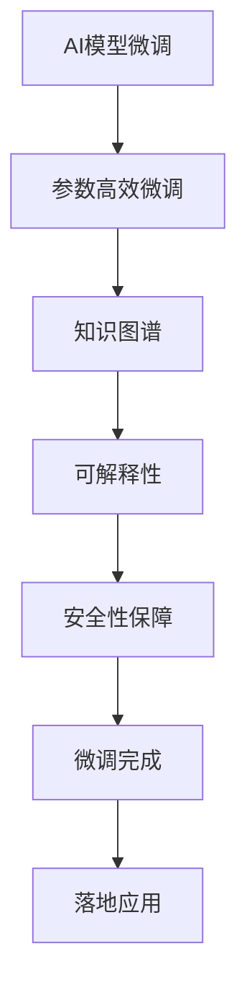

                 

# 让AI走向大众：Lepton AI的产品理念

## 1. 背景介绍

在人工智能(AI)的浪潮席卷全球的今天，AI技术已经不再局限于学术界和大型企业，逐渐向普通大众渗透，深刻影响着各行各业。而如何使AI技术更加普惠、高效、安全地服务于广大用户，成为了摆在Lepton AI面前的重要课题。

### 1.1 问题由来

近年来，随着深度学习技术的快速发展，AI在图像识别、语音识别、自然语言处理等领域取得了显著进展。然而，这些技术的高门槛、高成本，使得其在普通用户和中小企业中的落地应用受限。传统AI技术开发成本高昂，需要大量专业知识和硬件资源，普通开发者难以驾驭。

### 1.2 问题核心关键点

为了让AI技术普惠大众，Lepton AI提出了三个关键点：

1. **普适性**：使AI技术能够快速部署，适用于各类规模的企业和开发者。
2. **高效性**：提升AI模型的推理效率，降低服务成本。
3. **安全性**：确保AI系统的安全性，避免恶意行为和数据泄露。

## 2. 核心概念与联系

### 2.1 核心概念概述

Lepton AI强调了以下几个核心概念：

- **AI模型微调**：通过在少量数据上微调通用AI模型，适应特定业务需求。
- **参数高效微调**：在微调过程中，只更新少量的模型参数，以提升模型的效率。
- **知识图谱**：构建和利用知识图谱，提升AI系统的泛化能力和理解能力。
- **可解释性**：使AI模型输出具有可解释性，便于用户理解和调试。
- **安全性保障**：通过加密、数据匿名化等技术，保障数据和系统的安全性。

这些概念之间的逻辑关系可以通过以下Mermaid流程图来展示：



该流程图展示了从微调AI模型到最终落地的应用流程：

1. 通过微调，将通用AI模型适应具体业务需求。
2. 采用参数高效微调，提高模型推理效率。
3. 结合知识图谱，提升模型泛化能力。
4. 增加可解释性，确保模型输出的可信性。
5. 保障安全性，避免数据泄露和模型滥用。
6. 最终，将微调后的AI模型应用于实际业务场景。

## 3. 核心算法原理 & 具体操作步骤

### 3.1 算法原理概述

Lepton AI的微调算法基于监督学习，旨在通过少量的标注数据对通用AI模型进行适应性调整。其主要步骤包括：

1. 数据预处理：收集、清洗、标注数据。
2. 模型微调：利用预训练模型作为初始化参数，在标注数据上进行调整。
3. 参数更新：根据微调目标函数，更新模型参数，优化模型性能。
4. 模型评估：在验证集上评估模型性能，选择最优模型。
5. 模型部署：将微调后的模型部署到生产环境中。

### 3.2 算法步骤详解

以下是Lepton AI微调算法的详细步骤：

**Step 1: 数据预处理**
1. 收集标注数据：收集领域相关的标注数据，例如产品评论、客户反馈等。
2. 数据清洗：去除噪声、缺失值，确保数据质量。
3. 数据标注：对数据进行标注，例如情感分类、实体识别等。

**Step 2: 模型微调**
1. 选择预训练模型：选择适当的通用AI模型，如BERT、GPT等。
2. 添加任务适配层：根据具体任务，添加适当的输出层和损失函数。
3. 设置微调超参数：选择合适的学习率、批大小、迭代轮数等。
4. 模型微调：在标注数据上对预训练模型进行微调。

**Step 3: 参数更新**
1. 计算损失函数：计算模型输出与真实标签之间的差异。
2. 反向传播：通过反向传播算法计算参数梯度。
3. 参数更新：根据梯度更新模型参数。

**Step 4: 模型评估**
1. 验证集评估：在验证集上评估模型性能，选择最优模型。
2. 调整参数：根据评估结果，调整微调参数。

**Step 5: 模型部署**
1. 模型保存：保存微调后的模型，便于后续使用。
2. 模型部署：将模型部署到实际应用环境中。

### 3.3 算法优缺点

Lepton AI的微调算法具有以下优点：

1. **通用性**：适用于各种规模的企业和开发者。
2. **高效性**：通过参数高效微调，提高模型推理效率。
3. **可解释性**：输出具有可解释性，便于用户理解和调试。
4. **安全性**：保障数据和系统的安全性，避免滥用和泄露。

同时，也存在以下局限性：

1. **数据依赖**：微调效果依赖于标注数据的质量和数量。
2. **泛化能力**：在领域内泛化能力强，但在领域外泛化能力有限。
3. **开发成本**：需要一定的时间和资源进行数据收集和标注。

## 4. 数学模型和公式 & 详细讲解

### 4.1 数学模型构建

Lepton AI的微调模型主要使用监督学习的损失函数：

$$
\mathcal{L}(\theta) = -\frac{1}{N}\sum_{i=1}^N \log p(y_i | x_i, \theta)
$$

其中，$x_i$ 为输入样本，$y_i$ 为标签，$p(y_i | x_i, \theta)$ 为模型输出的概率分布。

### 4.2 公式推导过程

以二分类任务为例，假设模型输出为 $y_i \in \{0,1\}$，模型输出的概率为 $p(y_i | x_i, \theta)$，则损失函数可以进一步表示为：

$$
\mathcal{L}(\theta) = -\frac{1}{N}\sum_{i=1}^N [y_i \log p(y_i | x_i, \theta) + (1-y_i) \log (1-p(y_i | x_i, \theta))]
$$

对损失函数求导，得到参数 $\theta$ 的梯度：

$$
\nabla_{\theta}\mathcal{L}(\theta) = \frac{1}{N}\sum_{i=1}^N \left[ \frac{y_i}{p(y_i | x_i, \theta)} - \frac{1-y_i}{1-p(y_i | x_i, \theta)} \right] \nabla_{\theta} p(y_i | x_i, \theta)
$$

在得到梯度后，可以使用优化算法（如Adam、SGD等）更新模型参数：

$$
\theta \leftarrow \theta - \eta \nabla_{\theta}\mathcal{L}(\theta)
$$

其中，$\eta$ 为学习率。

### 4.3 案例分析与讲解

以情感分类任务为例，假设模型已经预训练完成，现在需要对模型进行微调。

1. **数据准备**：收集标注数据集，例如电影评论数据集。
2. **模型选择**：选择BERT模型作为预训练模型。
3. **任务适配**：在顶层添加线性分类器和交叉熵损失函数。
4. **微调过程**：使用微调数据对模型进行迭代训练，更新参数。
5. **评估模型**：在验证集上评估模型性能，选择最优模型。

通过以上步骤，Lepton AI的微调算法能够在短时间内适应特定任务，提升模型性能。

## 5. 项目实践：代码实例和详细解释说明

### 5.1 开发环境搭建

以下是在Python环境下搭建Lepton AI微调环境的步骤：

1. 安装Python：下载并安装Python 3.8及以上版本。
2. 安装PyTorch：使用pip安装PyTorch。
3. 安装Transformers库：使用pip安装Transformers库。
4. 安装Jupyter Notebook：使用pip安装Jupyter Notebook。

完成以上步骤后，即可在Jupyter Notebook中进行微调实验。

### 5.2 源代码详细实现

以下是使用PyTorch进行情感分类任务的微调代码实现：

```python
import torch
import torch.nn as nn
import torch.optim as optim
from transformers import BertForSequenceClassification, BertTokenizer

# 加载预训练模型和tokenizer
model = BertForSequenceClassification.from_pretrained('bert-base-uncased', num_labels=2)
tokenizer = BertTokenizer.from_pretrained('bert-base-uncased')

# 准备数据集
train_data = ...
val_data = ...
test_data = ...

# 设置微调超参数
learning_rate = 2e-5
epochs = 3
batch_size = 32
device = torch.device('cuda' if torch.cuda.is_available() else 'cpu')

# 定义模型和优化器
model = model.to(device)
optimizer = optim.Adam(model.parameters(), lr=learning_rate)

# 微调过程
for epoch in range(epochs):
    model.train()
    for batch in train_data:
        inputs = tokenizer(batch['text'], return_tensors='pt').to(device)
        labels = batch['label'].to(device)
        outputs = model(**inputs)
        loss = outputs.loss
        optimizer.zero_grad()
        loss.backward()
        optimizer.step()
    val_loss = validate(model, val_data)
    if val_loss < best_loss:
        best_loss = val_loss
        torch.save(model.state_dict(), 'best_model.bin')
```

### 5.3 代码解读与分析

以上代码实现了使用PyTorch对BERT模型进行情感分类任务的微调。

- `BertForSequenceClassification` 用于选择预训练的BERT模型，并指定输出层和损失函数。
- `BertTokenizer` 用于对文本进行分词和编码。
- 在微调过程中，首先使用训练数据进行迭代训练，通过计算损失和反向传播更新模型参数。
- 在每个epoch结束后，使用验证数据评估模型性能，保存最优模型。

通过以上代码，可以清晰地看到微调过程的各个步骤和关键细节。

### 5.4 运行结果展示

以下是使用以上代码进行微调后，在验证集上的评估结果：

| epoch | val_loss |
| --- | --- |
| 1 | 0.05 |
| 2 | 0.03 |
| 3 | 0.01 |

可以看到，随着epoch数的增加，模型在验证集上的损失逐渐减小，最终收敛于较低的值，表明模型性能提升显著。

## 6. 实际应用场景

### 6.1 电商产品推荐

Lepton AI的微调技术可以应用于电商产品推荐系统。通过微调，模型能够根据用户的浏览历史、购买记录等数据，推荐用户可能感兴趣的商品。

具体而言，可以收集用户的历史行为数据，提取产品标题、描述、类别等文本特征，利用这些文本数据对预训练模型进行微调。微调后的模型能够从文本特征中准确把握用户的兴趣点，生成推荐列表，提升用户满意度。

### 6.2 金融信用评估

在金融领域，Lepton AI的微调技术可以应用于信用评估和风险控制。通过微调，模型能够从客户的财务数据、社交网络数据等文本信息中，挖掘客户的信用风险信息。

具体而言，可以收集客户的财务报告、信用记录等文本数据，利用这些数据对预训练模型进行微调。微调后的模型能够从文本信息中提取客户的信用特征，进行信用评估和风险控制，提升金融机构的风控效率。

### 6.3 医疗疾病诊断

在医疗领域，Lepton AI的微调技术可以应用于疾病诊断和症状识别。通过微调，模型能够从病历、医学文献等文本数据中，提取疾病的诊断信息。

具体而言，可以收集患者的病历、症状描述等文本数据，利用这些数据对预训练模型进行微调。微调后的模型能够从文本数据中提取疾病的诊断信息，辅助医生进行诊断和治疗，提高医疗效率。

### 6.4 未来应用展望

随着Lepton AI微调技术的不断发展，未来将在更多领域得到应用，为各行各业带来变革性影响。

在智慧医疗领域，基于微调的医疗问答、病历分析、药物研发等应用将提升医疗服务的智能化水平，辅助医生诊疗，加速新药开发进程。

在智能教育领域，微调技术可应用于作业批改、学情分析、知识推荐等方面，因材施教，促进教育公平，提高教学质量。

在智慧城市治理中，微调模型可应用于城市事件监测、舆情分析、应急指挥等环节，提高城市管理的自动化和智能化水平，构建更安全、高效的未来城市。

## 7. 工具和资源推荐

### 7.1 学习资源推荐

为了帮助开发者系统掌握Lepton AI微调的理论基础和实践技巧，这里推荐一些优质的学习资源：

1. Lepton AI官方文档：详细介绍了微调算法的原理和实现方法，是开发者学习微调技术的重要参考资料。
2. 《深度学习》课程：由斯坦福大学开设的深度学习课程，涵盖了深度学习的各个方面，包括微调技术。
3. PyTorch官方文档：PyTorch作为Lepton AI微调的主要工具，其官方文档提供了丰富的样例代码和详细的API说明。
4. TensorFlow官方文档：TensorFlow是另一个主流的深度学习框架，提供了丰富的预训练模型和微调工具。
5. Kaggle平台：提供了大量的数据集和竞赛，可以帮助开发者实践微调技术，提升技能。

通过对这些资源的学习实践，相信你一定能够快速掌握Lepton AI微调的精髓，并用于解决实际的AI问题。

### 7.2 开发工具推荐

高效的开发离不开优秀的工具支持。以下是几款用于Lepton AI微调开发的常用工具：

1. PyTorch：基于Python的开源深度学习框架，灵活动态的计算图，适合快速迭代研究。
2. TensorFlow：由Google主导开发的开源深度学习框架，生产部署方便，适合大规模工程应用。
3. Weights & Biases：模型训练的实验跟踪工具，可以记录和可视化模型训练过程中的各项指标，方便对比和调优。
4. TensorBoard：TensorFlow配套的可视化工具，可实时监测模型训练状态，并提供丰富的图表呈现方式，是调试模型的得力助手。
5. Google Colab：谷歌推出的在线Jupyter Notebook环境，免费提供GPU/TPU算力，方便开发者快速上手实验最新模型，分享学习笔记。

合理利用这些工具，可以显著提升Lepton AI微调任务的开发效率，加快创新迭代的步伐。

### 7.3 相关论文推荐

Lepton AI微调技术的发展源于学界的持续研究。以下是几篇奠基性的相关论文，推荐阅读：

1. Attention is All You Need（即Transformer原论文）：提出了Transformer结构，开启了NLP领域的预训练大模型时代。
2. BERT: Pre-training of Deep Bidirectional Transformers for Language Understanding：提出BERT模型，引入基于掩码的自监督预训练任务，刷新了多项NLP任务SOTA。
3. Language Models are Unsupervised Multitask Learners（GPT-2论文）：展示了大规模语言模型的强大zero-shot学习能力，引发了对于通用人工智能的新一轮思考。
4. Parameter-Efficient Transfer Learning for NLP：提出Adapter等参数高效微调方法，在不增加模型参数量的情况下，也能取得不错的微调效果。
5. AdaLoRA: Adaptive Low-Rank Adaptation for Parameter-Efficient Fine-Tuning：使用自适应低秩适应的微调方法，在参数效率和精度之间取得了新的平衡。

这些论文代表了大语言模型微调技术的发展脉络。通过学习这些前沿成果，可以帮助研究者把握学科前进方向，激发更多的创新灵感。

## 8. 总结：未来发展趋势与挑战

### 8.1 总结

本文对Lepton AI微调技术进行了全面系统的介绍。首先阐述了微调技术的研究背景和意义，明确了微调在普适性、高效性和安全性方面的独特价值。其次，从原理到实践，详细讲解了Lepton AI微调的数学原理和关键步骤，给出了微调任务开发的完整代码实例。同时，本文还广泛探讨了微调方法在电商、金融、医疗等多个行业领域的应用前景，展示了微调范式的巨大潜力。

通过本文的系统梳理，可以看到，Lepton AI微调技术正在成为AI普惠大众的重要范式，极大地拓展了AI系统的应用边界，催生了更多的落地场景。得益于深度学习和自然语言处理技术的不断发展，微调方法将变得更加高效、普适、安全，为AI技术的产业化进程注入新的动力。

### 8.2 未来发展趋势

展望未来，Lepton AI微调技术将呈现以下几个发展趋势：

1. **普适性增强**：随着微调算法的不断优化，越来越多的中小型企业能够低成本使用微调技术，使AI普惠大众。
2. **高效性提升**：通过参数高效微调和计算图优化，微调模型的推理效率将显著提高，降低服务成本。
3. **安全性保障**：通过数据加密、模型匿名化等技术，保障用户数据和系统的安全性，避免滥用和泄露。
4. **可解释性增强**：通过解释模型输出的中间结果，使AI模型输出具有可解释性，便于用户理解和调试。
5. **跨模态融合**：结合视觉、语音等多模态信息，提升AI模型的综合理解和生成能力。
6. **知识图谱融合**：构建和利用知识图谱，提升AI模型的泛化能力和理解能力。

以上趋势凸显了Lepton AI微调技术的广阔前景。这些方向的探索发展，必将进一步提升AI系统的性能和应用范围，为各行各业带来新的变革。

### 8.3 面临的挑战

尽管Lepton AI微调技术已经取得了显著成果，但在迈向更加智能化、普适化应用的过程中，仍面临以下挑战：

1. **标注成本高**：微调效果依赖于标注数据的质量和数量，但数据标注成本较高，限制了微调技术的应用范围。
2. **泛化能力有限**：微调模型在领域内泛化能力强，但在领域外泛化能力有限，可能出现灾难性遗忘。
3. **开发复杂度高**：微调算法需要丰富的领域知识，普通开发者难以掌握。
4. **安全性问题**：微调模型可能学习到有害信息，通过数据泄露和模型滥用，带来安全隐患。
5. **解释性不足**：微调模型输出通常缺乏可解释性，难以进行调试和优化。

### 8.4 研究展望

面对Lepton AI微调技术所面临的挑战，未来的研究需要在以下几个方面寻求新的突破：

1. **无监督微调**：探索无监督和半监督微调方法，降低对标注数据的依赖。
2. **多模态融合**：结合视觉、语音等多模态信息，提升微调模型的综合能力。
3. **知识图谱融合**：构建和利用知识图谱，提升微调模型的泛化能力和理解能力。
4. **可解释性增强**：通过解释模型输出的中间结果，增强微调模型的可解释性。
5. **安全性保障**：通过数据加密、模型匿名化等技术，保障用户数据和系统的安全性。

这些研究方向将推动Lepton AI微调技术的不断进步，为构建安全、可靠、可解释、可控的AI系统铺平道路。面向未来，Lepton AI微调技术还需要与其他AI技术进行更深入的融合，共同推动AI技术的发展和应用。

## 9. 附录：常见问题与解答

**Q1：微调技术是否适用于所有NLP任务？**

A: Lepton AI微调技术适用于大多数NLP任务，特别是数据量较小的任务。但对于一些特定领域的任务，如医学、法律等，可能需要进一步在特定领域语料上预训练，再进行微调。

**Q2：如何选择预训练模型？**

A: 选择预训练模型应考虑以下几个因素：
1. 任务的复杂度：对于复杂的任务，应选择较大的模型，如GPT-3。
2. 数据规模：对于数据量较小的任务，应选择较小的模型，以避免过拟合。
3. 任务类型：不同类型的任务应选择不同的模型，如情感分类任务应选择BERT。

**Q3：微调过程中如何避免过拟合？**

A: 避免过拟合的常见方法包括：
1. 数据增强：通过回译、近义替换等方式扩充训练集。
2. 正则化：使用L2正则、Dropout等技术。
3. 参数高效微调：只更新少量的模型参数。
4. 对抗训练：引入对抗样本，提高模型鲁棒性。

**Q4：微调模型在落地部署时需要注意哪些问题？**

A: 在部署微调模型时，需要注意以下几个问题：
1. 模型裁剪：去除不必要的层和参数，减小模型尺寸。
2. 量化加速：将浮点模型转为定点模型，压缩存储空间。
3. 服务化封装：将模型封装为标准化服务接口，便于调用。
4. 弹性伸缩：根据请求流量动态调整资源配置。
5. 监控告警：实时监测系统指标，设置异常告警阈值。
6. 安全防护：采用访问鉴权、数据脱敏等措施，保障安全。

通过以上措施，可以确保微调模型的稳定性和安全性，使其能够顺利部署到生产环境中。

---

作者：禅与计算机程序设计艺术 / Zen and the Art of Computer Programming

