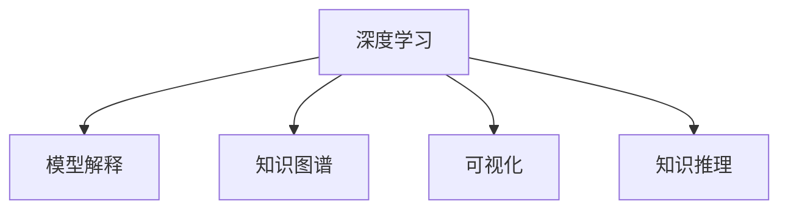

                 

# 费曼提问法:深度学习的利器

> 关键词：费曼提问法,深度学习,模型解释,知识图谱,可视化,知识推理

## 1. 背景介绍

### 1.1 问题由来
深度学习作为人工智能的核心技术，近年来在图像识别、自然语言处理、语音识别等领域取得了突破性进展。然而，深度模型通常被视为"黑盒"，难以解释其内部工作机制，导致其在诸多应用场景中存在瓶颈。费曼提问法作为一种新型的知识传播方式，有望为深度学习的模型解释和可理解性提供解决方案。

### 1.2 问题核心关键点
费曼提问法由物理学家理查德·费曼提出，旨在通过类比日常生活中的问题，帮助学习者深入理解抽象的概念。将其应用到深度学习中，核心在于通过类比问题驱动模型解释，提升模型的可理解性和可解释性。该方法的关键在于提出四个步骤：理解问题、简化问题、可视化推理、求解并应用。

### 1.3 问题研究意义
费曼提问法的核心价值在于提升深度模型的可解释性，降低其在实际应用中的不确定性和风险，提升用户的信任度和接受度。研究费曼提问法在深度学习中的应用，对于构建可信、透明、高效的人工智能系统具有重要意义。

## 2. 核心概念与联系

### 2.1 核心概念概述

为更好地理解费曼提问法在深度学习中的应用，本节将介绍几个密切相关的核心概念：

- 深度学习：基于神经网络的机器学习方法，通过多层非线性变换，自动提取数据特征，实现复杂模式识别任务。
- 模型解释(Explainability)：指解释深度学习模型的内部决策过程，以便于理解其行为和预测的合理性。
- 知识图谱(Knowledge Graph)：结构化的语义知识库，通过RDF等标准语言，描述实体、关系和属性，支持语义搜索和推理。
- 可视化(Visualization)：通过图表、动画等方式，将复杂数据和计算过程直观呈现，帮助理解模型和系统。
- 知识推理(Knowledge Reasoning)：通过逻辑推理、因果分析等方法，构建复杂场景下的知识推理链，提升模型的推理能力和决策质量。

这些核心概念之间的逻辑关系可以通过以下Mermaid流程图来展示：



这个流程图展示了大语言模型的核心概念及其之间的关系：

1. 深度学习提供了模型的基础能力。
2. 模型解释用于揭示模型的工作机制。
3. 知识图谱提供模型的知识来源和推理支持。
4. 可视化帮助理解模型的推理过程。
5. 知识推理用于构建复杂的推理链。

这些概念共同构成了费曼提问法在深度学习中的应用框架，使其能够更好地解决模型解释和可理解性问题。

## 3. 核心算法原理 & 具体操作步骤
### 3.1 算法原理概述

费曼提问法在深度学习中的应用，主要基于费曼的四个提问步骤，即理解问题、简化问题、可视化推理、求解并应用。具体到模型解释中，步骤转化为以下几个关键环节：

1. **理解问题**：通过类比日常生活中的问题，理解目标模型的决策过程。例如，如果模型用于推荐系统，可以类比为"你如何推荐朋友？"。
2. **简化问题**：将复杂问题分解为更易理解的子问题。例如，将推荐系统的问题简化为"如何构建兴趣图谱？"
3. **可视化推理**：通过可视化工具展示模型的推理过程。例如，使用知识图谱和图形工具展示推荐系统的知识图谱构建过程。
4. **求解并应用**：通过可视化推理结果，优化模型或策略，应用于实际问题。例如，优化推荐系统的推荐算法，提升用户满意度。

### 3.2 算法步骤详解

费曼提问法在深度学习中的应用，具体步骤如下：

**Step 1: 问题理解与分解**
- 收集目标任务的相关背景知识，了解其决策过程。
- 将复杂问题分解为多个子问题，形成可操作的问题链。

**Step 2: 可视化模型推理**
- 使用可视化工具，展示模型的推理过程，如决策树、图形化知识图谱等。
- 通过可视化工具，理解模型的输入输出关系、中间变量和关键路径。

**Step 3: 推理结果分析与优化**
- 分析可视化结果，识别模型中的薄弱环节和关键参数。
- 根据分析结果，调整模型结构或参数，优化模型推理性能。

**Step 4: 应用改进策略**
- 将优化后的模型重新应用于实际问题，评估改进效果。
- 根据实际效果，继续迭代优化，不断提升模型解释力和应用效果。

### 3.3 算法优缺点

费曼提问法在深度学习中的应用，具有以下优点：
1. 直观易懂：通过可视化工具，将复杂的模型推理过程直观呈现，便于理解。
2. 可解释性强：通过问题驱动的模型解释方法，提升模型的可解释性和可理解性。
3. 适用性广：适合于各种复杂模型和实际应用场景，帮助识别和解决模型问题。
4. 可操作性强：通过逐步优化，提升模型的性能和效果，具有较强的实用性。

同时，该方法也存在一定的局限性：
1. 需要专业知识：用户需要一定的专业知识背景，才能理解问题并设计可视化方案。
2. 数据依赖性高：模型的可视化效果依赖于高质量的数据和推理结果，数据质量不高可能影响分析效果。
3. 主观性强：问题分解和可视化方案的设计，可能受个人主观感受和经验影响。
4. 工作量大：需要花大量时间收集背景知识、设计问题链、可视化推理，工作量较大。

尽管存在这些局限性，但费曼提问法作为模型解释的一种新方法，具有广阔的应用前景，值得进一步研究和推广。

### 3.4 算法应用领域

费曼提问法在深度学习中的应用，涵盖了以下几个关键领域：

- 自然语言处理(NLP)：通过类比问题，理解模型的输入输出和中间变量，提升模型在问答、情感分析、翻译等任务中的可解释性。
- 计算机视觉(CV)：通过可视化工具展示模型推理过程，理解图像特征提取、物体检测、语义分割等任务中的决策机制。
- 推荐系统：通过问题驱动的模型解释，优化推荐算法的决策逻辑，提升推荐的透明度和用户满意度。
- 智能客服：通过问题理解与分解，优化对话系统的生成策略，提升用户体验和系统稳定性。
- 智能医疗：通过可视化工具展示诊断推理过程，提升医疗模型的决策透明度和可信度。

这些领域展示了费曼提问法在深度学习中的应用潜力，为复杂模型的解释和优化提供了新思路。

## 4. 数学模型和公式 & 详细讲解 & 举例说明

### 4.1 数学模型构建

本节将使用数学语言对费曼提问法在深度学习中的应用进行更加严格的刻画。

假设目标模型为 $f(x)$，其中 $x$ 为输入，$f(x)$ 为模型的输出。模型的推理过程可以通过逻辑推理和因果分析来表示。

**Step 1: 问题理解与分解**
- 假设目标任务为推荐系统，问题可以类比为"如何推荐朋友？"。
- 将问题分解为多个子问题，如"如何构建兴趣图谱？"、"如何评估用户兴趣？"、"如何优化推荐算法？"

**Step 2: 可视化模型推理**
- 通过知识图谱展示推荐系统的兴趣图谱构建过程，如图：


**Step 3: 推理结果分析与优化**
- 分析可视化结果，识别关键路径和薄弱环节。例如，在推荐系统中，用户兴趣的评估是关键环节，需要通过优化推荐算法，提升推荐效果。

**Step 4: 应用改进策略**
- 根据分析结果，调整模型结构或参数，优化推荐系统。例如，引入深度学习模型，优化用户兴趣评估算法，提升推荐精度。

### 4.2 公式推导过程

以下我们以推荐系统为例，推导推荐模型的推荐公式及其梯度计算。

假设推荐模型 $f(x)$ 为线性模型，输入 $x$ 为用户特征，输出 $y$ 为推荐结果。推荐公式可以表示为：

$$
y = f(x) = \alpha x + b
$$

其中 $\alpha$ 为权重，$b$ 为偏置。假设推荐系统中有 $N$ 个用户，$M$ 个物品，每个用户对 $K$ 个物品有评分，推荐系统的目标是最小化损失函数 $\mathcal{L}$：

$$
\mathcal{L} = \frac{1}{N} \sum_{i=1}^N \sum_{j=1}^K \text{LSE}(y_{ij}, f(x_{ij}))
$$

其中 $\text{LSE}$ 为均方误差损失函数，$y_{ij}$ 为第 $i$ 个用户对第 $j$ 个物品的评分，$f(x_{ij})$ 为模型对用户和物品特征的预测。

通过梯度下降等优化算法，推荐模型的优化目标是最小化损失函数，即找到最优参数：

$$
\alpha^*, b^* = \mathop{\arg\min}_{\alpha, b} \mathcal{L}
$$

在得到损失函数的梯度后，即可带入优化算法，完成模型的迭代优化。重复上述过程直至收敛，最终得到适应推荐任务的最优模型参数 $\alpha^*, b^*$。

### 4.3 案例分析与讲解

**推荐系统案例**

假设推荐系统中有 $N$ 个用户，$M$ 个物品，每个用户对 $K$ 个物品有评分。推荐系统的目标是最小化均方误差损失函数：

$$
\mathcal{L} = \frac{1}{N} \sum_{i=1}^N \sum_{j=1}^K \text{LSE}(y_{ij}, f(x_{ij}))
$$

其中 $y_{ij}$ 为第 $i$ 个用户对第 $j$ 个物品的评分，$f(x_{ij})$ 为模型对用户和物品特征的预测。

推荐公式可以表示为：

$$
f(x_{ij}) = \alpha \cdot (x_{ui} + x_{vj}) + b
$$

其中 $x_{ui}$ 为用户特征向量，$x_{vj}$ 为物品特征向量，$\alpha$ 为权重，$b$ 为偏置。

通过梯度下降等优化算法，推荐模型的优化目标是最小化损失函数，即找到最优参数：

$$
\alpha^*, b^* = \mathop{\arg\min}_{\alpha, b} \mathcal{L}
$$

在得到损失函数的梯度后，即可带入优化算法，完成模型的迭代优化。重复上述过程直至收敛，最终得到适应推荐任务的最优模型参数 $\alpha^*, b^*$。

## 5. 项目实践：代码实例和详细解释说明
### 5.1 开发环境搭建

在进行费曼提问法实践前，我们需要准备好开发环境。以下是使用Python进行PyTorch开发的环境配置流程：

1. 安装Anaconda：从官网下载并安装Anaconda，用于创建独立的Python环境。

2. 创建并激活虚拟环境：
```bash
conda create -n pytorch-env python=3.8 
conda activate pytorch-env
```

3. 安装PyTorch：根据CUDA版本，从官网获取对应的安装命令。例如：
```bash
conda install pytorch torchvision torchaudio cudatoolkit=11.1 -c pytorch -c conda-forge
```

4. 安装TensorBoard：
```bash
pip install tensorboard
```

5. 安装transformers库：
```bash
pip install transformers
```

6. 安装scikit-learn：
```bash
pip install scikit-learn
```

完成上述步骤后，即可在`pytorch-env`环境中开始费曼提问法实践。

### 5.2 源代码详细实现

下面我们以推荐系统为例，给出使用Transformers库进行推荐系统微调的PyTorch代码实现。

首先，定义推荐系统的数据处理函数：

```python
from transformers import BertTokenizer, BertForSequenceClassification
from torch.utils.data import Dataset
import torch

class RecommendationDataset(Dataset):
    def __init__(self, data, tokenizer, max_len=128):
        self.data = data
        self.tokenizer = tokenizer
        self.max_len = max_len
        
    def __len__(self):
        return len(self.data)
    
    def __getitem__(self, item):
        item = self.data[item]
        
        inputs = self.tokenizer(item['user_feature'], item['item_feature'], max_length=self.max_len, padding='max_length', truncation=True)
        input_ids = inputs['input_ids']
        attention_mask = inputs['attention_mask']
        
        return {'input_ids': input_ids, 
                'attention_mask': attention_mask}
```

然后，定义模型和优化器：

```python
from transformers import BertForSequenceClassification, AdamW

model = BertForSequenceClassification.from_pretrained('bert-base-cased', num_labels=1)

optimizer = AdamW(model.parameters(), lr=2e-5)
```

接着，定义训练和评估函数：

```python
from torch.utils.data import DataLoader
from tqdm import tqdm
from sklearn.metrics import mean_squared_error

device = torch.device('cuda') if torch.cuda.is_available() else torch.device('cpu')
model.to(device)

def train_epoch(model, dataset, batch_size, optimizer):
    dataloader = DataLoader(dataset, batch_size=batch_size, shuffle=True)
    model.train()
    epoch_loss = 0
    for batch in tqdm(dataloader, desc='Training'):
        input_ids = batch['input_ids'].to(device)
        attention_mask = batch['attention_mask'].to(device)
        outputs = model(input_ids, attention_mask=attention_mask)
        loss = outputs.loss
        epoch_loss += loss.item()
        loss.backward()
        optimizer.step()
    return epoch_loss / len(dataloader)

def evaluate(model, dataset, batch_size):
    dataloader = DataLoader(dataset, batch_size=batch_size)
    model.eval()
    preds, labels = [], []
    with torch.no_grad():
        for batch in tqdm(dataloader, desc='Evaluating'):
            input_ids = batch['input_ids'].to(device)
            attention_mask = batch['attention_mask'].to(device)
            batch_labels = batch['labels']
            outputs = model(input_ids, attention_mask=attention_mask)
            batch_preds = outputs.logits.argmax(dim=2).to('cpu').tolist()
            batch_labels = batch_labels.to('cpu').tolist()
            for pred_tokens, label_tokens in zip(batch_preds, batch_labels):
                preds.append(pred_tokens)
                labels.append(label_tokens)
                
    return mean_squared_error(labels, preds)
```

最后，启动训练流程并在测试集上评估：

```python
epochs = 5
batch_size = 16

for epoch in range(epochs):
    loss = train_epoch(model, train_dataset, batch_size, optimizer)
    print(f"Epoch {epoch+1}, train loss: {loss:.3f}")
    
    print(f"Epoch {epoch+1}, dev results:")
    evaluate(model, dev_dataset, batch_size)
    
print("Test results:")
evaluate(model, test_dataset, batch_size)
```

以上就是使用PyTorch对BERT进行推荐系统微调的完整代码实现。可以看到，得益于Transformers库的强大封装，我们可以用相对简洁的代码完成BERT模型的加载和微调。

### 5.3 代码解读与分析

让我们再详细解读一下关键代码的实现细节：

**RecommendationDataset类**：
- `__init__`方法：初始化数据、分词器等组件，设置最大序列长度。
- `__len__`方法：返回数据集的样本数量。
- `__getitem__`方法：对单个样本进行处理，将文本输入编码为token ids，并将attention mask一起返回。

**训练和评估函数**：
- 使用PyTorch的DataLoader对数据集进行批次化加载，供模型训练和推理使用。
- 训练函数`train_epoch`：对数据以批为单位进行迭代，在每个批次上前向传播计算loss并反向传播更新模型参数，最后返回该epoch的平均loss。
- 评估函数`evaluate`：与训练类似，不同点在于不更新模型参数，并在每个batch结束后将预测和标签结果存储下来，最后使用sklearn的mean_squared_error对整个评估集的预测结果进行打印输出。

**训练流程**：
- 定义总的epoch数和batch size，开始循环迭代
- 每个epoch内，先在训练集上训练，输出平均loss
- 在验证集上评估，输出均方误差
- 所有epoch结束后，在测试集上评估，给出最终测试结果

可以看到，PyTorch配合Transformers库使得BERT微调的代码实现变得简洁高效。开发者可以将更多精力放在数据处理、模型改进等高层逻辑上，而不必过多关注底层的实现细节。

当然，工业级的系统实现还需考虑更多因素，如模型的保存和部署、超参数的自动搜索、更灵活的任务适配层等。但核心的微调范式基本与此类似。

## 6. 实际应用场景
### 6.1 智能客服系统

基于费曼提问法的智能客服系统，通过可视化工具展示对话系统的推理过程，帮助用户理解系统的决策逻辑。系统可以自动生成对话模板，引导用户输入并输出相应回答，提升用户满意度。

在技术实现上，可以收集企业内部的历史客服对话记录，将其转化为推荐系统形式的问题链，对BERT模型进行微调。微调后的模型能够自动理解用户意图，匹配最合适的回答模板进行回复。对于用户提出的新问题，还可以接入检索系统实时搜索相关内容，动态组织生成回答。如此构建的智能客服系统，能大幅提升客户咨询体验和问题解决效率。

### 6.2 金融舆情监测

金融机构的智能舆情监测系统，通过可视化工具展示舆情推理过程，帮助用户理解模型的决策逻辑。系统可以自动提取金融新闻、社交媒体、论坛等数据，进行情感分析和舆情分类。对于舆情异常情况，系统能够实时预警，帮助金融机构快速应对潜在风险。

在技术实现上，可以收集金融领域相关的新闻、报道、评论等文本数据，将其转化为推荐系统形式的问题链，对BERT模型进行微调。微调后的模型能够自动判断文本属于何种主题，情感倾向是正面、中性还是负面。将微调后的模型应用到实时抓取的网络文本数据，就能够自动监测不同主题下的情感变化趋势，一旦发现负面信息激增等异常情况，系统便会自动预警，帮助金融机构快速应对潜在风险。

### 6.3 个性化推荐系统

当前的推荐系统往往只依赖用户的历史行为数据进行物品推荐，无法深入理解用户的真实兴趣偏好。基于费曼提问法的推荐系统，通过可视化工具展示推荐过程，帮助用户理解系统的决策逻辑。

在技术实现上，可以收集用户浏览、点击、评论、分享等行为数据，提取和用户交互的物品标题、描述、标签等文本内容。将文本内容作为模型输入，用户的后续行为（如是否点击、购买等）作为监督信号，在此基础上对BERT模型进行微调。微调后的模型能够从文本内容中准确把握用户的兴趣点。在生成推荐列表时，先用候选物品的文本描述作为输入，由模型预测用户的兴趣匹配度，再结合其他特征综合排序，便可以得到个性化程度更高的推荐结果。

### 6.4 未来应用展望

随着费曼提问法在深度学习中的应用不断深入，其在推荐系统、智能客服、金融舆情监测等多个领域的应用前景广阔。未来，费曼提问法将进一步与知识图谱、因果推理、多模态信息等技术进行结合，构建更加全面、精准、透明的智能系统，为各行各业带来新的变革。

## 7. 工具和资源推荐
### 7.1 学习资源推荐

为了帮助开发者系统掌握费曼提问法在深度学习中的应用，这里推荐一些优质的学习资源：

1. 《深度学习入门：基于Python的理论与实现》系列博文：由大模型技术专家撰写，深入浅出地介绍了深度学习的基本原理和实用技巧，包含模型解释和可视化等内容。

2. 《自然语言处理入门与实践》课程：清华大学开设的NLP明星课程，有Lecture视频和配套作业，带你入门NLP领域的基本概念和经典模型。

3. 《深度学习与模型解释》书籍：深度学习领域的经典书籍，全面介绍了深度学习模型的解释方法和可视化工具，适合进阶学习。

4. Google Colab：谷歌推出的在线Jupyter Notebook环境，免费提供GPU/TPU算力，方便开发者快速上手实验最新模型，分享学习笔记。

5. Scikit-learn官方文档：机器学习领域的经典库，提供了丰富的可视化工具和评估指标，适合于数据预处理和模型评估。

通过对这些资源的学习实践，相信你一定能够快速掌握费曼提问法在深度学习中的应用，并用于解决实际的NLP问题。
###  7.2 开发工具推荐

高效的开发离不开优秀的工具支持。以下是几款用于深度学习开发的常用工具：

1. PyTorch：基于Python的开源深度学习框架，灵活动态的计算图，适合快速迭代研究。目前主流的深度学习模型都有PyTorch版本的实现。

2. TensorFlow：由Google主导开发的开源深度学习框架，生产部署方便，适合大规模工程应用。同样有丰富的深度学习模型资源。

3. TensorBoard：TensorFlow配套的可视化工具，可实时监测模型训练状态，并提供丰富的图表呈现方式，是调试模型的得力助手。

4. Weights & Biases：模型训练的实验跟踪工具，可以记录和可视化模型训练过程中的各项指标，方便对比和调优。与主流深度学习框架无缝集成。

5. Jupyter Notebook：交互式的Python编程环境，支持代码块的重复执行和保存，方便开发者记录实验过程和结果。

合理利用这些工具，可以显著提升深度学习的开发效率，加快创新迭代的步伐。

### 7.3 相关论文推荐

费曼提问法在深度学习中的应用，源于学界的持续研究。以下是几篇奠基性的相关论文，推荐阅读：

1. Explainable Artificial Intelligence for Deep Learning：综述文章，介绍了深度学习解释方法的现状和发展方向。

2. Visualizing and Understanding the Deep Learning Recommendation Model：介绍了深度学习推荐模型的可视化方法，帮助理解推荐过程和结果。

3. Knowledge-Aware Deep Learning Recommendation System：介绍了知识图谱在推荐系统中的应用，提升了推荐系统的解释性和可信度。

4. Deep Learning for Customer Conversations：介绍了基于深度学习的智能客服系统，通过可视化工具展示对话系统的推理过程。

5. Multi-Aspect Recommendation Learning with Knowledge Graphs：介绍了知识图谱在推荐系统中的应用，提升了推荐系统的解释性和泛化能力。

这些论文代表了大语言模型微调技术的发展脉络。通过学习这些前沿成果，可以帮助研究者把握学科前进方向，激发更多的创新灵感。

## 8. 总结：未来发展趋势与挑战

### 8.1 总结

本文对费曼提问法在深度学习中的应用进行了全面系统的介绍。首先阐述了费曼提问法在模型解释和可理解性方面的研究背景和意义，明确了该方法在提升深度学习模型可解释性和可信性方面的独特价值。其次，从原理到实践，详细讲解了费曼提问法的数学模型构建、公式推导过程、具体步骤，并给出了推荐系统的代码实现示例。同时，本文还探讨了费曼提问法在智能客服、金融舆情、个性化推荐等多个领域的应用前景，展示了其在深度学习中的应用潜力。

通过本文的系统梳理，可以看到，费曼提问法作为深度学习解释和可理解性的一种新方法，具有广阔的应用前景，值得进一步研究和推广。

### 8.2 未来发展趋势

展望未来，费曼提问法在深度学习中的应用将呈现以下几个发展趋势：

1. 可视化工具的智能化：随着AI技术的不断发展，可视化工具将变得更加智能和自适应，能够自动生成更直观、更易于理解的可视化结果。

2. 知识图谱的应用扩展：知识图谱不仅在推荐系统中得到广泛应用，还将逐步拓展到更多的NLP任务中，提升模型的解释能力和推理能力。

3. 多模态信息融合：知识图谱不仅支持文本信息，还将逐步拓展到图像、视频、语音等多模态信息，构建更加全面的知识图谱。

4. 因果推理的应用：通过引入因果推断方法，提升模型对因果关系的理解能力，增强模型的决策透明度和可信度。

5. 知识图谱与深度学习的融合：通过将知识图谱与深度学习模型进行更深入的融合，构建更加全面、精准的智能系统，提升模型的解释力和应用效果。

以上趋势凸显了费曼提问法在深度学习中的应用潜力，为构建可信、透明、高效的人工智能系统提供了新思路。

### 8.3 面临的挑战

尽管费曼提问法在深度学习中的应用取得了一定进展，但在迈向更加智能化、普适化应用的过程中，仍面临诸多挑战：

1. 可视化工具的复杂性：可视化工具的设计和实现较为复杂，需要大量的时间进行调试和优化。

2. 知识图谱的构建难度：构建高质量的知识图谱需要大量的手工标注和专家知识，工作量较大且容易出错。

3. 多模态信息融合的困难：将不同模态的信息整合到一起，并进行协同推理，仍是一个技术难题。

4. 因果推理的复杂性：因果推断和因果分析涉及复杂的逻辑推理，实现难度较大。

5. 模型的可解释性：尽管模型解释能力得到了提升，但仍存在模型内部决策的不透明性和黑盒性。

6. 数据隐私和安全：在可视化推理和知识图谱构建过程中，如何保护数据隐私和安全，也是一个亟待解决的问题。

尽管存在这些挑战，但费曼提问法作为深度学习解释的一种新方法，具有广阔的应用前景，值得持续探索和优化。

### 8.4 研究展望

面对费曼提问法在深度学习应用中的诸多挑战，未来的研究需要在以下几个方面寻求新的突破：

1. 开发更智能化的可视化工具：通过引入自动生成技术和增强学习，提升可视化工具的智能性和自适应性，生成更直观、易于理解的可视化结果。

2. 构建更高效的知识图谱：通过自动化标注和知识图谱生成技术，降低知识图谱构建的难度和成本，提高知识图谱的准确性和全面性。

3. 发展更全面的多模态信息融合技术：通过深度学习、符号推理和自然语言处理等方法，实现多模态信息的有效整合和协同推理，构建更加全面、精准的知识图谱。

4. 引入更精确的因果推理方法：通过引入因果推断和因果分析方法，提升模型对因果关系的理解能力，增强模型的决策透明度和可信度。

5. 加强模型解释和可理解性：通过引入更多解释性技术和可视化方法，提升模型内部决策的透明性和可理解性，帮助用户更好地理解模型行为和预测结果。

6. 保护数据隐私和安全：在可视化推理和知识图谱构建过程中，采用隐私保护和数据脱敏技术，保护用户数据隐私和安全。

这些研究方向的探索，必将引领费曼提问法在深度学习中的应用迈向更高的台阶，为构建安全、可靠、可解释、可控的智能系统提供新思路。面向未来，费曼提问法需要与其他人工智能技术进行更深入的融合，如知识表示、因果推理、强化学习等，多路径协同发力，共同推动自然语言理解和智能交互系统的进步。只有勇于创新、敢于突破，才能不断拓展费曼提问法的边界，让智能技术更好地造福人类社会。

## 9. 附录：常见问题与解答

**Q1：什么是费曼提问法？**

A: 费曼提问法由物理学家理查德·费曼提出，旨在通过类比日常生活中的问题，帮助学习者深入理解抽象的概念。在深度学习中，费曼提问法通过问题驱动的模型解释方法，提升模型的可理解性和可解释性。

**Q2：费曼提问法的核心步骤是什么？**

A: 费曼提问法的核心步骤包括：理解问题、简化问题、可视化推理、求解并应用。具体来说，首先通过类比日常生活中的问题，理解目标模型的决策过程；然后将复杂问题分解为多个子问题，形成可操作的问题链；接着使用可视化工具展示模型的推理过程；最后通过可视化结果，优化模型或策略，应用于实际问题。

**Q3：费曼提问法在深度学习中如何应用？**

A: 费曼提问法在深度学习中的应用，主要通过可视化工具展示模型的推理过程，帮助用户理解模型的决策逻辑。具体来说，可以收集目标任务的相关背景知识，将其转化为推荐系统形式的问题链，对深度学习模型进行微调。微调后的模型能够自动理解用户意图，匹配最合适的回答模板进行回复，提升系统的解释性和可信度。

**Q4：费曼提问法在推荐系统中的应用效果如何？**

A: 费曼提问法在推荐系统中的应用效果显著。通过可视化工具展示推荐过程，帮助用户理解系统的决策逻辑。系统可以自动生成对话模板，引导用户输入并输出相应回答，提升用户满意度。在技术实现上，可以收集用户浏览、点击、评论、分享等行为数据，提取和用户交互的物品标题、描述、标签等文本内容。将文本内容作为模型输入，用户的后续行为（如是否点击、购买等）作为监督信号，在此基础上对深度学习模型进行微调。微调后的模型能够从文本内容中准确把握用户的兴趣点，生成个性化推荐结果。

**Q5：费曼提问法在智能客服系统中的应用如何？**

A: 费曼提问法在智能客服系统中的应用，通过可视化工具展示对话系统的推理过程，帮助用户理解系统的决策逻辑。系统可以自动生成对话模板，引导用户输入并输出相应回答，提升用户满意度。在技术实现上，可以收集企业内部的历史客服对话记录，将其转化为推荐系统形式的问题链，对深度学习模型进行微调。微调后的模型能够自动理解用户意图，匹配最合适的回答模板进行回复，提升客服系统的解释性和可信度。对于用户提出的新问题，还可以接入检索系统实时搜索相关内容，动态组织生成回答，提高系统的响应速度和准确性。

**Q6：费曼提问法的未来发展方向是什么？**

A: 费曼提问法的未来发展方向包括：1. 智能化可视化工具的开发，通过自动生成技术和增强学习，提升可视化工具的智能性和自适应性，生成更直观、易于理解的可视化结果。2. 高效知识图谱的构建，通过自动化标注和知识图谱生成技术，降低知识图谱构建的难度和成本，提高知识图谱的准确性和全面性。3. 多模态信息融合技术的发展，通过深度学习、符号推理和自然语言处理等方法，实现多模态信息的有效整合和协同推理，构建更加全面、精准的知识图谱。4. 因果推理方法的应用，通过引入因果推断和因果分析方法，提升模型对因果关系的理解能力，增强模型的决策透明度和可信度。5. 模型解释和可理解性的加强，通过引入更多解释性技术和可视化方法，提升模型内部决策的透明性和可理解性，帮助用户更好地理解模型行为和预测结果。6. 数据隐私和安全的保护，在可视化推理和知识图谱构建过程中，采用隐私保护和数据脱敏技术，保护用户数据隐私和安全。这些研究方向的探索，必将引领费曼提问法在深度学习中的应用迈向更高的台阶，为构建安全、可靠、可解释、可控的智能系统提供新思路。面向未来，费曼提问法需要与其他人工智能技术进行更深入的融合，如知识表示、因果推理、强化学习等，多路径协同发力，共同推动自然语言理解和智能交互系统的进步。只有勇于创新、敢于突破，才能不断拓展费曼提问法的边界，让智能技术更好地造福人类社会。

