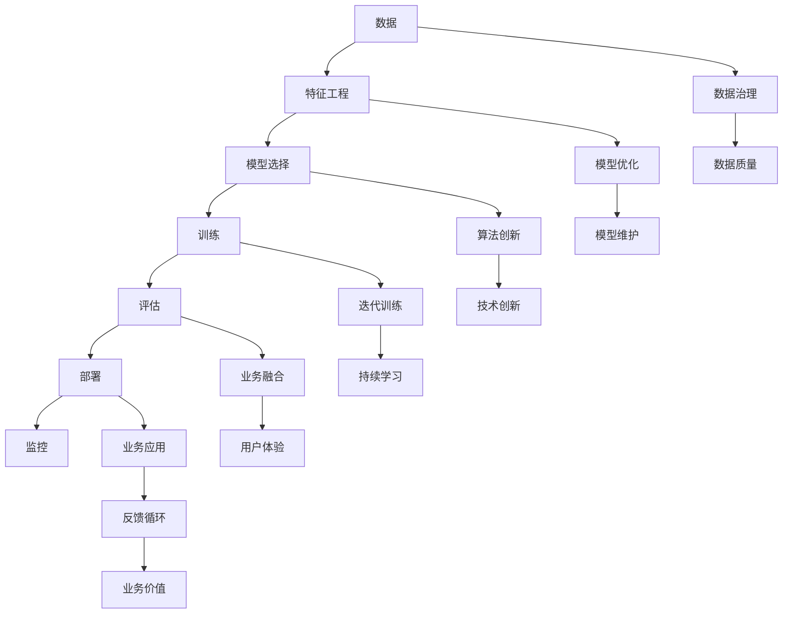

                 

# 贾扬清建议：培养团队AI理解力，应用AI于业务

> 关键词：人工智能,业务应用,团队AI理解力,人才培养,机器学习,深度学习

## 1. 背景介绍

在当前科技迅猛发展的时代，人工智能(AI)技术已经深入各行各业，成为推动产业数字化转型的重要力量。然而，尽管AI技术取得诸多突破，AI人才的培养和应用仍面临诸多挑战。本文将重点讨论如何培养团队AI理解力，并通过AI技术助力业务发展，以期为更多的企业提供实用的AI应用思路和指导。

## 2. 核心概念与联系

### 2.1 核心概念概述

在讨论AI在业务中的应用之前，首先需要明确几个核心概念：

- **人工智能(AI)**：通过计算机算法和数据处理技术，使机器具有类似于人类智能的能力，包括感知、学习、推理、决策等功能。
- **深度学习(Deep Learning)**：基于人工神经网络的机器学习技术，通过多层次的非线性变换，对输入数据进行复杂模式识别和学习。
- **机器学习(Machine Learning)**：一种让机器从数据中学习并做出预测或决策的方法，包括监督学习、非监督学习、强化学习等。
- **AI应用**：将AI技术应用于实际业务场景，以提高效率、降低成本、增强体验等，如推荐系统、智能客服、智能制造等。
- **团队AI理解力**：指团队成员对AI技术的理解和应用能力，包括算法、模型、架构、工具、数据等方面的全面掌握。

### 2.2 核心概念原理和架构的 Mermaid 流程图



该流程图展示了AI应用从数据到业务价值的全过程，其中包含数据治理、模型优化、业务融合等多个环节。通过这些环节的协同工作，AI技术得以在实际业务中发挥其价值。

## 3. 核心算法原理 & 具体操作步骤

### 3.1 算法原理概述

AI在业务应用中的核心算法原理主要包括以下几个方面：

- **监督学习(Supervised Learning)**：通过标记数据训练模型，使其能够预测新的未标记数据。常见的应用如分类、回归、预测等。
- **非监督学习(Unsupervised Learning)**：不依赖标记数据，通过数据的内在结构发现隐藏的模式和关系。常见的应用如聚类、降维等。
- **强化学习(Reinforcement Learning)**：通过与环境的交互，使机器学习在特定环境下做出最优决策。常见的应用如游戏智能、机器人控制等。
- **迁移学习(Transfer Learning)**：利用在其他领域学到的知识，迁移到新领域中，提高在新领域中的学习效率和性能。
- **深度学习(Deep Learning)**：通过多层次神经网络结构，学习输入数据的复杂表示，从而进行模式识别和预测。

### 3.2 算法步骤详解

AI应用的具体操作步骤可以大致分为以下几个阶段：

1. **数据收集与准备**：从业务场景中收集数据，并进行清洗、标注、划分训练集、验证集和测试集等预处理步骤。
2. **特征工程**：将原始数据转化为模型能够接受的特征，如提取特征、特征选择、特征降维等。
3. **模型选择与训练**：根据业务需求选择合适的模型架构，并在标注数据上训练模型。
4. **模型评估与优化**：在验证集上评估模型性能，并根据评估结果对模型进行优化。
5. **模型部署与应用**：将优化后的模型部署到生产环境中，并集成到实际业务场景中，进行实际应用。
6. **模型监控与维护**：实时监控模型性能，根据业务反馈和数据变化，定期更新和维护模型。

### 3.3 算法优缺点

AI算法在业务应用中的优缺点如下：

- **优点**：
  - **高效率**：AI算法能够自动处理大量数据，快速识别模式和规律。
  - **高准确性**：在适当的数据和算法支持下，AI算法能够实现高精度的预测和决策。
  - **可扩展性**：AI算法能够适应多变的业务需求，通过模型优化和数据调整，不断提升性能。
  - **自动化**：AI算法能够自动执行复杂任务，减少人工干预，提升业务效率。

- **缺点**：
  - **依赖数据质量**：AI算法的性能高度依赖于数据的质量和代表性，低质量数据可能导致模型失效。
  - **模型复杂性**：深度学习等高级AI算法模型复杂，需要大量计算资源和时间进行训练和调优。
  - **可解释性不足**：某些AI模型如深度神经网络，其决策过程缺乏可解释性，难以进行调试和优化。
  - **数据隐私与安全问题**：AI应用需要处理大量敏感数据，可能面临数据泄露和隐私侵害的风险。

### 3.4 算法应用领域

AI算法在多个领域都有广泛应用，以下是几个典型场景：

- **金融行业**：利用AI算法进行风险评估、信用评分、欺诈检测等。
- **医疗健康**：通过AI算法进行疾病诊断、治疗方案推荐、健康管理等。
- **零售电商**：利用AI算法进行商品推荐、库存管理、客户行为分析等。
- **制造行业**：通过AI算法进行设备预测性维护、生产优化、质量控制等。
- **交通运输**：利用AI算法进行交通流量预测、路线优化、智能驾驶等。

## 4. 数学模型和公式 & 详细讲解 & 举例说明

### 4.1 数学模型构建

在AI应用中，常用的数学模型包括线性回归、逻辑回归、决策树、随机森林、支持向量机、神经网络等。这里以线性回归模型为例，进行详细讲解。

线性回归模型假设数据遵循线性关系，通过最小二乘法拟合数据，以得到最优的线性拟合线。数学表达式如下：

$$
y = \beta_0 + \beta_1x_1 + \beta_2x_2 + \ldots + \beta_nx_n + \epsilon
$$

其中，$y$ 为目标变量，$x_i$ 为自变量，$\beta_i$ 为系数，$\epsilon$ 为误差项。

### 4.2 公式推导过程

线性回归模型的最小二乘法目标函数为：

$$
\min_{\beta} \sum_{i=1}^n (y_i - \hat{y}_i)^2
$$

其中，$\hat{y}_i$ 为模型预测值。

根据最小二乘法，可以得到参数$\beta$的求解公式：

$$
\beta = (X^TX)^{-1}X^Ty
$$

其中，$X$为自变量矩阵，$y$为因变量向量。

### 4.3 案例分析与讲解

假设有一个房地产价格预测问题，已知房屋面积$x_1$、楼层$x_2$、地段$x_3$等特征，预测房屋价格$y$。可以构建线性回归模型，并通过训练数据拟合出最优的系数$\beta$。

首先，收集历史房价数据，提取上述特征，构建训练集和验证集。然后，使用梯度下降等优化算法训练模型，并根据验证集上的性能调整模型参数。最后，将优化后的模型应用于新房的房价预测。

## 5. 项目实践：代码实例和详细解释说明

### 5.1 开发环境搭建

在开始项目实践之前，需要搭建好开发环境。以下是使用Python进行AI应用开发的常见环境配置流程：

1. 安装Python：从官网下载并安装Python，推荐使用3.7及以上版本。
2. 安装相关库：如NumPy、Pandas、Scikit-learn、TensorFlow、PyTorch等。
3. 配置虚拟环境：使用虚拟环境管理工具，如virtualenv或conda，创建虚拟环境并激活。
4. 安装特定库：根据项目需求，安装所需的库和依赖。

### 5.2 源代码详细实现

以线性回归模型为例，使用Scikit-learn库进行代码实现：

```python
from sklearn.linear_model import LinearRegression
from sklearn.metrics import mean_squared_error
import pandas as pd

# 数据准备
data = pd.read_csv('house_prices.csv')
X = data[['area', 'floor', 'location']]
y = data['price']

# 模型训练
model = LinearRegression()
model.fit(X, y)

# 模型评估
y_pred = model.predict(X)
mse = mean_squared_error(y, y_pred)
print(f'Mean Squared Error: {mse}')

# 模型应用
new_data = pd.DataFrame({'area': [150], 'floor': [10], 'location': [1]})
new_price = model.predict(new_data)
print(f'New House Price: {new_price[0]}')
```

### 5.3 代码解读与分析

以上代码实现了线性回归模型的训练、评估和应用。以下是关键代码的解读：

- 数据准备：从CSV文件中读取数据，提取特征和目标变量，构建数据集。
- 模型训练：使用LinearRegression类训练模型，并使用fit方法拟合数据。
- 模型评估：使用预测值与真实值计算均方误差，评估模型性能。
- 模型应用：将新数据输入模型，预测房价。

## 6. 实际应用场景

### 6.1 智能客服系统

智能客服系统利用AI技术处理大量客户咨询，通过自然语言处理(NLP)、语音识别(SR)等技术，实现自动回复和问题解答。例如，基于BERT等预训练语言模型的智能客服系统，可以自动理解客户意图，匹配最佳回答，显著提升客户服务体验。

### 6.2 金融风险管理

在金融行业，AI算法可以应用于信用评分、欺诈检测、市场预测等任务。例如，利用机器学习算法对客户的历史交易数据进行分析，预测其违约风险，帮助金融机构进行精准的风险管理。

### 6.3 零售个性化推荐

零售电商利用AI算法进行商品推荐，通过分析用户行为数据，预测用户偏好，推荐个性化商品。例如，基于协同过滤和深度学习的推荐系统，能够实现冷启动和跨域推荐，提高用户满意度。

### 6.4 制造业质量控制

在制造业，AI算法可以用于设备预测性维护、质量检测和生产优化。例如，通过预测性维护模型，实时监控设备状态，预测故障，避免停机时间，提高生产效率。

## 7. 工具和资源推荐

### 7.1 学习资源推荐

为了帮助开发者系统掌握AI应用的技术，以下是一些优质的学习资源：

- **Kaggle**：提供丰富的机器学习竞赛和数据集，能够快速实践和验证模型效果。
- **Coursera**：斯坦福大学、MIT等名校开设的AI相关课程，系统介绍AI技术的基本概念和算法。
- **fast.ai**：提供实战型深度学习课程，注重实践和动手能力培养。
- **DeepLearning.AI**：Andrew Ng教授创建的AI教育平台，提供从入门到高级的AI课程。

### 7.2 开发工具推荐

以下是几个常用的AI开发工具：

- **PyTorch**：由Facebook开发的深度学习框架，支持动态图和静态图，适合研究和实验。
- **TensorFlow**：由Google开发的深度学习框架，支持分布式计算，适合大规模工程应用。
- **Scikit-learn**：Python科学计算库，提供了丰富的机器学习算法和工具。
- **Jupyter Notebook**：交互式编程环境，支持Python、R等多种语言，便于数据探索和模型实验。

### 7.3 相关论文推荐

AI应用领域的研究成果丰富，以下是几篇具有代表性的论文：

- **Deep Learning for Computer Vision**：Ian Goodfellow等著，系统介绍深度学习在计算机视觉领域的应用。
- **Artificial Intelligence: A Modern Approach**：Stuart Russell和Peter Norvig合著，全面介绍AI技术和应用。
- **Neural Networks and Deep Learning**：Michael Nielsen著，讲解深度学习的基本原理和实践技巧。

## 8. 总结：未来发展趋势与挑战

### 8.1 研究成果总结

AI在业务中的应用已经取得诸多进展，涉及领域广泛，技术体系成熟。但同时，也面临一些挑战和问题，需要进一步研究和改进。

### 8.2 未来发展趋势

未来，AI技术将更加普及和深入，向更加智能化、自动化、普及化方向发展。主要趋势包括：

- **智能化**：AI算法将更加智能化，能够处理更加复杂和多样化的数据。
- **自动化**：AI系统将更加自动化，减少人工干预，提升工作效率。
- **普及化**：AI技术将普及到更多行业和应用场景，成为业务创新和发展的关键驱动力。
- **融合化**：AI技术将与物联网、大数据、区块链等技术深度融合，构建更全面的智能生态。

### 8.3 面临的挑战

尽管AI技术取得了诸多进展，但也面临一些挑战，需要进一步解决：

- **数据隐私与安全问题**：AI应用需要处理大量敏感数据，可能面临数据泄露和隐私侵害的风险。
- **模型复杂性**：AI算法模型复杂，需要大量计算资源和时间进行训练和调优。
- **可解释性不足**：某些AI模型如深度神经网络，其决策过程缺乏可解释性，难以进行调试和优化。
- **算力成本高**：AI应用需要大量算力支持，成本较高，需要寻找更高效的算法和模型。

### 8.4 研究展望

未来的研究应关注以下几个方向：

- **提升数据治理能力**：提升数据质量，增强数据隐私保护。
- **优化模型架构**：设计更高效的算法和模型，减少计算资源消耗。
- **强化模型可解释性**：提升AI模型的可解释性，便于调试和优化。
- **探索新算法和应用场景**：探索新算法和应用场景，推动AI技术向更广泛领域扩展。

## 9. 附录：常见问题与解答

### 问题1：AI技术在业务中的应用有哪些？

答：AI技术在业务中的应用广泛，包括智能客服、金融风险管理、个性化推荐、质量控制等。

### 问题2：如何培养团队AI理解力？

答：培养团队AI理解力需要多方面努力，包括培训、实践、团队协作等。推荐多参加行业会议、竞赛，多动手实践，多进行团队讨论和交流。

### 问题3：AI应用面临的主要挑战是什么？

答：AI应用面临的主要挑战包括数据隐私与安全问题、模型复杂性、可解释性不足、算力成本高等。

### 问题4：AI技术未来发展趋势是什么？

答：AI技术未来将更加智能化、自动化、普及化和融合化。

---

作者：禅与计算机程序设计艺术 / Zen and the Art of Computer Programming

