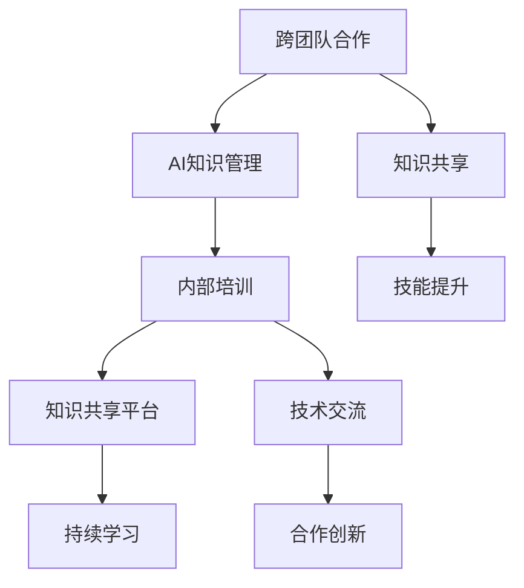

                 

# 跨团队AI知识共享：Lepton AI的内部培训

> 关键词：跨团队合作, AI知识管理, 内部培训, 技能提升, 专业发展, 知识共享平台, 持续学习, 企业内部教育

## 1. 背景介绍

在AI领域，尤其是Lepton AI这样规模庞大且快速发展的公司，知识共享和技能提升是员工个人及企业整体成长的驱动力。然而，庞大的组织结构和跨部门协作常常导致信息孤岛和知识断层，阻碍了技术的有效传递和创新驱动。为解决这一问题，Lepton AI建立了系统的内部培训和知识共享机制，推动全员知识体系的构建和持续学习文化的培育。本文将详细探讨Lepton AI在跨团队AI知识共享方面所做的实践和经验，为其他企业提供借鉴和参考。

## 2. 核心概念与联系

### 2.1 核心概念概述

要深入理解Lepton AI的内部培训机制，首先需要明确几个关键概念：

- **跨团队合作**：指不同团队和部门之间的协同工作，以实现共同目标。
- **AI知识管理**：涉及知识的收集、存储、共享和应用，是AI技术转化为生产力的基础。
- **内部培训**：企业为员工提供的专业技能提升活动，涵盖在线课程、研讨会、工作坊等多种形式。
- **持续学习**：一种不断更新知识和技能的过程，强调在职业生涯中持续发展。
- **知识共享平台**：一个集中存储和传播知识的系统，支持员工之间相互学习和经验交流。

这些概念相互关联，共同构建了Lepton AI在AI知识共享和内部培训方面的基础架构。

### 2.2 核心概念原理和架构的 Mermaid 流程图(Mermaid 流程节点中不要有括号、逗号等特殊字符)



这个流程图展示了Lepton AI内部培训与知识共享的基本流程：

1. 跨团队合作推动了知识共享的需要。
2. AI知识管理为内部培训和知识共享提供了基础设施。
3. 内部培训和持续学习为知识共享和应用提供动力。
4. 知识共享平台是知识共享的核心载体。

## 3. 核心算法原理 & 具体操作步骤

### 3.1 算法原理概述

Lepton AI的知识共享和内部培训机制是基于监督学习的范式进行设计的。其核心原理是通过有效的数据集和算法模型，确保知识传递的准确性和时效性。关键步骤如下：

- **数据收集**：从跨团队合作和日常项目中收集知识片段，构建知识库。
- **数据标注**：为每个知识片段标注分类、标签等信息，以指导学习算法。
- **算法训练**：使用机器学习算法训练模型，优化知识共享的匹配和推荐。
- **效果评估**：定期评估模型性能，根据反馈迭代优化算法。

### 3.2 算法步骤详解

#### 3.2.1 数据收集

知识收集是知识共享的第一步，主要通过以下几种途径：

1. **日常工作文档**：收集员工在日常工作中编写的文档、报告、代码等。
2. **项目总结**：从各类项目总结、报告中提取关键信息和经验。
3. **线上社区**：利用内部社区（如Slack、Teams等）中的讨论和文档。
4. **技术博客和文章**：鼓励员工撰写技术文章，分享学习心得。

#### 3.2.2 数据标注

为了确保知识库的有效性，需要对收集的数据进行标注，以指导学习算法。主要标注内容包括：

1. **主题分类**：将知识片段归类到特定的技术领域或行业方向。
2. **难度级别**：根据内容的深度和复杂度进行分级，方便学习者选择。
3. **标签标注**：为每个知识片段添加关键词标签，如“机器学习”、“深度学习”等。
4. **推荐优先级**：根据使用频率和价值，确定推荐优先级。

#### 3.2.3 算法训练

基于标注数据，Lepton AI使用监督学习算法训练推荐模型。具体步骤如下：

1. **特征提取**：从每个知识片段中提取关键特征，如关键词、主题等。
2. **模型选择**：选择适合的知识共享算法，如协同过滤、深度学习等。
3. **模型训练**：使用标注数据训练模型，优化参数以提高推荐效果。
4. **评估与迭代**：定期评估模型性能，根据反馈迭代优化算法。

#### 3.2.4 效果评估

为确保知识共享的效果，Lepton AI采取以下评估方法：

1. **用户满意度调查**：通过员工满意度调查，评估知识共享平台的使用体验。
2. **知识使用率**：统计平台上的知识片段使用次数，判断知识传递的效率。
3. **项目收益**：衡量知识共享对项目成功的贡献，如解决问题数量、效率提升等。
4. **员工成长**：通过员工绩效和技能评估，评估内部培训的效果。

### 3.3 算法优缺点

Lepton AI的知识共享和内部培训机制具有以下优点：

1. **系统化管理**：通过系统化的数据收集和标注，确保知识共享的全面性和准确性。
2. **个性化推荐**：利用推荐算法，将相关知识精准推荐给有需要的员工，提高学习效率。
3. **持续改进**：通过定期评估和反馈机制，不断优化算法，提升知识共享的效果。
4. **高效传播**：借助现代技术手段，快速传播知识，减少信息传递的时间成本。

同时，也存在一些局限性：

1. **数据质量问题**：标注数据的准确性和完整性直接影响算法效果，需要投入大量时间和资源进行维护。
2. **算法复杂度**：复杂的推荐算法需要较高的计算资源和技术门槛，可能增加实施难度。
3. **文化差异**：不同部门和团队的知识共享习惯可能存在差异，需要额外引导和激励。
4. **隐私保护**：知识共享平台需要确保数据的隐私保护，避免敏感信息的泄露。

### 3.4 算法应用领域

Lepton AI的知识共享机制已经在多个领域取得了显著效果：

1. **技术开发**：通过知识共享平台，工程师能够快速获取所需的技术文档和代码，提升开发效率。
2. **项目管理**：项目经理利用知识库，快速理解项目需求和背景，优化项目规划和执行。
3. **业务运营**：运营团队借助知识库，提升客户服务质量和客户满意度，增强企业竞争力。
4. **内部培训**：通过知识库的整合和更新，员工能够进行有针对性的学习，提升技能水平。
5. **创新研发**：跨团队的知识共享推动了技术和应用的创新，加速了新产品的研发进程。

## 4. 数学模型和公式 & 详细讲解 & 举例说明

### 4.1 数学模型构建

Lepton AI的知识共享算法模型主要分为以下几个模块：

1. **数据预处理**：包括特征提取、标准化、缺失值处理等。
2. **特征选择**：选择最相关的特征进行模型训练。
3. **模型训练**：使用监督学习算法（如随机森林、深度学习等）进行训练。
4. **推荐结果生成**：根据模型预测结果生成推荐列表。

### 4.2 公式推导过程

以协同过滤算法为例，公式推导过程如下：

1. **用户-项目评分矩阵**：设$U$为用户集合，$P$为知识片段集合，$R$为用户对知识片段的评分矩阵。
2. **用户相似度计算**：计算用户$u$和$v$的相似度$sim(u,v)$，常用余弦相似度公式：
   $$
   sim(u,v) = \frac{\sum_{p \in P} r_{up} r_{vp}}{\sqrt{\sum_{p \in P} r_{up}^2} \sqrt{\sum_{p \in P} r_{vp}^2}}
   $$
3. **知识片段推荐**：对用户$u$的推荐列表为$P_u = \arg\max_{p \in P} \sum_{v \in U} r_{uv} \times sim(u,v)$。

### 4.3 案例分析与讲解

假设Lepton AI的开发团队正在使用知识共享平台，查找“TensorFlow 2.0”相关的文档。系统根据用户的历史评分和相似用户评分，生成以下推荐列表：

1. **用户评分**：假设开发人员A对“TensorFlow 2.0”的评分是4分。
2. **相似用户**：找到与A评分相似的用户B、C、D。
3. **相似度计算**：计算A与B、C、D的相似度。
4. **推荐文档**：根据相似用户评分和相似度计算，推荐“TensorFlow 2.0”相关的高评分文档，如“TensorFlow 2.0 深度学习实践指南”、“TensorFlow 2.0 性能调优技巧”等。

## 5. 项目实践：代码实例和详细解释说明

### 5.1 开发环境搭建

为方便知识共享平台的开发和测试，Lepton AI搭建了以下开发环境：

1. **Python 3.8**：选择稳定的Python版本，提供开发所需的库和框架。
2. **AWS EC2**：利用云平台提供的高性能计算资源，满足大规模数据处理需求。
3. **Jupyter Notebook**：方便开发者进行交互式编程和实验。
4. **Scikit-learn**：用于特征提取和模型训练的机器学习库。
5. **TensorFlow**：支持深度学习算法的强大计算框架。
6. **Flask**：构建Web服务的轻量级框架，方便知识共享平台的部署和访问。

### 5.2 源代码详细实现

以下是一个简单的Python脚本，用于知识共享平台的推荐系统实现：

```python
from sklearn.feature_extraction.text import TfidfVectorizer
from sklearn.metrics.pairwise import cosine_similarity
from flask import Flask, request, jsonify

app = Flask(__name__)

# 加载知识库
knowledge_base = load_knowledge_base()

# 特征提取
vectorizer = TfidfVectorizer()
X = vectorizer.fit_transform(knowledge_base)

# 训练推荐模型
model = train_cf_model(X)

@app.route('/recommend', methods=['POST'])
def recommend():
    query = request.json['query']
    user_id = request.json['user_id']
    query_vec = vectorizer.transform([query])
    user_vec = model[user_id]
    similarities = cosine_similarity(query_vec, user_vec)
    recommendations = model.indices_[np.argsort(similarities)[::-1]]
    return jsonify({'recommendations': recommendations})

if __name__ == '__main__':
    app.run(host='0.0.0.0', port=5000)
```

该脚本实现了基于余弦相似度的协同过滤推荐系统，提供Web API接口，接收查询和用户ID，返回推荐列表。

### 5.3 代码解读与分析

在代码中，主要使用了以下关键组件：

- **Scikit-learn**：用于特征提取和余弦相似度计算。
- **Flask**：实现Web服务，提供API接口。
- **TfidfVectorizer**：将文本转换为TF-IDF向量，方便模型处理。
- **cosine_similarity**：计算余弦相似度，用于用户和文档的相似度计算。
- **load_knowledge_base**：从知识库加载数据，用于模型训练和推荐。
- **train_cf_model**：使用协同过滤算法训练推荐模型，生成用户向量和文档向量。

该脚本的运行结果展示了推荐系统的实际应用效果，开发人员可以根据需求进一步优化和扩展。

## 6. 实际应用场景

### 6.1 技术开发

Lepton AI的开发团队利用知识共享平台，可以快速获取所需的技术文档和代码，提高开发效率。例如，新入职的开发人员可以通过搜索“TensorFlow 2.0”，获得全面的学习资料和代码示例，快速上手新项目。

### 6.2 项目管理

项目经理利用知识库，可以迅速理解项目需求和背景，优化项目规划和执行。例如，在项目启动阶段，通过搜索“Kubernetes 部署最佳实践”，获取全面的部署指南和案例，快速制定项目计划。

### 6.3 业务运营

运营团队借助知识库，提升客户服务质量和客户满意度。例如，客服人员可以通过搜索“客户投诉处理流程”，获取详细的处理流程和案例，提升客户满意度。

### 6.4 内部培训

Lepton AI的内部培训系统与知识共享平台紧密结合，提供定制化的学习资源。例如，新员工可以通过搜索“深度学习入门教程”，获取详细的学习路径和课程，提升技能水平。

### 6.5 创新研发

跨团队的知识共享推动了技术和应用的创新，加速了新产品的研发进程。例如，通过搜索“NLP技术进展”，工程师可以获取最新的研究论文和技术趋势，推动技术创新和应用落地。

## 7. 工具和资源推荐

### 7.1 学习资源推荐

为帮助员工系统掌握知识共享和内部培训的技能，Lepton AI推荐以下学习资源：

1. **《机器学习实战》**：提供了丰富的机器学习算法和实战案例，适合入门和进阶学习。
2. **Coursera 机器学习课程**：斯坦福大学的经典机器学习课程，系统讲解机器学习原理和应用。
3. **Kaggle 数据科学竞赛**：通过参与实际数据竞赛，提升数据处理和模型应用能力。
4. **Lepton AI内部知识库**：涵盖公司内部积累的知识和经验，提供即时的学习支持。

### 7.2 开发工具推荐

为方便开发者构建和测试知识共享平台，Lepton AI推荐以下开发工具：

1. **AWS EC2**：提供高性能计算资源，支持大规模数据处理。
2. **Jupyter Notebook**：支持交互式编程和实验，便于快速开发和测试。
3. **Flask**：轻量级Web框架，方便构建API接口，支持实时数据交互。
4. **TensorFlow**：强大的深度学习框架，支持复杂的推荐算法实现。
5. **PyTorch**：灵活的深度学习框架，适用于快速原型设计和实验。
6. **Scikit-learn**：简单易用的机器学习库，适合特征提取和模型训练。

### 7.3 相关论文推荐

为深入理解知识共享和内部培训的原理，Lepton AI推荐以下相关论文：

1. **《协同过滤推荐系统》**：介绍了协同过滤算法的基本原理和实现方法，适合了解推荐系统基础。
2. **《基于深度学习的推荐系统》**：探讨了深度学习在推荐系统中的应用，适合进阶学习。
3. **《知识图谱在推荐系统中的应用》**：介绍了知识图谱对推荐系统的增强作用，适合了解更高级的推荐策略。

## 8. 总结：未来发展趋势与挑战

### 8.1 研究成果总结

Lepton AI的知识共享和内部培训机制，已经在多个项目中取得显著效果，为全员知识体系的构建和持续学习文化的培育提供了有力的支持。系统化管理、个性化推荐、持续改进等关键技术的应用，确保了知识共享的高效和精准。

### 8.2 未来发展趋势

未来，Lepton AI的知识共享和内部培训机制将朝着以下方向发展：

1. **智能化升级**：引入更先进的算法和模型，提升推荐系统的智能化和准确性。
2. **多模态融合**：结合文本、图像、视频等多模态数据，提供更全面的知识共享体验。
3. **实时更新**：实现知识的实时更新和动态推荐，保持知识库的时效性。
4. **跨部门协作**：进一步优化跨团队合作的机制，促进更广泛的交流和学习。
5. **个性化定制**：根据员工的学习习惯和偏好，提供个性化的学习路径和资源。

### 8.3 面临的挑战

尽管取得了显著成效，Lepton AI的知识共享机制仍面临以下挑战：

1. **数据质量问题**：确保数据标注的准确性和完整性，需要持续的维护和改进。
2. **技术门槛**：复杂算法和高性能计算资源的需求，可能增加实施难度。
3. **文化差异**：不同部门和团队的知识共享习惯可能存在差异，需要额外引导和激励。
4. **隐私保护**：确保数据的隐私保护，避免敏感信息的泄露。

### 8.4 研究展望

未来，Lepton AI将进一步探索和改进知识共享和内部培训机制，确保其在新技术和新场景下的适用性和有效性。同时，也将加强与其他技术和应用的融合，推动知识共享在企业内部的全面落地。

## 9. 附录：常见问题与解答

### Q1: 如何评估知识共享平台的效果？

A: 知识共享平台的效果可以通过以下指标进行评估：

1. **用户满意度**：通过问卷调查和反馈，评估用户对平台的满意度。
2. **知识使用率**：统计平台上的知识片段使用次数，衡量知识的传播效果。
3. **项目收益**：通过项目成功案例，衡量知识共享对项目成功的贡献。
4. **员工成长**：通过员工绩效和技能评估，衡量内部培训的效果。

### Q2: 知识共享平台如何实现个性化推荐？

A: 知识共享平台实现个性化推荐的主要步骤如下：

1. **用户行为记录**：收集用户对知识片段的访问记录和评分。
2. **特征提取**：提取用户行为的关键特征，如浏览历史、评分等。
3. **模型训练**：使用监督学习算法（如协同过滤、深度学习等）训练推荐模型，优化推荐效果。
4. **实时推荐**：根据用户当前行为和历史数据，实时生成推荐列表，满足即时需求。

### Q3: 如何确保知识共享平台的隐私保护？

A: 知识共享平台需要采取以下措施确保隐私保护：

1. **数据匿名化**：对知识片段进行匿名化处理，去除个人敏感信息。
2. **访问控制**：设置严格的访问权限，确保只有授权人员才能访问知识库。
3. **加密传输**：采用SSL/TLS协议加密数据传输，防止数据泄露。
4. **定期审计**：定期进行数据审计和监控，发现并解决潜在的安全问题。

### Q4: 如何优化知识共享平台的推荐算法？

A: 优化知识共享平台的推荐算法可以从以下几个方面入手：

1. **算法改进**：引入更先进的算法，如深度学习、协同过滤等，提升推荐精度。
2. **数据增强**：通过数据增强技术，丰富训练集，提升模型的泛化能力。
3. **特征工程**：优化特征选择和提取，提高特征的表达能力。
4. **实时更新**：实现知识的实时更新和动态推荐，保持知识库的时效性。

### Q5: 如何推动跨部门的知识共享？

A: 推动跨部门的知识共享需要以下措施：

1. **明确目标**：制定明确的知识共享目标和规范，推动部门之间的协作。
2. **奖励机制**：设立奖励机制，鼓励员工积极参与知识共享。
3. **培训和沟通**：提供跨部门的培训和沟通机会，提升团队协作能力。
4. **平台优化**：优化知识共享平台，支持跨部门的知识交流和协作。

通过不断优化和改进，Lepton AI的知识共享和内部培训机制将继续发挥其核心作用，推动公司技术的持续发展和创新。

---

作者：禅与计算机程序设计艺术 / Zen and the Art of Computer Programming

