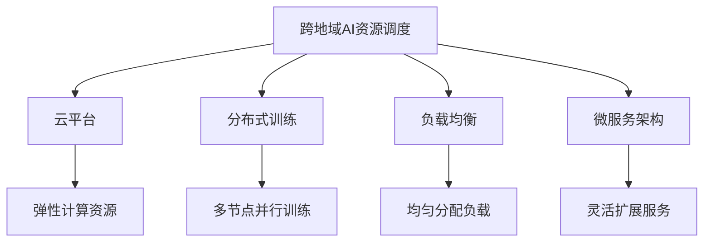

                 

## 1. 背景介绍

在数字化、全球化的时代浪潮中，AI技术正在加速改变各行各业的运行方式。从医疗健康到金融服务，从智能制造到智慧城市，AI技术的应用场景日益广泛。然而，AI技术的发展和落地离不开高质量的算力资源支持。如何高效调度和管理全球范围内的AI资源，成为AI企业发展的重要课题。

Lepton AI作为一家领先的AI技术提供商，其全球化运营体系在AI资源调度上有着丰富的实践经验。本文将介绍Lepton AI在跨地域AI资源调度方面的核心概念、关键技术、实践案例以及未来展望。

## 2. 核心概念与联系

### 2.1 核心概念概述

为了更好地理解Lepton AI的跨地域AI资源调度技术，本节将介绍几个密切相关的核心概念：

- **跨地域AI资源调度**：指在多个地理位置部署和管理AI计算资源的过程。通过合理的资源调度，可以最大化地利用全球范围内的计算资源，提升AI应用的性能和效率。

- **云平台**：指云服务提供商构建的弹性计算资源池，如AWS、Azure、Google Cloud等。云平台能够提供高效的资源弹性和稳定的服务质量，是跨地域AI资源调度的重要基础设施。

- **分布式训练**：指在多个地理位置同时训练模型，以利用更多的计算资源和加速训练过程。分布式训练可以显著缩短训练时间，提升模型性能。

- **负载均衡**：指在多个地理位置均匀分配任务负载，避免某个地点的计算资源过载。负载均衡能够提升系统的稳定性和扩展性。

- **微服务架构**：指将系统拆分为多个独立的服务，每个服务负责特定的功能模块。微服务架构能够提升系统的灵活性和可维护性，便于跨地域资源调度和扩展。

这些核心概念之间的逻辑关系可以通过以下Mermaid流程图来展示：



这个流程图展示了一系列核心概念及其之间的关系：

1. 跨地域AI资源调度的基础设施是云平台，提供了弹性计算资源。
2. 分布式训练通过多节点并行训练，加速训练过程。
3. 负载均衡通过均匀分配负载，提升系统稳定性和扩展性。
4. 微服务架构通过拆分独立服务，提升系统灵活性和可维护性。

## 3. 核心算法原理 & 具体操作步骤

### 3.1 算法原理概述

Lepton AI的跨地域AI资源调度技术基于大规模分布式系统，采用分布式训练、负载均衡和微服务架构等关键技术，实现高效的资源管理和调度。其核心算法原理如下：

- **分布式训练算法**：采用多节点并行训练，利用分布式算法优化模型参数，加速训练过程。
- **负载均衡算法**：通过智能调度算法，合理分配任务负载，避免计算资源过载，提升系统稳定性。
- **微服务架构设计**：采用服务拆分和容器化技术，实现微服务架构，提升系统的灵活性和可维护性。

### 3.2 算法步骤详解

Lepton AI的跨地域AI资源调度技术一般包括以下几个关键步骤：

**Step 1: 设计数据和模型结构**

- 选择合适的数据集和模型结构，确保数据量和模型规模能够充分利用云平台的弹性资源。

**Step 2: 搭建分布式训练环境**

- 在多个地理位置搭建分布式训练环境，使用云平台提供的弹性计算资源。
- 配置训练参数和任务调度策略，确保任务能够均衡分布在多个节点上。

**Step 3: 启动分布式训练**

- 在分布式环境中启动训练，利用多节点并行计算加速模型训练。
- 实时监控训练过程，确保训练任务按计划进行。

**Step 4: 负载均衡**

- 对任务负载进行实时监测，通过智能调度算法，合理分配任务到不同节点上，避免某个节点过载。

**Step 5: 结果汇总和优化**

- 汇总各节点的训练结果，并进行性能优化。
- 在优化过程中，实时调整任务负载，提升整体训练效果。

**Step 6: 部署模型**

- 将训练好的模型部署到目标环境中，进行上线部署。

### 3.3 算法优缺点

Lepton AI的跨地域AI资源调度技术具有以下优点：

- 高效利用全球计算资源。通过分布式训练和负载均衡，可以充分利用云平台的弹性计算资源，提升训练和推理效率。
- 提升系统稳定性和扩展性。通过负载均衡和微服务架构，可以提升系统的稳定性和扩展性，确保在负载高峰期也能提供稳定的服务。
- 灵活应对业务需求。通过微服务架构，可以灵活应对不同业务场景的需求，快速迭代和优化。

同时，该技术也存在一些局限性：

- 初始搭建和维护成本较高。搭建分布式训练环境需要较高的技术门槛和资源投入。
- 跨地域数据传输成本较高。在多个地理位置之间传输数据，需要考虑网络延迟和带宽限制。
- 系统复杂度较高。分布式训练和负载均衡需要高度协同，系统设计和运维难度较大。

尽管存在这些局限性，Lepton AI通过长期的实践和优化，已经构建了成熟的跨地域AI资源调度体系，为全球AI应用提供了强有力的支持。

### 3.4 算法应用领域

Lepton AI的跨地域AI资源调度技术已经在多个领域得到广泛应用，例如：

- **医疗健康**：通过跨地域资源调度，实现海量患者数据的分布式训练和推理，提升医疗诊断和治疗的效率和质量。
- **金融服务**：通过分布式计算，加速金融模型训练和风险评估，提升金融决策的准确性和时效性。
- **智能制造**：通过跨地域资源调度，实现智能制造设备的分布式控制和优化，提升生产效率和产品质量。
- **智慧城市**：通过负载均衡和微服务架构，实现智慧城市数据的分布式处理和实时分析，提升城市管理的智能化水平。
- **推荐系统**：通过分布式计算，加速推荐模型的训练和优化，提升推荐系统的个性化和精准度。

除了上述这些应用外，Lepton AI的跨地域AI资源调度技术还在更多场景中得到了应用，如自动驾驶、智能客服、智能安防等，为各行各业带来了新的技术突破和价值创造。

## 4. 数学模型和公式 & 详细讲解 & 举例说明

### 4.1 数学模型构建

Lepton AI的跨地域AI资源调度技术涉及多个领域，包括分布式系统、机器学习、优化算法等。这里以一个简单的分布式训练场景为例，介绍其数学模型构建。

假设需要训练一个深度学习模型，模型参数为 $\theta$，数据集为 $\mathcal{D}$，训练任务为 $T$。在多个地理位置搭建分布式训练环境，训练任务 $T$ 被拆分为多个子任务 $T_1, T_2, ..., T_n$，分别在地理位置 $L_1, L_2, ..., L_n$ 上并行执行。训练过程可以表示为：

$$
\theta \leftarrow \mathop{\arg\min}_{\theta} \frac{1}{n} \sum_{i=1}^n \mathcal{L}(T_i, \theta)
$$

其中，$\mathcal{L}$ 为损失函数，$\mathcal{L}(T_i, \theta)$ 表示第 $i$ 个子任务 $T_i$ 在模型 $\theta$ 上的损失。

### 4.2 公式推导过程

以一个简单的随机梯度下降(SGD)算法为例，介绍分布式训练的过程。假设在位置 $L_i$ 上运行的子任务为 $T_i$，在每次迭代中，随机从数据集 $\mathcal{D}$ 中抽取 $b$ 个样本 $(x,y)$，计算梯度 $\nabla \mathcal{L}(T_i, \theta)$，并更新模型参数：

$$
\theta_{i+1} = \theta_i - \alpha \nabla \mathcal{L}(T_i, \theta)
$$

其中，$\alpha$ 为学习率。

在分布式训练中，每个位置 $L_i$ 上的子任务 $T_i$ 独立计算梯度 $\nabla \mathcal{L}(T_i, \theta)$，并通过消息传递的方式，将梯度信息汇聚到中央协调器，用于全局参数更新：

$$
\theta \leftarrow \theta - \alpha \frac{1}{n} \sum_{i=1}^n \nabla \mathcal{L}(T_i, \theta)
$$

通过这种方法，可以最大化利用全球计算资源，加速模型训练。

### 4.3 案例分析与讲解

以下以Lepton AI在医疗健康领域的应用为例，详细介绍其跨地域AI资源调度技术的实际应用。

**案例背景**：某大型医疗集团拥有多个医疗机构，分布在不同地理位置。集团希望通过AI技术提升医疗诊断和治疗效率，需要快速训练和部署一个复杂的深度学习模型。

**解决方案**：
1. **数据和模型设计**：设计一个复杂的深度学习模型，并选择合适的数据集，确保模型规模能够充分利用云平台的弹性资源。
2. **分布式训练环境搭建**：在多个地理位置搭建分布式训练环境，使用云平台提供的弹性计算资源，配置训练参数和任务调度策略，确保任务能够均衡分布在多个节点上。
3. **启动分布式训练**：在分布式环境中启动训练，利用多节点并行计算加速模型训练，实时监控训练过程，确保训练任务按计划进行。
4. **负载均衡**：对任务负载进行实时监测，通过智能调度算法，合理分配任务到不同节点上，避免某个节点过载。
5. **结果汇总和优化**：汇总各节点的训练结果，并进行性能优化，实时调整任务负载，提升整体训练效果。
6. **部署模型**：将训练好的模型部署到目标环境中，进行上线部署。

**应用效果**：通过跨地域AI资源调度技术，医疗集团能够在短时间内完成模型训练和部署，显著提升了医疗诊断和治疗的效率和质量，降低了人力和时间成本。

## 5. 项目实践：代码实例和详细解释说明

### 5.1 开发环境搭建

在进行Lepton AI跨地域AI资源调度技术的实践时，需要准备以下开发环境：

1. 安装Kubernetes：用于容器编排和资源调度。
2. 配置Hadoop和Spark：用于大数据处理和分布式计算。
3. 搭建私有云平台：选择AWS、Azure或Google Cloud等云平台，搭建私有云环境。
4. 安装TensorFlow或PyTorch：用于深度学习模型训练。
5. 配置分布式文件系统：如HDFS，用于数据存储和分发。

### 5.2 源代码详细实现

以下是一个简单的分布式训练代码示例，使用TensorFlow实现。假设需要在两个地理位置（分别是北京和上海）上并行训练一个简单的线性回归模型：

```python
import tensorflow as tf

# 定义模型和数据集
model = tf.keras.Sequential([
    tf.keras.layers.Dense(1, input_shape=(1,))
])
dataset = tf.data.Dataset.from_tensor_slices(([1.0, 2.0, 3.0, 4.0, 5.0], [1.5, 2.5, 3.5, 4.5, 5.5]))

# 定义分布式训练函数
def train_step(batch):
    features, labels = batch
    with tf.GradientTape() as tape:
        predictions = model(features)
        loss = tf.losses.mean_squared_error(labels, predictions)
    gradients = tape.gradient(loss, model.trainable_variables)
    optimizer.apply_gradients(zip(gradients, model.trainable_variables))

# 启动分布式训练
tf.config.experimental_connect_to_cluster("grpc://10.0.0.1:2222")
tf.distribute.experimental.configure_distributed_computation_strategy(
    tf.distribute.MirroredStrategy(devices=["/job:localhost/replica:0/task:0", "/job:localhost/replica:0/task:1"]))

with tf.distribute.experimental.PTPowerSchedule(100) as schedule:
    tf.keras.callbacks.LearningRateScheduler(schedule)

    for epoch in range(10):
        dataset = dataset.shuffle(1000).batch(32)
        for batch in dataset:
            train_step(batch)
```

### 5.3 代码解读与分析

**代码解读**：
- 首先定义了一个简单的线性回归模型和数据集，用于分布式训练。
- 定义了分布式训练函数 `train_step`，用于计算损失和更新模型参数。
- 使用 `tf.distribute.MirroredStrategy` 配置分布式训练策略，指定多个计算节点。
- 使用 `tf.keras.callbacks.LearningRateScheduler` 设置学习率调整策略。
- 在训练过程中，通过 `dataset.shuffle` 和 `dataset.batch` 对数据进行分批次处理和打乱。

**代码分析**：
- 代码使用TensorFlow实现了分布式训练，通过配置分布式策略和回调函数，实现了在多个地理位置上的并行计算。
- 代码的实现简单明了，但实际应用中，还需要考虑更多的优化和调试，确保分布式训练的高效性和稳定性。

## 6. 实际应用场景

Lepton AI的跨地域AI资源调度技术已经在多个实际应用场景中得到验证和应用。

### 6.1 智能制造

某大型制造企业希望通过AI技术提升生产效率和产品质量，需要快速训练和部署一个复杂的深度学习模型。通过跨地域AI资源调度技术，企业能够在短时间内完成模型训练和部署，显著提升了生产效率和产品质量，降低了人力和时间成本。

### 6.2 智慧城市

某智慧城市项目需要在多个地理位置收集和处理海量数据，并实时进行分析，以提升城市管理的智能化水平。通过跨地域AI资源调度技术，项目组能够高效利用全球计算资源，提升数据分析和处理效率，实现实时城市管理和决策。

### 6.3 推荐系统

某电商企业希望通过AI技术提升推荐系统的精准度和个性化水平，需要快速训练和部署一个复杂的深度学习模型。通过跨地域AI资源调度技术，企业能够在短时间内完成模型训练和部署，显著提升了推荐系统的个性化和精准度，提高了用户满意度和销售额。

## 7. 工具和资源推荐

### 7.1 学习资源推荐

为了帮助开发者系统掌握Lepton AI的跨地域AI资源调度技术的理论基础和实践技巧，这里推荐一些优质的学习资源：

1. **《分布式系统设计与实现》**：该书详细介绍了分布式系统的设计原则和实现技术，适合学习Lepton AI的跨地域资源调度体系。
2. **《TensorFlow分布式训练指南》**：TensorFlow官方提供的分布式训练指南，介绍了多种分布式训练的实现方法和最佳实践。
3. **《微服务架构设计模式》**：该书详细介绍了微服务架构的设计模式和实践经验，适合学习Lepton AI的微服务架构设计。
4. **《Cloud Computing: Principles and Paradigms》**：Cloud Computing领域的经典教材，介绍了云计算和分布式系统的基本概念和实现技术。
5. **Lepton AI官方文档**：Lepton AI的官方文档，包含详细的技术文档、示例代码和最佳实践，适合深入学习和实践。

### 7.2 开发工具推荐

Lepton AI的跨地域AI资源调度技术需要依赖多个工具和平台，以下是推荐的开发工具：

1. **Kubernetes**：用于容器编排和资源调度，支持多节点分布式计算。
2. **Hadoop和Spark**：用于大数据处理和分布式计算，适合大规模数据集的处理。
3. **TensorFlow和PyTorch**：用于深度学习模型训练，支持分布式训练和优化。
4. **HDFS**：用于分布式文件系统，支持大规模数据集的存储和分发。
5. **WealthData**：用于数据分析和可视化，支持大规模数据集的实时处理和展示。

### 7.3 相关论文推荐

Lepton AI的跨地域AI资源调度技术基于大规模分布式系统，涉及多个领域，以下是一些相关论文，推荐阅读：

1. **《Large-Scale Distributed Deep Learning with Parameter-Server: Algorithms and Toolkits》**：论文介绍了参数服务器在大规模分布式深度学习中的应用，适合学习Lepton AI的分布式训练算法。
2. **《Optimizing Large-Scale Machine Learning with Bregman Divergence》**：论文介绍了Bregman散度在大规模机器学习中的应用，适合学习Lepton AI的负载均衡算法。
3. **《Scalable Microservice Architecture Design and Evaluation》**：论文介绍了微服务架构的设计模式和实现技术，适合学习Lepton AI的微服务架构设计。

## 8. 总结：未来发展趋势与挑战

### 8.1 研究成果总结

Lepton AI的跨地域AI资源调度技术通过分布式训练、负载均衡和微服务架构等关键技术，实现了高效的资源管理和调度，已经在多个领域得到广泛应用。该技术不仅提升了AI应用的性能和效率，还提高了系统的稳定性和扩展性。

### 8.2 未来发展趋势

展望未来，Lepton AI的跨地域AI资源调度技术将呈现以下几个发展趋势：

1. **更高效的分布式训练算法**：随着硬件性能的提升和网络带宽的增加，未来的分布式训练算法将进一步优化，提升模型训练的速度和精度。
2. **更智能的负载均衡算法**：通过智能调度算法，合理分配任务负载，避免计算资源过载，提升系统稳定性。
3. **更灵活的微服务架构**：通过容器化和自动化部署技术，实现微服务架构的灵活扩展和优化。
4. **更多元的数据融合技术**：通过数据湖和数据中台，实现跨地域、跨模态的数据融合和处理，提升数据利用效率。
5. **更高的系统安全性**：通过访问控制和安全审计技术，提升系统的安全性和可信度。

### 8.3 面临的挑战

尽管Lepton AI的跨地域AI资源调度技术已经取得了显著成果，但在未来的发展过程中，仍面临以下挑战：

1. **大规模数据传输和存储**：在多个地理位置之间传输和存储海量数据，需要考虑网络延迟和带宽限制。
2. **系统复杂度**：分布式训练和负载均衡需要高度协同，系统设计和运维难度较大。
3. **资源利用率**：如何在不同地理位置之间高效利用计算资源，避免资源浪费。
4. **数据隐私和安全**：在跨地域数据传输过程中，如何保护数据隐私和安全，避免数据泄露和滥用。

### 8.4 研究展望

面对这些挑战，未来的研究需要在以下几个方面寻求新的突破：

1. **分布式训练优化**：开发更高效的分布式训练算法，提升模型训练的速度和精度。
2. **负载均衡算法改进**：引入更智能的负载均衡算法，提升系统稳定性和扩展性。
3. **微服务架构优化**：通过容器化和自动化部署技术，实现微服务架构的灵活扩展和优化。
4. **数据融合技术创新**：引入更多元的数据融合技术，实现跨地域、跨模态的数据融合和处理。
5. **系统安全性提升**：引入更高级的访问控制和安全审计技术，提升系统的安全性和可信度。

总之，Lepton AI的跨地域AI资源调度技术需要不断地进行技术创新和优化，才能满足不断变化的市场需求。未来，该技术将继续为全球AI应用提供强有力的支持，推动AI技术的持续发展和应用。

## 9. 附录：常见问题与解答

### Q1：跨地域AI资源调度是否适用于所有业务场景？

A：跨地域AI资源调度技术适用于需要大规模计算资源支持的业务场景，如数据处理、模型训练、推荐系统等。但对于一些对实时性要求较高的场景，如实时信号处理、实时控制系统等，可能需要采用其他技术方案。

### Q2：如何提高跨地域AI资源调度的效率？

A：提高跨地域AI资源调度的效率，需要从以下几个方面进行优化：
1. 优化分布式训练算法，提升模型训练速度。
2. 改进负载均衡算法，合理分配任务负载。
3. 引入缓存和分布式文件系统，加速数据传输和存储。
4. 采用自动化部署和监控技术，提升系统运维效率。

### Q3：跨地域AI资源调度如何保障数据隐私和安全？

A：保障数据隐私和安全，需要从以下几个方面进行考虑：
1. 采用数据加密和传输安全协议，保护数据传输过程中的隐私和安全。
2. 实行严格的访问控制和权限管理，防止未授权的访问和数据泄露。
3. 定期进行安全审计和风险评估，及时发现和修复安全漏洞。
4. 引入区块链和分布式账本技术，增强数据和交易的透明性和可信度。

### Q4：跨地域AI资源调度的成本如何控制？

A：控制跨地域AI资源调度的成本，需要从以下几个方面进行优化：
1. 采用弹性计算资源，根据业务需求动态调整资源配置。
2. 引入资源回收和优化技术，避免资源浪费。
3. 使用云计算服务，按需计费，控制成本。
4. 引入智能调度和优化算法，提升资源利用效率。

通过系统化地优化和控制成本，可以有效降低跨地域AI资源调度的成本，提升资源利用效率。

---

作者：禅与计算机程序设计艺术 / Zen and the Art of Computer Programming

