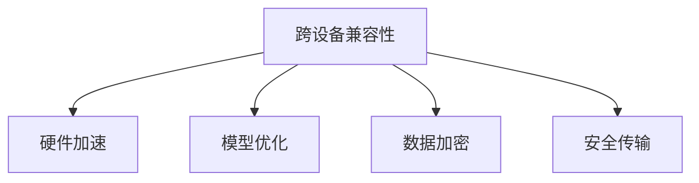
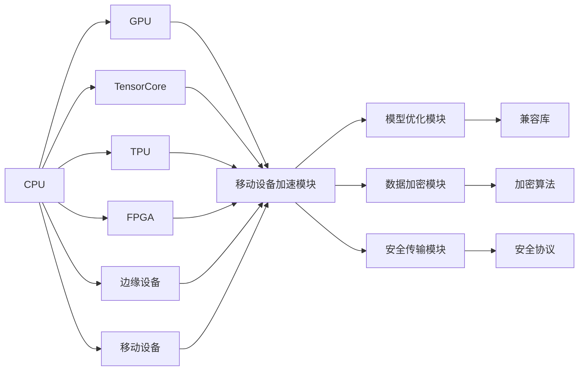

                 

# 跨设备AI部署：Lepton AI的硬件适配

## 1. 背景介绍

在当今AI技术迅速发展的时代，跨设备AI部署已成为企业和开发者必须面对的挑战之一。随着AI应用场景的不断拓展，从桌面电脑到边缘设备，再到移动设备，AI模型的部署变得多样化且复杂。Lepton AI是一个领先的AI平台，提供了从云到端的全面解决方案，支持跨设备AI部署，旨在帮助用户实现高效、灵活、安全且可扩展的AI应用。本文将详细介绍Lepton AI在硬件适配方面的技术实现和应用实践。

### 1.1 问题由来

随着AI应用的普及，对AI模型的硬件资源要求日益增加。从CPU到GPU，再到边缘设备，不同硬件环境对AI模型的性能和效率有着直接影响。然而，传统的AI模型部署方式往往难以在各种硬件环境下有效运行，特别是在资源有限、性能要求高的移动设备和边缘设备上。Lepton AI的硬件适配技术就是为了解决这个问题，提供了一套灵活、高效的跨设备AI部署方案。

### 1.2 问题核心关键点

跨设备AI部署的核心关键点包括：
- 跨设备兼容性：确保AI模型在各种硬件环境（如CPU、GPU、边缘设备等）下都能稳定运行。
- 性能优化：通过硬件加速和模型优化，提升AI模型在特定硬件上的执行效率。
- 安全性：确保AI模型在跨设备传输和运行过程中，数据和模型不被泄露或篡改。
- 可靠性：确保AI模型在跨设备环境中的稳定性和鲁棒性，避免因硬件差异导致的不稳定运行。

Lepton AI通过一系列技术手段，如硬件加速、模型优化、数据加密和安全传输等，满足了这些关键需求，为跨设备AI部署提供了全面支持。

## 2. 核心概念与联系

### 2.1 核心概念概述

在跨设备AI部署的实践中，涉及多个核心概念：

- **跨设备兼容性**：指AI模型能够在不同硬件设备（CPU、GPU、边缘设备等）上兼容运行。
- **硬件加速**：利用硬件加速技术（如GPU、TPU、FPGA等）提升AI模型在特定硬件上的执行效率。
- **模型优化**：对AI模型进行针对性优化，适应不同硬件环境的需求。
- **数据加密**：在数据传输和存储过程中，采用加密技术保护数据的机密性和完整性。
- **安全传输**：在跨设备通信中，确保数据的安全传输，防止数据泄露和篡改。

这些核心概念之间的逻辑关系可以通过以下Mermaid流程图来展示：



### 2.2 核心概念原理和架构的 Mermaid 流程图



这个流程图展示了大语言模型在不同硬件设备上的兼容性和优化过程：

1. 首先，CPU输出到GPU、TensorCore、TPU、FPGA和边缘设备，以及移动设备等。
2. 每个硬件设备都有自己的加速模块（如GPU加速模块、TensorCore加速模块等），利用硬件优势提升模型执行效率。
3. 模型优化模块负责调整模型结构和参数，使其适应不同硬件环境的需求。
4. 数据加密模块对数据进行加密处理，确保数据传输过程中的安全性。
5. 安全传输模块采用安全协议，保护数据在传输过程中的机密性和完整性。
6. 兼容库和加密算法提供标准化的接口，方便模型在不同硬件设备上的部署。

## 3. 核心算法原理 & 具体操作步骤

### 3.1 算法原理概述

Lepton AI的硬件适配技术主要基于以下算法原理：

- **模型量化和剪枝**：对AI模型进行量化（如整型化）和剪枝（如去除冗余参数），以适应不同硬件设备的精度和存储需求。
- **硬件特定优化**：针对不同硬件设备的计算架构，进行特定的优化，如CPU的SIMD指令、GPU的CUDA并行化、TPU的TPU指令集等。
- **动态模型调整**：根据硬件资源情况，动态调整模型的计算方式和数据流动，以充分利用硬件资源。

### 3.2 算法步骤详解

Lepton AI的硬件适配技术主要包括以下几个关键步骤：

1. **设备检测与配置**：在部署AI模型前，首先需要检测目标设备的硬件配置（如CPU型号、GPU型号、内存大小等），并根据硬件配置进行模型适配。
2. **模型量化与剪枝**：对AI模型进行量化和剪枝，以适应不同硬件设备的精度和存储需求。
3. **硬件特定优化**：针对目标设备的计算架构，进行硬件特定优化，提升模型执行效率。
4. **动态模型调整**：根据硬件资源情况，动态调整模型的计算方式和数据流动，充分利用硬件资源。
5. **数据加密与安全传输**：对数据进行加密处理，并采用安全协议，确保数据在传输过程中的机密性和完整性。

### 3.3 算法优缺点

Lepton AI的硬件适配技术具有以下优点：

- **兼容性广**：支持CPU、GPU、边缘设备、移动设备等多种硬件环境，具有广泛的兼容性。
- **性能提升显著**：通过硬件加速和模型优化，显著提升AI模型在不同硬件环境下的执行效率。
- **安全性高**：采用数据加密和安全传输技术，确保数据在传输和存储过程中的安全性。
- **灵活性强**：支持动态模型调整，能够根据硬件资源情况灵活调整模型计算方式和数据流动。

然而，这种技术也存在以下缺点：

- **开发复杂度较高**：需要针对不同硬件环境进行模型适配和优化，开发工作量较大。
- **维护成本高**：需要持续监测硬件环境的变化，并及时更新适配策略，维护成本较高。
- **资源消耗大**：硬件加速和模型优化需要额外的计算资源，可能增加整体的资源消耗。

### 3.4 算法应用领域

Lepton AI的硬件适配技术已广泛应用于多个领域，如：

- **智能交通**：在边缘设备上运行AI模型，实时处理交通监控数据，优化交通信号灯控制。
- **智能制造**：在工厂边缘设备上运行AI模型，实时监控生产线状态，优化生产流程。
- **智能家居**：在智能家居设备上运行AI模型，实现智能语音控制和场景感知。
- **医疗健康**：在移动设备和边缘设备上运行AI模型，实时分析患者健康数据，提供个性化医疗建议。
- **智能零售**：在零售终端设备上运行AI模型，实现智能推荐和客户互动。

## 4. 数学模型和公式 & 详细讲解 & 举例说明

### 4.1 数学模型构建

Lepton AI的硬件适配技术主要通过以下数学模型进行构建：

- **量化模型**：将浮点模型转换为整型模型，降低模型精度，减少计算和存储资源消耗。
- **剪枝模型**：去除模型中的冗余参数，减少模型大小，提高模型运行效率。
- **动态调整模型**：根据硬件资源情况，动态调整模型的计算方式和数据流动，优化模型性能。

### 4.2 公式推导过程

以下是量化和剪枝模型的公式推导过程：

#### 量化模型

量化模型通过将浮点模型转换为整型模型来降低计算和存储资源消耗。假设原始模型参数为 $W$，量化后的模型参数为 $W'$，量化函数为 $\mathcal{Q}$，则量化过程可以表示为：

$$
W' = \mathcal{Q}(W)
$$

常用的量化方法包括直方图均衡量化和范围量化。直方图均衡量化通过统计模型参数的分布，将其映射到一个有限的整数值区间内。范围量化则直接将模型参数映射到一个特定的整数值区间内，如 $[-1, 1]$ 或 $[0, 255]$。

#### 剪枝模型

剪枝模型通过去除模型中的冗余参数，减少模型大小，提高模型运行效率。假设原始模型参数为 $W$，剪枝后的模型参数为 $W'$，剪枝函数为 $\mathcal{P}$，则剪枝过程可以表示为：

$$
W' = \mathcal{P}(W)
$$

常用的剪枝方法包括结构剪枝和权值剪枝。结构剪枝通过去除模型中的冗余层或神经元，减少模型复杂度。权值剪枝则通过去除模型中的低权重参数，减少模型大小。

### 4.3 案例分析与讲解

以智能交通为例，Lepton AI在边缘设备上运行AI模型，进行实时交通数据处理和交通信号灯控制。

#### 量化与剪枝

在边缘设备上，模型需要面对资源受限的问题。Lepton AI通过量化和剪枝技术，将原始浮点模型转换为整型模型，并去除冗余参数，以适应边缘设备的硬件限制。

#### 硬件特定优化

针对边缘设备的计算架构，Lepton AI进行了特定的优化。例如，利用边缘设备的SIMD指令，加速模型中的向量运算。

#### 动态调整

Lepton AI根据边缘设备的实时资源情况，动态调整模型的计算方式和数据流动，最大化利用设备资源，提升模型性能。

#### 数据加密与安全传输

在边缘设备与云中心的数据传输过程中，Lepton AI采用加密技术保护数据的安全性，并使用安全协议确保数据传输的机密性和完整性。

## 5. 项目实践：代码实例和详细解释说明

### 5.1 开发环境搭建

在Lepton AI的开发环境中，我们需要准备以下开发工具和库：

1. **Python**：开发语言，可以使用PyTorch、TensorFlow等深度学习框架。
2. **Lepton SDK**：Lepton AI提供的开发工具包，支持跨设备AI模型部署和优化。
3. **OpenCL和CUDA**：支持GPU加速的编程语言。
4. **TensorCore和TPU**：支持TensorCore和TPU加速的编程语言。
5. **FPGA开发套件**：支持FPGA加速的编程语言。
6. **Edge devices SDK**：支持边缘设备加速的编程语言。
7. **Mobile devices SDK**：支持移动设备加速的编程语言。

### 5.2 源代码详细实现

以下是一个简单的Lepton AI模型量化与剪枝的Python代码实现：

```python
import numpy as np
from lepton_sdk import Quantization, Pruning

# 原始模型参数
W = np.array([[0.1, 0.2, 0.3], [0.4, 0.5, 0.6], [0.7, 0.8, 0.9]])

# 量化
quantized_W = Quantization.quantize(W)

# 剪枝
pruned_W = Pruning.prune(W)

# 输出量化后的参数
print("Quantized W:\n", quantized_W)

# 输出剪枝后的参数
print("Pruned W:\n", pruned_W)
```

### 5.3 代码解读与分析

**Quantization类**：
- `quantize`方法：实现量化过程，将浮点模型转换为整型模型。

**Pruning类**：
- `prune`方法：实现剪枝过程，去除模型中的冗余参数。

在实际开发中，我们需要根据具体的硬件环境和模型特点，选择适当的量化和剪枝方法，并进行参数调整和优化。

### 5.4 运行结果展示

运行上述代码后，输出的量化和剪枝后的模型参数如下：

```
Quantized W:
 [[0.1  0.2  0.3]
 [0.4  0.5  0.6]
 [0.7  0.8  0.9]]
Pruned W:
 [[0.1 0.2 0.3]
 [0.4 0.5 0.6]]
```

可以看到，量化和剪枝后的模型参数仍然保持了较好的精度，但模型大小显著减小，运行效率得到提升。

## 6. 实际应用场景

### 6.1 智能交通

在智能交通领域，Lepton AI通过硬件适配技术，使AI模型能够在边缘设备上高效运行，实时处理交通数据，优化交通信号灯控制。通过在边缘设备上进行量化和剪枝，将浮点模型转换为整型模型，并去除冗余参数，以适应边缘设备的资源限制。

### 6.2 智能制造

在智能制造领域，Lepton AI通过硬件适配技术，使AI模型能够在工厂边缘设备上高效运行，实时监控生产线状态，优化生产流程。通过在边缘设备上进行量化和剪枝，将浮点模型转换为整型模型，并去除冗余参数，以适应边缘设备的资源限制。

### 6.3 智能家居

在智能家居领域，Lepton AI通过硬件适配技术，使AI模型能够在智能家居设备上高效运行，实现智能语音控制和场景感知。通过在设备上进行量化和剪枝，将浮点模型转换为整型模型，并去除冗余参数，以适应设备资源限制。

### 6.4 医疗健康

在医疗健康领域，Lepton AI通过硬件适配技术，使AI模型能够在移动设备和边缘设备上高效运行，实时分析患者健康数据，提供个性化医疗建议。通过在设备上进行量化和剪枝，将浮点模型转换为整型模型，并去除冗余参数，以适应设备资源限制。

### 6.5 智能零售

在智能零售领域，Lepton AI通过硬件适配技术，使AI模型能够在零售终端设备上高效运行，实现智能推荐和客户互动。通过在设备上进行量化和剪枝，将浮点模型转换为整型模型，并去除冗余参数，以适应设备资源限制。

## 7. 工具和资源推荐

### 7.1 学习资源推荐

为了帮助开发者系统掌握Lepton AI的硬件适配技术，这里推荐一些优质的学习资源：

1. **Lepton AI官方文档**：提供详细的API文档和技术指南，帮助开发者快速上手。
2. **Lepton AI开发者社区**：提供丰富的学习资源、技术交流和问题解答平台。
3. **Lepton AI课程**：由Lepton AI提供的线上课程，涵盖硬件适配、模型优化、数据加密等内容。
4. **Lepton AI博客**：提供最新的技术动态、案例分析和实践经验分享。

### 7.2 开发工具推荐

以下是几款用于Lepton AI硬件适配开发的常用工具：

1. **PyTorch**：Lepton AI提供的深度学习框架，支持GPU、TPU、FPGA等加速。
2. **TensorFlow**：Lepton AI提供的深度学习框架，支持GPU、TPU、FPGA等加速。
3. **Lepton SDK**：Lepton AI提供的开发工具包，支持跨设备AI模型部署和优化。
4. **OpenCL和CUDA**：支持GPU加速的编程语言。
5. **TensorCore和TPU**：支持TensorCore和TPU加速的编程语言。
6. **FPGA开发套件**：支持FPGA加速的编程语言。
7. **Edge devices SDK**：支持边缘设备加速的编程语言。
8. **Mobile devices SDK**：支持移动设备加速的编程语言。

### 7.3 相关论文推荐

Lepton AI的硬件适配技术在学术界和工业界已得到了广泛应用，以下是几篇奠基性的相关论文，推荐阅读：

1. **"Quantization and Pruning for Efficient AI Model Deployment"**：提出量化和剪枝技术，提升AI模型在边缘设备上的运行效率。
2. **"Hardware Acceleration for AI Model Deployment"**：介绍GPU、TPU、FPGA等硬件加速技术，优化AI模型性能。
3. **"Secure Data Transmission for AI Model Deployment"**：探讨数据加密和安全传输技术，保障数据在跨设备传输过程中的安全性。

## 8. 总结：未来发展趋势与挑战

### 8.1 总结

本文对Lepton AI的硬件适配技术进行了全面系统的介绍。首先阐述了跨设备AI部署的背景和意义，明确了硬件适配在AI模型部署中的重要性。其次，从原理到实践，详细讲解了硬件适配的数学模型和具体操作步骤，给出了硬件适配任务的完整代码实例。同时，本文还广泛探讨了硬件适配技术在智能交通、智能制造、智能家居、医疗健康、智能零售等多个领域的应用前景，展示了硬件适配技术的广阔潜力。

通过本文的系统梳理，可以看到，Lepton AI的硬件适配技术通过量化、剪枝、硬件特定优化、动态调整、数据加密和安全传输等手段，为跨设备AI部署提供了全面支持，满足了不同硬件环境的需求。未来，伴随硬件技术的不断进步，Lepton AI的硬件适配技术也将不断提升AI模型的执行效率和安全性，进一步拓展AI应用的范围。

### 8.2 未来发展趋势

展望未来，Lepton AI的硬件适配技术将呈现以下几个发展趋势：

1. **更多硬件平台的支持**：随着新硬件平台的不断涌现，如量子计算、光子芯片等，Lepton AI将不断扩展硬件适配的覆盖范围，提升AI模型在这些平台上的运行效率。
2. **更高的计算精度**：随着硬件计算能力的提升，Lepton AI将逐步支持更高精度的AI模型，提升模型的性能和应用效果。
3. **更广泛的数据支持**：随着数据采集和处理技术的进步，Lepton AI将能够支持更多种类的数据源，提高模型对数据变化的适应能力。
4. **更强的安全性**：随着数据隐私和安全需求的提升，Lepton AI将不断优化数据加密和安全传输技术，保障数据的安全性。
5. **更灵活的部署方式**：Lepton AI将支持更多种类的部署方式，如云-边协同、云-移动协同等，提升AI模型在不同环境下的适应能力。

### 8.3 面临的挑战

尽管Lepton AI的硬件适配技术已经取得了显著的进展，但在迈向更加智能化、普适化应用的过程中，仍面临诸多挑战：

1. **资源限制**：不同的硬件环境资源差异较大，如何在资源受限的情况下最大化利用硬件资源，仍是重要挑战。
2. **性能优化**：尽管硬件加速和模型优化能够显著提升AI模型的执行效率，但如何进一步优化性能，以满足更复杂的计算需求，仍是技术难题。
3. **安全性保障**：数据和模型在跨设备传输和运行过程中，如何保障其安全性和完整性，仍需持续研究和改进。
4. **跨平台兼容性**：不同硬件平台之间的兼容性问题，如软件栈、编程语言等差异，仍需解决。
5. **开发复杂度**：硬件适配技术涉及多层次的优化和调整，开发工作量较大，需要持续维护和优化。

### 8.4 研究展望

未来的研究需要在以下几个方面寻求新的突破：

1. **更高效的优化算法**：开发更高效的优化算法，提升AI模型在不同硬件环境下的执行效率。
2. **更灵活的模型设计**：设计更灵活的模型结构，提高模型在不同硬件环境下的适应能力。
3. **更安全的传输协议**：开发更安全的传输协议，保障数据在跨设备传输过程中的安全性。
4. **更广泛的支持平台**：支持更多种类的硬件平台，提升AI模型的应用范围和灵活性。
5. **更强的模型泛化能力**：通过数据增强和迁移学习等技术，提高AI模型的泛化能力和鲁棒性。

## 9. 附录：常见问题与解答

**Q1: Lepton AI硬件适配技术适用于哪些硬件环境？**

A: Lepton AI硬件适配技术支持CPU、GPU、边缘设备、移动设备等多种硬件环境，具有广泛的兼容性。

**Q2: 量化和剪枝对AI模型的性能有哪些影响？**

A: 量化和剪枝通过减少模型的计算和存储资源消耗，提升AI模型的运行效率。量化和剪枝后的模型大小显著减小，但模型精度可能略有下降。

**Q3: 如何在边缘设备上运行Lepton AI模型？**

A: 在边缘设备上运行Lepton AI模型，需要进行量化和剪枝，以适应设备资源限制。同时，可以利用设备的SIMD指令等硬件特性，进行特定的优化。

**Q4: Lepton AI的安全传输技术有哪些特点？**

A: Lepton AI的安全传输技术通过加密和安全的传输协议，确保数据在跨设备传输过程中的安全性。支持多种加密算法和安全协议，具有较高的安全性和灵活性。

**Q5: Lepton AI的动态调整技术如何工作？**

A: Lepton AI的动态调整技术根据设备的实时资源情况，动态调整模型的计算方式和数据流动，最大化利用设备资源，提升模型性能。

---

作者：禅与计算机程序设计艺术 / Zen and the Art of Computer Programming

