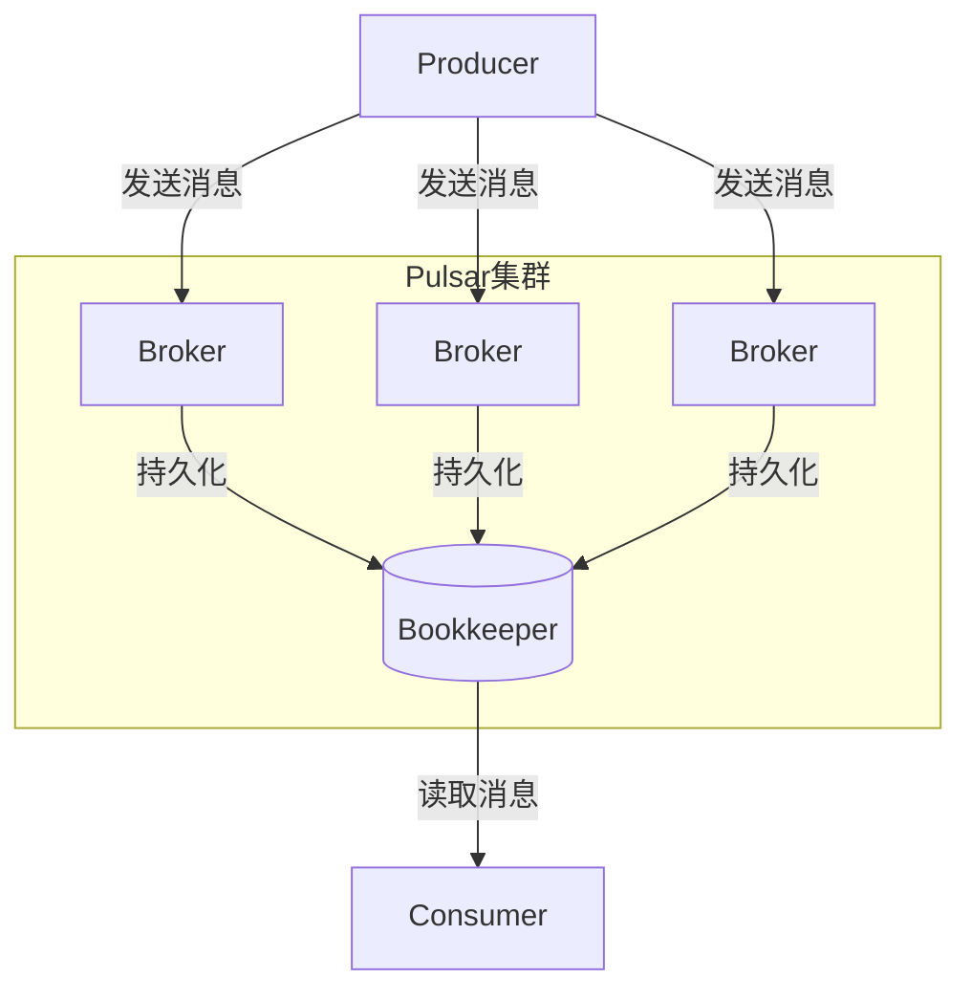

# Pulsar Producer原理与代码实例讲解

## 1. 背景介绍

### 1.1 问题的由来

在现代分布式系统中，可靠的消息传递机制是确保数据传输的关键。传统的消息队列系统如RabbitMQ和Kafka在某些场景下存在可靠性、性能和扩展性方面的挑战。Apache Pulsar作为新一代分布式消息队列系统应运而生,它旨在解决传统消息队列在高吞吐量、持久性和跨数据中心复制等方面的限制。

### 1.2 研究现状

Apache Pulsar是一个云原生、分布式的消息队列系统,由Yahoo开源并捐赠给Apache软件基金会。它采用了分层存储架构,支持多租户、多集群部署,并提供了多种消息模型。Pulsar的设计目标是为大规模消息传递提供高度可扩展、持久化的解决方案。

### 1.3 研究意义

作为消息队列系统的生产者(Producer),其设计和实现直接影响到整个系统的可靠性和性能。深入理解Pulsar Producer的原理和实现细节,对于开发人员构建高性能、可靠的分布式应用程序至关重要。本文将全面探讨Pulsar Producer的工作原理、核心算法、数学模型以及代码实现,为读者提供宝贵的理论和实践指导。

### 1.4 本文结构

本文将从以下几个方面全面剖析Pulsar Producer:

1. 核心概念与联系
2. 核心算法原理与具体操作步骤
3. 数学模型和公式详细讲解与案例分析
4. 项目实践:代码实例和详细解释说明
5. 实际应用场景
6. 工具和资源推荐
7. 总结:未来发展趋势与挑战
8. 附录:常见问题与解答

## 2. 核心概念与联系

在深入探讨Pulsar Producer之前,我们需要先了解一些核心概念:

1. **Topic(主题)**: Pulsar中的消息队列,生产者向Topic发送消息,消费者从Topic消费消息。
2. **Partition(分区)**: Topic可以被分为多个Partition,每个Partition是一个FIFO(先进先出)队列。
3. **Message(消息)**: 生产者发送给Pulsar的基本数据单元,可以携带任意数据。
4. **Producer(生产者)**: 向Pulsar发送消息的客户端。
5. **Consumer(消费者)**: 从Pulsar消费消息的客户端。
6. **Broker(代理)**: Pulsar集群中的消息处理节点。

Pulsar Producer的核心作用是将消息可靠地发送到指定的Topic。它需要与Broker协调,选择合适的Partition,并将消息持久化到Bookkeeper中。下图展示了Pulsar Producer在整个系统中的位置:



## 3. 核心算法原理 & 具体操作步骤

### 3.1 算法原理概述

Pulsar Producer的核心算法包括以下几个主要步骤:

1. **Partition选择**: 根据消息路由策略选择合适的Partition。
2. **消息批处理**: 将多条消息合并为一个批次,提高吞吐量。
3. **消息压缩**: 对消息进行压缩,减小网络传输开销。
4. **消息持久化**: 将消息持久化到Bookkeeper中,确保消息不丢失。
5. **流控与重试**: 根据Broker的反馈,进行流量控制和重试机制。

### 3.2 算法步骤详解

1. **Partition选择**

   Pulsar Producer需要根据消息路由策略选择合适的Partition。常见的路由策略包括:

   - `SinglePartition`: 所有消息发送到同一个Partition。
   - `RoundRobinPartition`: 消息按照轮询方式均匀分布到不同的Partition。
   - `KeyBasedPartition`: 根据消息键(Key)的哈希值映射到特定的Partition。

   选择合适的路由策略可以提高消息的分布均匀性,避免热点问题。

2. **消息批处理**

   为了提高吞吐量,Pulsar Producer会将多条消息合并为一个批次进行发送。批处理的好处包括:

   - 减少网络传输开销
   - 降低Broker的处理压力
   - 提高消息持久化效率

   批处理策略需要权衡吞吐量和延迟,通常会设置一个批次大小阈值和延迟阈值。

3. **消息压缩**

   为了进一步降低网络传输开销,Pulsar Producer支持对消息进行压缩。常用的压缩算法包括GZIP、LZ4和ZStd等。压缩可以显著减小消息体积,但也会增加CPU开销。

4. **消息持久化**

   Pulsar采用了分层存储架构,消息首先会被持久化到Bookkeeper中。Bookkeeper是一个开源的分布式写入ahead日志(WAL)系统,能够提供高可用和持久性保证。

   持久化过程如下:

   1) Producer将消息发送到Broker
   2) Broker将消息写入本地内存队列
   3) Broker将消息持久化到Bookkeeper
   4) Bookkeeper将消息复制到其他节点,形成副本
   5) Broker确认消息已持久化,通知Producer

5. **流控与重试**

   为了防止Producer过载Broker,Pulsar采用了基于令牌桶算法的流量控制机制。每个Producer都有一个令牌桶,发送消息时需要从桶中获取令牌。如果桶中没有足够的令牌,Producer将被阻塞或进行重试。

   重试机制可以提高消息的可靠性,但也会增加延迟和开销。Pulsar允许配置重试次数、重试间隔等参数,以平衡可靠性和性能。

### 3.3 算法优缺点

Pulsar Producer算法的优点包括:

- 支持消息批处理和压缩,提高吞吐量和网络效率
- 采用分层存储架构,消息持久化到Bookkeeper中,确保高可用和持久性
- 流量控制和重试机制,保证可靠性和防止过载

缺点包括:

- 批处理和压缩会增加CPU开销
- 持久化到Bookkeeper会增加一定的延迟
- 流量控制和重试机制会影响延迟和吞吐量

### 3.4 算法应用领域

Pulsar Producer算法适用于以下场景:

- 需要高吞吐量、低延迟的消息队列系统
- 对消息持久性和可靠性有较高要求的分布式系统
- 需要跨数据中心复制消息的大规模系统
- 支持多租户、多集群部署的云环境

## 4. 数学模型和公式 & 详细讲解 & 举例说明

### 4.1 数学模型构建

为了量化分析Pulsar Producer的性能,我们构建了一个数学模型。假设:

- Producer每秒发送 $\lambda$ 条消息
- 每条消息的平均大小为 $m$ 字节
- 消息批处理的平均批次大小为 $b$
- 消息压缩的平均压缩率为 $c$
- 网络带宽为 $B$ 字节/秒
- Bookkeeper写入延迟为 $d$ 秒

则Producer的吞吐量 $T$ (条/秒)可以表示为:

$$T = \min\left(\lambda, \frac{B}{m \times (1 - c) \times b}\right)$$

Producer的平均延迟 $L$ (秒)可以表示为:

$$L = \frac{1}{\mu} + d + \frac{b}{\lambda}$$

其中 $\mu$ 为Producer的服务率,即Producer每秒可以发送的最大消息条数。

### 4.2 公式推导过程

1. 吞吐量公式推导

Producer的吞吐量受限于两个因素:

- 消息发送速率 $\lambda$
- 网络带宽 $B$

在不考虑网络带宽限制的情况下,吞吐量为 $\lambda$。

考虑网络带宽限制时,每秒最多可以发送 $\frac{B}{m \times (1 - c) \times b}$ 条消息,其中:

- $m$ 为消息平均大小
- $(1 - c)$ 为消息未压缩的比例
- $b$ 为批处理的平均批次大小

取两者的最小值即为吞吐量上限。

2. 延迟公式推导

Producer的平均延迟由三部分组成:

- $\frac{1}{\mu}$ 为Producer的服务时间
- $d$ 为Bookkeeper的写入延迟
- $\frac{b}{\lambda}$ 为批处理导致的延迟

其中,服务时间 $\frac{1}{\mu}$ 取决于Producer的服务率 $\mu$,即Producer每秒可以发送的最大消息条数。

批处理延迟 $\frac{b}{\lambda}$ 是因为需要等待足够的消息填充批次,延迟与批次大小 $b$ 和消息发送速率 $\lambda$ 有关。

### 4.3 案例分析与讲解

假设有以下参数:

- 消息发送速率 $\lambda = 100,000$ 条/秒
- 消息平均大小 $m = 1$ KB
- 批处理平均批次大小 $b = 1,000$
- 消息压缩率 $c = 0.6$
- 网络带宽 $B = 100$ MB/秒
- Bookkeeper写入延迟 $d = 10$ 毫秒

计算吞吐量:

$$T = \min\left(100,000, \frac{100 \times 10^6}{1,000 \times (1 - 0.6) \times 1,000}\right) = 100,000\ \text{条/秒}$$

计算延迟:

$$L = \frac{1}{100,000} + 0.01 + \frac{1,000}{100,000} = 0.02\ \text{秒}$$

可以看出,在这种配置下,Producer的吞吐量达到了理论上限 100,000 条/秒,平均延迟为 20 毫秒。

如果将批处理大小 $b$ 增加到 10,000,延迟将变为:

$$L = \frac{1}{100,000} + 0.01 + \frac{10,000}{100,000} = 0.11\ \text{秒}$$

延迟增加到 110 毫秒,但吞吐量保持不变。

这说明,通过调整批处理大小,可以在吞吐量和延迟之间进行权衡。

### 4.4 常见问题解答

1. **为什么要进行消息批处理?**

   消息批处理可以减少网络传输开销和Broker的处理压力,从而提高吞吐量。但批处理也会增加延迟,需要权衡吞吐量和延迟。

2. **为什么要进行消息压缩?**

   消息压缩可以减小网络传输的数据量,降低带宽占用。但压缩会增加CPU开销,需要权衡带宽和CPU资源。

3. **为什么要使用Bookkeeper进行消息持久化?**

   Bookkeeper是一个分布式的写入ahead日志(WAL)系统,能够提供高可用和持久性保证。相比于直接将消息持久化到磁盘,Bookkeeper具有更好的伸缩性和容错能力。

4. **如何选择合适的消息路由策略?**

   消息路由策略的选择取决于应用场景和需求。如果消息顺序非常重要,可以选择`SinglePartition`策略;如果需要提高并行度,可以选择`RoundRobinPartition`或`KeyBasedPartition`策略。

## 5. 项目实践:代码实例和详细解释说明

### 5.1 开发环境搭建

在开始编写Pulsar Producer代码之前,我们需要先搭建开发环境。以下是搭建步骤:

1. 安装Java 8或更高版本
2. 下载Pulsar的二进制发行版,解压缩
3. 启动Pulsar standalone集群:

```bash
bin/pulsar standalone
```

4. 在您的Java项目中添加Pulsar客户端依赖:

```xml
<dependency>
    <groupId>org.apache.pulsar</groupId>
    <artifactId>pulsar-client</artifactId>
    <version>2.10.1</version>
</dependency>
```

###