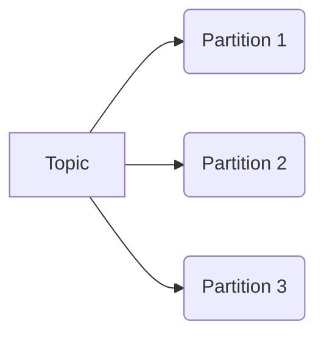
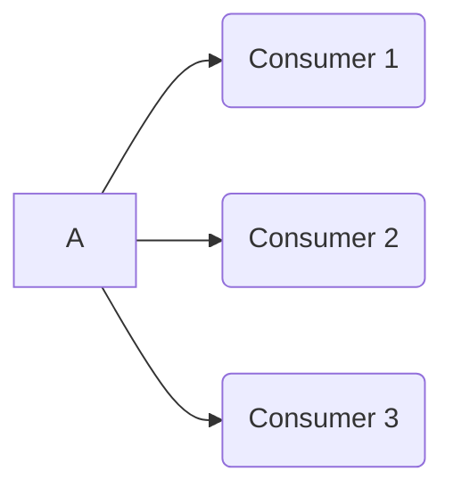
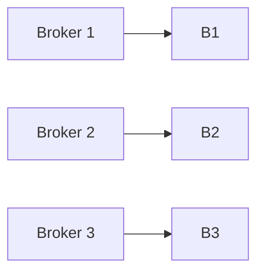
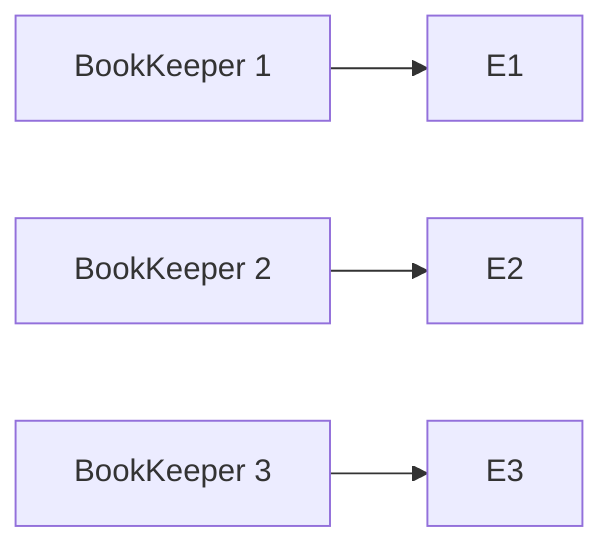
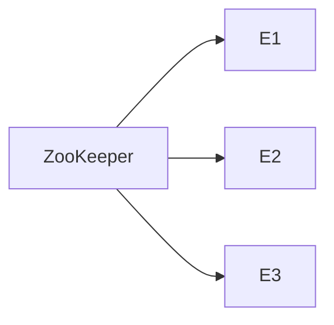
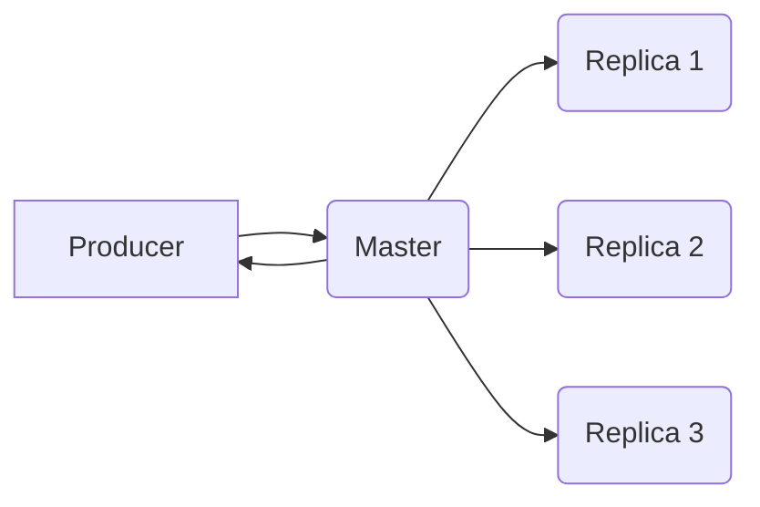
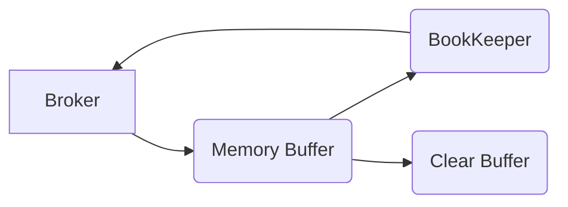

# Pulsar原理与代码实例讲解

## 1. 背景介绍

### 1.1 问题的由来

在当今大数据时代，实时处理海量数据流成为了一个迫切的需求。传统的消息队列系统如Apache Kafka、RabbitMQ等在处理高吞吐量、低延迟的场景时存在一些限制。为了解决这一问题,Apache Pulsar应运而生。

作为一个云原生的分布式消息流处理平台,Pulsar旨在提供无限制的流存储,以及可扩展的高性能流分析功能。它能够满足各种规模的数据处理需求,从简单的消息队列到大规模的实时数据流处理。

### 1.2 研究现状

Apache Pulsar最初由Yahoo开发,后于2018年捐赠给Apache软件基金会,成为了Apache顶级项目。目前,Pulsar已被许多知名公司广泛使用,如Salesforce、Comcast、Yahoo、Verizon等。

与传统消息队列相比,Pulsar具有以下优势:

- 无限制的持久化消息存储
- 水平扩展能力强
- 多租户支持
- 统一的流处理管道

### 1.3 研究意义

深入理解Pulsar的原理和实现对于构建高性能、可靠的实时数据处理系统至关重要。本文将全面剖析Pulsar的核心概念、算法原理、数学模型,并通过代码实例讲解其实现细节,为读者提供一个深入学习Pulsar的机会。

### 1.4 本文结构

本文将从以下几个方面全面介绍Pulsar:

1. 核心概念与联系
2. 核心算法原理与具体操作步骤
3. 数学模型和公式详细讲解与举例说明
4. 项目实践:代码实例和详细解释说明
5. 实际应用场景
6. 工具和资源推荐
7. 总结:未来发展趋势与挑战
8. 附录:常见问题与解答

## 2. 核心概念与联系

为了更好地理解Pulsar,我们首先需要了解它的一些核心概念。

### 2.1 Topic

Topic是Pulsar中的逻辑数据通道,用于发布和订阅消息。每个Topic由一系列的分区(Partition)组成,分区是Topic的基本存储单元。



### 2.2 Producer

Producer是向Topic发送消息的客户端。Pulsar采用分区发送策略,Producer根据消息的路由键(Routing Key)将消息发送到对应的分区。


### 2.3 Consumer

Consumer是从Topic订阅并消费消息的客户端。Pulsar支持独占订阅(Exclusive Subscription)和共享订阅(Shared Subscription)两种模式。



### 2.4 Broker

Broker是Pulsar集群的基本单元,负责存储和分发消息。每个Broker节点管理一组Topic分区。



### 2.5 BookKeeper

BookKeeper是Pulsar的持久化存储组件,用于存储Topic分区的消息数据。它采用了分布式写入ahead日志(WAL)的架构,能够提供高吞吐、低延迟的持久化存储。



### 2.6 ZooKeeper

ZooKeeper是Pulsar集群的元数据和配置管理中心。它维护了Topic的元数据信息、Broker集群的状态等。



## 3. 核心算法原理 & 具体操作步骤

### 3.1 算法原理概述

Pulsar的核心算法包括消息路由、复制、持久化存储等多个方面。

#### 消息路由

Pulsar采用一致性哈希(Consistent Hashing)算法将消息路由到特定的分区。该算法能够有效地实现负载均衡,并在Broker节点发生变化时最小化分区的重新分配。

#### 复制

为了保证消息的可靠性,Pulsar采用了主从复制(Master-Slave Replication)机制。每个分区都有一个主节点和多个从节点,主节点负责处理写入操作,从节点则定期从主节点复制数据。

#### 持久化存储

Pulsar利用BookKeeper作为持久化存储引擎。BookKeeper采用了分布式写入ahead日志(WAL)的架构,能够提供高吞吐、低延迟的持久化存储。

### 3.2 算法步骤详解

#### 消息路由

1. 计算消息的哈希值:Pulsar使用消息的路由键(Routing Key)计算一个哈希值。
2. 映射到虚拟节点:将哈希值映射到一个虚拟节点环上。
3. 选择最近的真实节点:在虚拟节点环上找到最近的真实Broker节点。
4. 发送消息:将消息发送到选定的Broker节点上的对应分区。


#### 复制

1. 选举主节点:每个分区的Broker节点通过Zab协议选举出一个主节点。
2. 写入主节点:Producer将消息写入主节点。
3. 复制到从节点:主节点将消息复制到从节点。
4. 确认写入:主节点在大多数从节点复制完成后,向Producer确认写入成功。



#### 持久化存储

1. 写入内存缓冲区:Broker将消息先写入内存缓冲区。
2. 持久化到BookKeeper:Broker定期将内存缓冲区中的消息持久化到BookKeeper。
3. 确认写入:BookKeeper在写入成功后,向Broker确认。
4. 清理内存缓冲区:Broker清理已持久化的消息。



### 3.3 算法优缺点

#### 优点

- 高吞吐、低延迟:分布式架构和高效的持久化存储能力。
- 可扩展性强:可以通过添加更多Broker节点来水平扩展。
- 高可用性:复制机制和自动故障转移能够提供高可用性。
- 多租户支持:能够隔离不同租户的资源,提供安全性和隔离性。

#### 缺点

- 复杂的架构:分布式系统带来了一定的复杂性。
- 资源消耗较高:需要消耗较多的内存和磁盘空间。
- 运维成本较高:需要对大规模分布式集群进行运维。

### 3.4 算法应用领域

Pulsar的核心算法适用于以下场景:

- 实时数据处理:能够高效地处理海量实时数据流。
- 消息队列:可作为高性能、可靠的消息队列使用。
- 物联网:适合处理来自大量设备的实时数据流。
- 日志收集:可用于收集和处理大规模的日志数据。

## 4. 数学模型和公式 & 详细讲解 & 举例说明

### 4.1 数学模型构建

为了更好地理解Pulsar的一致性哈希算法,我们需要构建一个数学模型。

假设有一个哈希环,其范围为[0, 2^32)。我们将消息的路由键哈希到这个环上,同时也将Broker节点哈希到这个环上,每个Broker节点对应多个虚拟节点。

对于一个消息,我们需要找到在哈希环上顺时针方向最近的Broker节点,将消息路由到该节点上的对应分区。

设:

- $N$为Broker节点的数量
- $n$为每个Broker节点对应的虚拟节点数量
- $K$为消息的路由键
- $h(x)$为哈希函数,将$x$映射到[0, 2^32)范围内
- $node(i, j)$表示第$i$个Broker节点的第$j$个虚拟节点
- $partition(i, j)$表示第$i$个Broker节点的第$j$个分区

则:

$$node(i, j) = h(str(i) + str(j))$$
$$partition(i, j) = node(i, j) \bmod n$$

我们需要找到满足以下条件的$node(i, j)$:

$$\forall k \in [0, N), \forall l \in [0, n), h(K) - node(i, j) \leq h(K) - node(k, l)$$

### 4.2 公式推导过程

现在,我们来推导一下如何找到满足上述条件的$node(i, j)$。

首先,我们定义一个函数$f(x)$,表示从$x$顺时针遍历哈希环,找到的第一个虚拟节点:

$$f(x) = \min\limits_{i \in [0, N), j \in [0, n)}\{node(i, j) | node(i, j) \geq x\}$$

则我们需要找到的$node(i, j)$就是$f(h(K))$。

为了高效地计算$f(x)$,我们可以构建一个有序列表$L$,其中包含所有虚拟节点:

$$L = \{node(i, j) | i \in [0, N), j \in [0, n)\}$$
$$L = sort(L)$$

则:

$$f(x) = L[upper\_bound(L, x)]$$

其中$upper\_bound(L, x)$表示在有序列表$L$中找到第一个大于等于$x$的元素的下标。

这样,我们就可以通过二分查找的方式,在$O(\log(Nn))$的时间复杂度内找到$f(h(K))$,从而确定消息应该路由到哪个分区。

### 4.3 案例分析与讲解

假设我们有3个Broker节点,每个节点对应4个虚拟节点,即$N=3, n=4$。

首先,我们计算出所有虚拟节点:

```
node(0, 0) = h("00") = 12
node(0, 1) = h("01") = 25
node(0, 2) = h("02") = 37
node(0, 3) = h("03") = 49

node(1, 0) = h("10") = 61
node(1, 1) = h("11") = 73
node(1, 2) = h("12") = 85
node(1, 3) = h("13") = 97

node(2, 0) = h("20") = 109
node(2, 1) = h("21") = 121
node(2, 2) = h("22") = 133
node(2, 3) = h("23") = 145
```

构建有序列表$L$:

$$L = [12, 25, 37, 49, 61, 73, 85, 97, 109, 121, 133, 145]$$

现在,假设我们有一个消息,其路由键为"Message1",哈希值为$h("Message1") = 77$。

我们在$L$中查找第一个大于等于77的元素,即$upper\_bound(L, 77) = 6$,对应的虚拟节点为$node(1, 1) = 73$。

因此,这个消息应该路由到第1个Broker节点的第$73 \bmod 4 = 1$个分区。

### 4.4 常见问题解答

**Q: 为什么要使用一致性哈希算法?**

A: 一致性哈希算法能够在Broker节点发生变化时,最小化分区的重新分配,从而提高系统的可用性和稳定性。相比于传统的哈希算法,它能够更好地实现负载均衡。

**Q: 虚拟节点的数量如何选择?**

A: 虚拟节点的数量越多,哈希环上的节点分布就越均匀,负载均衡效果越好。但是,过多的虚拟节点也会增加计算和存储开销。通常情况下,每个Broker节点对应10~100个虚拟节点就足够了。

**Q: 如何处理Broker节点的故障?**

A: Pulsar采用主从复制机制,当