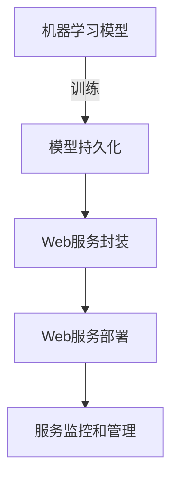

# Python机器学习实战：搭建自己的机器学习Web服务

## 1. 背景介绍

### 1.1 问题的由来

在当今数字时代，机器学习已经成为各行各业不可或缺的核心技术。无论是推荐系统、自然语言处理还是计算机视觉,机器学习无疑都扮演着至关重要的角色。然而,将训练好的机器学习模型部署到生产环境并提供可靠的服务却并非一蹴而就的简单任务。

传统上,机器学习模型通常在本地环境中进行训练和测试,但要将其投入实际使用,就需要将模型部署到服务器或云平台上,并通过API或Web服务的形式对外提供访问。这个过程涉及诸多挑战,例如:

- **环境配置**:本地环境与生产环境的差异可能导致模型无法正常运行。
- **资源管理**:需要合理分配CPU、内存等计算资源,确保服务的高效运行。
- **并发处理**:如何有效处理大量并发请求,避免服务过载崩溃。
- **版本管理**:如何无缝升级模型,实现平滑过渡。
- **监控和日志**:如何监控服务状态,记录错误日志以便故障排查。
- **安全性**:如何保证数据传输和模型的安全性。

### 1.2 研究现状

为了解决上述问题,目前存在多种解决方案和工具。例如使用Docker容器化部署、利用Kubernetes进行容器编排、使用Apache Kafka实现消息队列等。但这些方案往往需要一定的运维经验和基础设施支持,对于个人开发者或小型团队来说,存在一定的门槛。

另一种更加简单直接的方式是利用Python的Web框架,将机器学习模型封装为RESTful API或Web应用,并部署到云服务器或本地服务器上。这种方式相对简单,只需要掌握一些Python Web开发的基础知识,而不需要过多的运维经验。

### 1.3 研究意义

本文将详细介绍如何使用Python构建一个机器学习Web服务,涵盖了从模型训练到Web服务部署的全流程。通过学习本文,读者可以掌握以下技能:

1. 使用Python流行的机器学习库(如scikit-learn、TensorFlow等)训练和评估模型。
2. 将训练好的模型持久化,以便后续加载使用。
3. 使用Python Web框架(如Flask)封装模型,提供RESTful API服务。
4. 使用Nginx反向代理和Gunicorn实现Web服务的高并发支持。
5. 部署Web服务到云服务器(如AWS EC2)或本地服务器上。
6. 使用Supervisor实现Web服务的自动重启和持久运行。
7. 配置HTTPS,保证数据传输的安全性。

掌握了这些技能后,读者就能够为自己的机器学习模型搭建一个高效、可靠、安全的Web服务,为各种应用程序提供动力。

### 1.4 本文结构

本文共分为8个部分:

1. **背景介绍**:阐述问题的由来、研究现状和意义。
2. **核心概念与联系**:介绍机器学习服务化的核心概念及其关系。
3. **核心算法原理与具体操作步骤**:详细解析模型持久化和Web服务化的算法原理和步骤。
4. **数学模型和公式详细讲解与举例说明**:对涉及的数学模型和公式进行推导和案例分析。
5. **项目实践:代码实例和详细解释说明**:提供完整的代码实例,并逐行解释。
6. **实际应用场景**:列举机器学习Web服务的实际应用案例。
7. **工具和资源推荐**:推荐相关的学习资源、开发工具和论文。
8. **总结:未来发展趋势与挑战**:总结研究成果,展望发展趋势和面临的挑战。

## 2. 核心概念与联系

在构建机器学习Web服务的过程中,涉及了以下几个核心概念:



1. **机器学习模型(Machine Learning Model)**: 利用算法和数据训练得到的模型,用于执行预测或决策任务。常见的机器学习模型包括线性回归、逻辑回归、决策树、随机森林、支持向量机、神经网络等。

2. **模型持久化(Model Persistence)**: 将训练好的机器学习模型序列化并存储到文件中,以便后续加载使用。这一步骤确保了模型可以在不同的环境和时间被重复使用,而无需重新训练。

3. **Web服务封装(Web Service Encapsulation)**: 将持久化的机器学习模型封装为RESTful API或Web应用,使其可以通过HTTP协议被访问和调用。这一步骤涉及选择合适的Python Web框架、定义API接口、处理输入输出数据等。

4. **Web服务部署(Web Service Deployment)**: 将封装好的机器学习Web服务部署到生产环境中,例如云服务器或本地服务器。这一步骤需要考虑服务器配置、负载均衡、HTTPS安全性等因素。

5. **服务监控和管理(Service Monitoring and Management)**: 对已部署的机器学习Web服务进行监控和管理,包括监控服务状态、记录日志、自动重启服务、扩展服务实例等,以确保服务的高可用性和可扩展性。

这些核心概念相互关联,构成了从模型训练到Web服务部署的完整流程。只有将所有环节无缝衔接,才能够为机器学习模型提供高效、可靠、安全的服务支持。

## 3. 核心算法原理与具体操作步骤

### 3.1 算法原理概述

将机器学习模型转化为Web服务,主要涉及两个核心算法:模型持久化算法和Web服务封装算法。

**模型持久化算法**的主要思想是将训练好的模型及其参数序列化为字节流,并存储到文件中。当需要使用该模型时,只需从文件中读取字节流,并反序列化为内存中的模型对象即可。这样一来,就无需重复训练,从而大大提高了效率。

**Web服务封装算法**的核心思想是将机器学习模型作为一个函数,接收HTTP请求中的输入数据,经过模型预测后,将结果作为HTTP响应返回。具体来说,需要定义API接口、解析请求数据、预处理输入、调用模型预测、后处理输出、构造响应等多个步骤。

### 3.2 算法步骤详解

#### 3.2.1 模型持久化算法步骤

以scikit-learn机器学习库为例,模型持久化的具体步骤如下:

1. 导入所需的Python模块:

```python
import pickle
```

2. 训练机器学习模型(以线性回归为例):

```python
from sklearn.linear_model import LinearRegression

X_train, y_train = ... # 训练数据
model = LinearRegression()
model.fit(X_train, y_train)
```

3. 使用pickle模块将模型对象序列化到文件:

```python
with open('model.pkl', 'wb') as f:
    pickle.dump(model, f)
```

4. 加载持久化模型对象:

```python
with open('model.pkl', 'rb') as f:
    model = pickle.load(f)
```

5. 使用加载的模型对象进行预测:

```python
X_test = ... # 测试数据
y_pred = model.predict(X_test)
```

#### 3.2.2 Web服务封装算法步骤

以Flask Web框架为例,Web服务封装的具体步骤如下:

1. 导入所需的Python模块:

```python
from flask import Flask, request, jsonify
import pickle
```

2. 加载持久化的机器学习模型:

```python
with open('model.pkl', 'rb') as f:
    model = pickle.load(f)
```

3. 创建Flask应用程序对象:

```python
app = Flask(__name__)
```

4. 定义API接口,接收POST请求:

```python
@app.route('/predict', methods=['POST'])
def predict():
    data = request.get_json()
    X = data['X']
    y_pred = model.predict(X)
    return jsonify({'y_pred': y_pred.tolist()})
```

5. 运行Flask应用程序:

```python
if __name__ == '__main__':
    app.run(host='0.0.0.0', port=5000)
```

在上述步骤中,我们首先加载了持久化的机器学习模型,然后创建了一个Flask应用程序对象。接下来,我们定义了一个API接口`/predict`,它接收POST请求中的JSON数据作为输入,调用机器学习模型进行预测,并将预测结果作为JSON响应返回。最后,我们运行Flask应用程序,监听0.0.0.0:5000地址,等待HTTP请求到来。

### 3.3 算法优缺点

**模型持久化算法**的优点是可以大大提高效率,避免了每次使用模型时都需要重新训练的开销。缺点是持久化文件的大小可能会比较大,占用一定的存储空间。

**Web服务封装算法**的优点是可以将机器学习模型封装为标准的Web服务,方便与其他应用程序集成。缺点是需要一定的Web开发经验,并且需要考虑服务的可靠性、安全性和可扩展性等问题。

### 3.4 算法应用领域

模型持久化算法和Web服务封装算法在以下领域有着广泛的应用:

- **机器学习即服务(MLaaS)**: 将机器学习模型封装为Web服务,提供给其他应用程序调用,实现机器学习即服务的商业模式。
- **物联网(IoT)**: 在物联网领域,嵌入式设备可以通过调用机器学习Web服务,实现智能决策和预测功能。
- **移动应用**: 移动应用可以通过调用机器学习Web服务,实现个性化推荐、语音识别、图像识别等功能。
- **企业应用**: 企业可以将机器学习模型封装为内部Web服务,供不同部门和应用程序调用,实现智能化决策支持。

## 4. 数学模型和公式详细讲解与举例说明

在构建机器学习Web服务的过程中,我们可能会涉及到一些数学模型和公式。本节将对其进行详细讲解,并给出具体案例说明。

### 4.1 数学模型构建

以线性回归模型为例,我们需要构建一个线性函数来拟合训练数据。线性函数的数学表达式如下:

$$
y = w_0 + w_1x_1 + w_2x_2 + ... + w_nx_n
$$

其中,y是目标变量,x是特征变量,w是权重参数。我们的目标是找到一组最优权重参数,使得线性函数能够很好地拟合训练数据。

### 4.2 公式推导过程

为了找到最优权重参数,我们需要定义一个损失函数(Loss Function),用于衡量预测值与真实值之间的差距。常用的损失函数是均方误差(Mean Squared Error, MSE):

$$
MSE = \frac{1}{n}\sum_{i=1}^{n}(y_i - \hat{y_i})^2
$$

其中,n是训练样本的数量,y是真实值,\hat{y}是预测值。我们的目标是最小化MSE,从而找到最优权重参数。

通过对MSE求导,并令导数等于0,我们可以得到正规方程(Normal Equation):

$$
\mathbf{w} = (\mathbf{X}^T\mathbf{X})^{-1}\mathbf{X}^T\mathbf{y}
$$

其中,\mathbf{X}是特征矩阵,\mathbf{y}是目标向量,\mathbf{w}是权重向量。解出\mathbf{w}即可得到线性回归模型的最优权重参数。

### 4.3 案例分析与讲解

假设我们有一个房价预测问题,需要根据房屋面积和房龄来预测房价。我们使用线性回归模型进行建模和训练。

首先,我们导入所需的Python模块:

```python
import numpy as np
from sklearn.linear_model import LinearRegression
```

然后,我们构造训练数据:

```python
# 特征数据
X = np.array([[1000, 5], [1500, 3], [2000, 8], [2500, 10], [3000, 12]])
# 目标数据
y = np.array([300000,