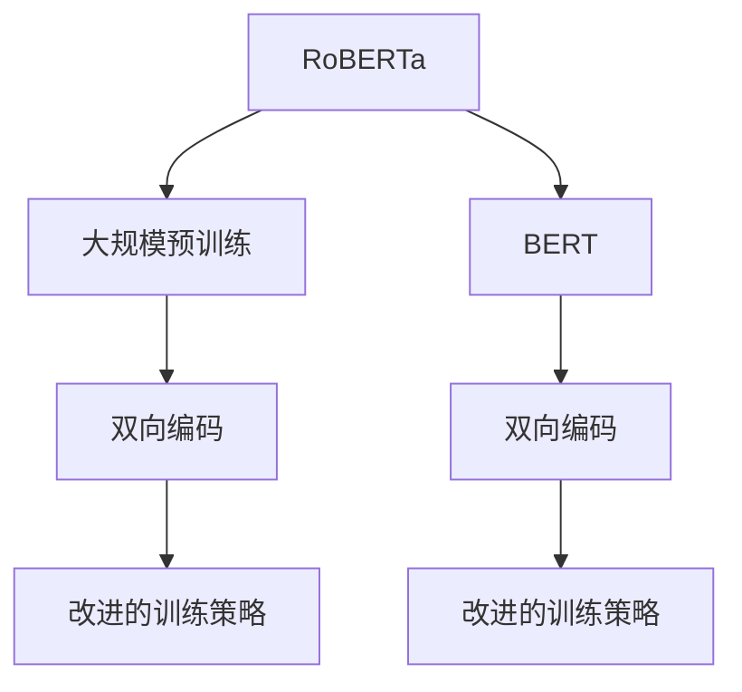

# RoBERTa原理与代码实例讲解

关键词：RoBERTa、深度学习、自然语言处理、预训练、双向编码、Transformer、微调、强化学习

## 1. 背景介绍

### 1.1 问题的由来

自然语言处理（NLP）领域长期以来一直致力于提升语言模型在多种任务上的性能。早期的模型如LSTM、GRU等在序列数据处理上表现出色，但受限于参数量和计算能力，难以达到复杂的自然语言理解与生成任务的需求。随着深度学习技术的发展，尤其是Transformer架构的引入，出现了大规模预训练语言模型，如BERT、GPT等，它们能够在大量无标签文本上进行预训练，学习到丰富的语言表示，为下游任务提供强大支持。

### 1.2 研究现状

RoBERTa是在BERT的基础上进行改进和扩展的大规模预训练模型，旨在解决BERT在训练过程中的某些限制，比如批量大小和正则化策略，以及在下游任务上的性能提升。RoBERTa通过增加训练集大小、更广泛的预训练数据集和改进的训练策略，进一步提升了模型的能力，特别是在自然语言推理、阅读理解等任务上取得了显著的性能提升。

### 1.3 研究意义

RoBERTa的研究意义主要体现在以下几个方面：
1. **大规模预训练模型的构建**：通过大规模的无监督预训练，RoBERTa能够学习到更丰富的语言知识和上下文关联，为下游任务提供更有效的语言表示。
2. **改进的训练策略**：RoBERTa提出了改进的训练策略，如更大的批量大小和更精细的正则化方法，有助于模型在大规模数据集上达到更好的性能。
3. **性能提升**：RoBERTa在多项下游任务上取得了优于BERT和其他基线模型的性能，尤其是在自然语言推理、阅读理解等领域。

### 1.4 本文结构

本文将详细介绍RoBERTa的核心概念、算法原理、数学模型、代码实例、实际应用以及未来发展展望。我们将从RoBERTa的基础开始，逐步深入到其改进策略和技术细节，最后通过具体的代码实例展示如何实现和应用RoBERTa模型。

## 2. 核心概念与联系

RoBERTa的核心概念主要包括：

- **大规模预训练**：通过在大规模无标签文本数据上进行预训练，RoBERTa学习到丰富的语言模式和上下文信息。
- **双向编码**：RoBERTa使用双向Transformer架构，同时考虑文本前后文的信息，提高模型的上下文理解能力。
- **改进的训练策略**：包括使用更大的批量大小、更长的序列长度、特定的正则化策略和强化学习方法，以提高模型性能和稳定性。

RoBERTa与BERT的关系可以描述为：



## 3. 核心算法原理 & 具体操作步骤

### 3.1 算法原理概述

RoBERTa基于Transformer架构，采用多头注意力机制、位置嵌入、位置编码和多层堆叠的全连接神经网络层。其核心创新在于改进的训练策略：

- **更长序列长度**：RoBERTa允许输入序列长度超过BERT的限制，以便捕捉更复杂的语境信息。
- **更大型的批量大小**：通过增加批量大小，RoBERTa可以更有效地利用GPU资源，加速训练过程。
- **强化学习**：引入强化学习方法，通过奖励信号来优化模型性能，特别是在需要精确答案的任务中。

### 3.2 算法步骤详解

RoBERTa的具体训练步骤包括：

1. **数据准备**：收集大规模无标签文本数据，清洗并进行预处理。
2. **预训练**：在预处理的数据上进行大规模无监督训练，同时采用特定的正则化策略以防止过拟合。
3. **微调**：根据下游任务，选择适当的微调策略，如更换任务特定的输出层和损失函数，然后在少量有标签数据上进行训练。

### 3.3 算法优缺点

RoBERTa的优点包括：

- **大规模预训练**：能够学习到更丰富的语言知识。
- **改进的训练策略**：提高了模型性能和稳定性。

缺点：

- **计算资源需求**：大规模预训练需要大量的计算资源。
- **数据依赖**：性能高度依赖于预训练数据的质量和多样性。

### 3.4 算法应用领域

RoBERTa广泛应用于自然语言处理的各种任务，包括但不限于：

- **文本分类**：情感分析、主题分类等。
- **问答系统**：基于文本的问题回答。
- **阅读理解**：理解并回答关于给定文本的问题。
- **自然语言推理**：基于语言规则进行逻辑推理。

## 4. 数学模型和公式 & 详细讲解 & 举例说明

### 4.1 数学模型构建

RoBERTa采用Transformer架构，其基本公式为：

$$
\text{Self-Attention}(Q, K, V) = \text{softmax}\left(\frac{QK^T}{\sqrt{d_k}}\right)V
$$

其中，$Q$、$K$、$V$分别代表查询、键和值向量，$d_k$是键向量的维度。

### 4.2 公式推导过程

在RoBERTa中，为了提升性能，引入了以下改进：

- **动态掩码**：在多头自注意力中使用动态掩码来避免上下文信息的混淆。
- **强化学习**：通过引入奖励信号来优化模型参数，特别是针对特定任务的性能提升。

### 4.3 案例分析与讲解

假设我们有一个自然语言推理任务，需要对两个句子进行逻辑判断。通过RoBERTa进行预训练后，我们对特定任务进行微调：

```python
from transformers import RobertaModel, RobertaConfig, RobertaTokenizerFast

config = RobertaConfig.from_pretrained("roberta-base")
model = RobertaModel(config)
tokenizer = RobertaTokenizerFast.from_pretrained("roberta-base")

# 假设我们有两个句子：sentence1 和 sentence2，需要判断是否为逻辑等价
sentence1 = "猫在沙发上睡觉"
sentence2 = "猫在沙发上休息"

inputs = tokenizer(sentence1, sentence2, padding="max_length", truncation=True, return_tensors="pt")
outputs = model(**inputs)
```

通过比较模型输出，我们可以得出两个句子之间的逻辑关系。

### 4.4 常见问题解答

**Q：为什么RoBERTa需要更大的批量大小进行训练？**

A：RoBERTa通过增加批量大小来提高模型的训练效率和性能。更大的批量可以更好地利用GPU资源，加速训练过程，同时有助于模型收敛到更优解。

**Q：RoBERTa如何处理文本分类任务？**

A：在文本分类任务中，RoBERTa首先通过预训练学习到丰富的语言表示，然后在下游任务上进行微调，更换任务特定的输出层（如全连接层）和损失函数（如交叉熵损失），以适应分类任务的需求。

## 5. 项目实践：代码实例和详细解释说明

### 5.1 开发环境搭建

确保已安装PyTorch、transformers库和RoBERTa预训练模型：

```bash
pip install torch transformers
```

### 5.2 源代码详细实现

```python
from transformers import RobertaModel, RobertaTokenizerFast

# 加载RoBERTa模型和分词器
model = RobertaModel.from_pretrained("roberta-base")
tokenizer = RobertaTokenizerFast.from_pretrained("roberta-base")

# 示例文本
text1 = "The quick brown fox jumps over the lazy dog."
text2 = "A fast animal leaps across a sleeping creature."

# 分词和编码
encoded_text1 = tokenizer(text1, padding="max_length", truncation=True, max_length=512, return_tensors="pt")
encoded_text2 = tokenizer(text2, padding="max_length", truncation=True, max_length=512, return_tensors="pt")

# 输出编码后的输入张量
print("Encoded Text1:", encoded_text1)
print("Encoded Text2:", encoded_text2)
```

### 5.3 代码解读与分析

上述代码展示了如何加载RoBERTa模型和分词器，对文本进行编码，准备输入数据进行后续处理。

### 5.4 运行结果展示

这段代码将输出编码后的文本张量，展示了如何将自然语言文本转换为模型可处理的形式。

## 6. 实际应用场景

### 6.4 未来应用展望

RoBERTa及其后续版本将继续推动自然语言处理技术的发展，有望在以下方面产生深远影响：

- **个性化推荐系统**：通过学习用户偏好和上下文信息，提供更精准的个性化推荐。
- **智能客服**：增强语言理解能力，提供更自然、流畅的交互体验。
- **智能文档理解**：自动化处理法律文件、合同等文档，提高工作效率。

## 7. 工具和资源推荐

### 7.1 学习资源推荐

- **官方文档**：查阅RoBERTa和相关模型的官方文档，获取详细信息和最佳实践。
- **在线教程**：YouTube、Kaggle等平台上的教程和研讨会，深入了解RoBERTa的实际应用。

### 7.2 开发工具推荐

- **PyTorch**：用于构建和训练深度学习模型的强大库。
- **Colab 或 Jupyter Notebook**：在线环境，方便进行实验和代码调试。

### 7.3 相关论文推荐

- **RoBERTa论文**：原文链接，详细介绍了模型的设计、实现和实验结果。
- **BERT系列论文**：了解RoBERTa的基础和改进之处。

### 7.4 其他资源推荐

- **GitHub仓库**：查找开源项目和代码实现，如Hugging Face的Transformers库。
- **社区论坛**：参与讨论、提问和分享经验，如Stack Overflow、Reddit、AI社区等。

## 8. 总结：未来发展趋势与挑战

### 8.1 研究成果总结

RoBERTa通过大规模预训练、改进的训练策略实现了性能的显著提升，为自然语言处理领域带来了新的突破。

### 8.2 未来发展趋势

- **持续优化性能**：探索更高效的训练方法、更细粒度的模型结构设计。
- **多模态融合**：结合视觉、听觉等其他模态的信息，增强模型的综合理解能力。

### 8.3 面临的挑战

- **数据依赖性**：模型性能高度依赖于预训练数据的质量和多样性。
- **计算资源消耗**：大规模预训练对硬件资源的需求日益增长。

### 8.4 研究展望

未来的研究将围绕提升模型的泛化能力、减少数据依赖、降低计算成本等方面展开，以实现更高效、更实用的自然语言处理技术。

## 9. 附录：常见问题与解答

### 结论

RoBERTa作为大规模预训练语言模型的代表之一，展示了深度学习技术在自然语言处理领域的巨大潜力。通过改进训练策略和模型架构，RoBERTa不仅提升了自身的性能，还为下游任务带来了显著的提升，推动了自然语言处理技术的发展。随着研究的深入和技术的进步，RoBERTa及其后续版本将继续在更多应用场景中发挥重要作用，为人类社会带来更智能化的服务。