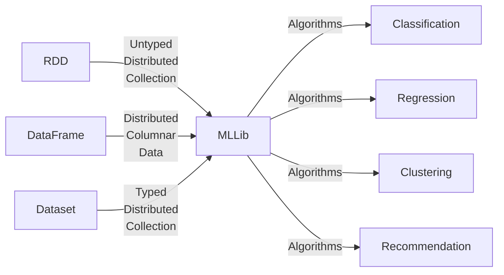
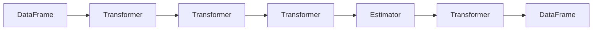
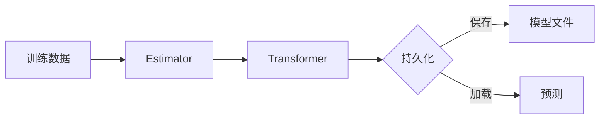

好的，我会按照要求撰写这篇文章。以下是正文部分：

# Spark MLlib原理与代码实例讲解

## 1. 背景介绍

### 1.1 问题的由来

在当今大数据时代，海量的数据不断产生和积累。如何高效地从这些海量数据中提取有价值的信息和知识,成为了各行业亟待解决的重要问题。传统的数据处理和机器学习算法很难满足大数据场景下的计算需求,因此,基于大数据框架的分布式机器学习算法应运而生。

Apache Spark作为一种通用的大数据处理引擎,凭借其优秀的内存计算性能和丰富的机器学习算法库MLlib,成为了大数据机器学习领域的佼佼者。Spark MLlib提供了一整套可扩展的机器学习算法,涵盖了分类、回归、聚类、协同过滤等多种学习范式,并支持管线(Pipeline)式工作流,极大地简化了机器学习工作流程。

### 1.2 研究现状

目前,Spark MLlib已经成为业界公认的大数据机器学习的标准工具之一。越来越多的公司和组织开始采用Spark MLlib进行大规模数据挖掘和分析。不过,由于Spark MLlib算法库本身的复杂性,很多开发人员对其原理和实现细节缺乏深入的理解,难以高效地利用和优化这些算法。

### 1.3 研究意义

透彻理解Spark MLlib中各种机器学习算法的原理和实现细节,对于开发人员来说至关重要。只有掌握了算法背后的数学基础和核心思想,才能更好地应用这些算法解决实际问题,并根据具体场景对算法进行定制和优化。同时,研究Spark MLlib的源代码实现,也有助于开发人员提高分布式系统设计和编程能力。

### 1.4 本文结构

本文将全面介绍Spark MLlib中几种核心机器学习算法的原理、数学模型以及在Spark中的具体实现。文章主要分为以下几个部分:

- 核心概念与联系
- 核心算法原理与具体操作步骤
- 数学模型和公式详细讲解与案例分析
- 项目实践:代码实例和详细解释说明
- 实际应用场景
- 工具和资源推荐
- 总结:未来发展趋势与挑战
- 附录:常见问题与解答

## 2. 核心概念与联系

在深入探讨Spark MLlib具体算法之前,我们有必要先了解一些核心概念,这些概念贯穿于Spark MLlib的整个设计和实现之中。

### 2.1 RDD、DataFrame和Dataset

RDD(Resilient Distributed Dataset)、DataFrame和Dataset是Spark中表示大数据的三种核心数据结构。它们分别对应着Spark三个主要编程接口:RDD是最基础的分布式内存数据结构;DataFrame提供了一种以列为单位的二维表格视图,支持结构化数据处理;Dataset在DataFrame的基础上,进一步提供了对数据的结构信息的编程接口,支持编译时类型安全检查。

Spark MLlib的算法实现主要基于DataFrame和Dataset,充分利用了它们的优势。开发人员可以使用熟悉的SQL风格来操作数据,同时也能享受到静态类型检查带来的编程效率和安全性。

### 2.2 Transformer与Estimator

Transformer和Estimator是Spark MLlib中的两个核心抽象,它们共同构成了MLlib的机器学习Pipeline(管线)。

Transformer负责将一个DataFrame转换为另一个DataFrame,例如特征提取、标准化等。而Estimator则是一个可拟合的算法,它接受一个DataFrame并产生一个Transformer。比如,逻辑回归就是一个Estimator,可以从训练数据中学习出一个逻辑回归模型(Transformer),用于新数据的分类预测。

通过将多个Transformer和Estimator组合成Pipeline,可以非常方便地构建出完整的机器学习工作流。这种设计不仅使得代码更加模块化和可维护,而且还支持跨工作流程的数据缓存,从而提高了计算效率。

### 2.3 特征工程

特征工程对于机器学习算法的性能至关重要。Spark MLlib提供了丰富的特征转换工具,涵盖了标准化、单热编码、词袋模型、TF-IDF等多种特征提取和转换方法。这些工具不仅可以作为独立的Transformer使用,也可以与Estimator无缝集成,构建出端到端的机器学习Pipeline。

### 2.4 模型持久化

Spark MLlib支持将训练好的模型持久化到磁盘,以便后续重用。这不仅节省了重复训练的时间和计算资源,而且还方便了模型在不同环境之间的迁移和部署。MLlib使用了自身的二进制格式来存储模型,同时也支持导出为PMML格式,以实现与其他工具的互操作性。

## 3. 核心算法原理与具体操作步骤

在了解了Spark MLlib的核心概念之后,我们将深入探讨几种常用的机器学习算法在MLlib中的具体实现原理和操作步骤。

### 3.1 逻辑回归

#### 3.1.1 算法原理概述

逻辑回归是一种广泛应用于分类问题的监督学习算法。它通过对自变量进行线性组合,并引入Sigmoid函数作为链接函数,将线性回归的输出值映射到(0,1)范围内,从而得到事件发生的概率估计值。

在二分类问题中,逻辑回归模型可以表示为:

$$f(x) = P(Y=1|X) = \frac{1}{1+e^{-w^Tx}}$$

其中,Y是二值标签(0或1),X是特征向量,w是模型权重向量。

逻辑回归通常使用最大似然估计的方法来训练模型参数w。给定训练数据集D={(x1,y1),(x2,y2),...,(xn,yn)},我们需要最大化似然函数:

$$\begin{aligned}
L(w) &= \sum_{i=1}^n y_i\log P(y_i=1|x_i) + (1-y_i)\log P(y_i=0|x_i) \
     &= \sum_{i=1}^n [y_i\log\frac{1}{1+e^{-w^Tx_i}} + (1-y_i)\log\frac{e^{-w^Tx_i}}{1+e^{-w^Tx_i}}]
\end{aligned}$$

求导可得:

$$\frac{\partial L(w)}{\partial w} = \sum_{i=1}^n (y_i - P(y_i=1|x_i))x_i$$

通过梯度上升的方式,不断迭代更新w,直到收敛。

#### 3.1.2 算法步骤详解

1. **特征工程**：对原始数据进行特征抽取、编码和标准化等预处理,得到特征向量X。

2. **设置初始权重**：初始化逻辑回归模型的权重向量w,通常使用小的随机值。

3. **计算预测值**：对每个样本(x,y),计算当前模型在x上的预测值,即P(y=1|x)。

4. **计算损失函数**：根据预测值和真实标签y,计算当前模型的损失(负对数似然)。

5. **计算梯度**：对损失函数关于权重w求偏导,得到当前模型的梯度。

6. **更新权重**：使用优化算法(如梯度下降)根据梯度来更新权重向量w。

7. **重复迭代**：重复执行步骤3-6,直到收敛或达到最大迭代次数。

8. **模型评估**：在测试集上评估最终模型的性能指标,如准确率、精确率、召回率等。

#### 3.1.3 算法优缺点

**优点**：

- 模型简单,可解释性强
- 训练速度快,可以有效处理大规模数据集
- 无需归一化特征,对异常值不敏感

**缺点**：

- 对于非线性问题,拟合能力较差
- 容易过拟合,需要进行正则化
- 对于高维特征空间,计算复杂度较高

#### 3.1.4 算法应用领域

- 广告点击率预测
- 电子邮件垃圾邮件分类
- 疾病诊断和预测
- 信用评分和欺诈检测
- 自然语言处理中的情感分析等

### 3.2 决策树

#### 3.2.1 算法原理概述

决策树是一种监督学习算法,通过构建树状决策模型来进行分类或回归预测。每个内部节点代表对特征的一个测试,每个分支代表测试的一个输出,而每个叶节点则存储了一个类别(分类树)或一个连续值(回归树)。

决策树的构建过程是一个递归的特征选择和数据分割的过程。具体步骤如下:

1. 从根节点开始,对所有可用特征进行评估,选择最优特征作为分裂条件。
2. 根据选定的特征,将数据集分割成若干子集。
3. 对每个子集重复步骤1和2,构建子树。
4. 直到满足终止条件(如最大深度、最小实例数等),将当前节点标记为叶节点。

在选择最优特征时,决策树通常使用信息增益或基尼系数等指标来评估每个特征的分裂效果。具体来说:

- 信息增益 = 父节点熵 - 加权子节点熵之和
- 基尼系数 = 1 - 加权子节点基尼指数之和

其中,熵和基尼指数可以衡量数据集的纯度,值越小表示纯度越高。

在构建完整个决策树后,还需要对树进行剪枝,以防止过拟合。

#### 3.2.2 算法步骤详解

1. **加载数据**:从数据源读取训练数据,包括特征向量X和标签y。

2. **特征工程**:对原始数据进行特征提取、编码和标准化等预处理。

3. **构建决策树**:
    - 计算当前数据集的熵/基尼指数
    - 对每个特征,计算按该特征分割后的加权熵/基尼指数
    - 选择能最大程度降低加权熵/基尼指数的特征作为分裂条件
    - 根据分裂条件将数据集分割成子集
    - 对每个子集递归执行上述步骤,构建子树
    - 直到满足终止条件,将当前节点标记为叶节点

4. **决策树剪枝**:
    - 预剪枝:在构建树的过程中,根据预设条件控制树的生长
    - 后剪枝:先构建完整的树,再根据验证集的表现对树进行剪枝

5. **模型评估**:在测试集上评估决策树模型的性能,如准确率、F1分数等。

6. **模型持久化**:将训练好的决策树模型持久化,以便后续加载使用。

#### 3.2.3 算法优缺点

**优点**:

- 模型可解释性强,树状结构直观
- 可以处理数值型和类别型特征
- 对缺失值和异常值的鲁棒性较好
- 可以自动进行特征选择

**缺点**:

- 对于高维数据,构建复杂决策树的计算代价较高
- 容易过拟合,需要进行剪枝
- 对于有