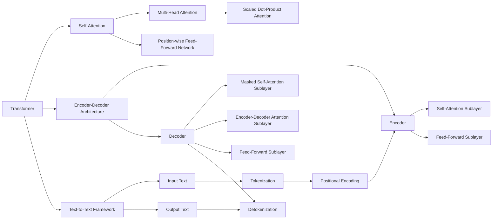

# T5原理与代码实例讲解

## 1. 背景介绍

### 1.1 问题的由来

在自然语言处理(NLP)领域,机器翻译、文本摘要、问答系统等任务一直是研究的热点和难点。传统的序列到序列(Seq2Seq)模型虽然取得了一些成果,但仍然存在一些明显的缺陷,例如:

1. **长距离依赖问题**:在处理长序列时,模型难以捕捉到序列两端之间的长距离依赖关系。
2. **计算效率低下**:每个时间步都需要计算整个输入序列,计算复杂度高。
3. **并行能力差**:每个时间步的计算需要依赖前一个时间步的结果,无法实现高效的并行计算。

为了解决这些问题,谷歌大脑团队在2020年提出了一种全新的Transformer架构——T5(Text-to-Text Transfer Transformer),旨在将所有NLP任务统一到"Text-to-Text"的框架下,通过预训练和微调的方式实现任务的快速迁移。

### 1.2 研究现状

T5模型在发布后引起了学术界和工业界的广泛关注,成为NLP领域新的研究热点。目前,T5模型已经被成功应用于机器翻译、文本摘要、问答系统、文本生成等多个领域,并取得了卓越的成绩。

与此同时,也有一些研究者对T5模型提出了改进和扩展,例如:

- MT5模型:针对多语种任务进行了预训练和微调,提高了跨语言迁移能力。
- ByT5模型:引入了字节级别的编码,提高了对于罕见单词和新词的处理能力。
- PrefixTuning:通过添加前缀提示,降低了微调参数量,提高了计算效率。

### 1.3 研究意义

T5模型的提出为NLP领域带来了全新的思路和方法,具有重要的理论意义和应用价值:

1. **统一的范式**:将所有NLP任务统一到"Text-to-Text"的框架下,简化了任务的表示和迁移。
2. **高效的计算**:基于Transformer的并行计算能力,提高了模型的计算效率。
3. **泛化能力强**:通过大规模预训练,模型具备了强大的泛化能力,可以快速迁移到新任务。
4. **多语种支持**:支持跨语言迁移,为多语种NLP任务提供了新的解决方案。

因此,深入研究T5模型的原理和实现方法,对于推动NLP技术的发展具有重要意义。

### 1.4 本文结构

本文将全面介绍T5模型的核心原理、算法细节、数学模型、代码实现和应用场景,内容安排如下:

1. 背景介绍
2. 核心概念与联系
3. 核心算法原理与具体操作步骤
4. 数学模型和公式详细讲解与举例说明
5. 项目实践:代码实例和详细解释说明
6. 实际应用场景
7. 工具和资源推荐
8. 总结:未来发展趋势与挑战
9. 附录:常见问题与解答

## 2. 核心概念与联系

T5模型的核心概念及其相互关系如上图所示:

1. **Transformer**:T5模型的基础架构,包括自注意力机制(Self-Attention)、前馈神经网络(Feed-Forward Network)和编码器-解码器结构(Encoder-Decoder Architecture)。

2. **Self-Attention**:通过计算输入序列中每个元素与其他元素的相关性,捕捉长距离依赖关系。包括Multi-Head Attention和Scaled Dot-Product Attention两种形式。

3. **Encoder-Decoder Architecture**:编码器(Encoder)将输入序列编码为连续的表示,解码器(Decoder)根据编码器的输出生成目标序列。

4. **Text-to-Text Framework**:T5模型的核心创新,将所有NLP任务统一到"Text-to-Text"的范式下,输入和输出均为文本序列。

5. **Tokenization & Positional Encoding**:将输入文本序列转换为模型可以理解的Token序列,并添加位置信息。

6. **Detokenization**:将模型生成的Token序列转换回可读的文本序列。

上述核心概念相互关联、环环相扣,共同构建了T5模型的整体架构和工作原理。

## 3. 核心算法原理与具体操作步骤

### 3.1 算法原理概述

T5模型的核心算法原理可以概括为以下几个方面:

1. **Transformer编码器-解码器架构**:T5模型采用了Transformer的编码器-解码器架构,编码器对输入序列进行编码,解码器根据编码器的输出生成目标序列。

2. **多头自注意力机制**:在编码器和解码器中都使用了多头自注意力机制,用于捕捉输入序列中元素之间的长距离依赖关系。

3. **掩码自注意力**:在解码器的自注意力机制中,引入了掩码机制,确保每个位置的单词只能注意到它前面的单词,避免了未来信息的泄露。

4. **编码器-解码器注意力**:解码器中还包含一个编码器-解码器注意力子层,用于将解码器的输出与编码器的输出进行关联。

5. **前馈神经网络**:在编码器和解码器中都使用了前馈神经网络,对序列的表示进行进一步的非线性转换和特征提取。

6. **Text-to-Text框架**:T5模型将所有NLP任务统一到"Text-to-Text"的框架下,输入和输出均为文本序列,通过预训练和微调的方式实现任务的快速迁移。

### 3.2 算法步骤详解

T5模型的算法步骤可以分为以下几个部分:

#### 3.2.1 输入处理

1. **Tokenization**:将输入文本序列转换为模型可以理解的Token序列。通常使用字节对编码(BPE)或SentencePiece等算法进行分词。

2. **Positional Encoding**:为每个Token添加位置信息,使模型能够捕捉序列中元素的位置关系。常用的方法是将位置编码与Token嵌入相加。

#### 3.2.2 编码器

1. **Self-Attention Sublayer**:计算输入序列中每个Token与其他Token的注意力权重,捕捉长距离依赖关系。

2. **Feed-Forward Sublayer**:对Self-Attention的输出进行非线性转换,提取更高级的特征表示。

3. **Layer Normalization & Residual Connection**:使用层归一化和残差连接,提高模型的训练稳定性和表达能力。

4. **Encoder Output**:编码器的最终输出是对输入序列的连续表示,将被送入解码器进行解码。

#### 3.2.3 解码器

1. **Masked Self-Attention Sublayer**:计算目标序列中每个Token与其前面Token的注意力权重,引入掩码机制避免未来信息的泄露。

2. **Encoder-Decoder Attention Sublayer**:将解码器的输出与编码器的输出进行关联,捕捉输入序列和输出序列之间的依赖关系。

3. **Feed-Forward Sublayer**:对注意力机制的输出进行非线性转换,提取更高级的特征表示。

4. **Layer Normalization & Residual Connection**:使用层归一化和残差连接,提高模型的训练稳定性和表达能力。

5. **Decoder Output**:解码器的最终输出是对目标序列的预测,需要通过掩码机制一步一步生成。

#### 3.2.4 输出处理

1. **Detokenization**:将模型生成的Token序列转换回可读的文本序列,与输入处理的Tokenization过程相反。

2. **Task-Specific Processing**:根据不同的任务,对模型输出进行进一步的后处理,如机器翻译任务中的重组和规范化等。

### 3.3 算法优缺点

#### 优点

1. **并行计算能力强**:Transformer架构中的自注意力机制可以高效地并行计算,提高了模型的计算效率。

2. **长距离依赖建模能力强**:自注意力机制能够直接捕捉输入序列中任意两个位置之间的依赖关系,解决了RNN等模型难以建模长距离依赖的问题。

3. **泛化能力强**:通过大规模预训练,T5模型具备了强大的泛化能力,可以快速迁移到新的NLP任务。

4. **统一的范式**:将所有NLP任务统一到"Text-to-Text"的框架下,简化了任务的表示和迁移。

#### 缺点

1. **计算资源需求高**:T5模型通常包含数十亿甚至上百亿的参数,对计算资源的需求较高,训练和部署成本较大。

2. **长序列处理能力有限**:由于自注意力机制需要计算序列中所有元素之间的注意力权重,对于极长的序列,计算复杂度会急剧增加。

3. **缺乏显式的结构建模能力**:T5模型主要依赖自注意力机制来捕捉序列中的依赖关系,缺乏对结构化信息(如语法树等)的显式建模能力。

4. **需要大量标注数据**:预训练和微调过程需要大量的标注数据,对于一些数据稀缺的领域,可能难以发挥T5模型的全部潜力。

### 3.4 算法应用领域

T5模型由于其强大的泛化能力和统一的"Text-to-Text"范式,可以应用于NLP领域的多个任务,包括但不限于:

1. **机器翻译**:将源语言文本转换为目标语言文本。

2. **文本摘要**:根据原始文本生成简洁的摘要。

3. **问答系统**:根据问题和上下文信息生成答案。

4. **文本生成**:根据给定的提示或主题生成连贯的文本内容。

5. **文本分类**:将文本分配到预定义的类别中。

6. **实体识别**:从文本中识别出命名实体,如人名、地名、组织机构名等。

7. **关系抽取**:从文本中抽取出实体之间的语义关系。

8. **数据增强**:通过生成相似但不同的文本,扩充训练数据集。

9. **多语种支持**:通过跨语言迁移,支持多种语言的NLP任务。

T5模型在上述任务中都展现出了卓越的性能,为NLP技术的发展做出了重要贡献。

## 4. 数学模型和公式详细讲解与举例说明

### 4.1 数学模型构建

T5模型的数学模型主要基于Transformer架构,包括编码器(Encoder)和解码器(Decoder)两个部分。

#### 4.1.1 编码器(Encoder)

编码器的输入是一个长度为 $n$ 的Token序列 $X = (x_1, x_2, \dots, x_n)$,其中 $x_i$ 表示第 $i$ 个Token的嵌入向量。编码器的目标是将输入序列 $X$ 编码为一个连续的表示 $C$,供解码器使用。

编码器由 $N$ 个相同的层组成,每一层包括两个子层:多头自注意力机制(Multi-Head Attention)和前馈神经网络(Feed-Forward Network)。具体计算过程如下:

1. **Multi-Head Attention**

$$\begin{aligned}
\text{MultiHead}(Q, K, V) &= \text{Concat}(\text{head}_1, \dots, \text{head}_h)W^O\
\text{where } \text{head}_i &= \text{Attention}(QW_i^Q, KW_i^K, VW_i^V)
\end{aligned}$$

其中 $Q$、$K