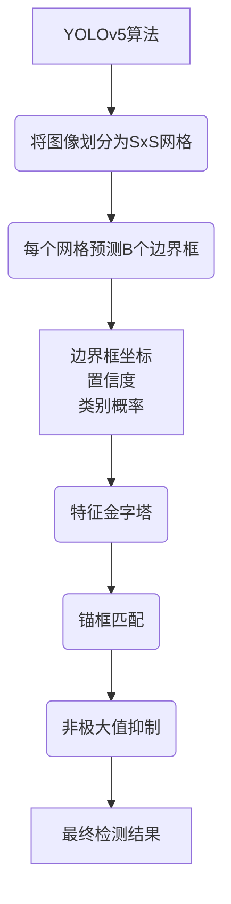

# YOLOv5原理与代码实例讲解

## 1. 背景介绍

### 1.1 问题的由来

在计算机视觉领域中,目标检测是一项极具挑战的任务。它旨在从图像或视频中定位并识别出感兴趣的目标对象。传统的目标检测算法通常采用基于滑动窗口的方式,将图像分割成多个区域,然后对每个区域进行分类。这种方法虽然可行,但计算效率低下,难以满足实时性的要求。

随着深度学习技术的快速发展,基于卷积神经网络(CNN)的目标检测算法逐渐成为研究热点。其中,YOLO(You Only Look Once)系列算法因其高效且精准的特点,备受关注。YOLOv5作为YOLO算法的最新版本,不仅在精度和速度上有了显著提升,而且在模型结构和训练策略上也做出了重大改进,使其在各种应用场景下表现出色。

### 1.2 研究现状

目标检测算法可以分为两大类:基于区域提议的两阶段算法和基于回归的一阶段算法。

两阶段算法首先生成候选区域,然后对每个区域进行分类,代表算法有R-CNN、Fast R-CNN、Faster R-CNN等。这些算法精度较高,但由于存在区域提议的过程,导致计算效率低下。

一阶段算法则是直接对密集的先验框进行分类和回归,将目标检测任务转化为回归问题,代表算法有YOLO、SSD等。这类算法计算速度快,但精度相对较低。

YOLO系列算法属于一阶段目标检测算法,其最新版本YOLOv5在保持高效的同时,精度有了大幅提升,在多个公开数据集上取得了最佳成绩。

### 1.3 研究意义

YOLOv5算法的出现,为目标检测任务提供了一种高效且精准的解决方案。它不仅在学术研究领域具有重要意义,同时也为众多实际应用场景带来了新的可能性,例如:

- **安防监控**: 实时检测和跟踪运动目标,提高安防效率。
- **自动驾驶**: 精准识别路面车辆、行人、障碍物等,确保行车安全。
- **机器人视觉**: 实时感知环境信息,指导机器人行为。
- **医疗影像分析**: 自动检测医学影像中的病灶、肿瘤等异常区域。
- **无人机航拍**: 识别目标物体,用于环境监测、测绘等。

综上所述,深入研究YOLOv5算法的原理和实现,对于推动计算机视觉技术的发展、促进人工智能在实际场景中的应用都具有重要意义。

### 1.4 本文结构

本文将全面介绍YOLOv5目标检测算法的核心原理、数学模型、实现细节和应用案例,内容安排如下:

1. 背景介绍
2. 核心概念与联系
3. 核心算法原理与具体操作步骤
4. 数学模型和公式详细讲解与举例说明
5. 项目实践:代码实例和详细解释说明
6. 实际应用场景
7. 工具和资源推荐
8. 总结:未来发展趋势与挑战
9. 附录:常见问题与解答

## 2. 核心概念与联系

YOLOv5算法的核心思想是将目标检测任务转化为一个端到端的回归问题。它将整个图像划分为SxS个网格,每个网格预测B个边界框及其置信度,同时也预测每个边界框内目标的类别。算法的关键在于使用卷积神经网络直接从图像像素数据预测边界框坐标、置信度和类别,而无需复杂的候选区域生成过程。

YOLOv5算法的核心概念主要包括:

1. **边界框(Bounding Box)**: 用于定位目标对象的矩形框,由其中心坐标(x,y)、宽度(w)和高度(h)参数确定。

2. **置信度(Confidence)**: 表示边界框内含有目标的置信程度,是一个0到1之间的值。置信度 = 前景概率 * IOU(预测框与真实框的交并比)。

3. **类别概率(Class Probability)**: 表示边界框内目标属于某个类别的概率,是一个0到1之间的值。

4. **锚框(Anchor Box)**: 预先设定的一组不同形状和大小的参考框,用于匹配不同尺度的目标。

5. **特征金字塔(Feature Pyramid)**: 将不同尺度的特征图结合起来,提高对不同大小目标的检测能力。

6. **非极大值抑制(Non-Maximum Suppression)**: 去除重叠边界框,保留置信度最高的那个作为最终预测结果。

上述概念相互关联、环环相扣,共同构建了YOLOv5算法的理论基础和实现框架。下一节将对算法的核心原理和具体步骤进行详细阐述。

## 3. 核心算法原理与具体操作步骤

### 3.1 算法原理概述

YOLOv5算法的核心原理可以概括为以下几个关键步骤:

1. **图像预处理**: 将输入图像缩放到固定尺寸,并进行归一化处理。

2. **特征提取**: 使用卷积神经网络从图像中提取不同尺度的特征图。

3. **特征融合**: 将不同尺度的特征图通过特征金字塔网络(FPN)进行融合,获得更加丰富的特征表示。

4. **边界框预测**: 对每个网格单元,预测B个边界框的坐标、置信度和类别概率。

5. **锚框匹配**: 将预测的边界框与预设的锚框进行匹配,找到最佳匹配。

6. **非极大值抑制**: 对重叠的边界框进行筛选,保留置信度最高的那个作为最终检测结果。

7. **后处理**: 对检测结果进行解码和映射,得到最终输出。

该算法的核心在于使用端到端的卷积神经网络直接从图像预测目标边界框、置信度和类别概率,无需复杂的候选区域生成过程,从而大大提高了检测速度。同时,通过特征金字塔网络融合多尺度特征,提高了对不同大小目标的检测能力。

### 3.2 算法步骤详解

1. **图像预处理**

   - 将输入图像缩放到固定尺寸(如640x640像素),以满足网络输入要求。
   - 对图像像素值进行归一化处理,将像素值映射到0到1之间。

2. **特征提取**

   - 使用主干网络(如CSPDarknet53)从输入图像中提取特征,得到三个不同尺度的特征图。
   - 特征图的尺寸分别为(80x80)、(40x40)和(20x20),通道数为255。

3. **特征融合**

   - 使用FPN(特征金字塔网络)对三个不同尺度的特征图进行上采样和下采样,融合成丰富的特征表示。
   - 融合后的特征图尺寸为(80x80)、(40x40)和(20x20),通道数为512。

4. **边界框预测**

   - 对每个特征图上的每个网格单元,预测B个边界框(如B=3)。
   - 每个边界框包括4个坐标值(tx,ty,tw,th)、1个置信度(obj_conf)和C个类别概率(cls_pred)。
   - 坐标值和置信度通过回归预测,类别概率通过分类预测。

5. **锚框匹配**

   - 预先设定一组不同形状和大小的锚框(如9个),作为参考框。
   - 将预测的边界框与锚框进行匹配,找到最佳匹配的锚框。
   - 根据匹配结果,调整预测边界框的位置和尺寸。

6. **非极大值抑制**

   - 对所有预测边界框根据置信度进行排序。
   - 从置信度最高的边界框开始,移除与其重叠程度较高(IOU>阈值)的其他边界框。
   - 重复上述过程,直到所有边界框都被处理。

7. **后处理**

   - 对保留的边界框进行解码,从相对坐标转换为绝对像素坐标。
   - 根据类别概率,确定每个边界框内目标的类别。
   - 输出最终的检测结果,包括边界框坐标、置信度和类别标签。

上述步骤通过端到端的卷积神经网络实现,无需复杂的候选区域生成过程,从而大大提高了检测速度。同时,通过特征金字塔网络融合多尺度特征,提高了对不同大小目标的检测能力。

### 3.3 算法优缺点

**优点**:

1. **高效**: 端到端的单阶段检测,计算效率高,可实现实时检测。
2. **精确**: 通过特征金字塔网络融合多尺度特征,提高了检测精度。
3. **鲁棒性强**: 能够有效处理小目标、遮挡、拥挤等复杂场景。
4. **通用性好**: 可应用于多种任务,如目标检测、实例分割等。

**缺点**:

1. **定位精度稍差**: 相比两阶段算法,边界框定位精度略低。
2. **对小目标敏感**: 对于极小目标的检测效果相对较差。
3. **需大量数据训练**: 作为深度学习模型,需要大量标注数据进行训练。
4. **实时性能有限制**: 尽管速度很快,但对极高实时性要求仍有一定限制。

总的来说,YOLOv5算法在精度和速度之间达到了较好的平衡,是目标检测领域一种高效且实用的解决方案。

### 3.4 算法应用领域

由于其高效、精准和通用的特点,YOLOv5算法可广泛应用于以下领域:

1. **安防监控**: 实时检测和跟踪运动目标,提高安防效率。
2. **自动驾驶**: 精准识别路面车辆、行人、障碍物等,确保行车安全。
3. **机器人视觉**: 实时感知环境信息,指导机器人行为。
4. **医疗影像分析**: 自动检测医学影像中的病灶、肿瘤等异常区域。
5. **无人机航拍**: 识别目标物体,用于环境监测、测绘等。
6. **视频分析**: 对视频流进行实时目标检测和跟踪。
7. **人脸识别**: 检测和识别图像或视频中的人脸。
8. **缺陷检测**: 在工业生产线中检测产品缺陷。
9. **交通监控**: 检测和识别交通标志、车辆和行人。
10. **野生动物监测**: 在自然环境中检测和识别野生动物。

总之,YOLOv5算法凭借其优异的性能,为众多实际应用场景带来了新的可能性,促进了计算机视觉技术的发展和应用。

## 4. 数学模型和公式详细讲解与举例说明

### 4.1 数学模型构建

YOLOv5算法的数学模型主要包括以下几个部分:

1. **边界框编码**
2. **置信度计算**
3. **类别概率计算**
4. **损失函数**

#### 4.1.1 边界框编码

为了简化边界框的预测,YOLOv5采用了相对坐标的编码方式。具体来说,对于每个网格单元,预测B个边界框,每个边界框由4个值(tx,ty,tw,th)表示,分别对应中心坐标的偏移量和边界框的宽高。

$$
\begin{aligned}
b_x &= \sigma(t_x) + c_x \
b_y &= \sigma(t_y) + c_y \
b_w &= p_w e^{t_w} \
b_h &= p_h e^{t_h