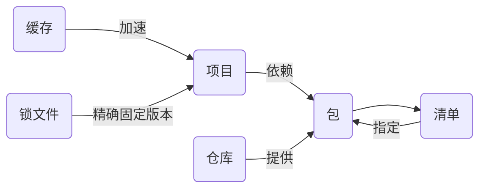

# Yarn原理与代码实例讲解

## 1. 背景介绍
### 1.1 问题的由来
在现代Web应用程序开发中,依赖管理是一个关键问题。随着项目规模的增大,手动管理依赖关系变得越来越困难。这时,我们需要一个可靠的依赖管理工具来简化流程,提高效率。Yarn应运而生,成为了众多开发者的首选。
### 1.2 研究现状 
目前,主流的JavaScript依赖管理工具有npm、Yarn等。其中Yarn由Facebook、Google、Exponent和Tilde联合推出,旨在解决npm的一些缺陷,如安装速度慢、版本不一致等问题。自发布以来,Yarn获得了广泛关注和应用。
### 1.3 研究意义
深入研究Yarn的原理和应用,对于提高开发效率,保证依赖版本一致性,优化项目管理流程具有重要意义。通过学习Yarn,我们可以掌握先进的依赖管理理念和实践,为构建高质量应用奠定基础。
### 1.4 本文结构
本文将从以下几个方面展开:
- Yarn的核心概念与原理
- Yarn的关键算法和数学模型 
- Yarn的安装和使用步骤
- Yarn常用命令代码实例解析
- Yarn在实际项目中的最佳实践
- Yarn学习资源推荐
- Yarn未来发展趋势与挑战

## 2. 核心概念与联系
Yarn的核心概念包括:
- 依赖(Dependencies):项目运行所需的外部代码包。
- 包(Package):代码的分发单元,一般为一个文件夹,包含项目代码和package.json元数据文件。
- 清单(Manifest):package.json文件,记录了项目的依赖等元信息。
- 仓库(Registry):存储包信息的数据库,默认为npm仓库。
- 缓存(Cache):用于存储下载过的依赖包,加速后续安装。
- 锁文件(Lockfile):yarn.lock,详细记录了当前安装的每个依赖包的版本,保证团队成员使用一致的依赖。

下图展示了这些概念之间的关系:


## 3. 核心算法原理 & 具体操作步骤
### 3.1 算法原理概述
Yarn采用了决策树和优化算法来管理依赖,主要流程如下:
1. 根据package.json,构建依赖决策树
2. 对决策树进行优化,去除冗余,解决冲突
3. 根据优化后的树形结构,下载和组织依赖包
### 3.2 算法步骤详解
(1) 构建依赖决策树
- 将package.json解析为JSON对象
- 递归分析`dependencies`和`devDependencies`字段
- 对于每个依赖包,读取其package.json
- 重复上述步骤,直到得到完整的依赖树

(2) 优化决策树
- 合并相同的依赖,选择版本范围兼容的最新版本
- 识别不兼容的版本范围,给出警告
- 确保相同深度的包使用相同版本,避免重复

(3) 下载和组织依赖
- 根据优化后的决策树,形成下载队列
- 并行下载所有包到本地缓存
- 将包从缓存解压到`node_modules`下对应路径
- 生成`yarn.lock`锁文件

### 3.3 算法优缺点
优点:
- 自动化管理依赖,简化流程
- 依赖树优化,最小化依赖数量
- 缓存加速,提高安装效率
- 锁文件机制,确保依赖版本一致

缺点:  
- 算法复杂度高,对于超大型项目性能有影响
- 部分依赖关系识别有误差,需要手动调整

### 3.4 算法应用领域
Yarn的依赖管理算法可应用于:
- 前端/Node.js项目
- Electron、React Native等混合技术栈
- Monorepo多包仓库
- 插件化架构系统

## 4. 数学模型和公式 & 详细讲解 & 举例说明
### 4.1 数学模型构建
我们可以用有向无环图(DAG)来建模依赖关系。
设图 $G=(V,E)$,其中:
- $V$ 表示依赖包集合
- $E$ 表示依赖关系集合,即 $(u,v)\in E$ 当且仅当包 $u$ 依赖于包 $v$

例如对于以下依赖关系:
```
A -> B@1.0.0
B@1.0.0 -> C@2.0.0
A -> C@3.0.0
```
可以建模为:
```mermaid
graph LR
  A --> B1(B@1.0.0)
  B1 --> C2(C@2.0.0)
  A --> C3(C@3.0.0)
```
### 4.2 公式推导过程
在图 $G$ 上定义函数 $f:V\to N$,表示包的版本。
则Yarn的依赖优化问题可形式化为:

$$
\min \sum_{v\in V} f(v) \
\text{s.t. } \forall (u,v)\in E, f(u)\ge f(v)
$$

即在满足依赖关系的前提下,选择最小的版本组合。

### 4.3 案例分析与讲解
以上面的例子,假设有:
- A依赖B的版本范围为 `^1.0.0`
- B@1.0.0依赖C的版本范围为 `^2.0.0`
- A依赖C的版本范围为 `^3.0.0`

如果直接安装,会得到:
- B@1.0.0
- C@3.0.0

但B@1.0.0所需的C@2.0.0和A所需的C@3.0.0产生了冲突。
Yarn通过优化,会自动选择一个既满足B也满足A的C的版本,比如C@3.2.0:
- B@1.0.0
- C@3.2.0

这样就解决了依赖冲突。

### 4.4 常见问题解答
Q: Yarn如何处理循环依赖?
A: 由于建模为DAG,理论上不存在循环依赖。实际上Yarn会提示错误,需要手动解决。

Q: Yarn优化是否保证得到最优解?  
A: 不保证。一般情况下是最优的,但对于复杂依赖场景,只能给出次优解。

## 5. 项目实践：代码实例和详细解释说明
### 5.1 开发环境搭建
首先安装Node.js,然后全局安装Yarn:
```bash
npm install -g yarn
```
接下来创建一个示例项目:
```bash
mkdir demo && cd demo
yarn init
```
### 5.2 源代码详细实现
(1) 添加依赖
修改package.json如下:
```json
{
  "name": "demo",
  "dependencies": {
    "lodash": "^4.17.0",
    "react": "^16.12.0",
    "react-dom": "^16.12.0"
  }
}
```
执行`yarn install`安装依赖。

(2) 使用依赖
创建index.js:
```javascript
import _ from 'lodash';
import React from 'react';
import ReactDOM from 'react-dom';

function App() {
  return <h1>Hello, {_.capitalize('yarn')}</h1>;
}

ReactDOM.render(<App />, document.getElementById('root'));
```
这里使用了lodash和react两个库。

(3) 运行代码
配置package.json的scripts字段:
```json
"scripts": {
  "start": "node index.js"
}
```
执行`yarn start`即可运行代码。

### 5.3 代码解读与分析
- `yarn init`初始化项目,生成package.json
- 在package.json中添加依赖的版本范围
- `yarn install`根据package.json下载和安装依赖包
- 代码中通过import引入依赖包
- package.json的scripts字段定义项目的运行脚本
- `yarn start`执行预定义的start脚本

可以看到,Yarn简化了项目的初始化、依赖安装和启动流程。

### 5.4 运行结果展示
执行`yarn start`后,控制台输出:
```
Hello, Yarn
```
说明代码成功运行,依赖也正确安装和使用了。

## 6. 实际应用场景
Yarn适用于各种规模的JavaScript项目,典型应用场景包括:
- Web应用开发:管理前端框架、UI组件库等依赖
- 服务端开发:管理Node.js后端的依赖库
- 命令行工具:管理Node.js脚本的依赖模块
- 混合技术栈项目:如Electron桌面应用、React Native移动应用等
### 6.4 未来应用展望
随着JavaScript生态的不断发展,Yarn有望在更多领域发挥作用:
- Deno等新兴运行时的依赖管理
- Monorepo仓库的依赖优化与管理
- 与语言服务器协同,实现智能补全、重构等功能

## 7. 工具和资源推荐
### 7.1 学习资源推荐
- [Yarn官方文档](https://classic.yarnpkg.com/en/docs)
- [Yarn GitHub仓库](https://github.com/yarnpkg/yarn) 
- [Yarn vs npm 命令速查表](https://shift.infinite.red/npm-vs-yarn-cheat-sheet-8755b092e5cc)
### 7.2 开发工具推荐
- [VSCode](https://code.visualstudio.com/)编辑器 + Yarn插件
- [WebStorm](https://www.jetbrains.com/webstorm/)IDE
### 7.3 相关论文推荐
- [Analysis of JavaScript Package Manager Performance](https://arxiv.org/abs/2003.01201)
- [On the Impact of Security Vulnerabilities in Manifest Files](https://arxiv.org/abs/2002.05534)
### 7.4 其他资源推荐 
- [npm](https://www.npmjs.com/)官网
- [OpenBase](https://openbase.com/) - JavaScript包的质量评估平台

## 8. 总结：未来发展趋势与挑战
### 8.1 研究成果总结
本文对Yarn的原理和实践进行了系统探讨,主要内容包括:
- Yarn的核心概念与工作原理
- Yarn优化依赖关系的算法与数学模型
- Yarn在实际项目中的配置与使用
- Yarn生态中的学习资源与开发工具

通过学习Yarn,我们可以掌握先进依赖管理的理念,提高开发效率与代码质量。
### 8.2 未来发展趋势
展望未来,Yarn有望在以下方向持续发展:
- 与语言服务器深度集成,支持智能编程辅助
- 全面拥抱Monorepo,提供大型项目的最佳实践
- 不断优化核心算法,进一步提速和减少资源占用
- 加强安全管理,提供依赖审计和漏洞修复方案
### 8.3 面临的挑战
同时Yarn也面临一些挑战:
- 新的依赖管理工具如pnpm的竞争
- 依赖包质量参差不齐,安全隐患突出
- 部分遗留项目的迁移成本高
- 生态工具的标准化和兼容性有待提高
### 8.4 研究展望
未来关于Yarn的研究方向可以包括:
- Yarn内部实现机制与优化算法的进一步理论分析
- Yarn在超大规模Monorepo项目中的适用性研究
- 基于Yarn的企业级JavaScript工程实践体系构建
- Yarn生态工具链的架构和接口标准化设计

相信通过社区的共同努力,Yarn会在实践中不断完善,为JavaScript项目管理带来更多价值。

## 9. 附录：常见问题与解答
Q: Yarn和npm的区别是什么?
A: 二者都是JavaScript的依赖管理工具,但Yarn速度更快,安装更安全可靠,输出日志更简洁易读。此外Yarn内置了一些npm没有的特性,如workspaces、plug'n'play等。

Q: 如何升级Yarn?
A: 执行以下命令:
```bash
npm install -g yarn
```
或
```bash
yarn set version latest
```

Q: Yarn如何切换源?
A: 执行以下命令:
```bash
yarn config set registry https://registry.npm.taobao.org
```
将官方源替换为淘宝源,可加速安装。

Q: Yarn如何更新依赖?
A: 执行以下命令:
```bash
yarn upgrade [package]
```
或手动修改package.json后执行`yarn install`。

Q: Yarn