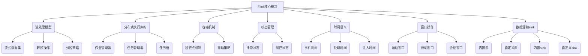

# 【AI大数据计算原理与代码实例讲解】Flink

## 1. 背景介绍

### 1.1 问题的由来

在当今大数据时代,海量数据的实时处理和分析成为了企业和组织面临的一大挑战。传统的批处理系统无法满足对实时性和低延迟的需求,而流式处理应运而生。Apache Flink作为一款开源的分布式流式数据处理引擎,凭借其低延迟、高吞吐量和准确一次语义等优势,成为了大数据领域中备受关注的流计算框架。

### 1.2 研究现状

近年来,Flink生态系统不断发展壮大,涵盖了流处理、批处理、机器学习等多个领域。越来越多的公司和组织开始采用Flink来构建实时数据处理管道,处理来自物联网、电商、金融等领域的海量数据流。与此同时,Flink社区也在不断优化和完善其核心架构和API,以提供更好的用户体验和性能。

### 1.3 研究意义

深入理解Flink的核心原理和架构设计,对于构建高性能、可靠的实时数据处理系统至关重要。本文将全面剖析Flink的内部机制,包括其流处理模型、容错机制、状态管理等核心概念,并通过代码示例和实际案例,帮助读者掌握Flink的使用和优化技巧。

### 1.4 本文结构

本文将从以下几个方面全面介绍Flink:

1. 背景介绍
2. 核心概念与联系
3. 核心算法原理与具体操作步骤
4. 数学模型和公式详细讲解与举例说明
5. 项目实践:代码实例和详细解释说明
6. 实际应用场景
7. 工具和资源推荐
8. 总结:未来发展趋势与挑战
9. 附录:常见问题与解答

## 2. 核心概念与联系

Flink的核心概念涵盖了流处理模型、分布式执行架构、容错机制、状态管理、时间语义、窗口操作以及数据源和sink等多个方面,这些概念相互关联,共同构建了Flink的核心功能。

- **流处理模型**定义了Flink如何处理无界数据流,包括流式数据集、转换操作和分区策略等概念。
- **分布式执行架构**描述了Flink如何在集群环境中执行作业,涉及作业管理器、任务管理器和任务槽等组件。
- **容错机制**保证了Flink在发生故障时能够恢复状态并继续执行,主要包括检查点机制和重启策略。
- **状态管理**使得Flink能够维护和访问作业执行过程中的状态,支持托管状态和键控状态。
- **时间语义**定义了Flink如何处理数据流中的时间信息,包括事件时间、处理时间和注入时间。
- **窗口操作**允许Flink对无界数据流进行切分,支持滚动窗口、滑动窗口和会话窗口等类型。
- **数据源和sink**定义了Flink如何从外部系统读取数据和向外部系统输出数据,包括内置和自定义的源和sink。

这些核心概念相互关联,共同构建了Flink的流处理能力。深入理解它们对于掌握Flink的使用和优化至关重要。

## 3. 核心算法原理与具体操作步骤

### 3.1 算法原理概述

Flink的核心算法原理主要包括以下几个方面:

1. **流处理模型**: Flink采用了流批一体的处理模型,将有界数据集和无界数据流统一抽象为数据流,使用相同的API和运行时执行引擎进行处理。这种模型简化了开发流程,提高了资源利用率。

2. **分布式执行架构**: Flink采用了主从架构,由一个JobManager(主节点)协调多个TaskManager(从节点)执行任务。TaskManager将任务分为多个子任务并行执行,提高了处理效率。

3. **容错机制**: Flink通过定期生成分布式快照(检查点)来实现容错,在发生故障时可以从最近的一致检查点恢复,保证了"精确一次"(Exactly-once)的语义。

4. **状态管理**: Flink将状态分为托管状态和键控状态两种类型,并提供了状态后端(如RocksDB)来高效管理和维护状态。

5. **时间语义**: Flink支持三种时间语义:事件时间、处理时间和注入时间,允许用户根据需求选择合适的时间模型。

6. **窗口操作**: Flink支持滚动窗口、滑动窗口和会话窗口等多种窗口类型,用于对无界数据流进行切分和聚合操作。

7. **优化策略**: Flink采用了多种优化策略,如自动生成高效的执行计划、基于成本模型的查询优化、自适应批处理等,提高了系统的整体性能。

这些核心算法原理共同构建了Flink强大的流处理能力,使其能够高效、可靠地处理大规模的实时数据流。

### 3.2 算法步骤详解

Flink的核心算法步骤可以概括为以下几个阶段:

1. **作业构建**

   用户通过Flink的API(如Java、Scala或Python API)构建数据流处理作业,定义数据源、转换操作、窗口操作和sink等。

2. **作业优化**

   Flink的优化器会对作业进行逻辑优化和物理优化,生成高效的执行计划。逻辑优化包括投影剪裁、常量折叠等,物理优化包括基于成本模型的操作符重排序等。

3. **作业提交**

   优化后的执行计划被提交到JobManager,JobManager将执行计划分发给TaskManager进行执行。

4. **数据处理**

   TaskManager启动多个线程并行执行任务,每个线程负责一个子任务。子任务从数据源读取数据,执行转换操作和窗口操作,并将结果输出到sink。

5. **状态管理**

   在数据处理过程中,Flink会根据配置定期生成分布式快照(检查点),将状态持久化到状态后端(如RocksDB)。

6. **容错恢复**

   如果发生故障,Flink会从最近的一致检查点恢复作业状态,重新启动失败的任务,保证"精确一次"的语义。

7. **结果输出**

   处理完成后,Flink将结果数据输出到指定的sink(如文件系统、消息队列或数据库)。

这些步骤涵盖了Flink从作业构建到执行、优化、容错恢复的整个流程,体现了Flink高效、可靠的流处理能力。

### 3.3 算法优缺点

Flink作为一款流行的流处理框架,具有以下优点:

1. **低延迟**: Flink采用了增量流处理模型,能够在数据到达时立即处理,实现毫秒级的低延迟。

2. **高吞吐量**: Flink的分布式执行架构和自动优化策略,使其能够高效利用集群资源,实现高吞吐量。

3. **准确一次语义**: Flink通过检查点机制和重启策略,保证了"精确一次"的语义,避免了数据丢失或重复计算。

4. **统一批流处理**: Flink将有界数据集和无界数据流统一抽象为数据流,使用相同的API和运行时执行引擎进行处理,简化了开发流程。

5. **丰富的API**: Flink提供了Java、Scala、Python等多种语言的API,以及基于SQL的Table API和基于Python的PyFlink等高级API,满足了不同用户的需求。

6. **与其他系统集成**: Flink可以与Hadoop、Kafka、Elasticsearch、HBase等多种系统无缝集成,构建端到端的大数据处理管道。

然而,Flink也存在一些缺点和局限性:

1. **学习曲线陡峭**: Flink的概念和API相对复杂,对于初学者来说存在一定的学习曲线。

2. **内存开销较大**: Flink为了实现低延迟和高吞吐量,需要在内存中维护大量状态,导致内存开销较大。

3. **调优复杂性**: Flink有多个可调优参数,如内存配置、并行度、检查点间隔等,调优过程较为复杂。

4. **社区支持相对有限**: 相比Spark等流行的大数据框架,Flink的社区支持和资源相对有限。

5. **流批一体模型限制**: 虽然Flink支持流批一体处理,但对于纯批处理场景,其性能可能不如专门的批处理框架(如Spark)。

总的来说,Flink是一款功能强大的流处理框架,适合构建低延迟、高吞吐量的实时数据处理管道。但在实际应用中,需要权衡其优缺点,并根据具体场景进行选型。

### 3.4 算法应用领域

Flink凭借其低延迟、高吞吐量和准确一次语义等优势,在多个领域得到了广泛应用:

1. **实时数据分析**

   Flink可以对来自物联网、电商、金融等领域的实时数据流进行实时分析和处理,如实时用户行为分析、实时风险检测、实时交易监控等。

2. **实时数据集成**

   Flink可以作为实时数据集成的中间件,从各种数据源(如Kafka、HDFS、HBase等)实时读取数据,进行转换和enrichment,然后将处理后的数据输出到下游系统(如Elasticsearch、Hbase、Kafka等)。

3. **实时机器学习**

   Flink支持在流式数据上训练和部署机器学习模型,可以应用于实时预测、实时推荐、实时异常检测等场景。

4. **事件驱动应用**

   Flink可以作为事件驱动应用的核心处理引擎,如实时报警系统、实时物流跟踪系统等。

5. **流式ETL**

   Flink可以用于构建流式ETL(Extract-Transform-Load)管道,从各种数据源实时提取数据,进行转换和清洗,然后加载到数据仓库或数据湖中。

6. **传感器数据处理**

   在物联网和工业4.0领域,Flink可以用于实时处理来自各种传感器的海量数据流,如实时设备监控、实时故障诊断等。

7. **实时报表和仪表盘**

   Flink可以与可视化工具(如Grafana、Superset等)集成,构建实时报表和仪表盘,提供实时的业务洞察和决策支持。

总的来说,Flink的应用领域非常广泛,涵盖了实时数据处理、数据集成、机器学习、事件驱动应用等多个方面,在各行各业都有着重要的应用价值。

## 4. 数学模型和公式详细讲解与举例说明

在Flink的核心算法中,涉及到一些重要的数学模型和公式,本节将对其进行详细讲解和举例说明。

### 4.1 数学模型构建

#### 4.1.1 流处理模型

Flink采用了流批一体的处理模型,将有界数据集和无界数据流统一抽象为数据流。数据流可以表示为一个无限序列:

$$