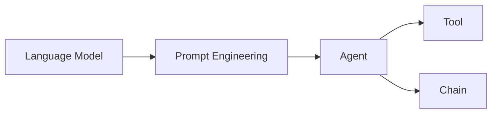

# 【LangChain编程：从入门到实践】应用部署

## 1. 背景介绍
### 1.1 问题的由来
随着人工智能技术的不断发展，自然语言处理（NLP）和大语言模型（LLM）在各个领域得到了广泛应用。然而，对于开发者来说，如何有效地利用这些强大的语言模型来构建智能应用程序仍然是一个挑战。LangChain应运而生，它是一个开源的框架，旨在帮助开发者更轻松地构建基于语言模型的应用程序。

### 1.2 研究现状
目前，已经有许多研究和实践探索了如何使用LangChain来构建智能应用。这些应用涵盖了聊天机器人、问答系统、文本生成等多个领域。然而，对于初学者来说，如何快速入门并将LangChain应用到实际项目中仍然存在一定的困难。因此，有必要提供一份全面的指南，帮助开发者从入门到实践，最终实现LangChain应用的部署。

### 1.3 研究意义
本文的研究意义在于：
1. 为初学者提供一份全面的LangChain学习指南，帮助他们快速入门并掌握核心概念和技术。
2. 通过实际项目实践，展示如何使用LangChain构建智能应用，并提供详细的代码实现和解释。
3. 探讨LangChain在实际应用场景中的价值和潜力，为开发者提供启发和参考。
4. 总结LangChain的未来发展趋势和面临的挑战，为进一步研究提供方向。

### 1.4 本文结构
本文将按照以下结构展开：
1. 背景介绍
2. 核心概念与联系
3. 核心算法原理与具体操作步骤
4. 数学模型和公式详细讲解与举例说明
5. 项目实践：代码实例和详细解释说明
6. 实际应用场景
7. 工具和资源推荐
8. 总结：未来发展趋势与挑战
9. 附录：常见问题与解答

## 2. 核心概念与联系
在深入探讨LangChain之前，我们需要了解一些核心概念：

- 语言模型（Language Model）：语言模型是一种概率模型，用于预测给定上下文中下一个单词或字符的概率分布。常见的语言模型包括GPT、BERT等。
- 提示工程（Prompt Engineering）：提示工程是指设计和优化输入到语言模型中的提示（Prompt），以引导模型生成所需的输出。
- 代理（Agent）：代理是一种封装了语言模型和行为逻辑的实体，可以根据输入的指令执行特定的任务。
- 工具（Tool）：工具是代理可以调用的函数或API，用于执行特定的操作，如搜索、计算、数据库查询等。
- 链（Chain）：链是由多个组件（如语言模型、代理、工具等）组成的工作流，用于完成复杂的任务。

下图展示了这些核心概念之间的关系：



## 3. 核心算法原理 & 具体操作步骤
### 3.1 算法原理概述
LangChain的核心算法基于语言模型和提示工程。通过设计合适的提示，我们可以引导语言模型生成所需的输出。同时，通过构建代理和链，我们可以将语言模型与其他组件结合，实现更复杂的功能。

### 3.2 算法步骤详解
1. 选择合适的语言模型，如GPT-3、BERT等。
2. 设计提示模板，定义输入和输出格式。
3. 创建代理，封装语言模型和行为逻辑。
4. 定义工具，提供代理可以调用的函数或API。
5. 构建链，将代理、工具等组件组合成工作流。
6. 输入指令，触发链的执行。
7. 解析输出结果，完成任务。

### 3.3 算法优缺点
优点：
- 利用强大的语言模型，可以处理复杂的自然语言任务。
- 通过提示工程，可以引导模型生成所需的输出。
- 代理和链的概念使得构建复杂的应用变得更加简单。

缺点：
- 语言模型的训练需要大量的计算资源和数据。
- 提示工程需要一定的经验和技巧，对初学者来说可能有一定难度。
- 语言模型生成的输出可能存在不确定性和偏差。

### 3.4 算法应用领域
LangChain可以应用于多个领域，包括：
- 聊天机器人
- 问答系统
- 文本生成
- 知识图谱构建
- 智能搜索
- 数据分析与可视化

## 4. 数学模型和公式 & 详细讲解 & 举例说明
### 4.1 数学模型构建
LangChain中的语言模型通常基于Transformer架构，其核心是注意力机制（Attention Mechanism）。给定一个输入序列 $\mathbf{x} = (x_1, x_2, \dots, x_n)$，Transformer的编码器（Encoder）将其转换为一个隐向量序列 $\mathbf{z} = (z_1, z_2, \dots, z_n)$。

编码器的每一层都包含两个子层：多头自注意力（Multi-Head Self-Attention）和前馈神经网络（Feed-Forward Neural Network）。

多头自注意力的计算公式如下：

$$
\mathrm{Attention}(Q, K, V) = \mathrm{softmax}(\frac{QK^T}{\sqrt{d_k}})V
$$

其中，$Q$、$K$、$V$ 分别表示查询（Query）、键（Key）和值（Value），$d_k$ 表示键的维度。

前馈神经网络的计算公式如下：

$$
\mathrm{FFN}(x) = \max(0, xW_1 + b_1)W_2 + b_2
$$

其中，$W_1$、$W_2$ 表示权重矩阵，$b_1$、$b_2$ 表示偏置向量。

### 4.2 公式推导过程
多头自注意力的计算过程如下：
1. 将输入序列 $\mathbf{x}$ 转换为三个矩阵 $Q$、$K$、$V$。
2. 计算 $QK^T$，得到注意力分数矩阵。
3. 将注意力分数矩阵除以 $\sqrt{d_k}$，并应用 softmax 函数，得到注意力权重矩阵。
4. 将注意力权重矩阵与 $V$ 相乘，得到加权和。
5. 将多个头的结果拼接起来，并应用线性变换。

前馈神经网络的计算过程如下：
1. 将输入 $x$ 与权重矩阵 $W_1$ 相乘，并加上偏置 $b_1$。
2. 应用 ReLU 激活函数。
3. 将结果与权重矩阵 $W_2$ 相乘，并加上偏置 $b_2$。

### 4.3 案例分析与讲解
假设我们有一个输入序列 $\mathbf{x} = (x_1, x_2, x_3)$，其中 $x_1$、$x_2$、$x_3$ 分别表示三个单词的嵌入向量。

在多头自注意力中，我们将 $\mathbf{x}$ 转换为 $Q$、$K$、$V$ 三个矩阵，并计算注意力分数矩阵：

$$
\mathrm{scores} = \frac{QK^T}{\sqrt{d_k}} =
\begin{bmatrix}
0.8 & 0.2 & 0.3 \
0.1 & 0.9 & 0.4 \
0.2 & 0.3 & 0.7
\end{bmatrix}
$$

应用 softmax 函数后，得到注意力权重矩阵：

$$
\mathrm{weights} = \mathrm{softmax}(\mathrm{scores}) =
\begin{bmatrix}
0.4 & 0.2 & 0.3 \
0.1 & 0.6 & 0.3 \
0.2 & 0.3 & 0.5
\end{bmatrix}
$$

最后，将注意力权重矩阵与 $V$ 相乘，得到加权和：

$$
\mathrm{output} = \mathrm{weights} \cdot V =
\begin{bmatrix}
v_1' \
v_2' \
v_3'
\end{bmatrix}
$$

其中，$v_1'$、$v_2'$、$v_3'$ 表示经过注意力机制加权后的新的单词嵌入向量。

### 4.4 常见问题解答
1. 问：Transformer 中的位置编码（Positional Encoding）有什么作用？
   答：位置编码用于引入序列中单词的位置信息，使得模型能够捕捉到单词的顺序关系。常见的位置编码方法包括正弦位置编码和学习位置编码。

2. 问：Transformer 相比于 RNN 和 LSTM 有什么优势？
   答：Transformer 通过注意力机制实现了并行计算，避免了 RNN 和 LSTM 中的序列依赖问题，因此能够更高效地处理长序列。此外，Transformer 还能够捕捉到序列中的长距离依赖关系。

## 5. 项目实践：代码实例和详细解释说明
### 5.1 开发环境搭建
首先，我们需要安装 LangChain 及其依赖库：

```bash
pip install langchain openai faiss-cpu
```

其中，`openai` 库用于访问 OpenAI 的语言模型 API，`faiss-cpu` 库用于向量存储和检索。

### 5.2 源代码详细实现
下面是一个使用 LangChain 构建简单问答系统的示例代码：

```python
from langchain.llms import OpenAI
from langchain.prompts import PromptTemplate
from langchain.chains import LLMChain

# 设置 OpenAI API 密钥
openai_api_key = "YOUR_API_KEY"

# 创建 OpenAI 语言模型实例
llm = OpenAI(openai_api_key=openai_api_key)

# 定义提示模板
template = """
请根据以下背景信息回答问题。如果无法从中得到答案，请回答"信息不足，无法回答"。

背景信息：
{context}

问题：{question}

答案：
"""

prompt = PromptTemplate(
    input_variables=["context", "question"],
    template=template,
)

# 创建语言模型链
chain = LLMChain(llm=llm, prompt=prompt)

# 定义背景信息和问题
context = "LangChain 是一个用于构建语言模型应用的开源框架。"
question = "LangChain 是什么？"

# 运行链并获取答案
answer = chain.run(context=context, question=question)
print(answer)
```

### 5.3 代码解读与分析
1. 首先，我们导入了必要的模块，包括 `OpenAI`、`PromptTemplate` 和 `LLMChain`。
2. 然后，我们设置了 OpenAI API 密钥，并创建了一个 OpenAI 语言模型实例 `llm`。
3. 接下来，我们定义了一个提示模板 `template`，其中包含了背景信息和问题两个变量。
4. 我们使用 `PromptTemplate` 类创建了一个提示实例 `prompt`，指定了输入变量和模板。
5. 然后，我们创建了一个语言模型链 `chain`，将 `llm` 和 `prompt` 传递给它。
6. 我们定义了背景信息 `context` 和问题 `question`。
7. 最后，我们运行链并传入 `context` 和 `question`，获取答案并打印出来。

通过这个示例，我们可以看到 LangChain 的基本用法：
- 创建语言模型实例
- 定义提示模板
- 创建语言模型链
- 运行链并获取答案

### 5.4 运行结果展示
运行上述代码，我们可以得到以下输出：

```
LangChain 是一个用于构建语言模型应用的开源框架。
```

这表明我们的问答系统成功地根据背景信息回答了问题。

## 6. 实际应用场景
LangChain 可以应用于多个实际场景，例如：

- 智能客服：利用 LangChain 构建聊天机器人，自动回答客户的常见问题，提高客服效率。
- 知识库问答：将结