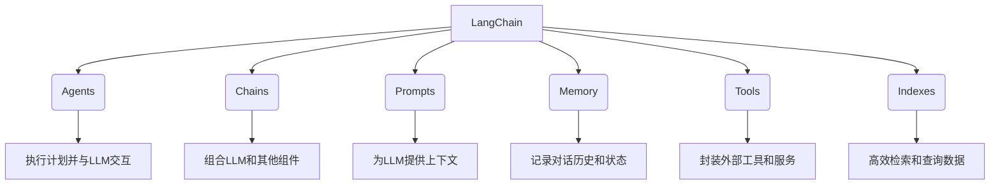
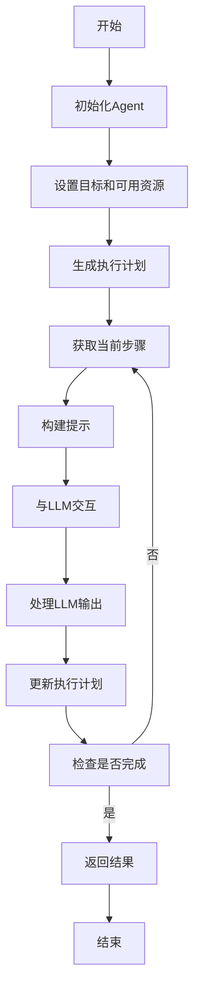

好的,我会严格遵循您提供的要求和约束条件,以专业的技术语言撰写这篇博客文章。下面是正文部分:

# 【LangChain编程:从入门到实践】快速开始

## 1. 背景介绍

### 1.1 问题的由来

在当今的数字时代,数据和信息的海量爆发使得人工智能(AI)和大型语言模型(LLM)的应用越来越广泛。作为一种新兴的编程范式,LangChain为开发人员提供了一种简单且高效的方式,将LLM与其他工具和数据源集成,构建智能应用程序。

然而,LangChain作为一个相对新兴的框架,很多开发者对其原理和使用方法还缺乏深入的理解。如何充分利用LangChain的强大功能,将LLM与其他工具和数据源无缝集成,并构建出高质量的智能应用程序,成为了一个亟待解决的问题。

### 1.2 研究现状

目前,已有一些研究人员和开发者开始探索LangChain的应用场景和实践方法。一些公司和组织也在尝试将LangChain引入到他们的产品和服务中。但总的来说,LangChain的研究和应用还处于起步阶段,缺乏系统性的指导和最佳实践。

### 1.3 研究意义

深入研究LangChain的原理和实践方法,对于推动人工智能和大型语言模型在各个领域的应用具有重要意义。通过本文的探讨,我们希望能够:

1. 帮助读者全面理解LangChain的核心概念和工作原理
2. 提供实用的编程技巧和最佳实践,指导读者构建高质量的智能应用程序
3. 分析LangChain在不同场景下的应用前景,为未来的发展提供思路和建议

### 1.4 本文结构

本文将从以下几个方面全面介绍LangChain:

1. 核心概念与联系
2. 核心算法原理与具体操作步骤
3. 数学模型和公式详细讲解与案例分析
4. 项目实践:代码实例和详细解释
5. 实际应用场景分析
6. 工具和资源推荐
7. 总结:未来发展趋势与挑战
8. 附录:常见问题与解答

## 2. 核心概念与联系

LangChain是一个用于构建应用程序与大型语言模型(LLM)和其他AI组件集成的框架。它的核心概念包括:



1. **Agents**: 代理是LangChain中的核心概念,负责规划和执行任务。它们可以根据目标和可用工具/数据生成执行计划,并与LLM交互以执行每个步骤。

2. **Chains**: 链是将LLM与其他组件(如工具、数据源等)集成的基本单元。它们定义了LLM如何与这些组件交互,以完成特定的任务。

3. **Prompts**: 提示是为LLM提供上下文和指令的关键机制。通过优化提示,可以指导LLM产生更准确和相关的输出。

4. **Memory**: 内存用于跟踪对话历史和状态,确保LLM具有持续的上下文理解能力。

5. **Tools**: 工具是对外部服务和功能的封装,使其可以与LLM集成。LangChain提供了许多预构建的工具,也支持自定义工具。

6. **Indexes**: 索引用于高效地检索和查询大型数据集,为LLM提供所需的信息。

这些核心概念相互关联,共同构建了LangChain的编程模型。开发者可以灵活组合和扩展它们,以满足特定应用场景的需求。

## 3. 核心算法原理与具体操作步骤

### 3.1 算法原理概述

LangChain的核心算法是一种基于规划的方法,用于指导LLM与其他组件的交互。其基本思路是:

1. 根据给定的目标和可用资源(工具、数据等),生成一个执行计划。
2. 将执行计划分解为一系列步骤,每个步骤都涉及与LLM的交互。
3. 在每个步骤中,为LLM提供相关的上下文和指令(提示),并获取其输出。
4. 根据LLM的输出,更新执行计划或执行相应的操作(如调用工具、查询数据等)。
5. 重复步骤3和4,直到完成整个执行计划。

该算法的关键在于生成合理的执行计划,并有效地利用LLM的能力来完成每个步骤。LangChain提供了多种策略来生成和优化执行计划,包括基于规则的方法、基于强化学习的方法等。

### 3.2 算法步骤详解

以下是LangChain核心算法的详细步骤:



1. **初始化Agent**: 根据任务需求和可用资源创建一个Agent实例。

2. **设置目标和可用资源**: 为Agent指定要完成的目标,以及可以使用的工具、数据源等资源。

3. **生成执行计划**: Agent根据目标和可用资源,生成一个初步的执行计划。

4. **获取当前步骤**: 从执行计划中获取当前需要执行的步骤。

5. **构建提示**: 根据当前步骤和上下文信息,构建一个提示,用于与LLM交互。

6. **与LLM交互**: 将提示输入LLM,获取其输出。

7. **处理LLM输出**: 分析LLM的输出,并根据需要执行相应的操作(如调用工具、查询数据等)。

8. **更新执行计划**: 根据LLM输出和执行结果,更新执行计划。

9. **检查是否完成**: 检查执行计划是否已经完成。如果完成,则返回最终结果;否则,转到步骤4,继续执行下一步。

10. **返回结果**: 将最终结果返回给用户。

通过这一系列步骤,LangChain能够将LLM的能力与其他组件无缝集成,完成复杂的任务。同时,该算法也为开发者提供了灵活性,可以根据具体需求定制执行策略和优化方法。

### 3.3 算法优缺点

LangChain核心算法的优点包括:

1. **灵活性强**: 可以将LLM与各种工具和数据源集成,满足不同应用场景的需求。
2. **可解释性好**: 执行计划和步骤明确,有利于理解和调试。
3. **可扩展性高**: 可以方便地添加新的组件和策略。

但同时也存在一些缺点和挑战:

1. **计划生成复杂**: 生成合理的执行计划是一个挑战,需要考虑目标、资源和约束条件。
2. **性能瓶颈**: 频繁与LLM交互可能导致性能下降。
3. **鲁棒性需改进**: 对于异常情况和错误输出,需要更强的容错和恢复机制。

### 3.4 算法应用领域

LangChain核心算法可以应用于各种场景,包括但不限于:

1. **问答系统**: 利用LLM的自然语言理解和生成能力,结合外部数据源,构建智能问答系统。
2. **任务自动化**: 将LLM与各种工具和API集成,实现自动化的任务执行和工作流程。
3. **决策支持**: 基于LLM的分析和推理能力,为决策过程提供支持和建议。
4. **内容创作**: 利用LLM生成高质量的文本内容,如新闻报道、营销文案等。
5. **代码开发**: 将LLM与编程工具集成,辅助代码编写、调试和文档生成等任务。

总的来说,LangChain为LLM在各个领域的应用提供了一种通用的编程范式,具有广阔的发展前景。

## 4. 数学模型和公式详细讲解与举例说明

LangChain的核心算法虽然没有直接涉及复杂的数学模型,但在特定场景下,如果需要将LLM与数学或统计模型集成,就需要一些相关的理论基础。本节将介绍一些常见的数学模型和公式,为将来的集成工作做好准备。

### 4.1 数学模型构建

在将LLM应用于数据分析、决策支持等场景时,常常需要构建数学模型来描述和解释数据。一种常见的模型构建方法是基于线性回归,其基本形式如下:

$$y = \beta_0 + \beta_1 x_1 + \beta_2 x_2 + ... + \beta_n x_n + \epsilon$$

其中:
- $y$是因变量(响应变量)
- $x_1, x_2, ..., x_n$是自变量(解释变量)
- $\beta_0, \beta_1, ..., \beta_n$是回归系数
- $\epsilon$是随机误差项

通过对观测数据进行拟合,可以估计出回归系数$\beta$,从而获得描述数据的线性模型。

除了线性回归,还有许多其他常用的模型,如逻辑回归、决策树、神经网络等。选择合适的模型需要根据具体的问题和数据特征。

### 4.2 公式推导过程

在构建数学模型的过程中,常常需要推导和转化一些公式。以最小二乘法估计线性回归模型的回归系数为例,其推导过程如下:

已知数据集$\{(x_{i1}, x_{i2}, ..., x_{in}, y_i), i=1,2,...,m\}$,目标是找到$\beta$使得残差平方和最小:

$$\sum_{i=1}^{m}(y_i - \beta_0 - \beta_1 x_{i1} - ... - \beta_n x_{in})^2 = \min$$

对$\beta_j(j=0,1,...,n)$分别求偏导数并令其等于0,可得到normal方程组:

$$\begin{cases}
\sum_{i=1}^{m}(y_i - \beta_0 - \beta_1 x_{i1} - ... - \beta_n x_{in}) = 0\
\sum_{i=1}^{m}x_{ij}(y_i - \beta_0 - \beta_1 x_{i1} - ... - \beta_n x_{in}) = 0, & j=1,2,...,n
\end{cases}$$

将normal方程组写成矩阵形式,就可以解出$\beta$的估计值。

这只是一个简单的例子,在实际应用中,推导过程可能会更加复杂。LangChain为开发者提供了与符号计算引擎(如SymPy)集成的能力,可以辅助公式的推导和转换。

### 4.3 案例分析与讲解

现在,让我们通过一个具体的案例,来看看如何将数学模型与LLM集成。假设我们需要构建一个简单的线性回归模型,预测某个城市的房价。

首先,我们需要准备房价数据集,包括房屋面积、卧室数量、年份等特征,以及实际的房价。然后,可以使用Python的scikit-learn库构建线性回归模型:

```python
from sklearn.linear_model import LinearRegression

# 加载数据
X = ... # 特征数据
y = ... # 房价数据

# 创建模型并拟合数据
model = LinearRegression()
model.fit(X, y)
```

接下来,我们可以将这个模型封装为一个LangChain工具,以便与LLM集成:

```python
from langchain.tools import PythonCallbackTool

tool = PythonCallbackTool(
    name="Linear Regression",
    description="Use this tool to predict