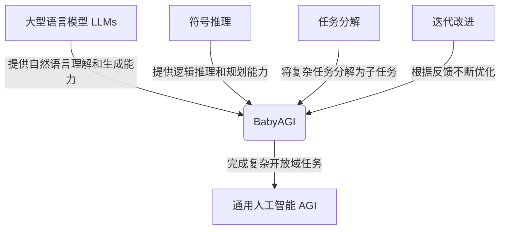
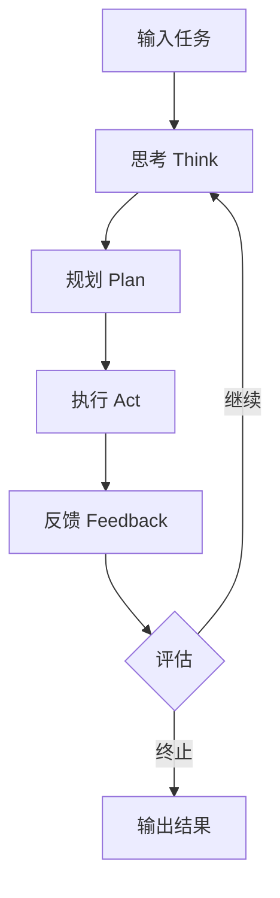

以下是《【大模型应用开发 动手做AI Agent】BabyAGI》的文章正文：

# 【大模型应用开发 动手做AI Agent】BabyAGI

## 1. 背景介绍

### 1.1 问题的由来

在当今的人工智能发展浪潮中,大型语言模型(Large Language Models, LLMs)凭借其强大的自然语言理解和生成能力,在各个领域掀起了新一轮的热潮。作为支撑这些模型的核心技术,自注意力机制(Self-Attention)和transformer架构的出现,使得模型能够捕捉长距离依赖关系,从而在处理长序列数据时表现出色。

然而,这些大型语言模型虽然拥有广博的知识,但仍然缺乏真正的"理解"和"推理"能力。它们更像是一个巨大的知识库,能够根据输入的提示生成看似合理的输出,但很难对复杂的任务进行深入思考和分析。因此,如何赋予这些大模型更强的理解和推理能力,成为了当前人工智能研究的一大挑战。

### 1.2 研究现状

为了解决上述问题,研究人员提出了将大型语言模型与其他人工智能技术相结合的方案,以弥补单一模型的不足。其中,BabyAGI(Baby Artificial General Intelligence)项目就是一个典型的尝试,它旨在通过将大型语言模型与符号推理、任务分解、迭代改进等技术相结合,构建一个初步的通用人工智能(Artificial General Intelligence, AGI)系统。

BabyAGI项目由OpenAI的Anthropic团队发起,其核心思想是利用大型语言模型的生成能力,结合一系列启发式算法,实现任务分解、规划、执行和反馈等功能,从而逐步完成复杂的开放域任务。该项目已在GitHub上开源,吸引了众多研究人员和开发者的关注。

### 1.3 研究意义

BabyAGI项目的研究意义在于,它为探索通用人工智能奠定了基础,并为大型语言模型赋予了更强的理解和推理能力。通过将符号推理、任务分解等技术与大模型相结合,BabyAGI展示了一种新的人工智能系统架构,这种架构有望突破当前人工智能系统的局限性,实现真正的通用智能。

此外,BabyAGI项目也为大模型的实际应用开发提供了宝贵的经验和启示。它展示了如何将大模型与其他技术相结合,以及如何设计和优化相关算法,为未来的大模型应用开发提供了参考和借鉴。

### 1.4 本文结构

本文将全面介绍BabyAGI项目的核心概念、算法原理、数学模型、代码实现和实际应用场景。文章结构如下:

1. 背景介绍
2. 核心概念与联系
3. 核心算法原理与具体操作步骤
4. 数学模型和公式详细讲解与举例说明
5. 项目实践:代码实例和详细解释说明
6. 实际应用场景
7. 工具和资源推荐
8. 总结:未来发展趋势与挑战
9. 附录:常见问题与解答

## 2. 核心概念与联系

BabyAGI项目涉及多个核心概念,包括大型语言模型(LLMs)、符号推理、任务分解、迭代改进等。这些概念相互关联,共同构建了BabyAGI的智能系统架构。

1. **大型语言模型(LLMs)**:BabyAGI的核心是一个经过微调的大型语言模型,它能够理解和生成自然语言,为整个系统提供语言交互和文本生成的能力。

2. **符号推理**:符号推理是人工智能中的一个重要概念,指的是基于符号和规则进行逻辑推理的过程。在BabyAGI中,符号推理用于规划和决策,帮助系统制定解决问题的策略。

3. **任务分解**:任务分解是将一个复杂的问题或目标分解为多个较小的子任务的过程。BabyAGI利用任务分解来简化问题,逐步完成整个目标。

4. **迭代改进**:迭代改进是一种循环式的优化过程,通过不断地执行、评估和调整,逐步改进系统的性能。BabyAGI通过迭代改进来优化任务规划和执行策略。

这些核心概念相互关联,共同构建了BabyAGI的智能系统架构。大型语言模型提供自然语言理解和生成能力,符号推理提供逻辑推理和规划能力,任务分解将复杂问题分解为子任务,而迭代改进则不断优化系统的性能。通过有机结合这些概念,BabyAGI旨在实现通用人工智能(AGI)的初步探索。

## 3. 核心算法原理与具体操作步骤

### 3.1 算法原理概述

BabyAGI的核心算法基于一种称为"思考-规划-执行-反馈"(Think-Plan-Act-Feedback)的循环过程。该过程可以概括为以下几个主要步骤:

1. **思考(Think)**:系统根据输入的任务,利用大型语言模型生成多个可能的解决方案或子任务。
2. **规划(Plan)**:系统使用符号推理和启发式算法,评估和优化这些解决方案,制定最佳的执行计划。
3. **执行(Act)**:系统执行规划好的步骤,可能包括生成文本、搜索信息、调用外部API等操作。
4. **反馈(Feedback)**:系统根据执行结果和人工反馈,评估当前计划的效果,并决定是否需要重新思考和规划。

这个循环过程不断重复,直到完成整个任务或达到终止条件。在每个循环中,系统都会利用大型语言模型的生成能力和符号推理的规划能力,不断优化和改进解决方案。

### 3.2 算法步骤详解

下面我们将详细介绍BabyAGI算法的具体步骤:

1. **任务输入**:用户通过自然语言输入一个开放域的任务或问题,例如"如何规划一次家庭旅行"或"如何改善公司的营销策略"等。

2. **思考(Think)过程**:
   - 大型语言模型生成多个可能的解决方案或子任务,形成一个初始的"思考列表"。
   - 系统使用一些启发式规则(如删除重复项、合并相似项等)对思考列表进行初步优化。

3. **规划(Plan)过程**:
   - 系统使用符号推理技术,对思考列表中的每个项目进行评估和打分,考虑其重要性、可行性和效率等因素。
   - 根据评分结果,系统选择最优的解决方案或子任务序列,形成一个执行计划。

4. **执行(Act)过程**:
   - 系统按照执行计划的步骤,逐步完成相应的操作,例如生成文本、搜索信息、调用API等。
   - 如果某个步骤需要人工干预或无法自动完成,系统会提示用户进行操作。

5. **反馈(Feedback)过程**:
   - 系统评估当前执行计划的效果,并收集用户的反馈。
   - 根据评估结果,系统决定是否需要重新思考和规划,或者直接输出最终结果。

6. **迭代优化**:
   - 如果需要重新思考和规划,系统会基于之前的经验和反馈,生成新的思考列表,并重复上述过程。
   - 通过不断迭代,系统逐步优化解决方案,直到完成整个任务或达到终止条件。

### 3.3 算法优缺点

BabyAGI算法的优点包括:

- 利用大型语言模型的强大生成能力,可以产生多种可能的解决方案。
- 通过符号推理和启发式算法,能够对解决方案进行评估和优化,提高效率。
- 采用迭代改进的方式,可以不断优化解决方案,逐步完成复杂任务。
- 将复杂任务分解为多个子任务,简化了问题的难度。
- 支持人工干预和反馈,提高了系统的灵活性和可控性。

但同时,BabyAGI算法也存在一些缺点和局限性:

- 算法的性能高度依赖于大型语言模型的质量和微调效果。
- 符号推理和启发式算法的设计存在一定的主观性和经验依赖。
- 对于一些非常复杂的任务,可能需要大量的迭代和优化才能得到满意的解决方案。
- 系统缺乏真正的"理解"能力,只能根据模式匹配和统计规律生成输出。
- 对于一些需要专业知识或常识推理的任务,系统的表现可能不尽人意。

### 3.4 算法应用领域

BabyAGI算法可以应用于各种开放域的任务和问题,尤其是那些需要自然语言交互、任务规划和逻辑推理的场景。具体来说,它可以应用于以下几个主要领域:

1. **任务规划和管理**:BabyAGI可以帮助用户规划和管理复杂的项目或任务,例如旅行计划、营销策略、产品开发等。

2. **问题解决和决策支持**:系统可以为用户提供多种可能的解决方案,并根据反馈不断优化,为决策提供支持。

3. **自动化流程**:BabyAGI能够将复杂的任务分解为多个子任务,并自动执行一些可以自动化的步骤,提高工作效率。

4. **智能助手**:将BabyAGI集成到聊天机器人或虚拟助手中,可以提供更智能的问答和任务处理能力。

5. **教育和学习辅助**:系统可以根据用户的需求,生成个性化的学习资源或练习,为教育和自学提供辅助。

6. **创意生成**:利用大型语言模型的文本生成能力,BabyAGI可以用于各种创意写作、内容生成等应用场景。

总的来说,BabyAGI算法为大型语言模型赋予了更强的任务规划和执行能力,使其能够应对更多开放域的复杂问题,为人工智能的发展开辟了新的道路。

## 4. 数学模型和公式详细讲解与举例说明

### 4.1 数学模型构建

在BabyAGI系统中,数学模型主要用于符号推理和规划过程。具体来说,系统需要对思考列表中的每个解决方案或子任务进行评估和打分,以确定最优的执行计划。

为了实现这一目标,我们构建了一个基于多属性效用理论(Multi-Attribute Utility Theory, MAUT)的数学模型。该模型将每个解决方案视为一个多属性决策问题,并根据多个标准(如重要性、可行性、效率等)对其进行综合评分。

设有 $n$ 个解决方案 $\{a_1, a_2, \dots, a_n\}$,每个解决方案有 $m$ 个评估属性 $\{c_1, c_2, \dots, c_m\}$,其中 $c_j$ 表示第 $j$ 个属性。我们定义一个效用函数 $U(a_i)$ 来表示解决方案 $a_i$ 的综合得分,它是各个属性得分的加权和:

$$U(a_i) = \sum_{j=1}^m w_j u_j(a_i)$$

其中,
- $w_j$ 表示第 $j$ 个属性的权重,满足 $\sum_{