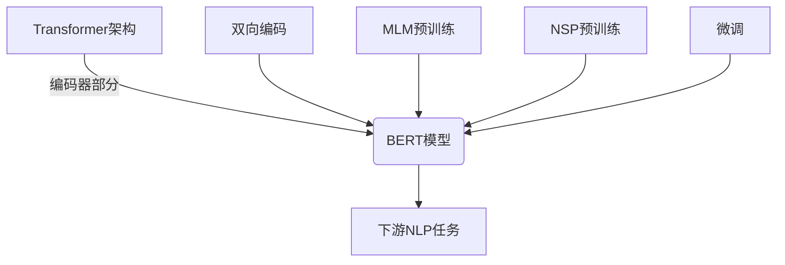

# 从零开始大模型开发与微调：BERT的基本架构与应用

## 1. 背景介绍

### 1.1 问题的由来

在自然语言处理(NLP)领域,机器学习模型需要能够理解和处理人类语言的复杂性和多样性。传统的NLP模型通常基于特征工程和规则,但是这种方法存在一些局限性,比如难以捕捉语言的上下文信息、无法很好地处理歧义等问题。因此,研究人员开始探索基于深度学习的新型NLP模型,以期获得更好的语言理解和生成能力。

### 1.2 研究现状

2018年,Google AI团队提出了BERT(Bidirectional Encoder Representations from Transformers)模型,这是一种基于Transformer的双向编码器表示,可以在大规模语料库上进行预训练,并在下游NLP任务中进行微调和迁移学习。BERT的出现引起了NLP领域的关注,因为它能够有效地捕捉语言的上下文信息,并在多项NLP基准测试中取得了出色的表现。

### 1.3 研究意义

BERT模型的成功说明,通过在大规模语料库上预训练,然后在特定任务上进行微调,可以显著提高NLP模型的性能。这种预训练和微调的范式为NLP领域带来了新的发展方向,并推动了更多大型语言模型的研究和应用。因此,深入理解BERT的基本架构和原理,对于开发和优化大型NLP模型具有重要意义。

### 1.4 本文结构

本文将从以下几个方面详细介绍BERT模型:

1. 核心概念与联系
2. 核心算法原理与具体操作步骤
3. 数学模型和公式详细讲解与案例分析
4. 项目实践:代码实例和详细解释说明
5. 实际应用场景
6. 工具和资源推荐
7. 总结:未来发展趋势与挑战
8. 附录:常见问题与解答

## 2. 核心概念与联系

BERT模型的核心概念包括:

1. **Transformer架构**: BERT基于Transformer的编码器部分,利用多头注意力机制来捕捉输入序列中的上下文信息。

2. **双向编码**: 与传统的单向语言模型不同,BERT采用了双向编码,即在编码时同时考虑了序列的前后上下文信息。

3. **Masked Language Model(MLM)**: BERT在预训练阶段使用了掩码语言模型(MLM)任务,通过随机掩码部分输入tokens,并预测这些被掩码的tokens。

4. **下一句预测(Next Sentence Prediction, NSP)**: BERT还使用了下一句预测任务,判断两个句子是否连续出现。

5. **预训练与微调**: BERT首先在大规模语料库上进行无监督预训练,获得通用的语言表示;然后在特定的NLP任务上进行有监督微调,将预训练的模型迁移到下游任务。

这些核心概念相互关联,共同构建了BERT模型的基本架构和工作原理。下面将详细介绍BERT的算法原理和数学模型。

## 3. 核心算法原理与具体操作步骤

### 3.1 算法原理概述

BERT模型的核心算法原理可以概括为以下几个方面:

1. **Transformer编码器**: BERT使用了Transformer的编码器部分,通过多头注意力机制捕捉输入序列的上下文信息。

2. **双向编码**: BERT采用了双向编码方式,即在编码时同时考虑了序列的前后上下文信息,从而获得更好的语义表示。

3. **Masked Language Model(MLM)预训练**: BERT在预训练阶段使用了掩码语言模型(MLM)任务。具体来说,模型会随机选择一些输入tokens,并将它们用特殊的[MASK]标记替换。然后,模型需要根据其他tokens的上下文信息,预测这些被掩码的tokens。这种方式可以让模型学习到更好的双向语义表示。

4. **Next Sentence Prediction(NSP)预训练**: BERT还使用了下一句预测(NSP)任务。在这个任务中,模型会获得两个句子作为输入,需要判断第二个句子是否为第一个句子的下一句。这个任务可以让模型捕捉句子之间的关系和连贯性。

5. **预训练与微调**: BERT首先在大规模语料库上进行无监督预训练,获得通用的语言表示;然后在特定的NLP任务上进行有监督微调,将预训练的模型迁移到下游任务。

通过上述算法原理,BERT模型可以学习到更好的语言表示,并在下游NLP任务中取得出色的表现。

### 3.2 算法步骤详解

BERT模型的训练和使用过程可以分为以下几个步骤:

1. **数据预处理**:
   - 将文本数据转换为BERT模型可接受的输入格式,即将每个句子/段落转换为token序列。
   - 在每个序列的开头添加特殊的[CLS]标记,用于后续的分类任务。
   - 对于NSP任务,需要将两个句子拼接为一个序列,并在中间插入特殊的[SEP]标记。
   - 执行词元化(tokenization)操作,将单词转换为BERT词元(WordPiece)。
   - 将词元映射为对应的词元ID。

2. **MLM预训练**:
   - 随机选择一些输入tokens,并用特殊的[MASK]标记替换。
   - 将替换后的序列输入BERT模型,模型需要预测被掩码的tokens。
   - 使用交叉熵损失函数优化模型参数。

3. **NSP预训练**:
   - 将两个句子拼接为一个序列,并添加特殊标记[CLS]和[SEP]。
   - 将序列输入BERT模型,从[CLS]标记对应的输出向量中获取句子级别的表示。
   - 使用这个表示,通过一个简单的分类器预测两个句子是否连续出现。
   - 使用二元交叉熵损失函数优化模型参数。

4. **微调**:
   - 在特定的NLP任务上,根据任务的输入格式对数据进行预处理。
   - 将预处理后的数据输入到BERT模型,获取对应的输出表示。
   - 在BERT模型的输出表示之上,添加一个适合当前任务的输出层(如分类器或序列标注层)。
   - 在任务的训练数据上进行有监督微调,优化BERT模型和输出层的参数。
   - 在测试集上评估模型的性能。

通过上述步骤,BERT模型可以在大规模语料库上进行无监督预训练,获得通用的语言表示;然后在特定的NLP任务上进行微调,将预训练的模型迁移到下游任务,从而取得出色的表现。

### 3.3 算法优缺点

BERT模型具有以下优点:

1. **双向编码**:能够同时捕捉序列的前后上下文信息,提高了语义表示的质量。
2. **预训练和微调范式**:通过在大规模语料库上预训练,然后在特定任务上微调,可以显著提高模型的性能。
3. **泛化能力强**:预训练的BERT模型可以在多种NLP任务上进行微调和迁移学习,具有良好的泛化能力。
4. **出色的表现**:在多项NLP基准测试中取得了state-of-the-art的表现。

但BERT模型也存在一些缺点和局限性:

1. **计算资源需求高**:BERT模型通常包含数亿个参数,在训练和推理时需要消耗大量的计算资源。
2. **序列长度限制**:由于内存限制,BERT模型只能处理长度有限的序列,无法直接应用于长文本任务。
3. **缺乏交互性**:BERT是一个编码器模型,无法直接生成文本序列,需要与其他模型(如GPT)结合使用。
4. **预训练数据偏差**:BERT的预训练语料库可能存在一定的偏差,导致模型在某些领域的表现不佳。

### 3.4 算法应用领域

由于BERT模型在多种NLP任务上表现出色,因此它已被广泛应用于以下领域:

1. **文本分类**:如新闻分类、情感分析、垃圾邮件检测等。
2. **序列标注**:如命名实体识别、关系抽取、事件抽取等。
3. **问答系统**:如阅读理解、开放域问答等。
4. **文本摘要**:自动生成文本摘要。
5. **机器翻译**:作为编码器,BERT可以与序列到序列模型结合,应用于机器翻译任务。
6. **其他NLP任务**:如文本生成、对话系统、语音识别等。

除了NLP领域,BERT模型的思想也被推广应用于计算机视觉、推荐系统等其他领域,展现出了广阔的应用前景。

## 4. 数学模型和公式详细讲解与举例说明

### 4.1 数学模型构建

BERT模型的核心是基于Transformer的编码器部分,因此我们首先介绍Transformer的数学模型。

Transformer模型主要由三个子层组成:多头注意力机制(Multi-Head Attention)、前馈神经网络(Feed-Forward Neural Network)和残差连接(Residual Connection)。

#### 4.1.1 多头注意力机制

多头注意力机制是Transformer的核心部分,它能够捕捉输入序列中不同位置之间的依赖关系。

对于一个长度为 $n$ 的输入序列 $X = (x_1, x_2, \dots, x_n)$,其中 $x_i \in \mathbb{R}^{d_x}$ 是 $d_x$ 维的词嵌入向量,多头注意力机制的计算过程如下:

1. 首先,将输入序列 $X$ 线性映射到查询(Query)、键(Key)和值(Value)向量:

$$
\begin{aligned}
Q &= XW^Q \
K &= XW^K \
V &= XW^V
\end{aligned}
$$

其中 $W^Q \in \mathbb{R}^{d_x \times d_k}$、$W^K \in \mathbb{R}^{d_x \times d_k}$ 和 $W^V \in \mathbb{R}^{d_x \times d_v}$ 是可学习的线性映射矩阵。

2. 计算查询 $Q$ 和键 $K$ 的缩放点积注意力权重:

$$
\text{Attention}(Q, K, V) = \text{softmax}\left(\frac{QK^T}{\sqrt{d_k}}\right)V
$$

其中 $d_k$ 是缩放因子,用于防止内积值过大导致梯度消失或爆炸。

3. 多头注意力机制将 $h$ 个注意力头的结果进行拼接:

$$
\text{MultiHead}(Q, K, V) = \text{Concat}(\text{head}_1, \dots, \text{head}_h)W^O
$$

其中 $\text{head}_i = \text{Attention}(QW_i^Q, KW_i^K, VW_i^V)$,并且 $W_i^Q \in \mathbb{R}^{d_x \times d_k}$、$W_i^K \in \mathbb{R}^{d_x \times d_k}$、$W_i^V \in \mathbb{R}^{d_x \times d_v}$ 和 $W^O \in \mathbb{R}^{hd_v \times d_x}$ 都是可学习的线性映射矩阵。

通过多头注意力机制,Transformer能够同时捕捉不同表示子空间中的依赖关系,提高了模型的表示能力。

#### 4.1.2 前馈神经网络

除了多头注意力机制,Transformer还包含一个前馈神经网络子层,它对每个位置的表示进行独立的非线性映射:

$$
\text{FFN}(x) = \max(0, xW_1 + b_1)W_2 + b_2
$$

其中 $W_1 \in \mathbb{R}^{d_x \times d_{ff}}$、$b_1 \in \mathbb{R}^{d_{ff}}$、$W_2 \in \mathbb{R}^{d_{ff} \times d_x}$ 和 $b_2 