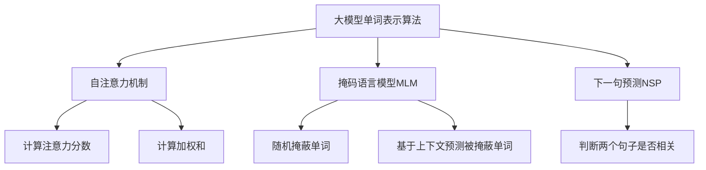

以下是根据您的要求撰写的技术博客文章《从零开始大模型开发与微调：单词的文本处理》的正文内容：

# 从零开始大模型开发与微调：单词的文本处理

## 1. 背景介绍

### 1.1 问题的由来

在自然语言处理(NLP)领域中,单词是文本数据的基本单元。对单词的表示和处理是许多NLP任务(如文本分类、机器翻译、问答系统等)的基础。传统的单词表示方法通常使用one-hot编码,将每个单词映射为一个高维稀疏向量。然而,这种方法存在一些缺陷:无法捕捉单词之间的语义关系,导致数据维度灾难,且难以泛化到未见单词。

### 1.2 研究现状

为了解决上述问题,研究人员提出了多种单词嵌入技术,如Word2Vec、GloVe等,将单词映射到低维密集向量空间,能够较好地捕捉单词语义信息。但这些技术主要基于小数据集训练,无法充分利用大规模语料,难以学习到更精确的单词表示。

随着深度学习的发展,大模型(large model)凭借其强大的表示能力和泛化性能,在NLP领域取得了卓越的成就。通过预训练大模型(如BERT、GPT等)在海量无标注语料上,可以学习到更丰富的语义和上下文信息,为下游NLP任务提供强大的单词表示能力。

### 1.3 研究意义

本文旨在介绍如何从零开始开发和微调大模型,用于单词的文本处理任务。我们将探讨大模型在单词表示中的优势,介绍其核心概念和算法原理,并通过数学模型和公式推导加深理解。同时,我们将提供实践案例,包括开发环境搭建、代码实现、结果分析等,帮助读者掌握大模型在单词表示中的实际应用。最后,我们将讨论大模型在单词表示领域的未来发展趋势和挑战。

### 1.4 本文结构

本文包括以下几个主要部分:

1. 背景介绍
2. 核心概念与联系
3. 核心算法原理与具体操作步骤
4. 数学模型和公式详细讲解与举例说明
5. 项目实践:代码实例和详细解释说明
6. 实际应用场景
7. 工具和资源推荐
8. 总结:未来发展趋势与挑战
9. 附录:常见问题与解答

## 2. 核心概念与联系

在介绍大模型在单词表示中的核心算法原理之前,我们先来了解一些重要的核心概念及其联系。

1. **自注意力机制(Self-Attention Mechanism)**: 自注意力机制是大模型(如Transformer)的核心组件,它允许模型捕捉输入序列中任意两个位置之间的依赖关系,从而更好地建模长距离依赖。这对于学习单词在上下文中的语义表示至关重要。

2. **掩码语言模型(Masked Language Model, MLM)**: MLM是大模型(如BERT)的核心训练目标之一。它通过在输入序列中随机掩蔽部分单词,然后让模型基于上下文预测被掩蔽单词,从而学习到单词的上下文语义表示。

3. **下一句预测(Next Sentence Prediction, NSP)**: NSP是BERT等大模型的另一个训练目标,旨在捕捉句子之间的关系,从而提高模型对长范围依赖的建模能力,进一步增强单词表示的质量。

4. **预训练(Pre-training)和微调(Fine-tuning)**: 大模型通常采用两阶段训练策略。首先在大规模无标注语料上进行预训练,学习通用的语言表示;然后在特定任务的标注数据上进行微调,将预训练的知识迁移到目标任务。这种策略可以显著提高模型的泛化能力和性能。

5. **子词分词(Subword Tokenization)**: 为了处理未见单词和构词规则,大模型通常采用基于字节对编码(BPE)或WordPiece等算法将单词分割成子词,从而减少词表大小,提高模型的泛化能力。

6. **位置编码(Positional Encoding)**: 由于自注意力机制没有捕捉序列顺序的能力,因此需要为输入序列添加位置编码,以注入位置信息。常见的位置编码方法包括正弦位置编码和可学习的位置嵌入。

上述概念相互关联,共同构建了大模型在单词表示领域的理论基础和技术框架。下一节我们将深入探讨大模型在单词表示中的核心算法原理。

## 3. 核心算法原理与具体操作步骤

在本节中,我们将介绍大模型在单词表示中的核心算法原理,包括自注意力机制、掩码语言模型和下一句预测等,并详细阐述它们的具体操作步骤。

### 3.1 算法原理概述

大模型在单词表示中的核心算法原理可以概括为以下三个主要部分:

1. **自注意力机制**: 自注意力机制是大模型的核心组件,它通过计算输入序列中每个单词与其他单词的注意力分数,并基于这些分数计算加权和,从而捕捉单词之间的依赖关系,学习到更丰富的单词表示。

2. **掩码语言模型(MLM)**: MLM是大模型的主要训练目标之一。它通过在输入序列中随机掩蔽部分单词,然后让模型基于上下文预测被掩蔽单词,从而学习到单词在上下文中的语义表示。

3. **下一句预测(NSP)**: NSP是大模型的另一个训练目标,它通过判断两个句子是否相关,从而捕捉句子之间的关系,进一步增强单词表示的质量。

这三个部分相互协同,共同构建了大模型在单词表示领域的核心算法框架。下面我们将详细介绍每个部分的具体操作步骤。

### 3.2 算法步骤详解

#### 3.2.1 自注意力机制

自注意力机制的主要步骤如下:

1. **计算Query、Key和Value矩阵**:
   - 将输入序列 $X = (x_1, x_2, \dots, x_n)$ 分别通过三个线性变换,得到 Query 矩阵 $Q$、Key 矩阵 $K$ 和 Value 矩阵 $V$。
   - $Q = XW_Q$, $K = XW_K$, $V = XW_V$

2. **计算注意力分数**:
   - 对于每个查询单词 $q_i$,计算它与所有键单词 $k_j$ 的注意力分数 $\alpha_{ij}$:
   - $\alpha_{ij} = \text{softmax}(\frac{q_i k_j^T}{\sqrt{d_k}})$
   - 其中 $d_k$ 是缩放因子,用于防止点积值过大导致梯度饱和。

3. **计算加权和**:
   - 将每个查询单词 $q_i$ 的注意力分数与对应的值向量 $v_j$ 相乘,然后求和,得到加权和向量 $z_i$:
   - $z_i = \sum_{j=1}^n \alpha_{ij} v_j$

4. **多头注意力**:
   - 为了捕捉不同的注意力模式,通常会使用多头注意力机制,将多个注意力头的输出拼接在一起。

通过自注意力机制,大模型可以捕捉输入序列中任意两个位置之间的依赖关系,从而学习到更丰富的单词表示。

#### 3.2.2 掩码语言模型(MLM)

掩码语言模型的主要步骤如下:

1. **随机掩蔽单词**:
   - 在输入序列中随机选择 15% 的单词进行掩蔽。
   - 对于被选中的单词,有 80% 的概率用特殊标记 `[MASK]` 替换,10% 的概率用随机单词替换,剩余 10% 保持不变。

2. **前向传播**:
   - 将掩蔽后的输入序列输入到大模型中进行前向传播,得到每个被掩蔽位置的输出向量。

3. **预测被掩蔽单词**:
   - 对于每个被掩蔽的位置,将对应的输出向量通过一个分类器(通常是线性层加 Softmax),预测被掩蔽单词的概率分布。

4. **计算损失并反向传播**:
   - 将预测的概率分布与真实单词的 one-hot 编码计算交叉熵损失。
   - 对整个模型进行反向传播,更新参数。

通过掩码语言模型的训练,大模型可以学习到单词在上下文中的语义表示,从而提高单词表示的质量。

#### 3.2.3 下一句预测(NSP)

下一句预测的主要步骤如下:

1. **构建输入对**:
   - 从语料库中随机抽取两个句子,构成一个输入对 `(A, B)`。
   - 有 50% 的概率,B 是 A 的下一句;有 50% 的概率,B 是一个随机句子。

2. **前向传播**:
   - 将输入对 `(A, B)` 输入到大模型中进行前向传播,得到句子对的综合表示向量。

3. **二分类预测**:
   - 将综合表示向量通过一个二分类器(通常是线性层加 Sigmoid),预测 B 是否为 A 的下一句。

4. **计算损失并反向传播**:
   - 将预测的概率与真实标签计算二元交叉熵损失。
   - 对整个模型进行反向传播,更新参数。

通过下一句预测的训练,大模型可以捕捉句子之间的关系,从而进一步增强单词表示的质量。

### 3.3 算法优缺点

大模型在单词表示中的算法具有以下优点:

1. **捕捉长距离依赖**:自注意力机制可以直接捕捉输入序列中任意两个位置之间的依赖关系,从而更好地建模长距离依赖,提高单词表示的质量。

2. **利用大规模语料**:通过在海量无标注语料上进行预训练,大模型可以学习到更丰富的语义和上下文信息,从而获得更精确的单词表示。

3. **泛化能力强**:采用子词分词和位置编码等技术,大模型可以很好地处理未见单词和构词规则,提高了模型的泛化能力。

4. **可迁移性强**:预训练后的大模型可以通过微调的方式迁移到下游任务,显著提高了模型的性能和训练效率。

然而,大模型在单词表示中也存在一些缺点和挑战:

1. **计算资源消耗大**:训练大模型需要消耗大量的计算资源,包括GPU、内存等,对硬件要求较高。

2. **训练时间长**:由于模型参数众多,在大规模语料上进行预训练通常需要较长的训练时间。

3. **解释性差**:大模型内部机制较为复杂,缺乏足够的解释性,难以解释模型的决策过程。

4. **鲁棒性问题**:大模型可能对一些对抗样本(如对抗文本)较为脆弱,存在一定的鲁棒性问题。

### 3.4 算法应用领域

大模型在单词表示中的算法广泛应用于自然语言处理的各个领域,包括但不限于:

1. **文本分类**:利用大模型学习到的丰富单词表示,可以提高文本分类的性能,如新闻分类、情感分析等。

2. **机器翻译**:大模型可以捕捉单词在源语言和目标语言中的语义对应关系,从而提高机器翻译的质量。

3. **问答系统**:通过大模型学习到的单