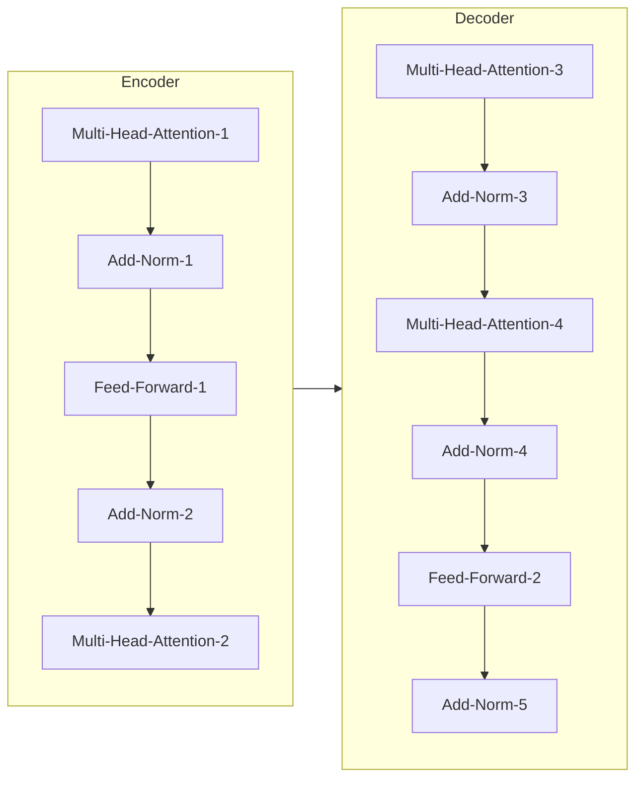

以下是题为《大规模语言模型从理论到实践 数据规模》的技术博客正文：

# 大规模语言模型从理论到实践 数据规模

## 1. 背景介绍

### 1.1 问题的由来

随着人工智能技术的飞速发展,大规模语言模型已经成为自然语言处理领域的关键技术之一。传统的语言模型通常基于有限的数据集进行训练,但其性能和泛化能力往往受到数据规模的限制。为了突破这一瓶颈,研究人员开始探索利用海量数据训练大规模语言模型的可能性。

大规模语言模型旨在从大量无标注文本数据中学习语言的内在规律和知识,从而提高模型在各种自然语言处理任务上的性能。然而,训练大规模语言模型面临着数据获取、模型优化、计算资源等诸多挑战。

### 1.2 研究现状  

近年来,一些科技公司和研究机构已经开始投入大量资源训练大规模语言模型。例如:

- OpenAI的GPT-3模型使用了约1750亿个参数,训练数据集包含约5000亿个token。
- Google的Switch Transformer模型使用了约1.6万亿个参数,是目前最大的语言模型。
- 百度的Wu Dao 2.0 Pre-Trained模型使用了约1.75万亿个参数,在多项自然语言处理任务上取得了领先成绩。

这些大规模语言模型展现出了令人惊叹的性能,在自然语言生成、理解、推理等任务上都取得了突破性进展。

### 1.3 研究意义

大规模语言模型的研究对于推动自然语言处理技术的发展具有重要意义:

1. 提高语言理解和生成能力,为开发更智能的对话系统、问答系统等应用奠定基础。
2. 探索从海量无标注数据中高效学习知识的新范式,推动人工智能技术向通用人工智能迈进。
3. 促进硬件和算法的创新,为训练更大规模的模型提供计算支持。
4. 为语言模型在各种领域的应用提供强大的基础模型,降低开发成本。

### 1.4 本文结构

本文将全面介绍大规模语言模型的理论基础、核心算法、训练技术、应用场景等内容。具体包括以下几个方面:

1. 核心概念与联系
2. 核心算法原理与具体操作步骤  
3. 数学模型和公式详细讲解与案例分析
4. 项目实践:代码实例和详细解释说明
5. 实际应用场景分析
6. 工具和资源推荐  
7. 总结:未来发展趋势与挑战
8. 附录:常见问题与解答

## 2. 核心概念与联系

在探讨大规模语言模型的细节之前,我们先介绍一些核心概念:

1. **语言模型(Language Model)**: 用于捕获语言的统计规律,估计一个语句或词序列的概率分布。是自然语言处理的基础技术。

2. **自然语言处理(Natural Language Processing, NLP)**: 研究计算机处理人类语言的方法,包括语音识别、文本挖掘、对话系统等应用。

3. **自监督学习(Self-Supervised Learning)**: 利用无标注数据进行训练的机器学习范式,通过预测任务捕获数据的内在规律。

4. **迁移学习(Transfer Learning)**: 将在源领域学习到的知识迁移到目标领域的技术,可提高目标任务的性能。

5. **预训练(Pre-training)**: 在大规模无标注数据上初始化模型参数,为下游任务提供良好的初始化。

6. **微调(Fine-tuning)**: 在特定任务的标注数据上进一步调整预训练模型参数,使其适应目标任务。

大规模语言模型本质上是一种自监督预训练模型,通过学习无标注语料的统计规律获得通用的语言表示能力,然后可以通过微调等技术将这些知识迁移到下游的自然语言处理任务中,提高任务性能。

下面我们将介绍大规模语言模型的核心算法原理和训练技术。

## 3. 核心算法原理与具体操作步骤

### 3.1 算法原理概述

大规模语言模型的核心算法是**Transformer**,由Google的Vaswani等人在2017年提出。Transformer完全基于注意力机制,摒弃了传统序列模型中的循环和卷积结构,大幅提高了并行计算能力。

Transformer的基本思想是将输入序列看作是一个集合,每个位置的单词与其他位置单词之间都存在直接的连接,通过自注意力机制捕获它们之间的长程依赖关系。

如上图所示,Transformer由编码器(Encoder)和解码器(Decoder)组成:

- **编码器**将输入序列进行编码,得到其语义表示。
- **解码器**则将编码器的输出与输入序列的前缀结合,生成序列的下一个单词。

编码器和解码器内部都由多个相同的层组成,每一层都包含两个关键的子层:

1. **Multi-Head Attention层**: 用于计算序列中每个单词与其他单词的关系。
2. **Feed Forward层**: 对每个单词的表示进行非线性变换,提取更高层次的特征。

通过堆叠多个这样的层,Transformer就能够高效地学习到输入序列的长程依赖关系,并生成目标序列。

### 3.2 算法步骤详解

我们进一步详细介绍Transformer的关键步骤:

**1. 词嵌入和位置编码**

首先,将输入序列的每个单词映射为一个连续的向量表示,即词嵌入(Word Embedding)。然后,为了使模型能够捕获单词在序列中的位置信息,需要为每个单词添加位置编码(Positional Encoding)。

**2. 多头注意力机制**

注意力机制是Transformer的核心,它能够自动捕获输入序列中任意两个单词之间的关系。具体来说,对于每个单词,都需要计算其与全部其他单词的注意力分数,然后根据这些分数对其他单词的表示进行加权求和,作为该单词的注意力表示。

为了提高计算效率和表达能力,Transformer采用了多头注意力(Multi-Head Attention)机制,将注意力过程分成多个子空间进行计算,最后将所有子空间的结果拼接起来。

**3. 前馈网络** 

在注意力层之后,Transformer使用了前馈全连接网络对每个单词的表示进行非线性变换,提取更高层次的特征。这一步类似于传统神经网络中的隐藏层。

**4. 残差连接和层归一化**

为了更好地传递梯度信号,避免梯度消失或爆炸,Transformer在每个子层之后都使用了残差连接(Residual Connection)和层归一化(Layer Normalization)。

**5. 掩码机制**

在解码器中,为了防止模型利用将来的信息,需要在注意力计算时对未来的位置进行掩码(Masking),确保每个位置的单词只与之前的单词有关。

**6. 解码**

解码器将编码器的输出与目标序列的前缀结合,通过掩码多头注意力和前馈网络,逐个生成目标序列的单词。

### 3.3 算法优缺点

**优点**:

1. 并行能力强,计算效率高。
2. 能够有效捕获长程依赖关系。
3. 无递归和卷积结构,结构简单、可解释性好。
4. 适用于多种序列建模任务。

**缺点**:

1. 计算复杂度较高,需要大量计算资源。
2. 对长序列的处理能力有限。
3. 需要大量数据进行有效训练。
4. 生成的序列可能缺乏一致性和连贯性。

### 3.4 算法应用领域

Transformer及其变体已经广泛应用于自然语言处理的各个领域:

- **机器翻译**: 将一种语言的文本翻译成另一种语言。
- **文本生成**: 根据提示自动生成文本,如新闻、小说、广告等。
- **文本摘要**: 自动生成文本的摘要。 
- **对话系统**: 与人类进行自然对话交互。
- **问答系统**: 根据知识库回答人类提出的问题。
- **代码生成**: 根据需求自动生成计算机程序代码。
- **蛋白质结构预测**: 预测蛋白质的三维结构。

## 4. 数学模型和公式详细讲解与举例说明

在介绍Transformer算法的数学模型之前,我们先回顾一下传统的语言模型。

### 4.1 数学模型构建

**传统语言模型**

传统语言模型的目标是估计一个词序列 $w_1, w_2, ..., w_T$ 的概率:

$$P(w_1, w_2, ..., w_T) = \prod_{t=1}^T P(w_t | w_1, ..., w_{t-1})$$

其中 $P(w_t | w_1, ..., w_{t-1})$ 表示已知前 $t-1$ 个词时,第 $t$ 个词的条件概率。

这种语言模型通常由神经网络或者n-gram模型来实现。但由于计算复杂度的原因,它们只能考虑有限的上下文窗口,难以捕获长程依赖关系。

**Transformer语言模型**

Transformer则将语言模型看作是一个序列到序列(Seq2Seq)的建模问题。给定一个长度为T的输入序列 $x = (x_1, x_2, ..., x_T)$,我们希望生成一个长度为 $T'$ 的输出序列 $y = (y_1, y_2, ..., y_{T'})$。

具体来说,Transformer基于自注意力机制,直接对输入序列建模:

$$P(y | x) = \prod_{t=1}^{T'} P(y_t | y_1, ..., y_{t-1}, x)$$

其中,每个条件概率 $P(y_t | y_1, ..., y_{t-1}, x)$ 都是通过Transformer解码器计算得到的。解码器将编码器的输出(即输入序列的表示)与已生成的部分序列 $y_1, ..., y_{t-1}$ 结合,生成下一个单词 $y_t$ 的概率分布。

在语言模型的场景中,输入序列 $x$ 和输出序列 $y$ 实际上是同一个序列,即自回归建模(Autoregressive Modeling)。因此,Transformer语言模型的目标是最大化如下概率:

$$\max_\theta \prod_{t=1}^T P(x_t | x_1, ..., x_{t-1}; \theta)$$

其中 $\theta$ 表示模型参数。

### 4.2 公式推导过程

接下来我们具体推导Transformer中自注意力机制的计算过程。

假设输入序列为 $\boldsymbol{x} = (\boldsymbol{x}_1, \boldsymbol{x}_2, ..., \boldsymbol{x}_n)$,其中每个 $\boldsymbol{x}_i \in \mathbb{R}^{d_x}$ 表示第 $i$ 个单词的词嵌入向量。

**1. 计算查询(Query)、键(Key)和值(Value)向量**

我们将输入序列 $\boldsymbol{x}$ 分别与三个不同的投影矩阵 $\boldsymbol{W}_Q, \boldsymbol{W}_K, \boldsymbol{W}_V$ 相乘,得到查询(Query)序列 $\boldsymbol{Q}$、键(Key)序列 $\boldsymbol{K}$ 和值(Value)序列 $\boldsymbol{V}$:

$$\begin{aligned}
\boldsymbol{Q} &= \boldsymbol{x} \boldsymbol{W}_Q \
\boldsymbol{K} &= \bol