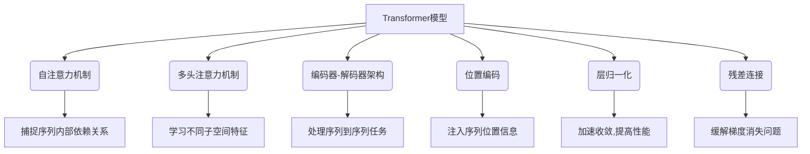

# 测试Transformer模型

## 1. 背景介绍

### 1.1 问题的由来

在自然语言处理(NLP)和序列数据建模领域,很长一段时间以来,循环神经网络(RNN)一直是主导架构。然而,RNN在处理长序列时容易出现梯度消失或爆炸的问题,这限制了它们在捕捉长期依赖关系方面的能力。为了解决这个问题,Transformer模型应运而生。

Transformer是2017年由Google的Vaswani等人在论文"Attention Is All You Need"中提出的一种全新的基于注意力机制的神经网络架构。它完全摒弃了RNN的序列结构,使用自注意力(Self-Attention)机制来捕捉输入序列中任意两个位置之间的依赖关系,从而更好地处理长期依赖问题。

自从Transformer被提出以来,它在机器翻译、文本生成、语音识别等多个NLP任务上取得了卓越的表现,成为了NLP领域的新标杆模型。此外,Transformer的思想也被推广应用到了计算机视觉、推荐系统等其他领域,产生了深远的影响。

### 1.2 研究现状

Transformer模型的出现引发了学术界和工业界的广泛关注,相关研究工作如火如荼。主要研究方向包括:

1. **模型优化**:通过改进注意力机制、位置编码、层归一化等模块,提升Transformer在各种任务上的性能表现。
2. **高效计算**:探索稀疏注意力、局部注意力等方法,降低Transformer的计算复杂度,使其能够应用于更长的序列。
3. **可解释性**:研究Transformer内部注意力机制的可解释性,揭示模型学习到的语义知识。
4. **多模态融合**:将Transformer应用于视觉、语音等多模态任务,实现不同模态之间的交互和融合。
5. **迁移学习**:利用大规模预训练的Transformer模型(如BERT、GPT等),在下游任务上进行微调,提高性能。

### 1.3 研究意义

Transformer模型在NLP领域取得了革命性的突破,它的研究具有重要的理论意义和应用价值:

- **理论意义**:Transformer提出了全新的基于注意力的序列建模范式,推动了深度学习理论的发展,为解决长期依赖问题提供了新的思路。
- **应用价值**:Transformer已经在机器翻译、文本生成、问答系统等众多NLP任务中获得了广泛应用,极大提升了这些任务的性能水平。随着研究的不断深入,Transformer有望在更多领域发挥重要作用。

### 1.4 本文结构

本文将全面介绍Transformer模型的核心概念、算法原理、数学模型、实现细节和应用场景,内容安排如下:

1. 背景介绍
2. 核心概念与联系
3. 核心算法原理与具体操作步骤
4. 数学模型和公式详细讲解与举例说明
5. 项目实践:代码实例和详细解释说明
6. 实际应用场景
7. 工具和资源推荐
8. 总结:未来发展趋势与挑战
9. 附录:常见问题与解答

## 2. 核心概念与联系

在深入探讨Transformer模型之前,我们先介绍几个核心概念,为后续内容做好铺垫。

### 2.1 自注意力机制(Self-Attention)

Self-Attention是Transformer的核心组件,它能够捕捉输入序列中任意两个位置之间的依赖关系。与RNN中的序列结构不同,Self-Attention直接建模符号之间的关联,克服了长期依赖问题。

在Self-Attention中,每个输入位置都会与其他所有位置进行关联,生成一个注意力分数向量。该向量表示当前位置对其他位置的重视程度,通过加权求和的方式捕获全局依赖关系。

### 2.2 多头注意力机制(Multi-Head Attention)

为了捕捉不同的子空间特征,Transformer引入了多头注意力机制。它将注意力机制复制成多个"头"(Head),每个头对输入序列进行不同的线性投影,然后并行执行注意力操作。最后,将所有头的输出进行拼接,形成最终的注意力表示。

多头注意力机制赋予了模型学习不同注意力表示的能力,提高了模型的表达能力。

### 2.3 编码器-解码器架构(Encoder-Decoder)

Transformer采用了编码器-解码器的序列到序列(Seq2Seq)架构,用于处理机器翻译等任务。

- **编码器(Encoder)**:将源语言序列作为输入,通过多层Self-Attention和前馈网络,生成源语言的高维语义表示。
- **解码器(Decoder)**:接收编码器的输出和目标语言序列作为输入,通过Self-Attention捕获目标语言内部依赖,再通过Encoder-Decoder Attention与源语言表示相关联,最终生成翻译结果。

### 2.4 位置编码(Positional Encoding)

由于Transformer完全摒弃了RNN的序列结构,因此需要一种显式的方法来注入序列位置信息。Transformer使用位置编码的方式,为每个位置分配一个唯一的位置向量,将其与词嵌入相加,从而使模型能够捕捉序列的位置信息。

位置编码可以基于不同的函数(如三角函数、学习的嵌入向量等)来构建,是Transformer中一个关键的组件。

### 2.5 层归一化(Layer Normalization)

为了加速模型收敛并提高性能,Transformer采用了层归一化(Layer Normalization)技术。与批归一化(Batch Normalization)在小批量上进行归一化不同,层归一化是跨整个输入样本进行归一化的。

层归一化有助于缓解内部协变量偏移的问题,使模型训练更加稳定,提高了Transformer的收敛速度。

### 2.6 残差连接(Residual Connection)

Transformer的编码器和解码器都采用了残差连接(Residual Connection)的结构。每个子层的输出都会与其输入进行elementwise求和,形成下一层的输入。这种残差结构有助于梯度传播,缓解了深度网络的梯度消失问题。

残差连接使得Transformer能够构建更深的网络,提高了模型的表达能力。

上述这些核心概念相互关联、环环相扣,共同构成了Transformer模型的理论基础。接下来,我们将详细介绍Transformer的算法原理和数学模型。

## 3. 核心算法原理与具体操作步骤

### 3.1 算法原理概述

Transformer的核心算法原理是基于自注意力机制(Self-Attention)来捕捉输入序列中任意两个位置之间的依赖关系。与RNN不同,Transformer完全摒弃了序列结构,直接对符号之间的关联进行建模,从而克服了长期依赖问题。

自注意力机制的核心思想是:对于输入序列中的每个位置,都计算它与其他所有位置的注意力分数,并根据这些分数对其他位置的表示进行加权求和,生成当前位置的注意力表示。这种方式能够直接捕捉任意两个位置之间的依赖关系,无需通过序列结构传递信息。

为了提高模型的表达能力,Transformer引入了多头注意力机制。它将注意力机制复制成多个"头",每个头对输入序列进行不同的线性投影,然后并行执行注意力操作。最后,将所有头的输出进行拼接,形成最终的注意力表示。多头注意力机制赋予了模型学习不同注意力表示的能力,提高了模型的表达能力。

此外,Transformer还采用了编码器-解码器架构,用于处理机器翻译等序列到序列(Seq2Seq)任务。编码器将源语言序列作为输入,生成源语言的高维语义表示;解码器则接收编码器的输出和目标语言序列作为输入,通过Self-Attention捕获目标语言内部依赖,再通过Encoder-Decoder Attention与源语言表示相关联,最终生成翻译结果。

为了注入序列位置信息,Transformer使用位置编码的方式,为每个位置分配一个唯一的位置向量,将其与词嵌入相加。同时,Transformer还采用了层归一化和残差连接等技术,以加速模型收敛并提高性能。

总的来说,Transformer通过自注意力机制直接对符号之间的依赖关系进行建模,摆脱了RNN的序列结构限制,从而更好地解决了长期依赖问题。多头注意力、编码器-解码器架构、位置编码等机制共同构成了Transformer的核心算法框架,使其在NLP任务上取得了卓越的表现。

### 3.2 算法步骤详解

下面我们将详细介绍Transformer自注意力机制的具体计算步骤。假设输入序列为$X = (x_1, x_2, \dots, x_n)$,其中$x_i \in \mathbb{R}^{d_\text{model}}$是词嵌入向量,我们的目标是计算每个位置$i$的注意力表示$z_i$。

1. **线性投影**

   首先,我们对输入序列进行三次线性投影,生成查询(Query)、键(Key)和值(Value)向量:

   $$
   \begin{aligned}
   Q &= XW^Q \
   K &= XW^K \
   V &= XW^V
   \end{aligned}
   $$

   其中,$W^Q, W^K, W^V \in \mathbb{R}^{d_\text{model} \times d_k}$是可学习的权重矩阵,用于将输入词嵌入投影到查询、键和值空间。

2. **计算注意力分数**

   对于每个位置$i$,我们计算它与所有其他位置$j$的注意力分数:

   $$\text{Score}(i, j) = \frac{Q_i K_j^T}{\sqrt{d_k}}$$

   其中,$d_k$是缩放因子,用于防止点积的值过大或过小。注意力分数表示位置$i$对位置$j$的重视程度。

3. **计算软性掩码(可选)**

   在某些任务中(如机器翻译),我们需要防止注意力机制关注未来的位置,因此引入了软性掩码(Softmax Masking)机制。对于每个位置$i$,我们将其与未来位置$j > i$的注意力分数设置为$-\infty$,以消除这些位置的影响。

4. **计算注意力权重**

   对注意力分数进行softmax操作,得到注意力权重向量:

   $$\alpha_{i, j} = \frac{\exp(\text{Score}(i, j))}{\sum_{k=1}^n \exp(\text{Score}(i, k))}$$

   注意力权重$\alpha_{i, j}$表示位置$i$对位置$j$的注意力分配比例。

5. **计算注意力表示**

   将注意力权重与值向量进行加权求和,得到每个位置$i$的注意力表示$z_i$:

   $$z_i = \sum_{j=1}^n \alpha_{i, j} V_j$$

   注意力表示$z_i$捕捉了输入序列中所有位置对位置$i$的影响。

6. **多头注意力机制**

   为了捕捉不同的子空间特征,我们将上述过程复制$h$次(即$h$个"头"),每个头对输入序列进行不同的线性投影,然后并行执行注意力操作。最后,将所有头的输出进行拼接,形成最终的多头注意力表示:

   $$\text{MultiHead}(X) = \text{Concat}(z_1, z_2, \dots, z_h)W^O$$

   其中,$W^O \in \mathbb{R}^{hd_v \times d_\text{model}}$是可学习的权重矩阵,用于将多头