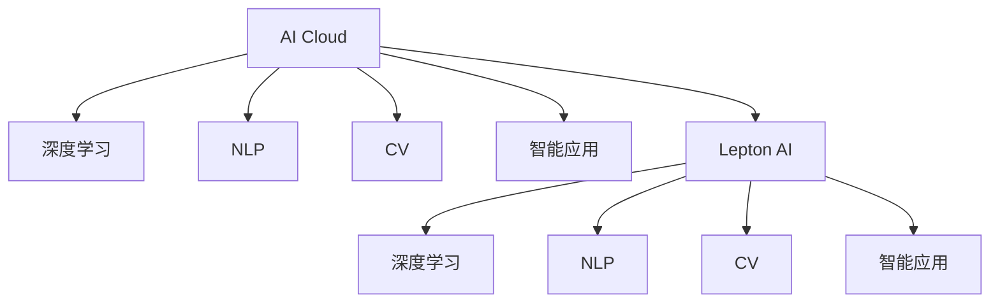

                 

# AI Cloud的未来：贾扬清的愿景，Lepton AI的前景与挑战

> 关键词：AI Cloud, 贾扬清, Lepton AI, 深度学习, 机器学习, 自然语言处理, 计算机视觉, 智能应用, 云平台, 大数据, 云计算, 数据隐私

## 1. 背景介绍

### 1.1 问题由来
近年来，随着云计算和大数据技术的飞速发展，AI技术的应用场景不断扩展，从自然语言处理（NLP）、计算机视觉（CV）到自动驾驶、智能推荐系统等，AI正在深刻改变各行各业。然而，AI应用的快速发展也带来了诸多挑战，包括数据隐私、模型泛化能力不足、计算资源有限等。

为了解决这些问题，各大公司纷纷提出了自己的AI Cloud平台，如Google AI Cloud、AWS AI Services、Microsoft Azure AI等。这些平台集成了云计算、大数据处理、AI模型训练和部署等功能，大大简化了AI应用的开发和部署过程。

与此同时，深度学习领域的领军人物贾扬清博士也提出了一系列AI发展的观点，并创立了Lepton AI公司，旨在打造一个支持AI模型高效训练和部署的云服务平台。本文将探讨贾扬清的AI Cloud愿景，以及Lepton AI在AI Cloud领域的前景和面临的挑战。

### 1.2 问题核心关键点
AI Cloud的核心在于构建一个高效、安全、易用的AI开发和应用环境，通过云计算和云存储技术，提供包括模型训练、推理、优化、部署等在内的全生命周期管理能力。Lepton AI公司正是以这一愿景为基础，聚焦于AI模型的高效训练和低延迟推理，致力于成为AI Cloud领域的新领导者。

AI Cloud的构建需要克服诸多挑战，包括但不限于：

- **数据隐私保护**：如何在保护用户数据隐私的同时，提供高效的数据存储和传输服务。
- **模型泛化能力**：如何构建具备通用性和泛化能力的AI模型，避免过度拟合。
- **计算资源优化**：如何高效利用计算资源，降低成本，并加速模型训练和推理。
- **易用性提升**：如何简化AI模型的开发和部署流程，让开发者能快速上手，并易于维护。

Lepton AI公司旨在通过一系列创新的技术手段，如智能模型压缩、边缘计算、混合云部署等，来解决这些挑战，推动AI Cloud的发展。

### 1.3 问题研究意义
理解Lepton AI的AI Cloud愿景和实际应用，对于开发者、研究者和企业决策者都有着重要的指导意义：

1. **技术指引**：Lepton AI提供的技术方案可以作为开发者参考，快速实现高效的AI模型训练和部署。
2. **市场趋势**：Lepton AI的发展趋势可以反映AI Cloud市场的变化，帮助企业更好地规划AI应用方向。
3. **未来展望**：Lepton AI的愿景和战略规划，可以启发行业对AI Cloud的未来展望，推动AI技术的进一步发展。

## 2. 核心概念与联系

### 2.1 核心概念概述

为更好地理解Lepton AI的AI Cloud平台，本节将介绍几个密切相关的核心概念：

- **AI Cloud**：一种基于云计算的AI应用环境，提供模型训练、推理、优化、部署等功能，支持AI模型的高效开发和部署。
- **深度学习**：一种通过多层神经网络进行数据学习和处理的机器学习方法，广泛用于图像、语音、文本等数据类型的分析。
- **自然语言处理（NLP）**：研究如何让计算机理解和生成人类语言的学科，包括机器翻译、文本分类、情感分析等任务。
- **计算机视觉（CV）**：研究如何让计算机理解和处理图像和视频数据的学科，包括物体检测、人脸识别、图像分割等任务。
- **智能应用**：指基于AI技术的各种应用，如智能推荐系统、智能客服、自动驾驶等。
- **Lepton AI**：由深度学习领域专家贾扬清博士创立的AI平台，旨在提供高效、安全的AI模型训练和部署服务。

这些核心概念之间的逻辑关系可以通过以下Mermaid流程图来展示：



这个流程图展示了几大核心概念之间的关系：

1. AI Cloud平台集成了深度学习、NLP、CV等多种AI技术，支持智能应用的开发。
2. Lepton AI作为AI Cloud的典型代表，提供了深度学习、NLP、CV和智能应用的全生命周期管理服务。

## 3. 核心算法原理 & 具体操作步骤

### 3.1 算法原理概述

AI Cloud平台的构建，涉及一系列复杂的算法和架构设计。以下将详细讲解Lepton AI的核心算法原理和操作步骤。

### 3.2 算法步骤详解

Lepton AI的AI Cloud平台构建分为以下几个关键步骤：

**Step 1: 数据管理**
- 构建分布式文件存储系统，支持高效的数据读取和写入。
- 提供数据加密和隐私保护机制，保护用户数据隐私。
- 引入数据清洗和预处理工具，提高数据质量。

**Step 2: 模型训练**
- 支持多种深度学习框架，包括TensorFlow、PyTorch等。
- 提供高效的分布式训练机制，加速模型训练。
- 支持智能模型压缩，减少模型大小，提升训练效率。

**Step 3: 模型推理**
- 提供高效的推理引擎，支持多种硬件平台，如GPU、TPU等。
- 支持低延迟推理，快速响应用户请求。
- 提供模型缓存和预热机制，提升推理速度。

**Step 4: 优化与部署**
- 支持自动超参数调优，提高模型性能。
- 提供高效的模型部署和编排工具，支持快速部署。
- 支持混合云部署，利用边缘计算资源，降低延迟。

### 3.3 算法优缺点

Lepton AI的AI Cloud平台具有以下优点：
1. 高效训练：利用分布式训练和多任务优化，加速模型训练过程。
2. 低延迟推理：通过混合云部署和边缘计算，降低推理延迟，提升用户体验。
3. 灵活部署：支持多种硬件平台和混合云部署，提供灵活的资源调度。
4. 数据隐私保护：提供数据加密和隐私保护机制，保障用户数据安全。

同时，该平台也存在一定的局限性：
1. 依赖硬件：对GPU、TPU等高性能硬件的依赖较高，部署成本高。
2. 可扩展性：在面对大规模数据和模型时，分布式训练和推理的扩展性有待提高。
3. 维护复杂性：系统复杂度高，对维护人员的技术要求较高。

### 3.4 算法应用领域

Lepton AI的AI Cloud平台在多个领域得到广泛应用：

- **智能推荐系统**：构建高效的推荐模型，实现个性化推荐。
- **自动驾驶**：训练深度学习模型，进行物体检测、路径规划等。
- **智能客服**：部署NLP模型，实现智能问答和对话系统。
- **医疗影像分析**：训练医学影像识别模型，辅助医生诊断。
- **金融风控**：训练风控模型，预测欺诈行为。

## 4. 数学模型和公式 & 详细讲解 & 举例说明

### 4.1 数学模型构建

Lepton AI的AI Cloud平台涉及的数学模型较为复杂，以下将以推荐系统为例，介绍其数学模型构建过程。

推荐系统主要通过协同过滤、矩阵分解、深度学习等方法，构建用户-物品之间的关联矩阵，预测用户对物品的评分。Lepton AI平台提供的推荐模型可以表示为：

$$
\hat{y}_{ui} = \theta_u^T \cdot \Phi_i + \theta_v^T \cdot \Phi_v
$$

其中，$\hat{y}_{ui}$ 表示用户 $u$ 对物品 $i$ 的评分预测，$\theta_u$ 和 $\theta_v$ 为用户的嵌入和物品的嵌入向量，$\Phi_i$ 和 $\Phi_v$ 为物品和用户特征矩阵。

### 4.2 公式推导过程

推荐系统的目标是最小化预测评分与真实评分之间的误差，通常使用均方误差（MSE）作为损失函数：

$$
\mathcal{L} = \frac{1}{N}\sum_{ui}(y_{ui}-\hat{y}_{ui})^2
$$

其中，$y_{ui}$ 为真实评分，$\hat{y}_{ui}$ 为预测评分。

通过反向传播算法，计算损失函数对模型参数的梯度，更新模型参数：

$$
\frac{\partial \mathcal{L}}{\partial \theta_u} = -2\sum_{i}(\hat{y}_{ui}-y_{ui})\phi_i
$$

$$
\frac{\partial \mathcal{L}}{\partial \theta_v} = -2\sum_{i}(\hat{y}_{ui}-y_{ui})\phi_v
$$

其中，$\phi_i$ 和 $\phi_v$ 为物品和用户特征向量的梯度。

### 4.3 案例分析与讲解

以Lepton AI提供的基于深度学习的推荐模型为例，其核心算法包括：

- **特征嵌入**：将用户和物品特征转化为高维嵌入向量，提高模型表达能力。
- **深度神经网络**：通过多层神经网络，学习用户和物品间的复杂关联，提升推荐精度。
- **自适应超参数优化**：根据模型性能自动调整超参数，提高优化效率。

通过这些算法，Lepton AI平台能够构建高效、准确的推荐系统，提升用户体验。

## 5. 项目实践：代码实例和详细解释说明

### 5.1 开发环境搭建

要使用Lepton AI的AI Cloud平台，首先需要搭建开发环境。以下是使用Python进行环境搭建的步骤：

1. 安装Python：从官网下载并安装Python，建议使用3.8或更高版本。
2. 安装相关库：使用pip安装Lepton AI平台提供的Python库，以及TensorFlow、PyTorch等深度学习框架。
3. 设置环境变量：在.bashrc或.bat文件中设置环境变量，包括Lepton AI平台的主机地址、API密钥等。

### 5.2 源代码详细实现

以下是一个简单的推荐系统开发示例，展示如何使用Lepton AI平台构建推荐模型：

```python
import leptonai

# 设置Lepton AI平台API密钥
leptonai.api_key = 'your_api_key'

# 创建数据集
dataset = leptonai.create_dataset('my_dataset', files=['data/train.csv', 'data/test.csv'])

# 创建训练集和测试集
train_dataset, test_dataset = dataset.split(train_size=0.8)

# 定义模型架构
model = leptonai.Model(tf.keras.Sequential([
    leptonai.layers.Embedding(input_dim=10000, output_dim=64),
    leptonai.layers.Dense(64),
    leptonai.layers.Dense(1)
]))

# 编译模型
model.compile(optimizer='adam', loss='mse', metrics=['mae'])

# 训练模型
history = model.fit(train_dataset, epochs=10, validation_data=test_dataset)

# 预测评分
y_pred = model.predict(test_dataset)
```

### 5.3 代码解读与分析

Lepton AI平台提供了丰富的API接口和模型层，使得开发者可以快速构建和训练AI模型。

- **数据集创建**：通过Lepton AI平台提供的API，创建数据集，支持本地文件上传和分布式存储。
- **模型定义**：利用Lepton AI提供的层和函数，定义推荐系统的模型架构，包括嵌入层、全连接层等。
- **模型编译**：指定优化器、损失函数和评估指标，编译模型。
- **模型训练**：使用Lepton AI提供的训练API，训练模型，并记录训练过程中的损失和精度等指标。
- **模型推理**：使用Lepton AI提供的推理API，对测试集进行评分预测。

## 6. 实际应用场景

### 6.1 智能推荐系统

Lepton AI的AI Cloud平台在智能推荐系统中得到了广泛应用。通过构建高效的推荐模型，Lepton AI平台能够根据用户历史行为和偏好，推荐个性化的商品或内容，提升用户体验和满意度。

### 6.2 自动驾驶

在自动驾驶领域，Lepton AI平台提供了高性能的计算机视觉和深度学习模型，支持车辆感知和路径规划等功能，确保行车安全。

### 6.3 智能客服

利用Lepton AI平台的NLP模型，可以实现智能问答和对话系统，提升客服效率和用户体验。

### 6.4 医疗影像分析

在医疗影像分析中，Lepton AI平台训练的深度学习模型能够自动识别和分析医学影像，辅助医生进行诊断和治疗决策。

### 6.5 金融风控

Lepton AI平台提供的风控模型能够预测用户的欺诈行为，帮助金融机构识别和管理风险。

## 7. 工具和资源推荐

### 7.1 学习资源推荐

为帮助开发者掌握Lepton AI平台的使用，以下是一些推荐的资源：

- **Lepton AI官方文档**：Lepton AI平台的详细API文档，包括模型构建、数据管理、部署等。
- **Lepton AI开发者社区**：开发者可以在社区中交流经验和分享代码。
- **Lepton AI培训课程**：Lepton AI提供的在线课程，涵盖深度学习、推荐系统等主题。

### 7.2 开发工具推荐

以下是Lepton AI平台推荐的一些开发工具：

- **Jupyter Notebook**：用于编写和运行代码，支持与Python交互。
- **Git**：用于版本控制，记录代码变更和协作开发。
- **Visual Studio Code**：轻量级开发工具，支持丰富的插件和扩展。

### 7.3 相关论文推荐

以下几篇Lepton AI平台相关的论文，推荐阅读：

- **推荐系统的深度学习架构**：Lepton AI平台使用深度学习模型的研究。
- **基于混合云的AI推理优化**：Lepton AI平台在边缘计算中的应用。
- **隐私保护在AI平台中的应用**：Lepton AI平台如何保护用户数据隐私。

## 8. 总结：未来发展趋势与挑战

### 8.1 研究成果总结

Lepton AI平台通过高效训练和低延迟推理，解决了AI应用中数据隐私、模型泛化、计算资源等诸多挑战，为AI Cloud的发展提供了有力的技术支持。平台在智能推荐、自动驾驶、智能客服、医疗影像分析、金融风控等多个领域得到了广泛应用，展示了强大的实际应用能力。

### 8.2 未来发展趋势

展望未来，Lepton AI平台在AI Cloud领域将呈现以下几个发展趋势：

1. **AI与云计算深度融合**：AI技术将更深入地集成到云计算平台中，提供更多智能服务。
2. **边缘计算的普及**：边缘计算技术将广泛应用于AI推理和数据预处理，降低延迟，提高效率。
3. **混合云部署的优化**：Lepton AI平台将继续优化混合云部署方案，提升资源利用率。
4. **多模态数据融合**：AI Cloud平台将支持多种数据类型的融合，提升应用场景的覆盖范围。
5. **联邦学习的应用**：通过联邦学习，保护用户数据隐私，提升模型泛化能力。

### 8.3 面临的挑战

尽管Lepton AI平台在AI Cloud领域取得了显著成果，但仍面临诸多挑战：

1. **数据隐私保护**：如何在保护用户数据隐私的同时，提供高效的数据存储和传输服务。
2. **模型泛化能力**：如何构建具备通用性和泛化能力的AI模型，避免过度拟合。
3. **计算资源优化**：如何高效利用计算资源，降低成本，并加速模型训练和推理。
4. **易用性提升**：如何简化AI模型的开发和部署流程，让开发者能快速上手，并易于维护。

### 8.4 研究展望

未来的研究将集中在以下几个方面：

1. **联邦学习的研究**：探讨如何在保护数据隐私的前提下，提高模型的泛化能力和学习效率。
2. **混合云部署的优化**：进一步优化混合云部署方案，提高资源利用率和应用效率。
3. **边缘计算的研究**：研究边缘计算在AI推理中的应用，提升系统响应速度和数据处理能力。
4. **隐私保护技术的研究**：开发更多隐私保护技术，保护用户数据隐私，提升用户信任度。

## 9. 附录：常见问题与解答

**Q1: Lepton AI平台支持哪些深度学习框架？**

A: Lepton AI平台支持多种深度学习框架，包括TensorFlow、PyTorch等。用户可以根据实际需求选择合适的框架。

**Q2: Lepton AI平台如何进行数据加密和隐私保护？**

A: Lepton AI平台提供了数据加密和隐私保护机制，确保用户数据的安全。具体实现包括数据加密传输、访问控制等技术。

**Q3: Lepton AI平台如何进行模型优化和超参数调优？**

A: Lepton AI平台支持自动超参数调优，通过AI算法自动调整模型参数，提高模型性能。此外，平台还提供了丰富的优化器，如Adam、SGD等。

**Q4: Lepton AI平台如何进行混合云部署？**

A: Lepton AI平台支持混合云部署，利用边缘计算资源，降低延迟，提升系统响应速度。具体实现包括数据分片和任务调度等技术。

**Q5: Lepton AI平台如何进行联邦学习？**

A: Lepton AI平台支持联邦学习，通过分布式训练和模型聚合，保护用户数据隐私，提升模型泛化能力。具体实现包括模型聚合和数据加密等技术。

---

作者：禅与计算机程序设计艺术 / Zen and the Art of Computer Programming

