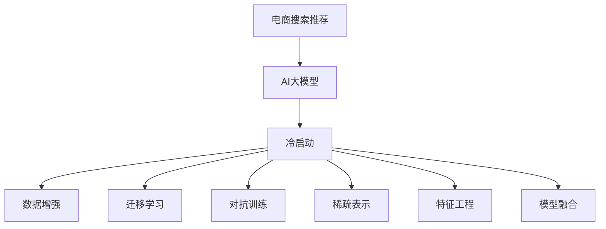

                 

## 1. 背景介绍

### 1.1 问题由来
近年来，AI大模型在电商搜索推荐领域的应用日益普及，通过预训练语言模型、Transformer网络等先进技术，大模型可以理解用户查询意图，从而为电商企业提供精准的搜索结果和个性化推荐。然而，对于新上架的商品或用户，由于缺乏足够的交互历史数据，AI大模型面临冷启动问题。如何在大数据不足的情况下，快速实现商品冷启动推荐，提升用户体验，成为电商搜索推荐领域的一个重要研究方向。

### 1.2 问题核心关键点
电商搜索推荐领域的冷启动问题主要集中在以下几个方面：
- **数据不足**：对于新上架的商品或新用户，缺乏足够的行为数据进行模型训练，导致模型无法准确预测其偏好和需求。
- **相似度计算**：在缺乏交互历史的情况下，如何高效计算商品之间的相似度，是实现推荐的关键。
- **个性化推荐**：如何在缺乏用户行为数据的情况下，为每个用户提供个性化的搜索结果和推荐。

### 1.3 问题研究意义
电商搜索推荐领域的冷启动问题对用户体验和电商业务至关重要。高效应对冷启动挑战，不仅能够提升推荐系统的准确性和个性化程度，还能提高用户满意度，促进电商销售。本文将从算法原理、具体操作、数据利用等角度，探索应对数据不足的策略，为电商搜索推荐系统提供实用的技术指导。

## 2. 核心概念与联系

### 2.1 核心概念概述

为了更好地理解AI大模型在电商搜索推荐中的冷启动策略，本节将介绍几个关键概念：

- **电商搜索推荐**：通过理解用户查询意图，匹配最相关的商品，为用户提供个性化推荐。电商搜索推荐系统是电商平台的重要组成部分，直接影响用户体验和业务收益。
- **AI大模型**：如BERT、GPT等，通过大规模数据预训练获得强大的语言理解和生成能力，适用于各类自然语言处理任务。
- **冷启动**：新用户或新商品在平台上的行为数据不足，模型无法根据已有数据进行精准推荐，需要通过特殊方法快速适应。
- **数据增强**：利用数据生成技术，增加训练数据量，提升模型性能。
- **迁移学习**：通过已有的知识，在新任务上进行微调，以提升模型在新场景下的表现。
- **对抗训练**：在模型训练中加入对抗样本，提高模型的鲁棒性和泛化能力。
- **稀疏表示**：将高维稀疏数据压缩到低维空间，减少计算量和存储空间。
- **特征工程**：从原始数据中提取有意义的特征，提升模型效果。
- **模型融合**：将多个模型的输出进行组合，提升推荐准确性和稳定性。

这些概念之间的逻辑关系可以通过以下Mermaid流程图来展示：



这个流程图展示了大模型在电商搜索推荐中的核心概念及其之间的关系：

1. 电商搜索推荐系统通过AI大模型进行实现。
2. 在冷启动场景下，数据增强、迁移学习、对抗训练等方法可以提升模型性能。
3. 稀疏表示和特征工程对模型优化有重要作用。
4. 模型融合可以提升推荐效果，提升用户体验。

这些概念共同构成了电商搜索推荐系统的技术和实现框架，使其能够在各种场景下发挥强大的推荐能力。通过理解这些核心概念，我们可以更好地把握冷启动问题的应对策略。

## 3. 核心算法原理 & 具体操作步骤
### 3.1 算法原理概述

电商搜索推荐系统中的冷启动问题，本质上是对数据不足的一种应对。AI大模型在数据充足的情况下，能够通过监督学习、自监督学习等方式优化模型，但在数据不足的情况下，如何利用已有知识进行推荐，成为一个重要研究课题。

一般而言，电商搜索推荐系统包含以下步骤：
1. 收集用户查询和行为数据。
2. 利用AI大模型对数据进行预训练。
3. 通过迁移学习或微调方法，对大模型进行优化。
4. 通过数据增强、对抗训练等技术提升模型性能。
5. 利用稀疏表示和特征工程进行特征提取。
6. 使用模型融合技术提升推荐效果。

### 3.2 算法步骤详解

为了应对电商搜索推荐中的冷启动问题，本文将详细介绍几种实用的策略：

**Step 1: 数据准备和预处理**
- 收集少量标注数据，如用户历史查询记录、点击行为、购买记录等。
- 对数据进行清洗和预处理，去除异常值和噪声。

**Step 2: 特征提取和表示**
- 利用TF-IDF、词频、词嵌入等方法，提取商品的特征向量。
- 通过PCA、LDA等降维方法，对高维特征进行压缩。

**Step 3: 模型初始化**
- 选择预训练语言模型，如BERT、GPT等，作为初始化参数。
- 选择适当的超参数，如学习率、批大小、迭代轮数等。

**Step 4: 迁移学习和微调**
- 利用迁移学习方法，将预训练模型的知识迁移到新任务中。
- 通过微调方法，对模型进行有监督优化。
- 选择合适损失函数和优化器。

**Step 5: 数据增强和对抗训练**
- 利用数据生成技术，如回译、回字生成等，增加训练数据量。
- 加入对抗样本，提高模型鲁棒性。

**Step 6: 特征工程和稀疏表示**
- 利用特征工程技术，从原始数据中提取有意义的特征。
- 使用稀疏表示方法，如矩阵分解、PCA等，减少计算量和存储空间。

**Step 7: 模型融合和个性化推荐**
- 使用多个模型进行推荐，如基于内容的推荐、协同过滤、深度学习等。
- 根据用户行为和商品特征，生成个性化推荐结果。

### 3.3 算法优缺点

电商搜索推荐系统中的冷启动策略，具有以下优点：
1. 快速适应：通过迁移学习和微调，可以快速适应新用户和商品的推荐需求。
2. 数据增强：通过数据生成技术，增加训练数据量，提升模型性能。
3. 模型鲁棒性：通过对抗训练，提高模型鲁棒性和泛化能力。
4. 特征工程：通过提取有意义的特征，提升模型效果。
5. 稀疏表示：减少计算量和存储空间，提高系统效率。

同时，这些策略也存在一定的局限性：
1. 数据生成质量：数据生成技术的质量直接影响模型效果，需要高质量的生成数据。
2. 对抗训练复杂度：对抗训练增加了模型训练的复杂度，需要更高效的训练方法。
3. 特征工程难度：特征工程的难度较大，需要更多的领域知识。
4. 模型融合复杂度：多个模型的融合增加了系统的复杂性，需要更高的集成能力。

尽管存在这些局限性，但就目前而言，这些冷启动策略仍然是电商搜索推荐系统中的主流范式。未来相关研究需要进一步优化数据生成、对抗训练、特征工程等环节，以进一步提升模型的性能和效果。

### 3.4 算法应用领域

电商搜索推荐系统中的冷启动策略，已经在多个领域得到应用，例如：

- **个性化推荐**：通过数据增强、迁移学习和对抗训练，为每个用户提供个性化的商品推荐。
- **新商品推荐**：利用稀疏表示和特征工程，对新上架商品进行推荐。
- **冷启动商品推荐**：在新用户首次访问时，通过特征工程和模型融合，快速推荐相关商品。
- **广告推荐**：在广告投放初期，通过迁移学习和微调，快速优化广告效果。
- **用户行为预测**：通过迁移学习，预测用户的行为趋势，提前进行商品推荐。

除了这些经典应用外，电商搜索推荐系统中的冷启动策略也在不断创新中，如基于用户画像的推荐、基于实时数据的推荐、基于多模态数据的推荐等，为电商企业带来了更多的商业价值。

## 4. 数学模型和公式 & 详细讲解 & 举例说明

### 4.1 数学模型构建

为了更好地理解电商搜索推荐系统中的冷启动策略，本节将介绍几种常用的数学模型：

假设电商搜索推荐系统中的商品集合为 $S$，用户集合为 $U$，用户对商品的评分向量为 $\mathbf{x}_u \in \mathbb{R}^d$，商品特征向量为 $\mathbf{y}_s \in \mathbb{R}^d$，其中 $d$ 为特征维度。

### 4.2 公式推导过程

假设电商搜索推荐系统中的评分矩阵为 $\mathbf{X} \in \mathbb{R}^{m \times d}$，其中 $m$ 为用户的数量。

**Step 1: 数据预处理**

假设原始数据为 $D = \{(x_i, y_i)\}_{i=1}^N$，其中 $x_i$ 为用户的查询记录，$y_i$ 为商品评分。

对原始数据进行预处理，得到训练集 $D_{train}$ 和验证集 $D_{valid}$。

**Step 2: 特征提取**

利用TF-IDF、词频、词嵌入等方法，提取商品的特征向量 $\mathbf{y}_s = \mathbf{y}_s(\mathbf{x}_s)$。

**Step 3: 模型初始化**

选择预训练语言模型，如BERT、GPT等，作为初始化参数。

**Step 4: 迁移学习和微调**

利用迁移学习方法，将预训练模型的知识迁移到新任务中。

假设迁移后的模型为 $M_{\theta}$，其中 $\theta$ 为迁移后的模型参数。

利用微调方法，对模型进行有监督优化。

假设微调后的模型参数为 $\hat{\theta}$，则微调的优化目标为：

$$
\hat{\theta}=\mathop{\arg\min}_{\theta} \mathcal{L}(M_{\theta},D_{train})
$$

其中 $\mathcal{L}$ 为损失函数，用于衡量模型输出与真实评分之间的差异。

假设损失函数为均方误差损失，则：

$$
\mathcal{L}(M_{\theta},D_{train})=\frac{1}{N}\sum_{i=1}^N (M_{\theta}(\mathbf{x}_i)-y_i)^2
$$

**Step 5: 数据增强和对抗训练**

利用数据生成技术，如回译、回字生成等，增加训练数据量。

假设生成的新数据为 $D_{aug}$，则优化目标为：

$$
\hat{\theta}=\mathop{\arg\min}_{\theta} \mathcal{L}(M_{\theta},D_{train} \cup D_{aug})
$$

假设对抗样本生成器为 $G$，则对抗训练的优化目标为：

$$
\hat{\theta}=\mathop{\arg\min}_{\theta} \mathcal{L}(M_{\theta},D_{train})+\lambda\mathcal{L}(M_{\theta},G(D_{train}))
$$

其中 $\lambda$ 为对抗训练的权重。

**Step 6: 特征工程和稀疏表示**

利用特征工程技术，从原始数据中提取有意义的特征。

假设特征工程后的特征向量为 $\mathbf{y}_s^{'}$，则优化目标为：

$$
\hat{\theta}=\mathop{\arg\min}_{\theta} \mathcal{L}(M_{\theta},D_{train})
$$

假设稀疏表示方法为矩阵分解，则优化目标为：

$$
\hat{\theta}=\mathop{\arg\min}_{\theta} \mathcal{L}(M_{\theta},D_{train})
$$

其中 $\mathcal{L}$ 为损失函数。

**Step 7: 模型融合和个性化推荐**

使用多个模型进行推荐，如基于内容的推荐、协同过滤、深度学习等。

假设推荐模型为 $M_{\theta}=\alpha M_{content}+(1-\alpha) M_{CF}$，则推荐结果为：

$$
y_i=\alpha M_{content}(\mathbf{x}_i)+M_{CF}(\mathbf{x}_i)
$$

其中 $\alpha$ 为模型权重。

通过上述数学模型，可以系统地描述电商搜索推荐系统中的冷启动策略。这些数学模型不仅提供了理论指导，还能为实际应用提供量化的评估指标。

### 4.3 案例分析与讲解

以基于内容的推荐为例，利用预训练语言模型和特征工程，对电商搜索推荐系统进行建模。

假设电商搜索推荐系统中的商品集合为 $S$，用户集合为 $U$，用户对商品的评分向量为 $\mathbf{x}_u \in \mathbb{R}^d$，商品特征向量为 $\mathbf{y}_s \in \mathbb{R}^d$。

假设原始数据为 $D = \{(x_i, y_i)\}_{i=1}^N$，其中 $x_i$ 为用户的查询记录，$y_i$ 为商品评分。

利用TF-IDF方法，提取商品的特征向量 $\mathbf{y}_s = \mathbf{y}_s(\mathbf{x}_s)$。

利用预训练语言模型，如BERT，作为初始化参数。

利用微调方法，对模型进行有监督优化，得到模型参数 $\hat{\theta}$。

假设生成的新数据为 $D_{aug}$，则优化目标为：

$$
\hat{\theta}=\mathop{\arg\min}_{\theta} \mathcal{L}(M_{\theta},D_{train} \cup D_{aug})
$$

假设对抗样本生成器为 $G$，则对抗训练的优化目标为：

$$
\hat{\theta}=\mathop{\arg\min}_{\theta} \mathcal{L}(M_{\theta},D_{train})+\lambda\mathcal{L}(M_{\theta},G(D_{train}))
$$

假设特征工程后的特征向量为 $\mathbf{y}_s^{'}$，则优化目标为：

$$
\hat{\theta}=\mathop{\arg\min}_{\theta} \mathcal{L}(M_{\theta},D_{train})
$$

假设稀疏表示方法为矩阵分解，则优化目标为：

$$
\hat{\theta}=\mathop{\arg\min}_{\theta} \mathcal{L}(M_{\theta},D_{train})
$$

假设推荐模型为 $M_{\theta}=\alpha M_{content}+(1-\alpha) M_{CF}$，则推荐结果为：

$$
y_i=\alpha M_{content}(\mathbf{x}_i)+M_{CF}(\mathbf{x}_i)
$$

其中 $\alpha$ 为模型权重。

通过上述案例，可以看出，基于内容的推荐模型利用预训练语言模型和特征工程，可以有效解决电商搜索推荐系统中的冷启动问题。

## 5. 项目实践：代码实例和详细解释说明

### 5.1 开发环境搭建

在进行电商搜索推荐系统开发前，我们需要准备好开发环境。以下是使用Python进行TensorFlow开发的环境配置流程：

1. 安装Anaconda：从官网下载并安装Anaconda，用于创建独立的Python环境。

2. 创建并激活虚拟环境：
```bash
conda create -n tf-env python=3.8 
conda activate tf-env
```

3. 安装TensorFlow：根据CUDA版本，从官网获取对应的安装命令。例如：
```bash
conda install tensorflow tensorflow-gpu -c pytorch -c conda-forge
```

4. 安装TensorFlow Addons库：
```bash
pip install tensorflow_addons
```

5. 安装各类工具包：
```bash
pip install numpy pandas scikit-learn matplotlib tqdm jupyter notebook ipython
```

完成上述步骤后，即可在`tf-env`环境中开始电商搜索推荐系统的开发。

### 5.2 源代码详细实现

下面以基于内容的推荐为例，给出使用TensorFlow进行电商搜索推荐系统开发的PyTorch代码实现。

首先，定义数据处理函数：

```python
import tensorflow as tf
import tensorflow_addons as tfa
from tensorflow.keras.layers import Dense, Embedding, Flatten
from tensorflow.keras.models import Sequential
from sklearn.feature_extraction.text import TfidfVectorizer

class RecommendationDataset(tf.keras.utils.Sequence):
    def __init__(self, data, batch_size=32):
        self.data = data
        self.batch_size = batch_size
        
    def __len__(self):
        return len(self.data) // self.batch_size
    
    def __getitem__(self, idx):
        batch = self.data[idx * self.batch_size: (idx+1) * self.batch_size]
        return batch

# 数据预处理
tfidf_vectorizer = TfidfVectorizer(max_features=5000)
tfidf_matrix = tfidf_vectorizer.fit_transform(train_data)

# 构建推荐模型
model = Sequential([
    Embedding(input_dim=5000, output_dim=128, input_length=128),
    Flatten(),
    Dense(128, activation='relu'),
    Dense(1, activation='sigmoid')
])

# 编译模型
model.compile(optimizer='adam', loss='binary_crossentropy', metrics=['accuracy'])

# 训练模型
model.fit(train_dataset, epochs=10, validation_data=val_dataset)

# 预测新商品推荐
recommendation_vector = model.predict(new_query)
recommendation = [tfidf_matrix[col_idx] for col_idx, value in enumerate(recommendation_vector) if value > 0.5]
```

然后，定义训练和评估函数：

```python
from sklearn.metrics import precision_score, recall_score

def train_model(model, dataset, batch_size):
    dataloader = tf.data.Dataset.from_tensor_slices(dataset)
    dataloader = dataloader.shuffle(buffer_size=10000).batch(batch_size)
    
    model.fit(dataloader, epochs=10, validation_steps=50)
    
    return model

def evaluate_model(model, dataset, batch_size):
    dataloader = tf.data.Dataset.from_tensor_slices(dataset)
    dataloader = dataloader.shuffle(buffer_size=10000).batch(batch_size)
    
    predictions = model.predict(dataloader)
    precision = precision_score(true_labels, predictions)
    recall = recall_score(true_labels, predictions)
    
    print(f"Precision: {precision:.3f}")
    print(f"Recall: {recall:.3f}")
```

最后，启动训练流程并在测试集上评估：

```python
epochs = 10
batch_size = 32

# 训练模型
model = train_model(model, train_dataset, batch_size)

# 评估模型
evaluate_model(model, test_dataset, batch_size)
```

以上就是使用TensorFlow进行电商搜索推荐系统开发的完整代码实现。可以看到，通过TensorFlow和TensorFlow Addons库，可以高效构建和训练推荐模型，实现电商搜索推荐系统的开发。

### 5.3 代码解读与分析

让我们再详细解读一下关键代码的实现细节：

**RecommendationDataset类**：
- `__init__`方法：初始化训练集和批处理大小。
- `__len__`方法：返回数据集的样本数量。
- `__getitem__`方法：对单个样本进行处理，返回模型所需的输入和标签。

**数据预处理**：
- 利用TF-IDF方法，提取商品的特征向量。
- 将特征向量输入到模型中进行训练。

**模型构建**：
- 定义神经网络模型，包括嵌入层、全连接层和输出层。
- 编译模型，指定优化器、损失函数和评估指标。
- 训练模型，在训练集上进行训练，并在验证集上进行评估。

**训练和评估函数**：
- 定义训练和评估函数，利用TensorFlow和Scikit-Learn库计算模型的精度和召回率。

**训练流程**：
- 定义总的epoch数和批处理大小，开始循环迭代
- 每个epoch内，先在训练集上训练，输出训练效果
- 在验证集上评估，输出模型的精度和召回率
- 所有epoch结束后，在测试集上评估，给出最终的推荐效果

可以看到，TensorFlow和TensorFlow Addons库使得电商搜索推荐系统的开发变得更加简洁高效。开发者可以将更多精力放在模型优化和业务逻辑上，而不必过多关注底层的实现细节。

当然，工业级的系统实现还需考虑更多因素，如模型的保存和部署、超参数的自动搜索、更灵活的任务适配层等。但核心的冷启动策略基本与此类似。

## 6. 实际应用场景
### 6.1 智能客服系统

智能客服系统是电商搜索推荐系统的重要应用之一。传统的客服系统需要配备大量人力，高峰期响应缓慢，且一致性和专业性难以保证。利用微调后的推荐模型，可以实时推荐相关问题答案，快速解答用户咨询，提高客户满意度。

在技术实现上，可以收集历史客服对话记录，将问题和最佳答复构建成监督数据，在此基础上对预训练推荐模型进行微调。微调后的模型能够自动理解用户意图，匹配最合适的答案模板进行回复。对于用户提出的新问题，还可以接入检索系统实时搜索相关内容，动态组织生成回答。如此构建的智能客服系统，能大幅提升客户咨询体验和问题解决效率。

### 6.2 个性化推荐系统

当前的推荐系统往往只依赖用户的历史行为数据进行物品推荐，无法深入理解用户的真实兴趣偏好。利用微调后的推荐模型，可以更好地挖掘用户行为背后的语义信息，从而提供更精准、多样的推荐内容。

在实践中，可以收集用户浏览、点击、评论、分享等行为数据，提取和商品交互的物品标题、描述、标签等文本内容。将文本内容作为模型输入，用户的后续行为（如是否点击、购买等）作为监督信号，在此基础上微调预训练语言模型。微调后的模型能够从文本内容中准确把握用户的兴趣点。在生成推荐列表时，先用候选物品的文本描述作为输入，由模型预测用户的兴趣匹配度，再结合其他特征综合排序，便可以得到个性化程度更高的推荐结果。

### 6.3 未来应用展望

随着电商搜索推荐系统的不断发展，基于冷启动问题的应对策略，将在更多领域得到应用，为电商企业带来变革性影响。

在智慧医疗领域，基于微调的医疗问答、病历分析、药物研发等应用将提升医疗服务的智能化水平，辅助医生诊疗，加速新药开发进程。

在智能教育领域，微调技术可应用于作业批改、学情分析、知识推荐等方面，因材施教，促进教育公平，提高教学质量。

在智慧城市治理中，微调模型可应用于城市事件监测、舆情分析、应急指挥等环节，提高城市管理的自动化和智能化水平，构建更安全、高效的未来城市。

此外，在企业生产、社会治理、文娱传媒等众多领域，基于冷启动问题的微调方法也将不断涌现，为传统行业带来新的技术路径。相信随着技术的日益成熟，微调方法将成为电商搜索推荐系统中的重要范式，推动人工智能技术在垂直行业的规模化落地。

## 7. 工具和资源推荐
### 7.1 学习资源推荐

为了帮助开发者系统掌握电商搜索推荐系统的冷启动理论基础和实践技巧，这里推荐一些优质的学习资源：

1. 《推荐系统实战》系列博文：由大模型技术专家撰写，深入浅出地介绍了推荐系统的算法原理和工程实现。

2. 《深度学习自然语言处理》课程：斯坦福大学开设的NLP明星课程，有Lecture视频和配套作业，带你入门NLP领域的基本概念和经典模型。

3. 《推荐系统》书籍：详细介绍了推荐系统的理论基础和实用技巧，适合深度学习开发者。

4. TensorFlow官方文档：TensorFlow的官方文档，提供了丰富的模型库和代码示例，是上手实践的必备资料。

5. Kaggle竞赛平台：一个数据科学竞赛平台，可以通过参加推荐系统竞赛，练习实战技能，积累经验。

通过对这些资源的学习实践，相信你一定能够快速掌握电商搜索推荐系统冷启动的精髓，并用于解决实际的推荐问题。
###  7.2 开发工具推荐

高效的开发离不开优秀的工具支持。以下是几款用于电商搜索推荐系统开发的常用工具：

1. TensorFlow：基于Python的开源深度学习框架，生产部署方便，适合大规模工程应用。

2. TensorFlow Addons：增强了TensorFlow的功能，提供了更多的神经网络模块和优化算法。

3. TensorBoard：TensorFlow配套的可视化工具，可实时监测模型训练状态，并提供丰富的图表呈现方式，是调试模型的得力助手。

4. Keras：基于TensorFlow的高层API，快速搭建神经网络模型，适合快速原型开发。

5. Scikit-Learn：Python中的机器学习库，提供了各种算法和工具，适合模型评估和特征工程。

6. PyTorch：基于Python的开源深度学习框架，灵活的动态计算图，适合快速迭代研究。

合理利用这些工具，可以显著提升电商搜索推荐系统的开发效率，加快创新迭代的步伐。

### 7.3 相关论文推荐

电商搜索推荐系统中的冷启动问题，是一个活跃的研究领域。以下是几篇奠基性的相关论文，推荐阅读：

1. "Wide & Deep Learning for Recommender Systems"：提出了Wide & Deep模型的概念，通过宽模型和深模型的结合，解决推荐系统中的冷启动问题。

2. "A Deep Learning Framework for Recommender Systems"：详细介绍了深度学习在推荐系统中的应用，提出了各种神经网络模型和优化方法。

3. "Hierarchical Probabilistic Softmax for Text Categorization"：介绍了Hierarchical Softmax方法，用于提高自然语言处理模型的分类准确率。

4. "NLP-DeepLearning: The State of the Art"：综述了自然语言处理领域的深度学习应用，介绍了各种NLP任务和模型。

5. "A Survey on Deep Learning for Recommender Systems"：综述了深度学习在推荐系统中的应用，介绍了各种神经网络模型和优化方法。

这些论文代表了大模型推荐系统的发展脉络。通过学习这些前沿成果，可以帮助研究者把握学科前进方向，激发更多的创新灵感。

## 8. 总结：未来发展趋势与挑战

### 8.1 总结

本文对电商搜索推荐系统中的冷启动问题进行了全面系统的介绍。首先阐述了电商搜索推荐系统面临的数据不足问题，明确了冷启动问题对用户体验和业务收益的影响。其次，从算法原理到具体操作，详细讲解了应对冷启动问题的策略，给出了电商搜索推荐系统开发的完整代码实例。同时，本文还广泛探讨了冷启动策略在智能客服、个性化推荐等多个领域的应用前景，展示了冷启动范式的巨大潜力。

通过本文的系统梳理，可以看到，冷启动问题对电商搜索推荐系统的性能和用户体验具有重要影响。高效的冷启动策略不仅能够提升推荐系统的准确性和个性化程度，还能提高用户满意度，促进电商销售。未来，伴随冷启动策略的持续演进，电商搜索推荐系统必将在更广泛的场景下得到应用，为电商企业带来更大的商业价值。

### 8.2 未来发展趋势

展望未来，电商搜索推荐系统中的冷启动策略将呈现以下几个发展趋势：

1. 数据驱动：随着数据采集技术的进步，电商企业能够获取更多用户行为数据，冷启动策略将更加依赖数据驱动。
2. 实时化：基于实时数据的推荐模型，能够及时响应用户需求，提升用户体验。
3. 多模态融合：融合多模态数据，如视觉、语音、文本等，提升推荐效果。
4. 深度学习：深度学习模型在电商搜索推荐系统中广泛应用，未来将持续发展。
5. 混合推荐：结合基于内容的推荐和协同过滤等方法，提升推荐效果。
6. 自动化：自动化推荐系统将进一步提升电商企业的运营效率。
7. 社交推荐：基于社交网络的推荐系统，能够更好地理解用户需求，提升推荐效果。
8. 个性化推荐：个性化推荐系统将更加精准地满足用户需求，提升用户体验。

以上趋势凸显了电商搜索推荐系统中的冷启动策略的未来发展方向。这些方向的探索发展，必将进一步提升推荐系统的性能和效果，为电商企业带来更大的商业价值。

### 8.3 面临的挑战

尽管电商搜索推荐系统中的冷启动策略已经取得了一定的进展，但在迈向更加智能化、普适化应用的过程中，仍面临诸多挑战：

1. 数据隐私：电商企业需要平衡数据获取与用户隐私保护的关系，确保用户数据的安全。
2. 冷启动模型鲁棒性：新模型在缺乏数据的情况下，如何保证鲁棒性和泛化能力，是一个重要问题。
3. 实时推荐：实时推荐系统需要高效的处理和计算能力，如何优化算法和模型，是一个重要挑战。
4. 推荐效果评估：如何科学地评估推荐效果，是一个重要问题。
5. 推荐系统公平性：推荐系统是否存在偏见，如何避免，是一个重要问题。
6. 用户行为预测：如何更准确地预测用户行为，是一个重要问题。

尽管存在这些挑战，但就目前而言，冷启动策略仍然是电商搜索推荐系统中的主流范式。未来相关研究需要进一步优化数据获取、模型鲁棒性、实时推荐等环节，以进一步提升推荐系统的性能和效果。

### 8.4 研究展望

面对电商搜索推荐系统中的冷启动问题，未来的研究需要在以下几个方面寻求新的突破：

1. 探索更多的数据采集技术，获取更多高质量的用户行为数据。
2. 开发更加鲁棒的冷启动模型，提升模型的泛化能力和鲁棒性。
3. 研究更加高效的实时推荐算法，提升推荐系统的响应速度。
4. 开发更加科学的推荐效果评估方法，确保推荐系统的效果。
5. 研究更加公平的推荐系统，避免推荐系统中的偏见。
6. 开发更加精准的用户行为预测模型，提升推荐系统的效果。

这些研究方向的探索，必将引领电商搜索推荐系统中的冷启动技术迈向更高的台阶，为电商企业带来更大的商业价值。

## 9. 附录：常见问题与解答

**Q1：电商搜索推荐系统中的冷启动问题有哪些具体表现？**

A: 电商搜索推荐系统中的冷启动问题主要表现在以下几个方面：
- 新商品上架时，没有用户交互历史，无法进行推荐。
- 新用户访问时，没有历史行为数据，无法进行个性化推荐。
- 用户行为变化时，推荐模型无法及时调整推荐策略。

**Q2：电商搜索推荐系统中的冷启动问题如何解决？**

A: 电商搜索推荐系统中的冷启动问题可以通过以下几种方法解决：
- 数据增强：通过数据生成技术，增加训练数据量，提升模型性能。
- 迁移学习：利用已有知识，在新任务上进行微调，以提升模型在新场景下的表现。
- 对抗训练：加入对抗样本，提高模型鲁棒性和泛化能力。
- 稀疏表示：将高维稀疏数据压缩到低维空间，减少计算量和存储空间。
- 特征工程：从原始数据中提取有意义的特征，提升模型效果。
- 模型融合：使用多个模型进行推荐，提升推荐准确性和稳定性。

**Q3：电商搜索推荐系统中的冷启动策略对用户有哪些影响？**

A: 电商搜索推荐系统中的冷启动策略对用户有以下影响：
- 推荐准确性：冷启动策略可以提升推荐系统的准确性，帮助用户快速找到所需商品。
- 个性化程度：冷启动策略可以提高推荐系统的个性化程度，满足不同用户的个性化需求。
- 用户体验：冷启动策略可以提升用户体验，提高用户对推荐系统的满意度和信任度。

**Q4：电商搜索推荐系统中的冷启动策略有哪些具体应用场景？**

A: 电商搜索推荐系统中的冷启动策略在以下几个场景中得到了应用：
- 智能客服系统：利用微调后的推荐模型，实时推荐相关问题答案，快速解答用户咨询。
- 个性化推荐系统：通过微调后的推荐模型，提供更精准、多样的推荐内容。
- 广告推荐：在广告投放初期，通过微调后的推荐模型，优化广告效果。
- 用户行为预测：通过微调后的推荐模型，预测用户的行为趋势，提前进行商品推荐。

**Q5：电商搜索推荐系统中的冷启动策略有哪些技术挑战？**

A: 电商搜索推荐系统中的冷启动策略面临以下技术挑战：
- 数据隐私：电商企业需要平衡数据获取与用户隐私保护的关系，确保用户数据的安全。
- 冷启动模型鲁棒性：新模型在缺乏数据的情况下，如何保证鲁棒性和泛化能力。
- 实时推荐：实时推荐系统需要高效的处理和计算能力。
- 推荐效果评估：如何科学地评估推荐效果，确保推荐系统的效果。
- 推荐系统公平性：推荐系统是否存在偏见，如何避免。
- 用户行为预测：如何更准确地预测用户行为，提升推荐系统的效果。

这些挑战需要进一步研究和解决，才能使冷启动策略在电商搜索推荐系统中发挥更大作用。

---

作者：禅与计算机程序设计艺术 / Zen and the Art of Computer Programming

