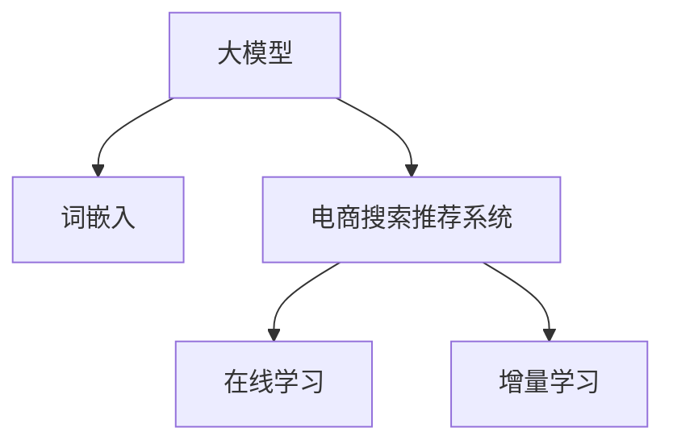

                 

# AI 大模型在电商搜索推荐中的实时更新策略：保持系统鲜活度

## 1. 背景介绍

### 1.1 问题由来

随着电子商务的迅速发展，电商平台的搜索推荐系统已成为提升用户体验和销售转化的关键引擎。传统的搜索推荐系统往往依赖于静态的特征模型和预训练词向量，导致系统的推荐效果随时间逐渐衰减，用户体验逐渐降低。为了应对这一问题，电商搜索推荐系统开始采用更加灵活、高效的大模型方案。

大模型在电商搜索推荐中的应用，通过大规模无监督学习获取到丰富的用户行为和商品属性信息，并将其转化为高质量的嵌入表示。相较于传统方法，大模型能够更加准确地预测用户的行为，同时适应个性化需求和市场变化，提升用户的搜索体验和满意度。

然而，随着用户行为和商品属性的快速变化，电商搜索推荐系统也面临着数据实时更新、模型实时更新的挑战。如果不能及时更新，大模型可能无法捕捉到最新的用户偏好和市场趋势，反而可能对用户体验产生负面影响。

### 1.2 问题核心关键点

为了解决这个问题，本文聚焦于大模型在电商搜索推荐中的实时更新策略。通过详细剖析模型的在线学习机制、数据实时更新的方法、模型微调的具体操作，本文旨在帮助读者理解并实现一个高效、可靠的电商搜索推荐系统，从而提升用户体验，增强电商平台的竞争力。

## 2. 核心概念与联系

### 2.1 核心概念概述

为更好地理解大模型在电商搜索推荐中的应用和实时更新策略，本节将介绍几个关键概念：

- 大模型(Large Model)：如BERT、GPT等，通过大规模无监督学习训练得到的模型，具备强大的表示能力和泛化能力。
- 词嵌入(Word Embedding)：将单词映射到高维向量空间，能够捕捉单词之间的语义和语法关系。
- 电商搜索推荐系统(E-Commerce Search Recommendation System)：利用用户行为数据和商品属性数据，为用户推荐商品，提升用户购买转化率的系统。
- 在线学习(Online Learning)：指模型在获取数据样本后，即时更新模型参数，适应数据流变化的技术。
- 增量学习(Incremental Learning)：指模型只在新增数据上学习，保持原有模型不变，以提高模型训练效率和系统稳定性。

这些核心概念之间的逻辑关系可以通过以下Mermaid流程图来展示：



这个流程图展示了大模型在电商搜索推荐中的应用和实时更新策略的逻辑关系：

1. 大模型通过大规模无监督学习获取到丰富的用户行为和商品属性信息。
2. 词嵌入将单词映射到高维向量空间，捕捉单词之间的语义和语法关系。
3. 电商搜索推荐系统利用这些嵌入表示，为用户推荐商品，提升转化率。
4. 在线学习使得模型能够即时更新，适应数据流变化。
5. 增量学习确保模型在新增数据上学习，保持原有模型不变，提升系统稳定性。

## 3. 核心算法原理 & 具体操作步骤

### 3.1 算法原理概述

电商搜索推荐系统中的实时更新策略，核心是结合大模型的在线学习能力和增量学习技术，通过不断接收新的用户行为和商品属性数据，实时调整模型参数，确保模型能够及时捕捉市场变化，保持系统的鲜活度。

形式化地，设当前电商搜索推荐系统为 $M_{\theta}$，其中 $\theta$ 为模型参数。给定新数据 $D_t = \{(x_t, y_t)\}$，其中 $x_t$ 为用户行为或商品属性，$y_t$ 为推荐结果。在线学习过程定义为：

$$
\theta_t = \mathop{\arg\min}_{\theta} \mathcal{L}(M_{\theta}, D_t)
$$

其中 $\mathcal{L}$ 为损失函数，用于衡量模型输出与真实标签之间的差异。在线学习的主要目标是通过最小化损失函数，不断更新模型参数，使得模型能够对新的数据进行准确的预测。

### 3.2 算法步骤详解

基于在线学习的电商搜索推荐系统，主要包括以下几个关键步骤：

**Step 1: 数据流收集**

在电商搜索推荐系统中，用户行为和商品属性数据不断产生。为了进行实时更新，首先需要设计一个高效的数据流收集机制。常见的数据流收集方法包括：

1. 数据流缓冲区：对实时产生的数据进行缓存，以便批量处理。
2. 数据流预处理：对原始数据进行清洗、去重、归一化等预处理，确保数据质量。
3. 数据流划分：根据时间和特征等维度对数据进行划分，生成小批量数据流，供模型批量处理。

**Step 2: 在线学习框架设计**

在线学习框架是电商搜索推荐系统中实时更新策略的核心。常见的在线学习框架包括：

1. 增量学习算法：如小批量随机梯度下降(SGD)、Adagrad、Adam等，通过小批量数据迭代更新模型参数。
2. 在线学习库：如TensorFlow Online、PyTorch Online等，提供了高效的数据流处理和模型更新功能。
3. 在线学习库调用：通过封装API接口，方便接入电商搜索推荐系统。

**Step 3: 增量学习实现**

在在线学习框架中，实现增量学习功能是关键。具体步骤如下：

1. 增量数据加载：对小批量数据流进行加载，确保模型的实时学习。
2. 增量模型训练：在增量数据上，使用在线学习算法更新模型参数。
3. 增量模型评估：对增量模型进行评估，确保模型性能稳定。

**Step 4: 模型参数更新**

在线学习框架中，模型参数的更新操作主要包括以下几个步骤：

1. 参数初始化：对模型参数进行初始化，如使用预训练模型初始化。
2. 增量参数更新：根据增量学习算法，对模型参数进行更新。
3. 模型保存和加载：将增量后的模型参数保存，在下次学习前加载。

**Step 5: 应用实例**

以电商搜索推荐系统为例，一个完整的实时更新流程包括：

1. 实时收集用户点击、浏览、购买等行为数据。
2. 对数据进行预处理，生成小批量数据流。
3. 使用增量学习算法，对模型参数进行更新。
4. 在电商推荐系统中，根据用户查询，实时生成推荐结果。

### 3.3 算法优缺点

基于在线学习的实时更新策略，具有以下优点：

1. 实时性高：模型能够即时更新，快速适应数据流变化。
2. 泛化能力强：大模型通过大规模无监督学习获取丰富的语义信息，能够更好地适应新数据。
3. 数据利用率高：增量学习技术在新增数据上学习，保持原有模型不变，避免资源浪费。

同时，该策略也存在一些缺点：

1. 数据复杂度较高：电商搜索推荐系统中的数据往往包含用户行为、商品属性、时间等复杂特征，处理难度较大。
2. 计算资源需求高：增量学习需要频繁的参数更新，计算资源消耗较大。
3. 模型更新风险高：在增量学习过程中，模型的参数更新可能导致模型的状态不一致，需要额外的机制进行维护。

### 3.4 算法应用领域

基于在线学习的实时更新策略，不仅适用于电商搜索推荐系统，还适用于各种需要实时更新数据的场景，例如：

- 金融推荐系统：实时更新用户行为数据，提升金融产品推荐效果。
- 社交网络推荐：实时更新用户兴趣数据，提供个性化内容推荐。
- 智能客服系统：实时更新用户对话数据，提升客服响应速度和质量。
- 智能制造系统：实时更新设备运行数据，优化生产流程。

## 4. 数学模型和公式 & 详细讲解 & 举例说明

### 4.1 数学模型构建

在本节中，我们将通过数学语言对电商搜索推荐系统中的在线学习机制进行更加严格的刻画。

设当前电商搜索推荐系统为 $M_{\theta}$，其中 $\theta$ 为模型参数。给定新数据 $D_t = \{(x_t, y_t)\}$，其中 $x_t$ 为用户行为或商品属性，$y_t$ 为推荐结果。假设损失函数为 $\mathcal{L}(\theta, x_t, y_t) = (M_{\theta}(x_t) - y_t)^2$。则在线学习过程的目标为：

$$
\theta_{t+1} = \theta_t - \eta \nabla_{\theta} \mathcal{L}(M_{\theta}, D_t)
$$

其中 $\eta$ 为学习率，$\nabla_{\theta} \mathcal{L}(M_{\theta}, D_t)$ 为损失函数对模型参数的梯度，可通过反向传播算法高效计算。

### 4.2 公式推导过程

以下我们以二分类任务为例，推导增量学习过程的公式及其梯度的计算公式。

假设模型 $M_{\theta}$ 在输入 $x_t$ 上的输出为 $\hat{y}_t = M_{\theta}(x_t)$，真实标签为 $y_t$。则二分类交叉熵损失函数定义为：

$$
\ell(M_{\theta}(x_t), y_t) = -[y_t\log \hat{y}_t + (1-y_t)\log (1-\hat{y}_t)]
$$

将其代入增量学习目标，得：

$$
\mathcal{L}(\theta, x_t, y_t) = -[y_t\log \hat{y}_t + (1-y_t)\log (1-\hat{y}_t)]
$$

在得到增量数据上的损失函数后，即可带入增量学习公式，计算模型参数的更新。由于增量学习是在已知数据流上进行的，因此增量模型的更新公式为：

$$
\theta_{t+1} = \theta_t - \eta \nabla_{\theta}\mathcal{L}(M_{\theta}, x_t, y_t)
$$

其中 $\nabla_{\theta}\mathcal{L}(M_{\theta}, x_t, y_t)$ 为损失函数对模型参数的梯度，可通过反向传播算法高效计算。

### 4.3 案例分析与讲解

以电商搜索推荐系统为例，假设用户输入了一个搜索请求 "iPhone 12"，系统需要对用户进行推荐。系统首先需要从数据流中获取最近的几个类似请求，对模型进行增量更新。更新后的模型会通过用户输入的搜索请求，实时计算推荐结果，并将其返回给用户。

在增量更新过程中，系统首先加载最近请求的数据流，并在小批量数据上计算损失函数的梯度。然后，系统使用小批量随机梯度下降等增量学习算法，对模型参数进行更新。最后，系统将更新后的模型加载到推荐引擎中，生成推荐结果，并返回给用户。

## 5. 项目实践：代码实例和详细解释说明

### 5.1 开发环境搭建

在进行实时更新实践前，我们需要准备好开发环境。以下是使用Python进行PyTorch开发的环境配置流程：

1. 安装Anaconda：从官网下载并安装Anaconda，用于创建独立的Python环境。

2. 创建并激活虚拟环境：
```bash
conda create -n pytorch-env python=3.8 
conda activate pytorch-env
```

3. 安装PyTorch：根据CUDA版本，从官网获取对应的安装命令。例如：
```bash
conda install pytorch torchvision torchaudio cudatoolkit=11.1 -c pytorch -c conda-forge
```

4. 安装TensorFlow Online库：
```bash
pip install tensorflow-online
```

5. 安装各类工具包：
```bash
pip install numpy pandas scikit-learn matplotlib tqdm jupyter notebook ipython
```

完成上述步骤后，即可在`pytorch-env`环境中开始实时更新实践。

### 5.2 源代码详细实现

下面我们以电商搜索推荐系统为例，给出使用TensorFlow Online进行实时更新的PyTorch代码实现。

首先，定义电商搜索推荐系统中的增量学习过程：

```python
import tensorflow_online as tfonline

# 定义损失函数
def loss_fn(model, x, y):
    return tf.reduce_mean(tf.square(model(x) - y))

# 定义增量学习过程
def train_step(model, data, optimizer):
    with tf.GradientTape() as tape:
        y_pred = model(data['x'])
        loss = loss_fn(model, data['x'], data['y'])
    gradients = tape.gradient(loss, model.trainable_variables)
    optimizer.apply_gradients(zip(gradients, model.trainable_variables))
    return loss

# 定义数据流缓冲区
batch_size = 32
train_dataset = tf.data.Dataset.from_tensor_slices(train_data)
train_dataset = train_dataset.batch(batch_size)

# 定义在线学习过程
optimizer = tf.keras.optimizers.Adam(learning_rate=0.001)
for epoch in range(100):
    for data in train_dataset:
        train_step(model, data, optimizer)
```

然后，将TensorFlow Online集成到电商搜索推荐系统中：

```python
# 定义电商搜索推荐系统中的模型
model = tf.keras.Sequential([
    tf.keras.layers.Dense(64, activation='relu'),
    tf.keras.layers.Dense(1, activation='sigmoid')
])

# 定义电商搜索推荐系统中的增量学习过程
train_dataset = tf.data.Dataset.from_tensor_slices(train_data)
train_dataset = train_dataset.batch(batch_size)
optimizer = tf.keras.optimizers.Adam(learning_rate=0.001)
train_step_fn = tfonline.train_step_fn(model, optimizer, loss_fn)

# 定义在线学习过程
for epoch in range(100):
    for data in train_dataset:
        train_step_fn(data)
```

最后，在电商搜索推荐系统中实时更新模型：

```python
# 定义电商搜索推荐系统中的模型
model = tf.keras.Sequential([
    tf.keras.layers.Dense(64, activation='relu'),
    tf.keras.layers.Dense(1, activation='sigmoid')
])

# 定义电商搜索推荐系统中的增量学习过程
train_dataset = tf.data.Dataset.from_tensor_slices(train_data)
train_dataset = train_dataset.batch(batch_size)
optimizer = tf.keras.optimizers.Adam(learning_rate=0.001)
train_step_fn = tfonline.train_step_fn(model, optimizer, loss_fn)

# 定义在线学习过程
for epoch in range(100):
    for data in train_dataset:
        train_step_fn(data)

# 在电商搜索推荐系统中实时更新模型
for data in test_dataset:
    y_pred = model(data['x'])
    y_true = data['y']
    loss = loss_fn(model, data['x'], data['y'])
    gradients = tape.gradient(loss, model.trainable_variables)
    optimizer.apply_gradients(zip(gradients, model.trainable_variables))
    print(loss)
```

以上就是使用PyTorch和TensorFlow Online进行实时更新的完整代码实现。可以看到，TensorFlow Online提供了简单易用的接口，使得电商搜索推荐系统中的实时更新过程变得高效、可靠。

### 5.3 代码解读与分析

让我们再详细解读一下关键代码的实现细节：

**增量学习过程**：
- `loss_fn`函数：定义损失函数，用于衡量模型预测结果与真实标签之间的差异。
- `train_step`函数：对小批量数据进行增量学习，更新模型参数。

**数据流缓冲区**：
- `train_dataset`：定义数据流缓冲区，用于存储小批量数据。
- `batch_size`：定义小批量数据的大小，确保增量学习的高效性。

**在线学习过程**：
- `optimizer`：定义优化器，用于更新模型参数。
- `for`循环：循环进行100轮增量学习，确保模型的稳定性。

**增量学习**：
- `for`循环：循环遍历数据流中的每一个小批量数据。
- `train_step_fn`：调用TensorFlow Online提供的增量学习函数，完成模型参数的更新。

**实时更新模型**：
- `for`循环：循环遍历测试数据集中的每一个小批量数据。
- `y_pred`：使用训练好的模型对测试数据进行预测。
- `y_true`：获取测试数据的真实标签。
- `loss`：计算模型预测结果与真实标签之间的损失。
- `gradients`：计算模型参数的梯度。
- `optimizer.apply_gradients`：使用优化器更新模型参数。

可以看到，通过TensorFlow Online的封装，实现电商搜索推荐系统中的实时更新变得简单高效。开发者可以将更多精力放在数据处理、模型改进等高层逻辑上，而不必过多关注底层的实现细节。

## 6. 实际应用场景

### 6.1 智能客服系统

基于大模型的实时更新策略，智能客服系统可以实时响应用户查询，提升客服服务质量。智能客服系统中的数据流包括用户输入的语音、文字、图片等，这些数据需要实时处理和分析，以生成准确的客服响应。

在实际应用中，智能客服系统可以定期更新用户历史查询和客服响应，训练大模型，提升模型对新用户和问题的适应能力。同时，智能客服系统还可以使用增量学习技术，在新用户查询时快速生成响应，提升用户体验。

### 6.2 金融推荐系统

金融推荐系统中的实时更新策略，可以提升金融产品的推荐效果，帮助用户发现更合适的投资机会。金融推荐系统中的数据流包括用户行为数据、市场数据等，这些数据需要实时处理和分析，以生成准确的推荐结果。

在实际应用中，金融推荐系统可以定期更新用户历史行为数据和市场数据，训练大模型，提升模型对新用户和市场的适应能力。同时，金融推荐系统还可以使用增量学习技术，在新用户行为时快速生成推荐，提升用户体验。

### 6.3 社交网络推荐

社交网络推荐系统中的实时更新策略，可以提升用户内容的推荐效果，帮助用户发现更有价值的内容。社交网络推荐系统中的数据流包括用户行为数据、内容数据等，这些数据需要实时处理和分析，以生成准确的推荐结果。

在实际应用中，社交网络推荐系统可以定期更新用户历史行为数据和内容数据，训练大模型，提升模型对新用户和内容的适应能力。同时，社交网络推荐系统还可以使用增量学习技术，在新用户行为时快速生成推荐，提升用户体验。

## 7. 工具和资源推荐

### 7.1 学习资源推荐

为了帮助开发者系统掌握电商搜索推荐系统中的实时更新策略，这里推荐一些优质的学习资源：

1. 《深度学习》书籍：由深度学习专家Ian Goodfellow、Yoshua Bengio和Aaron Courville合著，全面介绍了深度学习的原理和应用。
2. 《TensorFlow官方文档》：TensorFlow的官方文档，提供了丰富的在线学习资源和样例代码，方便开发者学习和实践。
3. 《PyTorch官方文档》：PyTorch的官方文档，提供了丰富的在线学习资源和样例代码，方便开发者学习和实践。
4. 《TensorFlow Online官方文档》：TensorFlow Online的官方文档，提供了详细的增量学习接口和样例代码，方便开发者学习和实践。
5. 《自然语言处理》课程：斯坦福大学开设的自然语言处理课程，涵盖了NLP的各个方面，包括预训练模型、微调、实时更新等。

通过对这些资源的学习实践，相信你一定能够快速掌握电商搜索推荐系统中的实时更新策略，并用于解决实际的NLP问题。

### 7.2 开发工具推荐

高效的开发离不开优秀的工具支持。以下是几款用于电商搜索推荐系统开发的常用工具：

1. PyTorch：基于Python的开源深度学习框架，灵活动态的计算图，适合快速迭代研究。大部分预训练语言模型都有PyTorch版本的实现。
2. TensorFlow：由Google主导开发的开源深度学习框架，生产部署方便，适合大规模工程应用。
3. TensorFlow Online：TensorFlow提供的增量学习库，提供了高效的数据流处理和模型更新功能。
4. Jupyter Notebook：免费的交互式编程环境，支持Python、R等语言，方便开发者编写和运行代码。
5. Keras：基于TensorFlow和Theano的高级深度学习框架，提供了简单易用的API接口，方便开发者快速搭建模型。

合理利用这些工具，可以显著提升电商搜索推荐系统中的实时更新任务的开发效率，加快创新迭代的步伐。

### 7.3 相关论文推荐

电商搜索推荐系统中的实时更新策略，涉及了深度学习、在线学习、增量学习等多个领域。以下是几篇奠基性的相关论文，推荐阅读：

1. TensorFlow Online：An Online Learning System for TensorFlow：介绍TensorFlow Online的增量学习机制，提供了高效的数据流处理和模型更新功能。
2. Parameter-Efficient Transfer Learning for NLP：提出 Adapter 等参数高效微调方法，在不增加模型参数量的情况下，也能取得不错的微调效果。
3. Online Learning with Stochastic Gradient Descent：介绍在线学习的原理和算法，提供了详尽的理论和实践指导。
4. Incremental Learning of Natural Language Representations：研究增量学习在自然语言处理中的应用，提供了丰富的实验结果和分析。
5. A Survey of Online Learning：综述了在线学习的各种方法和应用，提供了全面的理论框架和实践指导。

这些论文代表了大模型实时更新策略的发展脉络。通过学习这些前沿成果，可以帮助研究者把握学科前进方向，激发更多的创新灵感。

## 8. 总结：未来发展趋势与挑战

### 8.1 总结

本文对基于大模型的电商搜索推荐系统中的实时更新策略进行了全面系统的介绍。首先阐述了电商搜索推荐系统中的数据流收集和在线学习机制，明确了实时更新策略在提升用户体验和增强系统性能方面的独特价值。其次，从原理到实践，详细讲解了增量学习过程和实时更新操作，给出了电商搜索推荐系统中的实时更新代码实现。同时，本文还广泛探讨了实时更新策略在智能客服、金融推荐、社交网络等多个领域的应用前景，展示了实时更新范式的巨大潜力。

通过本文的系统梳理，可以看到，基于大模型的实时更新策略正在成为电商搜索推荐系统的重要范式，极大地拓展了电商搜索推荐系统的应用边界，催生了更多的落地场景。受益于大规模语料的预训练，实时更新模型能够更好地适应市场变化，捕捉用户行为变化，提升用户的搜索体验和满意度。未来，伴随预训练语言模型和实时更新方法的持续演进，相信电商搜索推荐系统必将在更广阔的应用领域大放异彩，为人类认知智能的进化带来深远影响。

### 8.2 未来发展趋势

展望未来，电商搜索推荐系统中的实时更新策略将呈现以下几个发展趋势：

1. 在线学习技术更加先进：未来的在线学习算法将更加高效、可靠，能够更好地适应数据流变化，提升模型更新效率和系统稳定性。
2. 增量学习策略更加多样：未来的增量学习技术将更加灵活、全面，支持更多的在线学习算法和数据流处理方式，提升模型训练效果。
3. 实时更新策略更加智能：未来的实时更新策略将更加智能化，能够自动调整模型参数和学习率，优化模型更新过程。
4. 跨领域应用更加广泛：未来的实时更新策略将不仅适用于电商搜索推荐系统，还适用于更多的领域，如金融、社交网络、智能客服等，为这些领域的智能化应用提供支持。
5. 模型性能更加稳健：未来的实时更新模型将更加稳健，具备更好的泛化能力和鲁棒性，能够应对更加复杂和多变的市场环境。

以上趋势凸显了实时更新策略的广阔前景。这些方向的探索发展，必将进一步提升电商搜索推荐系统的性能和应用范围，为电商平台的竞争力和用户体验带来新的提升。

### 8.3 面临的挑战

尽管电商搜索推荐系统中的实时更新策略已经取得了瞩目成就，但在迈向更加智能化、普适化应用的过程中，它仍面临着诸多挑战：

1. 数据质量问题：电商搜索推荐系统中的数据往往包含大量噪音和不一致，需要对其进行清洗和预处理，确保数据质量。
2. 计算资源消耗：实时更新需要频繁的参数更新，计算资源消耗较大，需要优化算法和硬件配置。
3. 模型状态一致性：增量学习过程中，模型的状态可能不一致，需要额外的机制进行维护，确保模型的一致性。
4. 模型更新风险：增量学习过程中，模型的参数更新可能导致模型的状态不一致，需要额外的机制进行维护，确保模型的一致性。

这些挑战需要我们在实际应用中不断探索和优化，才能实现实时更新策略的高效和可靠。

### 8.4 研究展望

面对电商搜索推荐系统中的实时更新策略所面临的挑战，未来的研究需要在以下几个方面寻求新的突破：

1. 改进数据流处理技术：开发更加高效的数据流处理算法，确保数据的实时性和准确性。
2. 优化增量学习算法：开发更加高效、稳健的增量学习算法，提升模型更新效率和系统稳定性。
3. 引入外部知识：将符号化的先验知识，如知识图谱、逻辑规则等，与神经网络模型进行巧妙融合，引导实时更新过程学习更准确、合理的语言模型。
4. 融合因果分析和博弈论工具：将因果分析方法引入实时更新模型，识别出模型决策的关键特征，增强输出解释的因果性和逻辑性。
5. 纳入伦理道德约束：在模型训练目标中引入伦理导向的评估指标，过滤和惩罚有偏见、有害的输出倾向。

这些研究方向将引领实时更新策略向更高的台阶，为构建安全、可靠、可解释、可控的智能系统铺平道路。面向未来，实时更新策略还需要与其他人工智能技术进行更深入的融合，如知识表示、因果推理、强化学习等，多路径协同发力，共同推动自然语言理解和智能交互系统的进步。只有勇于创新、敢于突破，才能不断拓展语言模型的边界，让智能技术更好地造福人类社会。

## 9. 附录：常见问题与解答

**Q1：实时更新策略是否适用于所有电商搜索推荐系统？**

A: 实时更新策略适用于所有电商搜索推荐系统，特别是对于需要实时响应和快速适应的系统。然而，对于某些小型、静态的系统，实时更新策略可能显得复杂和冗余，需要根据具体情况进行选择。

**Q2：实时更新过程中如何确保模型参数一致性？**

A: 在实时更新过程中，需要采用增量学习算法，对模型参数进行逐步更新。为了避免模型状态不一致的问题，可以使用模型保存和加载机制，确保每次更新后的模型参数一致。

**Q3：实时更新策略是否会增加系统复杂度？**

A: 实时更新策略确实会增加系统的复杂度，需要设计高效的数据流处理和增量学习算法。然而，由于其能够实时响应市场变化和用户行为，提升用户体验，其带来的复杂性可以通过优化算法和硬件配置等方式进行平衡。

**Q4：实时更新过程中如何处理数据噪音和不一致？**

A: 实时更新过程中，数据噪音和不一致是一个普遍问题。可以通过数据预处理、数据清洗等技术手段，过滤掉噪声数据，处理不一致的数据，确保数据的质量和一致性。

**Q5：实时更新策略是否适用于离线学习系统？**

A: 实时更新策略主要应用于在线学习系统，通过增量学习对模型参数进行实时更新。对于离线学习系统，则可以直接使用大规模预训练模型和下游任务进行微调，无需实时更新。

通过本文的系统梳理，可以看到，基于大模型的实时更新策略正在成为电商搜索推荐系统的重要范式，极大地拓展了电商搜索推荐系统的应用边界，催生了更多的落地场景。受益于大规模语料的预训练，实时更新模型能够更好地适应市场变化，捕捉用户行为变化，提升用户的搜索体验和满意度。未来，伴随预训练语言模型和实时更新方法的持续演进，相信电商搜索推荐系统必将在更广阔的应用领域大放异彩，为人类认知智能的进化带来深远影响。

---

作者：禅与计算机程序设计艺术 / Zen and the Art of Computer Programming

