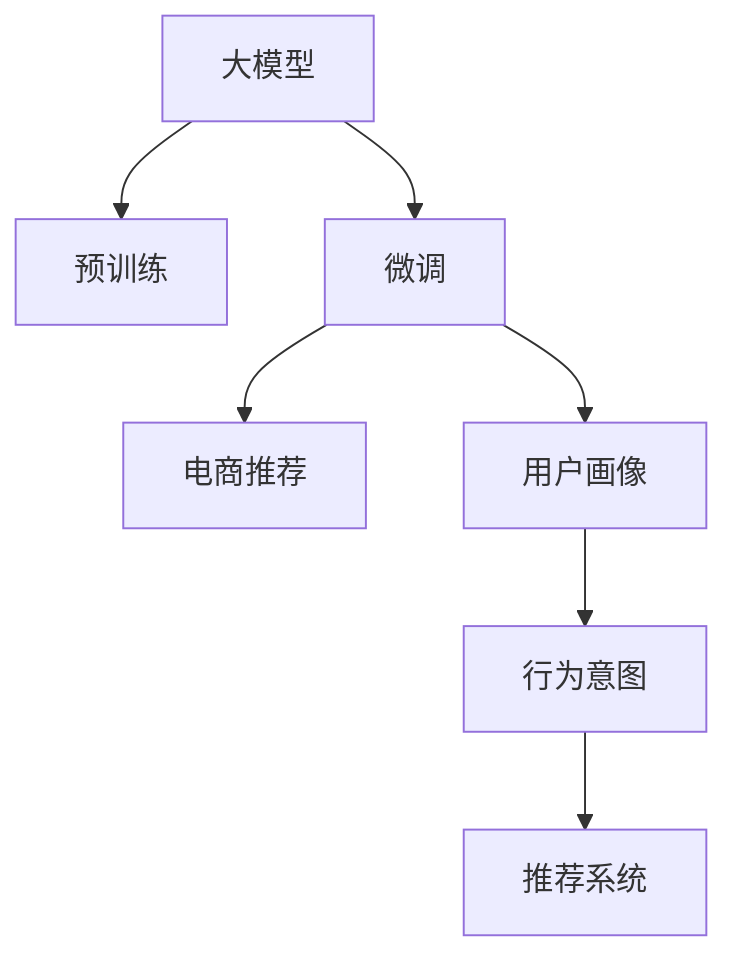

                 

# AI 大模型在电商搜索推荐中的用户画像技术：精准把握用户需求与行为意图

## 1. 背景介绍

### 1.1 问题由来
在电商领域，用户搜索与推荐系统是用户体验和转化率的关键。传统的搜索引擎通常基于简单的关键词匹配，难以全面理解用户的真实需求和行为意图。而基于大模型的用户画像技术，可以更全面、深入地分析用户行为，精准把握用户需求，提升推荐的个性化和精准性。

### 1.2 问题核心关键点
大模型在电商搜索推荐中的应用，核心在于通过语言模型预训练和微调，构建用户画像，从而更准确地预测用户行为。具体而言，大模型通过在电商领域的大量文本数据上进行预训练，学习用户搜索、浏览、点击、评论等行为背后的语言模式和语义信息。在此基础上，通过微调优化模型参数，使得其能够精确预测用户下一轮的行为，如选择商品、加入购物车、购买等。

## 2. 核心概念与联系

### 2.1 核心概念概述

为更好地理解大模型在电商搜索推荐中的应用，本节将介绍几个密切相关的核心概念：

- 大模型(Large Model)：指具有大规模参数量，能够处理大量语料，具备深度学习能力的神经网络模型。如GPT、BERT、T5等。
- 预训练(Pre-training)：指在大规模无标签文本语料上，通过自监督学习任务训练通用语言模型的过程。预训练使得模型学习到语言的通用表示。
- 微调(Fine-tuning)：指在预训练模型的基础上，使用电商领域的任务标注数据，通过有监督学习优化模型在特定任务上的性能。
- 用户画像(User Profile)：通过分析用户的行为数据，构建用户特征和兴趣模型，用于个性化推荐和精准营销。
- 行为意图(Beam-Intent)：指用户在进行行为（如搜索、点击、购买等）时所期望达到的目标，如找商品、比价格、看评价等。
- 推荐系统(Recommender System)：通过分析用户行为数据，预测用户对特定商品或内容的偏好，从而为用户推荐可能感兴趣的物品。

这些概念之间的逻辑关系可以通过以下Mermaid流程图来展示：



这个流程图展示了大模型与电商推荐系统的核心概念及其之间的关系：

1. 大模型通过预训练获得基础能力。
2. 微调是对大模型的特定任务进行优化，如电商推荐。
3. 用户画像技术基于微调后的大模型，进行用户行为特征提取。
4. 行为意图通过用户画像解析，用于指导推荐策略。
5. 推荐系统结合用户画像和行为意图，进行个性化推荐。

## 3. 核心算法原理 & 具体操作步骤
### 3.1 算法原理概述

基于大模型的电商搜索推荐，本质上是一种有监督的微调过程。其核心思想是：将大模型视作一个强大的"特征提取器"，通过在电商领域的标注数据上进行有监督微调，使得模型能够学习到电商用户的搜索和行为背后的语言模式和语义信息，从而精准预测用户的行为意图。

形式化地，假设大模型为 $M_{\theta}$，其中 $\theta$ 为预训练得到的模型参数。给定电商推荐任务的训练集 $D=\{(x_i,y_i)\}_{i=1}^N$，微调的目标是找到新的模型参数 $\hat{\theta}$，使得模型在特定电商场景下的推荐准确率最大化。具体而言，可以定义交叉熵损失函数 $\mathcal{L}(M_{\theta},D)$，并通过梯度下降等优化算法最小化该损失函数，最终得到适应电商推荐任务的最佳模型参数 $\hat{\theta}$。

### 3.2 算法步骤详解

基于大模型的电商推荐微调一般包括以下几个关键步骤：

**Step 1: 准备预训练模型和数据集**
- 选择合适的预训练语言模型 $M_{\theta}$，如BERT、GPT等，作为初始化参数。
- 准备电商领域的大量标注数据集 $D$，包括搜索记录、浏览行为、点击记录、购买记录等。

**Step 2: 添加电商任务适配层**
- 根据电商推荐任务，在预训练模型的基础上添加特定的任务适配层，如序列分类器、序列生成器等。
- 设计适合电商领域的损失函数，如交叉熵损失、均方误差损失等。

**Step 3: 设置微调超参数**
- 选择合适的优化算法及其参数，如 AdamW、SGD 等，设置学习率、批大小、迭代轮数等。
- 设置正则化技术及强度，包括权重衰减、Dropout、Early Stopping等。
- 确定冻结预训练参数的策略，如仅微调顶层，或全部参数都参与微调。

**Step 4: 执行梯度训练**
- 将电商数据集 $D$ 分批次输入模型，前向传播计算损失函数。
- 反向传播计算参数梯度，根据设定的优化算法和学习率更新模型参数。
- 周期性在验证集上评估模型性能，根据性能指标决定是否触发 Early Stopping。
- 重复上述步骤直至满足预设的迭代轮数或 Early Stopping 条件。

**Step 5: 测试和部署**
- 在测试集上评估微调后模型 $M_{\hat{\theta}}$ 的性能，对比微调前后的推荐效果。
- 使用微调后的模型对新用户的行为进行预测，集成到电商推荐系统中。
- 持续收集新的用户行为数据，定期重新微调模型，以适应电商领域数据分布的变化。

以上是基于大模型的电商推荐微调的一般流程。在实际应用中，还需要针对具体电商任务的特点，对微调过程的各个环节进行优化设计，如改进训练目标函数，引入更多的正则化技术，搜索最优的超参数组合等，以进一步提升模型性能。

### 3.3 算法优缺点

基于大模型的电商推荐微调方法具有以下优点：
1. 简单高效。只需准备少量标注数据，即可对预训练模型进行快速适配，获得较大的性能提升。
2. 通用适用。适用于各种电商推荐场景，如商品推荐、广告推荐、个性化折扣等。
3. 效果显著。在大模型微调的帮助下，电商推荐系统能够更好地适应用户行为，提高转化率和用户体验。
4. 可扩展性好。大模型在电商领域具有较强的泛化能力，能够轻松适配新商品、新场景和新用户。

同时，该方法也存在一定的局限性：
1. 依赖标注数据。微调的效果很大程度上取决于标注数据的质量和数量，获取高质量标注数据的成本较高。
2. 过拟合风险。电商数据通常具有高维度、非结构化的特点，容易过拟合。
3. 模型复杂度高。大模型参数量大，计算复杂度高，训练和推理都需要高性能计算资源。
4. 用户体验风险。模型预测结果可能与用户真实需求不符，降低用户体验。

尽管存在这些局限性，但就目前而言，基于大模型的电商推荐微调方法仍是大数据驱动的电商推荐系统的重要范式。未来相关研究的重点在于如何进一步降低微调对标注数据的依赖，提高模型的少样本学习和跨领域迁移能力，同时兼顾用户体验和模型复杂性等因素。

### 3.4 算法应用领域

基于大模型的电商推荐微调方法在电商搜索推荐领域已经得到了广泛的应用，覆盖了商品推荐、广告推荐、个性化折扣等多个场景。

- **商品推荐**：通过对用户的历史搜索、浏览、点击、购买行为进行分析，生成个性化的商品推荐列表。
- **广告推荐**：通过分析用户的兴趣和行为，智能推送广告，提升广告点击率和转化率。
- **个性化折扣**：根据用户的历史购买记录和行为数据，动态调整商品折扣，提升用户购买意愿。
- **智能客服**：通过分析用户聊天内容，智能推荐解决方案，提升客户服务质量。

除了上述这些经典场景外，大模型微调技术也被创新性地应用到更多电商应用中，如库存管理、推荐召回、市场分析等，为电商技术带来了全新的突破。随着预训练模型和微调方法的不断进步，相信电商技术将在更广阔的应用领域大放异彩。

## 4. 数学模型和公式 & 详细讲解 & 举例说明
### 4.1 数学模型构建

本节将使用数学语言对基于大模型的电商推荐微调过程进行更加严格的刻画。

假设电商推荐任务为序列分类任务，输入为用户的搜索记录和浏览行为，输出为推荐的商品 ID，则其数学模型可形式化为：

$$
\mathcal{L}(\theta) = -\frac{1}{N}\sum_{i=1}^N \sum_{j=1}^{L_j} y_j \log P_i(x_j)
$$

其中 $x_j$ 为用户在时间步 $j$ 的搜索记录或浏览行为，$L_j$ 为用户记录的持续时间，$y_j$ 为该时刻推荐的商品 ID，$P_i(x_j)$ 为模型在时间步 $j$ 对商品 ID $i$ 的预测概率，$N$ 为用户数。

为了简化计算，我们可以将时间步 $j$ 的搜索记录或浏览行为 $x_j$ 编码成固定长度的向量 $x_j^D$，其中 $D$ 为向量维度。则模型在时间步 $j$ 的预测概率可表示为：

$$
P_i(x_j) = \frac{\exp(a_i^Tx_j^D)}{\sum_{k=1}^{K} \exp(a_k^Tx_j^D)}
$$

其中 $a_i$ 为模型的第 $i$ 个商品的表示向量，$K$ 为商品总数。

### 4.2 公式推导过程

以下我们以序列分类任务为例，推导大模型的电商推荐微调损失函数及其梯度的计算公式。

设用户序列为 $x_1,x_2,\dots,x_{L_j}$，推荐序列为 $y_1,y_2,\dots,y_{L_j}$，则电商平台推荐任务的损失函数为：

$$
\mathcal{L}(\theta) = -\frac{1}{N}\sum_{i=1}^N \sum_{j=1}^{L_j} y_j \log P_i(x_j)
$$

将其展开，得：

$$
\mathcal{L}(\theta) = -\frac{1}{N}\sum_{i=1}^N \sum_{j=1}^{L_j} y_j (\log P_i(x_j) - \log \hat{P}_i(x_j))
$$

其中 $\hat{P}_i(x_j)$ 为模型在时间步 $j$ 对商品 ID $i$ 的预测概率，$P_i(x_j)$ 为真实概率。

对上述损失函数求导，得：

$$
\frac{\partial \mathcal{L}(\theta)}{\partial \theta_k} = -\frac{1}{N}\sum_{i=1}^N \sum_{j=1}^{L_j} \frac{\partial P_i(x_j)}{\partial \theta_k} (y_j - \hat{P}_i(x_j))
$$

其中 $\frac{\partial P_i(x_j)}{\partial \theta_k}$ 为模型对商品 ID $i$ 的预测概率对模型参数 $\theta_k$ 的梯度，可通过反向传播算法高效计算。

### 4.3 案例分析与讲解

为了更好地理解上述公式，我们可以以一个简单的电商推荐系统为例进行说明。

假设电商平台推荐系统有一个简单的基于大模型的推荐模型，输入为用户的搜索记录和浏览行为，输出为商品 ID。模型参数 $\theta$ 包括商品表示向量 $a_1,a_2,\dots,a_K$ 和用户序列表示向量 $a_1,a_2,\dots,a_D$。

- 用户在时间步 $j$ 搜索了一条商品信息，系统推荐了商品 $i$，但用户没有点击该商品，则真实概率 $y_j=0$。
- 模型在时间步 $j$ 对商品 $i$ 的预测概率为 $P_i(x_j)=\frac{\exp(a_i^Tx_j^D)}{\sum_{k=1}^{K} \exp(a_k^Tx_j^D)}$。
- 假设系统预测概率 $\hat{P}_i(x_j)$ 与真实概率相差较大，则损失函数会对模型的预测概率进行修正，更新模型参数，使其更接近真实概率。

以上案例展示了大模型在电商推荐系统中的作用机制。通过对大量电商用户行为数据的训练，模型可以逐步学习到不同商品和用户之间的关联关系，从而提高推荐的准确性和个性化。

## 5. 项目实践：代码实例和详细解释说明
### 5.1 开发环境搭建

在进行电商推荐微调实践前，我们需要准备好开发环境。以下是使用Python进行TensorFlow开发的环境配置流程：

1. 安装Anaconda：从官网下载并安装Anaconda，用于创建独立的Python环境。

2. 创建并激活虚拟环境：
```bash
conda create -n tf-env python=3.8 
conda activate tf-env
```

3. 安装TensorFlow：根据CUDA版本，从官网获取对应的安装命令。例如：
```bash
conda install tensorflow -c conda-forge
```

4. 安装TensorBoard：用于可视化模型训练过程，记录和展示模型训练的各项指标。
```bash
pip install tensorboard
```

5. 安装相关库：
```bash
pip install numpy pandas sklearn scipy matplotlib tqdm jupyter notebook ipython
```

完成上述步骤后，即可在`tf-env`环境中开始微调实践。

### 5.2 源代码详细实现

下面我们以序列分类任务为例，给出使用TensorFlow对BERT模型进行电商推荐微调的代码实现。

首先，定义数据处理函数：

```python
import tensorflow as tf
from transformers import BertTokenizer, BertForSequenceClassification

# 定义Bert tokenizer和BertForSequenceClassification模型
tokenizer = BertTokenizer.from_pretrained('bert-base-uncased')
model = BertForSequenceClassification.from_pretrained('bert-base-uncased', num_labels=10)

# 定义训练集和测试集
train_dataset = ...
test_dataset = ...

# 将训练集和测试集转化为模型所需的格式
train_dataset = train_dataset.map(lambda x, y: (tokenizer(x, truncation=True, padding='max_length'), y))
test_dataset = test_dataset.map(lambda x, y: (tokenizer(x, truncation=True, padding='max_length'), y))
```

然后，定义训练和评估函数：

```python
from sklearn.metrics import accuracy_score

# 定义优化器
optimizer = tf.keras.optimizers.AdamW(learning_rate=2e-5)

# 定义训练函数
def train_epoch(model, dataset, batch_size, optimizer):
    model.compile(optimizer=optimizer, loss='sparse_categorical_crossentropy', metrics=['accuracy'])
    for batch in dataset.batch(batch_size):
        inputs, labels = batch
        with tf.GradientTape() as tape:
            logits = model(inputs, training=True)
            loss = tf.keras.losses.sparse_categorical_crossentropy(labels, logits)
        grads = tape.gradient(loss, model.trainable_variables)
        optimizer.apply_gradients(zip(grads, model.trainable_variables))
    
# 定义评估函数
def evaluate(model, dataset, batch_size):
    model.compile(optimizer=optimizer, loss='sparse_categorical_crossentropy', metrics=['accuracy'])
    preds, labels = [], []
    for batch in dataset.batch(batch_size):
        inputs, labels = batch
        logits = model(inputs, training=False)
        preds.append(logits.numpy())
        labels.append(labels.numpy())
    preds = np.concatenate(preds)
    labels = np.concatenate(labels)
    print('Accuracy:', accuracy_score(labels, preds))
```

最后，启动训练流程并在测试集上评估：

```python
epochs = 5
batch_size = 16

for epoch in range(epochs):
    train_epoch(model, train_dataset, batch_size, optimizer)
    print(f'Epoch {epoch+1}, train accuracy: {evaluate(model, train_dataset, batch_size)}')
    print(f'Epoch {epoch+1}, test accuracy: {evaluate(model, test_dataset, batch_size)}')
```

以上就是使用TensorFlow对BERT进行电商推荐微调的完整代码实现。可以看到，TensorFlow提供了简洁的高级API，使得模型构建和训练过程更加高效和易用。

### 5.3 代码解读与分析

让我们再详细解读一下关键代码的实现细节：

**数据处理函数**：
- 定义了Bert tokenizer和模型。
- 将原始数据集转化为模型所需的格式，并进行Truncation和Padding处理。

**优化器选择**：
- 使用AdamW优化器，设置了合适的学习率。

**训练函数**：
- 将模型编译为训练模式，使用sparse_categorical_crossentropy作为损失函数。
- 在每个批次上计算模型损失和梯度，并使用梯度下降更新模型参数。

**评估函数**：
- 将模型编译为评估模式，使用sparse_categorical_crossentropy作为损失函数。
- 对测试集数据进行预测，并计算模型预测的准确率。

**训练流程**：
- 定义总轮数和批次大小。
- 每个轮次内，先在训练集上训练，输出模型训练的准确率。
- 在测试集上评估模型，输出模型评估的准确率。

可以看到，TensorFlow提供了完整的机器学习生态，使得微调任务的开发过程更加高效和便捷。开发者可以将更多精力放在模型改进和数据优化上，而不必过多关注底层实现细节。

当然，工业级的系统实现还需考虑更多因素，如模型的保存和部署、超参数的自动搜索、更灵活的任务适配层等。但核心的微调范式基本与此类似。

## 6. 实际应用场景
### 6.1 智能客服系统

基于大模型微调的智能客服系统，可以在电商场景中广泛应用。智能客服系统通过分析用户的问题和历史记录，能够快速响应客户咨询，提供智能解答，提高客户满意度。

在技术实现上，可以收集企业的客服对话记录，将问题和最佳答复构建成监督数据，在此基础上对预训练模型进行微调。微调后的模型能够自动理解用户意图，匹配最合适的答案模板进行回复。对于客户提出的新问题，还可以接入检索系统实时搜索相关内容，动态组织生成回答。如此构建的智能客服系统，能大幅提升客户咨询体验和问题解决效率。

### 6.2 个性化推荐系统

电商推荐系统通常基于用户的行为数据，推荐可能感兴趣的物品。但用户的行为数据往往具有高维度、非结构化的特点，难以直接用于推荐模型训练。通过大模型的微调，电商推荐系统能够更好地从文本数据中提取用户行为背后的语义信息，进行更精确的推荐。

在实际应用中，可以收集用户的浏览记录、评价内容等文本数据，将其作为监督数据对模型进行微调。微调后的模型能够从文本数据中挖掘出用户的兴趣点和购买意愿，生成个性化的推荐列表。同时，可以利用微调后的模型，对新用户的行为进行预测，实时更新推荐内容，提升推荐效果。

### 6.3 广告推荐系统

广告推荐系统通过分析用户的兴趣和行为，智能推送广告，提升广告点击率和转化率。广告推荐通常需要实时处理海量的用户行为数据，传统的机器学习模型难以满足高实时性和高准确性的要求。

通过大模型的微调，广告推荐系统能够从用户的行为数据中提取更丰富的语义信息，提高广告点击率和转化率。例如，可以在用户的搜索记录、浏览历史等文本数据上进行微调，学习用户对不同广告内容的偏好，生成更精准的广告推荐。同时，可以利用微调后的模型，进行实时广告投放，动态调整广告策略，提升广告效果。

### 6.4 未来应用展望

随着大语言模型微调技术的发展，未来在电商搜索推荐中的应用将更加广泛和深入。

1. **多模态推荐**：未来的电商推荐系统将更多地融合文本、图像、语音等多种模态数据，提升推荐系统的多样性和精准性。
2. **跨领域推荐**：大模型微调技术将有助于构建跨领域的推荐系统，将不同领域的产品和服务进行关联推荐，提升用户体验。
3. **情感驱动推荐**：通过对用户情感数据的分析，电商推荐系统能够更精准地识别用户的情绪状态，提供更具情感共鸣的推荐内容。
4. **实时推荐**：结合实时数据流，电商推荐系统将能够动态调整推荐策略，提供实时推荐服务，满足用户即时需求。
5. **个性化体验**：通过对用户历史行为和偏好数据的深度挖掘，电商推荐系统将能够提供更加个性化和差异化的推荐服务，提升用户体验。

这些应用趋势将推动电商搜索推荐系统不断进化，为用户提供更加智能、高效、个性化的服务体验。

## 7. 工具和资源推荐
### 7.1 学习资源推荐

为了帮助开发者系统掌握大模型微调的理论基础和实践技巧，这里推荐一些优质的学习资源：

1. 《Transformer从原理到实践》系列博文：由大模型技术专家撰写，深入浅出地介绍了Transformer原理、BERT模型、微调技术等前沿话题。
2. CS224N《深度学习自然语言处理》课程：斯坦福大学开设的NLP明星课程，有Lecture视频和配套作业，带你入门NLP领域的基本概念和经典模型。
3. 《Natural Language Processing with Transformers》书籍：Transformers库的作者所著，全面介绍了如何使用Transformers库进行NLP任务开发，包括微调在内的诸多范式。
4. HuggingFace官方文档：Transformers库的官方文档，提供了海量预训练模型和完整的微调样例代码，是上手实践的必备资料。
5. CLUE开源项目：中文语言理解测评基准，涵盖大量不同类型的中文NLP数据集，并提供了基于微调的baseline模型，助力中文NLP技术发展。

通过对这些资源的学习实践，相信你一定能够快速掌握大语言模型微调的精髓，并用于解决实际的NLP问题。

### 7.2 开发工具推荐

高效的开发离不开优秀的工具支持。以下是几款用于大模型微调开发的常用工具：

1. TensorFlow：基于Python的开源深度学习框架，灵活动态的计算图，适合快速迭代研究。大部分预训练语言模型都有TensorFlow版本的实现。
2. PyTorch：基于Python的开源深度学习框架，动态图设计，灵活高效。适合进行复杂的深度学习模型开发。
3. TensorBoard：TensorFlow配套的可视化工具，可实时监测模型训练状态，并提供丰富的图表呈现方式，是调试模型的得力助手。
4. Weights & Biases：模型训练的实验跟踪工具，可以记录和可视化模型训练过程中的各项指标，方便对比和调优。与主流深度学习框架无缝集成。
5. PyCharm：由JetBrains开发的Python IDE，提供了丰富的开发工具和插件，适合进行复杂项目开发。

合理利用这些工具，可以显著提升大模型微调任务的开发效率，加快创新迭代的步伐。

### 7.3 相关论文推荐

大语言模型和微调技术的发展源于学界的持续研究。以下是几篇奠基性的相关论文，推荐阅读：

1. Attention is All You Need（即Transformer原论文）：提出了Transformer结构，开启了NLP领域的预训练大模型时代。
2. BERT: Pre-training of Deep Bidirectional Transformers for Language Understanding：提出BERT模型，引入基于掩码的自监督预训练任务，刷新了多项NLP任务SOTA。
3. Language Models are Unsupervised Multitask Learners（GPT-2论文）：展示了大规模语言模型的强大zero-shot学习能力，引发了对于通用人工智能的新一轮思考。
4. Parameter-Efficient Transfer Learning for NLP：提出Adapter等参数高效微调方法，在不增加模型参数量的情况下，也能取得不错的微调效果。
5. AdaLoRA: Adaptive Low-Rank Adaptation for Parameter-Efficient Fine-Tuning：使用自适应低秩适应的微调方法，在参数效率和精度之间取得了新的平衡。

这些论文代表了大语言模型微调技术的发展脉络。通过学习这些前沿成果，可以帮助研究者把握学科前进方向，激发更多的创新灵感。

## 8. 总结：未来发展趋势与挑战
### 8.1 总结

本文对基于大模型的电商推荐微调方法进行了全面系统的介绍。首先阐述了电商推荐微调的背景和意义，明确了微调在提高电商搜索推荐系统性能和个性化程度方面的重要价值。其次，从原理到实践，详细讲解了电商推荐微调的数学模型和关键步骤，给出了电商推荐微调的完整代码实例。同时，本文还广泛探讨了电商推荐微调在智能客服、个性化推荐、广告推荐等多个电商场景中的应用前景，展示了微调范式的巨大潜力。此外，本文精选了微调技术的各类学习资源，力求为读者提供全方位的技术指引。

通过本文的系统梳理，可以看到，基于大模型的电商推荐微调技术在电商搜索推荐系统中具有重要应用，能够显著提升推荐的个性化和精准性，增强用户购物体验。未来，随着大语言模型微调技术的发展，电商推荐系统将进一步提升其智能化水平，为电商行业带来更多创新和突破。

### 8.2 未来发展趋势

展望未来，大模型微调技术在电商推荐系统中的应用将呈现以下几个发展趋势：

1. **多模态融合**：未来的电商推荐系统将更多地融合文本、图像、语音等多种模态数据，提升推荐系统的多样性和精准性。
2. **跨领域推荐**：大模型微调技术将有助于构建跨领域的推荐系统，将不同领域的产品和服务进行关联推荐，提升用户体验。
3. **情感驱动推荐**：通过对用户情感数据的分析，电商推荐系统能够更精准地识别用户的情绪状态，提供更具情感共鸣的推荐内容。
4. **实时推荐**：结合实时数据流，电商推荐系统将能够动态调整推荐策略，提供实时推荐服务，满足用户即时需求。
5. **个性化体验**：通过对用户历史行为和偏好数据的深度挖掘，电商推荐系统将能够提供更加个性化和差异化的推荐服务，提升用户体验。

以上趋势凸显了大语言模型微调技术的广阔前景。这些方向的探索发展，必将进一步提升电商推荐系统的性能和应用范围，为电商行业带来更多创新和突破。

### 8.3 面临的挑战

尽管大语言模型微调技术在电商推荐系统中取得了显著效果，但在其发展和应用过程中，仍面临诸多挑战：

1. **标注数据依赖**：电商数据通常具有高维度、非结构化的特点，难以直接用于推荐模型训练。获取高质量标注数据的成本较高，成为制约微调性能的瓶颈。
2. **模型复杂度**：大模型参数量大，计算复杂度高，训练和推理都需要高性能计算资源，难以在低计算资源环境下应用。
3. **泛化能力**：电商数据分布复杂，不同商品、不同用户在推荐系统中的行为模式差异较大，难以构建具有泛化能力的推荐模型。
4. **推荐公平性**：电商推荐系统需考虑推荐公平性问题，避免推荐内容对某些用户群体产生偏见，影响用户体验。
5. **实时性能**：电商推荐系统需具备实时推荐能力，能在用户浏览过程中实时更新推荐内容，这对系统的响应时间和计算效率提出了高要求。
6. **用户隐私保护**：电商推荐系统需保证用户隐私保护，避免用户行为数据被滥用，引发隐私和安全问题。

这些挑战需要研究人员和开发者共同努力，探索新的技术手段和方法，才能推动大语言模型微调技术在电商推荐系统中的应用发展。

### 8.4 研究展望

面对大语言模型微调技术在电商推荐系统中的应用挑战，未来的研究方向可以从以下几个方面展开：

1. **无监督和半监督学习**：摆脱对标注数据的依赖，利用自监督学习、主动学习等无监督和半监督范式，最大化利用非结构化数据，实现更加灵活高效的推荐。
2. **跨领域数据融合**：探索跨领域数据的融合技术，提升推荐系统对不同领域数据的学习和迁移能力。
3. **多模态信息融合**：融合文本、图像、语音等多种模态数据，提升推荐系统的多样性和精准性。
4. **实时推荐系统**：构建实时推荐系统，通过高效的数据流处理和算法优化，实现实时推荐功能。
5. **推荐系统公平性**：研究推荐系统公平性问题，避免推荐内容对某些用户群体产生偏见，提高推荐系统的公平性和可解释性。
6. **用户隐私保护**：研究用户隐私保护技术，保证用户行为数据的安全性和隐私性，避免数据滥用和隐私泄露。

这些研究方向将推动大语言模型微调技术在电商推荐系统中的深入应用，为电商行业带来更多的创新和突破。

## 9. 附录：常见问题与解答

**Q1：大模型微调对电商推荐系统的影响有哪些？**

A: 大模型微调对电商推荐系统的影响主要体现在以下几个方面：
1. **推荐精度提升**：大模型微调能够更好地理解用户的行为和需求，提升推荐的精准度。
2. **个性化增强**：通过用户画像和行为意图分析，推荐系统能够提供更加个性化和差异化的推荐服务。
3. **实时性提升**：大模型微调技术能够实时处理用户行为数据，动态调整推荐策略，提升推荐系统的响应速度。
4. **跨领域能力**：大模型微调技术有助于构建跨领域的推荐系统，提升用户在不同领域的购物体验。

**Q2：大模型微调需要注意哪些过拟合问题？**

A: 大模型微调在电商推荐系统中容易出现以下过拟合问题：
1. **高维数据过拟合**：电商数据通常具有高维度、非结构化的特点，容易发生过拟合。
2. **数据分布偏差**：电商数据分布复杂，不同商品、不同用户在推荐系统中的行为模式差异较大，难以构建具有泛化能力的推荐模型。
3. **模型复杂度高**：大模型参数量大，计算复杂度高，训练和推理都需要高性能计算资源。

解决这些问题的方法包括：
1. **数据增强**：通过数据增强技术，如回译、近义替换等方式扩充训练集，增加数据多样性。
2. **正则化技术**：使用L2正则、Dropout、Early Stopping等技术，防止模型过度适应训练数据。
3. **参数高效微调**：采用参数高效微调方法，如Adapter等，减少需优化的参数量。
4. **多模型集成**：训练多个微调模型，取平均输出，抑制过拟合。

**Q3：电商推荐系统中大模型的实时性如何保证？**

A: 大模型在电商推荐系统中的实时性可以通过以下方法保证：
1. **模型裁剪**：去除不必要的层和参数，减小模型尺寸，加快推理速度。
2. **量化加速**：将浮点模型转为定点模型，压缩存储空间，提高计算效率。
3. **模型并行**：使用模型并行技术，提高计算效率，缩短推理时间。
4. **算法优化**：优化推荐算法，减少计算量，提高响应速度。

通过上述方法的综合应用，可以显著提升电商推荐系统的大模型实时性，满足用户即时需求。

**Q4：电商推荐系统中大模型的隐私保护措施有哪些？**

A: 电商推荐系统中大模型的隐私保护措施包括：
1. **数据匿名化**：对用户行为数据进行匿名化处理，防止数据泄露。
2. **差分隐私**：在数据处理和模型训练过程中引入差分隐私技术，防止个体隐私泄露。
3. **访问控制**：通过访问控制技术，限制数据访问权限，保护用户隐私。
4. **加密技术**：采用数据加密技术，保护用户数据安全。
5. **用户自主管理**：提供用户数据管理功能，让用户可以自主控制数据的使用和分享。

通过上述措施的综合应用，可以有效地保护电商推荐系统中大模型的隐私安全，保障用户数据安全。

---

作者：禅与计算机程序设计艺术 / Zen and the Art of Computer Programming

