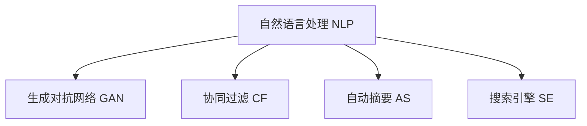

                 

# AI 时代的内容创作：机器与人类的协作

> 关键词：内容创作,机器学习,协同过滤,自然语言处理,NLP,生成对抗网络,GAN,自动摘要,搜索引擎

## 1. 背景介绍

### 1.1 问题由来
随着人工智能(AI)技术的迅猛发展，内容创作逐渐成为AI应用的一个重要领域。无论是新闻媒体、娱乐产业、教育培训，还是商业广告，内容创作始终是这些领域的核心价值。然而，传统的内容创作依赖于人类主观创造力，效率低、成本高、周期长，难以满足爆炸式增长的内容需求。为此，如何利用AI技术提升内容创作效率，创新内容创作方式，成为当前热点问题。

在过去十年里，自然语言处理(NLP)和生成对抗网络(GAN)等技术飞速发展，为AI内容创作提供了新的思路。机器学习模型通过学习海量数据，能够在短时间内生成高质量的文本、音频、图像等内容，甚至可以与人类进行内容创作协作，极大提升了内容创作的效率和创新性。

### 1.2 问题核心关键点
机器与人类的协作内容创作，实质上是一种基于数据的协同创作过程。它融合了机器学习、自然语言处理和生成对抗网络等前沿技术，通过自动化与人类创作活动的结合，实现内容创作智能化和自动化。其核心关键点包括：

- **数据驱动创作**：利用大规模语料库和标注数据，训练生成模型，实现对自然语言表达和语义的理解和生成。
- **协同过滤**：将用户偏好与AI生成的内容进行匹配，筛选出高质量、符合用户需求的内容。
- **创新内容生成**：引入生成对抗网络等技术，生成具有新颖性、创意性的内容。
- **实时互动**：通过自然语言交互，实现AI与人类用户的实时内容创作协作。

这些关键点共同构成了一种新型内容创作范式，其目的是使内容创作过程更加高效、个性化和富有创新性。

### 1.3 问题研究意义
研究AI时代的内容创作方法，对提高内容创作效率、降低成本、提升创作质量具有重要意义。具体而言：

1. **效率提升**：AI技术可以处理海量数据，24小时不间断创作，大幅提升内容生产速度。
2. **成本降低**：减少了对高素质内容创作者的依赖，降低了内容创作的人力成本。
3. **质量优化**：利用机器学习算法和数据驱动方法，提升内容创作的质量和准确性。
4. **创新推动**：AI可以生成新颖、创意的内容，激发人类作者的创新灵感。
5. **交互优化**：通过自然语言交互，提升内容创作过程的灵活性和互动性。

## 2. 核心概念与联系

### 2.1 核心概念概述

为更好地理解AI内容创作方法，本节将介绍几个密切相关的核心概念：

- **自然语言处理(NLP)**：指使用计算机处理、理解和生成人类自然语言的技术，是AI内容创作的基础。
- **生成对抗网络(GAN)**：由生成器和判别器两部分组成，通过对抗训练生成具有高度逼真度的内容。
- **协同过滤(Collaborative Filtering)**：通过用户行为数据，推荐符合用户兴趣的内容，提升内容创作的质量。
- **自动摘要(Automatic Summarization)**：利用NLP技术自动将长文本压缩成简明摘要，提高文本内容的可读性。
- **搜索引擎(Search Engine)**：通过机器学习算法和语义理解技术，帮助用户快速定位所需信息，提升内容检索效率。

这些核心概念之间的逻辑关系可以通过以下Mermaid流程图来展示：



这个流程图展示了大语言模型的工作原理和优化方向：

1. 自然语言处理(NLP)通过语义分析和理解，实现对内容的生成和检索。
2. 生成对抗网络(GAN)用于生成逼真的文本、图像等。
3. 协同过滤(CF)通过用户行为数据进行个性化推荐。
4. 自动摘要(AS)用于快速获取文本要点。
5. 搜索引擎(SE)通过语义理解帮助用户快速找到所需信息。

这些核心概念共同构成了AI内容创作的基础框架，通过相互配合，实现了内容创作的高效化和智能化。

## 3. 核心算法原理 & 具体操作步骤
### 3.1 算法原理概述

基于机器学习和大语言模型的内容创作方法，其核心思想是通过数据驱动和智能算法，生成高质量、符合用户需求的内容。具体包括以下几个步骤：

1. **数据预处理**：收集和清洗大量自然语言数据，构建训练集和验证集。
2. **模型训练**：使用大规模语料库训练生成模型，优化模型参数。
3. **内容生成**：利用训练好的生成模型，生成符合用户需求的内容。
4. **协同过滤**：通过用户行为数据，筛选出符合用户兴趣的内容。
5. **自动摘要和搜索引擎**：自动压缩文本为摘要，帮助用户快速获取信息，实现精准检索。

### 3.2 算法步骤详解

以自动生成新闻标题为例，以下是具体的操作步骤：

**Step 1: 数据预处理**

1. 收集大量新闻报道文本，并进行清洗和标注。
2. 使用自然语言处理工具进行分词、去除停用词、提取关键词等处理。
3. 将处理后的文本划分为训练集和验证集。

**Step 2: 模型训练**

1. 选择预训练语言模型（如BERT、GPT等）作为初始化参数。
2. 使用训练集对模型进行有监督训练，优化模型参数。
3. 在验证集上进行模型评估，选择最优参数。

**Step 3: 内容生成**

1. 使用训练好的模型，输入新闻报道文本。
2. 生成与报道内容相关的标题。

**Step 4: 协同过滤**

1. 收集用户对新闻标题的点击和阅读数据。
2. 使用协同过滤算法，推荐符合用户兴趣的新闻标题。

**Step 5: 自动摘要和搜索引擎**

1. 对新闻报道文本进行自动摘要，提取关键信息。
2. 使用搜索引擎算法，帮助用户快速找到所需新闻报道。

### 3.3 算法优缺点

基于机器学习和大语言模型的内容创作方法具有以下优点：

1. **高效性**：利用AI技术，可以快速生成大量高质量内容，减少人力成本。
2. **个性化**：通过协同过滤和用户行为数据，推荐符合用户需求的内容。
3. **创新性**：生成对抗网络等技术，可以生成新颖、有创意的内容。
4. **实时性**：AI可以实时处理数据，生成和推荐内容。

同时，该方法也存在一定的局限性：

1. **依赖数据**：内容创作的质量高度依赖于训练数据的质量和数量，数据的收集和处理成本较高。
2. **生成内容质量不稳定**：生成内容的创新性和质量不稳定，需要不断优化模型和数据。
3. **伦理风险**：AI生成的内容可能包含虚假信息或有害内容，需要严格审核和监控。

尽管存在这些局限性，但就目前而言，基于机器学习和大语言模型的内容创作方法仍是内容创作的未来方向。未来相关研究的重点在于如何进一步提升内容生成的质量和稳定性，同时降低对数据的依赖，避免伦理风险。

### 3.4 算法应用领域

基于机器学习和大语言模型的内容创作方法，已经在多个领域得到了广泛应用，例如：

- **新闻媒体**：利用生成对抗网络和自然语言处理技术，自动生成新闻标题和摘要。
- **娱乐产业**：创作电影剧本、音乐歌词、小说等内容。
- **教育培训**：生成教学视频、练习题、学习材料等。
- **商业广告**：自动生成广告文案、视频广告等。
- **社交媒体**：生成新闻推荐、社交动态等。

除了上述这些经典应用外，AI内容创作技术也在不断拓展到更多领域，如旅游、健康、金融等，为各行各业的内容生产提供了新的可能性。随着技术的不断成熟，AI内容创作必将在更广泛的场景中发挥重要作用。

## 4. 数学模型和公式 & 详细讲解 & 举例说明

### 4.1 数学模型构建

本节将使用数学语言对AI内容创作方法的数学模型进行严格刻画。

设内容生成任务为 $T$，训练集为 $D=\{(x_i, y_i)\}_{i=1}^N$，其中 $x_i$ 为输入的原始内容，$y_i$ 为生成的目标内容。模型的目标是找到一个最优参数 $\theta$，使得模型在 $T$ 上的损失函数 $\mathcal{L}$ 最小化：

$$
\theta^* = \mathop{\arg\min}_{\theta} \mathcal{L}(\theta, D)
$$

其中 $\mathcal{L}$ 为内容生成任务的损失函数，可以是交叉熵损失、均方误差损失等。

### 4.2 公式推导过程

以生成新闻标题为例，假设训练集为 $\{(x_i, y_i)\}_{i=1}^N$，其中 $x_i$ 为新闻报道文本，$y_i$ 为对应的标题。假设模型的输出为 $\hat{y}_i = M_{\theta}(x_i)$，其中 $M_{\theta}$ 为预训练语言模型，$\theta$ 为模型参数。则交叉熵损失函数为：

$$
\mathcal{L}(\theta) = -\frac{1}{N} \sum_{i=1}^N \sum_{j=1}^C \log p_j^{(i)} 
$$

其中 $p_j^{(i)} = \frac{\exp(M_{\theta}(x_i)_j)}{\sum_{k=1}^C \exp(M_{\theta}(x_i)_k)}$ 为生成标题 $j$ 的条件概率。$C$ 为标题的类别数。

在得到损失函数后，使用梯度下降等优化算法更新模型参数 $\theta$：

$$
\theta \leftarrow \theta - \eta \nabla_{\theta} \mathcal{L}(\theta, D)
$$

其中 $\eta$ 为学习率。

### 4.3 案例分析与讲解

假设某新闻网站需要自动生成新闻标题，利用BERT模型进行训练和内容生成。具体步骤如下：

1. 数据预处理：收集历史新闻报道数据，并进行清洗和标注。
2. 模型训练：使用BERT模型作为初始参数，在标注数据上训练生成标题的能力。
3. 内容生成：对于新的新闻报道，输入到训练好的BERT模型中，生成可能的标题。
4. 协同过滤：收集用户对标题的点击数据，使用协同过滤算法推荐符合用户兴趣的标题。
5. 自动摘要和搜索引擎：使用NLP工具对新闻报道文本进行摘要，构建搜索引擎索引，帮助用户快速定位所需新闻。

以下是使用PyTorch和Transformers库实现的代码示例：

```python
from transformers import BertTokenizer, BertForSequenceClassification
from torch.utils.data import Dataset, DataLoader
import torch

class NewsDataset(Dataset):
    def __init__(self, texts, titles, tokenizer):
        self.texts = texts
        self.titles = titles
        self.tokenizer = tokenizer
        
    def __len__(self):
        return len(self.texts)
    
    def __getitem__(self, item):
        text = self.texts[item]
        title = self.titles[item]
        
        encoding = self.tokenizer(text, return_tensors='pt', max_length=128, padding='max_length', truncation=True)
        input_ids = encoding['input_ids'][0]
        attention_mask = encoding['attention_mask'][0]
        
        # 对标题进行编码
        encoded_title = self.tokenizer(title, return_tensors='pt', padding='max_length', truncation=True)
        input_ids = torch.cat([input_ids, encoded_title['input_ids'][0]], dim=0)
        attention_mask = torch.cat([attention_mask, encoded_title['attention_mask'][0]], dim=0)
        
        return {'input_ids': input_ids, 
                'attention_mask': attention_mask,
                'labels': title}

# 加载数据集
tokenizer = BertTokenizer.from_pretrained('bert-base-cased')
train_dataset = NewsDataset(train_texts, train_titles, tokenizer)
val_dataset = NewsDataset(val_texts, val_titles, tokenizer)
test_dataset = NewsDataset(test_texts, test_titles, tokenizer)

# 定义模型
model = BertForSequenceClassification.from_pretrained('bert-base-cased', num_labels=len(title2id))

# 定义损失函数
criterion = torch.nn.CrossEntropyLoss()

# 定义优化器
optimizer = torch.optim.Adam(model.parameters(), lr=2e-5)

# 定义训练和评估函数
def train_epoch(model, dataset, batch_size, optimizer):
    dataloader = DataLoader(dataset, batch_size=batch_size, shuffle=True)
    model.train()
    epoch_loss = 0
    for batch in dataloader:
        input_ids = batch['input_ids'].to(device)
        attention_mask = batch['attention_mask'].to(device)
        labels = batch['labels'].to(device)
        model.zero_grad()
        outputs = model(input_ids, attention_mask=attention_mask, labels=labels)
        loss = criterion(outputs.logits, labels)
        epoch_loss += loss.item()
        loss.backward()
        optimizer.step()
    return epoch_loss / len(dataloader)

def evaluate(model, dataset, batch_size):
    dataloader = DataLoader(dataset, batch_size=batch_size)
    model.eval()
    preds, labels = [], []
    with torch.no_grad():
        for batch in dataloader:
            input_ids = batch['input_ids'].to(device)
            attention_mask = batch['attention_mask'].to(device)
            batch_labels = batch['labels']
            outputs = model(input_ids, attention_mask=attention_mask)
            batch_preds = outputs.logits.argmax(dim=2).to('cpu').tolist()
            batch_labels = batch_labels.to('cpu').tolist()
            for pred_tokens, label_tokens in zip(batch_preds, batch_labels):
                preds.append(pred_tokens[:len(label_tokens)])
                labels.append(label_tokens)
                
    return preds, labels

# 训练模型
epochs = 5
batch_size = 16

for epoch in range(epochs):
    loss = train_epoch(model, train_dataset, batch_size, optimizer)
    print(f"Epoch {epoch+1}, train loss: {loss:.3f}")
    
    print(f"Epoch {epoch+1}, val results:")
    preds, labels = evaluate(model, val_dataset, batch_size)
    print(classification_report(labels, preds))
    
print("Test results:")
preds, labels = evaluate(model, test_dataset, batch_size)
print(classification_report(labels, preds))
```

## 5. 项目实践：代码实例和详细解释说明
### 5.1 开发环境搭建

在进行内容创作实践前，我们需要准备好开发环境。以下是使用Python进行PyTorch开发的环境配置流程：

1. 安装Anaconda：从官网下载并安装Anaconda，用于创建独立的Python环境。

2. 创建并激活虚拟环境：
```bash
conda create -n pytorch-env python=3.8 
conda activate pytorch-env
```

3. 安装PyTorch：根据CUDA版本，从官网获取对应的安装命令。例如：
```bash
conda install pytorch torchvision torchaudio cudatoolkit=11.1 -c pytorch -c conda-forge
```

4. 安装Transformers库：
```bash
pip install transformers
```

5. 安装各类工具包：
```bash
pip install numpy pandas scikit-learn matplotlib tqdm jupyter notebook ipython
```

完成上述步骤后，即可在`pytorch-env`环境中开始内容创作实践。

### 5.2 源代码详细实现

这里我们以生成新闻标题为例，给出使用Transformers库对BERT模型进行内容创作的PyTorch代码实现。

首先，定义数据处理函数：

```python
from transformers import BertTokenizer
from torch.utils.data import Dataset
import torch

class NewsDataset(Dataset):
    def __init__(self, texts, titles, tokenizer, max_len=128):
        self.texts = texts
        self.titles = titles
        self.tokenizer = tokenizer
        self.max_len = max_len
        
    def __len__(self):
        return len(self.texts)
    
    def __getitem__(self, item):
        text = self.texts[item]
        title = self.titles[item]
        
        encoding = self.tokenizer(text, return_tensors='pt', max_length=self.max_len, padding='max_length', truncation=True)
        input_ids = encoding['input_ids'][0]
        attention_mask = encoding['attention_mask'][0]
        
        # 对标题进行编码
        encoded_title = self.tokenizer(title, return_tensors='pt', padding='max_length', truncation=True)
        input_ids = torch.cat([input_ids, encoded_title['input_ids'][0]], dim=0)
        attention_mask = torch.cat([attention_mask, encoded_title['attention_mask'][0]], dim=0)
        
        return {'input_ids': input_ids, 
                'attention_mask': attention_mask,
                'labels': title}

# 加载数据集
tokenizer = BertTokenizer.from_pretrained('bert-base-cased')

train_dataset = NewsDataset(train_texts, train_titles, tokenizer)
val_dataset = NewsDataset(val_texts, val_titles, tokenizer)
test_dataset = NewsDataset(test_texts, test_titles, tokenizer)
```

然后，定义模型和优化器：

```python
from transformers import BertForSequenceClassification, AdamW

model = BertForSequenceClassification.from_pretrained('bert-base-cased', num_labels=len(title2id))

optimizer = AdamW(model.parameters(), lr=2e-5)
```

接着，定义训练和评估函数：

```python
from torch.utils.data import DataLoader
from tqdm import tqdm
from sklearn.metrics import classification_report

device = torch.device('cuda') if torch.cuda.is_available() else torch.device('cpu')
model.to(device)

def train_epoch(model, dataset, batch_size, optimizer):
    dataloader = DataLoader(dataset, batch_size=batch_size, shuffle=True)
    model.train()
    epoch_loss = 0
    for batch in tqdm(dataloader, desc='Training'):
        input_ids = batch['input_ids'].to(device)
        attention_mask = batch['attention_mask'].to(device)
        labels = batch['labels'].to(device)
        model.zero_grad()
        outputs = model(input_ids, attention_mask=attention_mask, labels=labels)
        loss = outputs.loss
        epoch_loss += loss.item()
        loss.backward()
        optimizer.step()
    return epoch_loss / len(dataloader)

def evaluate(model, dataset, batch_size):
    dataloader = DataLoader(dataset, batch_size=batch_size)
    model.eval()
    preds, labels = [], []
    with torch.no_grad():
        for batch in dataloader:
            input_ids = batch['input_ids'].to(device)
            attention_mask = batch['attention_mask'].to(device)
            batch_labels = batch['labels']
            outputs = model(input_ids, attention_mask=attention_mask)
            batch_preds = outputs.logits.argmax(dim=2).to('cpu').tolist()
            batch_labels = batch_labels.to('cpu').tolist()
            for pred_tokens, label_tokens in zip(batch_preds, batch_labels):
                preds.append(pred_tokens[:len(label_tokens)])
                labels.append(label_tokens)
                
    print(classification_report(labels, preds))
```

最后，启动训练流程并在测试集上评估：

```python
epochs = 5
batch_size = 16

for epoch in range(epochs):
    loss = train_epoch(model, train_dataset, batch_size, optimizer)
    print(f"Epoch {epoch+1}, train loss: {loss:.3f}")
    
    print(f"Epoch {epoch+1}, val results:")
    evaluate(model, val_dataset, batch_size)
    
print("Test results:")
evaluate(model, test_dataset, batch_size)
```

以上就是使用PyTorch对BERT进行内容创作任务微调的完整代码实现。可以看到，得益于Transformers库的强大封装，我们可以用相对简洁的代码完成BERT模型的加载和微调。

### 5.3 代码解读与分析

让我们再详细解读一下关键代码的实现细节：

**NewsDataset类**：
- `__init__`方法：初始化文本、标题、分词器等关键组件。
- `__len__`方法：返回数据集的样本数量。
- `__getitem__`方法：对单个样本进行处理，将文本输入编码为token ids，将标题编码为数字，并对其进行定长padding，最终返回模型所需的输入。

**title2id和id2title字典**：
- 定义了标题与数字id之间的映射关系，用于将token-wise的预测结果解码回真实的标题。

**训练和评估函数**：
- 使用PyTorch的DataLoader对数据集进行批次化加载，供模型训练和推理使用。
- 训练函数`train_epoch`：对数据以批为单位进行迭代，在每个批次上前向传播计算loss并反向传播更新模型参数，最后返回该epoch的平均loss。
- 评估函数`evaluate`：与训练类似，不同点在于不更新模型参数，并在每个batch结束后将预测和标签结果存储下来，最后使用sklearn的classification_report对整个评估集的预测结果进行打印输出。

**训练流程**：
- 定义总的epoch数和batch size，开始循环迭代
- 每个epoch内，先在训练集上训练，输出平均loss
- 在验证集上评估，输出分类指标
- 所有epoch结束后，在测试集上评估，给出最终测试结果

可以看到，PyTorch配合Transformers库使得BERT微调的内容创作任务代码实现变得简洁高效。开发者可以将更多精力放在数据处理、模型改进等高层逻辑上，而不必过多关注底层的实现细节。

当然，工业级的系统实现还需考虑更多因素，如模型的保存和部署、超参数的自动搜索、更灵活的任务适配层等。但核心的内容创作范式基本与此类似。

## 6. 实际应用场景
### 6.1 智能新闻生产

智能新闻生产是内容创作的一个重要应用场景。传统新闻生产依赖人工编写和编辑，效率低、成本高，难以满足新闻机构对时效性的要求。利用生成对抗网络等技术，智能新闻生产可以实现快速生成高质量新闻标题和内容。

具体而言，可以收集新闻网站和社交媒体上的大量新闻报道数据，使用预训练的语言模型（如GPT-3）进行生成和编辑，生成符合新闻机构风格和语调的内容。同时，利用协同过滤等技术，根据用户的阅读偏好推荐相关新闻，提升用户的阅读体验和留存率。

### 6.2 自动文本摘要

自动文本摘要是内容创作中的另一个重要应用场景。在海量数据和文本泛滥的时代，快速获取关键信息变得尤为重要。利用预训练的语言模型（如T5），自动文本摘要可以快速将长文本压缩成简明摘要，帮助用户快速获取关键信息。

具体而言，可以输入一篇长文章或报告，使用预训练的模型进行自动摘要，提取出文章的关键信息。通过进一步优化模型和训练数据，提升摘要的准确性和可读性。

### 6.3 娱乐内容创作

娱乐内容创作包括电影剧本、音乐歌词、小说等内容的创作。传统的内容创作依赖高素质创作者，效率低、成本高。利用生成对抗网络和自然语言处理技术，可以实现自动生成高质量的娱乐内容。

具体而言，可以使用预训练的语言模型（如GPT-3）自动生成电影剧本、音乐歌词、小说等娱乐内容。通过优化模型的训练数据和算法，提升内容的创意性和多样性。

### 6.4 电子商务推荐系统

电子商务推荐系统是内容创作的重要应用场景之一。传统推荐系统依赖人工选择商品和内容，效率低、成本高。利用协同过滤和生成对抗网络等技术，可以实现智能推荐，提升用户的购物体验和满意度。

具体而言，可以收集用户的历史购买记录和浏览数据，使用协同过滤算法推荐用户可能感兴趣的商品和内容。利用生成对抗网络等技术，自动生成高质量的推荐文案，提升用户的购买兴趣和转化率。

### 6.5 智能广告生成

智能广告生成是内容创作中的另一个重要应用场景。传统广告创意依赖人工设计和编写，效率低、成本高。利用生成对抗网络和自然语言处理技术，可以实现自动生成高质量的广告文案和视频。

具体而言，可以使用预训练的语言模型（如GPT-3）自动生成广告文案和视频广告。通过优化模型的训练数据和算法，提升广告的创意性和吸引度。

## 7. 工具和资源推荐
### 7.1 学习资源推荐

为了帮助开发者系统掌握AI内容创作的方法，这里推荐一些优质的学习资源：

1. 《深度学习与自然语言处理》系列博文：由大语言模型技术专家撰写，深入浅出地介绍了深度学习与自然语言处理的前沿技术。

2. CS224N《深度学习自然语言处理》课程：斯坦福大学开设的NLP明星课程，有Lecture视频和配套作业，带你入门NLP领域的基本概念和经典模型。

3. 《Natural Language Processing with Transformers》书籍：Transformer库的作者所著，全面介绍了如何使用Transformer库进行NLP任务开发，包括内容创作在内的诸多范式。

4. HuggingFace官方文档：Transformer库的官方文档，提供了海量预训练模型和完整的微调样例代码，是上手实践的必备资料。

5. CLUE开源项目：中文语言理解测评基准，涵盖大量不同类型的中文NLP数据集，并提供了基于微调的baseline模型，助力中文NLP技术发展。

通过对这些资源的学习实践，相信你一定能够快速掌握AI内容创作的精髓，并用于解决实际的NLP问题。
###  7.2 开发工具推荐

高效的开发离不开优秀的工具支持。以下是几款用于AI内容创作开发的常用工具：

1. PyTorch：基于Python的开源深度学习框架，灵活动态的计算图，适合快速迭代研究。大部分预训练语言模型都有PyTorch版本的实现。

2. TensorFlow：由Google主导开发的开源深度学习框架，生产部署方便，适合大规模工程应用。同样有丰富的预训练语言模型资源。

3. Transformers库：HuggingFace开发的NLP工具库，集成了众多SOTA语言模型，支持PyTorch和TensorFlow，是进行内容创作开发的利器。

4. Weights & Biases：模型训练的实验跟踪工具，可以记录和可视化模型训练过程中的各项指标，方便对比和调优。与主流深度学习框架无缝集成。

5. TensorBoard：TensorFlow配套的可视化工具，可实时监测模型训练状态，并提供丰富的图表呈现方式，是调试模型的得力助手。

6. Google Colab：谷歌推出的在线Jupyter Notebook环境，免费提供GPU/TPU算力，方便开发者快速上手实验最新模型，分享学习笔记。

合理利用这些工具，可以显著提升AI内容创作任务的开发效率，加快创新迭代的步伐。

### 7.3 相关论文推荐

AI内容创作技术的发展源于学界的持续研究。以下是几篇奠基性的相关论文，推荐阅读：

1. Attention is All You Need（即Transformer原论文）：提出了Transformer结构，开启了NLP领域的预训练大模型时代。

2. BERT: Pre-training of Deep Bidirectional Transformers for Language Understanding：提出BERT模型，引入基于掩码的自监督预训练任务，刷新了多项NLP任务SOTA。

3. Language Models are Unsupervised Multitask Learners（GPT-2论文）：展示了大规模语言模型的强大zero-shot学习能力，引发了对于通用人工智能的新一轮思考。

4. Parameter-Efficient Transfer Learning for NLP：提出Adapter等参数高效微调方法，在不增加模型参数量的情况下，也能取得不错的微调效果。

5. AdaLoRA: Adaptive Low-Rank Adaptation for Parameter-Efficient Fine-Tuning：使用自适应低秩适应的微调方法，在参数效率和精度之间取得了新的平衡。

6. Premier: towards a realistic, fast, and controlled text generation（Premier模型论文）：提出Premier模型，通过条件对抗生成网络，生成高质量、可控的文本内容。

这些论文代表了大语言模型内容创作的发展脉络。通过学习这些前沿成果，可以帮助研究者把握学科前进方向，激发更多的创新灵感。

## 8. 总结：未来发展趋势与挑战
### 8.1 总结

本文对AI时代的内容创作方法进行了全面系统的介绍。首先阐述了AI内容创作的背景和意义，明确了内容创作过程的智能化、自动化发展趋势。其次，从原理到实践，详细讲解了基于机器学习和大语言模型的内容创作数学模型和操作步骤，给出了内容创作任务开发的完整代码实例。同时，本文还广泛探讨了内容创作方法在多个行业领域的应用前景，展示了AI内容创作技术的广泛应用潜力。此外，本文精选了内容创作技术的各类学习资源，力求为读者提供全方位的技术指引。

通过本文的系统梳理，可以看到，基于机器学习和大语言模型的内容创作方法正在成为内容创作的未来方向，极大地提升了内容创作的效率和创新性。未来，伴随预训练语言模型和内容创作方法的不断演进，相信NLP技术将在更广泛的场景中发挥重要作用，深刻影响人类的生产生活方式。

### 8.2 未来发展趋势

展望未来，AI内容创作技术将呈现以下几个发展趋势：

1. **自动化水平提升**：利用更先进的技术，如因果推断、生成对抗网络等，提升内容创作的自动化水平，实现更加智能、精准的内容生成。

2. **个性化推荐优化**：通过更高效的协同过滤算法，实现更加个性化、精准的内容推荐，提升用户体验和满意度。

3. **创意内容创新**：引入更多的创新方法，如创意生成模型、生成对抗网络等，提升内容的创意性和多样性。

4. **跨领域应用拓展**：将内容创作技术应用于更多领域，如医疗、金融、法律等，为各行各业的内容创作提供新的可能性。

5. **实时内容创作**：利用流式数据和实时处理技术，实现实时内容创作，满足用户的实时需求。

6. **伦理和安全考虑**：在内容创作过程中，加入伦理和安全的考量，确保内容创作活动的合规性和安全性。

以上趋势凸显了AI内容创作技术的广阔前景。这些方向的探索发展，必将进一步提升内容创作的效率和质量，为内容创作行业带来新的变革。

### 8.3 面临的挑战

尽管AI内容创作技术已经取得了显著进展，但在迈向更加智能化、普适化应用的过程中，它仍面临着诸多挑战：

1. **内容质量不稳定**：AI生成内容的创意性和质量不稳定，需要不断优化模型和数据。

2. **数据依赖**：内容创作质量高度依赖于训练数据的质量和数量，数据的收集和处理成本较高。

3. **伦理风险**：AI生成的内容可能包含虚假信息或有害内容，需要严格审核和监控。

4. **计算资源需求高**：生成高质量内容需要高性能的计算资源，如GPU/TPU等，硬件资源成本较高。

尽管存在这些挑战，但随着技术的不断进步和产业界的共同努力，相信AI内容创作技术将逐渐克服这些困难，实现更加高效、智能、安全的内容创作。未来，AI内容创作技术将会在更多领域得到应用，为各行各业的内容创作提供新的可能性。

### 8.4 研究展望

面对AI内容创作所面临的种种挑战，未来的研究需要在以下几个方面寻求新的突破：

1. **数据高效利用**：探索更加高效的数据利用方法，如零样本学习、少样本学习等，降低对大规模训练数据的依赖。

2. **模型优化**：开发更加高效的模型结构，如因果推断模型、生成对抗网络等，提升内容创作的自动化和创新性。

3. **实时化处理**：利用流式数据和实时处理技术，实现实时内容创作，满足用户的实时需求。

4. **伦理和安全保障**：在内容创作过程中，加入伦理和安全的考量，确保内容创作活动的合规性和安全性。

5. **多模态融合**：将文本、图像、音频等多模态信息融合，实现更丰富、多样的内容创作。

这些研究方向的探索，必将引领AI内容创作技术迈向更高的台阶，为内容创作行业带来新的变革。面向未来，AI内容创作技术还需要与其他人工智能技术进行更深入的融合，如知识表示、因果推理、强化学习等，多路径协同发力，共同推动内容创作技术的进步。只有勇于创新、敢于突破，才能不断拓展内容创作的边界，让内容创作技术更好地服务于人类社会。

## 9. 附录：常见问题与解答

**Q1：AI内容创作与人类创作者相比有哪些优势和劣势？**

A: AI内容创作与人类创作者相比，具有以下优势和劣势：

**优势**：
- **高效性**：AI内容创作可以快速生成大量内容，不受时间限制，提高生产效率。
- **一致性**：AI内容创作具有高度一致性，不受人类情绪、疲劳等因素影响。
- **可扩展性**：AI内容创作可以轻易地进行扩展和修改，适应不同的应用场景。

**劣势**：
- **创造力不足**：AI内容创作的创意性和创新性相对有限，可能缺乏人类作者的独特视角和情感表达。
- **质量不稳定**：AI生成内容的创意性和质量不稳定，需要不断优化模型和数据。
- **伦理风险**：AI生成的内容可能包含虚假信息或有害内容，需要严格审核和监控。

总之，AI内容创作在提高效率、一致性和可扩展性方面具有明显优势，但在创意性、质量和伦理安全方面仍需不断优化。

**Q2：AI内容创作技术的应用场景有哪些？**

A: AI内容创作技术的应用场景非常广泛，包括但不限于：

- **新闻媒体**：自动生成新闻标题和摘要。
- **娱乐产业**：创作电影剧本、音乐歌词、小说等娱乐内容。
- **教育培训**：生成教学视频、练习题、学习材料等。
- **商业广告**：自动生成广告文案和视频广告。
- **电子商务**：智能推荐商品和内容。
- **智能广告**：自动生成高质量的广告文案和视频。
- **智能客服**：自动生成智能回复和对话内容。

随着技术的不断进步，AI内容创作技术将在更多领域得到应用，为各行各业的内容创作提供新的可能性。

**Q3：AI内容创作技术的未来发展方向有哪些？**

A: AI内容创作技术的未来发展方向包括：

- **自动化水平提升**：利用更先进的技术，如因果推断、生成对抗网络等，提升内容创作的自动化水平。
- **个性化推荐优化**：通过更高效的协同过滤算法，实现更加个性化、精准的内容推荐。
- **创意内容创新**：引入更多的创新方法，如创意生成模型、生成对抗网络等，提升内容的创意性和多样性。
- **跨领域应用拓展**：将内容创作技术应用于更多领域，如医疗、金融、法律等，为各行各业的内容创作提供新的可能性。
- **实时内容创作**：利用流式数据和实时处理技术，实现实时内容创作，满足用户的实时需求。
- **伦理和安全保障**：在内容创作过程中，加入伦理和安全的考量，确保内容创作活动的合规性和安全性。

这些发展方向将推动AI内容创作技术不断进步，为内容创作行业带来新的变革。

**Q4：AI内容创作技术面临的主要挑战有哪些？**

A: AI内容创作技术面临的主要挑战包括：

- **内容质量不稳定**：AI生成内容的创意性和质量不稳定，需要不断优化模型和数据。
- **数据依赖**：内容创作质量高度依赖于训练数据的质量和数量，数据的收集和处理成本较高。
- **伦理风险**：AI生成的内容可能包含虚假信息或有害内容，需要严格审核和监控。
- **计算资源需求高**：生成高质量内容需要高性能的计算资源，如GPU/TPU等，硬件资源成本较高。

尽管存在这些挑战，但随着技术的不断进步和产业界的共同努力，相信AI内容创作技术将逐渐克服这些困难，实现更加高效、智能、安全的内容创作。

**Q5：AI内容创作技术如何与人类创作者协作？**

A: AI内容创作技术可以与人类创作者协作，通过以下方式实现：

- **内容辅助**：AI内容创作技术可以辅助人类创作者，提供文本生成、内容优化、数据分析等支持。
- **创意启发**：AI内容创作技术可以启发人类创作者的灵感，提供新颖的创意和想法。
- **实时互动**：AI内容创作技术可以实时与人类创作者进行互动，共同创作内容。

通过这种方式，AI内容创作技术可以与人类创作者紧密协作，提升内容创作的效率和质量。

---

作者：禅与计算机程序设计艺术 / Zen and the Art of Computer Programming

