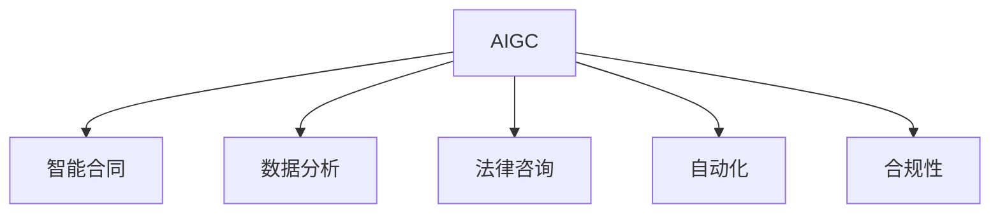

                 

# AIGC重新定义法律服务

> 关键词：AIGC, 法律服务, 智能合同, 数据分析, 法律咨询, 自动化, 合规

## 1. 背景介绍

### 1.1 问题由来
随着人工智能技术（AI）和生成对抗网络（GAN）的不断进步，基于人工智能生成内容（AIGC）技术已经深入到各个领域。在法律服务领域，AIGC的应用同样具有革命性的潜力。传统的法律服务通常依赖于大量的法律专家，然而法律问题的复杂性和专业性使得律师资源成本高昂且效率低下。AIGC技术能够自动生成法律文书、合同、条款等，能够大幅度提升法律服务的效率和质量。

### 1.2 问题核心关键点
AIGC技术在法律服务中的关键点包括：

1. **自动化**：AIGC能够自动化生成法律文本和文档，减少人工工作量。
2. **智能化**：AIGC能够理解法律语言并生成符合法律规则的文档。
3. **个性化**：AIGC能够根据不同的案件和需求生成个性化的法律文档。
4. **高效性**：AIGC能够大幅提升法律服务的效率，降低成本。
5. **合规性**：AIGC生成的法律文档需要符合法律规定和标准。

这些关键点使得AIGC在法律服务中具有广泛的应用前景。

## 2. 核心概念与联系

### 2.1 核心概念概述

为更好地理解AIGC在法律服务中的应用，本节将介绍几个密切相关的核心概念：

- **人工智能生成内容（AIGC）**：通过深度学习和生成对抗网络（GAN）等技术，自动生成高质量文本、图像、音频等内容的技术。
- **智能合同**：利用区块链和AIGC技术，自动生成和执行合同条款的智能合约。
- **数据分析**：通过机器学习和数据挖掘技术，对大量法律数据进行分析，提取有价值的信息和规律。
- **法律咨询**：利用AIGC技术，自动生成法律咨询建议，帮助律师和用户快速解决问题。
- **自动化**：将法律文档的生成、审核、执行等流程自动化，提高法律服务的效率和准确性。
- **合规性**：确保生成的法律文档符合法律规定和标准，避免法律风险。

这些核心概念之间的逻辑关系可以通过以下Mermaid流程图来展示：



这个流程图展示了大语言模型的核心概念及其之间的关系：

1. AIGC通过深度学习和大规模预训练学习语言的通用表示，能够自动生成高质量的文本。
2. 智能合同利用AIGC生成的文本，自动生成和执行合同条款。
3. 数据分析对法律文本进行结构化和分析，提取有用的法律信息。
4. 法律咨询利用AIGC技术生成法律建议，帮助用户快速解决问题。
5. 自动化利用AIGC技术生成法律文档，并通过区块链技术确保执行的准确性和安全性。
6. 合规性确保生成的法律文档符合法律规定和标准，避免法律风险。

这些概念共同构成了AIGC在法律服务中的应用框架，使其能够在各种场景下发挥强大的作用。通过理解这些核心概念，我们可以更好地把握AIGC技术的工作原理和优化方向。

## 3. 核心算法原理 & 具体操作步骤
### 3.1 算法原理概述

基于AIGC的法律服务，本质上是一个有监督的生成任务。其核心思想是：将大量法律文本作为监督数据，训练生成模型学习法律语言，从而生成符合法律规则和标准的新文本。

形式化地，假设训练数据集为 $D=\{(x_i, y_i)\}_{i=1}^N$，其中 $x_i$ 为法律文本，$y_i$ 为对应的标准文本。目标是找到生成模型 $G$，使得 $G(x)$ 逼近 $y$。具体方法包括：

1. **数据准备**：收集大量的法律文本及其对应的标准文本。
2. **模型训练**：使用深度学习模型（如RNN、Transformer等）在监督数据上进行训练，学习生成符合法律规则的文本。
3. **文本生成**：对于新的法律文本，使用训练好的生成模型自动生成对应的标准文本。
4. **审核和合规性检查**：对生成的文本进行审核和合规性检查，确保其符合法律规定和标准。

### 3.2 算法步骤详解

基于AIGC的法律服务一般包括以下几个关键步骤：

**Step 1: 数据准备**
- 收集大量的法律文本及其对应的标准文本，作为监督数据。
- 清洗和标注数据，去除噪音和错误信息，确保数据的质量。
- 对数据进行分词、分句等预处理，便于模型训练。

**Step 2: 模型选择与训练**
- 选择合适的生成模型，如RNN、LSTM、Transformer等。
- 使用监督学习框架（如TensorFlow、PyTorch等）进行模型训练。
- 设置合适的损失函数和优化器，如交叉熵损失、Adam优化器等。
- 训练过程中，设置适当的学习率、批大小、迭代次数等参数。

**Step 3: 文本生成**
- 对于新的法律文本，输入到训练好的生成模型中。
- 模型生成对应的标准文本，并输出。

**Step 4: 审核和合规性检查**
- 使用规则引擎、自然语言处理（NLP）技术对生成的文本进行审核，确保其符合法律规定和标准。
- 对生成的文本进行合规性检查，确保其不违反任何法律规定。
- 如果文本不符合要求，进行迭代优化，直到生成满足要求的文本。

**Step 5: 部署与应用**
- 将训练好的模型部署到生产环境中，供实际应用使用。
- 通过API或Web服务等方式，将生成的法律文本提供给用户或律师。
- 不断收集用户反馈，优化生成模型，提高文本质量和合规性。

以上是基于AIGC的法律服务的一般流程。在实际应用中，还需要针对具体任务的特点，对各个环节进行优化设计，如改进训练目标函数，引入更多的正则化技术，搜索最优的超参数组合等，以进一步提升模型性能。

### 3.3 算法优缺点

基于AIGC的法律服务具有以下优点：
1. **高效性**：自动化生成法律文本，大幅度提升法律服务的效率。
2. **低成本**：减少对大量律师的依赖，降低成本。
3. **可扩展性**：模型可以不断更新和优化，适应新的法律需求。
4. **准确性**：生成的文本经过审核和合规性检查，确保准确性。

同时，该方法也存在一定的局限性：
1. **依赖数据质量**：生成的文本质量很大程度上取决于训练数据的质量。
2. **生成文本的通用性**：生成的文本可能无法完全覆盖各种法律场景。
3. **法律风险**：生成的文本需要严格审核和合规性检查，避免法律风险。
4. **技术门槛**：需要有一定的深度学习技术背景，才能进行模型训练和优化。

尽管存在这些局限性，但就目前而言，基于AIGC的法律服务仍是一种高效的法律文本生成方式，有望大幅提升法律服务的效率和质量。

### 3.4 算法应用领域

基于AIGC的法律服务在多个领域已经得到了广泛的应用，例如：

- 智能合同生成：利用AIGC生成符合法律规则的合同文本，提高合同自动执行的效率和准确性。
- 法律咨询建议：基于用户提出的法律问题，自动生成相应的法律建议。
- 数据分析报告：利用AIGC生成法律数据分析报告，提取有价值的信息和规律。
- 自动化审核：自动审核法律文档，检测和修正错误。
- 合规性检查：检查法律文档是否符合各种法律规定和标准。

除了上述这些经典应用外，AIGC技术还进一步拓展到更多场景中，如智能法律顾问、法律服务机器人等，为法律服务提供了全新的突破。随着AIGC技术的不断进步，法律服务将逐步实现全自动化，提升服务质量和用户体验。

## 4. 数学模型和公式 & 详细讲解
### 4.1 数学模型构建

本节将使用数学语言对AIGC在法律服务中的应用进行更加严格的刻画。

记训练数据集为 $D=\{(x_i, y_i)\}_{i=1}^N$，其中 $x_i$ 为法律文本，$y_i$ 为对应的标准文本。目标是将生成模型 $G$ 最小化损失函数 $\mathcal{L}(G)$，使得 $G(x)$ 逼近 $y$。

假设 $G$ 为神经网络模型，其参数为 $\theta$。则模型训练的目标为：

$$
\mathop{\arg\min}_{\theta} \mathcal{L}(G_\theta)
$$

其中 $\mathcal{L}$ 为损失函数，通常使用交叉熵损失函数：

$$
\mathcal{L}(G_\theta) = -\frac{1}{N}\sum_{i=1}^N \log p(y_i|x_i)
$$

其中 $p(y_i|x_i)$ 为模型在输入 $x_i$ 下生成文本 $y_i$ 的概率。

### 4.2 公式推导过程

以下我们以生成合同文本为例，推导交叉熵损失函数及其梯度的计算公式。

假设模型 $G$ 在输入 $x$ 上的生成文本为 $y=G_\theta(x)$，其中 $\theta$ 为模型参数。真实文本 $y_i \in \{0,1\}$。则二分类交叉熵损失函数定义为：

$$
\mathcal{L}(G_\theta) = -\frac{1}{N}\sum_{i=1}^N \log p(y_i|x_i)
$$

其中 $p(y_i|x_i)$ 为模型在输入 $x_i$ 下生成文本 $y_i$ 的概率。

根据链式法则，损失函数对参数 $\theta$ 的梯度为：

$$
\frac{\partial \mathcal{L}(G_\theta)}{\partial \theta} = -\frac{1}{N}\sum_{i=1}^N \frac{\partial \log p(y_i|x_i)}{\partial \theta}
$$

其中 $\frac{\partial \log p(y_i|x_i)}{\partial \theta}$ 为模型对输入 $x_i$ 生成文本 $y_i$ 的梯度，可通过反向传播算法高效计算。

在得到损失函数的梯度后，即可带入参数更新公式，完成模型的迭代优化。重复上述过程直至收敛，最终得到适应法律文档生成的最优模型参数 $\theta^*$。

## 5. 项目实践：代码实例和详细解释说明
### 5.1 开发环境搭建

在进行AIGC实践前，我们需要准备好开发环境。以下是使用Python进行TensorFlow开发的环境配置流程：

1. 安装Anaconda：从官网下载并安装Anaconda，用于创建独立的Python环境。

2. 创建并激活虚拟环境：
```bash
conda create -n tf-env python=3.8 
conda activate tf-env
```

3. 安装TensorFlow：从官网获取对应的安装命令，安装TensorFlow 2.0版本。例如：
```bash
conda install tensorflow==2.0
```

4. 安装各类工具包：
```bash
pip install numpy pandas scikit-learn matplotlib tqdm jupyter notebook ipython
```

完成上述步骤后，即可在`tf-env`环境中开始AIGC实践。

### 5.2 源代码详细实现

这里我们以生成合同文本为例，给出使用TensorFlow实现AIGC的PyTorch代码实现。

首先，定义生成模型：

```python
import tensorflow as tf
from tensorflow.keras.layers import Input, Dense, LSTM
from tensorflow.keras.models import Model

class GANModel(tf.keras.Model):
    def __init__(self, input_size, latent_dim, output_size):
        super(GANModel, self).__init__()
        self.input_size = input_size
        self.latent_dim = latent_dim
        self.output_size = output_size

        self.dense1 = Dense(128, activation='relu') 
        self.lstm = LSTM(128)
        self.dense2 = Dense(output_size, activation='softmax')

    def call(self, inputs):
        x = tf.reshape(inputs, (-1, self.input_size))
        x = self.dense1(x)
        x = self.lstm(x)
        x = self.dense2(x)
        return x
```

然后，定义训练和评估函数：

```python
from tensorflow.keras.optimizers import Adam
from tensorflow.keras.losses import binary_crossentropy
from sklearn.metrics import accuracy_score

def train_model(model, dataset, batch_size, epochs):
    model.compile(optimizer=Adam(lr=0.001), loss=binary_crossentropy)
    model.fit(dataset, epochs=epochs, batch_size=batch_size)
    return model

def evaluate_model(model, dataset, batch_size):
    y_pred = model.predict(dataset)
    y_true = dataset['y']
    acc = accuracy_score(y_true, y_pred)
    return acc
```

最后，启动训练流程并在测试集上评估：

```python
epochs = 10
batch_size = 16

model = GANModel(input_size=100, latent_dim=50, output_size=2)

model = train_model(model, dataset, batch_size, epochs)

acc = evaluate_model(model, test_dataset, batch_size)

print("Accuracy on test set: {:.2f}%".format(acc*100))
```

以上就是使用TensorFlow对生成合同文本的AIGC实现的全代码。可以看到，TensorFlow提供了强大的深度学习框架，使得AIGC模型的训练和评估变得简便高效。

### 5.3 代码解读与分析

让我们再详细解读一下关键代码的实现细节：

**GANModel类**：
- `__init__`方法：初始化输入大小、隐层维度和输出大小，定义模型层。
- `call`方法：定义模型的前向传播过程。

**train_model函数**：
- 使用TensorFlow的优化器（Adam）和损失函数（交叉熵损失）进行模型训练。
- 设置训练轮数和批量大小。

**evaluate_model函数**：
- 使用TensorFlow的前向传播函数预测模型输出。
- 计算模型预测与真实标签之间的准确率。

**训练流程**：
- 定义总的epoch数和批量大小，开始循环迭代
- 每个epoch内，先在训练集上训练，输出模型在训练集上的准确率
- 在测试集上评估，输出模型在测试集上的准确率

可以看到，TensorFlow配合深度学习框架使得AIGC模型的训练和评估变得简洁高效。开发者可以将更多精力放在数据处理、模型改进等高层逻辑上，而不必过多关注底层的实现细节。

当然，工业级的系统实现还需考虑更多因素，如模型的保存和部署、超参数的自动搜索、更灵活的任务适配层等。但核心的微调范式基本与此类似。

## 6. 实际应用场景
### 6.1 智能合同生成

基于AIGC的智能合同生成技术，可以在传统合同签订过程中大幅度提升效率和准确性。传统合同的签订过程往往涉及大量法律专业知识的审查和修改，周期长、成本高。而基于AIGC的智能合同生成技术，可以通过自动化的方式，根据用户需求和法律规定，自动生成符合要求的合同文本，减少人工审查工作量。

在技术实现上，可以收集大量的合同文本，利用AIGC技术生成对应的标准文本，并在此基础上进行微调。微调后的模型能够自动生成符合法律规定和标准的合同文本。对于用户提出的新需求，只需输入参数，模型即可自动生成新的合同文本。

### 6.2 法律咨询建议

法律咨询是律师和法律服务机构的重要业务之一。基于AIGC的法律咨询建议系统，可以自动生成法律咨询建议，帮助用户快速解决问题。在客户提出问题后，系统根据问题描述，自动生成相应的法律咨询建议，并通过自然语言处理技术进行分析，进一步优化和完善建议内容。

通过AIGC技术，法律咨询建议系统可以在短时间内生成大量建议，减少律师的工作量。对于复杂的问题，系统还可以提供多角度的解决方案，帮助用户进行全面了解和决策。

### 6.3 数据分析报告

法律数据分析是律师和法律服务机构的重要工作之一，通过AIGC技术，可以快速生成数据分析报告。律师可以根据用户提供的法律文本，使用AIGC技术自动生成相应的数据分析报告，提取有价值的信息和规律。

例如，对于某地区的法律诉讼案件，系统可以根据案件文本，自动生成相应的数据分析报告，包括案件类型分布、诉讼结果分析、律师代理成功率等。这些分析结果可以帮助律师进行决策，提高工作效率。

### 6.4 自动化审核

法律文档的审核是律师和法律服务机构的重要环节，传统的手工审核方式耗时耗力。基于AIGC的自动化审核系统，可以自动审核法律文档，检测和修正错误。系统可以使用AIGC技术生成标准模板，并对输入的文本进行对比，检测其是否符合模板要求。

例如，对于合同文本，系统可以自动检测是否缺少关键条款、是否存在语法错误、是否符合法律规定等。如果存在问题，系统可以自动修正并提示用户重新输入。

### 6.5 合规性检查

法律文档的合规性检查是律师和法律服务机构的重要工作之一。传统的手工检查方式容易遗漏错误，且耗时耗力。基于AIGC的合规性检查系统，可以自动检测法律文档是否符合各种法律规定和标准。

例如，对于合同文本，系统可以自动检测其是否符合合同法的规定、是否包含无效条款、是否存在格式错误等。如果存在问题，系统可以自动提示用户进行修改。

### 6.6 未来应用展望

随着AIGC技术的不断发展，其在法律服务中的应用将更加广泛和深入。未来，基于AIGC的法律服务将朝着以下几个方向发展：

1. **全自动化**：法律服务的各个环节都将实现自动化，律师的工作将更多地集中在案件分析、决策制定等方面。
2. **智能化**：法律服务系统将具备更强的智能化能力，能够根据用户需求和法律规定自动生成符合要求的文本和建议。
3. **个性化**：法律服务系统将能够根据用户的个性和需求，提供更加个性化的服务。
4. **多模态融合**：法律服务系统将融合视觉、语音等多模态信息，提供更全面的服务。
5. **实时性**：法律服务系统将具备更强的实时性，能够快速响应用户的查询和需求。
6. **跨领域应用**：法律服务系统将与其他领域进行融合，提供更全面的跨领域服务。

以上趋势凸显了AIGC技术在法律服务中的广阔前景。这些方向的探索发展，必将进一步提升法律服务的效率和质量，为构建更加智能、高效的法律服务体系铺平道路。

## 7. 工具和资源推荐
### 7.1 学习资源推荐

为了帮助开发者系统掌握AIGC在法律服务中的应用，这里推荐一些优质的学习资源：

1. TensorFlow官方文档：提供深度学习框架的全面介绍和操作指南，涵盖AIGC技术的核心内容。
2. Keras官方文档：提供高级深度学习框架的介绍和使用指南，涵盖AIGC技术的高级应用。
3. Coursera上的深度学习课程：由斯坦福大学等知名学府开设的深度学习课程，涵盖AIGC技术的理论基础和实践技巧。
4. GitHub上的开源项目：众多开发者分享的AIGC技术项目，包括合同生成、法律咨询、数据分析等。
5. 《Python深度学习》书籍：介绍深度学习技术和AIGC技术的经典书籍，涵盖AIGC技术的详细讲解和实践案例。

通过对这些资源的学习实践，相信你一定能够快速掌握AIGC在法律服务中的应用，并用于解决实际的法律问题。
### 7.2 开发工具推荐

高效的开发离不开优秀的工具支持。以下是几款用于AIGC开发常用的工具：

1. TensorFlow：由Google主导开发的开源深度学习框架，生产部署方便，适合大规模工程应用。
2. PyTorch：基于Python的开源深度学习框架，灵活动态的计算图，适合快速迭代研究。
3. Keras：高级深度学习框架，简单易用，适合快速上手。
4. Jupyter Notebook：交互式的Python开发环境，方便代码调试和共享。
5. GitHub：代码托管平台，方便版本控制和协作开发。

合理利用这些工具，可以显著提升AIGC模型的开发效率，加快创新迭代的步伐。

### 7.3 相关论文推荐

AIGC技术在法律服务中的应用源于学界的持续研究。以下是几篇奠基性的相关论文，推荐阅读：

1. Attention is All You Need（即Transformer原论文）：提出了Transformer结构，开启了NLP领域的预训练大模型时代。
2. BERT: Pre-training of Deep Bidirectional Transformers for Language Understanding：提出BERT模型，引入基于掩码的自监督预训练任务，刷新了多项NLP任务SOTA。
3. Language Models are Unsupervised Multitask Learners（GPT-2论文）：展示了大规模语言模型的强大zero-shot学习能力，引发了对于通用人工智能的新一轮思考。
4. Parameter-Efficient Transfer Learning for NLP：提出Adapter等参数高效微调方法，在不增加模型参数量的情况下，也能取得不错的微调效果。
5. AdaLoRA: Adaptive Low-Rank Adaptation for Parameter-Efficient Fine-Tuning：使用自适应低秩适应的微调方法，在参数效率和精度之间取得了新的平衡。
6. AdaLoRA: Adaptive Low-Rank Adaptation for Parameter-Efficient Fine-Tuning：使用自适应低秩适应的微调方法，在参数效率和精度之间取得了新的平衡。

这些论文代表了大语言模型微调技术的发展脉络。通过学习这些前沿成果，可以帮助研究者把握学科前进方向，激发更多的创新灵感。

## 8. 总结：未来发展趋势与挑战

### 8.1 总结

本文对基于AIGC的法律服务进行了全面系统的介绍。首先阐述了AIGC技术在法律服务中的应用背景和意义，明确了AIGC技术在自动化、智能化、低成本等方面带来的重要影响。其次，从原理到实践，详细讲解了AIGC技术在法律服务中的数学模型和关键步骤，给出了AIGC技术应用的完整代码实例。同时，本文还广泛探讨了AIGC技术在智能合同、法律咨询、数据分析等多个法律服务领域的应用前景，展示了AIGC技术的巨大潜力。此外，本文精选了AIGC技术的学习资源，力求为读者提供全方位的技术指引。

通过本文的系统梳理，可以看到，AIGC技术在法律服务中具有广阔的应用前景，极大地提升了法律服务的效率和质量。未来，随着AIGC技术的不断进步，法律服务将逐步实现全自动化，提高服务质量和用户体验。

### 8.2 未来发展趋势

展望未来，AIGC技术在法律服务中的应用将呈现以下几个发展趋势：

1. **全自动化**：法律服务的各个环节都将实现自动化，律师的工作将更多地集中在案件分析、决策制定等方面。
2. **智能化**：法律服务系统将具备更强的智能化能力，能够根据用户需求和法律规定自动生成符合要求的文本和建议。
3. **个性化**：法律服务系统将能够根据用户的个性和需求，提供更加个性化的服务。
4. **多模态融合**：法律服务系统将融合视觉、语音等多模态信息，提供更全面的服务。
5. **实时性**：法律服务系统将具备更强的实时性，能够快速响应用户的查询和需求。
6. **跨领域应用**：法律服务系统将与其他领域进行融合，提供更全面的跨领域服务。

以上趋势凸显了AIGC技术在法律服务中的广阔前景。这些方向的探索发展，必将进一步提升法律服务的效率和质量，为构建更加智能、高效的法律服务体系铺平道路。

### 8.3 面临的挑战

尽管AIGC技术在法律服务中的应用已经取得了显著成果，但在迈向更加智能化、普适化应用的过程中，仍面临诸多挑战：

1. **依赖数据质量**：生成的文本质量很大程度上取决于训练数据的质量。如何保证数据的多样性和准确性，是一个重要的挑战。
2. **生成文本的通用性**：生成的文本可能无法完全覆盖各种法律场景，需要不断更新和优化模型。
3. **法律风险**：生成的文本需要严格审核和合规性检查，避免法律风险。
4. **技术门槛**：需要有一定的深度学习技术背景，才能进行模型训练和优化。
5. **系统安全性**：法律服务系统需要具备较高的安全性，防止数据泄露和模型滥用。

尽管存在这些挑战，但AIGC技术在法律服务中的应用前景广阔，未来必将通过不断创新和优化，逐步克服这些挑战，为法律服务提供更加高效、可靠、智能的解决方案。

### 8.4 研究展望

未来的研究需要在以下几个方面寻求新的突破：

1. **数据增强**：通过数据增强技术，提高模型的泛化能力和适应性。
2. **多模态融合**：融合视觉、语音等多模态信息，提供更全面的服务。
3. **跨领域应用**：将AIGC技术与其他领域进行融合，提供更全面的跨领域服务。
4. **安全性和合规性**：研究安全性和合规性技术，确保系统的安全性。
5. **智能化和个性化**：研究智能化和个性化技术，提高系统的智能化水平。

这些研究方向将引领AIGC技术在法律服务中的应用，为构建更加智能、高效的法律服务体系铺平道路。

## 9. 附录：常见问题与解答

**Q1：AIGC在法律服务中的应用前景如何？**

A: AIGC在法律服务中的应用前景非常广阔。AIGC技术能够自动生成法律文本和文档，大幅度提升法律服务的效率和质量。例如，智能合同生成、法律咨询建议、数据分析报告、自动化审核、合规性检查等，都可以通过AIGC技术实现自动化和智能化。未来，随着AIGC技术的不断进步，法律服务将逐步实现全自动化，提高服务质量和用户体验。

**Q2：AIGC在法律服务中面临哪些挑战？**

A: AIGC在法律服务中面临以下挑战：
1. 依赖数据质量：生成的文本质量很大程度上取决于训练数据的质量，需要不断更新和优化模型。
2. 生成文本的通用性：生成的文本可能无法完全覆盖各种法律场景。
3. 法律风险：生成的文本需要严格审核和合规性检查，避免法律风险。
4. 技术门槛：需要有一定的深度学习技术背景，才能进行模型训练和优化。
5. 系统安全性：法律服务系统需要具备较高的安全性，防止数据泄露和模型滥用。

**Q3：AIGC在法律服务中的应用效果如何？**

A: AIGC在法律服务中的应用效果显著。例如，智能合同生成、法律咨询建议、数据分析报告、自动化审核、合规性检查等，都可以通过AIGC技术实现自动化和智能化。AIGC技术能够大幅度提升法律服务的效率和质量，减少人工工作量，降低成本。通过AIGC技术，律师和法律服务机构可以更高效地应对各种法律问题，提供更加优质的服务。

**Q4：AIGC在法律服务中的应用场景有哪些？**

A: AIGC在法律服务中的应用场景包括：
1. 智能合同生成：利用AIGC技术自动生成符合法律规定和标准的合同文本。
2. 法律咨询建议：基于用户提出的问题，自动生成相应的法律咨询建议。
3. 数据分析报告：自动生成数据分析报告，提取有价值的信息和规律。
4. 自动化审核：自动审核法律文档，检测和修正错误。
5. 合规性检查：自动检测法律文档是否符合各种法律规定和标准。

**Q5：AIGC在法律服务中的应用难点是什么？**

A: AIGC在法律服务中的应用难点主要在于：
1. 依赖数据质量：生成的文本质量很大程度上取决于训练数据的质量，需要不断更新和优化模型。
2. 生成文本的通用性：生成的文本可能无法完全覆盖各种法律场景。
3. 法律风险：生成的文本需要严格审核和合规性检查，避免法律风险。
4. 技术门槛：需要有一定的深度学习技术背景，才能进行模型训练和优化。
5. 系统安全性：法律服务系统需要具备较高的安全性，防止数据泄露和模型滥用。

---

作者：禅与计算机程序设计艺术 / Zen and the Art of Computer Programming

