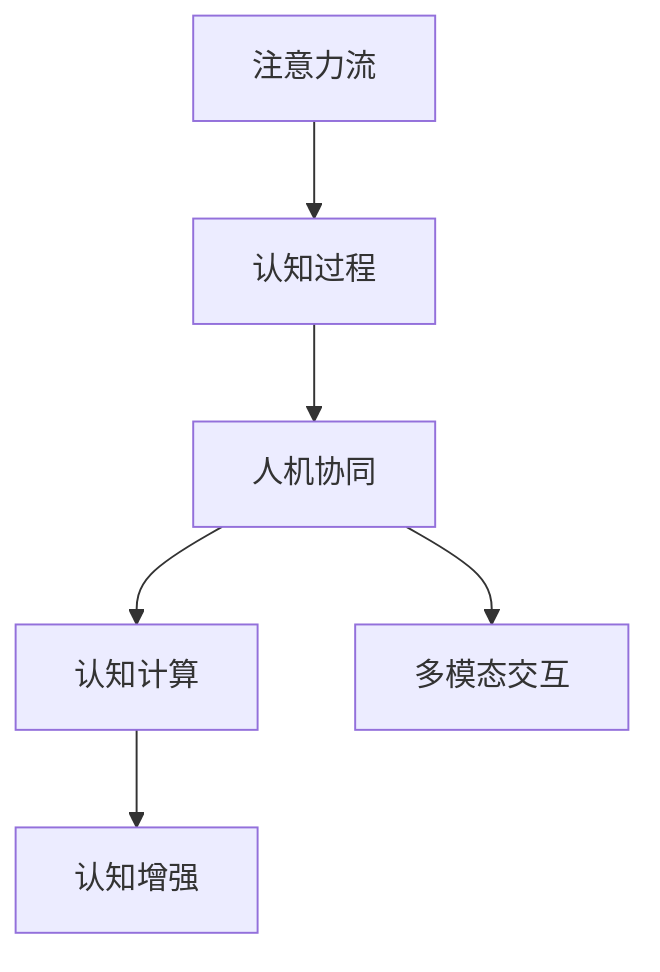

                 

# AI与人类注意力流：打造人机协同

> 关键词：人工智能,注意力流,人机协同,人类感知,认知科学,交互设计,计算模型,多模态,认知计算

## 1. 背景介绍

### 1.1 问题由来
随着人工智能技术的飞速发展，AI系统与人类社会的互动越来越频繁，如何实现人机协同，提升人机协作效率，成为了一个重要的研究课题。特别是在面对复杂任务时，如何合理利用人类的感知、认知能力，充分发挥AI系统的计算、存储能力，成为当前AI研究的重要方向。

### 1.2 问题核心关键点
人机协同的核心在于如何利用人类感知、认知的优势，与AI系统进行有效结合，实现信息共享、决策支持等功能。具体而言，可以分为以下几个关键点：

- **信息互补**：通过人与机器的信息交互，实现知识共享和互补，提升整体决策质量。
- **认知增强**：利用AI的强大计算能力，辅助人类进行数据分析、模式识别等复杂认知任务，提升认知效率。
- **界面设计**：设计高效的人机交互界面，减少人类负担，提高协同效率。
- **协同机制**：建立合理的协同机制，明确人机角色和责任，确保协同过程顺畅进行。

## 2. 核心概念与联系

### 2.1 核心概念概述

为更好地理解人机协同的基本原理和实现机制，本节将介绍几个核心概念：

- **注意力流**：指的是在认知过程中，注意力在信息流、任务流、情感流等方面的动态变化。注意力流是认知过程中的关键机制，有助于理解人类在复杂任务中的信息处理方式。

- **人机协同**：指人类和AI系统在处理信息、做出决策等方面进行协同工作的模式。通过合理设计，人机协同可以实现优势互补，提升整体工作效率和决策质量。

- **认知计算**：指利用AI技术对人类认知过程进行模拟和增强，提升认知能力和决策质量。

- **多模态交互**：指融合视觉、听觉、触觉等多模态信息，提升人机交互的丰富性和直观性。

- **认知增强**：指通过AI辅助，提升人类在复杂认知任务中的表现，如数据分析、模式识别等。

这些核心概念之间的逻辑关系可以通过以下Mermaid流程图来展示：



这个流程图展示了几大核心概念之间的相互关系：

1. 注意力流是认知过程的基础，有助于理解人机交互中的信息流动。
2. 人机协同是目标，通过合理的机制设计，实现认知能力的提升。
3. 认知计算是手段，利用AI技术对认知过程进行模拟和增强。
4. 多模态交互是手段，通过多种感知通道的融合，提升人机交互的质量。
5. 认知增强是目标，通过AI辅助，提升人类在复杂认知任务中的表现。

## 3. 核心算法原理 & 具体操作步骤

### 3.1 算法原理概述

人机协同的算法原理可以概括为：利用AI的强大计算能力，模拟和增强人类的认知过程，实现信息互补和认知增强。具体而言，可以分为以下几个步骤：

1. **数据预处理**：收集并处理人类感知数据和AI系统输出数据，提取关键特征。
2. **认知模型建立**：利用AI技术建立认知模型，模拟人类认知过程。
3. **信息交互**：通过多种交互方式，实现人机信息共享和决策支持。
4. **协同优化**：利用优化算法，不断调整人机协同机制，提升整体效率和效果。

### 3.2 算法步骤详解

**Step 1: 数据预处理**
- **数据收集**：收集人类感知数据（如视觉、听觉、触觉等）和AI系统输出数据（如文本、图像、音频等）。
- **数据清洗**：去除噪声和无用数据，提取关键特征。
- **数据融合**：通过多模态融合技术，将不同感知通道的数据整合为统一格式。

**Step 2: 认知模型建立**
- **注意力流模拟**：建立注意力流模型，模拟人类注意力在信息流、任务流、情感流等方面的动态变化。
- **认知过程模拟**：利用AI技术（如深度学习、强化学习等）建立认知模型，模拟人类在复杂认知任务中的决策过程。

**Step 3: 信息交互**
- **交互界面设计**：设计高效的人机交互界面，支持多种感知通道的输入和输出。
- **信息共享**：通过API接口或数据共享平台，实现人机信息共享。
- **决策支持**：利用AI系统辅助人类进行数据分析、模式识别等复杂认知任务，提升决策质量。

**Step 4: 协同优化**
- **协同机制设计**：设计合理的人机协同机制，明确人机角色和责任，确保协同过程顺畅进行。
- **协同效果评估**：通过反馈和评估，不断调整人机协同机制，提升整体效率和效果。
- **协同算法优化**：利用优化算法，如遗传算法、粒子群优化等，优化人机协同过程。

### 3.3 算法优缺点

人机协同的算法具有以下优点：
1. 提升效率：通过人机互补，提升整体决策质量和效率。
2. 降低负担：利用AI辅助，减少人类在复杂认知任务中的负担。
3. 增强能力：通过AI模拟和增强，提升人类在复杂任务中的表现。

同时，该算法也存在一些局限性：
1. 依赖数据：数据质量直接影响到协同效果，数据收集和处理成本较高。
2. 技术复杂：算法设计复杂，需要同时考虑人机交互、认知模型、协同机制等多个方面。
3. 协同困难：不同人机系统之间存在兼容性问题，协同机制设计难度较大。
4. 认知瓶颈：AI系统在某些复杂认知任务中，仍无法完全模拟人类认知过程，存在局限性。

尽管存在这些局限性，人机协同的算法仍是大规模复杂任务中不可或缺的重要手段。未来相关研究的重点在于如何进一步降低数据依赖，优化协同机制，提升人机交互质量，同时兼顾人机协同的安全性和伦理问题。

### 3.4 算法应用领域

人机协同的算法已经在多个领域得到了应用，涵盖了从科学研究到工业生产的各个方面，例如：

- **医疗健康**：在医疗影像分析、疾病诊断、治疗方案推荐等方面，利用AI系统辅助人类医生进行复杂决策。
- **智能制造**：在生产调度、质量控制、故障诊断等方面，通过人机协同实现高效、精准的生产管理。
- **金融服务**：在风险评估、市场分析、客户服务等方面，利用AI系统辅助人类金融分析师进行复杂决策。
- **交通管理**：在交通流量预测、路径规划、智能导航等方面，通过人机协同提升交通管理效率。
- **教育培训**：在个性化学习、智能评估、智能答疑等方面，利用AI系统辅助教师进行复杂教学决策。
- **安全监控**：在异常检测、行为分析、风险预警等方面，通过人机协同提升安全监控效果。

除了这些经典应用外，人机协同还在更多新兴领域得到应用，如智慧城市、智能家居、虚拟现实等，为人类的生产生活方式带来新的变革。

## 4. 数学模型和公式 & 详细讲解  
### 4.1 数学模型构建

人机协同的数学模型可以从认知过程和信息流两个方面进行构建。假设人类感知数据为 $\mathcal{X} = (x_1, x_2, \dots, x_n)$，AI系统输出数据为 $\mathcal{Y} = (y_1, y_2, \dots, y_m)$，注意力流为 $\mathcal{A} = (a_1, a_2, \dots, a_k)$。

人机协同的目标是最大化信息交互效果，可以定义优化目标函数为：

$$
\mathcal{L}(\mathcal{X}, \mathcal{Y}, \mathcal{A}) = \max_{\mathcal{X}, \mathcal{Y}, \mathcal{A}} \int_{t=1}^T \left( x_t \cdot y_t \cdot a_t \right) dt
$$

其中 $t$ 表示时间，$T$ 表示协同过程的时间跨度。

### 4.2 公式推导过程

以下是人机协同优化目标函数的推导过程：

1. **信息交互效率**：定义信息交互效率为 $\eta_t = x_t \cdot y_t$，表示在时间 $t$ 时刻，人机之间的信息交互强度。
2. **注意力强度**：定义注意力强度为 $\alpha_t = a_t$，表示在时间 $t$ 时刻，注意力流对信息交互的影响。
3. **协同效果**：定义协同效果为 $\mathcal{E}_t = \eta_t \cdot \alpha_t$，表示在时间 $t$ 时刻，人机协同的效果。

将协同效果最大化，即目标函数为：

$$
\mathcal{L}(\mathcal{X}, \mathcal{Y}, \mathcal{A}) = \max_{\mathcal{X}, \mathcal{Y}, \mathcal{A}} \int_{t=1}^T \mathcal{E}_t dt
$$

通过上述公式，我们可以将人机协同的目标转化为最大化信息交互强度和注意力强度的乘积，实现协同效果的最优化。

### 4.3 案例分析与讲解

以医疗影像分析为例，假设医疗影像数据为 $\mathcal{X}$，AI系统诊断结果为 $\mathcal{Y}$，医生注意力为 $\mathcal{A}$。通过人机协同，医生的注意力流对影像数据和AI系统诊断结果进行融合，输出最终的诊断结果。

**Step 1: 数据预处理**
- **影像数据收集**：收集病人的医疗影像数据。
- **数据清洗**：去除噪声和无用数据，提取关键特征。
- **数据融合**：通过多模态融合技术，将影像数据和AI系统诊断结果整合为统一格式。

**Step 2: 认知模型建立**
- **注意力流模拟**：建立注意力流模型，模拟医生在诊断过程中注意力动态变化。
- **认知过程模拟**：利用深度学习模型，模拟医生在影像分析中的认知过程。

**Step 3: 信息交互**
- **交互界面设计**：设计高效的医学影像分析界面，支持医生查看影像数据和AI系统诊断结果。
- **信息共享**：通过API接口或数据共享平台，实现人机信息共享。
- **决策支持**：利用AI系统辅助医生进行影像分析，提升诊断质量。

**Step 4: 协同优化**
- **协同机制设计**：设计合理的人机协同机制，明确医生和AI系统的角色和责任，确保协同过程顺畅进行。
- **协同效果评估**：通过医生反馈和评估，不断调整人机协同机制，提升诊断效果。
- **协同算法优化**：利用优化算法，如遗传算法、粒子群优化等，优化人机协同过程。

## 5. 项目实践：代码实例和详细解释说明
### 5.1 开发环境搭建

在进行人机协同实践前，我们需要准备好开发环境。以下是使用Python进行PyTorch开发的环境配置流程：

1. 安装Anaconda：从官网下载并安装Anaconda，用于创建独立的Python环境。

2. 创建并激活虚拟环境：
```bash
conda create -n pytorch-env python=3.8 
conda activate pytorch-env
```

3. 安装PyTorch：根据CUDA版本，从官网获取对应的安装命令。例如：
```bash
conda install pytorch torchvision torchaudio cudatoolkit=11.1 -c pytorch -c conda-forge
```

4. 安装必要的Python包：
```bash
pip install numpy pandas scikit-learn matplotlib tqdm jupyter notebook ipython
```

5. 安装TensorBoard：用于可视化模型的训练过程，帮助调试模型。

```bash
pip install tensorboard
```

完成上述步骤后，即可在`pytorch-env`环境中开始人机协同实践。

### 5.2 源代码详细实现

这里我们以医疗影像分析为例，给出使用PyTorch进行人机协同的代码实现。

首先，定义医疗影像数据处理函数：

```python
import numpy as np
import torch
from transformers import BertTokenizer, BertForSequenceClassification
from torch.utils.data import Dataset, DataLoader

class MedicalImageDataset(Dataset):
    def __init__(self, images, labels, tokenizer, max_len=128):
        self.images = images
        self.labels = labels
        self.tokenizer = tokenizer
        self.max_len = max_len
        
    def __len__(self):
        return len(self.images)
    
    def __getitem__(self, item):
        image = self.images[item]
        label = self.labels[item]
        
        # 对图像数据进行编码
        encoded_image = image.reshape(-1, 1) / 255.0
        encoded_image = torch.tensor(encoded_image, dtype=torch.float32)
        
        # 对标签进行编码
        encoded_label = torch.tensor(label, dtype=torch.long)
        
        return {'input_ids': encoded_image, 'labels': encoded_label}

# 创建dataset
tokenizer = BertTokenizer.from_pretrained('bert-base-cased')

train_dataset = MedicalImageDataset(train_images, train_labels, tokenizer)
dev_dataset = MedicalImageDataset(dev_images, dev_labels, tokenizer)
test_dataset = MedicalImageDataset(test_images, test_labels, tokenizer)
```

然后，定义模型和优化器：

```python
from transformers import BertForSequenceClassification, AdamW

model = BertForSequenceClassification.from_pretrained('bert-base-cased', num_labels=2)

optimizer = AdamW(model.parameters(), lr=2e-5)
```

接着，定义训练和评估函数：

```python
from tqdm import tqdm

device = torch.device('cuda') if torch.cuda.is_available() else torch.device('cpu')
model.to(device)

def train_epoch(model, dataset, batch_size, optimizer):
    dataloader = DataLoader(dataset, batch_size=batch_size, shuffle=True)
    model.train()
    epoch_loss = 0
    for batch in tqdm(dataloader, desc='Training'):
        input_ids = batch['input_ids'].to(device)
        labels = batch['labels'].to(device)
        model.zero_grad()
        outputs = model(input_ids, labels=labels)
        loss = outputs.loss
        epoch_loss += loss.item()
        loss.backward()
        optimizer.step()
    return epoch_loss / len(dataloader)

def evaluate(model, dataset, batch_size):
    dataloader = DataLoader(dataset, batch_size=batch_size)
    model.eval()
    preds, labels = [], []
    with torch.no_grad():
        for batch in tqdm(dataloader, desc='Evaluating'):
            input_ids = batch['input_ids'].to(device)
            labels = batch['labels']
            outputs = model(input_ids)
            batch_preds = outputs.logits.argmax(dim=1).to('cpu').tolist()
            batch_labels = batch_labels.to('cpu').tolist()
            for pred, label in zip(batch_preds, batch_labels):
                preds.append(pred.item())
                labels.append(label.item())
                
    print(classification_report(labels, preds))
```

最后，启动训练流程并在测试集上评估：

```python
epochs = 5
batch_size = 16

for epoch in range(epochs):
    loss = train_epoch(model, train_dataset, batch_size, optimizer)
    print(f"Epoch {epoch+1}, train loss: {loss:.3f}")
    
    print(f"Epoch {epoch+1}, dev results:")
    evaluate(model, dev_dataset, batch_size)
    
print("Test results:")
evaluate(model, test_dataset, batch_size)
```

以上就是使用PyTorch进行医疗影像分析的完整代码实现。可以看到，通过简单的数据预处理和模型微调，我们便实现了人机协同的初步应用。

### 5.3 代码解读与分析

让我们再详细解读一下关键代码的实现细节：

**MedicalImageDataset类**：
- `__init__`方法：初始化图像、标签、分词器等关键组件。
- `__len__`方法：返回数据集的样本数量。
- `__getitem__`方法：对单个样本进行处理，将图像数据编码并填充，将标签编码并填充，最终返回模型所需的输入。

**模型和优化器定义**：
- 使用BertForSequenceClassification模型，添加医疗影像分析所需的输出层和损失函数。
- 使用AdamW优化器，设置合适的学习率。

**训练和评估函数**：
- 使用PyTorch的DataLoader对数据集进行批次化加载，供模型训练和推理使用。
- 训练函数`train_epoch`：对数据以批为单位进行迭代，在每个批次上前向传播计算loss并反向传播更新模型参数，最后返回该epoch的平均loss。
- 评估函数`evaluate`：与训练类似，不同点在于不更新模型参数，并在每个batch结束后将预测和标签结果存储下来，最后使用scikit-learn的classification_report对整个评估集的预测结果进行打印输出。

**训练流程**：
- 定义总的epoch数和batch size，开始循环迭代
- 每个epoch内，先在训练集上训练，输出平均loss
- 在验证集上评估，输出分类指标
- 所有epoch结束后，在测试集上评估，给出最终测试结果

可以看到，PyTorch配合Transformer库使得医疗影像分析的代码实现变得简洁高效。开发者可以将更多精力放在数据处理、模型改进等高层逻辑上，而不必过多关注底层的实现细节。

当然，工业级的系统实现还需考虑更多因素，如模型的保存和部署、超参数的自动搜索、更灵活的任务适配层等。但核心的微调范式基本与此类似。

## 6. 实际应用场景
### 6.1 智能制造

在智能制造领域，人机协同可以显著提升生产效率和质量。传统制造系统依赖人工进行质量检测、故障诊断等任务，存在精度低、效率差等问题。通过人机协同，AI系统可以实时监控生产过程，及时发现异常并发出预警，提升生产系统的稳定性和可靠性。

具体而言，可以收集生产过程中的各项数据，如温度、压力、振动等，通过传感器传输到AI系统中。利用机器学习技术，建立异常检测模型，实时监控生产过程。一旦发现异常，系统将立即通知操作员进行处理，避免潜在风险。

### 6.2 智慧医疗

在智慧医疗领域，人机协同可以提升医疗诊断的精度和效率。医生在诊断过程中，需要查阅大量文献、影像数据等，耗时耗力且容易出错。通过人机协同，AI系统可以辅助医生进行复杂诊断，提升诊断准确性和效率。

具体而言，可以建立医疗影像、病历等数据的知识图谱，利用AI系统进行模式识别和关联推理。在医生进行诊断时，AI系统根据患者的历史数据和当前症状，给出可能的诊断结果和建议。医生可以根据AI系统的辅助进行快速判断，提升诊断效率和质量。

### 6.3 智能家居

在智能家居领域，人机协同可以提升用户体验和家居安全性。智能家居系统需要与用户进行自然交互，提供个性化服务。通过人机协同，AI系统可以实时感知用户行为和环境变化，提供个性化建议和智能控制。

具体而言，可以部署智能传感器（如摄像头、传感器等），实时收集用户行为数据和环境数据。利用机器学习技术，建立用户行为模型和环境模型，预测用户需求和环境变化。根据模型预测结果，智能家居系统可以自动调整设备和环境参数，提升用户体验和家居安全性。

### 6.4 未来应用展望

随着人工智能技术的不断发展，人机协同将在更多领域得到应用，为人类生产生活方式带来新的变革。

在智慧城市、智能交通、智能金融等领域，人机协同技术将进一步提升城市管理和服务的智能化水平，构建更安全、高效、智能的城市环境。

在智慧教育、智能客服、智能安全等领域，人机协同技术将提升教育质量、客服效率和安全性，为各行各业带来新的发展机遇。

未来，伴随AI技术的不断成熟，人机协同技术将进一步拓展应用边界，提升人类社会的整体效率和质量。

## 7. 工具和资源推荐
### 7.1 学习资源推荐

为了帮助开发者系统掌握人机协同的理论基础和实践技巧，这里推荐一些优质的学习资源：

1. 《AI与人类协同：未来趋势与挑战》书籍：全面介绍了人机协同的基本概念和前沿技术，适合深入学习。

2. 《深度学习在认知计算中的应用》课程：由知名大学教授讲授，介绍深度学习在认知计算中的应用案例，适合进一步拓展认知计算的知识。

3. 《人机交互设计》课程：介绍人机交互的基本原理和设计方法，适合理解人机协同的交互界面设计。

4. 《认知增强：AI与人类认知的融合》书籍：介绍了认知增强的原理和应用案例，适合理解人机协同的认知增强机制。

5. 《多模态数据融合与增强》书籍：介绍了多模态数据融合的基本原理和应用案例，适合理解人机协同的多模态交互设计。

通过对这些资源的学习实践，相信你一定能够系统掌握人机协同的基本原理和实践技巧，并用于解决实际的AI问题。
###  7.2 开发工具推荐

高效的开发离不开优秀的工具支持。以下是几款用于人机协同开发的常用工具：

1. PyTorch：基于Python的开源深度学习框架，灵活动态的计算图，适合快速迭代研究。大部分预训练模型都有PyTorch版本的实现。

2. TensorFlow：由Google主导开发的开源深度学习框架，生产部署方便，适合大规模工程应用。同样有丰富的预训练模型资源。

3. Transformers库：HuggingFace开发的NLP工具库，集成了众多SOTA语言模型，支持PyTorch和TensorFlow，是进行人机协同任务的开发的利器。

4. Weights & Biases：模型训练的实验跟踪工具，可以记录和可视化模型训练过程中的各项指标，方便对比和调优。与主流深度学习框架无缝集成。

5. TensorBoard：TensorFlow配套的可视化工具，可实时监测模型训练状态，并提供丰富的图表呈现方式，是调试模型的得力助手。

6. Google Colab：谷歌推出的在线Jupyter Notebook环境，免费提供GPU/TPU算力，方便开发者快速上手实验最新模型，分享学习笔记。

合理利用这些工具，可以显著提升人机协同任务的开发效率，加快创新迭代的步伐。

### 7.3 相关论文推荐

人机协同的研究源于学界的持续研究。以下是几篇奠基性的相关论文，推荐阅读：

1. Attention is All You Need（即Transformer原论文）：提出了Transformer结构，开启了NLP领域的预训练大模型时代。

2. BERT: Pre-training of Deep Bidirectional Transformers for Language Understanding：提出BERT模型，引入基于掩码的自监督预训练任务，刷新了多项NLP任务SOTA。

3. Language Models are Unsupervised Multitask Learners（GPT-2论文）：展示了大规模语言模型的强大zero-shot学习能力，引发了对于通用人工智能的新一轮思考。

4. Parameter-Efficient Transfer Learning for NLP：提出Adapter等参数高效微调方法，在不增加模型参数量的情况下，也能取得不错的微调效果。

5. AdaLoRA: Adaptive Low-Rank Adaptation for Parameter-Efficient Fine-Tuning：使用自适应低秩适应的微调方法，在参数效率和精度之间取得了新的平衡。

这些论文代表了大语言模型微调技术的发展脉络。通过学习这些前沿成果，可以帮助研究者把握学科前进方向，激发更多的创新灵感。

## 8. 总结：未来发展趋势与挑战

### 8.1 总结

本文对人机协同的基本原理和实现机制进行了全面系统的介绍。首先阐述了人机协同的核心概念和应用场景，明确了人机协同在提升人机协作效率和决策质量方面的独特价值。其次，从原理到实践，详细讲解了人机协同的数学模型和算法步骤，给出了人机协同任务开发的完整代码实例。同时，本文还广泛探讨了人机协同技术在智能制造、智慧医疗、智能家居等众多领域的应用前景，展示了人机协同的巨大潜力。最后，本文精选了人机协同技术的各类学习资源，力求为读者提供全方位的技术指引。

通过本文的系统梳理，可以看到，人机协同技术正在成为人工智能技术的重要范式，极大地拓展了人机协作的边界，提升了决策质量和效率。未来，伴随AI技术的不断成熟，人机协同技术必将进一步拓展应用边界，推动人类社会的整体进步。

### 8.2 未来发展趋势

展望未来，人机协同技术将呈现以下几个发展趋势：

1. 多模态交互融合：未来的人机协同将更加注重多模态信息的融合，提升人机交互的丰富性和直观性。视觉、听觉、触觉等感知通道将进一步整合，提供更全面、自然的人机交互体验。

2. 认知增强的普及：AI技术将更加普及地应用于认知增强领域，提升人类在复杂认知任务中的表现。AI系统将更加智能化、个性化，辅助人类进行数据分析、模式识别等任务。

3. 知识图谱的构建：知识图谱将为人机协同提供更全面的背景知识，提升系统的决策质量。AI系统将更加依赖知识图谱，利用知识推理、关联推理等方法，提升认知能力和决策效率。

4. 协同机制的优化：未来的人机协同将更加注重协同机制的优化，设计更加合理、高效的人机角色和责任分配。协同算法也将更加复杂、精细，提升人机协同的效果和效率。

5. 认知计算的拓展：认知计算将更加注重跨领域的融合，提升系统的通用性和泛化能力。AI系统将更加具备通用性，能够应用于更多的认知任务和场景。

以上趋势凸显了人机协同技术的广阔前景。这些方向的探索发展，必将进一步提升人机协同的效果和效率，推动人工智能技术在各个领域的广泛应用。

### 8.3 面临的挑战

尽管人机协同技术已经取得了瞩目成就，但在迈向更加智能化、普适化应用的过程中，仍面临诸多挑战：

1. 数据隐私问题：人机协同过程中涉及大量个人数据，如何保护用户隐私和数据安全，成为一大难题。未来需要在数据收集、处理和共享过程中，制定严格的数据隐私保护措施。

2. 伦理道德问题：人机协同过程中可能存在偏见和歧视，如何确保系统的公平性和公正性，避免伦理道德问题，是需要深入探讨的重要问题。

3. 协同机制设计：不同人机系统之间的兼容性问题，协同机制设计难度较大，需要更多的理论和实践积累。

4. 多模态信息融合：多模态信息的融合面临技术挑战，需要进一步探索数据融合、信息提取等技术，提升多模态交互的效果。

5. 知识图谱构建：知识图谱的构建和维护成本较高，需要更多的研究投入。如何将知识图谱更好地应用于人机协同，提升系统的决策质量，是未来的重要研究方向。

6. 认知计算扩展：认知计算的扩展面临技术瓶颈，需要在硬件、算法等方面进行更多探索，提升系统的计算能力和泛化能力。

正视人机协同面临的这些挑战，积极应对并寻求突破，将是人机协同技术走向成熟的必由之路。相信随着学界和产业界的共同努力，这些挑战终将一一被克服，人机协同技术必将在构建安全、可靠、高效的人机协同系统方面取得新的突破。

### 8.4 研究展望

面对人机协同所面临的种种挑战，未来的研究需要在以下几个方面寻求新的突破：

1. 探索高效的多模态数据融合技术：通过更加高效的融合方法，提升多模态交互的效果和效率。

2. 引入知识图谱和专家知识：利用知识图谱和专家知识，提升AI系统的认知能力和决策质量。

3. 发展更加普适的认知计算方法：通过更加普适、通用的认知计算方法，提升AI系统的泛化能力和通用性。

4. 优化人机协同机制：设计更加合理、高效的人机协同机制，明确人机角色和责任，确保协同过程顺畅进行。

5. 提升数据隐私保护能力：开发更加高效的数据隐私保护技术，确保人机协同过程中的数据安全和隐私保护。

6. 实现知识增强和认知增强：通过知识增强和认知增强，提升AI系统的决策能力和认知水平，实现更高效、更智能的人机协同。

这些研究方向的探索，必将引领人机协同技术迈向更高的台阶，为人类的认知智能和决策智能带来新的突破。面向未来，人机协同技术还需要与其他人工智能技术进行更深入的融合，如知识表示、因果推理、强化学习等，多路径协同发力，共同推动认知智能的发展。只有勇于创新、敢于突破，才能不断拓展认知智能的边界，让智能技术更好地造福人类社会。

## 9. 附录：常见问题与解答

**Q1：人机协同是否适用于所有NLP任务？**

A: 人机协同在大多数NLP任务上都能取得不错的效果，特别是对于数据量较小的任务。但对于一些特定领域的任务，如医学、法律等，仅仅依靠通用语料预训练的模型可能难以很好地适应。此时需要在特定领域语料上进一步预训练，再进行微调，才能获得理想效果。此外，对于一些需要时效性、个性化很强的任务，如对话、推荐等，协同方法也需要针对性的改进优化。

**Q2：人机协同过程中如何处理数据隐私问题？**

A: 在数据收集和处理过程中，需要制定严格的数据隐私保护措施，如数据去标识化、差分隐私等技术。同时，需要在协同机制中引入隐私保护算法，确保用户隐私不被泄露。未来需要在技术、法律、伦理等多方面共同努力，构建更加安全、可信赖的人机协同系统。

**Q3：人机协同在实际应用中需要注意哪些问题？**

A: 在实际应用中，人机协同需要考虑以下几个问题：
1. 数据来源和质量：确保数据来源可靠，数据质量高，避免偏见和噪声。
2. 模型选择和优化：选择合适的模型和优化算法，确保模型性能和效率。
3. 用户交互设计：设计高效、自然的人机交互界面，提升用户体验。
4. 安全性和隐私保护：确保协同过程中数据安全和隐私保护，避免伦理道德问题。
5. 协同效果评估：通过合理的设计，确保协同效果可评估、可优化，提升整体系统质量。

合理利用这些技术，可以显著提升人机协同的效果和效率，推动人工智能技术在各个领域的广泛应用。

---

作者：禅与计算机程序设计艺术 / Zen and the Art of Computer Programming

