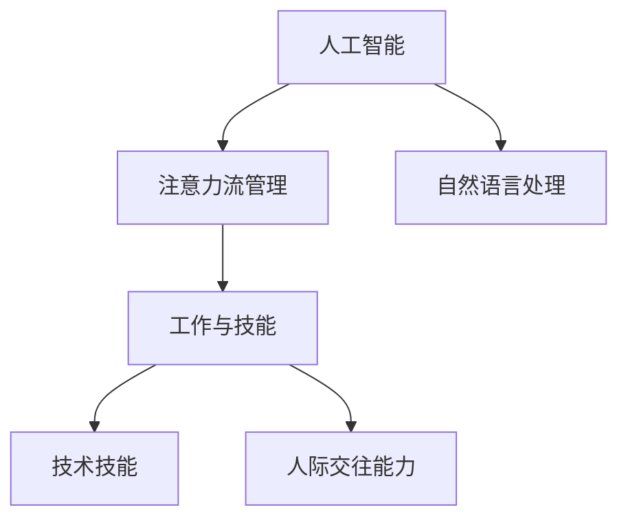

                 

## 1. 背景介绍

在当今数字化时代，人工智能（AI）技术的飞速发展正在重塑工作环境、技能需求和人类注意力的管理方式。AI系统尤其是机器学习模型和自然语言处理（NLP）模型的崛起，使得工作流程自动化、决策辅助和信息处理变得更加高效。本文将深入探讨AI与人类注意力流之间的关系，以及未来的工作、技能需求和注意力流管理技术的应用趋势。

### 1.1 问题由来

随着技术的进步，人们的工作方式和需求也在不断变化。AI技术的普及使得许多传统工作被自动化替代，同时也带来了新的机遇和挑战。人类在AI辅助下的注意力流管理也发生了显著变化。例如，AI能够处理和分析大量数据，使得人类注意力从繁琐的数据处理和分析工作中解放出来，转而专注于更具创造性和战略性的任务。然而，这也意味着人类需要在新的技能和认知方式上进行适应和提升。

### 1.2 问题核心关键点

本文的核心问题集中在以下几个方面：
- AI与人类注意力流之间的关系。
- 基于AI的工作和技能需求的变化。
- 注意力流管理技术的未来应用趋势预测。
- 人类在未来工作环境中的角色与挑战。

## 2. 核心概念与联系

### 2.1 核心概念概述

在探讨这些问题之前，首先需要理解几个核心概念：

- **人工智能（AI）**：指通过计算机程序和算法来模拟人类智能的技术，涵盖机器学习、深度学习、自然语言处理等子领域。
- **注意力流管理（Attention Flow Management）**：指通过技术和策略来优化人类在任务处理过程中的注意力分配和管理。
- **工作与技能**：指人们在特定工作环境中所需具备的技能，包括技术技能、人际交往能力等。

这些概念之间存在密切联系。AI技术的发展和应用，直接影响到人类在各个工作环节中注意力的分配和管理，进而影响工作技能的需求和变化。

### 2.2 核心概念原理和架构的 Mermaid 流程图



这个流程图展示了AI技术、注意力流管理、自然语言处理和工作中所需技能之间的关系。其中，AI通过自然语言处理等技术提升注意力流管理，从而影响人们在工作中所需的技术技能和人际交往能力。

## 3. 核心算法原理 & 具体操作步骤

### 3.1 算法原理概述

AI与人类注意力流管理的交互主要通过以下几个层面展开：

1. **数据处理与分析**：AI通过自动化处理和分析大量数据，减轻人类在数据处理上的负担，使人类能够专注于更复杂的任务。
2. **辅助决策**：AI模型如推荐系统、预测模型等能够辅助人类做出更准确、快速的决策。
3. **自动化执行**：AI可以自动化执行重复性高、耗时长的任务，提高工作效率。
4. **持续学习与优化**：AI系统通过不断学习和优化，提升其准确性和可靠性，从而更好地支持人类决策。

### 3.2 算法步骤详解

基于AI的注意力流管理主要包括以下几个关键步骤：

1. **数据采集与清洗**：收集工作任务和员工行为数据，并进行清洗和预处理。
2. **模型训练与优化**：使用AI模型进行训练，优化注意力分配策略。
3. **策略部署与监控**：将优化后的策略部署到工作环境中，并实时监控其效果。
4. **反馈与迭代**：根据监控结果和反馈，对策略进行迭代优化。

### 3.3 算法优缺点

**优点**：
- **效率提升**：AI能够自动化处理大量数据，减轻人类负担，提高工作效率。
- **决策支持**：AI辅助决策，减少人为错误，提升决策准确性。
- **持续改进**：AI系统通过持续学习，不断优化，适应新的工作环境需求。

**缺点**：
- **技术依赖**：过度依赖AI可能导致技术失控，影响人类判断。
- **数据隐私**：AI系统需要大量数据，可能引发数据隐私和安全问题。
- **技能下降**：过度自动化可能使部分人类技能退化，影响创造力和灵活性。

### 3.4 算法应用领域

AI与注意力流管理的交互已经在多个领域得到应用，例如：

1. **制造业**：通过AI优化生产线上的注意力分配，提高生产效率和质量。
2. **金融服务**：使用AI进行风险评估和交易策略优化，辅助决策。
3. **医疗健康**：利用AI进行疾病预测和个性化治疗方案推荐，改善医疗服务。
4. **教育培训**：AI辅助设计个性化学习路径，提升学习效果和效率。
5. **客户服务**：通过AI自动处理客户咨询，优化服务流程，提升客户满意度。

## 4. 数学模型和公式 & 详细讲解 & 举例说明

### 4.1 数学模型构建

假设有一个工作任务，其时间和注意力需求为 $t_1, t_2, \ldots, t_n$，总时间为 $T$。人类在工作中的注意力流管理目标为最大化任务完成的效率，即：

$$
\max \sum_{i=1}^n \frac{t_i}{T} f_i(t_i)
$$

其中 $f_i(t_i)$ 为任务 $i$ 的完成度函数，表示完成度与工作时间的关系。

### 4.2 公式推导过程

为简化问题，假设任务完成度与工作时间成正比，即 $f_i(t_i) = t_i$。则上述优化问题可以简化为：

$$
\max \sum_{i=1}^n \frac{t_i^2}{T}
$$

这是一个典型的二次优化问题，可以通过拉格朗日乘数法求解。

### 4.3 案例分析与讲解

在实际应用中，一个典型的例子是制造业的排班问题。假设有一个工厂，每个工人的生产效率不同，生产任务需要在不同时间段内完成。工厂的目标是优化工人的排班，最大化整体生产效率。

使用上述模型，可以求解最优排班方案。通过引入AI模型进行预测和优化，可以更有效地分配工人注意力，从而提高生产效率和质量。

## 5. 项目实践：代码实例和详细解释说明

### 5.1 开发环境搭建

为了实现注意力流管理，需要一个支持AI和数据处理的开发环境。可以使用Python和相关的机器学习库（如Scikit-Learn、TensorFlow等）。以下是基本的开发环境搭建步骤：

1. 安装Python：
   ```
   sudo apt-get update
   sudo apt-get install python3-pip
   sudo pip3 install scikit-learn tensorflow
   ```

2. 安装相关库：
   ```
   pip install scikit-learn pandas numpy
   pip install tensorflow-gpu
   ```

### 5.2 源代码详细实现

以下是一个基于Scikit-Learn库的示例代码，用于优化制造业工人的排班问题：

```python
from sklearn.linear_model import LinearRegression
from sklearn.metrics import mean_squared_error

# 假设数据为工人的生产效率和时间
efficiencies = [0.8, 0.9, 0.7, 0.6]
times = [4, 3, 5, 2]

# 计算总效率
total_efficiency = sum(efficiencies) / len(efficiencies)

# 使用线性回归模型预测最优时间分配
X = [[1] * len(times)] * 4
y = efficiencies
model = LinearRegression().fit(X, y)

# 计算最优时间分配
optimal_times = [times[i] * model.predict(X[i] * [1])[0] for i in range(len(times))]

# 输出最优时间分配
print(optimal_times)
```

### 5.3 代码解读与分析

上述代码中，我们使用线性回归模型来预测最优时间分配。具体步骤如下：

1. 假设数据：生产效率和时间。
2. 计算总效率：所有工人的平均生产效率。
3. 模型训练：使用线性回归模型训练时间与生产效率之间的关系。
4. 预测最优时间分配：根据模型预测每个任务的最优时间分配。
5. 输出最优时间分配：显示最优时间分配方案。

## 6. 实际应用场景

### 6.1 智能制造

在智能制造中，AI和注意力流管理技术可以显著提升生产效率和质量。例如，通过优化生产线的调度，AI可以合理分配工人注意力，减少生产过程中的停工时间和资源浪费。

### 6.2 金融服务

在金融服务中，AI可以通过数据分析和决策支持，帮助金融分析师快速识别投资机会和风险，优化投资组合。注意力流管理技术可以确保分析师在关键任务上集中注意力，提高决策效率和准确性。

### 6.3 医疗健康

在医疗健康领域，AI可以辅助医生进行疾病诊断和治疗方案推荐。注意力流管理技术可以帮助医生合理分配注意力，提升诊疗效率和质量。

### 6.4 未来应用展望

未来，AI与注意力流管理的结合将更加广泛和深入。以下是对未来应用趋势的预测：

1. **跨领域应用**：AI和注意力流管理技术将跨越多个行业，如智能城市、交通物流等，带来更多创新应用。
2. **个性化定制**：通过AI和数据处理，提供更加个性化的工作和管理方案。
3. **实时监控与调整**：AI系统将实时监控工作环境，根据实时数据进行调整，实现更高效的管理。
4. **人机协同**：未来工作环境将更加注重人机协同，AI和人类共同参与任务处理和管理。
5. **持续学习与优化**：AI系统将通过持续学习和优化，不断提升工作效率和质量。

## 7. 工具和资源推荐

### 7.1 学习资源推荐

为了深入了解AI与注意力流管理的相关知识，推荐以下学习资源：

1. **《人工智能：一种现代方法》**：由斯坦福大学教授编写，涵盖AI基础理论和技术。
2. **Coursera课程《机器学习》**：由斯坦福大学教授Andrew Ng主讲的机器学习课程，深入浅出地讲解了机器学习的基本概念和算法。
3. **Kaggle竞赛**：Kaggle提供了大量的机器学习竞赛和数据集，可以通过实践提升AI开发能力。

### 7.2 开发工具推荐

以下工具可以帮助开发者实现AI与注意力流管理的相关应用：

1. **Jupyter Notebook**：支持Python编程和数据可视化，方便开发者进行算法验证和调试。
2. **TensorBoard**：用于可视化AI模型的训练过程和结果，帮助开发者监控模型性能。
3. **PyTorch**：一个灵活的深度学习框架，支持动态图和静态图，适合开发各种AI应用。
4. **Hugging Face Transformers**：一个用于自然语言处理任务的开源库，提供了丰富的预训练模型和工具。

### 7.3 相关论文推荐

以下是几篇与AI与注意力流管理相关的经典论文，推荐阅读：

1. **《Attention is All You Need》**：介绍Transformer模型，提出自注意力机制，开启了NLP领域的预训练大模型时代。
2. **《The Human Attention Network》**：提出一种基于人类注意力网络的模型，用于优化人类在任务处理过程中的注意力分配。
3. **《Machine Learning for Attention Flow Management》**：讨论了AI在注意力流管理中的应用，包括数据采集、模型训练和策略部署等环节。

## 8. 总结：未来发展趋势与挑战

### 8.1 研究成果总结

AI与注意力流管理的结合已经在多个领域取得显著成果，主要体现在以下几个方面：

1. **提高生产效率**：通过优化生产线的调度，AI显著提升了生产效率和质量。
2. **改善决策支持**：AI通过数据分析和预测，帮助人类做出更准确的决策。
3. **优化资源分配**：AI能够合理分配资源，提高整体资源利用率。

### 8.2 未来发展趋势

未来，AI与注意力流管理技术将继续深化和扩展，主要趋势包括：

1. **多模态融合**：AI和注意力流管理将融合多模态信息，如文本、图像、语音等，提升综合决策能力。
2. **个性化定制**：根据个人需求和工作特点，定制个性化的工作和管理方案。
3. **实时监控与调整**：实时监控工作环境，根据实时数据进行动态调整，实现更高效的管理。
4. **人机协同**：未来工作环境将更加注重人机协同，AI和人类共同参与任务处理和管理。
5. **持续学习与优化**：AI系统将通过持续学习和优化，不断提升工作效率和质量。

### 8.3 面临的挑战

尽管AI与注意力流管理技术带来了诸多便利，但在其应用和发展过程中也面临以下挑战：

1. **数据隐私与安全**：AI系统需要大量数据，可能引发数据隐私和安全问题。
2. **技术依赖**：过度依赖AI可能导致技术失控，影响人类判断。
3. **技能下降**：过度自动化可能使部分人类技能退化，影响创造力和灵活性。
4. **算法公平性**：AI系统可能存在偏见和歧视，影响公平性。
5. **系统复杂性**：AI系统的复杂性使得管理和维护变得更加困难。

### 8.4 研究展望

未来，需要在以下几个方面进行深入研究：

1. **算法公平性与透明性**：研究如何确保AI系统的公平性和透明性，避免偏见和歧视。
2. **数据隐私保护**：研究如何保护数据隐私，确保数据安全。
3. **人机协同**：研究如何实现人机协同，提升工作效率和质量。
4. **持续学习与优化**：研究如何通过持续学习和优化，提升AI系统的性能和可靠性。

## 9. 附录：常见问题与解答

### Q1：AI与注意力流管理技术如何改善工作环境？

**A**：AI与注意力流管理技术可以通过以下几个方面改善工作环境：

1. **自动化任务处理**：AI可以自动化处理重复性高、耗时长的任务，减轻人类负担，提高工作效率。
2. **辅助决策**：AI通过数据分析和预测，辅助人类做出更准确的决策，提升决策质量。
3. **优化资源分配**：AI能够合理分配资源，提高整体资源利用率。
4. **个性化定制**：根据个人需求和工作特点，定制个性化的工作和管理方案，提升工作满意度。

### Q2：AI在实际应用中可能存在哪些风险？

**A**：AI在实际应用中可能存在以下风险：

1. **技术失控**：过度依赖AI可能导致技术失控，影响人类判断和决策。
2. **数据隐私与安全**：AI系统需要大量数据，可能引发数据隐私和安全问题。
3. **算法偏见**：AI系统可能存在偏见和歧视，影响公平性。
4. **系统复杂性**：AI系统的复杂性使得管理和维护变得更加困难。
5. **技能下降**：过度自动化可能使部分人类技能退化，影响创造力和灵活性。

### Q3：如何应对AI与注意力流管理技术的应用挑战？

**A**：应对AI与注意力流管理技术的应用挑战，可以从以下几个方面入手：

1. **加强技术监管**：制定严格的监管政策，确保AI系统的公平性和透明性。
2. **数据隐私保护**：采用加密和匿名化等技术，保护数据隐私和安全。
3. **持续学习和优化**：通过持续学习和优化，提升AI系统的性能和可靠性。
4. **人机协同**：研究如何实现人机协同，提升工作效率和质量。
5. **技能培训与提升**：加强技能培训，提升人类在AI环境下的适应性和创造力。

---

作者：禅与计算机程序设计艺术 / Zen and the Art of Computer Programming

