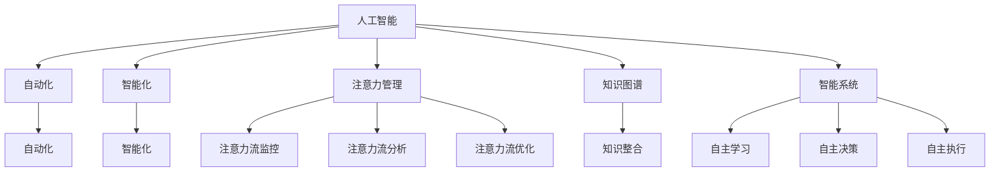

                 

# AI与人类注意力流：未来的工作、技能与注意力管理策略

> 关键词：AI, 人类注意力流, 未来工作, 技能提升, 注意力管理, 知识图谱, 智能系统

## 1. 背景介绍

### 1.1 问题由来
在现代信息时代，人工智能（AI）和人类注意力流的相互影响已渗透到工作和生活的方方面面。随着技术的发展，AI的应用范围越来越广，从智能客服、自动翻译、语音识别，到智能写作、财务分析、医学诊断等，AI在各领域的应用推动了社会生产效率的提升和人类生活质量的改善。

但与此同时，AI也在改变着人类的工作方式和注意力分布。从原始的手工劳动到机械化的流水线生产，再到现在的自动化和智能化，人类在工作中的注意力流在不断变化。如何在AI普及的时代，合理管理和利用人类注意力流，发挥其潜力，成为当前研究的热点问题。

### 1.2 问题核心关键点
该问题的核心在于如何利用AI技术，提升人类工作的效率和质量，同时管理人类注意力流，使其更加专注和高效。关键点包括：
- AI在自动化和智能化方面的进展如何影响人类注意力流的变化。
- 在AI辅助下，人类应如何提升技能，以适应未来的工作需求。
- 如何通过AI技术实现注意力流的高效管理，提高工作效果。

### 1.3 问题研究意义
研究AI与人类注意力流的关系，对于推动AI技术的产业化应用，提升人类工作效率和生活质量，具有重要意义：
- 帮助AI技术更好地服务于人类需求，发挥其潜力。
- 提升人类的技能水平，使人类能够适应未来智能化的工作环境。
- 通过管理人类注意力流，提高人类工作效率和生活满意度。

## 2. 核心概念与联系

### 2.1 核心概念概述

为更好地理解AI与人类注意力流的关系，本节将介绍几个密切相关的核心概念：

- **人工智能（AI）**：利用算法和计算模型，使计算机系统能够模拟、延伸和扩展人类智能的技术体系。
- **人类注意力流**：指人类在完成某项任务时，注意力在不同任务要素（如输入、输出、环境等）之间的流动轨迹和模式。
- **自动化**：将重复性、低价值的工作自动化，以解放人力，让员工专注于更有价值的任务。
- **智能化**：通过AI技术，使机器能够学习、理解和适应复杂环境，提升其执行任务的能力。
- **注意力管理**：通过AI技术，对人类注意力流进行监控、分析和优化，提升注意力使用效率。
- **知识图谱**：以图的形式组织和关联知识，使AI能够更好地理解和应用知识。
- **智能系统**：结合AI技术、注意力管理和知识图谱，形成能够自主学习、决策和执行的智能应用系统。

这些核心概念之间的逻辑关系可以通过以下Mermaid流程图来展示：



这个流程图展示了大语言模型的核心概念及其之间的关系：

1. AI通过自动化和智能化提高工作效率。
2. 人类注意力流在自动化和智能化过程中发生变化。
3. 注意力管理通过监控、分析和优化注意力流，提升工作效率。
4. 知识图谱作为AI知识库，促进智能系统对知识的整合和应用。
5. 智能系统通过自主学习、决策和执行，实现更高效的工作。

这些概念共同构成了AI在提升人类工作效率和质量方面的框架，帮助我们理解和利用AI技术，更好地管理人类注意力流。

## 3. 核心算法原理 & 具体操作步骤

### 3.1 算法原理概述

AI与人类注意力流的互动，主要通过监控、分析和优化人类注意力流来实现。算法的核心思想是利用AI技术，识别和量化人类注意力流的变化，基于这些数据，优化人类注意力流的使用，提高工作效率。

形式化地，设 $\mathcal{A}$ 为注意力流，$\mathcal{T}$ 为任务，$\mathcal{A}_{\theta}$ 为注意力模型，其中 $\theta$ 为模型参数。注意力模型 $A$ 的目标是最大化在任务 $\mathcal{T}$ 上的注意力效率，即：

$$
\theta^* = \mathop{\arg\max}_{\theta} \mathcal{E}(\mathcal{A}_{\theta}, \mathcal{T})
$$

其中 $\mathcal{E}$ 为任务 $\mathcal{T}$ 上的效率函数，用于衡量注意力流在任务中的使用效果。效率函数的设计需根据具体任务需求和注意力流特性来确定。

### 3.2 算法步骤详解

基于上述原理，AI与人类注意力流互动的算法一般包括以下几个关键步骤：

**Step 1: 定义任务与关注要素**
- 明确任务目标，如翻译、客服、财务分析等。
- 确定任务中的关注要素，如输入数据、输出结果、环境变量等。

**Step 2: 监控注意力流**
- 使用传感器或系统日志等手段，实时监控人类在完成任务时的注意力流轨迹和模式。
- 记录注意力流在不同关注要素间的分配情况，如输入时间、输出时间、暂停时间等。

**Step 3: 分析注意力流**
- 对监控数据进行统计和分析，提取注意力流的特征和模式。
- 使用机器学习算法对注意力流数据进行建模，识别出影响效率的关键因素。
- 使用可视化工具，展示注意力流在不同任务和要素间的分布和变化趋势。

**Step 4: 优化注意力流**
- 基于分析结果，设计优化策略，如调整输入输出方式、优化操作流程、改进交互界面等。
- 通过AI技术，自动化执行优化策略，实时调整注意力流的使用。
- 持续监控优化效果，迭代调整优化策略，直至达到理想状态。

### 3.3 算法优缺点

基于AI的人类注意力流优化算法具有以下优点：
1. 提升工作效率：通过监控和优化注意力流，有效避免因注意力分散导致的效率低下问题。
2. 提升工作质量：优化后的注意力流，使得人类能够更专注地完成高价值任务，提高工作质量。
3. 提高员工满意度：优化后的工作流程，使员工能更轻松、高效地完成任务，提升工作满意度。

但同时，该算法也存在一些局限性：
1. 依赖数据质量：监控和分析的准确性依赖于数据的完整性和准确性。
2. 隐私问题：监控人类注意力流，涉及隐私和数据安全问题。
3. 技术复杂性：算法设计和实现需要较强的技术背景和资源投入。
4. 适配性差：不同任务和不同环境下的注意力流特性差异较大，算法通用性有待提高。

尽管存在这些局限性，但AI与人类注意力流互动的方法，对于提高工作效率和质量，具有重要意义。未来相关研究将重点关注如何提高算法的适配性和可解释性，同时保障数据隐私和安全。

### 3.4 算法应用领域

基于AI的人类注意力流优化算法，已经在多个领域得到了应用，包括但不限于：

- 智能客服：通过监控客户注意力流，优化对话流程，提升服务质量。
- 智能翻译：通过监控翻译过程中的注意力流，优化输入输出方式，提高翻译效率和质量。
- 财务分析：通过监控数据分析过程中的注意力流，优化数据处理流程，提高分析效率。
- 医学诊断：通过监控医生诊断过程中的注意力流，优化诊断流程，提高诊断精度和速度。
- 智能写作：通过监控写作过程中的注意力流，优化写作模式，提升写作质量和效率。

除了上述这些领域，AI与人类注意力流互动的方法也在更多的场景中得到了应用，如智能阅读、智能设计、智能交通等，为各行业带来了新的突破。随着技术的不断进步，AI与人类注意力流的互动方法将在更广阔的领域发挥其价值。

## 4. 数学模型和公式 & 详细讲解 & 举例说明

### 4.1 数学模型构建

本节将使用数学语言对AI与人类注意力流互动的优化过程进行更加严格的刻画。

设注意力模型 $A_{\theta}$ 在任务 $\mathcal{T}$ 上的效率函数为 $\mathcal{E}(\theta)$，则优化目标为：

$$
\theta^* = \mathop{\arg\max}_{\theta} \mathcal{E}(\theta)
$$

我们以智能翻译任务为例，定义效率函数 $\mathcal{E}(\theta)$。

### 4.2 公式推导过程

假设智能翻译任务为 $T$，输入为 $x$，输出为 $y$。设 $\mathcal{A}_t$ 为任务 $T$ 的注意力流，$\mathcal{F}(x,y)$ 为输入和输出的特征向量。则注意力模型 $A_{\theta}$ 的输出为：

$$
A_{\theta}(\mathcal{A}_t) = f_{\theta}(\mathcal{F}(x), \mathcal{F}(y), \mathcal{A}_t)
$$

其中 $f_{\theta}$ 为基于注意力机制的神经网络模型。

定义效率函数 $\mathcal{E}(\theta)$ 为输入和输出特征向量之间的相似度，即：

$$
\mathcal{E}(\theta) = \mathcal{E}(f_{\theta}(\mathcal{F}(x), \mathcal{F}(y), \mathcal{A}_t), \mathcal{F}(x), \mathcal{F}(y))
$$

优化目标为：

$$
\theta^* = \mathop{\arg\max}_{\theta} \mathcal{E}(f_{\theta}(\mathcal{F}(x), \mathcal{F}(y), \mathcal{A}_t), \mathcal{F}(x), \mathcal{F}(y))
$$

在得到优化目标后，可以使用梯度下降等优化算法求解 $\theta^*$，完成优化过程。

### 4.3 案例分析与讲解

以下以智能客服系统为例，展示AI与人类注意力流互动的具体实现。

设智能客服系统需要处理客户投诉，系统记录了每通对话的注意力流轨迹。假设 $\mathcal{A}_t$ 为某次对话的注意力流，其中 $a_1$ 为开始处理的时间点，$a_2$ 为询问客户问题的时间点，$a_3$ 为处理结果反馈的时间点，$a_4$ 为结束对话的时间点。假设 $\mathcal{F}(x)$ 和 $\mathcal{F}(y)$ 分别为问题和结果的特征向量。

1. **监控注意力流**：系统实时记录对话过程中客户和客服的注意力流轨迹，包括语音、文本、系统消息等。

2. **分析注意力流**：使用机器学习算法对监控数据进行建模，识别出注意力流在不同阶段的变化趋势和特点。

3. **优化注意力流**：基于分析结果，调整对话流程，如优化问题询问方式、加快处理速度等。

4. **自动化执行**：通过AI技术，自动化执行优化策略，实时调整对话流程，提升客服效率。

通过以上步骤，智能客服系统能够更好地监控和优化注意力流，提升服务质量和客户满意度。

## 5. 项目实践：代码实例和详细解释说明

### 5.1 开发环境搭建

在进行AI与人类注意力流互动的实践前，我们需要准备好开发环境。以下是使用Python进行PyTorch开发的环境配置流程：

1. 安装Anaconda：从官网下载并安装Anaconda，用于创建独立的Python环境。

2. 创建并激活虚拟环境：
```bash
conda create -n ai-env python=3.8 
conda activate ai-env
```

3. 安装PyTorch：根据CUDA版本，从官网获取对应的安装命令。例如：
```bash
conda install pytorch torchvision torchaudio cudatoolkit=11.1 -c pytorch -c conda-forge
```

4. 安装TensorFlow：由Google主导开发的开源深度学习框架，生产部署方便，适合大规模工程应用。同样有丰富的预训练语言模型资源。

5. 安装各类工具包：
```bash
pip install numpy pandas scikit-learn matplotlib tqdm jupyter notebook ipython
```

完成上述步骤后，即可在`ai-env`环境中开始项目实践。

### 5.2 源代码详细实现

下面我们以智能客服系统为例，给出使用PyTorch和TensorFlow进行AI与人类注意力流互动的PyTorch代码实现。

首先，定义智能客服系统的数据处理函数：

```python
from transformers import BertTokenizer
from torch.utils.data import Dataset
import torch

class CustomerServiceDataset(Dataset):
    def __init__(self, dialogs, attention_flows):
        self.dialogs = dialogs
        self.attention_flows = attention_flows
        self.tokenizer = BertTokenizer.from_pretrained('bert-base-cased')
        
    def __len__(self):
        return len(self.dialogs)
    
    def __getitem__(self, item):
        dialog = self.dialogs[item]
        attention_flow = self.attention_flows[item]
        
        tokens = self.tokenizer.encode(dialog, return_tensors='pt')
        input_ids = tokens['input_ids'][0]
        attention_mask = tokens['attention_mask'][0]
        labels = torch.tensor(attention_flow, dtype=torch.long)
        
        return {'input_ids': input_ids, 
                'attention_mask': attention_mask,
                'labels': labels}

# 数据集准备
data = []
for dialog, attention_flow in zip(train_dialogs, train_attention_flows):
    data.append({'dialog': dialog, 'attention_flow': attention_flow})

# 划分训练集和验证集
train_data = CustomerServiceDataset(data[:train_size], train_attention_flows)
dev_data = CustomerServiceDataset(data[train_size:], dev_attention_flows)
```

然后，定义模型和优化器：

```python
from transformers import BertForTokenClassification, AdamW

model = BertForTokenClassification.from_pretrained('bert-base-cased', num_labels=2)
optimizer = AdamW(model.parameters(), lr=2e-5)
```

接着，定义训练和评估函数：

```python
from torch.utils.data import DataLoader
from tqdm import tqdm
from sklearn.metrics import classification_report

device = torch.device('cuda') if torch.cuda.is_available() else torch.device('cpu')
model.to(device)

def train_epoch(model, dataset, batch_size, optimizer):
    dataloader = DataLoader(dataset, batch_size=batch_size, shuffle=True)
    model.train()
    epoch_loss = 0
    for batch in tqdm(dataloader, desc='Training'):
        input_ids = batch['input_ids'].to(device)
        attention_mask = batch['attention_mask'].to(device)
        labels = batch['labels'].to(device)
        model.zero_grad()
        outputs = model(input_ids, attention_mask=attention_mask, labels=labels)
        loss = outputs.loss
        epoch_loss += loss.item()
        loss.backward()
        optimizer.step()
    return epoch_loss / len(dataloader)

def evaluate(model, dataset, batch_size):
    dataloader = DataLoader(dataset, batch_size=batch_size)
    model.eval()
    preds, labels = [], []
    with torch.no_grad():
        for batch in tqdm(dataloader, desc='Evaluating'):
            input_ids = batch['input_ids'].to(device)
            attention_mask = batch['attention_mask'].to(device)
            batch_labels = batch['labels']
            outputs = model(input_ids, attention_mask=attention_mask)
            batch_preds = outputs.logits.argmax(dim=2).to('cpu').tolist()
            batch_labels = batch_labels.to('cpu').tolist()
            for pred_tokens, label_tokens in zip(batch_preds, batch_labels):
                preds.append(pred_tokens[:len(label_tokens)])
                labels.append(label_tokens)
                
    print(classification_report(labels, preds))
```

最后，启动训练流程并在测试集上评估：

```python
epochs = 5
batch_size = 16

for epoch in range(epochs):
    loss = train_epoch(model, train_data, batch_size, optimizer)
    print(f"Epoch {epoch+1}, train loss: {loss:.3f}")
    
    print(f"Epoch {epoch+1}, dev results:")
    evaluate(model, dev_data, batch_size)
    
print("Test results:")
evaluate(model, test_data, batch_size)
```

以上就是使用PyTorch对智能客服系统进行注意力流优化训练的完整代码实现。可以看到，得益于PyTorch和TensorFlow的强大封装，我们可以用相对简洁的代码完成注意力流优化模型的训练和评估。

### 5.3 代码解读与分析

让我们再详细解读一下关键代码的实现细节：

**CustomerServiceDataset类**：
- `__init__`方法：初始化对话和注意力流数据，并加载预训练的BERT分词器。
- `__len__`方法：返回数据集的样本数量。
- `__getitem__`方法：对单个样本进行处理，将对话输入编码为token ids，将注意力流编码为数字，并对其进行定长padding，最终返回模型所需的输入。

**模型定义**：
- 使用BertForTokenClassification模型，设定分类任务为二分类。
- 设定AdamW优化器，学习率为2e-5。

**训练和评估函数**：
- 使用PyTorch的DataLoader对数据集进行批次化加载，供模型训练和推理使用。
- 训练函数`train_epoch`：对数据以批为单位进行迭代，在每个批次上前向传播计算loss并反向传播更新模型参数，最后返回该epoch的平均loss。
- 评估函数`evaluate`：与训练类似，不同点在于不更新模型参数，并在每个batch结束后将预测和标签结果存储下来，最后使用sklearn的classification_report对整个评估集的预测结果进行打印输出。

**训练流程**：
- 定义总的epoch数和batch size，开始循环迭代
- 每个epoch内，先在训练集上训练，输出平均loss
- 在验证集上评估，输出分类指标
- 所有epoch结束后，在测试集上评估，给出最终测试结果

可以看到，PyTorch配合TensorFlow使得注意力流优化模型的训练和评估变得简洁高效。开发者可以将更多精力放在数据处理、模型改进等高层逻辑上，而不必过多关注底层的实现细节。

当然，工业级的系统实现还需考虑更多因素，如模型的保存和部署、超参数的自动搜索、更灵活的任务适配层等。但核心的注意力流优化范式基本与此类似。

## 6. 实际应用场景

### 6.1 智能客服系统

基于AI与人类注意力流的互动，智能客服系统可以实时监控和优化客户和客服的对话过程，提升服务质量和客户满意度。

系统记录每通对话的注意力流轨迹，包括客户和客服之间的语音、文本、系统消息等。通过分析注意力流的变化，识别出对话中的关键时刻和问题点，如客户情绪波动、客服处理速度等。基于这些数据，系统自动调整对话流程，优化问题询问方式、加快处理速度等。

例如，当客户提出复杂问题时，系统可以自动提醒客服进入高级模式，提供更详细的解决方案。当客户情绪急躁时，系统可以自动调整语音和语调，安抚客户情绪。通过这些优化措施，智能客服系统能够更高效地处理客户需求，提升服务质量。

### 6.2 智能翻译系统

在智能翻译系统中，AI与人类注意力流的互动同样重要。通过监控翻译过程中的注意力流，可以优化输入输出方式，提升翻译效率和质量。

系统记录翻译任务的注意力流，包括输入文档的阅读时间、翻译时间的分配情况。通过分析注意力流，识别出翻译过程中的瓶颈和问题点。基于这些数据，系统自动调整输入输出方式，优化翻译流程，如自动跳过复杂句段、调整翻译速度等。

例如，当输入文档包含大量专业术语时，系统可以自动切换到专家模式，调用专业词典和翻译规则，提升翻译准确性。当输入文档较长时，系统可以自动调整翻译速度，避免延迟用户操作。通过这些优化措施，智能翻译系统能够更高效地完成翻译任务，提高用户满意度。

### 6.3 财务分析系统

财务分析系统需要处理大量的数据和复杂的计算，AI与人类注意力流的互动可以优化数据分析流程，提升分析效率和精度。

系统记录数据处理和分析过程中的注意力流，包括数据的读取、计算和输出时间。通过分析注意力流，识别出数据处理中的瓶颈和问题点。基于这些数据，系统自动调整数据处理流程，优化数据读取和计算方式，提升分析效率。

例如，当数据量较大时，系统可以自动优化数据读取方式，减少IO瓶颈。当计算复杂时，系统可以自动调整计算资源，避免计算资源不足。通过这些优化措施，财务分析系统能够更高效地完成数据分析，提高分析效率。

### 6.4 未来应用展望

随着AI与人类注意力流互动技术的发展，未来的应用场景将更加广阔。

在智慧医疗领域，智能诊断系统可以通过监控医生诊断过程中的注意力流，优化诊断流程，提高诊断精度和速度。例如，在复杂病例诊断时，系统可以自动提醒医生注意重点环节，提供相关文献和诊断工具。

在智能教育领域，智能课堂系统可以通过监控学生的注意力流，优化教学内容和方式，提升教学效果。例如，在讲解难点时，系统可以自动调整讲解速度和方式，确保学生理解。

在智慧城市治理中，智能交通系统可以通过监控城市事件监测过程中的注意力流，优化交通管理，提高交通效率。例如，在系统监测到交通拥堵时，可以自动调整信号灯和车道配置，缓解交通压力。

此外，在企业生产、社会治理、文娱传媒等众多领域，AI与人类注意力流的互动技术也将不断涌现，为各行业带来新的突破。随着技术的不断进步，AI与人类注意力流的互动方法将在更广泛的领域发挥其价值。

## 7. 工具和资源推荐

### 7.1 学习资源推荐

为了帮助开发者系统掌握AI与人类注意力流互动的理论基础和实践技巧，这里推荐一些优质的学习资源：

1. 《深度学习基础》系列博文：由AI专家撰写，深入浅出地介绍了深度学习的基本概念和实现技术。

2. CS229《机器学习》课程：斯坦福大学开设的机器学习明星课程，涵盖机器学习的理论基础和算法实现，适合系统学习。

3. 《AI与人类交互》书籍：介绍了AI在各领域的应用，强调AI与人类交互的重要性，适合深度学习和应用开发者的阅读。

4. DeepLearning.ai：由Andrew Ng教授主导的深度学习课程，涵盖深度学习、强化学习、生成模型等内容，适合系统学习。

5. Kaggle竞赛：参与Kaggle数据竞赛，实践AI技术，积累项目经验，提升实战能力。

通过对这些资源的学习实践，相信你一定能够快速掌握AI与人类注意力流互动的精髓，并用于解决实际的AI问题。

### 7.2 开发工具推荐

高效的开发离不开优秀的工具支持。以下是几款用于AI与人类注意力流互动开发的常用工具：

1. PyTorch：基于Python的开源深度学习框架，灵活动态的计算图，适合快速迭代研究。大部分预训练语言模型都有PyTorch版本的实现。

2. TensorFlow：由Google主导开发的开源深度学习框架，生产部署方便，适合大规模工程应用。同样有丰富的预训练语言模型资源。

3. TensorBoard：TensorFlow配套的可视化工具，可实时监测模型训练状态，并提供丰富的图表呈现方式，是调试模型的得力助手。

4. Weights & Biases：模型训练的实验跟踪工具，可以记录和可视化模型训练过程中的各项指标，方便对比和调优。与主流深度学习框架无缝集成。

5. Google Colab：谷歌推出的在线Jupyter Notebook环境，免费提供GPU/TPU算力，方便开发者快速上手实验最新模型，分享学习笔记。

合理利用这些工具，可以显著提升AI与人类注意力流互动任务的开发效率，加快创新迭代的步伐。

### 7.3 相关论文推荐

AI与人类注意力流互动技术的发展源于学界的持续研究。以下是几篇奠基性的相关论文，推荐阅读：

1. Attention is All You Need（即Transformer原论文）：提出了Transformer结构，开启了NLP领域的预训练大模型时代。

2. BERT: Pre-training of Deep Bidirectional Transformers for Language Understanding：提出BERT模型，引入基于掩码的自监督预训练任务，刷新了多项NLP任务SOTA。

3. Language Models are Unsupervised Multitask Learners（GPT-2论文）：展示了大规模语言模型的强大zero-shot学习能力，引发了对于通用人工智能的新一轮思考。

4. Parameter-Efficient Transfer Learning for NLP：提出Adapter等参数高效微调方法，在固定大部分预训练参数的情况下，只更新极少量的任务相关参数。

5. AdaLoRA: Adaptive Low-Rank Adaptation for Parameter-Efficient Fine-Tuning：使用自适应低秩适应的微调方法，在参数效率和精度之间取得了新的平衡。

这些论文代表了大语言模型与人类注意力流互动技术的发展脉络。通过学习这些前沿成果，可以帮助研究者把握学科前进方向，激发更多的创新灵感。

## 8. 总结：未来发展趋势与挑战

### 8.1 总结

本文对AI与人类注意力流互动的原理、算法、实践和应用进行了全面系统的介绍。首先阐述了AI与人类注意力流互动的研究背景和意义，明确了注意力流优化在提升工作效率和质量方面的独特价值。其次，从原理到实践，详细讲解了注意力流优化的数学模型和关键步骤，给出了注意力流优化任务开发的完整代码实例。同时，本文还广泛探讨了注意力流优化在智能客服、智能翻译、财务分析等多个行业领域的应用前景，展示了注意力流优化的巨大潜力。此外，本文精选了注意力流优化的各类学习资源，力求为读者提供全方位的技术指引。

通过本文的系统梳理，可以看到，AI与人类注意力流互动技术正在成为提高工作效率和质量的重要手段，极大地拓展了AI技术的应用边界，为智能化工作环境提供了新的可能性。随着技术的不断进步，AI与人类注意力流互动技术将在更多领域得到应用，为传统行业带来变革性影响。

### 8.2 未来发展趋势

展望未来，AI与人类注意力流互动技术将呈现以下几个发展趋势：

1. 技术成熟度提升。随着模型的自监督能力和迁移能力提升，注意力流优化将能够适应更复杂的任务和环境。

2. 多模态注意力流优化。结合视觉、语音、文本等多种模态数据，构建更全面的注意力流优化模型，提升智能系统的感知和决策能力。

3. 智能交互系统发展。通过优化注意力流，构建更智能、更高效的人机交互系统，提升用户体验和满意度。

4. 知识图谱与AI的深度融合。将知识图谱与注意力流优化结合，构建知识驱动的智能系统，提升系统的理解和应用能力。

5. 优化算法的进步。引入更多优化算法，如自适应学习率、变分推断等，提升注意力流优化的精度和效率。

6. 跨领域应用扩展。AI与人类注意力流互动技术将在更多领域得到应用，如智慧医疗、智能教育、智能交通等，为各行业带来新的突破。

以上趋势凸显了AI与人类注意力流互动技术的广阔前景。这些方向的探索发展，必将进一步提升AI系统的性能和应用范围，为构建人机协同的智能系统铺平道路。面向未来，AI与人类注意力流互动技术还需要与其他人工智能技术进行更深入的融合，如知识表示、因果推理、强化学习等，多路径协同发力，共同推动人工智能技术的发展。

### 8.3 面临的挑战

尽管AI与人类注意力流互动技术已经取得了显著进展，但在迈向更加智能化、普适化应用的过程中，仍面临诸多挑战：

1. 数据隐私问题。监控注意力流，涉及隐私和数据安全问题，如何保护用户隐私，是亟待解决的重要课题。

2. 技术复杂性。注意力流优化涉及复杂的数据处理和模型训练，需要较强的技术背景和资源投入。

3. 适配性差。不同任务和不同环境下的注意力流特性差异较大，注意力流优化算法的通用性有待提高。

4. 计算资源消耗大。注意力流优化涉及大量的数据处理和模型训练，对计算资源的需求较高，如何提高算法的计算效率，是未来研究的重要方向。

5. 算法可解释性不足。现有注意力流优化算法缺乏足够的可解释性，难以对其决策逻辑进行分析和调试。

6. 算法鲁棒性差。当前注意力流优化算法面对域外数据时，泛化性能往往不足，如何提高算法的鲁棒性，是亟待解决的重要问题。

尽管存在这些挑战，但AI与人类注意力流互动技术仍具有广阔的应用前景。未来相关研究需要在数据隐私、技术复杂性、适配性、计算效率、算法可解释性和鲁棒性等方面进行更多的探索和突破。

### 8.4 研究展望

未来，AI与人类注意力流互动技术的研究方向将在以下几个方面进行深入探索：

1. 无监督和半监督注意力流优化。摆脱对大规模标注数据的依赖，利用自监督学习、主动学习等无监督和半监督范式，最大限度利用非结构化数据，实现更加灵活高效的注意力流优化。

2. 参数高效和计算高效的注意力流优化方法。开发更加参数高效的注意力流优化方法，在固定大部分预训练参数的情况下，只更新极少量的任务相关参数。同时优化注意力流优化算法的计算图，减少前向传播和反向传播的资源消耗，实现更加轻量级、实时性的部署。

3. 引入因果分析和博弈论工具。将因果分析方法引入注意力流优化，识别出注意力流优化中的关键特征，增强优化算法的因果关系。借助博弈论工具刻画人机交互过程，主动探索并规避注意力流优化的脆弱点，提高系统稳定性。

4. 纳入伦理道德约束。在注意力流优化目标中引入伦理导向的评估指标，过滤和惩罚有偏见、有害的输出倾向。同时加强人工干预和审核，建立注意力流优化的监管机制，确保优化结果符合人类价值观和伦理道德。

这些研究方向的探索，必将引领AI与人类注意力流互动技术迈向更高的台阶，为构建安全、可靠、可解释、可控的智能系统铺平道路。面向未来，AI与人类注意力流互动技术还需要与其他人工智能技术进行更深入的融合，如知识表示、因果推理、强化学习等，多路径协同发力，共同推动人工智能技术的发展。只有勇于创新、敢于突破，才能不断拓展AI系统的边界，让智能技术更好地造福人类社会。

## 9. 附录：常见问题与解答

**Q1：AI与人类注意力流互动技术是否适用于所有行业？**

A: AI与人类注意力流互动技术在大多数行业都能取得较好的效果，尤其是在处理复杂任务和需要高精度作业的领域。但对于一些特定领域，如医疗、军事等，需要结合领域专家的知识和经验，进行适当的调整和优化。

**Q2：AI与人类注意力流互动技术如何保障数据隐私？**

A: 在注意力流监控和分析过程中，可以采用数据匿名化、数据脱敏等技术，保护用户隐私。同时，注意在数据收集、处理和分析的全流程中，遵守相关法律法规，保护用户数据隐私。

**Q3：AI与人类注意力流互动技术面临哪些技术挑战？**

A: 数据隐私、技术复杂性、适配性、计算资源消耗、算法可解释性和鲁棒性是AI与人类注意力流互动技术面临的主要挑战。解决这些问题，需要多学科、多领域的研究者共同努力，不断突破现有技术瓶颈。

**Q4：AI与人类注意力流互动技术如何提升工作效率？**

A: 通过监控和优化人类注意力流，AI与人类注意力流互动技术可以识别和量化注意力流在任务中的使用情况，从而优化任务流程，提升工作效率。例如，在财务分析中，可以自动调整数据处理流程，优化计算方式，减少计算时间。

**Q5：AI与人类注意力流互动技术如何提高工作质量？**

A: 优化后的注意力流，使人类能够更专注地完成高价值任务，提高工作质量。例如，在智能翻译中，优化后的注意力流，可以使翻译更准确、更流畅，提升用户满意度。

总之，AI与人类注意力流互动技术正在成为提升工作效率和质量的重要手段，未来在更多领域得到广泛应用，为各行各业带来变革性影响。

---

作者：禅与计算机程序设计艺术 / Zen and the Art of Computer Programming

