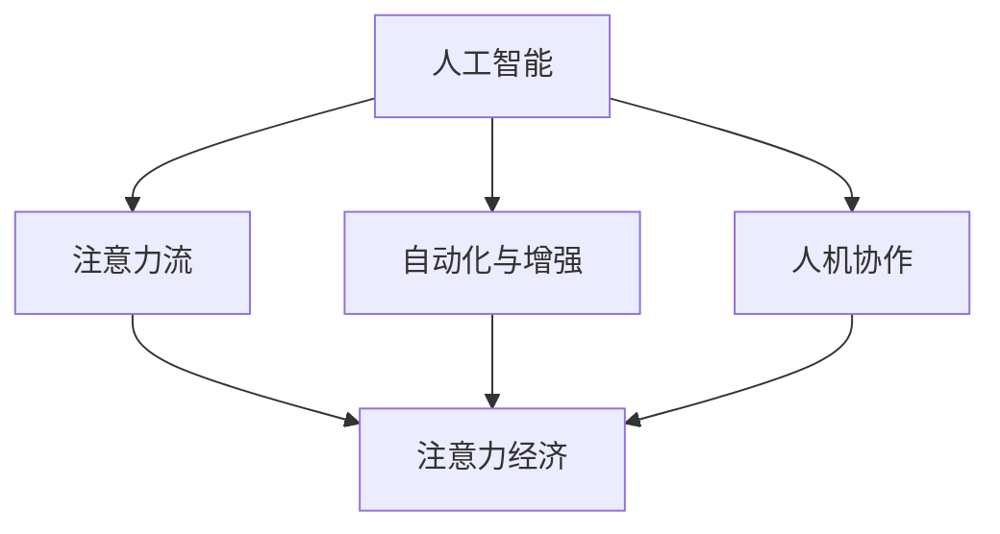

                 

# AI与人类注意力流：未来的工作、技能与注意力经济的融合

## 1. 背景介绍

### 1.1 问题由来

在数字化时代，人工智能（AI）技术的快速发展正在重塑各行各业的工作模式、技能需求和产业经济。AI不仅在自动驾驶、医疗诊断、金融分析等垂直领域展现出了巨大的潜力，还在广泛地渗透到日常生活的各个方面，如智能家居、智能客服、智能助理等。然而，伴随AI技术带来的便捷与效率，也引发了关于人类工作的未来、技能需求以及注意力经济的一系列深刻思考。

当前，AI与人类劳动力的协作正在产生新的劳动分工和技能需求，同时，随着AI技术的发展，人类的注意力和认知需求也在发生显著变化。这些变化不仅影响到个体的工作方式，更对社会结构和经济模式产生了深远的影响。因此，深入理解AI与人类注意力流的关系，对于把握未来工作、技能需求以及注意力经济的融合趋势具有重要意义。

### 1.2 问题核心关键点

AI与人类注意力流的融合，主要体现在以下几个方面：

1. **工作模式的演变**：AI技术能够自动化执行重复性、规则性的任务，释放人类专注于创新性、复杂性的工作，从而改变传统的工作模式，推动工作方式从劳动密集型向智能密集型转变。
2. **技能需求的重塑**：AI的应用要求劳动者具备更高的技术素养和跨学科能力，如数据分析、编程、机器学习等，同时需要良好的沟通、协作和创造性思维。
3. **注意力经济的兴起**：AI技术的普及和应用，使得注意力资源成为一种重要的经济要素，与资本、劳动、土地并列成为经济四大要素之一。有效利用和分配注意力资源，成为提升经济效益的关键。

本文将通过系统梳理AI与人类注意力流的融合机制，探讨未来工作、技能与注意力经济的发展趋势，并提供相应的解决策略和推荐工具，以期为未来的技术应用、教育培训以及政策制定提供参考。

## 2. 核心概念与联系

### 2.1 核心概念概述

为更好地理解AI与人类注意力流的融合机制，本节将介绍几个密切相关的核心概念：

- **人工智能（AI）**：一种通过模拟人类智能过程，实现信息获取、处理和使用的技术。
- **注意力流（Attention Flow）**：指人类在处理信息和完成任务时，注意力资源在不同任务、信息和环境中的流动与分配。
- **自动化与增强（Autonomy & Augmentation）**：指AI在执行重复性任务和辅助人类决策方面的能力，以及其在提升人类工作效率和创造力方面的作用。
- **人机协作（Human-Machine Collaboration）**：指AI与人类在任务执行和问题解决过程中的相互协作关系，包括知识共享、技能互补和共同决策。
- **注意力经济（Attention Economy）**：指在数字化时代，注意力资源作为一种稀缺的经济要素，其分配和利用对经济效益的影响。

这些核心概念之间的逻辑关系可以通过以下Mermaid流程图来展示：



这个流程图展示了大语言模型的核心概念及其之间的关系：

1. AI通过模拟人类智能，改变了信息的处理和利用方式，释放了人类对注意力流的需求。
2. 自动化与增强提升了AI在执行重复性任务和辅助人类决策方面的能力，从而改善了注意力流的分配和使用。
3. 人机协作使得AI与人类在任务执行和问题解决过程中相互协作，共同影响注意力流的流动。
4. 注意力经济在数字化时代成为一种重要的经济要素，其分配和利用受到AI与人类注意力流的影响。

这些概念共同构成了AI与人类注意力流融合的理论框架，为深入理解这一现象提供了必要的理论基础。

## 3. 核心算法原理 & 具体操作步骤

### 3.1 算法原理概述

AI与人类注意力流的融合，本质上是一种复杂的人机交互和协同优化过程。其核心思想是通过AI技术提升人类在处理信息和完成任务时的效率和效果，同时优化注意力资源的分配和使用。

具体而言，AI技术能够通过自动执行重复性任务、辅助决策和生成创意，释放人类专注于更具挑战性和创新性的工作。在这一过程中，AI与人类之间的协同作用，使得注意力资源在不同任务、信息和环境中的流动更加高效和合理。

### 3.2 算法步骤详解

基于AI与人类注意力流的融合机制，AI技术在实际应用中通常需要经过以下几个关键步骤：

**Step 1: 数据准备与特征工程**
- 收集与任务相关的数据，进行预处理和特征提取，以生成可用于模型训练的特征向量。
- 使用AI算法（如深度学习、自然语言处理等）对数据进行建模，以生成能够反映任务需求和注意力流特征的模型。

**Step 2: 模型训练与优化**
- 利用已有数据集，对AI模型进行训练，以优化模型参数，使其能够准确预测任务结果并分配注意力资源。
- 通过交叉验证等方法，对模型进行调优，以提高模型泛化能力和预测精度。

**Step 3: 模型评估与测试**
- 使用测试集对模型进行评估，计算模型的准确率、召回率、F1值等指标，以评估模型的性能。
- 根据评估结果，对模型进行调整和优化，以进一步提升模型表现。

**Step 4: 应用与部署**
- 将训练好的模型应用于实际任务中，进行数据处理和结果生成。
- 部署模型到相应的应用系统中，进行持续监测和优化。

### 3.3 算法优缺点

AI与人类注意力流的融合，具有以下优点：

1. **提高效率**：通过自动化和辅助决策，AI能够高效处理大量信息，提升工作效率。
2. **优化注意力分配**：AI能够根据任务需求，合理分配注意力资源，优化人类工作流程。
3. **增强创造力**：AI辅助下的工作环境，能够激发人类创造性思维，产生更多创新成果。
4. **提升决策质量**：AI能够提供数据分析和模式识别，辅助人类进行更准确的决策。

然而，这种融合也存在一些局限性：

1. **依赖高质量数据**：模型的训练和优化依赖高质量的数据，数据缺失或质量问题可能导致模型性能下降。
2. **技术复杂性高**：AI技术的开发和应用需要较高的技术水平，可能对人类技术素养提出挑战。
3. **伦理与安全问题**：AI的决策过程可能存在偏见和错误，导致伦理与安全问题。

尽管存在这些局限性，但就目前而言，AI与人类注意力流的融合仍然是大势所趋，将深刻影响未来的工作方式和技能需求。

### 3.4 算法应用领域

AI与人类注意力流的融合，已经在多个领域得到了应用，如：

- **智能客服**：AI辅助下的人机对话系统，能够根据用户需求提供快速响应和个性化服务。
- **金融分析**：AI技术能够处理大量金融数据，提供投资建议和风险评估。
- **医疗诊断**：AI辅助的医学影像分析，能够提高诊断准确率和效率。
- **教育培训**：AI技术能够提供个性化学习方案和智能化评估，提升教育效果。
- **智能家居**：AI系统能够根据用户行为习惯，提供智能化的生活服务。

这些领域的应用，展示了AI与人类注意力流融合的广泛前景和巨大潜力。

## 4. 数学模型和公式 & 详细讲解  
### 4.1 数学模型构建

为了更好地理解AI与人类注意力流的融合机制，本节将使用数学语言对AI技术在处理注意力流方面的作用进行更加严格的刻画。

设任务为 $T$，输入数据为 $X$，注意力流为 $A$，AI模型为 $M$。在任务 $T$ 下，AI模型 $M$ 能够将输入数据 $X$ 映射为输出 $Y$，并分配注意力流 $A$，使得 $Y=f_A(X)$，其中 $f_A$ 表示在注意力流 $A$ 下的映射函数。

定义AI模型 $M$ 在输入 $X$ 上的损失函数为 $\ell(M(X),Y)$，则在数据集 $D=\{(X_i,Y_i)\}_{i=1}^N$ 上的经验风险为：

$$
\mathcal{L}(M)=\frac{1}{N}\sum_{i=1}^N \ell(M(X_i),Y_i)
$$

微调AI模型的目标是最小化经验风险，即找到最优模型 $M^*$：

$$
M^*=\mathop{\arg\min}_{M} \mathcal{L}(M)
$$

在实践中，我们通常使用基于梯度的优化算法（如SGD、Adam等）来近似求解上述最优化问题。设 $\eta$ 为学习率，$\lambda$ 为正则化系数，则参数的更新公式为：

$$
M \leftarrow M - \eta \nabla_{M}\mathcal{L}(M) - \eta\lambda M
$$

其中 $\nabla_{M}\mathcal{L}(M)$ 为损失函数对模型 $M$ 的梯度，可通过反向传播算法高效计算。

### 4.2 公式推导过程

以下我们以二分类任务为例，推导交叉熵损失函数及其梯度的计算公式。

设任务 $T$ 为二分类任务，输入数据 $X$ 包含 $d$ 维特征，注意力流 $A$ 表示注意力资源的分配权重，AI模型 $M$ 将 $X$ 映射为 $Y$ 的概率分布 $P(Y|X,A)$，则二分类交叉熵损失函数定义为：

$$
\ell(M(X),Y)= - \sum_{y \in \{0,1\}} Y[y] \log P(Y|X,A) + (1-Y[y])\log(1-P(Y|X,A))
$$

将其代入经验风险公式，得：

$$
\mathcal{L}(A)= - \frac{1}{N}\sum_{i=1}^N \sum_{y \in \{0,1\}} Y_i[y] \log P(Y_i|X_i,A) + (1-Y_i[y])\log(1-P(Y_i|X_i,A))
$$

根据链式法则，损失函数对注意力流 $A$ 的梯度为：

$$
\frac{\partial \mathcal{L}(A)}{\partial A} = -\frac{1}{N}\sum_{i=1}^N \sum_{y \in \{0,1\}} \frac{Y_i[y]P(Y_i|X_i,A) - (1-Y_i[y])P(1-Y_i|X_i,A)}{P(Y_i|X_i,A)}
$$

在得到损失函数的梯度后，即可带入参数更新公式，完成模型的迭代优化。重复上述过程直至收敛，最终得到适应任务 $T$ 的最优注意力流分配策略 $A^*$。

## 5. 项目实践：代码实例和详细解释说明
### 5.1 开发环境搭建

在进行AI与人类注意力流的融合实践前，我们需要准备好开发环境。以下是使用Python进行TensorFlow开发的环境配置流程：

1. 安装Anaconda：从官网下载并安装Anaconda，用于创建独立的Python环境。

2. 创建并激活虚拟环境：
```bash
conda create -n ai-env python=3.8 
conda activate ai-env
```

3. 安装TensorFlow：根据CUDA版本，从官网获取对应的安装命令。例如：
```bash
conda install tensorflow -c conda-forge
```

4. 安装Keras：TensorFlow的高级API，用于简化深度学习模型的构建和训练。
```bash
pip install keras
```

5. 安装numpy、pandas、matplotlib等辅助工具包：
```bash
pip install numpy pandas matplotlib jupyter notebook ipython
```

完成上述步骤后，即可在`ai-env`环境中开始AI与人类注意力流的融合实践。

### 5.2 源代码详细实现

下面我们以金融数据分析任务为例，给出使用TensorFlow对AI模型进行微调的Python代码实现。

首先，定义数据预处理函数：

```python
import tensorflow as tf
from tensorflow.keras import layers
import numpy as np
import pandas as pd

def load_data(file_path):
    data = pd.read_csv(file_path)
    features = data[['price', 'vol', 'market_cap']]
    labels = data['label']
    return features, labels

def preprocessing(features, labels):
    features = (features - features.mean()) / features.std()
    labels = tf.keras.utils.to_categorical(labels, num_classes=2)
    return features, labels
```

然后，定义模型和损失函数：

```python
def build_model():
    model = tf.keras.Sequential([
        layers.Dense(64, activation='relu', input_shape=(features.shape[1],)),
        layers.Dense(64, activation='relu'),
        layers.Dense(2, activation='softmax')
    ])
    return model

model = build_model()

loss_fn = tf.keras.losses.CategoricalCrossentropy()

# 模型编译
model.compile(optimizer='adam',
              loss=loss_fn,
              metrics=['accuracy'])
```

接着，定义训练和评估函数：

```python
def train_epoch(model, features, labels):
    model.fit(features, labels, epochs=10, batch_size=32, validation_split=0.2)
    return model.history['val_loss']

def evaluate(model, features, labels):
    loss = model.evaluate(features, labels)
    print(f'Loss: {loss:.4f}')
    return loss
```

最后，启动训练流程并在测试集上评估：

```python
epochs = 10
features, labels = load_data('financial_data.csv')
features, labels = preprocessing(features, labels)

train_loss = train_epoch(model, features, labels)
print(f'Train Loss: {train_loss:.4f}')

test_loss = evaluate(model, features, labels)
print(f'Test Loss: {test_loss:.4f}')
```

以上就是使用TensorFlow对AI模型进行金融数据分析任务微调的完整代码实现。可以看到，得益于TensorFlow的强大封装，我们可以用相对简洁的代码完成AI模型的加载和微调。

### 5.3 代码解读与分析

让我们再详细解读一下关键代码的实现细节：

**load_data函数**：
- 加载金融数据集，并进行简单的特征选择。

**preprocessing函数**：
- 对特征进行标准化处理，将标签进行one-hot编码，为模型训练做准备。

**build_model函数**：
- 定义一个包含两个隐藏层和一个输出层的神经网络模型。

**模型编译**：
- 使用Adam优化器、交叉熵损失函数和准确率作为评估指标，编译模型。

**train_epoch函数**：
- 使用训练集数据，进行模型训练，并记录验证集上的损失。

**evaluate函数**：
- 使用测试集数据，评估模型的性能，并输出损失。

**训练流程**：
- 定义训练轮数，加载数据，预处理数据，并进行模型训练和评估。

可以看到，TensorFlow的API设计简洁高效，使得AI模型的开发和微调变得简单快捷。开发者可以将更多精力放在数据处理和模型优化上，而不必过多关注底层的实现细节。

当然，工业级的系统实现还需考虑更多因素，如模型的保存和部署、超参数的自动搜索、更灵活的任务适配层等。但核心的融合范式基本与此类似。

## 6. 实际应用场景
### 6.1 智能客服系统

AI与人类注意力流的融合在智能客服系统中的应用，使得客服人员能够专注于更具挑战性和创新性的工作，如处理复杂咨询、情感安抚等。AI系统能够自动处理常见的查询和问题，提供快速响应和个性化服务。例如，智能客服系统可以基于用户的历史行为数据，自动生成推荐问题和解决方案，提升用户体验。

### 6.2 金融分析

在金融分析领域，AI与人类注意力流的融合能够提高分析效率和准确性。AI系统能够处理大量的金融数据，识别出市场趋势和风险信号，辅助分析师进行决策。例如，AI系统可以根据历史数据和实时行情，自动生成投资建议和风险评估报告，提升投资回报率。

### 6.3 医疗诊断

AI与人类注意力流的融合在医疗诊断中的应用，能够提高诊断的准确率和效率。AI系统能够分析医学影像和病历数据，识别出疾病的特征和风险因素，辅助医生进行诊断和治疗。例如，AI系统可以根据患者的历史病历和遗传信息，自动生成诊断报告和个性化治疗方案，提升治疗效果。

### 6.4 教育培训

在教育培训领域，AI与人类注意力流的融合能够提供个性化的学习方案和智能化评估。AI系统能够根据学生的学习情况和兴趣，自动推荐适合的学习内容和练习题目，提高学习效果。例如，AI系统可以根据学生的学习进度和理解程度，自动生成个性化学习路径，提供实时反馈和建议，提升学习效率。

### 6.5 未来应用展望

随着AI技术的不断进步，AI与人类注意力流的融合将在更多领域得到应用，为传统行业带来变革性影响。

在智慧城市治理中，AI系统能够处理大量的城市数据，识别出潜在问题和风险，辅助城市管理者进行决策。例如，AI系统可以根据交通流量和环境数据，自动生成交通规划和环境治理方案，提升城市运行效率和宜居性。

在智慧农业领域，AI系统能够处理大量的农业数据，识别出农作物的生长状态和病虫害情况，辅助农民进行管理和决策。例如，AI系统可以根据土壤数据和气象信息，自动生成施肥和灌溉方案，提高农业生产效率和质量。

## 7. 工具和资源推荐
### 7.1 学习资源推荐

为了帮助开发者系统掌握AI与人类注意力流的融合机制，这里推荐一些优质的学习资源：

1. 《深度学习》课程（吴恩达）：吴恩达教授在Coursera上开设的深度学习课程，涵盖了深度学习的基本概念和应用，适合初学者和进阶者。

2. 《机器学习》课程（周志华）：国内知名机器学习专家周志华教授在《西瓜书》中系统介绍了机器学习的基本原理和算法，适合深入学习。

3. 《TensorFlow实战》书籍：Google深度学习框架TensorFlow的官方文档和实战指南，涵盖TensorFlow的基本用法和应用场景。

4. Kaggle：全球知名的数据科学竞赛平台，提供丰富的数据集和竞赛题目，适合实战练习和经验交流。

5. Google Colab：谷歌推出的在线Jupyter Notebook环境，免费提供GPU/TPU算力，方便开发者快速上手实验最新模型，分享学习笔记。

通过对这些资源的学习实践，相信你一定能够快速掌握AI与人类注意力流的融合机制，并用于解决实际的AI应用问题。

### 7.2 开发工具推荐

高效的开发离不开优秀的工具支持。以下是几款用于AI开发和微调任务的常用工具：

1. TensorFlow：由Google主导开发的开源深度学习框架，生产部署方便，适合大规模工程应用。

2. PyTorch：基于Python的开源深度学习框架，灵活动态的计算图，适合快速迭代研究。

3. Keras：TensorFlow的高级API，用于简化深度学习模型的构建和训练。

4. Weights & Biases：模型训练的实验跟踪工具，可以记录和可视化模型训练过程中的各项指标，方便对比和调优。

5. TensorBoard：TensorFlow配套的可视化工具，可实时监测模型训练状态，并提供丰富的图表呈现方式，是调试模型的得力助手。

6. Jupyter Notebook：交互式笔记本，支持Python、R等语言，适合数据探索、模型训练和结果展示。

合理利用这些工具，可以显著提升AI模型的开发效率，加快创新迭代的步伐。

### 7.3 相关论文推荐

AI与人类注意力流的融合技术的发展源于学界的持续研究。以下是几篇奠基性的相关论文，推荐阅读：

1. "Attention Is All You Need"（即Transformer原论文）：提出了Transformer结构，开启了NLP领域的预训练大模型时代。

2. "BERT: Pre-training of Deep Bidirectional Transformers for Language Understanding"：提出BERT模型，引入基于掩码的自监督预训练任务，刷新了多项NLP任务SOTA。

3. "Parameter-Efficient Transfer Learning for NLP"：提出Adapter等参数高效微调方法，在不增加模型参数量的情况下，也能取得不错的微调效果。

4. "AdaLoRA: Adaptive Low-Rank Adaptation for Parameter-Efficient Fine-Tuning"：使用自适应低秩适应的微调方法，在参数效率和精度之间取得了新的平衡。

这些论文代表了大语言模型融合技术的发展脉络。通过学习这些前沿成果，可以帮助研究者把握学科前进方向，激发更多的创新灵感。

## 8. 总结：未来发展趋势与挑战

### 8.1 总结

本文对AI与人类注意力流的融合机制进行了全面系统的介绍。首先阐述了AI技术在提升人类工作效率和优化注意力分配方面的作用，明确了融合机制在提升人类工作方式和技能需求方面的重要意义。其次，从原理到实践，详细讲解了AI模型在处理注意力流方面的数学模型和关键步骤，给出了AI模型微调的完整代码实例。同时，本文还广泛探讨了AI与人类注意力流融合在多个行业领域的应用前景，展示了融合技术的广泛前景和巨大潜力。最后，本文精选了AI融合技术的各类学习资源，力求为开发者提供全方位的技术指引。

通过本文的系统梳理，可以看到，AI与人类注意力流的融合机制正在深刻影响各行各业的工作方式、技能需求和经济模式。伴随AI技术的不断进步，这一融合趋势将进一步深化，推动技术应用和产业升级。

### 8.2 未来发展趋势

展望未来，AI与人类注意力流的融合技术将呈现以下几个发展趋势：

1. **自动化与增强**：AI技术在执行重复性任务和辅助人类决策方面的能力将进一步提升，释放人类专注于更具挑战性和创新性的工作。

2. **人机协作**：AI与人类在任务执行和问题解决过程中的协作将更加紧密，共同推动工作流程和效率的提升。

3. **多模态融合**：AI系统将能够处理视觉、语音、文本等多种模态数据，实现跨模态的信息整合和处理。

4. **个性化服务**：AI系统将能够根据个体差异和需求，提供更加个性化的服务和建议，提升用户体验。

5. **智能决策**：AI系统将能够根据海量数据和先验知识，提供更加智能和准确的决策支持，辅助人类进行决策。

6. **注意力经济**：AI系统将能够有效利用和分配注意力资源，提升经济效益和社会价值。

以上趋势凸显了AI与人类注意力流融合技术的广阔前景。这些方向的探索发展，必将进一步提升AI系统的性能和应用范围，为构建智能社会提供新的技术支持。

### 8.3 面临的挑战

尽管AI与人类注意力流的融合技术已经取得了显著进展，但在迈向更加智能化、普适化应用的过程中，它仍面临诸多挑战：

1. **数据质量问题**：AI模型的训练和优化依赖高质量的数据，数据缺失或质量问题可能导致模型性能下降。

2. **技术复杂性高**：AI技术的开发和应用需要较高的技术水平，可能对人类技术素养提出挑战。

3. **伦理与安全问题**：AI的决策过程可能存在偏见和错误，导致伦理与安全问题。

4. **资源消耗大**：AI系统的计算和存储需求较高，资源消耗大，可能影响应用部署和用户体验。

5. **模型可解释性差**：AI系统的决策过程复杂，缺乏可解释性，难以进行调试和优化。

6. **应用场景受限**：AI系统的应用场景受限于当前的技术水平和数据可用性，难以大规模应用于所有领域。

面对这些挑战，AI技术的研究和应用需要不断创新和优化，以解决实际问题并推动技术的普及。

### 8.4 研究展望

面对AI与人类注意力流融合技术所面临的诸多挑战，未来的研究需要在以下几个方面寻求新的突破：

1. **无监督学习和少样本学习**：摆脱对大规模标注数据的依赖，利用无监督学习或少样本学习，提高AI系统的泛化能力和适应性。

2. **模型压缩与优化**：开发更加高效和轻量级的模型，降低计算和存储需求，提高模型部署的灵活性和应用场景的扩展性。

3. **可解释性增强**：提高AI系统的可解释性，使其决策过程透明可理解，方便调试和优化。

4. **跨模态融合**：将符号化的先验知识与神经网络模型进行融合，提升跨模态信息整合的能力，实现更加全面和准确的信息处理。

5. **伦理与安全性保障**：引入伦理导向的评估指标，过滤和惩罚有偏见、有害的输出倾向，确保系统的安全性和可靠性。

这些研究方向的探索，必将引领AI技术迈向更高的台阶，为构建智能社会提供技术支持。面向未来，AI与人类注意力流融合技术还需要与其他AI技术进行更深入的融合，如知识表示、因果推理、强化学习等，多路径协同发力，共同推动人工智能技术的进步。只有勇于创新、敢于突破，才能不断拓展AI技术的边界，让智能技术更好地造福人类社会。

## 9. 附录：常见问题与解答

**Q1: AI与人类注意力流的融合对未来工作方式有何影响？**

A: AI与人类注意力流的融合将极大地改变未来工作方式。AI能够自动化执行重复性任务，释放人类专注于创新性、复杂性的工作。人类将更多地参与到战略性、创造性、人际交往等工作中，从而提高工作效率和质量。

**Q2: 人类在AI与注意力流融合过程中需要注意哪些问题？**

A: 在AI与注意力流融合过程中，人类需要注意以下几个问题：
1. 技术与心理准备：提升自身技术素养，适应新的工作方式。
2. 数据质量：确保数据的质量和多样性，避免因数据问题导致模型性能下降。
3. 伦理与安全：关注AI系统的决策过程和输出，避免偏见和错误。
4. 资源配置：合理配置计算资源，确保系统性能和用户体验。
5. 可解释性：提高AI系统的可解释性，方便调试和优化。

**Q3: AI与注意力流融合的未来趋势是什么？**

A: AI与注意力流的融合技术将呈现以下几个未来趋势：
1. 自动化与增强：AI在执行重复性任务和辅助决策方面的能力将进一步提升。
2. 人机协作：AI与人类在任务执行和问题解决过程中的协作将更加紧密。
3. 多模态融合：AI系统将能够处理视觉、语音、文本等多种模态数据，实现跨模态的信息整合和处理。
4. 个性化服务：AI系统将能够根据个体差异和需求，提供更加个性化的服务和建议。
5. 智能决策：AI系统将能够根据海量数据和先验知识，提供更加智能和准确的决策支持。
6. 注意力经济：AI系统将能够有效利用和分配注意力资源，提升经济效益和社会价值。

**Q4: AI与注意力流融合的挑战有哪些？**

A: AI与注意力流融合的挑战主要包括：
1. 数据质量问题：AI模型的训练和优化依赖高质量的数据，数据缺失或质量问题可能导致模型性能下降。
2. 技术复杂性高：AI技术的开发和应用需要较高的技术水平，可能对人类技术素养提出挑战。
3. 伦理与安全问题：AI的决策过程可能存在偏见和错误，导致伦理与安全问题。
4. 资源消耗大：AI系统的计算和存储需求较高，资源消耗大，可能影响应用部署和用户体验。
5. 模型可解释性差：AI系统的决策过程复杂，缺乏可解释性，难以进行调试和优化。
6. 应用场景受限：AI系统的应用场景受限于当前的技术水平和数据可用性，难以大规模应用于所有领域。

面对这些挑战，AI技术的研究和应用需要不断创新和优化，以解决实际问题并推动技术的普及。

**Q5: AI与注意力流融合的推荐工具有哪些？**

A: AI与注意力流融合的推荐工具包括：
1. TensorFlow：由Google主导开发的开源深度学习框架，生产部署方便，适合大规模工程应用。
2. PyTorch：基于Python的开源深度学习框架，灵活动态的计算图，适合快速迭代研究。
3. Keras：TensorFlow的高级API，用于简化深度学习模型的构建和训练。
4. Weights & Biases：模型训练的实验跟踪工具，可以记录和可视化模型训练过程中的各项指标，方便对比和调优。
5. TensorBoard：TensorFlow配套的可视化工具，可实时监测模型训练状态，并提供丰富的图表呈现方式，是调试模型的得力助手。
6. Jupyter Notebook：交互式笔记本，支持Python、R等语言，适合数据探索、模型训练和结果展示。

合理利用这些工具，可以显著提升AI模型的开发效率，加快创新迭代的步伐。

---

作者：禅与计算机程序设计艺术 / Zen and the Art of Computer Programming

