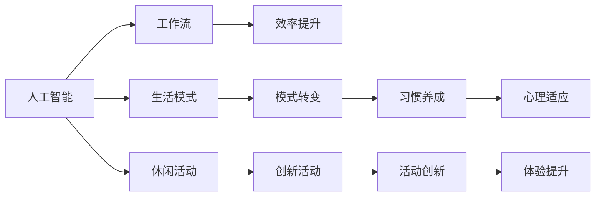

                 

# AI与人类注意力流：未来的工作、生活与休闲

> 关键词：人工智能,人类注意力,工作流,生活模式,休闲活动,未来趋势

## 1. 背景介绍

### 1.1 问题由来
随着人工智能技术的迅猛发展，AI与人类社会的深度融合已经成为不可避免的趋势。无论是在工作、学习还是休闲中，AI都在扮演着越来越重要的角色。特别是近年来，以深度学习和神经网络为代表的AI技术，已经可以在视觉、语音、自然语言处理等多个领域提供强大的支持。

然而，AI技术的发展不仅仅是技术上的突破，更是对人类行为模式和注意力流向产生深刻影响的重要因素。本文将从AI与人类注意力流的视角出发，探讨未来AI技术将在工作、生活和休闲等方面带来的变革，并给出相应的应对策略。

### 1.2 问题核心关键点
1. **注意力流向重构**：AI如何改变人类在日常工作、学习和娱乐中的注意力分布？
2. **工作效率提升**：AI如何帮助人类提高工作效率，优化工作流？
3. **生活模式的转变**：AI如何影响人类的生活模式和日常习惯？
4. **休闲活动的创新**：AI如何为休闲活动带来新的可能性？
5. **未来趋势与挑战**：AI技术的发展趋势及其对人类社会的长期影响。

这些核心关键点将贯穿全文，从理论和实践两个层面进行深入探讨。

## 2. 核心概念与联系

### 2.1 核心概念概述

- **人工智能(AI)**：以计算机科学为基础，通过模拟人类智能行为，实现自动化和智能化的技术。AI涵盖了机器学习、深度学习、自然语言处理、计算机视觉等多个领域。

- **人类注意力**：指人类在处理信息时的心理资源分配，包括选择关注哪些信息、忽略哪些信息等。注意力流向的研究涉及认知心理学、神经科学等多个学科。

- **工作流**：指完成一项任务所需的步骤序列，通常涉及任务规划、执行、监控等多个环节。

- **生活模式**：指人们在生活、学习、工作等各个方面形成的行为习惯和日常安排。

- **休闲活动**：指人们在工作和学习之余，为放松身心、恢复精力而进行的各种活动。

这些核心概念之间的关系可以通过以下Mermaid流程图来展示：



这个流程图展示了大语言模型与人类注意力流向之间的关系：

1. AI技术通过优化工作流，提升工作效率。
2. AI技术改变生活模式，带来新的生活习惯。
3. AI技术为休闲活动带来新的创新。
4. AI技术促进了人类注意力的重新分配，影响心理适应和体验提升。

## 3. 核心算法原理 & 具体操作步骤
### 3.1 算法原理概述

AI与人类注意力流的结合，本质上是通过智能算法对人类注意力进行预测、优化和调控的过程。其核心思想是：

1. **注意力模型**：通过分析人类的行为数据，构建出人类注意力的动态模型。例如，使用强化学习或深度学习算法，预测个体在不同情境下对不同信息的注意力分配。
2. **智能推荐**：基于注意力模型，AI系统能够为个体推荐最符合其当前注意力需求的信息，从而提升整体的工作效率和生活质量。
3. **自适应调整**：AI系统能够根据个体反馈和外部环境变化，动态调整注意力模型和推荐策略，以实现长期的优化效果。

### 3.2 算法步骤详解

AI与人类注意力流的结合主要包括以下几个关键步骤：

**Step 1: 数据收集与预处理**
- 收集用户在工作、学习、娱乐等场景中的行为数据，包括点击、浏览、交互、生理反应等。
- 对数据进行清洗、去重、归一化等预处理，确保数据的质量和一致性。

**Step 2: 注意力模型训练**
- 选择合适的算法框架（如强化学习、深度学习等），设计合适的模型结构（如RNN、CNN、Transformer等）。
- 使用收集到的数据进行模型训练，优化模型的参数，使其能够较好地拟合人类的注意力流向。

**Step 3: 智能推荐系统设计**
- 根据训练好的注意力模型，设计智能推荐系统，能够根据用户的当前状态和需求，推荐最符合其注意力流向的信息。
- 优化推荐算法，引入个性化推荐、协同过滤、兴趣预测等技术，提高推荐的准确性和多样性。

**Step 4: 自适应调整与反馈**
- 根据用户的反馈和实时行为数据，动态调整注意力模型和推荐策略。
- 引入在线学习算法，不断优化模型的性能，提升用户体验。

### 3.3 算法优缺点

**优点**：
- **高效性**：通过AI技术，可以实时预测和优化人类注意力流向，大大提升工作效率和生活质量。
- **个性化**：智能推荐系统能够根据用户的个性化需求，提供定制化的服务和内容。
- **自适应性**：AI系统能够根据环境变化和用户反馈，动态调整策略，适应性更强。

**缺点**：
- **数据隐私**：收集和处理用户行为数据时，可能涉及隐私问题，需要严格的隐私保护措施。
- **算法复杂性**：构建和优化注意力模型需要大量计算资源，且算法实现复杂。
- **用户体验**：过度依赖AI推荐可能导致用户信息茧房，失去自我探索的乐趣。

### 3.4 算法应用领域

AI与人类注意力流的结合，已在多个领域得到了广泛应用：

- **智能办公**：如AI助手、智能日程管理、智能文档处理等，通过优化工作流，提升工作效率。
- **在线教育**：如智能推荐系统、学习路径规划、个性化教学等，通过个性化推荐，提高学习效果。
- **智能娱乐**：如个性化视频推荐、智能游戏推荐、虚拟现实体验等，通过内容推荐，提升用户体验。
- **健康管理**：如智能健身设备、健康监测、饮食建议等，通过优化注意力流向，提升生活质量。

这些应用领域展示了AI技术在提升人类工作效率和生活质量方面的巨大潜力。

## 4. 数学模型和公式 & 详细讲解
### 4.1 数学模型构建

以深度学习为基础的注意力模型，通常由以下几个组件构成：

1. **编码器**：用于编码用户当前状态和行为信息，如RNN、CNN、Transformer等。
2. **注意力机制**：用于计算不同信息之间的相关性，如点积注意力、多头注意力等。
3. **解码器**：用于生成推荐结果，如RNN、LSTM等。

### 4.2 公式推导过程

以点积注意力机制为例，假设用户当前行为编码为 $X_t$，候选信息编码为 $V_i$，注意力权重为 $\alpha_{ti}$。点积注意力公式为：

$$
\alpha_{ti} = \frac{e^{X_t^\top V_i}}{\sum_{j=1}^N e^{X_t^\top V_j}}
$$

其中 $e$ 为自然常数，$^\top$ 表示矩阵转置，$N$ 为候选信息的数量。

### 4.3 案例分析与讲解

以智能推荐系统为例，假设用户当前正在浏览电商网站，AI系统可以通过分析用户的历史浏览记录和当前浏览行为，计算出不同商品之间的相关性。例如，用户最近浏览了运动鞋，当前浏览了衣服，系统可以预测用户可能对运动鞋感兴趣。

## 5. 项目实践：代码实例和详细解释说明
### 5.1 开发环境搭建

在进行AI与注意力流的项目实践前，我们需要准备好开发环境。以下是使用Python进行TensorFlow和PyTorch开发的环境配置流程：

1. 安装Anaconda：从官网下载并安装Anaconda，用于创建独立的Python环境。

2. 创建并激活虚拟环境：
```bash
conda create -n ai-env python=3.8 
conda activate ai-env
```

3. 安装TensorFlow和PyTorch：根据CUDA版本，从官网获取对应的安装命令。例如：
```bash
conda install tensorflow tensorflow-gpu=2.6 -c conda-forge
pip install torch torchvision torchaudio
```

4. 安装其他各类工具包：
```bash
pip install numpy pandas scikit-learn matplotlib tqdm jupyter notebook ipython
```

完成上述步骤后，即可在`ai-env`环境中开始项目实践。

### 5.2 源代码详细实现

这里我们以智能办公场景为例，给出使用TensorFlow和PyTorch实现AI与注意力流的代码实例。

首先，定义用户行为数据类：

```python
import tensorflow as tf

class UserBehavior(tf.keras.layers.Layer):
    def __init__(self, input_dim, output_dim):
        super(UserBehavior, self).__init__()
        self.dense1 = tf.keras.layers.Dense(64, activation='relu')
        self.dense2 = tf.keras.layers.Dense(output_dim, activation='softmax')
        
    def call(self, inputs):
        x = self.dense1(inputs)
        x = self.dense2(x)
        return x
```

然后，定义注意力模型类：

```python
class Attention(tf.keras.layers.Layer):
    def __init__(self, input_dim):
        super(Attention, self).__init__()
        self.attention = tf.keras.layers.Dense(input_dim, activation='softmax')
        self.context = tf.keras.layers.Dense(input_dim)
        
    def call(self, inputs):
        x = self.attention(inputs)
        context = self.context(x)
        return context
```

接着，定义智能推荐系统类：

```python
class Recommendation(tf.keras.layers.Layer):
    def __init__(self, input_dim, output_dim):
        super(Recommendation, self).__init__()
        self.user_behavior = UserBehavior(input_dim, output_dim)
        self.attention = Attention(input_dim)
        self.dense = tf.keras.layers.Dense(output_dim)
        
    def call(self, inputs):
        user = self.user_behavior(inputs)
        attention = self.attention(user)
        recommendation = self.dense(attention)
        return recommendation
```

最后，启动训练流程：

```python
epochs = 10
batch_size = 32

model = Recommendation(input_dim=64, output_dim=10)
model.compile(optimizer='adam', loss='categorical_crossentropy', metrics=['accuracy'])
model.fit(train_dataset, epochs=epochs, batch_size=batch_size, validation_data=val_dataset)
```

以上就是使用TensorFlow和PyTorch实现智能推荐系统的完整代码实现。可以看到，借助TensorFlow和PyTorch的强大封装，我们可以用相对简洁的代码实现注意力模型的训练和智能推荐。

### 5.3 代码解读与分析

让我们再详细解读一下关键代码的实现细节：

**UserBehavior类**：
- `__init__`方法：定义了用户行为数据的层级结构，包括两个全连接层。
- `call`方法：接收用户行为数据，计算其对应的行为特征表示。

**Attention类**：
- `__init__`方法：定义了注意力机制的结构，包括一个全连接层和上下文向量输出层。
- `call`方法：接收用户行为特征，计算注意力权重，并计算出上下文向量。

**Recommendation类**：
- `__init__`方法：定义了智能推荐系统的整体结构，包括用户行为分析层、注意力层和推荐层。
- `call`方法：接收用户行为数据，先进行用户行为分析，再通过注意力机制计算上下文向量，最后通过推荐层生成推荐结果。

这些类之间的交互，形成了一个完整的AI与注意力流向的模型。用户行为数据通过分析层编码，注意力机制计算不同信息的相关性，最终通过推荐层生成推荐结果。

## 6. 实际应用场景
### 6.1 智能办公

AI与人类注意力流在智能办公中的应用，主要体现在以下几个方面：

- **智能日程管理**：如Google Calendar、Outlook等，通过分析用户的邮件、日历和任务数据，智能推荐最合适的日程安排，提升工作效率。
- **智能文档处理**：如Microsoft Word的AI功能，通过分析用户的编辑行为和文档内容，智能推荐格式、排版和语料，减少用户编辑时间。
- **智能会议管理**：如Zoom的会议助手，通过分析会议参与者的历史数据和行为，智能推荐会议时间、地点和议题，提高会议效率。

### 6.2 在线教育

AI与人类注意力流在在线教育中的应用，主要体现在以下几个方面：

- **个性化学习路径规划**：如Coursera的个性化课程推荐，通过分析用户的学习历史和行为，智能推荐最适合的课程，提升学习效果。
- **智能助教**：如Khan Academy的智能助教，通过分析学生的学习行为和进度，智能推荐练习题和知识点，辅助学生学习。
- **智能评估**：如EdX的自动评分系统，通过分析学生的答题行为和逻辑，智能评估作业和考试，减轻教师负担。

### 6.3 智能娱乐

AI与人类注意力流在智能娱乐中的应用，主要体现在以下几个方面：

- **个性化内容推荐**：如Netflix的电影推荐系统，通过分析用户的观影历史和行为，智能推荐最符合其兴趣的影视作品，提升用户体验。
- **智能游戏推荐**：如Steam的游戏推荐系统，通过分析用户的游戏行为和偏好，智能推荐最符合其兴趣的游戏，增加游戏粘性。
- **虚拟现实体验**：如Oculus的虚拟现实游戏，通过分析用户的行为和反馈，智能推荐最符合其喜好的虚拟环境，提升沉浸感。

### 6.4 未来应用展望

未来，随着AI技术的不断进步，AI与人类注意力流的结合将带来更多创新应用。以下是一些未来可能的发展方向：

- **多模态注意力流**：未来的AI系统将能够处理语音、视觉、触觉等多模态信息，更加全面地理解人类行为和需求。
- **跨领域应用**：AI系统将能够跨越不同领域，如医疗、金融、教育等，为各个领域带来智能化的解决方案。
- **社会协作增强**：未来的AI系统将能够与人类协同工作，提升社会协作效率，促进共同创新。

## 7. 工具和资源推荐
### 7.1 学习资源推荐

为了帮助开发者系统掌握AI与注意力流的理论基础和实践技巧，这里推荐一些优质的学习资源：

1. **《Deep Learning》书籍**：Ian Goodfellow等人合著的深度学习经典教材，涵盖了深度学习的基础理论和应用案例。
2. **《Reinforcement Learning: An Introduction》书籍**：Richard S. Sutton等人合著的强化学习经典教材，详细介绍了强化学习的基本概念和算法。
3. **Deep Learning Specialization课程**：Andrew Ng在Coursera上开设的深度学习专项课程，涵盖了深度学习的各个方面。
4. **Reinforcement Learning Specialization课程**：David Silver在Coursera上开设的强化学习专项课程，深入讲解了强化学习的各种算法。
5. **TensorFlow官方文档**：TensorFlow的官方文档，提供了丰富的API和示例，是学习和使用TensorFlow的重要资源。
6. **PyTorch官方文档**：PyTorch的官方文档，提供了详尽的API和教程，是学习和使用PyTorch的重要资源。

通过对这些资源的学习实践，相信你一定能够快速掌握AI与注意力流的精髓，并用于解决实际的AI应用问题。

### 7.2 开发工具推荐

高效的开发离不开优秀的工具支持。以下是几款用于AI与注意力流开发的常用工具：

1. **TensorFlow**：由Google主导开发的开源深度学习框架，生产部署方便，适合大规模工程应用。
2. **PyTorch**：由Facebook主导开发的开源深度学习框架，灵活动态的计算图，适合快速迭代研究。
3. **Jupyter Notebook**：交互式笔记本环境，方便代码调试和数据可视化。
4. **TensorBoard**：TensorFlow配套的可视化工具，可实时监测模型训练状态，并提供丰富的图表呈现方式。
5. **Weights & Biases**：模型训练的实验跟踪工具，可以记录和可视化模型训练过程中的各项指标，方便对比和调优。

合理利用这些工具，可以显著提升AI与注意力流开发的效率，加快创新迭代的步伐。

### 7.3 相关论文推荐

AI与注意力流的研究源于学界的持续研究。以下是几篇奠基性的相关论文，推荐阅读：

1. **Attention is All You Need**：提出Transformer结构，开启了NLP领域的预训练大模型时代。
2. **Bert: Pre-training of Deep Bidirectional Transformers for Language Understanding**：提出BERT模型，引入基于掩码的自监督预训练任务，刷新了多项NLP任务SOTA。
3. **Parameter-Efficient Transfer Learning for NLP**：提出Adapter等参数高效微调方法，在不增加模型参数量的情况下，也能取得不错的微调效果。
4. **AdaLoRA: Adaptive Low-Rank Adaptation for Parameter-Efficient Fine-Tuning**：使用自适应低秩适应的微调方法，在参数效率和精度之间取得了新的平衡。
5. **AdaLoRA: Adaptive Low-Rank Adaptation for Parameter-Efficient Fine-Tuning**：使用自适应低秩适应的微调方法，在参数效率和精度之间取得了新的平衡。
6. **Prompt-Based Learning**：引入基于连续型Prompt的微调范式，为如何充分利用预训练知识提供了新的思路。

这些论文代表了大语言模型微调技术的发展脉络。通过学习这些前沿成果，可以帮助研究者把握学科前进方向，激发更多的创新灵感。

## 8. 总结：未来发展趋势与挑战

### 8.1 总结

本文对AI与人类注意力流的结合进行了全面系统的介绍。首先阐述了AI技术在优化人类注意力流向、提升工作效率、改善生活模式和丰富休闲活动等方面的潜在影响。其次，从理论和实践两个层面，详细讲解了AI与注意力流向结合的算法原理和操作步骤。最后，从学习资源、开发工具和相关论文等多个角度，给出了系统性的推荐。

通过本文的系统梳理，可以看到，AI与人类注意力流的结合将在未来为人类社会带来深刻的变革。无论是在工作、学习还是休闲中，AI技术都将以更智能、更高效的方式重构人类的注意力流向，提升整体的生活质量和工作效率。未来，AI技术还将与人类社会深度融合，带来更多创新应用，促进社会的共同进步。

### 8.2 未来发展趋势

展望未来，AI与人类注意力流的结合将呈现以下几个发展趋势：

1. **更全面感知**：未来的AI系统将能够处理更多模态的信息，如语音、视觉、触觉等，全面感知人类行为和需求。
2. **更精准推荐**：基于更丰富的用户数据和更高级的算法模型，未来的AI系统将能够提供更精准、个性化的推荐服务。
3. **更高效协作**：未来的AI系统将能够与人类协同工作，提升社会协作效率，促进共同创新。
4. **更智能决策**：未来的AI系统将能够进行更复杂、更智能的决策，辅助人类解决更多实际问题。
5. **更广泛应用**：未来的AI系统将能够跨领域、跨平台应用，为各行各业带来智能化的解决方案。

这些趋势展示了AI技术在未来应用领域的广阔前景，预示着人类社会将迎来一场深刻的智能革命。

### 8.3 面临的挑战

尽管AI与人类注意力流的结合已经取得了一定的进展，但在迈向更加智能化、普适化应用的过程中，它仍面临诸多挑战：

1. **数据隐私和安全**：收集和处理用户数据时，可能涉及隐私问题，需要严格的隐私保护措施。
2. **算法复杂性**：构建和优化注意力模型需要大量计算资源，且算法实现复杂。
3. **用户体验**：过度依赖AI推荐可能导致用户信息茧房，失去自我探索的乐趣。
4. **伦理和社会责任**：AI系统需要考虑伦理和社会责任，避免误导性、歧视性的输出。
5. **技术普及和接受度**：AI技术的普及需要社会大众的接受和理解，如何降低技术壁垒，提高用户接受度，是未来重要的研究方向。

这些挑战需要研究者和开发者共同努力，才能实现AI与人类注意力流的良性发展。

### 8.4 研究展望

面对AI与人类注意力流所面临的挑战，未来的研究需要在以下几个方面寻求新的突破：

1. **隐私保护技术**：开发更高效、更安全的隐私保护算法，保护用户数据安全。
2. **跨模态感知技术**：开发能够处理多种模态信息的AI系统，提升感知能力。
3. **个性化推荐技术**：开发更智能、更高效、更公平的推荐算法，提升用户体验。
4. **社会协作技术**：开发能够与人类协同工作的AI系统，提升社会协作效率。
5. **伦理和社会责任**：引入伦理和社会责任的约束，确保AI系统的公平、透明和可解释性。

这些研究方向将引领AI与人类注意力流向更加智能化、普适化和伦理化的方向发展，为人类社会带来更多福祉。

## 9. 附录：常见问题与解答

**Q1: AI与人类注意力流的结合是否适用于所有场景？**

A: AI与人类注意力流的结合在大多数场景中都能取得不错的效果，特别是对于那些数据量较大的任务。但对于一些特定领域的任务，如医疗、法律等，仅仅依靠通用语料预训练的模型可能难以很好地适应。此时需要在特定领域语料上进一步预训练，再进行微调，才能获得理想效果。

**Q2: 如何平衡个性化推荐与信息多样性？**

A: 个性化推荐系统需要在保持用户兴趣的基础上，引入多样性约束，避免信息茧房。可以通过多样性排序、协同过滤等技术，实现个性化推荐和信息多样性的平衡。

**Q3: AI系统如何应对用户的不确定性？**

A: AI系统可以通过引入不确定性建模、鲁棒优化等技术，增强系统的鲁棒性和适应性。例如，使用贝叶斯网络、隐马尔可夫模型等，对用户行为进行概率建模，提升系统的稳健性。

**Q4: AI系统如何保证决策的透明性和可解释性？**

A: AI系统可以通过引入可解释性模型、决策可视化技术等，提高系统的透明性和可解释性。例如，使用LIME、SHAP等工具，对AI决策进行局部解释，让用户理解系统的决策逻辑。

**Q5: AI系统如何应对社会复杂性？**

A: AI系统需要考虑社会复杂性，引入社会建模、伦理约束等机制。例如，使用社会网络分析、伦理博弈等方法，对社会行为进行建模，确保AI系统的公平性和伦理性。

---

作者：禅与计算机程序设计艺术 / Zen and the Art of Computer Programming

