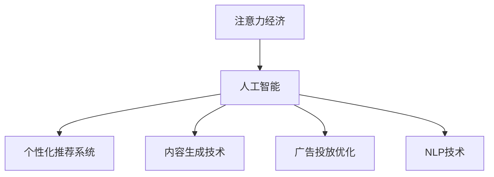

                 

# AI与人类注意力经济：未来的工作和收入

## 1. 背景介绍

随着人工智能技术的飞速发展，其在各个领域的渗透和应用已经初见成效，包括医疗、教育、金融、制造等行业。与此同时，人工智能也在重新定义人类经济活动的方式，特别是注意力经济（Economies of Attention）的格局。本篇文章将探讨AI技术如何影响人类注意力经济，以及未来工作和收入的前景。

### 1.1 问题由来
在数字经济时代，注意力作为一种宝贵的资源，已经被各大企业和平台所重视。传统的注意力经济主要围绕人类注意力资源的分配和利用展开，例如媒体广告、搜索引擎优化等。而随着人工智能的崛起，尤其是基于深度学习和自然语言处理（NLP）技术的快速发展，AI开始在信息处理、个性化推荐、内容生成等方面扮演越来越重要的角色，从而彻底改变了注意力资源的获取和分配方式。

### 1.2 问题核心关键点
AI与注意力经济的关系主要体现在以下几个方面：
1. **信息筛选与推荐**：AI能够通过分析和理解用户的行为和偏好，提供个性化的信息推荐，提高用户注意力资源的利用效率。
2. **内容生成与消费**：AI生成的内容不仅能节省创作时间，还能通过算法优化提升用户消费体验。
3. **自动化广告投放**：AI广告投放技术可以精准定位用户，提高广告投放的效率和效果，优化广告主和用户的交互方式。
4. **智能客服与数据分析**：AI客服系统和大数据分析可以更好地理解用户需求，提供更优质的服务。
5. **自动化决策与优化**：AI可以辅助决策制定，通过数据分析优化资源分配和运营策略。

这些AI技术的应用不仅提升了注意力资源的利用效率，也带来了新的工作机会和收入模式，从而改变了未来的工作方式和收入结构。

## 2. 核心概念与联系

### 2.1 核心概念概述

为了更好地理解AI如何重塑人类注意力经济，本篇文章将介绍几个关键概念：

- **注意力经济（Economies of Attention）**：指数字时代经济活动的核心是争夺用户的注意力资源。
- **人工智能（AI）**：基于算法和计算，能够模拟人类智能，通过学习数据和知识来执行各种任务的技术。
- **个性化推荐系统**：通过AI分析用户行为，提供个性化的信息和服务，提高用户满意度。
- **内容生成技术**：AI能够自动生成文本、图像、视频等内容，助力内容创作和消费。
- **广告投放优化**：通过AI技术精准定位用户，优化广告投放策略。
- **自然语言处理（NLP）**：AI处理自然语言的技术，包括文本理解、文本生成、语音识别等。

### 2.2 核心概念原理和架构的 Mermaid 流程图



以上图表展示了AI与注意力经济的核心联系。其中，A表示注意力经济，B表示人工智能，C至F分别代表由AI驱动的不同应用。这些应用不仅改变了信息资源的获取和分配方式，也对工作方式和收入结构产生了深远影响。

## 3. 核心算法原理 & 具体操作步骤

### 3.1 算法原理概述

AI与注意力经济的关系主要通过以下算法原理来体现：

1. **强化学习算法**：通过不断试错和反馈，优化AI模型的决策策略，使其更有效地吸引和利用注意力资源。
2. **推荐系统算法**：基于协同过滤、内容过滤、混合过滤等算法，推荐系统能够根据用户历史行为和偏好，提供个性化的内容。
3. **生成对抗网络（GANs）**：通过生成网络生成内容，对抗网络评估内容质量，不断优化生成算法，提升内容创作的效率和质量。
4. **自然语言处理算法**：如BERT、GPT等模型，能够理解和生成自然语言，通过文本分析来优化广告投放和内容推荐策略。

### 3.2 算法步骤详解

基于上述算法原理，AI与注意力经济的应用通常包括以下几个步骤：

**Step 1: 数据收集与预处理**：
- 收集用户行为数据、文本数据、图像数据等。
- 进行数据清洗、归一化、分词等预处理操作。

**Step 2: 模型训练与优化**：
- 选择适当的算法，如深度神经网络、强化学习算法、生成对抗网络等。
- 在训练集上训练模型，通过交叉验证等方法优化模型参数。
- 在验证集上评估模型性能，调整模型结构和超参数。

**Step 3: 模型部署与应用**：
- 将训练好的模型部署到生产环境。
- 与实际应用场景结合，如个性化推荐系统、广告投放平台、智能客服系统等。
- 持续监控模型性能，进行在线更新和优化。

### 3.3 算法优缺点

AI与注意力经济的应用具有以下优点：
1. **效率提升**：AI能够快速处理大量数据，提高信息筛选和推荐效率。
2. **精准定位**：通过深度学习等技术，AI能够精准识别用户需求，提供个性化服务。
3. **内容创新**：AI生成的内容不仅丰富多样，还提高了内容创作的效率和质量。
4. **成本节约**：AI自动化处理许多复杂任务，降低了人工成本。

同时，这些应用也存在一些缺点：
1. **隐私风险**：用户行为数据和隐私信息可能被滥用，带来隐私风险。
2. **技术依赖**：过度依赖AI技术，可能降低人工创造力和判断力。
3. **公平性问题**：算法偏见可能导致资源分配不公，加剧社会不平等。
4. **算法透明性不足**：黑箱算法难以解释其决策过程，可能缺乏透明度和可解释性。

### 3.4 算法应用领域

AI与注意力经济的应用广泛，以下是一些典型领域：

- **社交媒体**：如微博、抖音等社交平台，通过AI进行个性化推荐，提升用户粘性。
- **电商平台**：如亚马逊、淘宝等，通过AI推荐商品，提高销售转化率。
- **新闻和内容平台**：如今日头条、知乎等，通过AI分析用户兴趣，提供个性化内容。
- **广告和营销**：如Google AdWords、Facebook广告等，通过AI优化广告投放策略。
- **客服和智能助理**：如微软小冰、小米小爱等，通过AI提供智能客服和助理服务。
- **金融科技**：如智能投顾、量化交易等，通过AI进行风险评估和资产管理。

## 4. 数学模型和公式 & 详细讲解 & 举例说明

### 4.1 数学模型构建

基于上述算法原理，本篇文章将详细讲解一些核心模型的数学模型构建。

以个性化推荐系统为例，其基本数学模型如下：

**目标函数**：
$$
\max_{\theta} \sum_{i=1}^{n} \alpha_i \log p_i(x_i)
$$

其中，$n$ 是用户数量，$\alpha_i$ 是用户权重，$p_i(x_i)$ 是用户 $i$ 对商品 $x_i$ 的预测概率。

**损失函数**：
$$
\mathcal{L}(\theta) = -\frac{1}{N} \sum_{i=1}^{N} \sum_{j=1}^{m} y_{ij} \log p_{ij} + (1-y_{ij}) \log (1-p_{ij})
$$

其中，$N$ 是训练样本数量，$m$ 是物品数量，$y_{ij}$ 是物品 $j$ 是否被用户 $i$ 选择的标签。

**预测概率**：
$$
p_{ij} = \sigma(\langle \theta_j, x_i \rangle)
$$

其中，$\sigma(\cdot)$ 是激活函数，$\theta_j$ 是物品 $j$ 的特征向量，$\langle \cdot, \cdot \rangle$ 表示向量点积。

### 4.2 公式推导过程

以下对上述数学模型的公式推导过程进行详细讲解：

1. **目标函数推导**：
   - 目标函数的目标是最大化用户对商品的点击概率，即最大化用户满意度和点击转化率。
   - 用户 $i$ 对商品 $x_i$ 的点击概率 $p_i(x_i)$ 可以用预测概率函数表示。

2. **损失函数推导**：
   - 损失函数采用交叉熵损失函数，用于衡量预测概率与真实标签的差距。
   - 对于二分类问题，交叉熵损失函数可以表示为：
     - 点击标签 $y_{ij}=1$ 时，损失为 $\log p_{ij}$
     - 点击标签 $y_{ij}=0$ 时，损失为 $\log (1-p_{ij})$

3. **预测概率推导**：
   - 预测概率 $p_{ij}$ 可以通过线性模型和激活函数计算得到。
   - 线性模型 $\langle \theta_j, x_i \rangle$ 可以表示为：
     - 特征向量 $x_i$ 与物品 $j$ 的特征向量 $\theta_j$ 的点积。
   - 激活函数 $\sigma(\cdot)$ 可以是sigmoid函数、ReLU函数等。

### 4.3 案例分析与讲解

以广告投放为例，以下是对基本算法的案例分析与讲解：

1. **用户行为数据采集**：
   - 收集用户点击广告的历史记录、浏览网页的记录、购买记录等。
   - 对数据进行清洗和预处理，去除无效记录和噪声数据。

2. **模型训练**：
   - 构建深度神经网络模型，如卷积神经网络（CNN）或循环神经网络（RNN）。
   - 在训练集中训练模型，使用交叉验证等方法优化模型参数。
   - 在验证集中评估模型性能，调整模型结构和超参数。

3. **广告投放**：
   - 将训练好的模型部署到广告投放平台。
   - 根据用户行为数据，计算每个广告对用户的点击概率。
   - 根据点击概率进行广告投放，优化广告预算分配和投放策略。

## 5. 项目实践：代码实例和详细解释说明

### 5.1 开发环境搭建

在进行项目实践前，我们需要准备好开发环境。以下是使用Python进行TensorFlow开发的环境配置流程：

1. 安装Anaconda：从官网下载并安装Anaconda，用于创建独立的Python环境。

2. 创建并激活虚拟环境：
```bash
conda create -n tf-env python=3.8 
conda activate tf-env
```

3. 安装TensorFlow：根据CUDA版本，从官网获取对应的安装命令。例如：
```bash
conda install tensorflow -c tf -c conda-forge
```

4. 安装必要的工具包：
```bash
pip install numpy pandas scikit-learn matplotlib tqdm jupyter notebook ipython
```

完成上述步骤后，即可在`tf-env`环境中开始项目实践。

### 5.2 源代码详细实现

下面我们以个性化推荐系统为例，给出使用TensorFlow进行模型训练和测试的PyTorch代码实现。

首先，定义推荐系统的数据处理函数：

```python
import tensorflow as tf
import numpy as np
from sklearn.model_selection import train_test_split

class RecommendationSystem(tf.keras.Model):
    def __init__(self, num_users, num_items):
        super(RecommendationSystem, self).__init__()
        self.num_users = num_users
        self.num_items = num_items
        self.user_embeddings = tf.keras.layers.Embedding(num_users, 16)
        self.item_embeddings = tf.keras.layers.Embedding(num_items, 16)
        self.dot_product = tf.keras.layers.Dot(axes=(1, 1), normalize=True)
        self.activation = tf.keras.layers.Activation('softmax')

    def call(self, user_ids, item_ids):
        user_embeddings = self.user_embeddings(tf.cast(user_ids, tf.int32))
        item_embeddings = self.item_embeddings(tf.cast(item_ids, tf.int32))
        dot_product = self.dot_product([user_embeddings, item_embeddings])
        scores = self.activation(dot_product)
        return scores

# 构建数据集
num_users = 1000
num_items = 10000

user_behaviors = np.random.randint(0, num_items, size=(1000, 10))
item_labels = np.random.randint(0, 2, size=(1000, 10))

train_data, test_data = train_test_split(user_behaviors, test_size=0.2)
```

然后，定义模型和优化器：

```python
model = RecommendationSystem(num_users, num_items)
optimizer = tf.keras.optimizers.Adam(learning_rate=0.001)
```

接着，定义训练和评估函数：

```python
@tf.function
def train_step(user_ids, item_ids, labels):
    with tf.GradientTape() as tape:
        scores = model(user_ids, item_ids)
        loss = tf.keras.losses.sparse_categorical_crossentropy(labels, scores, from_logits=True)
    gradients = tape.gradient(loss, model.trainable_variables)
    optimizer.apply_gradients(zip(gradients, model.trainable_variables))

@tf.function
def evaluate(user_ids, item_ids, labels):
    scores = model(user_ids, item_ids)
    return tf.keras.metrics.sparse_categorical_accuracy(labels, scores)

# 训练模型
for epoch in range(10):
    for batch in tf.data.Dataset.from_tensor_slices((train_data, train_data[:, 1], train_data[:, 2])).batch(32):
        train_step(*batch)
    for batch in tf.data.Dataset.from_tensor_slices((test_data, test_data[:, 1], test_data[:, 2])).batch(32):
        loss = evaluate(*batch)
        print(f"Epoch {epoch+1}, Loss: {loss}")
```

最后，评估模型在测试集上的性能：

```python
for batch in tf.data.Dataset.from_tensor_slices((test_data, test_data[:, 1], test_data[:, 2])).batch(32):
    loss = evaluate(*batch)
    print(f"Test Loss: {loss}")
```

以上就是使用TensorFlow对个性化推荐系统进行模型训练和测试的完整代码实现。可以看到，TensorFlow提供的高效计算图机制，使得模型训练和推理变得简单高效。

### 5.3 代码解读与分析

让我们再详细解读一下关键代码的实现细节：

**RecommendationSystem类**：
- 定义了推荐系统的基本结构，包括用户嵌入层、物品嵌入层、点积层和激活函数层。
- 在`__init__`方法中初始化模型参数，并定义了推荐过程。
- `call`方法实现了推荐过程的具体计算，包括用户嵌入、物品嵌入、点积计算和激活函数应用。

**训练和评估函数**：
- `train_step`函数用于定义单个训练批次的前向传播和反向传播过程。
- `evaluate`函数用于在测试集上评估模型性能。
- `tf.function`装饰器用于加速模型计算，通过编译优化提升执行效率。
- `tf.GradientTape`用于记录梯度信息，`optimizer.apply_gradients`用于更新模型参数。

**数据集构建**：
- 使用`numpy`生成随机用户行为数据。
- 定义训练集和测试集，通过`train_test_split`方法进行划分。

完成上述步骤后，即可在`tf-env`环境中开始项目实践。

## 6. 实际应用场景

### 6.1 社交媒体

社交媒体平台如微博、抖音等，通过AI进行个性化推荐，提升用户粘性和活跃度。例如，抖音通过分析用户的观看历史、点赞行为和关注兴趣，向用户推荐更多符合其兴趣的视频内容。这种基于用户行为的推荐，不仅提高了用户满意度，也提升了平台的用户留存率和收益。

### 6.2 电商平台

电商平台如亚马逊、淘宝等，通过AI推荐系统向用户推荐商品，提高销售转化率。例如，亚马逊通过分析用户的浏览记录、购买历史和评价反馈，向用户推荐可能感兴趣的商品，提升用户的购物体验和满意度。

### 6.3 新闻和内容平台

新闻和内容平台如今日头条、知乎等，通过AI分析用户兴趣，提供个性化内容。例如，今日头条通过机器学习算法分析用户阅读习惯和喜好，向用户推荐相关的新闻和文章，提升用户的阅读体验和粘性。

### 6.4 广告和营销

广告和营销平台如Google AdWords、Facebook广告等，通过AI优化广告投放策略，提高广告效果和ROI。例如，Google AdWords通过分析用户搜索行为和点击记录，精准投放广告，提升广告的点击率和转化率。

### 6.5 智能客服

智能客服系统如微软小冰、小米小爱等，通过AI提供智能客服和助理服务。例如，小冰通过自然语言处理和深度学习算法，理解用户的问题并提供相关解答，提升客服效率和用户满意度。

## 7. 工具和资源推荐

### 7.1 学习资源推荐

为了帮助开发者系统掌握AI与注意力经济理论基础和实践技巧，这里推荐一些优质的学习资源：

1. 《深度学习》课程：斯坦福大学开设的深度学习课程，涵盖了深度学习的基础理论和应用案例。
2. 《机器学习实战》书籍：提供丰富的机器学习算法和实战案例，帮助读者理解AI的实际应用。
3. 《自然语言处理综论》书籍：介绍自然语言处理的基本概念和最新技术，涵盖NLP的各个方面。
4. 《推荐系统实践》书籍：介绍推荐系统的原理和实现方法，提供丰富的推荐系统案例。
5. TensorFlow官方文档：提供详细的TensorFlow使用方法和案例，适合深度学习开发者的学习参考。

通过对这些资源的学习实践，相信你一定能够快速掌握AI与注意力经济的核心内容，并用于解决实际的AI问题。

### 7.2 开发工具推荐

高效的开发离不开优秀的工具支持。以下是几款用于AI与注意力经济开发的常用工具：

1. TensorFlow：由Google主导开发的深度学习框架，支持分布式计算和高效优化，适合大规模模型训练和推理。
2. PyTorch：基于Python的开源深度学习框架，灵活动态的计算图，适合快速迭代研究。
3. Scikit-learn：基于Python的机器学习库，提供丰富的机器学习算法和工具，适合数据处理和模型训练。
4. Keras：基于TensorFlow的高级API，提供易用的API接口，适合快速原型设计和实验。
5. Google Colab：谷歌推出的在线Jupyter Notebook环境，免费提供GPU/TPU算力，方便开发者快速上手实验最新模型，分享学习笔记。

合理利用这些工具，可以显著提升AI与注意力经济开发的效率，加速创新迭代的步伐。

### 7.3 相关论文推荐

AI与注意力经济的研究源于学界的持续研究。以下是几篇奠基性的相关论文，推荐阅读：

1. Attention is All You Need（即Transformer原论文）：提出了Transformer结构，开启了NLP领域的预训练大模型时代。
2. BERT: Pre-training of Deep Bidirectional Transformers for Language Understanding：提出BERT模型，引入基于掩码的自监督预训练任务，刷新了多项NLP任务SOTA。
3. Attention-based Recommender Systems：介绍基于注意力机制的推荐系统，提出使用注意力机制提升推荐效果。
4. GANs for Real-Time Ad generation: An In-depth Study：研究使用生成对抗网络（GANs）进行实时广告生成，提高广告投放的效率和质量。
5. Ad Conversational Agents for Real-Time Marketing：研究使用对话式AI进行实时营销，提升广告互动率和用户参与度。

这些论文代表了大语言模型与注意力经济的发展脉络。通过学习这些前沿成果，可以帮助研究者把握学科前进方向，激发更多的创新灵感。

## 8. 总结：未来发展趋势与挑战

### 8.1 总结

本篇文章对AI与注意力经济进行了全面系统的介绍。首先阐述了AI技术如何影响注意力经济的格局，明确了个性化推荐、内容生成、广告投放等技术对注意力资源分配的影响。其次，从原理到实践，详细讲解了AI模型在推荐系统、广告投放、智能客服等应用中的具体实现方法，给出了详细代码实现。同时，本文还广泛探讨了AI在注意力经济中的应用场景，展示了AI技术在未来的发展前景。

通过本文的系统梳理，可以看到，AI与注意力经济的应用不仅改变了信息资源的获取和分配方式，也对工作方式和收入结构产生了深远影响。未来，伴随AI技术的持续发展，注意力经济的应用领域将更加广阔，对人类社会的影响也将更加深远。

### 8.2 未来发展趋势

展望未来，AI与注意力经济的应用将呈现以下几个发展趋势：

1. **个性化推荐系统优化**：未来的推荐系统将更加智能和精准，通过多模态数据融合、深度学习算法优化等手段，提升用户推荐体验。
2. **内容生成技术进步**：随着生成对抗网络等技术的发展，AI生成的内容将更加丰富和多样，提升内容创作和消费的效率。
3. **广告投放优化**：AI广告投放技术将更加精准和自动化，通过实时优化和动态调整，提升广告投放的ROI。
4. **智能客服和助理**：未来的智能客服和助理将更加智能化和人性化，通过自然语言处理和深度学习算法，提升用户体验和满意度。
5. **跨领域应用拓展**：AI与注意力经济的应用将从单一领域拓展到更多领域，如医疗、教育、金融等，提升各行各业的经济效益。
6. **伦理和隐私保护**：随着AI技术的发展，对伦理和隐私保护的重视也将增加，未来将更加注重AI应用的公平性和透明度。

以上趋势凸显了AI与注意力经济技术的广阔前景。这些方向的探索发展，必将进一步提升AI技术在各个领域的应用，为人类社会带来更多的便利和价值。

### 8.3 面临的挑战

尽管AI与注意力经济的应用取得了瞩目成就，但在迈向更加智能化、普适化应用的过程中，它仍面临着诸多挑战：

1. **数据隐私和安全**：用户行为数据和隐私信息可能被滥用，带来隐私风险。如何在保护用户隐私的同时，优化推荐效果和广告投放，是未来的重要挑战。
2. **算法偏见和公平性**：算法偏见可能导致资源分配不公，加剧社会不平等。如何消除算法偏见，确保推荐和广告的公平性，也是重要的研究方向。
3. **计算资源和效率**：AI模型的计算复杂度高，需要高性能计算资源。如何优化模型结构和算法，提高计算效率，降低计算成本，是未来的技术挑战。
4. **模型透明性和可解释性**：AI模型的复杂性增加了其黑箱性，难以解释其决策过程。如何增强模型透明性和可解释性，确保用户和监管机构的信任，是未来的重要课题。
5. **用户信任和接受度**：AI技术的应用需要用户信任和接受，如何提升用户体验和满意度，确保用户参与和互动，是未来需要解决的问题。

### 8.4 研究展望

面对AI与注意力经济面临的挑战，未来的研究需要在以下几个方面寻求新的突破：

1. **数据隐私保护技术**：研发更加高效的数据隐私保护技术，如差分隐私、联邦学习等，确保用户数据的安全性和隐私性。
2. **公平性优化算法**：开发公平性优化算法，消除算法偏见，确保推荐和广告的公平性，提升社会的整体福祉。
3. **高效计算框架**：研究高效计算框架，优化模型结构和算法，提升计算效率，降低计算成本。
4. **模型透明性和可解释性**：开发可解释性模型，增强模型的透明性和可解释性，确保用户和监管机构的信任。
5. **用户信任和接受度提升**：提升用户体验和满意度，确保用户参与和互动，增加AI技术的应用场景和接受度。

这些研究方向的探索，必将引领AI与注意力经济技术迈向更高的台阶，为构建智能、公平、透明、可控的AI系统铺平道路。面向未来，AI与注意力经济技术还需要与其他AI技术进行更深入的融合，如知识表示、因果推理、强化学习等，多路径协同发力，共同推动自然语言理解和智能交互系统的进步。只有勇于创新、敢于突破，才能不断拓展AI技术的应用范围，为人类社会带来更多的便利和价值。

## 9. 附录：常见问题与解答

**Q1：AI技术如何影响注意力经济？**

A: AI技术通过深度学习和自然语言处理等手段，优化个性化推荐系统、内容生成技术、广告投放优化等，从而改变注意力资源的分配方式。具体来说，AI能够分析用户行为数据，精准定位用户需求，提供个性化的信息和服务，提高用户满意度和互动率，从而优化注意力资源的利用效率。

**Q2：AI与注意力经济的应用面临哪些挑战？**

A: AI与注意力经济的应用面临多个挑战，包括数据隐私和安全、算法偏见和公平性、计算资源和效率、模型透明性和可解释性、用户信任和接受度等。解决这些挑战需要综合考虑技术、伦理和用户需求等多方面因素，确保AI技术的应用更加安全、公平和可信。

**Q3：AI与注意力经济的未来发展趋势是什么？**

A: AI与注意力经济的未来发展趋势包括个性化推荐系统的优化、内容生成技术的进步、广告投放的优化、智能客服和助理的发展、跨领域应用的拓展、伦理和隐私保护、计算资源和效率的提升、模型透明性和可解释性的增强、用户信任和接受度的提升等。这些趋势将推动AI技术在更多领域的应用，带来更大的社会和经济效益。

**Q4：如何在AI与注意力经济的应用中保护用户隐私？**

A: 在AI与注意力经济的应用中，保护用户隐私需要采用多种手段，如差分隐私、联邦学习、匿名化处理等。差分隐私可以在不泄露用户隐私的前提下，提供准确的推荐结果。联邦学习可以在不集中用户数据的情况下，进行分布式模型训练。匿名化处理可以将用户数据进行去标识化处理，保护用户隐私。

**Q5：如何确保AI与注意力经济应用的公平性？**

A: 确保AI与注意力经济应用的公平性需要考虑算法偏见和数据偏见的问题。通过数据预处理、公平性优化算法、模型监督等手段，可以消除算法偏见，确保推荐和广告的公平性。此外，需要定期监控和评估AI系统的公平性，及时进行调整和优化，确保系统的公正性。

---

作者：禅与计算机程序设计艺术 / Zen and the Art of Computer Programming

