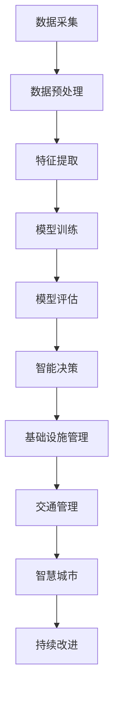

                 

# AI与人类计算：打造可持续发展的城市交通与基础设施建设与规划

在数字化时代，城市交通与基础设施建设与规划已经成为衡量一个国家或城市智能化和可持续发展水平的关键指标。随着人工智能（AI）技术的快速发展，AI与人类计算的融合为城市交通与基础设施的建设与规划提供了新的思路和方向。本文将探讨AI如何助力城市交通与基础设施建设与规划，打造可持续发展的未来城市。

## 1. 背景介绍

### 1.1 问题由来

随着城市化进程的加速和人类活动的频繁，城市交通拥堵、资源分配不合理等问题日益突出。传统的城市规划和管理方法面临巨大挑战，亟需引入新技术来提高城市交通的效率和基础设施的利用率，实现可持续发展。AI作为一门综合性技术，集成了大数据、机器学习、计算机视觉等众多领域的知识，能够从海量数据中挖掘出有价值的信息，为城市交通与基础设施建设与规划提供决策支持。

### 1.2 问题核心关键点

AI与人类计算的融合在城市交通与基础设施建设与规划中的应用，主要体现在以下几个关键点：

- **数据驱动决策**：利用AI技术对海量数据进行分析和挖掘，以数据驱动的方式辅助决策，提高决策的科学性和效率。
- **智能交通管理**：通过AI技术优化交通信号灯控制、车辆导航和路径规划，减少交通拥堵和事故发生。
- **基础设施自动化监测**：利用AI技术对基础设施进行智能监测和维护，确保其安全性和可靠性。
- **可持续发展的智慧城市**：将AI技术与城市管理、环境保护等目标相结合，实现城市的可持续发展。

## 2. 核心概念与联系

### 2.1 核心概念概述

在探讨AI与人类计算在城市交通与基础设施建设与规划中的应用时，需要了解以下几个核心概念：

- **人工智能（AI）**：指通过计算机模拟人类的智能行为，实现机器学习、数据挖掘、自然语言处理、计算机视觉等任务。
- **机器学习（ML）**：指利用算法让机器通过数据分析学习规律，并自主做出决策。
- **深度学习（DL）**：指使用神经网络模型进行复杂数据特征提取和模式识别。
- **计算机视觉（CV）**：指通过图像处理技术实现图像识别、目标检测和场景理解。
- **物联网（IoT）**：指通过互联网连接设备和传感器，实现物与物、物与人的智能交互。
- **可持续发展**：指在满足当代人需求的同时，不损害后代人满足需求的能力。

这些核心概念通过数据流、算法和应用场景的联系，形成了一个完整的AI与人类计算在城市交通与基础设施建设与规划中的应用框架。

### 2.2 核心概念原理和架构的 Mermaid 流程图



这个流程图展示了AI与人类计算在城市交通与基础设施建设与规划中的基本流程：

1. **数据采集**：通过传感器、摄像头、GPS等设备采集城市交通和基础设施的实时数据。
2. **数据预处理**：对采集到的数据进行清洗、去噪、归一化等处理，确保数据的质量和一致性。
3. **特征提取**：利用AI技术从处理后的数据中提取有用的特征，如交通流量、道路状况、环境污染等。
4. **模型训练**：构建机器学习或深度学习模型，并使用历史数据对其进行训练，以学习城市交通与基础设施的管理规律。
5. **模型评估**：使用测试数据集对训练好的模型进行评估，确保其性能和鲁棒性。
6. **智能决策**：基于评估后的模型，对城市交通与基础设施进行智能管理，优化决策。
7. **基础设施管理**：对道路、桥梁、隧道等基础设施进行智能监测和维护，确保其安全性和可靠性。
8. **交通管理**：通过智能决策系统优化交通信号灯、导航和路径规划，缓解交通拥堵。
9. **智慧城市**：将AI技术与城市管理、环境保护等目标相结合，实现城市的可持续发展。
10. **持续改进**：根据实时数据和用户反馈，不断优化模型和决策系统，实现持续改进。

## 3. 核心算法原理 & 具体操作步骤

### 3.1 算法原理概述

AI与人类计算在城市交通与基础设施建设与规划中的应用，主要基于机器学习和深度学习算法，利用大量数据进行模型训练，从而实现智能决策和优化管理。其核心算法原理包括以下几个方面：

1. **监督学习**：使用已标注的训练数据集，训练模型以预测未来事件。如交通流量预测、基础设施故障预测等。
2. **非监督学习**：使用未标注的数据集，发现数据的内在结构和模式。如城市区域划分、交通模式识别等。
3. **强化学习**：通过与环境交互，优化决策策略，以实现最优的交通管理和基础设施维护。
4. **深度强化学习**：将深度学习与强化学习结合，在更大规模和更复杂的问题中实现智能决策。

### 3.2 算法步骤详解

AI与人类计算在城市交通与基础设施建设与规划中的具体操作步骤如下：

**Step 1: 数据采集与预处理**

1. **数据采集**：通过各种传感器、摄像头、GPS等设备采集城市交通和基础设施的实时数据，如交通流量、道路状况、环境污染等。
2. **数据预处理**：对采集到的数据进行清洗、去噪、归一化等处理，确保数据的质量和一致性。

**Step 2: 特征提取**

1. **特征选择**：根据城市交通与基础设施的特点，选择相关的特征，如交通流量、道路拥堵程度、环境污染指数等。
2. **特征工程**：利用AI技术从处理后的数据中提取有用的特征，如交通流量、道路状况、环境污染等。

**Step 3: 模型训练**

1. **模型选择**：根据具体问题的特点选择合适的模型，如线性回归、决策树、随机森林、卷积神经网络（CNN）、循环神经网络（RNN）、长短期记忆网络（LSTM）等。
2. **模型训练**：使用历史数据对模型进行训练，并使用交叉验证等技术进行模型评估，确保其性能和鲁棒性。

**Step 4: 智能决策与优化**

1. **智能决策**：基于训练好的模型，对城市交通与基础设施进行智能管理，优化决策。如交通信号灯控制、车辆导航和路径规划等。
2. **基础设施管理**：利用AI技术对基础设施进行智能监测和维护，确保其安全性和可靠性。

**Step 5: 持续改进**

1. **实时数据采集**：实时采集城市交通和基础设施的数据，更新训练集，以保持模型的准确性和时效性。
2. **模型优化**：根据实时数据和用户反馈，不断优化模型和决策系统，实现持续改进。

### 3.3 算法优缺点

AI与人类计算在城市交通与基础设施建设与规划中的算法优缺点如下：

**优点**：

1. **数据驱动决策**：利用AI技术对海量数据进行分析和挖掘，以数据驱动的方式辅助决策，提高决策的科学性和效率。
2. **智能交通管理**：通过AI技术优化交通信号灯控制、车辆导航和路径规划，减少交通拥堵和事故发生。
3. **基础设施自动化监测**：利用AI技术对基础设施进行智能监测和维护，确保其安全性和可靠性。
4. **可持续发展的智慧城市**：将AI技术与城市管理、环境保护等目标相结合，实现城市的可持续发展。

**缺点**：

1. **数据质量问题**：数据采集和预处理过程中可能存在误差，影响模型性能。
2. **模型复杂度**：深度学习和强化学习等算法模型复杂度较高，需要大量的计算资源和训练时间。
3. **隐私和安全问题**：数据采集和处理过程中可能涉及用户隐私和安全问题，需要严格的数据管理和保护措施。
4. **模型解释性**：AI模型通常缺乏可解释性，难以理解其内部决策过程，影响模型的可信度和接受度。

### 3.4 算法应用领域

AI与人类计算在城市交通与基础设施建设与规划中的应用，主要包括以下几个领域：

- **交通流量预测与优化**：通过AI技术预测交通流量，优化交通信号灯控制和路径规划，减少交通拥堵。
- **基础设施故障预测与维护**：利用AI技术对道路、桥梁、隧道等基础设施进行智能监测和故障预测，及时进行维护和修复。
- **智慧城市管理**：将AI技术与城市管理、环境保护等目标相结合，实现城市的可持续发展。
- **交通违法行为监测与执法**：利用AI技术对交通违法行为进行智能监测和识别，提高执法效率和公正性。
- **公共安全与应急管理**：通过AI技术对公共安全事件进行预测和分析，提升应急管理能力。

## 4. 数学模型和公式 & 详细讲解

### 4.1 数学模型构建

AI与人类计算在城市交通与基础设施建设与规划中的应用，主要基于机器学习和深度学习算法，利用大量数据进行模型训练，从而实现智能决策和优化管理。以下是几个常见的数学模型：

**线性回归模型**：

$$
y = \theta_0 + \sum_{i=1}^n \theta_i x_i
$$

其中，$y$ 表示目标变量，$x_i$ 表示特征变量，$\theta_i$ 表示模型参数。

**决策树模型**：

$$
\text{Decision Tree} = \{ (S_i, H_i, f_i) \mid i=1,...,M \}
$$

其中，$S_i$ 表示决策节点，$H_i$ 表示子集，$f_i$ 表示函数。

**卷积神经网络（CNN）**：

$$
y = f(x) = g(W \star x + b)
$$

其中，$x$ 表示输入数据，$W$ 表示卷积核，$b$ 表示偏置项，$g$ 表示激活函数。

**循环神经网络（RNN）**：

$$
y = f(x) = g(W \star x + b) + h(f(W_{rec} \star x_{rec} + b_{rec}))
$$

其中，$x$ 表示输入数据，$W$ 表示权重，$b$ 表示偏置项，$g$ 表示激活函数，$W_{rec}$ 表示递归权重，$x_{rec}$ 表示递归输入，$b_{rec}$ 表示递归偏置项，$h$ 表示隐藏层函数。

**长短期记忆网络（LSTM）**：

$$
y = f(x) = g(W \star x + b) + h(f(W_{rec} \star x_{rec} + b_{rec}))
$$

其中，$x$ 表示输入数据，$W$ 表示权重，$b$ 表示偏置项，$g$ 表示激活函数，$W_{rec}$ 表示递归权重，$x_{rec}$ 表示递归输入，$b_{rec}$ 表示递归偏置项，$h$ 表示隐藏层函数。

### 4.2 公式推导过程

以下是线性回归模型的公式推导过程：

设训练数据集为 $\{(x_i, y_i)\}_{i=1}^n$，其中 $x_i$ 为特征向量，$y_i$ 为目标变量。模型的目标是最小化预测误差 $E(y, \hat{y})$，其中 $\hat{y} = \theta_0 + \sum_{i=1}^n \theta_i x_i$ 为模型预测值。

使用均方误差（MSE）作为损失函数，目标函数为：

$$
E(y, \hat{y}) = \frac{1}{2N} \sum_{i=1}^N (y_i - \hat{y}_i)^2
$$

通过梯度下降算法对模型参数 $\theta_i$ 进行优化：

$$
\frac{\partial E(y, \hat{y})}{\partial \theta_i} = -\frac{1}{N} \sum_{i=1}^N (y_i - \hat{y}_i) x_i
$$

更新模型参数的公式为：

$$
\theta_i = \theta_i - \alpha \frac{\partial E(y, \hat{y})}{\partial \theta_i}
$$

其中 $\alpha$ 为学习率。

### 4.3 案例分析与讲解

**交通流量预测**：

1. **数据采集**：通过传感器、摄像头、GPS等设备采集城市交通的实时数据，如交通流量、车速、道路状况等。
2. **数据预处理**：对采集到的数据进行清洗、去噪、归一化等处理，确保数据的质量和一致性。
3. **特征提取**：选择交通流量、车速、道路状况等相关的特征，构建特征向量。
4. **模型训练**：使用历史交通数据对线性回归模型进行训练，并使用交叉验证等技术进行模型评估，确保其性能和鲁棒性。
5. **智能决策**：基于训练好的模型，对城市交通流量进行预测，优化交通信号灯控制和路径规划，减少交通拥堵。

**基础设施故障预测**：

1. **数据采集**：通过传感器、摄像头、GPS等设备采集基础设施的实时数据，如道路、桥梁、隧道等的状态。
2. **数据预处理**：对采集到的数据进行清洗、去噪、归一化等处理，确保数据的质量和一致性。
3. **特征提取**：选择道路状况、桥梁载荷、隧道湿度等相关的特征，构建特征向量。
4. **模型训练**：使用历史基础设施数据对决策树模型进行训练，并使用交叉验证等技术进行模型评估，确保其性能和鲁棒性。
5. **智能决策**：基于训练好的模型，对基础设施故障进行预测，及时进行维护和修复，确保其安全性和可靠性。

## 5. 项目实践：代码实例和详细解释说明

### 5.1 开发环境搭建

在进行AI与人类计算在城市交通与基础设施建设与规划中的项目实践时，需要准备好开发环境。以下是使用Python进行TensorFlow开发的环境配置流程：

1. 安装Anaconda：从官网下载并安装Anaconda，用于创建独立的Python环境。

2. 创建并激活虚拟环境：
```bash
conda create -n ai-env python=3.8 
conda activate ai-env
```

3. 安装TensorFlow：根据CUDA版本，从官网获取对应的安装命令。例如：
```bash
conda install tensorflow -c conda-forge
```

4. 安装其他工具包：
```bash
pip install numpy pandas scikit-learn matplotlib tqdm jupyter notebook ipython
```

完成上述步骤后，即可在`ai-env`环境中开始项目实践。

### 5.2 源代码详细实现

下面我们以交通流量预测为例，给出使用TensorFlow对线性回归模型进行训练的Python代码实现。

首先，定义数据集：

```python
import tensorflow as tf
from sklearn.model_selection import train_test_split
import numpy as np
import pandas as pd

# 读取数据集
data = pd.read_csv('traffic_data.csv')

# 分割数据集
X = data.drop('traffic_flow', axis=1)
y = data['traffic_flow']

# 数据预处理
X_train, X_test, y_train, y_test = train_test_split(X, y, test_size=0.2, random_state=42)

# 构建数据集
train_dataset = tf.data.Dataset.from_tensor_slices((X_train.values, y_train.values))
test_dataset = tf.data.Dataset.from_tensor_slices((X_test.values, y_test.values))

# 构建模型
model = tf.keras.Sequential([
    tf.keras.layers.Dense(64, activation='relu', input_shape=(X_train.shape[1],)),
    tf.keras.layers.Dense(1)
])

# 编译模型
model.compile(optimizer=tf.keras.optimizers.Adam(learning_rate=0.001),
              loss=tf.keras.losses.MeanSquaredError(),
              metrics=[tf.keras.metrics.MeanAbsoluteError()])
```

然后，定义训练和评估函数：

```python
# 训练函数
def train_model(model, dataset, epochs=10):
    model.fit(dataset, epochs=epochs, validation_data=test_dataset)

# 评估函数
def evaluate_model(model, dataset):
    mse = model.evaluate(dataset)
    mae = tf.keras.metrics.mean_absolute_error(dataset, model.predict(dataset)).numpy()
    return mse, mae
```

最后，启动训练流程并在测试集上评估：

```python
# 训练模型
train_model(model, train_dataset, epochs=100)

# 评估模型
mse, mae = evaluate_model(model, test_dataset)
print(f'Mean Squared Error: {mse:.3f}')
print(f'Mean Absolute Error: {mae:.3f}')
```

以上就是使用TensorFlow对线性回归模型进行交通流量预测的完整代码实现。可以看到，得益于TensorFlow的强大封装，我们可以用相对简洁的代码完成模型的构建和训练。

### 5.3 代码解读与分析

让我们再详细解读一下关键代码的实现细节：

**数据集定义**：
- `data`：读取交通数据集，使用pandas库。
- `X` 和 `y`：将数据集分割为特征集和目标集。
- `X_train`、`X_test`、`y_train`、`y_test`：使用`train_test_split`对数据集进行分割，确保训练集和测试集的质量。

**模型构建**：
- `model`：使用`Sequential`模型定义多层感知器（MLP）。
- `Dense`层：第一层64个神经元，激活函数为`relu`；第二层1个神经元，无激活函数。

**模型编译**：
- `compile`方法：指定优化器、损失函数和评估指标。

**训练和评估函数**：
- `train_model`：使用`fit`方法对模型进行训练，设置训练轮数。
- `evaluate_model`：使用`evaluate`方法对模型进行评估，计算均方误差和平均绝对误差。

**训练流程**：
- `train_model`：调用训练函数进行模型训练，输出训练结果。
- `evaluate_model`：调用评估函数进行模型评估，输出评估结果。

可以看出，TensorFlow结合pandas等工具，使得交通流量预测的代码实现变得简洁高效。开发者可以将更多精力放在数据处理、模型改进等高层逻辑上，而不必过多关注底层的实现细节。

当然，工业级的系统实现还需考虑更多因素，如模型的保存和部署、超参数的自动搜索、更灵活的任务适配层等。但核心的模型训练和评估流程基本与此类似。

## 6. 实际应用场景

### 6.1 智能交通管理

基于AI与人类计算的智能交通管理，能够有效缓解城市交通拥堵，提升交通效率。智能交通管理主要包括：

1. **交通流量预测**：通过AI技术对交通流量进行预测，优化交通信号灯控制和路径规划，减少交通拥堵。
2. **车辆导航**：利用AI技术对车辆进行智能导航，推荐最优路线，避免拥堵。
3. **事故预警**：利用AI技术对交通异常进行监测和预警，及时进行应急处理。

### 6.2 基础设施自动化监测

基础设施自动化监测能够实现对道路、桥梁、隧道等基础设施的实时监测和维护，确保其安全性和可靠性。基础设施自动化监测主要包括：

1. **道路状况监测**：通过AI技术对道路状况进行监测，如路面平整度、裂缝、坑洼等，及时进行维护。
2. **桥梁载荷监测**：通过AI技术对桥梁载荷进行监测，如振动、应力等，防止结构失效。
3. **隧道湿度监测**：通过AI技术对隧道湿度进行监测，防止水害和火灾等安全事故。

### 6.3 智慧城市管理

智慧城市管理通过AI技术与城市管理、环境保护等目标相结合，实现城市的可持续发展。智慧城市管理主要包括：

1. **公共安全管理**：利用AI技术对公共安全事件进行监测和分析，提升应急管理能力。
2. **环境保护**：通过AI技术对环境污染进行监测和分析，如空气质量、水质等，实现环保目标。
3. **能源管理**：利用AI技术对城市能源进行优化管理，如智能电网、能源调度等。

### 6.4 未来应用展望

未来，AI与人类计算在城市交通与基础设施建设与规划中的应用将更加广泛和深入，主要趋势包括：

1. **多模态数据的融合**：将图像、视频、语音等多模态数据与文本数据相结合，提升模型的感知和决策能力。
2. **跨领域知识的应用**：将跨领域的知识与AI模型结合，如医疗、法律等领域的知识，提升模型的泛化能力和应用范围。
3. **持续学习的优化**：利用持续学习技术，使AI模型能够不断从新数据中学习，保持模型的时效性和适应性。
4. **联邦学习的应用**：利用联邦学习技术，使AI模型能够在分布式环境中进行协同学习，提升模型的鲁棒性和安全性。
5. **隐私保护与伦理安全**：在AI模型的设计和应用过程中，加强隐私保护和伦理安全，确保数据和模型的安全和合法使用。

## 7. 工具和资源推荐

### 7.1 学习资源推荐

为了帮助开发者系统掌握AI与人类计算在城市交通与基础设施建设与规划中的应用，这里推荐一些优质的学习资源：

1. 《TensorFlow实战》系列博文：由TensorFlow官方团队撰写，介绍了TensorFlow的基本用法和实例，适合初学者学习。
2. 《深度学习》课程：由斯坦福大学开设的深度学习课程，提供了丰富的视频和作业，适合深度学习入门。
3. 《Python机器学习》书籍：由机器学习专家撰写，介绍了Python在机器学习中的应用，适合有一定编程基础的读者。
4. 《智能交通系统》书籍：介绍了智能交通系统的基本概念和应用，适合交通工程和人工智能领域的读者。
5. 《物联网》书籍：介绍了物联网的基本概念和应用，适合计算机和通信领域的读者。

通过对这些资源的学习实践，相信你一定能够快速掌握AI与人类计算在城市交通与基础设施建设与规划中的应用，并用于解决实际的工程问题。

### 7.2 开发工具推荐

高效的开发离不开优秀的工具支持。以下是几款用于AI与人类计算在城市交通与基础设施建设与规划中开发的常用工具：

1. TensorFlow：由Google主导开发的深度学习框架，生产部署方便，适合大规模工程应用。
2. PyTorch：由Facebook主导开发的深度学习框架，灵活动态的计算图，适合快速迭代研究。
3. TensorBoard：TensorFlow配套的可视化工具，可实时监测模型训练状态，并提供丰富的图表呈现方式。
4. Weights & Biases：模型训练的实验跟踪工具，可以记录和可视化模型训练过程中的各项指标。
5. Jupyter Notebook：基于IPython的交互式笔记本，适合数据处理和模型训练。

合理利用这些工具，可以显著提升AI与人类计算在城市交通与基础设施建设与规划中的开发效率，加快创新迭代的步伐。

### 7.3 相关论文推荐

AI与人类计算在城市交通与基础设施建设与规划中的应用，是当前热门的研究方向，以下是几篇奠基性的相关论文，推荐阅读：

1. 《城市交通的AI驱动优化》：研究了AI技术在交通流量预测、车辆导航和事故预警中的应用，展示了AI优化交通管理的潜力。
2. 《基础设施自动化监测与维护》：介绍了AI技术在道路状况监测、桥梁载荷监测和隧道湿度监测中的应用，展示了AI提升基础设施管理的效果。
3. 《智慧城市管理》：研究了AI技术在公共安全管理、环境保护和能源管理中的应用，展示了AI推动城市可持续发展的可能性。
4. 《多模态数据的融合与智能决策》：研究了图像、视频、语音等多模态数据与文本数据相结合的方法，展示了多模态数据的融合对提升智能决策能力的重要性。
5. 《联邦学习在分布式环境中的应用》：研究了联邦学习技术在AI模型中的作用，展示了联邦学习在分布式环境中进行协同学习的效果。

这些论文代表了AI与人类计算在城市交通与基础设施建设与规划中的研究方向，通过学习这些前沿成果，可以帮助研究者把握学科前进方向，激发更多的创新灵感。

## 8. 总结：未来发展趋势与挑战

### 8.1 研究成果总结

AI与人类计算在城市交通与基础设施建设与规划中的应用，已经取得了显著的成果，主要体现在以下几个方面：

1. **智能交通管理**：通过AI技术优化交通信号灯控制和路径规划，有效缓解了城市交通拥堵，提升了交通效率。
2. **基础设施自动化监测**：利用AI技术对道路、桥梁、隧道等基础设施进行智能监测和维护，确保其安全性和可靠性。
3. **智慧城市管理**：将AI技术与城市管理、环境保护等目标相结合，实现了城市的可持续发展。

### 8.2 未来发展趋势

未来，AI与人类计算在城市交通与基础设施建设与规划中的应用将更加广泛和深入，主要趋势包括：

1. **多模态数据的融合**：将图像、视频、语音等多模态数据与文本数据相结合，提升模型的感知和决策能力。
2. **跨领域知识的应用**：将跨领域的知识与AI模型结合，如医疗、法律等领域的知识，提升模型的泛化能力和应用范围。
3. **持续学习的优化**：利用持续学习技术，使AI模型能够不断从新数据中学习，保持模型的时效性和适应性。
4. **联邦学习的应用**：利用联邦学习技术，使AI模型能够在分布式环境中进行协同学习，提升模型的鲁棒性和安全性。
5. **隐私保护与伦理安全**：在AI模型的设计和应用过程中，加强隐私保护和伦理安全，确保数据和模型的安全和合法使用。

### 8.3 面临的挑战

尽管AI与人类计算在城市交通与基础设施建设与规划中的应用已经取得了显著的成果，但仍面临以下挑战：

1. **数据质量问题**：数据采集和预处理过程中可能存在误差，影响模型性能。
2. **模型复杂度**：深度学习和强化学习等算法模型复杂度较高，需要大量的计算资源和训练时间。
3. **隐私和安全问题**：数据采集和处理过程中可能涉及用户隐私和安全问题，需要严格的数据管理和保护措施。
4. **模型解释性**：AI模型通常缺乏可解释性，难以理解其内部决策过程，影响模型的可信度和接受度。

### 8.4 研究展望

面向未来，AI与人类计算在城市交通与基础设施建设与规划中的研究需要在以下几个方面寻求新的突破：

1. **无监督和半监督学习**：摆脱对大规模标注数据的依赖，利用自监督学习、主动学习等无监督和半监督范式，最大限度利用非结构化数据。
2. **参数高效和计算高效**：开发更加参数高效的微调方法，在固定大部分预训练参数的同时，只更新极少量的任务相关参数，同时优化模型的计算图，减少资源消耗。
3. **因果分析和博弈论**：将因果分析和博弈论思想引入AI模型，增强模型的决策能力和鲁棒性。
4. **多模态融合与跨领域知识整合**：将多模态数据与跨领域知识相结合，提升模型的感知和决策能力。
5. **联邦学习与分布式优化**：利用联邦学习技术，使AI模型能够在分布式环境中进行协同学习，提升模型的鲁棒性和安全性。
6. **隐私保护与伦理安全**：在AI模型的设计和应用过程中，加强隐私保护和伦理安全，确保数据和模型的安全和合法使用。

这些研究方向的探索，必将引领AI与人类计算在城市交通与基础设施建设与规划中迈向更高的台阶，为构建可持续发展的未来城市提供技术支持。

