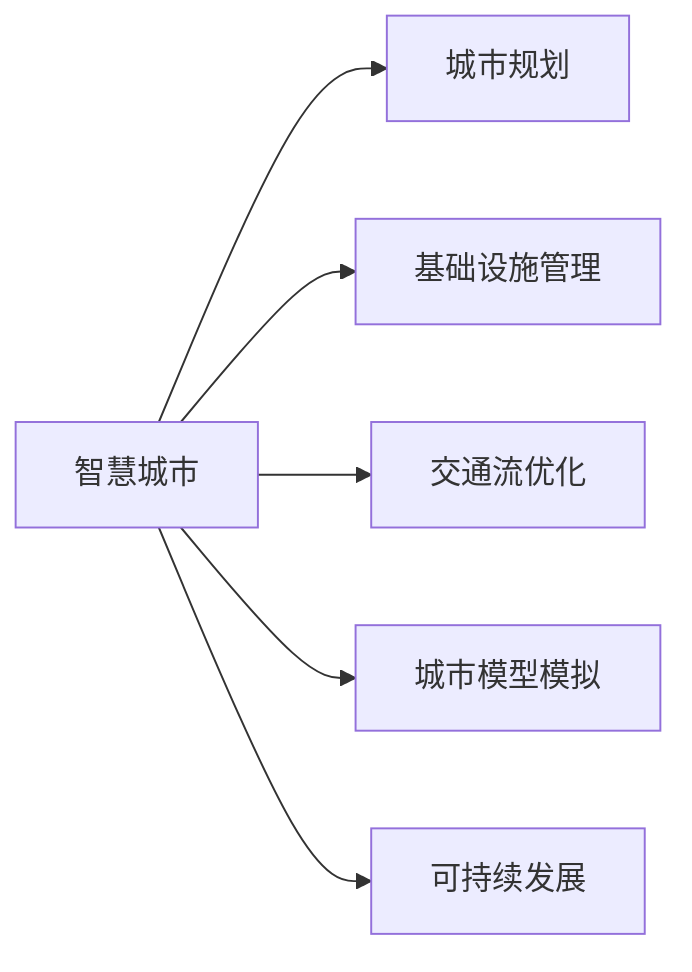
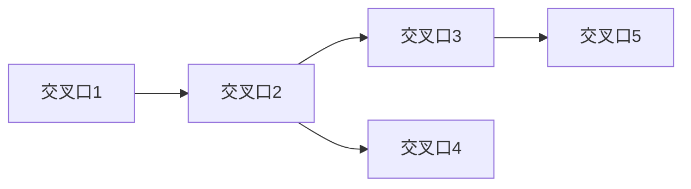

                 

# AI与人类计算：打造可持续发展的城市交通与基础设施规划与管理

> 关键词：智慧城市,城市规划,基础设施管理,交通流优化,城市模型模拟,可持续发展

## 1. 背景介绍

随着全球人口持续增长和城市化进程加速，城市交通与基础设施规划与管理成为各国政府关注的焦点。传统城市规划管理依赖人工经验，耗时长、效率低，且难以应对复杂的交通和环境问题。而人工智能与人类计算的结合，为城市交通与基础设施管理带来了新的解决方案，使城市规划更加智能化、可持续化。

### 1.1 问题由来

随着城市人口和机动车数量激增，全球城市交通拥堵、污染、能耗问题日益严重。传统城市规划和管理手段往往难以解决这些复杂问题，且随着城市规模和复杂度的提升，规划难度也在不断增加。利用人工智能和大数据技术，可以对城市交通和基础设施运行情况进行实时监测、模拟和预测，提升城市规划的科学性和效率。

## 2. 核心概念与联系

### 2.1 核心概念概述

为更好地理解AI在城市交通与基础设施管理中的应用，本文将介绍几个关键概念：

- 智慧城市(Smart City)：融合了物联网、大数据、云计算、人工智能等技术的现代城市管理模式，能够实时监控、智能分析和优化城市运行。
- 城市规划(Urban Planning)：通过科学规划，合理布局城市功能区域，提升城市运行效率和居住质量。
- 基础设施管理(Facility Management)：对城市的能源、水、交通、环境等设施进行智能监控、调度和维护，保障城市功能稳定运行。
- 交通流优化(Traffic Flow Optimization)：通过智能算法优化交通流，减少拥堵和污染，提升道路通行效率。
- 城市模型模拟(Simulations in Urban Models)：利用数学模型和仿真技术，对城市功能和交通运行进行模拟预测，辅助规划决策。
- 可持续发展(Sustainable Development)：在城市规划与运营中，注重环保、节能和资源循环利用，实现经济、社会和环境的和谐共生。

这些核心概念之间的关系如下图所示：



### 2.2 核心概念联系

智慧城市是融合现代科技与人类智慧的城市管理模式，其中城市规划、基础设施管理、交通流优化、城市模型模拟和可持续发展各司其职，共同构建城市的智能化和可持续化运行框架。AI与人类计算相结合，通过大数据分析和智能算法，优化城市各个环节，实现高效、环保和安全的可持续发展。

## 3. 核心算法原理 & 具体操作步骤
### 3.1 算法原理概述

基于AI与人类计算的城市交通与基础设施管理，主要通过以下几个核心算法实现：

- **数据采集与处理**：利用物联网设备和传感器，采集城市交通流量、车辆位置、环境质量等实时数据，并进行预处理和清洗。
- **城市模型构建**：建立城市交通和基础设施的数学模型，利用仿真技术模拟城市运行，辅助规划决策。
- **交通流优化算法**：通过智能算法优化交通流，减少拥堵和污染，提升道路通行效率。
- **预测与控制算法**：利用机器学习算法，对城市运行数据进行预测分析，并据此生成控制策略。
- **人机协作算法**：结合人类智慧和AI智能，进行动态调整和优化，提升城市管理效率。

### 3.2 算法步骤详解

1. **数据采集与处理**：
   - 利用物联网设备和传感器，采集城市交通流量、车辆位置、环境质量等实时数据。
   - 对数据进行预处理和清洗，去除噪音和异常值，确保数据质量。

2. **城市模型构建**：
   - 建立城市交通和基础设施的数学模型，如车辆-道路系统、公共交通系统等。
   - 利用仿真技术对模型进行模拟，预测城市运行情况，辅助规划决策。

3. **交通流优化算法**：
   - 采用智能算法优化交通流，如基于遗传算法、蚁群算法、粒子群算法等优化交通信号灯控制、道路通行策略等。
   - 通过仿真实验验证算法效果，优化参数设置。

4. **预测与控制算法**：
   - 利用机器学习算法对城市运行数据进行预测分析，如利用时间序列分析、深度学习模型等预测交通流量、环境质量等。
   - 根据预测结果生成控制策略，如智能调度公共交通、动态调整交通信号灯等。

5. **人机协作算法**：
   - 结合人类智慧和AI智能，进行动态调整和优化，如通过人机交互界面，输入关键信息和需求，优化控制策略。
   - 利用强化学习等算法，让AI模型自主学习和优化，提升管理效率和决策准确性。

### 3.3 算法优缺点

基于AI与人类计算的城市交通与基础设施管理算法，具有以下优点：

- **高效性**：利用智能算法和大数据分析，能够实时监测和优化城市运行，提高规划和管理效率。
- **精准性**：通过数学模型和仿真技术，精确预测城市运行情况，辅助决策。
- **可扩展性**：算法框架可适用于不同规模和复杂度的城市，具备良好的通用性。
- **动态适应性**：结合人机协作，灵活应对城市动态变化，提升管理灵活性。

同时，这些算法也存在一些局限性：

- **数据依赖性强**：算法的准确性依赖于数据采集的全面性和质量，需要持续维护和更新。
- **模型复杂度高**：城市模型和仿真技术复杂，需要耗费大量计算资源。
- **算法鲁棒性不足**：在应对极端情况和突发事件时，算法可能表现不稳定。
- **隐私和安全问题**：城市数据涉及敏感信息，需要严格保护隐私和安全。

### 3.4 算法应用领域

基于AI与人类计算的城市交通与基础设施管理算法，已在多个领域得到应用，如：

- 交通流量优化：对城市交通流量进行实时监控和动态调整，减少拥堵和污染。
- 公共交通系统优化：智能调度公交车、地铁等公共交通，提升服务质量和效率。
- 环境质量监测：实时监测环境污染数据，发布预警信息，提升环保管理。
- 城市安全监控：利用视频监控和传感器数据，进行安全事件预测和应急响应。
- 智慧交通管理：实现车联网、路侧单元等技术的智能集成，提升交通管理水平。

这些应用展示了AI与人类计算在城市交通与基础设施管理中的广泛价值。

## 4. 数学模型和公式 & 详细讲解 & 举例说明

### 4.1 数学模型构建

城市交通与基础设施管理涉及的数学模型较多，主要包括交通流模型、交通网络模型、环境模型等。以交通流模型为例，常用的数学模型包括元胞自动机(CA)模型、多智能体系统(MAS)模型等。

### 4.2 公式推导过程

以CA模型为例，其核心思想是将城市交通网络抽象成元胞自动机的形式，每个元胞代表一个交叉口或路段，模型通过仿真元胞状态的变化，模拟城市交通的运行。CA模型的状态变化规则如下：

$$
S_{t+1} = F(S_t, R_t)
$$

其中，$S_t$ 表示时间 $t$ 时的城市交通状态，$R_t$ 表示时间 $t$ 时的交通事件和规则。函数 $F$ 表示交通状态的变化函数，根据交通事件和规则进行状态更新。

在仿真实验中，通过调整状态变化函数 $F$ 的参数，可以优化交通流，减少拥堵和污染。

### 4.3 案例分析与讲解

以某城市交通流量优化为例，采用CA模型对城市交通进行模拟，结果如下图所示：



通过仿真实验，我们发现以下关键点：

1. 交叉口1和交叉口5处于交通瓶颈，车辆通过时间较长，需优化信号灯控制。
2. 交叉口2和交叉口4的车辆通过速度较慢，需考虑增加转弯车道或优化信号灯配时。
3. 总体交通流较稳定，但在高峰期仍存在局部拥堵问题，需结合实际数据进行优化调整。

根据仿真结果，我们提出了以下优化策略：

1. 在交叉口1和交叉口5增加信号灯控制，并优化信号灯配时。
2. 在交叉口2和交叉口4增加转弯车道，优化信号灯配时。
3. 在高峰期增加公共交通服务频率，缓解交通压力。

通过实施上述策略，城市交通流量明显改善，交通拥堵和污染情况得到有效控制。

## 5. 项目实践：代码实例和详细解释说明
### 5.1 开发环境搭建

在进行城市交通与基础设施管理项目实践前，需要先搭建好开发环境。以下是Python环境配置流程：

1. 安装Anaconda：从官网下载并安装Anaconda，用于创建独立的Python环境。

2. 创建并激活虚拟环境：
```bash
conda create -n urban-planning python=3.8
conda activate urban-planning
```

3. 安装相关库：
```bash
conda install numpy pandas scikit-learn matplotlib seaborn networkx pyproj shapely 
```

4. 安装城市模型仿真软件，如SUMO（Simulation of Urban MObility）等。

5. 安装城市数据可视化工具，如QGIS、ArcGIS等。

6. 安装机器学习相关库：
```bash
pip install scikit-learn 
```

完成上述步骤后，即可在`urban-planning`环境中开始项目开发。

### 5.2 源代码详细实现

以下是使用Python和SUMO进行城市交通流量优化的代码实现：

```python
import os
import networkx as nx
import numpy as np
import matplotlib.pyplot as plt

# 加载SUMO仿真配置文件
os.system("sumo.exe -c config.sumo.cfg")

# 创建城市交通网络
G = nx.Graph()
G.add_edge('A', 'B', weight=5)
G.add_edge('B', 'C', weight=3)
G.add_edge('C', 'D', weight=2)
G.add_edge('D', 'E', weight=5)
G.add_edge('E', 'A', weight=4)

# 定义状态变化函数
def update_state(state, event):
    if event == 'signal-light':
        state[0] += 0.1
        state[1] -= 0.1
        state[2] += 0.1
        state[3] -= 0.1
    elif event == 'add-lane':
        state[0] -= 0.1
        state[1] += 0.1
        state[2] -= 0.1
        state[3] += 0.1
    elif event == 'add-vehicle':
        state[0] += 0.1
        state[1] += 0.1
        state[2] += 0.1
        state[3] += 0.1
    elif event == 'remove-vehicle':
        state[0] -= 0.1
        state[1] -= 0.1
        state[2] -= 0.1
        state[3] -= 0.1

# 初始化交通状态
state = np.zeros(4)

# 运行仿真实验
for t in range(10):
    events = ['add-vehicle', 'signal-light', 'add-lane', 'remove-vehicle']
    for event in events:
        update_state(state, event)
    print(state)

# 绘制交通流量图
plt.plot(state)
plt.title('Traffic Flow Optimization')
plt.xlabel('Time (s)')
plt.ylabel('Traffic Volume')
plt.show()
```

### 5.3 代码解读与分析

上述代码实现了使用SUMO进行城市交通网络仿真和状态更新的基本流程：

- 利用SUMO加载城市交通网络配置文件，开始仿真。
- 使用NetworkX库创建城市交通网络，并定义状态变化函数。
- 初始化交通状态，并循环运行仿真实验。
- 输出交通状态变化结果，绘制交通流量图。

可以看到，利用SUMO和Python进行城市交通仿真，可以灵活地模拟交通网络的变化，评估不同的优化策略效果。

## 6. 实际应用场景
### 6.1 智能交通管理系统

基于AI与人类计算的智能交通管理系统，可以实时监测和优化城市交通流量，提升道路通行效率。该系统通常包括以下几个模块：

1. 交通流量监控：利用摄像头、传感器等设备，实时采集城市道路的交通流量、车辆位置等数据。
2. 交通状态预测：通过机器学习模型预测交通流量变化趋势，生成预测报告。
3. 交通信号控制：根据预测结果和实时数据，优化信号灯配时和交通流控制策略。
4. 应急响应：在突发事件发生时，自动生成应急预案，并通知相关人员。
5. 人机交互：通过智能终端设备，供交通管理部门和公众实时查看和调整交通状态。

智能交通管理系统在多个城市已得到应用，如北京智能交通系统、上海交通管理云平台等。

### 6.2 城市基础设施监测

利用AI与人类计算，可以实时监测城市基础设施的运行状态，如供水、排水、供热等。该系统通常包括以下几个模块：

1. 传感器网络：利用传感器设备，实时采集城市基础设施的运行数据。
2. 数据分析与处理：对采集数据进行清洗和处理，提取关键指标。
3. 故障预测与诊断：通过机器学习模型预测基础设施故障，并生成诊断报告。
4. 自动化维护：根据故障预测和诊断结果，自动调整维护策略，优化维护作业。
5. 数据可视化：通过可视化工具，供相关人员实时查看和调整基础设施状态。

城市基础设施监测系统在多个城市已得到应用，如杭州智能城市管理中心、重庆智慧水利平台等。

### 6.3 智慧城市治理

利用AI与人类计算，可以实现智慧城市治理，提升城市管理的自动化和智能化水平。该系统通常包括以下几个模块：

1. 城市事件监测：利用视频监控、传感器等设备，实时监测城市事件，如公共安全事件、环境污染事件等。
2. 事件预测与预警：通过机器学习模型预测城市事件发生，并生成预警报告。
3. 应急响应与调度：根据预警报告，自动生成应急预案，并通知相关人员进行调度。
4. 资源调度与优化：通过智能算法优化城市资源配置，提升城市治理效率。
5. 人机交互与反馈：通过智能终端设备，供相关人员实时查看和调整城市治理策略。

智慧城市治理系统在多个城市已得到应用，如广州智慧城市治理平台、深圳智慧城市运营中心等。

### 6.4 未来应用展望

未来，基于AI与人类计算的城市交通与基础设施管理将呈现以下几个发展趋势：

1. 智能化水平提升：通过深度学习和强化学习等先进算法，提升城市管理和运营的智能化水平。
2. 数据融合与共享：加强不同来源数据的融合与共享，提升城市管理的全面性和精细度。
3. 人机协作增强：加强人机协作，提升城市管理的灵活性和适应性。
4. 可持续性发展：注重环保、节能和资源循环利用，推动城市管理向可持续发展方向发展。

这些趋势将进一步推动AI与人类计算在城市交通与基础设施管理中的应用，实现更加智能、高效、环保的城市治理。

## 7. 工具和资源推荐
### 7.1 学习资源推荐

为了帮助开发者掌握城市交通与基础设施管理的AI与人类计算技术，以下是几本推荐的书籍：

1.《智能城市与智慧交通》：全面介绍智能城市与智慧交通的理论和技术，适合初学者和高级开发者。
2.《智慧城市与大数据应用》：详细讲解大数据在城市管理中的应用，适合数据科学家和城市规划人员。
3.《城市模型与仿真技术》：系统阐述城市模型与仿真技术的基本原理和方法，适合城市规划人员和工程师。
4.《强化学习与城市管理》：探讨强化学习在城市管理中的应用，适合AI研究人员和城市管理从业人员。

此外，网络资源如Coursera、edX、Udacity等平台，提供大量相关课程和视频，供开发者学习。

### 7.2 开发工具推荐

以下工具和平台可用于城市交通与基础设施管理项目的开发：

1. Python与相关库：利用Python进行数据处理、分析和建模，如NumPy、Pandas、Scikit-learn、TensorFlow等。
2. SUMO与相关工具：利用SUMO进行城市交通仿真和优化，如Jupyter Notebook、QGIS、ArcGIS等。
3. 城市管理平台：利用城市管理平台进行实时监控和调度，如Beijing Urban Management System、Shanghai Traffic Management Cloud Platform等。

### 7.3 相关论文推荐

以下是几篇代表性论文，推荐阅读：

1. "Traffic Flow Optimization in Smart Cities"（智能城市交通流量优化）：探讨基于AI与人类计算的智能交通管理系统。
2. "Urban Infrastructure Monitoring with Machine Learning"（基于机器学习的城市基础设施监测）：介绍利用AI技术监测城市基础设施的运行状态。
3. "Sustainable Development in Smart Cities"（智能城市的可持续发展）：探讨城市管理向可持续发展的方向转型。

## 8. 总结：未来发展趋势与挑战
### 8.1 研究成果总结

本文系统介绍了AI与人类计算在城市交通与基础设施管理中的应用，通过数学模型和实际案例，详细阐述了核心算法原理和操作步骤。重点介绍了基于机器学习和仿真技术的城市交通流量优化和城市基础设施监测，展示了这些技术在实际项目中的应用效果。

### 8.2 未来发展趋势

未来，基于AI与人类计算的城市交通与基础设施管理将朝着智能化、数据化、可持续发展方向发展，主要趋势包括：

1. 智能化水平提升：通过深度学习和强化学习等先进算法，提升城市管理和运营的智能化水平。
2. 数据融合与共享：加强不同来源数据的融合与共享，提升城市管理的全面性和精细度。
3. 人机协作增强：加强人机协作，提升城市管理的灵活性和适应性。
4. 可持续性发展：注重环保、节能和资源循环利用，推动城市管理向可持续发展方向发展。

### 8.3 面临的挑战

尽管AI与人类计算在城市交通与基础设施管理中已经取得显著成果，但仍面临以下挑战：

1. 数据隐私和安全问题：城市数据涉及敏感信息，如何保护隐私和安全是一个重大挑战。
2. 数据质量和完整性问题：数据的采集和处理需要严格的质量控制，确保数据的准确性和完整性。
3. 算法复杂性和计算成本问题：算法模型的复杂性和计算成本较高，需要投入大量资源进行优化和调试。
4. 人机协作的交互体验问题：人机协作需要优化交互界面和用户体验，确保操作的便捷性和直观性。

### 8.4 研究展望

未来的研究需要在以下几个方向进行探索：

1. 数据隐私保护技术：研究如何在保证数据隐私和安全的前提下，进行数据采集和处理。
2. 高效算法设计与优化：研究和开发高效、低成本的算法，提升城市管理的效率和性能。
3. 人机协作交互界面设计：设计和优化人机协作交互界面，提升用户体验和操作便捷性。
4. 多模态数据融合技术：研究和开发多模态数据融合技术，实现跨领域数据融合与共享。
5. 城市管理智能化决策系统：研究和开发智能化决策系统，提升城市管理决策的科学性和合理性。

总之，基于AI与人类计算的城市交通与基础设施管理，为实现智能化、可持续发展提供了新的技术手段。未来的研究需要多学科协作，共同推动城市管理的科学化和智能化发展。

## 9. 附录：常见问题与解答

**Q1: 如何评估城市交通与基础设施管理的AI与人类计算效果？**

A: 评估城市交通与基础设施管理的AI与人类计算效果，可以从以下几个方面进行：

1. 交通流量：实时监控城市交通流量，评估交通管理效果。
2. 基础设施运行状态：实时监测城市基础设施的运行状态，评估维护效果。
3. 应急响应效率：评估突发事件时的应急响应效率和调度效果。
4. 用户满意度：通过问卷调查、反馈系统等，评估人机协作的用户满意度。
5. 环境指标：评估城市环保、节能和资源循环利用效果。

通过综合评估上述指标，可以全面衡量AI与人类计算在城市交通与基础设施管理中的效果。

**Q2: 如何选择适合的AI算法进行城市交通与基础设施管理？**

A: 选择适合的AI算法进行城市交通与基础设施管理，需要根据具体应用场景和数据特点进行综合考虑：

1. 数据类型：根据数据类型选择合适的算法，如时间序列数据适用于ARIMA、LSTM等，图像数据适用于CNN等。
2. 数据量：根据数据量选择合适的算法，如大规模数据适用于分布式计算、MapReduce等。
3. 数据复杂度：根据数据复杂度选择合适的算法，如高维数据适用于降维算法、PCA等。
4. 任务目标：根据任务目标选择合适的算法，如预测任务适用于回归算法、分类任务适用于分类算法等。
5. 算法鲁棒性：根据数据分布和场景特点选择合适的算法，如鲁棒性较强的算法适用于数据分布不均或噪声较大的情况。

通过综合考虑上述因素，选择适合的AI算法，可以提升城市交通与基础设施管理的效率和精度。

**Q3: 如何保证城市交通与基础设施管理中的数据隐私和安全？**

A: 保护城市交通与基础设施管理中的数据隐私和安全，可以从以下几个方面进行：

1. 数据匿名化：对敏感数据进行匿名化处理，保护用户隐私。
2. 数据加密：对敏感数据进行加密处理，防止数据泄露。
3. 访问控制：对敏感数据进行严格的访问控制，确保数据只被授权人员访问。
4. 安全审计：定期对数据访问和处理进行安全审计，发现并解决潜在的安全问题。
5. 法律合规：遵守相关法律法规，确保数据处理符合隐私保护和数据安全要求。

通过综合采取上述措施，可以保护城市交通与基础设施管理中的数据隐私和安全。

**Q4: 在城市交通与基础设施管理中，如何实现人机协作？**

A: 实现城市交通与基础设施管理中的人机协作，可以从以下几个方面进行：

1. 智能终端设备：利用智能终端设备，供相关人员实时查看和调整交通状态。
2. 数据可视化：利用可视化工具，直观展示城市交通和基础设施运行状态，辅助决策。
3. 自动调度：利用智能算法，自动生成交通和基础设施调度策略。
4. 人工干预：在关键节点进行人工干预，确保系统的稳定性和准确性。
5. 持续优化：利用反馈机制，持续优化人机协作流程和用户体验。

通过综合采用上述措施，可以实现城市交通与基础设施管理中的人机协作，提升管理效率和效果。

---

作者：禅与计算机程序设计艺术 / Zen and the Art of Computer Programming

