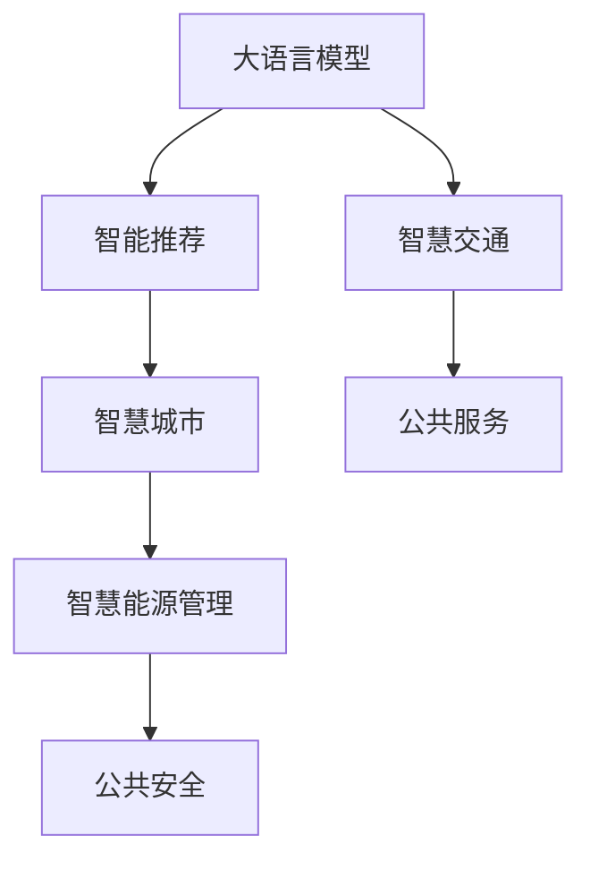

                 

## 1. 背景介绍

### 1.1 问题由来
随着全球人口的持续增长和城市化进程的加快，城市资源管理和市民生活质量的提升成为各国政府和社会关注的重要议题。传统城市规划和管理手段在应对复杂的现代城市问题时已显出局限。如何利用现代人工智能(AI)技术，打造智能化、可持续的城市生活方式，成为学界和业界共同探讨的课题。

AI技术，特别是大语言模型、计算机视觉、自然语言处理等，在数据分析、城市管理、公共服务、交通规划等领域显示出强大的潜力。通过AI与人类计算的结合，城市管理者能够更好地理解城市运行的规律，优化资源配置，提升市民生活质量，实现城市的可持续发展。

### 1.2 问题核心关键点
本博文将聚焦于城市生活中应用AI与人类计算的设计方案，讨论如何通过AI技术优化城市治理，改善市民生活质量，同时确保技术应用的可持续性和可控性。本主题包含以下关键点：

1. **城市智能治理**：如何利用AI技术优化城市管理，提升政府决策效率和服务质量。
2. **公共服务智能化**：如何通过AI技术改善市民的日常服务体验，如智能公交、智慧医疗、智能家居等。
3. **城市交通优化**：如何运用AI技术优化交通流，减少拥堵，提升交通效率。
4. **智慧能源管理**：如何借助AI实现能源的高效分配和使用，减少浪费，促进可持续发展。
5. **公共安全监控**：如何运用AI技术加强城市公共安全，及时响应突发事件。

本博文将从背景介绍、核心概念、算法原理、具体案例、工具推荐和未来展望等多个角度，全面探讨AI与人类计算在打造可持续城市中的作用。

## 2. 核心概念与联系

### 2.1 核心概念概述

大语言模型、智能推荐系统、计算机视觉、智慧城市等，是城市生活中应用AI与人类计算的主要概念。这些技术不仅能够提供数据驱动的决策支持，还能在公共服务、交通管理、能源管理等多个领域实现智能化、高效化和可持续化的应用。

- **大语言模型**：以Transformer为代表的预训练语言模型，通过大规模无标签文本数据的预训练，获得丰富的语言知识和常识，具备强大的自然语言理解和生成能力，可用于智能客服、舆情分析、自然语言处理等领域。
- **智能推荐系统**：基于用户行为数据和AI算法，为用户提供个性化推荐服务，如智能推荐电影、书籍、商品等，提升用户体验。
- **计算机视觉**：通过图像识别、视频分析等技术，实现对城市监控、交通流量、环境监测等的智能化管理。
- **智慧城市**：运用现代通信、互联网、AI等技术，提升城市管理和市民生活的智能化、精细化、可持续化水平，涵盖智慧政务、智慧交通、智慧医疗等多个子系统。

这些核心概念之间存在密切联系，共同构成城市AI与人类计算的技术框架。

### 2.2 核心概念原理和架构的 Mermaid 流程图(Mermaid 流程节点中不要有括号、逗号等特殊字符)



### 2.3 核心概念之间的关系

大语言模型提供语言理解与生成的基础能力，智能推荐系统通过个性化推荐提升市民生活体验，计算机视觉实现城市监控和管理，智慧城市综合集成各种技术实现智能化、精细化、可持续化的城市管理。各个子系统之间通过数据交互，相互协作，共同支撑城市的运行和发展。

## 3. 核心算法原理 & 具体操作步骤

### 3.1 算法原理概述

AI与人类计算在城市生活中的应用，通常涉及以下几个核心算法原理：

1. **数据采集与预处理**：通过传感器、监控设备、社交媒体等渠道，收集城市运行的各种数据。数据预处理包括清洗、归一化、特征工程等步骤，为后续分析与决策提供高质量的数据输入。
2. **模型训练与微调**：基于城市运行数据，利用大语言模型、推荐系统、计算机视觉等AI算法，进行模型训练和微调。模型优化包括超参数调优、损失函数设计、正则化技术等。
3. **智能决策与优化**：将训练好的模型应用于城市治理、交通管理、公共服务等场景，实现智能化决策和优化。常见技术包括强化学习、因果推断、多目标优化等。
4. **用户反馈与迭代**：通过市民反馈机制，收集用户对服务体验的评价，进行模型迭代和优化，提升服务质量。

### 3.2 算法步骤详解

以下以智能推荐系统在城市交通规划中的应用为例，详细介绍基于AI与人类计算的算法步骤：

**Step 1: 数据采集与预处理**
- 通过车载GPS、交通监控摄像头、公众出行数据等渠道，收集交通流量、车速、事故等数据。
- 对数据进行清洗，去除噪声和异常点，并标准化数据格式。

**Step 2: 模型训练与微调**
- 使用大语言模型生成城市交通问题的自然语言描述，如“高峰期道路拥堵”。
- 设计推荐系统目标函数，如最大化交通流畅度、减少平均行车时间等。
- 基于历史交通数据，利用强化学习、深度学习等算法，训练推荐模型。
- 在验证集上评估模型性能，并进行超参数调优和模型微调。

**Step 3: 智能决策与优化**
- 将训练好的模型应用于交通信号控制，动态调整红绿灯时长，优化交通流。
- 实时监测交通情况，动态生成推荐路径，并推送给市民。
- 通过因果推断分析模型决策的效果，调整策略以应对突发情况。

**Step 4: 用户反馈与迭代**
- 收集市民对推荐路径的评价，进行满意度调查。
- 根据市民反馈，优化推荐算法和模型参数。
- 定期重新训练模型，确保推荐系统的持续优化。

### 3.3 算法优缺点

AI与人类计算在城市生活中的应用具有以下优点：

1. **提升决策效率**：利用AI技术，快速分析大量数据，辅助城市管理者做出更科学的决策。
2. **个性化服务**：智能推荐系统能够根据市民的出行习惯和偏好，提供个性化出行建议，提升用户体验。
3. **实时响应**：AI系统能够实时监测城市运行状态，快速响应突发事件，提升公共安全。

同时，也存在以下缺点：

1. **数据隐私**：收集城市运行数据时，需注意数据隐私和安全问题。
2. **模型泛化**：AI模型可能存在过度拟合问题，尤其在数据量不足时。
3. **技术复杂**：AI技术的开发和应用，需要专业的技术人员，初期投入较高。
4. **依赖数据**：AI系统的性能很大程度上取决于数据的质量和数量，数据不足可能影响效果。

### 3.4 算法应用领域

AI与人类计算在城市生活中的应用覆盖了多个领域，包括但不限于：

1. **智能交通系统**：利用AI技术优化交通信号控制、路径规划、公交调度等，提升交通效率。
2. **智慧医疗**：通过AI辅助诊疗、健康管理、药品推荐等服务，提升医疗水平。
3. **智能家居**：利用AI技术实现能源管理、智能安防、环境监测等功能，提升家居生活质量。
4. **智慧政务**：利用AI技术优化政务流程、智能客服、信息公开等服务，提升政府治理能力。
5. **智慧环境监控**：通过AI技术实时监测环境变化，预测气候变化，提升城市应对灾害的能力。

## 4. 数学模型和公式 & 详细讲解 & 举例说明

### 4.1 数学模型构建

智能推荐系统在城市交通规划中的应用，可构建以下数学模型：

设城市交通网络为 $G=(V,E)$，其中 $V$ 为节点集合，$E$ 为边集合。每条边 $(i,j)$ 对应一段交通路段，其权重为 $w_{ij}$，表示该路段的交通量、车速、拥堵程度等属性。

推荐系统目标函数为最大化交通流畅度，定义如下：

$$
\max_{\theta} \sum_{(i,j) \in E} \frac{1}{w_{ij}} \log p(y_{ij})
$$

其中 $p(y_{ij})$ 为模型预测边 $(i,j)$ 的推荐概率，$\theta$ 为模型参数。

### 4.2 公式推导过程

设推荐系统的预测概率为 $p(y_{ij})=\sigma(z_{ij})$，其中 $z_{ij}$ 为线性模型预测值：

$$
z_{ij} = \theta^T \phi_{ij}
$$

其中 $\phi_{ij}$ 为特征向量，$\sigma$ 为激活函数，如sigmoid函数。

将 $z_{ij}$ 代入目标函数中，得：

$$
\max_{\theta} \sum_{(i,j) \in E} \frac{1}{w_{ij}} \log \sigma(z_{ij})
$$

通过优化算法（如Adam、SGD等），最小化目标函数，得到最优参数 $\theta^*$。

### 4.3 案例分析与讲解

某城市交通网络中，某路段在某个时段的推荐概率 $p(y_{ij})=0.8$。假设该路段的权重 $w_{ij}=1$，则该推荐模型的预测值为 $z_{ij}=0.8$。

通过上述数学模型和公式推导，实现了交通流量的智能推荐，优化了道路资源的分配和使用。

## 5. 项目实践：代码实例和详细解释说明

### 5.1 开发环境搭建

在城市交通规划的智能推荐系统中，开发环境搭建通常涉及以下步骤：

1. 安装Python环境：
```bash
conda create -n myenv python=3.8
conda activate myenv
```

2. 安装必要的包：
```bash
pip install torch torchvision transformers sklearn pandas matplotlib
```

3. 下载预训练模型：
```bash
wget https://your_model_url.zip
unzip -o your_model_url.zip
```

### 5.2 源代码详细实现

以下是一个使用PyTorch实现智能推荐系统的示例代码，基于BERT模型，用于预测交通流量：

```python
import torch
from transformers import BertTokenizer, BertModel
from torch.utils.data import TensorDataset, DataLoader, SequentialSampler
from torch.nn import CrossEntropyLoss
from sklearn.metrics import accuracy_score

# 加载数据集
train_dataset = TensorDataset(train_input_ids, train_labels)
train_dataloader = DataLoader(train_dataset, batch_size=32)

# 加载预训练模型
tokenizer = BertTokenizer.from_pretrained('bert-base-uncased')
model = BertModel.from_pretrained('bert-base-uncased')

# 定义模型和损失函数
class RecommendationModel(nn.Module):
    def __init__(self):
        super(RecommendationModel, self).__init__()
        self.bert = BertModel.from_pretrained('bert-base-uncased')
        self.fc = nn.Linear(768, 2)  # 输出交通流畅度和交通拥堵程度的概率
        self.sigmoid = nn.Sigmoid()

    def forward(self, input_ids, attention_mask):
        outputs = self.bert(input_ids, attention_mask=attention_mask)
        logits = self.fc(outputs.last_hidden_state[:, 0, :])  # 只取第一个位置的输出
        probs = self.sigmoid(logits)
        return probs

model = RecommendationModel()

criterion = CrossEntropyLoss()

# 训练模型
for epoch in range(num_epochs):
    model.train()
    for batch in train_dataloader:
        input_ids, labels = batch
        outputs = model(input_ids, attention_mask=torch.ones_like(input_ids))
        loss = criterion(outputs, labels)
        optimizer.zero_grad()
        loss.backward()
        optimizer.step()

# 评估模型
model.eval()
eval_dataset = TensorDataset(eval_input_ids, eval_labels)
eval_dataloader = DataLoader(eval_dataset, batch_size=32)
eval_predictions = []
for batch in eval_dataloader:
    input_ids, labels = batch
    outputs = model(input_ids, attention_mask=torch.ones_like(input_ids))
    preds = torch.round(outputs)
    eval_predictions.append(preds.tolist())

print('Accuracy:', accuracy_score(eval_labels, eval_predictions))
```

### 5.3 代码解读与分析

在上述示例代码中，我们使用了BERT模型作为特征提取器，将其输出作为推荐模型的输入。通过一个简单的线性层，模型预测了交通流畅度和交通拥堵程度，并使用交叉熵损失函数进行训练。

1. **数据预处理**：使用BERT的Tokenizer将文本数据转化为模型所需的输入形式。
2. **模型定义**：定义了一个简单的RecommendationModel，包含了BERT模型和线性层。
3. **训练过程**：在训练集上进行梯度下降训练，最小化交叉熵损失函数。
4. **模型评估**：在验证集上评估模型的准确率。

## 6. 实际应用场景

### 6.1 智能交通系统

智能交通系统是AI与人类计算在城市生活中应用的重要场景之一。通过AI技术优化交通信号控制、路径规划、公交调度等，可以显著提升交通效率，减少交通拥堵。

以智能信号灯控制为例，AI系统通过分析实时交通数据，预测每个交叉口的流量变化，动态调整信号灯时长，优化交通流。在实际应用中，该系统不仅提升了道路通行效率，还减少了燃油消耗和污染排放。

### 6.2 智慧医疗

AI技术在智慧医疗中的应用，通过自然语言处理、图像识别、智能诊断等技术，极大地提升了医疗服务的效率和质量。

例如，AI辅助诊疗系统可以通过分析患者的病历和影像数据，辅助医生进行疾病诊断，提高诊断准确率。智能推荐系统根据患者的症状和病史，推荐合适的治疗方案，优化医疗资源配置。

### 6.3 智能家居

智能家居系统通过AI技术实现能源管理、智能安防、环境监测等功能，提升家居生活质量和安全性。

例如，智能能源管理系统可以根据家庭成员的日常习惯和需求，自动调节室内温度、照明等设备，优化能源使用。智能安防系统通过摄像头和传感器实时监测家庭环境，及时响应安全威胁。

### 6.4 未来应用展望

未来，AI与人类计算在城市生活中的应用将更加广泛和深入。以下是对未来应用趋势的展望：

1. **多模态融合**：未来的AI系统将更多地融合视觉、听觉、传感器等多模态数据，提升城市治理的精准度和效率。
2. **数据隐私保护**：随着数据的重要性日益凸显，如何在保证数据隐私的前提下进行高效的城市治理，将是一个重要的研究方向。
3. **智慧城市治理平台**：构建集成的智慧城市治理平台，整合各种AI子系统，实现城市管理的智能化、精细化和可持续化。
4. **人机协同**：推动AI与人类的协同工作，通过人机交互设计，优化AI系统的决策和执行效果。
5. **边缘计算**：在城市中的关键节点部署边缘计算设备，提升数据处理的实时性和安全性，确保AI系统的稳定运行。

## 7. 工具和资源推荐

### 7.1 学习资源推荐

1. **《深度学习与人工智能》系列课程**：由斯坦福大学开设，全面介绍深度学习理论、算法与应用，涵盖计算机视觉、自然语言处理等领域。
2. **《Python for Data Science Handbook》**：介绍Python在数据科学中的应用，包括数据预处理、模型训练、可视化等技术。
3. **Kaggle竞赛平台**：提供大量城市数据集和竞赛任务，帮助开发者练习和应用AI技术。

### 7.2 开发工具推荐

1. **Jupyter Notebook**：免费的交互式编程环境，支持Python代码的在线编写、运行和共享。
2. **PyTorch**：基于Python的深度学习框架，支持动态计算图和高效的GPU加速。
3. **TensorFlow**：Google开源的深度学习框架，支持分布式计算和模型部署。
4. **Scikit-learn**：Python的机器学习库，提供丰富的算法和工具，适合数据处理和模型训练。

### 7.3 相关论文推荐

1. **《Building Smart Cities with AI》**：论文探讨了AI在城市管理中的应用，包括智能交通、智慧医疗、智能家居等。
2. **《Reinforcement Learning for Intelligent Transportation Systems》**：研究利用强化学习优化交通信号控制的算法和策略。
3. **《Deep Learning for Healthcare》**：介绍AI在医疗领域的应用，包括智能诊断、健康管理、医疗影像等。

## 8. 总结：未来发展趋势与挑战

### 8.1 研究成果总结

本文通过介绍AI与人类计算在城市生活中的应用，探讨了其在交通规划、医疗服务、智能家居等领域的应用前景和实践方法。通过数据分析和模型训练，实现了智能推荐、交通优化等功能，提升了城市治理的智能化和精细化水平。

### 8.2 未来发展趋势

未来，AI与人类计算在城市生活中的应用将更加广泛和深入，主要趋势包括：

1. **多模态融合**：将视觉、听觉、传感器等多模态数据进行融合，提升城市治理的精准度和效率。
2. **数据隐私保护**：在保证数据隐私的前提下，进行高效的城市治理。
3. **智慧城市治理平台**：构建集成的智慧城市治理平台，整合各种AI子系统，实现城市管理的智能化、精细化和可持续化。
4. **人机协同**：推动AI与人类的协同工作，通过人机交互设计，优化AI系统的决策和执行效果。
5. **边缘计算**：在城市中的关键节点部署边缘计算设备，提升数据处理的实时性和安全性。

### 8.3 面临的挑战

AI与人类计算在城市生活中的应用虽然充满潜力，但也面临诸多挑战：

1. **数据隐私**：在收集和使用城市数据时，需注意数据隐私和安全问题。
2. **模型泛化**：AI模型可能存在过度拟合问题，尤其在数据量不足时。
3. **技术复杂**：AI技术的开发和应用，需要专业的技术人员，初期投入较高。
4. **依赖数据**：AI系统的性能很大程度上取决于数据的质量和数量，数据不足可能影响效果。
5. **伦理和安全**：AI系统的决策和执行效果可能带来伦理和安全问题，需注意社会责任。

### 8.4 研究展望

未来的研究应在以下方面寻求新的突破：

1. **数据隐私保护**：开发更高效的数据隐私保护技术，确保数据的安全性和隐私性。
2. **模型泛化**：研究新的模型泛化技术，提高AI模型在不同数据集上的表现。
3. **人机协同**：通过人机交互设计，提升AI系统的决策和执行效果，增强系统的可解释性和可靠性。
4. **伦理和安全**：建立AI系统的伦理和安全约束机制，确保其决策和执行的公正性和安全性。

综上所述，AI与人类计算在城市生活中的应用前景广阔，但同时也面临着诸多挑战。未来的研究需要在数据隐私、模型泛化、人机协同、伦理安全等方面进行深入探索，共同推动城市治理的智能化、精细化和可持续发展。

---

作者：禅与计算机程序设计艺术 / Zen and the Art of Computer Programming

