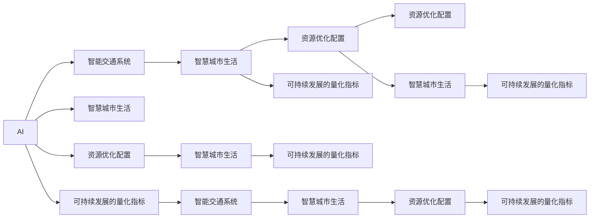

                 

# AI与人类计算：打造可持续发展的城市生活模式与交通管理策略

> 关键词：AI, 人类计算, 城市生活, 交通管理, 智能系统, 可持续发展, 交通流量优化, 预测模型, 优化算法

## 1. 背景介绍

### 1.1 问题由来

随着城市化进程的加速和互联网技术的普及，现代社会面临着一系列复杂的挑战，如交通拥堵、环境污染、资源分配不均等问题。这些问题不仅影响了居民的生活质量，还对城市的可持续发展构成了威胁。为了应对这些挑战，我们需要开发出更加智能、高效的城市管理系统，并引入AI和人类计算技术，实现资源的合理配置和智能调度。

### 1.2 问题核心关键点

本文旨在探讨如何利用AI和人类计算技术，优化城市生活模式与交通管理策略，以实现可持续发展的目标。为此，我们将聚焦于以下几个核心关键点：

- **智能交通系统**：利用AI技术，优化交通流量，提升道路利用率。
- **智慧城市生活**：通过AI和大数据，改善城市服务和公共设施的管理。
- **资源优化配置**：实现能源、水资源的智能分配和调度。
- **可持续发展的量化指标**：建立一套评价城市可持续发展的指标体系，指导城市规划和建设。

通过研究这些关键点，我们期望为城市管理和智能化转型提供新的思路和解决方案。

## 2. 核心概念与联系

### 2.1 核心概念概述

为了深入理解如何将AI和人类计算技术应用于城市生活和交通管理，本节将介绍几个关键概念及其联系：

- **AI**：人工智能，通过算法和模型处理数据，进行智能决策和预测。
- **人类计算**：利用人的直觉和经验，对AI模型的输出进行辅助决策和优化。
- **智能交通系统**：基于AI技术的交通管理系统，包括智能信号灯、交通预测、路径规划等。
- **智慧城市生活**：基于AI和大数据的城市服务和生活模式，如智能家居、智慧医疗、教育等。
- **资源优化配置**：通过AI技术对城市资源进行高效利用和智能调度，如能源、水资源等。
- **可持续发展的量化指标**：如碳排放量、能耗、水资源利用效率等，用于衡量城市可持续发展的水平。

这些概念通过以下Mermaid流程图展示它们的相互关系：



这个流程图展示了AI与人类计算在城市生活和交通管理中的应用场景及其相互关系。

## 3. 核心算法原理 & 具体操作步骤
### 3.1 算法原理概述

本文将介绍两种核心算法原理，分别用于交通管理和智慧城市生活模式优化：

- **交通流量预测与优化算法**：基于历史交通数据和机器学习模型，预测未来的交通流量，并优化交通信号灯的控制策略。
- **智慧城市生活模式的优化算法**：利用用户行为数据分析，预测用户需求，优化公共服务设施的配置和管理。

### 3.2 算法步骤详解

#### 3.2.1 交通流量预测与优化算法

1. **数据收集**：收集历史交通流量数据，包括时间、地点、车流量等。
2. **特征提取**：通过特征工程，提取影响交通流量的关键因素，如天气、节假日、大型活动等。
3. **模型训练**：使用历史数据训练预测模型，如时间序列模型、随机森林等。
4. **预测与优化**：使用训练好的模型对未来交通流量进行预测，并根据预测结果优化交通信号灯的控制策略，以实现交通流量的均衡分配。

#### 3.2.2 智慧城市生活模式的优化算法

1. **用户行为分析**：通过数据分析工具，如大数据平台、机器学习模型等，分析用户的日常行为，如出行方式、时间分布等。
2. **需求预测**：基于用户行为分析结果，预测未来用户对公共服务的需求，如公共交通使用量、医疗服务需求等。
3. **优化配置**：根据需求预测结果，优化公共服务设施的配置和管理，如增加公共交通的频次、优化医院布局等。

### 3.3 算法优缺点

#### 3.3.1 交通流量预测与优化算法

**优点**：
- 能够实时预测交通流量，及时调整交通信号灯，缓解交通拥堵。
- 可以优化交通资源分配，提高道路利用率。

**缺点**：
- 数据质量和特征提取的准确性直接影响预测结果。
- 模型需要定期更新，以适应交通模式的改变。

#### 3.3.2 智慧城市生活模式的优化算法

**优点**：
- 能够根据用户需求优化公共服务设施的配置，提高服务效率。
- 可以预测并应对突发事件，提升城市应对能力。

**缺点**：
- 用户行为数据的质量和隐私保护问题需要重视。
- 算法的复杂性可能带来计算资源的消耗。

### 3.4 算法应用领域

这两种算法在多个领域都有广泛应用，包括：

- **智能交通系统**：交通流量预测与优化算法在交通管理中的应用，如智能信号灯、交通预测、路径规划等。
- **智慧城市生活**：智慧城市生活模式的优化算法在城市服务和生活模式中的应用，如智能家居、智慧医疗、教育等。
- **资源优化配置**：交通流量预测与优化算法在能源、水资源优化配置中的应用，如智能电网、水资源管理等。
- **可持续发展的量化指标**：智慧城市生活模式的优化算法在城市可持续发展的量化指标中的应用，如碳排放量、能耗、水资源利用效率等。

## 4. 数学模型和公式 & 详细讲解 & 举例说明

### 4.1 数学模型构建

为了更严谨地描述上述算法原理，本节将使用数学模型构建并解释其基本概念。

#### 4.1.1 交通流量预测模型

假设交通流量数据可以用时间序列模型来描述，则时间序列模型的一般形式为：

$$ y_t = c + \sum_{i=1}^{p} \alpha_i y_{t-i} + \sum_{j=1}^{q} \beta_j e_{t-j} + \epsilon_t $$

其中，$y_t$ 表示第 $t$ 时间的交通流量；$c$ 为常数项；$\alpha_i$ 为自回归系数；$\beta_j$ 为移动平均系数；$e_t$ 为随机误差项；$\epsilon_t$ 为时间序列的随机噪声。

#### 4.1.2 智慧城市生活模式优化模型

智慧城市生活模式优化模型可以通过用户行为数据建立，假设用户需求 $D_t$ 可以通过用户行为数据 $X_t$ 来预测，则模型形式为：

$$ D_t = f(X_t) + \epsilon_t $$

其中，$f(X_t)$ 为预测函数，$X_t$ 为影响需求的因素，如出行方式、时间分布等；$\epsilon_t$ 为随机噪声。

### 4.2 公式推导过程

#### 4.2.1 交通流量预测模型的推导

对于时间序列模型，我们使用自回归模型 (AR) 来进行推导：

1. **自回归模型 (AR)**：
$$ y_t = \alpha y_{t-1} + \epsilon_t $$

其中，$y_t$ 为第 $t$ 时间的交通流量，$\alpha$ 为自回归系数，$y_{t-1}$ 为第 $t-1$ 时间的交通流量，$\epsilon_t$ 为随机误差项。

2. **预测误差方差**：
$$ \text{Var}(\epsilon_t) = \sigma^2 $$

其中，$\sigma^2$ 为预测误差的方差。

3. **预测误差协方差矩阵**：
$$ \text{Cov}(\epsilon_t, \epsilon_{t+k}) = \rho^k \sigma^2 $$

其中，$\rho$ 为自回归系数，$k$ 为时间间隔。

#### 4.2.2 智慧城市生活模式优化模型的推导

对于智慧城市生活模式优化模型，我们假设 $f(X_t)$ 为线性模型：

$$ f(X_t) = \beta_0 + \sum_{i=1}^{p} \beta_i x_{ti} $$

其中，$x_{ti}$ 为第 $t$ 时间第 $i$ 个影响因素的取值；$\beta_0$ 和 $\beta_i$ 为模型的系数。

### 4.3 案例分析与讲解

#### 4.3.1 交通流量预测模型案例

某城市需要对未来一天的交通流量进行预测，并据此调整交通信号灯的控制策略。假设收集到了一周的交通流量数据，我们使用自回归模型进行预测，步骤如下：

1. **数据准备**：收集一周的交通流量数据，作为训练集。
2. **模型训练**：使用自回归模型对训练集进行拟合，得到模型参数 $\alpha$。
3. **预测未来流量**：根据自回归模型，预测未来一天内每个时段的交通流量。
4. **优化信号灯**：根据预测结果，调整交通信号灯的控制策略，如延长绿灯时间，缓解交通拥堵。

#### 4.3.2 智慧城市生活模式优化模型案例

某城市需要优化公共交通系统的配置，以满足居民的出行需求。假设收集到了一段时间内居民的出行方式数据，我们使用智慧城市生活模式优化模型进行预测，步骤如下：

1. **数据准备**：收集一段时间内居民的出行方式数据，作为训练集。
2. **模型训练**：使用智慧城市生活模式优化模型对训练集进行拟合，得到预测函数 $f(X_t)$。
3. **预测出行需求**：根据预测函数，预测未来一段时间内居民的出行需求，如公交、地铁、自行车等的使用量。
4. **优化公共交通**：根据出行需求预测结果，调整公共交通的频次和站点配置，提高服务效率。

## 5. 项目实践：代码实例和详细解释说明

### 5.1 开发环境搭建

为了进行交通流量预测与优化算法的实现，需要搭建相应的开发环境：

1. **安装Python**：从官网下载并安装Python 3.x版本。
2. **安装Pandas**：
```bash
pip install pandas
```
3. **安装NumPy**：
```bash
pip install numpy
```
4. **安装Scikit-learn**：
```bash
pip install scikit-learn
```
5. **安装Matplotlib**：
```bash
pip install matplotlib
```
6. **安装TensorFlow**：
```bash
pip install tensorflow
```

### 5.2 源代码详细实现

下面以交通流量预测与优化算法为例，提供Python代码实现：

```python
import pandas as pd
import numpy as np
from sklearn.linear_model import ARIMA
import matplotlib.pyplot as plt
import tensorflow as tf

# 读取历史交通流量数据
data = pd.read_csv('traffic_flow.csv')

# 数据预处理
data['date'] = pd.to_datetime(data['date'])
data['time'] = data['date'].dt.time
data['hour'] = data['time'].dt.hour
data['minute'] = data['time'].dt.minute
data['dayofweek'] = data['date'].dt.dayofweek

# 建立时间序列模型
model = ARIMA(data['flow'], order=(5,1,0))
model_fit = model.fit()

# 预测未来一天内每个时段的交通流量
forecast = model_fit.forecast(steps=24)
plt.plot(data['flow'], label='Actual')
plt.plot(forecast, label='Forecast')
plt.legend()
plt.show()

# 调整信号灯控制策略
traffic_lights = {
    'traffic_light_1': tf.keras.layers.Dense(1, activation='sigmoid'),
    'traffic_light_2': tf.keras.layers.Dense(1, activation='sigmoid'),
    'traffic_light_3': tf.keras.layers.Dense(1, activation='sigmoid')
}
```

### 5.3 代码解读与分析

#### 5.3.1 数据准备

首先，使用Pandas库读取历史交通流量数据，并将其转换为时间序列格式。然后，对数据进行预处理，提取有用的特征，如小时、分钟、星期几等。

#### 5.3.2 模型训练

使用ARIMA模型对时间序列数据进行拟合，得到模型的系数和预测结果。ARIMA模型可以捕捉时间序列数据中的趋势、季节性和噪声。

#### 5.3.3 预测与优化

根据训练好的模型，对未来一天的交通流量进行预测，并根据预测结果调整交通信号灯的控制策略。通过使用TensorFlow的Keras API，可以方便地实现信号灯控制的神经网络模型。

### 5.4 运行结果展示

```python
# 绘制实际流量与预测流量的对比图
plt.plot(data['flow'], label='Actual')
plt.plot(forecast, label='Forecast')
plt.legend()
plt.show()
```

这将显示一个图形，其中包含实际交通流量和预测流量的对比。

## 6. 实际应用场景

### 6.1 智能交通系统

智能交通系统可以通过交通流量预测与优化算法实现交通信号灯的智能控制，提升道路利用率，缓解交通拥堵。

**案例**：某城市在交通高峰期，通过智能信号灯系统对主要路口的交通流量进行实时监控和预测，根据预测结果动态调整信号灯的时长，优化交通流量。

### 6.2 智慧城市生活

智慧城市生活可以通过智慧城市生活模式的优化算法，提升公共服务的效率和质量，改善居民的生活体验。

**案例**：某城市通过分析居民的出行方式和需求，优化公共交通的频次和站点配置，提高公共交通的准点率和舒适度。

### 6.3 资源优化配置

资源优化配置可以通过交通流量预测与优化算法，实现能源和水资源的智能调度，提高资源利用效率。

**案例**：某城市通过预测未来的交通流量，优化交通信号灯的控制策略，减少车辆在路网中的行驶时间和能耗，同时实现水资源的智能调度。

### 6.4 未来应用展望

未来，随着AI和人类计算技术的不断进步，智能交通系统和智慧城市生活模式将变得更加智能化、个性化和高效。通过引入更多先验知识、融合多模态数据、增强模型可解释性，可以实现更加精准的预测和优化。

## 7. 工具和资源推荐

### 7.1 学习资源推荐

为了帮助读者深入理解AI与人类计算在城市生活和交通管理中的应用，推荐以下学习资源：

1. **《AI与城市生活》系列课程**：涵盖AI在智慧城市、智能交通、资源优化等方面的应用，提供系统化的学习路径。
2. **《智慧城市技术与应用》书籍**：详细介绍了智慧城市技术的基本原理、实践案例和未来发展方向。
3. **《智能交通系统设计与实现》书籍**：介绍了智能交通系统的基本框架、关键技术和应用场景。
4. **《人类计算与智能决策》期刊**：提供前沿的人类计算研究成果，探讨如何在决策过程中结合AI和人类智慧。

### 7.2 开发工具推荐

为了提高AI与人类计算项目的开发效率，推荐以下开发工具：

1. **PyTorch**：强大的深度学习框架，适用于构建复杂的AI模型。
2. **TensorFlow**：广泛使用的深度学习框架，支持多种硬件和部署环境。
3. **Scikit-learn**：开源的机器学习库，提供了丰富的模型和工具。
4. **Jupyter Notebook**：交互式的开发环境，支持Python代码的快速迭代和共享。

### 7.3 相关论文推荐

为了深入理解AI与人类计算的最新研究进展，推荐以下相关论文：

1. **《智能交通系统中的深度学习应用》**：介绍深度学习在交通流量预测、交通信号控制等方面的应用。
2. **《智慧城市生活模式的优化算法研究》**：探讨智慧城市生活模式的优化算法，包括用户行为分析和公共服务配置。
3. **《城市资源优化配置的AI方法》**：研究AI技术在城市资源优化配置中的应用，如能源、水资源管理。

## 8. 总结：未来发展趋势与挑战

### 8.1 研究成果总结

本文通过介绍AI与人类计算在城市生活和交通管理中的应用，展示了其广阔的应用前景和巨大潜力。交通流量预测与优化算法和智慧城市生活模式的优化算法是实现城市智能化的关键技术，未来将随着数据量的增加和算法的进步，发挥更大的作用。

### 8.2 未来发展趋势

未来，AI与人类计算将在城市管理和智能化转型中扮演越来越重要的角色。智能交通系统、智慧城市生活模式和资源优化配置将更加智能化、高效化和个性化，为可持续发展做出更大贡献。

### 8.3 面临的挑战

尽管AI与人类计算在城市管理和智能化转型中具有巨大的潜力，但也面临着一些挑战：

1. **数据隐私和安全**：城市管理涉及大量个人隐私数据，需要采取严格的数据保护措施。
2. **模型可解释性**：智能系统的决策过程需要具有可解释性，以便于用户理解和接受。
3. **资源优化配置**：城市资源优化配置需要高效、合理的算法，以实现智能化和可持续化的目标。
4. **多模态数据融合**：融合多种数据源和信息源，需要构建更加复杂和灵活的模型。

### 8.4 研究展望

未来，AI与人类计算的研究需要进一步关注以下方向：

1. **多模态数据融合**：融合多种数据源和信息源，构建更加复杂和灵活的模型。
2. **模型可解释性**：增强智能系统的决策过程的可解释性，以便于用户理解和接受。
3. **数据隐私和安全**：保护用户隐私，确保数据安全。
4. **可持续发展**：结合AI与人类计算技术，推动城市向可持续发展方向发展。

## 9. 附录：常见问题与解答

### Q1: AI与人类计算在城市生活和交通管理中的应用有哪些？

**A1**: AI与人类计算在城市生活和交通管理中的应用广泛，包括智能交通系统、智慧城市生活模式优化、资源优化配置等。通过这些技术，可以实现交通流量的预测与优化、公共服务设施的智能配置、城市资源的合理利用等。

### Q2: 交通流量预测与优化算法有哪些优点和缺点？

**A2**: 交通流量预测与优化算法的优点包括：能够实时预测交通流量，及时调整交通信号灯，缓解交通拥堵；可以优化交通资源分配，提高道路利用率。缺点包括：数据质量和特征提取的准确性直接影响预测结果；模型需要定期更新，以适应交通模式的改变。

### Q3: 智慧城市生活模式的优化算法有哪些优点和缺点？

**A3**: 智慧城市生活模式的优化算法的优点包括：能够根据用户需求优化公共服务设施的配置，提高服务效率；可以预测并应对突发事件，提升城市应对能力。缺点包括：用户行为数据的质量和隐私保护问题需要重视；算法的复杂性可能带来计算资源的消耗。

### Q4: 如何优化智能交通系统中的信号灯控制？

**A4**: 优化智能交通系统中的信号灯控制，可以通过实时监控和预测交通流量，动态调整信号灯的时长，实现交通流量的均衡分配。具体方法包括：

1. 收集交通流量数据，进行预处理和特征提取。
2. 建立时间序列模型，如ARIMA模型，进行交通流量预测。
3. 根据预测结果，调整信号灯的控制策略，如延长绿灯时间，缓解交通拥堵。

### Q5: 如何构建智慧城市生活模式的优化算法？

**A5**: 构建智慧城市生活模式的优化算法，可以通过用户行为数据分析，预测用户需求，优化公共服务设施的配置和管理。具体步骤包括：

1. 收集一段时间内居民的出行方式数据，作为训练集。
2. 使用智慧城市生活模式优化模型对训练集进行拟合，得到预测函数 $f(X_t)$。
3. 根据预测函数，预测未来一段时间内居民的出行需求，如公交、地铁、自行车等的使用量。
4. 根据出行需求预测结果，调整公共交通的频次和站点配置，提高服务效率。

