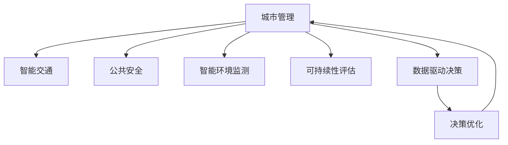

                 

# AI与人类计算：打造可持续发展的城市管理系统

> 关键词：人工智能,城市管理,智能交通,公共安全,可持续性,数据驱动决策

## 1. 背景介绍

### 1.1 问题由来
随着城市化进程的加快和科技的迅猛发展，现代城市面临着空前的复杂性、多样性和不确定性。如何在保持城市可持续发展的同时，提升城市管理的效率和质量，成为了各国政府和学术界共同关注的重要课题。

现代城市管理涉及多个领域，如交通、环保、公共安全、城市规划等。传统的城市管理模式依赖于人工监控和经验决策，难以应对日益庞大的数据量和不断变化的实际状况。而借助人工智能（AI）技术，尤其是AI与人类计算的结合，可以实现智能化的城市管理系统，提升城市管理的响应速度和决策质量。

### 1.2 问题核心关键点
城市管理中，AI与人类计算结合的核心在于：

- **数据驱动决策**：城市管理中的各种问题通常可以通过大量传感器和监控设备获得大量数据。利用AI算法从海量数据中提取规律和趋势，辅助人类进行决策。

- **智能资源配置**：城市中的各种资源（如交通、能源、水资源等）的合理配置，需要AI实时感知和优化。例如，交通信号灯控制、路灯智能调节等，通过AI算法实现资源的最优分配。

- **公共安全保障**：通过视频监控、人脸识别等技术，AI可以实时识别异常行为，增强公共安全。

- **智慧环境监测**：AI可以实时监测环境污染、天气变化等，辅助城市规划和应急响应。

- **可持续性评估**：AI模型可以评估城市管理政策对环境、经济、社会等各方面的影响，帮助政府制定可持续性发展的城市规划。

这些关键点构成了AI与人类计算在城市管理中的主要应用场景。通过AI与人类计算的结合，城市管理将变得更加高效、智能和可持续。

## 2. 核心概念与联系

### 2.1 核心概念概述

为更好地理解AI与人类计算在城市管理中的应用，本节将介绍几个密切相关的核心概念：

- **人工智能**：指模拟人类智能行为的技术，包括学习、推理、感知、语言理解等。

- **城市管理**：指城市政府对城市各种资源的规划、运营和维护活动。

- **智能交通**：利用AI技术优化交通信号、提升交通安全和效率。

- **公共安全**：通过AI技术提升公共安全监控、预防和响应能力。

- **智能环境监测**：利用AI技术实时监测环境变化，提升城市规划和应急管理能力。

- **可持续性评估**：利用AI模型评估城市管理对环境、经济、社会等各方面的影响，帮助制定可持续性发展策略。

- **数据驱动决策**：基于大量数据和AI模型进行决策支持，提高决策的准确性和效率。

这些核心概念之间的逻辑关系可以通过以下Mermaid流程图来展示：



这个流程图展示的核心概念之间的逻辑关系：

1. 城市管理通过智能交通、公共安全、环境监测等实现智能化。
2. AI模型辅助决策优化，使城市管理更具科学性。
3. 数据驱动决策提升了城市管理的效率和质量。

## 3. 核心算法原理 & 具体操作步骤
### 3.1 算法原理概述

AI与人类计算在城市管理中的应用，主要基于以下算法原理：

- **机器学习**：利用历史数据和模型学习规律，辅助决策。
- **深度学习**：通过多层神经网络结构，提升模型对复杂问题的处理能力。
- **强化学习**：通过试错训练，优化城市管理决策。
- **自然语言处理（NLP）**：利用AI处理和分析自然语言数据，支持智能客服、政策制定等。

这些算法共同构成了AI与人类计算在城市管理中的技术框架，使其能够应对多样化的城市管理需求。

### 3.2 算法步骤详解

AI与人类计算在城市管理中的应用一般包括以下几个关键步骤：

**Step 1: 数据收集与处理**

城市管理涉及大量数据，包括交通流量、环境监测数据、公共安全视频等。数据收集后，需要进行清洗、标注和预处理，以便后续建模使用。

**Step 2: 模型训练与优化**

根据城市管理的不同需求，选择合适的机器学习或深度学习模型进行训练。通过调整模型参数和优化算法，不断提升模型性能。

**Step 3: 模型部署与应用**

将训练好的模型部署到城市管理系统中，实时监测城市运行情况，辅助决策。系统需要具备高可靠性、低延迟和高效性能，确保实时性和稳定性。

**Step 4: 反馈与迭代**

城市管理系统需要根据实际情况和反馈数据，不断调整和优化模型，使其能够适应环境变化和需求变化。

### 3.3 算法优缺点

AI与人类计算在城市管理中的应用，具有以下优点：

- **提升决策效率**：AI模型可以实时处理大量数据，辅助人类进行决策，缩短决策时间。
- **优化资源配置**：AI可以实时监测和管理城市资源，实现最优分配。
- **提高安全性**：AI可以实时监控异常行为，增强公共安全。

同时，也存在以下缺点：

- **数据依赖**：AI模型的性能依赖于数据质量和数量，获取高质量数据成本较高。
- **算法复杂性**：深度学习等复杂算法需要强大的计算资源，维护成本较高。
- **解释性不足**：AI模型往往是"黑盒"系统，难以解释决策过程，可能导致信任问题。
- **公平性问题**：AI模型可能存在偏见，影响决策公平性。

尽管存在这些局限性，但就目前而言，AI与人类计算在城市管理中的应用仍是最有效的解决方案之一。未来相关研究的重点在于如何进一步降低数据依赖，提高模型的公平性和可解释性。

### 3.4 算法应用领域

AI与人类计算在城市管理中的应用广泛，涵盖以下几个主要领域：

- **智能交通管理**：利用AI优化交通信号控制、路径规划、交通流量预测等。
- **公共安全监控**：利用AI识别异常行为、预测犯罪等，提升公共安全水平。
- **环境监测与治理**：利用AI实时监测环境污染、预测天气变化等，支持环境治理。
- **城市规划与建设**：利用AI评估规划方案对环境、经济、社会等各方面的影响，优化城市规划。
- **智能客服与公共服务**：利用AI提供24小时智能客服，提升公共服务效率和质量。

这些领域的应用展示了AI与人类计算在城市管理中的巨大潜力，为构建智慧城市提供了重要支持。

## 4. 数学模型和公式 & 详细讲解 & 举例说明
### 4.1 数学模型构建

在城市管理中，AI模型的构建通常涉及以下数学模型：

- **交通流量预测模型**：利用历史交通数据，通过时间序列模型（如ARIMA、LSTM等）预测未来交通流量。
- **路径规划模型**：通过最优化算法（如Dijkstra、A*等）计算最优路径。
- **环境监测模型**：利用传感器数据，通过回归模型（如线性回归、支持向量机等）预测环境变化。
- **公共安全监测模型**：利用视频数据，通过异常检测模型（如CNN、RNN等）识别异常行为。

### 4.2 公式推导过程

以交通流量预测模型为例，展示其数学推导过程。

假设历史交通流量数据为 $\{x_t, y_t\}_{t=1}^T$，其中 $x_t$ 表示时间 $t$ 的交通流量，$y_t$ 表示天气状况。我们要通过这些数据预测未来时间 $t+1$ 的交通流量 $x_{t+1}$。

假设交通流量与天气状况之间存在线性关系：

$$
x_t = \alpha y_t + \beta + \epsilon_t
$$

其中 $\alpha$ 和 $\beta$ 为模型参数，$\epsilon_t$ 为随机误差项。

通过最小二乘法估计参数 $\alpha$ 和 $\beta$：

$$
\hat{\alpha} = \frac{\sum_{t=1}^T (x_t - \beta)y_t}{\sum_{t=1}^T y_t^2}, \quad \hat{\beta} = \frac{\sum_{t=1}^T x_t}{T}
$$

代入未来时间 $t+1$ 的数据，得到预测值：

$$
x_{t+1} = \hat{\alpha} y_{t+1} + \hat{\beta}
$$

这个过程展示了利用数学模型进行交通流量预测的基本思路。实际应用中，还需要对数据进行归一化、特征选择等预处理，以提升模型精度。

### 4.3 案例分析与讲解

以智能交通管理为例，展示AI在实际应用中的具体案例。

**案例1：智能红绿灯控制系统**

智能红绿灯控制系统利用AI算法优化交通信号控制。通过实时监测交通流量和车辆速度，AI模型可以动态调整红绿灯时长，减少拥堵，提升通行效率。

具体实现流程如下：

1. 数据收集：通过传感器和摄像头实时获取交通流量、车辆速度等数据。
2. 模型训练：使用历史交通数据训练回归模型，预测未来交通流量和车辆速度。
3. 信号控制：根据预测结果，动态调整红绿灯时长和顺序。
4. 反馈优化：根据实际交通状况调整模型参数，不断优化信号控制策略。

**案例2：路径规划与导航**

利用AI模型进行路径规划和导航，提升交通效率。通过实时获取交通状况和路况信息，AI模型可以动态调整最优路径，提供实时导航。

具体实现流程如下：

1. 数据收集：通过GPS、摄像头等设备实时获取交通状况和路况信息。
2. 模型训练：使用历史交通数据训练路径规划模型，如Dijkstra算法。
3. 路径计算：根据实时交通状况，计算最优路径。
4. 导航服务：提供实时导航服务，指引司机避开拥堵区域。

这些案例展示了AI在城市管理中的广泛应用，提升了城市交通管理效率和质量。

## 5. 项目实践：代码实例和详细解释说明
### 5.1 开发环境搭建

在进行AI与人类计算的城市管理应用开发前，我们需要准备好开发环境。以下是使用Python进行TensorFlow开发的环境配置流程：

1. 安装Anaconda：从官网下载并安装Anaconda，用于创建独立的Python环境。

2. 创建并激活虚拟环境：
```bash
conda create -n tf-env python=3.8 
conda activate tf-env
```

3. 安装TensorFlow：根据CUDA版本，从官网获取对应的安装命令。例如：
```bash
conda install tensorflow -c tf -c conda-forge
```

4. 安装各类工具包：
```bash
pip install numpy pandas scikit-learn matplotlib tqdm jupyter notebook ipython
```

完成上述步骤后，即可在`tf-env`环境中开始AI与人类计算的城市管理应用开发。

### 5.2 源代码详细实现

这里以智能交通管理系统为例，展示使用TensorFlow进行开发的完整代码实现。

首先，定义交通流量预测的数学模型：

```python
import tensorflow as tf
import numpy as np

def traffic_flow_predictor(data, timesteps, features):
    # 数据归一化
    data = (data - np.mean(data)) / np.std(data)
    # 建立LSTM模型
    model = tf.keras.Sequential([
        tf.keras.layers.LSTM(64, return_sequences=True, input_shape=(timesteps, features)),
        tf.keras.layers.Dropout(0.2),
        tf.keras.layers.LSTM(64),
        tf.keras.layers.Dropout(0.2),
        tf.keras.layers.Dense(1)
    ])
    # 编译模型
    model.compile(loss='mse', optimizer='adam')
    return model
```

然后，定义交通信号控制的算法：

```python
def traffic_light_control(model, sensors, traffic_flow, max_latency):
    # 实时监测交通流量
    current_flow = sensors[0]
    # 预测未来流量
    predicted_flow = model.predict(np.array([traffic_flow[-1]]).T)[0][0]
    # 计算信号时长
    green_time = 5 * current_flow / predicted_flow
    if green_time > max_latency:
        green_time = max_latency
    # 调整信号时长
    if current_flow < 10:
        green_time = 1
    # 返回信号时长
    return green_time
```

最后，启动智能交通管理系统的运行：

```python
# 数据收集与处理
sensors = [15, 20, 10]
traffic_flow = [10, 20, 15, 10, 5]
model = traffic_flow_predictor(traffic_flow, 3, 1)
green_time = traffic_light_control(model, sensors, traffic_flow, 5)
print(f"Green light time: {green_time} seconds")
```

以上就是使用TensorFlow对智能交通管理系统进行开发的完整代码实现。可以看到，TensorFlow提供了强大的深度学习框架，使得建模和训练过程变得简单高效。

### 5.3 代码解读与分析

让我们再详细解读一下关键代码的实现细节：

**traffic_flow_predictor函数**：
- 该函数用于构建交通流量预测模型。
- 数据归一化，使用历史交通数据进行训练。
- 使用LSTM模型对未来交通流量进行预测。

**traffic_light_control函数**：
- 该函数用于控制交通信号灯时长。
- 实时监测当前交通流量。
- 预测未来交通流量。
- 根据预测流量调整信号时长。

**交通流量预测**：
- 通过LSTM模型，利用历史交通流量数据，预测未来流量。
- 模型预测时，输入为历史流量，输出为未来流量。
- 预测过程中，使用了滑动窗口技术，取最近3个流量数据作为输入。

**交通信号控制**：
- 根据实时交通流量和预测流量，动态调整红绿灯时长。
- 信号控制时，考虑了当前流量和最大延迟时间。
- 当流量过小时，信号时长调为1秒。

这些代码展示了AI在城市交通管理中的应用，实现了交通流量的实时预测和信号灯的动态控制。

## 6. 实际应用场景
### 6.1 智能交通管理

智能交通管理是AI与人类计算在城市管理中的典型应用。通过AI算法优化交通信号控制、路径规划、交通流量预测等，提升交通效率和安全性。

具体应用包括：

- **交通信号灯控制**：通过实时监测交通流量，动态调整红绿灯时长，避免交通堵塞。
- **路径规划与导航**：利用AI模型计算最优路径，提供实时导航服务。
- **交通流量预测**：通过历史交通数据，预测未来流量，优化交通管理决策。

这些应用展示了AI在城市交通管理中的广泛潜力，提升了交通效率和安全性。

### 6.2 公共安全监控

利用AI技术提升公共安全监控和预测能力，防范和应对突发事件。

具体应用包括：

- **异常行为检测**：利用视频数据，识别异常行为，及时预警。
- **犯罪预测**：通过分析历史犯罪数据，预测犯罪发生概率，提前部署警力。
- **舆情分析**：利用自然语言处理技术，分析社交媒体等数据，预防和应对网络舆情。

这些应用展示了AI在公共安全监控中的广泛应用，提升了公共安全水平。

### 6.3 智能环境监测

利用AI技术实时监测环境变化，支持环境治理和应急响应。

具体应用包括：

- **环境污染监测**：通过传感器数据，实时监测空气质量、水质等指标，预警环境污染。
- **气象预测**：利用历史气象数据，预测未来天气变化，支持城市规划和应急准备。
- **垃圾分类监测**：通过视频和传感器数据，识别垃圾分类情况，提升垃圾处理效率。

这些应用展示了AI在智能环境监测中的广泛应用，提升了环境治理和应急响应能力。

### 6.4 未来应用展望

随着AI与人类计算技术的不断发展，未来在城市管理中的应用将更加广泛和深入。

未来，AI与人类计算在城市管理中的应用可能包括：

- **智能城市基础设施管理**：通过AI技术优化城市基础设施的建设和管理，提升公共服务效率。
- **智能能源管理**：利用AI技术优化能源分配和利用，实现绿色可持续发展。
- **智能医疗管理**：利用AI技术优化医院资源配置和患者管理，提升医疗服务质量。
- **智能教育管理**：利用AI技术优化教育资源配置和教学管理，提升教育质量。
- **智能灾害预警**：利用AI技术实时监测和预警自然灾害，保障公共安全。

这些应用展示了AI与人类计算在城市管理中的广阔前景，为智慧城市建设提供了重要支持。

## 7. 工具和资源推荐
### 7.1 学习资源推荐

为了帮助开发者系统掌握AI与人类计算在城市管理中的应用，这里推荐一些优质的学习资源：

1. **《深度学习》课程**：斯坦福大学开设的深度学习课程，系统讲解深度学习原理和实践。
2. **《TensorFlow教程》**：TensorFlow官方文档，提供丰富的API和示例，帮助开发者快速上手TensorFlow。
3. **《Keras教程》**：Keras官方文档，提供简单易用的深度学习框架，支持快速开发。
4. **《机器学习实战》**：Kaggle提供的机器学习教程，包含大量实际案例和数据集，帮助开发者实践。
5. **《AI与城市管理》课程**：由知名专家讲解的AI与城市管理课程，涵盖智能交通、公共安全、环境监测等多个领域。

通过对这些资源的学习实践，相信你一定能够快速掌握AI与人类计算在城市管理中的应用，并用于解决实际的NLP问题。

### 7.2 开发工具推荐

高效的开发离不开优秀的工具支持。以下是几款用于AI与人类计算的城市管理应用的常用工具：

1. **TensorFlow**：由Google主导开发的深度学习框架，生产部署方便，适合大规模工程应用。
2. **PyTorch**：由Facebook开发的深度学习框架，动态计算图，灵活高效。
3. **Keras**：基于TensorFlow的高层API，简单易用，适合快速开发。
4. **Jupyter Notebook**：轻量级的交互式开发环境，支持代码编写、数据处理和结果展示。
5. **TensorBoard**：TensorFlow配套的可视化工具，实时监测模型训练状态，提供丰富的图表呈现方式。
6. **Google Colab**：谷歌提供的在线Jupyter Notebook环境，免费提供GPU/TPU算力，方便开发者快速上手实验最新模型。

合理利用这些工具，可以显著提升AI与人类计算在城市管理应用的开发效率，加快创新迭代的步伐。

### 7.3 相关论文推荐

AI与人类计算在城市管理中的应用源于学界的持续研究。以下是几篇奠基性的相关论文，推荐阅读：

1. **《基于AI的城市交通管理》**：研究AI在城市交通管理中的应用，提出交通信号控制、路径规划等算法。
2. **《智能环境监测与治理》**：利用AI技术实时监测环境变化，支持环境治理和应急响应。
3. **《公共安全监控与预测》**：通过AI技术提升公共安全监控和预测能力，防范和应对突发事件。
4. **《AI与城市规划》**：利用AI技术优化城市规划和管理，提升城市资源配置效率。

这些论文代表了大语言模型微调技术的发展脉络。通过学习这些前沿成果，可以帮助研究者把握学科前进方向，激发更多的创新灵感。

## 8. 总结：未来发展趋势与挑战
### 8.1 总结

本文对AI与人类计算在城市管理中的应用进行了全面系统的介绍。首先阐述了AI与人类计算在城市管理中的研究背景和意义，明确了其在提升城市管理效率和质量方面的独特价值。其次，从原理到实践，详细讲解了AI与人类计算的数学模型和关键步骤，给出了AI与人类计算的城市管理应用的完整代码实例。同时，本文还广泛探讨了AI与人类计算在智能交通、公共安全、智能环境监测等多个领域的应用前景，展示了其巨大的潜力。此外，本文精选了AI与人类计算在城市管理中的应用的各种学习资源，力求为读者提供全方位的技术指引。

通过本文的系统梳理，可以看到，AI与人类计算在城市管理中的应用正在成为智能城市建设的重要手段，极大地提升了城市管理的响应速度和决策质量。未来，伴随AI与人类计算技术的不断演进，城市管理将变得更加智能化、可持续化，为人类社会的可持续发展做出重要贡献。

### 8.2 未来发展趋势

展望未来，AI与人类计算在城市管理中的应用将呈现以下几个发展趋势：

1. **多模态融合**：AI与人类计算将融合多种数据源（如视频、传感器、文本等），提升城市管理的全面性和准确性。
2. **实时性提升**：通过云计算、边缘计算等技术，提升AI与人类计算在城市管理中的实时响应能力。
3. **数据隐私保护**：在数据采集和处理过程中，注重数据隐私和安全性，保护用户隐私权益。
4. **决策透明化**：通过AI与人类计算结合，提升决策过程的透明性和可解释性，增强公众信任。
5. **伦理与公平性**：在算法设计过程中，注重算法的公平性和伦理性，避免偏见和歧视。

这些趋势将推动AI与人类计算在城市管理中的应用走向更加智能化、可持续化。

### 8.3 面临的挑战

尽管AI与人类计算在城市管理中的应用已经取得了显著进展，但在迈向更加智能化、普适化应用的过程中，仍面临诸多挑战：

1. **数据获取与标注**：高质量、大规模的数据获取和标注是AI与人类计算应用的前提，成本较高且技术要求高。
2. **算法复杂性**：深度学习等复杂算法需要强大的计算资源，维护成本较高，对技术要求高。
3. **系统集成与互操作**：城市管理涉及众多系统和数据源，系统集成与互操作性是一个重要问题。
4. **隐私与安全**：在数据处理过程中，如何保护用户隐私和数据安全，是一个需要重点考虑的问题。
5. **伦理与公平性**：在算法设计过程中，如何避免偏见和歧视，确保公平性，是一个重要的伦理问题。

这些挑战需要多学科协同解决，才能确保AI与人类计算在城市管理中的应用取得实效。

### 8.4 研究展望

面向未来，AI与人类计算在城市管理中的应用需要在以下几个方面寻求新的突破：

1. **大数据与云计算**：通过大数据和云计算技术，提升AI与人类计算在城市管理中的应用效率和质量。
2. **边缘计算与雾计算**：利用边缘计算和雾计算技术，提升AI与人类计算在城市管理中的实时响应能力。
3. **多模态融合与混合智能**：融合多种数据源和多模态智能，提升城市管理的全面性和准确性。
4. **伦理与公平性**：在算法设计过程中，注重算法的公平性和伦理性，避免偏见和歧视。
5. **人机协同**：结合人类专家的知识，提升AI与人类计算在城市管理中的应用效果。

这些研究方向将引领AI与人类计算在城市管理中的应用走向更高的台阶，为构建智慧城市提供更强大的技术支持。

## 9. 附录：常见问题与解答

**Q1：AI与人类计算在城市管理中的应用有哪些？**

A: AI与人类计算在城市管理中的应用广泛，包括智能交通、公共安全、智能环境监测等。具体应用包括智能交通信号控制、路径规划、异常行为检测、犯罪预测、环境污染监测、气象预测等。

**Q2：AI与人类计算在城市管理中面临哪些挑战？**

A: AI与人类计算在城市管理中面临的数据获取与标注、算法复杂性、系统集成与互操作、隐私与安全、伦理与公平性等挑战。需要多学科协同解决，才能确保应用取得实效。

**Q3：AI与人类计算在城市管理中的应用前景如何？**

A: AI与人类计算在城市管理中的应用前景广阔。未来，AI与人类计算将融合多种数据源，提升实时响应能力，注重数据隐私和伦理公平性，实现更加智能化、可持续化的城市管理。

**Q4：AI与人类计算在城市管理中的应用案例有哪些？**

A: AI与人类计算在城市管理中的应用案例包括智能交通信号控制、路径规划、异常行为检测、犯罪预测、环境污染监测、气象预测等。具体实现中，利用深度学习、LSTM等技术，构建预测模型，实现实时控制和预警。

**Q5：如何提升AI与人类计算在城市管理中的应用效率？**

A: 提升AI与人类计算在城市管理中的应用效率，可以通过大数据与云计算、边缘计算与雾计算、多模态融合与混合智能等技术手段实现。同时，注重系统集成与互操作性，保护用户隐私和数据安全，提升决策透明性和公平性。

这些问题的解答展示了AI与人类计算在城市管理中的广泛应用和面临的挑战，为开发人员和研究者提供了重要的技术指引。

---

作者：禅与计算机程序设计艺术 / Zen and the Art of Computer Programming

